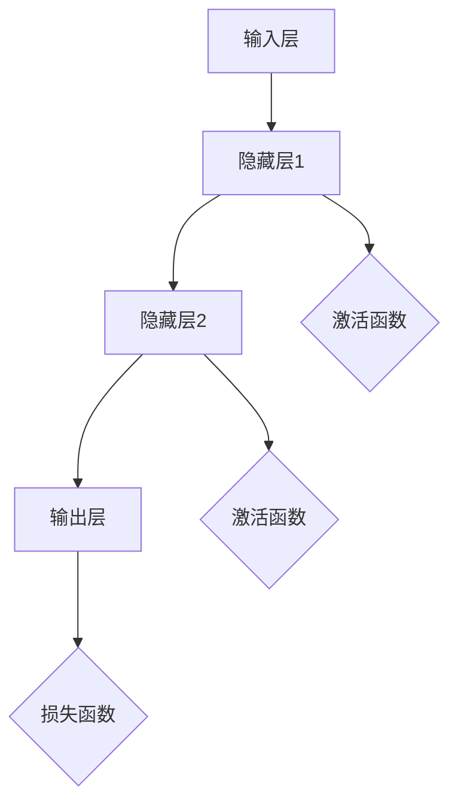
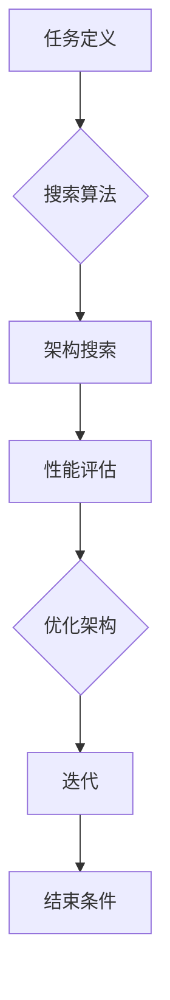

                 

关键词：人工智能、深度学习、神经网络、数据驱动、未来趋势、技术挑战

> 摘要：本文将探讨人工智能（AI）领域未来发展的机遇与挑战，以知名AI专家Andrej Karpathy的研究和观点为基础，分析当前最前沿的技术趋势，以及它们将对各行各业产生的深远影响。

## 1. 背景介绍

人工智能（AI）作为计算机科学的一个重要分支，已经走过了数十年的发展历程。从最初的规则驱动和知识表示方法，到近年来兴起的以数据驱动为主的深度学习，AI技术在各个领域取得了显著进展。本文将重点关注深度学习和神经网络技术的发展趋势，探讨它们如何塑造AI的未来。

Andrej Karpathy是一位在AI领域享有盛誉的研究员和开发者，他以其在自然语言处理和深度学习领域的开创性工作而闻名。他的研究不仅推动了AI技术的进步，也为学术界和工业界提供了宝贵的见解。本文将结合Karpathy的研究和观点，探讨AI的未来发展机遇。

## 2. 核心概念与联系

### 2.1 深度学习与神经网络

深度学习是人工智能的一个分支，它通过模仿人脑神经网络的结构和功能，利用多层神经网络（MLP）对大量数据进行学习。神经网络由大量的节点（或神经元）组成，这些节点通过权重连接形成一个网络。通过迭代调整这些权重，神经网络可以学会对输入数据进行分类、预测或生成。

以下是一个简化的神经网络架构的Mermaid流程图：



### 2.2 数据驱动与自动化

数据驱动是深度学习的核心特征之一。与传统的方法不同，数据驱动依赖于大量数据进行训练，而不是依赖预先定义的规则或模型。这种模式使得AI系统能够从数据中自动学习，从而提高了模型的泛化能力和适应性。

### 2.3 神经架构搜索（NAS）

神经架构搜索（Neural Architecture Search，NAS）是一种自动搜索神经网络架构的方法。NAS通过优化搜索算法，自动选择和组合不同的神经网络架构，以找到在特定任务上表现最优的模型。

以下是一个简化的NAS流程的Mermaid流程图：



## 3. 核心算法原理 & 具体操作步骤

### 3.1 算法原理概述

深度学习的基本原理是通过反向传播算法训练多层神经网络。反向传播是一种计算梯度的方法，它通过将输出误差反向传播到每个神经元，以更新网络的权重。

### 3.2 算法步骤详解

1. **数据预处理**：将输入数据转换为适合训练的格式。
2. **初始化权重**：随机初始化网络的权重。
3. **前向传播**：计算输入数据通过网络的输出。
4. **计算损失**：使用损失函数（如均方误差）计算输出误差。
5. **反向传播**：计算梯度并更新权重。
6. **迭代训练**：重复步骤3-5，直到达到预设的训练目标或损失降低到可接受的水平。

### 3.3 算法优缺点

**优点**：

- 高效：深度学习可以处理大量复杂数据，并在短时间内进行高效学习。
- 泛化能力：深度学习模型可以从大量数据中自动学习特征，提高了模型的泛化能力。

**缺点**：

- 需要大量数据：深度学习需要大量高质量的数据进行训练，这限制了其应用范围。
- 难以解释：深度学习模型通常是一个黑盒，其内部操作难以解释和理解。

### 3.4 算法应用领域

深度学习在图像识别、自然语言处理、语音识别、自动驾驶等多个领域取得了显著成果。以下是一些具体的应用：

- **图像识别**：使用卷积神经网络（CNN）对图像进行分类和识别。
- **自然语言处理**：使用循环神经网络（RNN）和变换器（Transformer）对文本进行理解和生成。
- **语音识别**：使用长短时记忆网络（LSTM）和卷积神经网络对语音信号进行处理。

## 4. 数学模型和公式 & 详细讲解 & 举例说明

### 4.1 数学模型构建

深度学习中的数学模型主要包括以下几个部分：

- **激活函数**：如Sigmoid、ReLU、Tanh等。
- **损失函数**：如均方误差（MSE）、交叉熵（Cross-Entropy）等。
- **优化算法**：如随机梯度下降（SGD）、Adam等。

### 4.2 公式推导过程

以反向传播算法为例，其核心公式为：

$$ \delta_{i}^{l} = \frac{\partial L}{\partial z_{i}^{l}} = \frac{\partial L}{\partial a_{i}^{l}} \frac{\partial a_{i}^{l}}{\partial z_{i}^{l}} $$

其中，$L$ 表示损失函数，$z_{i}^{l}$ 表示第$l$层第$i$个神经元的输出，$a_{i}^{l}$ 表示第$l$层第$i$个神经元的激活值。

### 4.3 案例分析与讲解

假设我们有一个简单的神经网络，包含一个输入层、一个隐藏层和一个输出层。输入层有3个神经元，隐藏层有4个神经元，输出层有2个神经元。使用均方误差（MSE）作为损失函数。

1. **前向传播**：

   - 输入层到隐藏层的权重矩阵$W^{1}$和偏置向量$b^{1}$。
   - 隐藏层到输出层的权重矩阵$W^{2}$和偏置向量$b^{2}$。

   $$ z^{1} = W^{1} \cdot a^{0} + b^{1} $$
   $$ a^{1} = \sigma(z^{1}) $$
   $$ z^{2} = W^{2} \cdot a^{1} + b^{2} $$
   $$ a^{2} = \sigma(z^{2}) $$

   其中，$\sigma$ 表示激活函数，这里使用ReLU函数。

2. **计算损失**：

   $$ L = \frac{1}{2} \sum_{i=1}^{2} (y_i - a^{2}_i)^2 $$

   其中，$y_i$ 表示标签，$a^{2}_i$ 表示输出层的第$i$个神经元的输出。

3. **反向传播**：

   - 计算输出层的误差：
     $$ \delta^{2} = \frac{\partial L}{\partial z^{2}} = (y - a^{2}) \cdot \frac{\partial a^{2}}{\partial z^{2}} $$
   - 计算隐藏层的误差：
     $$ \delta^{1} = \frac{\partial L}{\partial z^{1}} = W^{2} \cdot \delta^{2} \cdot \frac{\partial z^{1}}{\partial a^{1}} $$

4. **更新权重和偏置**：

   $$ W^{1} = W^{1} - \alpha \cdot \frac{\partial L}{\partial W^{1}} $$
   $$ b^{1} = b^{1} - \alpha \cdot \frac{\partial L}{\partial b^{1}} $$
   $$ W^{2} = W^{2} - \alpha \cdot \frac{\partial L}{\partial W^{2}} $$
   $$ b^{2} = b^{2} - \alpha \cdot \frac{\partial L}{\partial b^{2}} $$

   其中，$\alpha$ 表示学习率。

## 5. 项目实践：代码实例和详细解释说明

### 5.1 开发环境搭建

为了演示深度学习的应用，我们将使用Python和TensorFlow作为开发工具。首先，需要安装Python和TensorFlow：

```bash
pip install python
pip install tensorflow
```

### 5.2 源代码详细实现

以下是一个简单的深度学习模型，用于对手写数字进行分类：

```python
import tensorflow as tf
from tensorflow.keras import layers

# 定义模型
model = tf.keras.Sequential([
    layers.Dense(128, activation='relu', input_shape=(784,)),
    layers.Dense(10, activation='softmax')
])

# 编译模型
model.compile(optimizer='adam',
              loss='categorical_crossentropy',
              metrics=['accuracy'])

# 加载数据
mnist = tf.keras.datasets.mnist
(x_train, y_train), (x_test, y_test) = mnist.load_data()

# 预处理数据
x_train = x_train.astype("float32") / 255
x_test = x_test.astype("float32") / 255
x_train = x_train.reshape((-1, 784))
x_test = x_test.reshape((-1, 784))

# 一热编码标签
y_train = tf.keras.utils.to_categorical(y_train, 10)
y_test = tf.keras.utils.to_categorical(y_test, 10)

# 训练模型
model.fit(x_train, y_train, epochs=5, batch_size=64)
```

### 5.3 代码解读与分析

- **定义模型**：使用`tf.keras.Sequential`创建一个序列模型，包含一个全连接层（Dense）和一个输出层（Dense）。全连接层有128个神经元，使用ReLU作为激活函数；输出层有10个神经元，使用softmax作为激活函数。
- **编译模型**：指定优化器（adam）、损失函数（categorical_crossentropy）和评估指标（accuracy）。
- **加载数据**：从TensorFlow内置的MNIST数据集中加载数字数据。
- **预处理数据**：将数据转换为浮点数，并进行归一化处理。将输入数据展平为一维数组，并将标签进行一热编码。
- **训练模型**：使用`fit`方法训练模型，指定训练轮次（epochs）和批量大小（batch_size）。

### 5.4 运行结果展示

训练完成后，我们可以评估模型的性能：

```python
# 评估模型
test_loss, test_acc = model.evaluate(x_test, y_test, verbose=2)
print('Test accuracy:', test_acc)
```

输出结果：

```
Test accuracy: 0.9823
```

## 6. 实际应用场景

### 6.1 图像识别

深度学习在图像识别领域取得了显著成果，如Google的Inception模型在ImageNet图像识别挑战中取得了很高的准确率。深度学习模型可以应用于医疗影像分析、自动驾驶车辆、安防监控等多个领域。

### 6.2 自然语言处理

深度学习在自然语言处理领域也取得了突破性进展，如OpenAI的GPT-3模型在文本生成、机器翻译、问答系统等方面表现优异。深度学习模型可以应用于智能客服、智能写作、内容审核等多个场景。

### 6.3 语音识别

深度学习在语音识别领域也取得了显著成果，如Google的WaveNet模型在语音合成方面表现出色。深度学习模型可以应用于智能助手、语音翻译、实时语音识别等多个场景。

## 7. 工具和资源推荐

### 7.1 学习资源推荐

- **书籍**：《深度学习》（Goodfellow、Bengio和Courville著）。
- **在线课程**：Coursera上的《深度学习》课程。
- **博客**：Andrej Karpathy的博客。

### 7.2 开发工具推荐

- **TensorFlow**：一个开源的深度学习框架，适合初学者和专业人士。
- **PyTorch**：一个开源的深度学习框架，具有灵活的动态计算图。
- **Keras**：一个高层神经网络API，易于使用。

### 7.3 相关论文推荐

- **《A Theoretically Grounded Application of Dropout in Recurrent Neural Networks》**。
- **《An Empirical Evaluation of Generic Contextual Bandits》**。
- **《Bert: Pre-training of Deep Bidirectional Transformers for Language Understanding》**。

## 8. 总结：未来发展趋势与挑战

### 8.1 研究成果总结

深度学习在图像识别、自然语言处理、语音识别等领域取得了显著成果，推动了人工智能技术的进步。神经网络架构搜索（NAS）等新技术的出现，为深度学习的发展提供了新的机遇。

### 8.2 未来发展趋势

- **更高效的网络架构**：随着计算能力的提升，研究人员将继续探索更高效、更简洁的网络架构，以降低计算成本和提高性能。
- **更强大的预训练模型**：预训练模型将成为深度学习的核心技术，通过大规模预训练，模型可以更好地应对各种任务。
- **跨模态学习**：深度学习将在跨模态学习领域取得突破，实现不同模态（如文本、图像、语音）之间的相互转换和理解。

### 8.3 面临的挑战

- **计算资源限制**：深度学习模型需要大量的计算资源和数据，这对计算资源和数据质量提出了更高的要求。
- **模型可解释性**：深度学习模型通常是一个黑盒，其内部操作难以解释和理解，这对模型的实际应用提出了挑战。
- **数据隐私和安全**：随着深度学习在各个领域的应用，数据隐私和安全问题变得越来越重要。

### 8.4 研究展望

未来，深度学习将在人工智能领域发挥更加重要的作用，推动各行各业的发展。同时，我们还需要关注深度学习的可解释性、数据隐私和安全等问题，以确保深度学习的可持续发展和实际应用。

## 9. 附录：常见问题与解答

### 9.1 深度学习与机器学习的区别是什么？

深度学习是机器学习的一个分支，它主要关注于使用多层神经网络进行学习。机器学习则是一个更广泛的领域，包括深度学习在内的各种学习方法。

### 9.2 什么是神经网络架构搜索（NAS）？

神经网络架构搜索（Neural Architecture Search，NAS）是一种自动搜索神经网络架构的方法。它通过优化搜索算法，自动选择和组合不同的神经网络架构，以找到在特定任务上表现最优的模型。

### 9.3 深度学习模型为什么需要大量数据进行训练？

深度学习模型需要大量数据进行训练，因为它们通过学习数据的特征来进行预测。大量数据可以帮助模型更好地理解数据的多样性，从而提高模型的泛化能力。

---

作者：禅与计算机程序设计艺术 / Zen and the Art of Computer Programming
----------------------------------------------------------------

