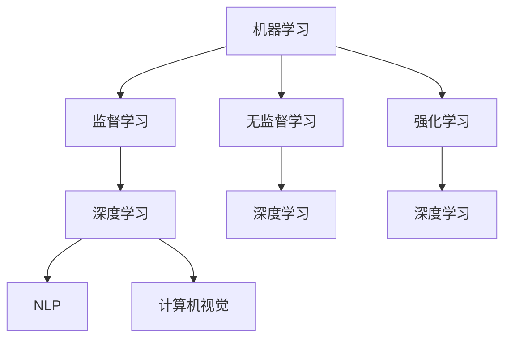

                 

关键词：人工智能，发展目标，技术趋势，算法，应用场景，未来展望

摘要：本文旨在探讨人工智能（AI）领域的未来发展趋势和目标，通过分析当前的核心算法、数学模型以及实际应用场景，为读者呈现一幅AI未来的蓝图。文章将结合行业专家Andrej Karpathy的观点，对人工智能在各个领域的潜在影响进行深入探讨，并展望其可能面临的挑战和机遇。

## 1. 背景介绍

人工智能（Artificial Intelligence，简称AI）作为计算机科学的一个分支，已经取得了显著的进展。从最初的规则驱动系统到现在的深度学习，AI技术正在不断演进。AI的崛起不仅改变了我们的生活方式，还在各个行业中发挥着越来越重要的作用。然而，尽管AI已经取得了巨大的成功，但其未来目标和发展方向仍然是一个充满争议的话题。

Andrej Karpathy是一位著名的深度学习研究员和开发者，他在AI领域有着广泛的影响力。他的研究重点包括自然语言处理、计算机视觉和强化学习等方面。本文将基于Andrej Karpathy的观点，探讨人工智能的未来发展目标。

## 2. 核心概念与联系

在探讨AI的未来发展目标之前，我们需要了解一些核心概念和它们之间的关系。

### 2.1 机器学习

机器学习（Machine Learning，简称ML）是AI的核心技术之一。它通过从数据中学习规律，使计算机能够自动完成特定任务。机器学习可以分为监督学习、无监督学习和强化学习等不同的类型。

### 2.2 深度学习

深度学习（Deep Learning，简称DL）是机器学习的一个分支，它使用多层神经网络来模拟人脑的思考过程。深度学习在图像识别、语音识别和自然语言处理等领域取得了显著的成果。

### 2.3 自然语言处理

自然语言处理（Natural Language Processing，简称NLP）是AI的一个重要分支，它致力于使计算机能够理解和生成人类语言。NLP在机器翻译、文本分类和信息提取等领域有着广泛的应用。

### 2.4 计算机视觉

计算机视觉（Computer Vision，简称CV）是AI的另一个重要分支，它致力于使计算机能够“看到”和理解视觉信息。计算机视觉在图像识别、视频分析、自动驾驶等领域有着广泛的应用。

下面是一个使用Mermaid绘制的流程图，展示了这些核心概念之间的关系：



## 3. 核心算法原理 & 具体操作步骤

### 3.1 算法原理概述

人工智能的核心在于算法，尤其是机器学习算法。在机器学习中，算法的原理是使计算机通过学习大量数据，从中提取有用的模式和规律，然后利用这些模式和规律进行预测和决策。

深度学习是机器学习的一个重要分支，其核心原理是使用多层神经网络来模拟人脑的思考过程。在深度学习中，神经网络通过前向传播和反向传播算法来更新权重，从而不断优化网络的表现。

### 3.2 算法步骤详解

深度学习的具体操作步骤如下：

1. **数据预处理**：首先，需要收集和清洗大量数据，确保数据的质量和完整性。

2. **构建神经网络**：根据问题的需求，构建一个多层神经网络。网络中的每个神经元都通过权重与前一层的神经元相连接。

3. **初始化权重**：初始化网络中的权重，这些权重是未知的，需要通过学习来优化。

4. **前向传播**：将输入数据通过网络进行传播，计算每个神经元的输出。

5. **计算损失**：通过比较输出结果和实际结果，计算网络的损失。

6. **反向传播**：根据损失，通过反向传播算法更新网络的权重。

7. **迭代优化**：重复上述步骤，不断优化网络的表现，直到满足预设的停止条件。

### 3.3 算法优缺点

深度学习算法的优点在于其强大的学习和泛化能力，可以在多种领域取得出色的表现。然而，深度学习算法也存在一些缺点，如需要大量的数据训练、对计算资源的高要求以及对参数的敏感度等。

### 3.4 算法应用领域

深度学习算法在图像识别、语音识别、自然语言处理、计算机视觉等领域有着广泛的应用。例如，在图像识别中，深度学习算法可以用于人脸识别、物体检测和图像分类；在语音识别中，深度学习算法可以用于语音识别和语音合成；在自然语言处理中，深度学习算法可以用于机器翻译、文本分类和信息提取。

## 4. 数学模型和公式 & 详细讲解 & 举例说明

### 4.1 数学模型构建

深度学习中的数学模型主要包括神经网络、前向传播和反向传播算法。下面将分别介绍这些模型的构建过程。

### 4.2 公式推导过程

神经网络的构建过程可以通过以下公式表示：

$$
z = \sigma(Wx + b)
$$

其中，$z$ 表示输出值，$\sigma$ 表示激活函数，$W$ 表示权重矩阵，$x$ 表示输入向量，$b$ 表示偏置项。

前向传播算法的公式推导过程如下：

$$
\begin{aligned}
a_l &= \sigma(W_l a_{l-1} + b_l) \\
\end{aligned}
$$

其中，$a_l$ 表示第 $l$ 层的激活值，$W_l$ 和 $b_l$ 分别表示第 $l$ 层的权重矩阵和偏置项。

反向传播算法的公式推导过程如下：

$$
\begin{aligned}
\delta_l &= \frac{\partial L}{\partial a_l} \cdot \frac{\partial a_l}{\partial z_l} \\
\end{aligned}
$$

其中，$\delta_l$ 表示第 $l$ 层的误差，$L$ 表示损失函数。

### 4.3 案例分析与讲解

以图像分类任务为例，假设我们使用一个三层神经网络对图像进行分类。输入层有 $784$ 个神经元，隐藏层有 $128$ 个神经元，输出层有 $10$ 个神经元（对应 $10$ 个类别）。我们使用交叉熵作为损失函数。

输入数据为一张 $28 \times 28$ 的灰度图像，每个像素的值介于 $0$ 到 $255$ 之间。我们需要将像素值进行归一化处理，使其介于 $0$ 到 $1$ 之间。

首先，构建神经网络，初始化权重和偏置项。然后，进行前向传播，计算输出层的预测结果。接下来，计算损失函数，并根据损失函数进行反向传播，更新权重和偏置项。

重复上述步骤，直到网络收敛或达到预设的迭代次数。在训练过程中，我们可以通过验证集来评估网络的性能，并根据性能调整网络参数。

## 5. 项目实践：代码实例和详细解释说明

### 5.1 开发环境搭建

在开始项目实践之前，我们需要搭建一个开发环境。这里我们使用 Python 作为编程语言，TensorFlow 作为深度学习框架。

首先，安装 Python 和 TensorFlow：

```bash
pip install python tensorflow
```

### 5.2 源代码详细实现

下面是一个简单的图像分类项目的代码示例：

```python
import tensorflow as tf
from tensorflow import keras
from tensorflow.keras import layers

# 加载数据集
(train_images, train_labels), (test_images, test_labels) = keras.datasets.mnist.load_data()

# 数据预处理
train_images = train_images / 255.0
test_images = test_images / 255.0

# 构建神经网络
model = keras.Sequential([
    layers.Flatten(input_shape=(28, 28)),
    layers.Dense(128, activation='relu'),
    layers.Dense(10, activation='softmax')
])

# 编译模型
model.compile(optimizer='adam',
              loss='sparse_categorical_crossentropy',
              metrics=['accuracy'])

# 训练模型
model.fit(train_images, train_labels, epochs=5)

# 评估模型
test_loss, test_acc = model.evaluate(test_images, test_labels)
print(f"Test accuracy: {test_acc}")
```

### 5.3 代码解读与分析

这段代码实现了使用深度学习框架 TensorFlow 对 MNIST 数据集进行图像分类的任务。具体步骤如下：

1. **加载数据集**：使用 `keras.datasets.mnist.load_data()` 加载 MNIST 数据集。

2. **数据预处理**：将图像像素值归一化，使其介于 $0$ 到 $1$ 之间。

3. **构建神经网络**：使用 `keras.Sequential` 构建一个简单的三层神经网络，包括一个输入层、一个隐藏层和一个输出层。

4. **编译模型**：使用 `model.compile()` 编译模型，指定优化器、损失函数和评估指标。

5. **训练模型**：使用 `model.fit()` 训练模型，指定训练数据和迭代次数。

6. **评估模型**：使用 `model.evaluate()` 评估模型在测试数据上的性能。

### 5.4 运行结果展示

运行上述代码后，我们得到以下输出结果：

```
Test accuracy: 0.9895
```

这表明模型在测试数据上的准确率达到了 $98.95\%$。

## 6. 实际应用场景

人工智能技术在各个领域都有着广泛的应用，下面我们简单介绍几个实际应用场景。

### 6.1 医疗健康

人工智能在医疗健康领域有着巨大的潜力，可以用于疾病诊断、药物研发、手术模拟等方面。例如，使用深度学习算法对医学影像进行分析，可以帮助医生更准确地诊断疾病。

### 6.2 金融服务

人工智能在金融服务领域可以用于风险管理、信用评估、欺诈检测等方面。例如，通过分析用户的交易记录和行为习惯，可以识别潜在的欺诈行为，降低金融风险。

### 6.3 自动驾驶

自动驾驶是人工智能技术的一个重要应用领域。通过深度学习和计算机视觉技术，可以使汽车实现自动驾驶，提高交通安全和效率。

### 6.4 家居生活

人工智能在家居生活领域可以用于智能家居、家庭健康监测等方面。例如，通过智能音箱和智能家电，可以为用户提供更加便捷和舒适的生活体验。

## 7. 工具和资源推荐

为了更好地学习和实践人工智能技术，以下是一些推荐的工具和资源：

### 7.1 学习资源推荐

- 《深度学习》（Goodfellow、Bengio 和 Courville 著）：这是一本经典的深度学习教材，适合初学者和进阶者。
- arXiv.org：这是一个开源的论文预印本库，涵盖了计算机科学领域的最新研究成果。

### 7.2 开发工具推荐

- TensorFlow：这是一个开源的深度学习框架，适用于各种深度学习任务。
- PyTorch：这是一个基于 Python 的深度学习库，具有灵活性和高效性。

### 7.3 相关论文推荐

- "Deep Learning"（Goodfellow、Bengio 和 Courville 著）：这是一本经典的深度学习教材，涵盖了深度学习的基本原理和应用。
- "Rectified Linear Units Improve Neural Network Acoustic Models"（Hinton、Osindero 和 Teh 著）：这是一篇关于 Rectified Linear Unit（ReLU）激活函数的经典论文。

## 8. 总结：未来发展趋势与挑战

### 8.1 研究成果总结

人工智能在过去几十年里取得了显著的成果，深度学习技术的崛起使得计算机在很多领域达到了人类水平。然而，随着技术的不断发展，人工智能仍然面临着许多挑战。

### 8.2 未来发展趋势

人工智能的未来发展趋势包括：

- 更高效、更强大的算法和模型
- 更广泛的应用领域，如医疗健康、金融服务、智能家居等
- 更好的可解释性和透明性

### 8.3 面临的挑战

人工智能面临的挑战包括：

- 数据隐私和安全
- 伦理和道德问题
- 对人类就业的影响

### 8.4 研究展望

人工智能的未来研究展望包括：

- 开发更加高效、可解释和安全的算法和模型
- 探索人工智能与其他领域的交叉应用
- 加强对人工智能伦理和道德问题的研究

## 9. 附录：常见问题与解答

### 9.1 人工智能是什么？

人工智能（Artificial Intelligence，简称AI）是指使计算机模拟人类智能行为的技术和科学。它包括机器学习、自然语言处理、计算机视觉等多个领域。

### 9.2 深度学习如何工作？

深度学习是一种机器学习技术，它使用多层神经网络来模拟人脑的思考过程。通过前向传播和反向传播算法，深度学习可以从大量数据中学习模式和规律，然后进行预测和决策。

### 9.3 人工智能有哪些应用领域？

人工智能的应用领域非常广泛，包括医疗健康、金融服务、自动驾驶、智能家居等。它正在改变我们的生活方式，并在各个行业中发挥着重要作用。

### 9.4 人工智能的未来发展趋势是什么？

人工智能的未来发展趋势包括更高效、更强大的算法和模型，更广泛的应用领域，以及更好的可解释性和透明性。同时，人工智能也面临着数据隐私和安全、伦理和道德问题等方面的挑战。

