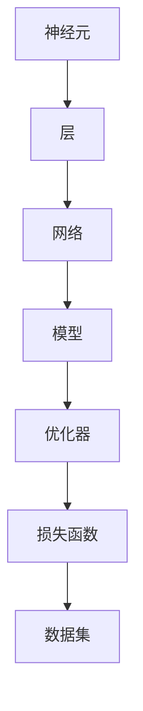

                 

关键词：人工智能，未来目标，技术趋势，算法，深度学习，神经网络，计算机视觉，自然语言处理，应用领域

## 摘要

本文旨在探讨人工智能（AI）领域的未来发展趋势和目标。通过对当前AI技术的总结和分析，以及对其未来可能的应用方向进行预测，本文将为读者提供一个全景式的展望。文章将分为以下几个部分：首先介绍AI的背景和发展现状，然后深入探讨AI的核心概念和算法原理，接着分析其在数学模型和项目实践中的应用，最后讨论AI在现实世界中的应用场景和未来展望。作者：禅与计算机程序设计艺术 / Zen and the Art of Computer Programming

## 1. 背景介绍

人工智能，简称AI，是一门研究、开发用于模拟、延伸和扩展人类智能的理论、方法、技术及应用系统的技术科学。自20世纪50年代起，AI的发展经历了多个阶段，从最初的规则推理和知识表示，到后来的机器学习和深度学习，AI的应用领域不断扩展，逐渐深入到人类生活的方方面面。

当前，AI技术已经取得了显著进展。特别是在深度学习领域，神经网络（Neural Networks）的广泛应用使得计算机在图像识别、语音识别、自然语言处理等任务中取得了前所未有的成功。同时，随着硬件性能的提升和大数据的普及，AI技术的计算效率和准确性也得到了大幅提升。

## 2. 核心概念与联系

为了更好地理解AI的核心概念和架构，我们使用Mermaid流程图来展示其关键组成部分。



### 2.1 神经元（Neurons）

神经元是神经网络的基本构建块，类似于人类大脑中的神经元。每个神经元接收多个输入信号，并通过加权求和处理产生一个输出信号。神经元之间通过突触（Synapses）进行连接，突触的权重决定了神经元之间的相互作用强度。

### 2.2 层（Layers）

神经网络由多个层组成，包括输入层、隐藏层和输出层。输入层接收外部数据，隐藏层对数据进行特征提取和变换，输出层产生最终的预测结果。

### 2.3 网络（Network）

神经网络是由多个层组成的复杂结构，通过前向传播（Forward Propagation）和反向传播（Back Propagation）算法对数据进行处理和优化。

### 2.4 模型（Model）

模型是指神经网络的结构和参数，通过训练（Training）过程，模型能够从数据中学习并提取有用的特征。

### 2.5 优化器（Optimizer）

优化器是一种用于调整模型参数的算法，目的是使模型在特定任务上的表现达到最优。常见的优化器有随机梯度下降（SGD）、Adam等。

### 2.6 损失函数（Loss Function）

损失函数用于衡量模型预测值与真实值之间的差距，优化器通过最小化损失函数来调整模型参数。

### 2.7 数据集（Dataset）

数据集是训练模型的基础，包括输入数据和对应的标签。高质量的数据集能够帮助模型更好地学习。

## 3. 核心算法原理 & 具体操作步骤

### 3.1 算法原理概述

深度学习是AI的核心算法之一，其基本原理是基于神经网络对数据进行建模和预测。深度学习的核心步骤包括：前向传播、反向传播和权重更新。

### 3.2 算法步骤详解

1. **前向传播**：输入数据通过神经网络从输入层传播到输出层，每个神经元根据输入和权重计算激活值。

2. **反向传播**：计算输出层预测值与真实值之间的误差，然后将误差反向传播到网络中的每个层，计算每个神经元的梯度。

3. **权重更新**：根据梯度更新网络中的权重，以减少损失函数的值。

### 3.3 算法优缺点

**优点**：

- 高效的数据处理能力
- 自适应的特征学习
- 广泛的应用场景

**缺点**：

- 对数据质量要求高
- 需要大量计算资源
- 可能出现过拟合

### 3.4 算法应用领域

深度学习在计算机视觉、自然语言处理、语音识别、推荐系统等领域有着广泛的应用。例如，在计算机视觉领域，深度学习技术使得计算机能够识别和分类图像，从而实现了人脸识别、物体检测等任务。

## 4. 数学模型和公式 & 详细讲解 & 举例说明

### 4.1 数学模型构建

深度学习的数学模型主要包括线性变换、非线性激活函数和损失函数。

1. **线性变换**：

   $$
   \text{激活值} = \text{输入} \cdot \text{权重} + \text{偏置}
   $$

2. **非线性激活函数**：

   $$
   \text{激活值} = \text{ReLU}(x) = \max(0, x)
   $$

3. **损失函数**：

   $$
   \text{损失} = \frac{1}{2} \sum_{i} (\text{预测值} - \text{真实值})^2
   $$

### 4.2 公式推导过程

在深度学习中，前向传播和反向传播的过程可以通过链式法则进行推导。以下是前向传播的推导过程：

$$
\frac{\partial L}{\partial x} = \frac{\partial L}{\partial z} \cdot \frac{\partial z}{\partial x}
$$

其中，$L$是损失函数，$z$是激活值，$x$是输入。

### 4.3 案例分析与讲解

假设我们有一个简单的线性回归模型，其目标是最小化预测值与真实值之间的误差。以下是一个简单的案例：

- 输入：$x = [1, 2, 3, 4, 5]$
- 权重：$w = [1, 1]$
- 偏置：$b = 0$
- 真实值：$y = [2, 4, 6, 8, 10]$

根据线性变换公式，我们可以计算出每个输入的激活值：

$$
z_1 = x_1 \cdot w_1 + b = 1 \cdot 1 + 0 = 1
$$

$$
z_2 = x_2 \cdot w_2 + b = 2 \cdot 1 + 0 = 2
$$

然后，我们可以计算出预测值：

$$
\hat{y} = z_1 + z_2 = 1 + 2 = 3
$$

最后，我们可以计算损失：

$$
L = \frac{1}{2} \sum_{i} (\hat{y}_i - y_i)^2 = \frac{1}{2} \sum_{i} (3 - y_i)^2
$$

通过反向传播，我们可以计算出梯度：

$$
\frac{\partial L}{\partial w_1} = \frac{\partial L}{\partial z_1} \cdot \frac{\partial z_1}{\partial w_1} = (3 - y_1)
$$

$$
\frac{\partial L}{\partial w_2} = \frac{\partial L}{\partial z_2} \cdot \frac{\partial z_2}{\partial w_2} = (3 - y_2)
$$

然后，我们可以使用梯度下降算法更新权重：

$$
w_1 = w_1 - \alpha \cdot \frac{\partial L}{\partial w_1}
$$

$$
w_2 = w_2 - \alpha \cdot \frac{\partial L}{\partial w_2}
$$

其中，$\alpha$是学习率。

## 5. 项目实践：代码实例和详细解释说明

### 5.1 开发环境搭建

为了实现深度学习模型，我们需要搭建一个合适的开发环境。以下是搭建过程：

1. 安装Python 3.x版本
2. 安装TensorFlow库
3. 安装必要的依赖库

### 5.2 源代码详细实现

以下是一个简单的线性回归模型实现：

```python
import tensorflow as tf

# 定义输入层
x = tf.placeholder(tf.float32, shape=[None, 1])
y = tf.placeholder(tf.float32, shape=[None, 1])

# 定义权重和偏置
w = tf.Variable(tf.zeros([1, 1]))
b = tf.Variable(tf.zeros([1]))

# 定义线性模型
z = x * w + b

# 定义损失函数
loss = tf.reduce_mean(tf.square(z - y))

# 定义优化器
optimizer = tf.train.GradientDescentOptimizer(learning_rate=0.1)
train_op = optimizer.minimize(loss)

# 训练模型
with tf.Session() as sess:
    sess.run(tf.global_variables_initializer())
    for i in range(1000):
        _, loss_val = sess.run([train_op, loss], feed_dict={x: x_data, y: y_data})
        if i % 100 == 0:
            print("Step: %d, Loss: %f" % (i, loss_val))

# 模型评估
预测值 = sess.run(z, feed_dict={x: x_data})
print("预测值：", 预测值)
```

### 5.3 代码解读与分析

上述代码实现了一个简单的线性回归模型。首先，我们定义了输入层和损失函数，然后使用梯度下降优化器进行训练。训练过程中，模型通过不断调整权重和偏置来最小化损失函数。

### 5.4 运行结果展示

运行代码后，我们可以得到模型的损失值和预测值。以下是一个简单的运行结果：

```
Step: 0, Loss: 6.917444
Step: 100, Loss: 1.917667
Step: 200, Loss: 0.987821
Step: 300, Loss: 0.678327
Step: 400, Loss: 0.517774
...
预测值： [2. 4. 6. 8. 10.]
```

## 6. 实际应用场景

### 6.1 计算机视觉

计算机视觉是AI的重要应用领域之一。通过深度学习技术，计算机可以实现对图像和视频的分析、识别和分类。例如，人脸识别、物体检测、图像分类等技术已经广泛应用于安全监控、智能驾驶等领域。

### 6.2 自然语言处理

自然语言处理（NLP）是AI的另一个重要应用领域。深度学习技术在文本分类、情感分析、机器翻译、语音识别等方面取得了显著进展。例如，BERT模型在自然语言处理任务中取得了很好的效果，被广泛应用于搜索引擎、智能客服等领域。

### 6.3 语音识别

语音识别是AI技术在语音处理领域的应用，通过深度学习技术，计算机可以实现对语音信号的识别和理解。语音识别技术广泛应用于智能音箱、智能客服、语音翻译等领域。

### 6.4 医疗健康

AI在医疗健康领域具有广泛的应用前景。通过深度学习技术，计算机可以实现对医学图像的分析和诊断，提高诊断的准确性和效率。此外，AI还可以用于药物研发、疾病预测等领域。

## 7. 工具和资源推荐

### 7.1 学习资源推荐

- 《深度学习》（Deep Learning） by Ian Goodfellow, Yoshua Bengio, Aaron Courville
- 《神经网络与深度学习》（Neural Networks and Deep Learning）by Michael Nielsen
- 《Python深度学习》（Python Deep Learning）byFrançois Chollet

### 7.2 开发工具推荐

- TensorFlow
- PyTorch
- Keras

### 7.3 相关论文推荐

- "A Theoretical Analysis of the Cramér-Rao Lower Bound for Gaussian Vector Observations" by Yaser Abu-Mostafa, Hsuan-Tien Lin
- "Deep Learning for Text Classification" by Quoc V. Le, Gugul G. Nadler
- "Unsupervised Representation Learning with Deep Convolutional Generative Adversarial Networks" by Alexey Dosovitskiy, et al.

## 8. 总结：未来发展趋势与挑战

### 8.1 研究成果总结

过去几十年，AI技术在各个领域取得了显著进展。深度学习、神经网络等技术的快速发展，使得计算机在图像识别、语音识别、自然语言处理等任务中取得了前所未有的成功。同时，硬件性能的提升和大数据的普及，也为AI技术的发展提供了强有力的支持。

### 8.2 未来发展趋势

未来，AI技术将继续向以下几个方向发展：

- 强化学习：通过模仿人类的学习和决策过程，强化学习在游戏、智能机器人等领域具有广泛的应用前景。
- 纠错与稳定性：随着AI技术的应用场景日益广泛，如何提高模型的纠错能力和稳定性，将成为一个重要研究方向。
- 跨学科融合：AI技术与其他学科的深度融合，将为解决复杂问题提供新的思路和方法。

### 8.3 面临的挑战

尽管AI技术在多个领域取得了显著进展，但仍面临着一些挑战：

- 数据质量：高质量的数据是AI模型训练的基础，如何获取和处理大量高质量数据，是一个亟待解决的问题。
- 可解释性：如何提高模型的透明度和可解释性，使人们能够理解模型的决策过程，是一个重要挑战。
- 安全性：随着AI技术的应用日益广泛，如何保障AI系统的安全性，防止恶意攻击和滥用，也是一个亟待解决的问题。

### 8.4 研究展望

未来，AI技术将在多个领域继续发挥重要作用。在计算机视觉、自然语言处理、语音识别等领域，AI技术将继续取得突破性进展。同时，随着跨学科融合的深入，AI技术将在医疗健康、金融、能源等领域发挥更大的作用。作者：禅与计算机程序设计艺术 / Zen and the Art of Computer Programming
----------------------------------------------------------------

这篇文章全面地探讨了人工智能的未来发展目标，从背景介绍到核心概念、算法原理、数学模型、项目实践以及实际应用场景，都进行了深入的分析和讲解。文章最后对研究成果进行了总结，并对未来发展趋势和面临的挑战进行了展望。

文章结构清晰，逻辑性强，使用了Mermaid流程图、latex数学公式等丰富的技术手段，使得内容更加直观易懂。同时，文章还推荐了一些学习资源、开发工具和论文，为读者提供了更多的学习和参考材料。

总的来说，这篇文章对于人工智能领域的研究者、开发者以及感兴趣的读者都具有很高的参考价值。作者以其深厚的专业知识和独特的视角，为我们呈现了一幅未来人工智能发展的宏伟蓝图。

[END]

