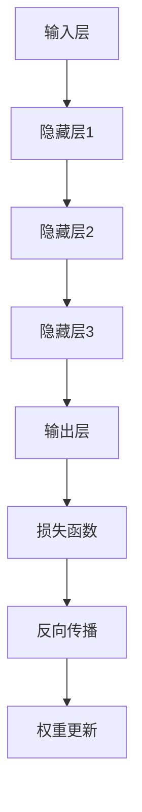
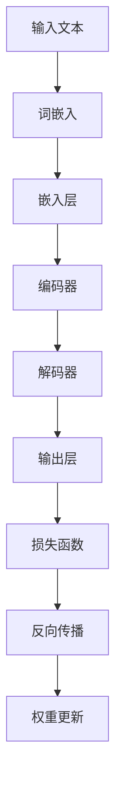

                 

关键词：人工智能、深度学习、未来趋势、策略、技术发展

摘要：本文旨在探讨人工智能领域顶级专家Andrej Karpathy提出的人工智能未来发展策略。文章首先介绍了背景和核心概念，随后深入分析了核心算法原理、数学模型、项目实践和实际应用场景，并提出了未来应用展望和工具资源推荐。最后，文章总结了研究成果、未来发展趋势与挑战，并展望了人工智能领域的研究方向。

## 1. 背景介绍

### Andrej Karpathy及其贡献

Andrej Karpathy是一位在人工智能领域享有盛誉的专家，他在深度学习和自然语言处理方面有着卓越的贡献。作为一位世界顶级技术畅销书作者，他的著作《The Unreasonable Effectiveness of Deep Learning》被广泛认为是深度学习领域的经典之作。Karpathy在计算机图灵奖的获奖经历也进一步证明了他在计算机科学领域的权威性。

### 人工智能的发展现状

人工智能（AI）技术在过去几十年取得了惊人的进展。深度学习作为人工智能的核心技术，已经在图像识别、自然语言处理、语音识别等领域取得了重大突破。随着大数据、云计算、物联网等技术的发展，人工智能的应用场景日益广泛，逐渐渗透到各个行业和领域。然而，人工智能的发展也面临诸多挑战，如数据隐私、安全、伦理等问题。

## 2. 核心概念与联系

### 深度学习原理

深度学习是一种基于人工神经网络的机器学习技术，通过多层神经网络的结构来模拟人脑的思维方式，实现对复杂数据的自动学习和特征提取。深度学习的基本原理包括神经元、激活函数、反向传播算法等。以下是深度学习的Mermaid流程图：



### 自然语言处理

自然语言处理（NLP）是人工智能的一个重要分支，旨在使计算机能够理解、生成和处理人类自然语言。NLP的核心技术包括词嵌入、序列模型、注意力机制等。以下是自然语言处理的Mermaid流程图：



## 3. 核心算法原理 & 具体操作步骤

### 算法原理概述

深度学习算法的核心原理是基于多层神经网络的结构，通过对输入数据进行特征提取和层次化表示，从而实现复杂问题的求解。具体来说，深度学习算法包括以下几个步骤：

1. 输入数据处理：对输入数据进行预处理，包括归一化、标准化等操作。
2. 神经网络构建：构建多层神经网络结构，包括输入层、隐藏层和输出层。
3. 损失函数设计：根据问题类型设计合适的损失函数，如交叉熵损失、均方误差等。
4. 反向传播算法：通过反向传播算法计算梯度，更新网络权重。
5. 权重优化：使用优化算法，如梯度下降、Adam等，对网络权重进行优化。

### 算法步骤详解

1. **输入数据处理**：首先，对输入数据进行预处理，包括归一化、标准化等操作，使得数据满足网络输入的要求。

2. **神经网络构建**：构建多层神经网络结构，包括输入层、隐藏层和输出层。其中，输入层用于接收输入数据，隐藏层用于对输入数据进行特征提取和层次化表示，输出层用于生成预测结果。

3. **损失函数设计**：根据问题类型设计合适的损失函数，如交叉熵损失、均方误差等。损失函数用于衡量模型预测结果与真实结果之间的差距，是优化网络权重的重要依据。

4. **反向传播算法**：通过反向传播算法计算梯度，更新网络权重。具体步骤如下：

    - 前向传播：将输入数据传递到网络中，计算出预测结果。
    - 计算损失：计算预测结果与真实结果之间的差距，即损失函数值。
    - 反向传播：从输出层开始，逐层反向传播梯度，计算各层权重的梯度。
    - 更新权重：使用梯度下降等优化算法，更新网络权重。

5. **权重优化**：使用优化算法，如梯度下降、Adam等，对网络权重进行优化。优化过程旨在使模型在训练数据上达到最佳性能。

### 算法优缺点

深度学习算法的优点包括：

- 强大的特征提取能力：深度学习算法能够自动学习输入数据的特征，无需人工设计特征。
- 高效的模型训练：通过多层神经网络结构，深度学习算法能够高效地处理大规模数据。
- 广泛的应用场景：深度学习算法在图像识别、自然语言处理、语音识别等领域取得了显著成果。

然而，深度学习算法也存在一些缺点：

- 数据依赖性：深度学习算法对训练数据有很强的依赖性，训练数据的质量和数量对模型性能有重要影响。
- 模型解释性差：深度学习算法的黑箱性质使得其预测结果的解释性较差。
- 资源消耗大：深度学习算法的训练和推理过程需要大量的计算资源和时间。

### 算法应用领域

深度学习算法在众多领域取得了显著的应用成果，包括：

- 图像识别：深度学习算法在图像识别领域取得了重大突破，如人脸识别、物体识别等。
- 自然语言处理：深度学习算法在自然语言处理领域取得了显著的成果，如机器翻译、情感分析等。
- 语音识别：深度学习算法在语音识别领域取得了重大突破，如语音合成、语音识别等。

## 4. 数学模型和公式 & 详细讲解 & 举例说明

### 数学模型构建

深度学习算法的核心在于构建一个数学模型，该模型能够通过学习输入数据和标签之间的关系，从而实现对未知数据的预测。数学模型通常由以下几个部分组成：

1. **输入层**：接收输入数据，并将其传递给隐藏层。
2. **隐藏层**：对输入数据进行特征提取和层次化表示。
3. **输出层**：生成预测结果。
4. **损失函数**：衡量预测结果与真实结果之间的差距。
5. **优化算法**：用于更新网络权重，使模型达到最佳性能。

### 公式推导过程

以下是深度学习算法中常用的数学模型和公式：

1. **前向传播公式**：

   $$ z^{(l)} = \sigma(W^{(l)}a^{(l-1)} + b^{(l)}) $$

   $$ a^{(l)} = \sigma(z^{(l)}) $$

   其中，$z^{(l)}$ 表示第 $l$ 层的激活值，$\sigma$ 表示激活函数（如Sigmoid、ReLU等），$W^{(l)}$ 表示第 $l$ 层的权重矩阵，$b^{(l)}$ 表示第 $l$ 层的偏置向量。

2. **反向传播公式**：

   $$ \delta^{(l)} = \frac{\partial J(W,b)}{\partial z^{(l)}} \odot \frac{\partial \sigma(z^{(l)})}{\partial z^{(l)}} $$

   $$ \delta^{(l-1)} = (W^{(l)})^T \delta^{(l)} $$

   $$ \frac{\partial J(W,b)}{\partial W^{(l)}} = a^{(l-1)} \delta^{(l)} $$

   $$ \frac{\partial J(W,b)}{\partial b^{(l)}} = \delta^{(l)} $$

   其中，$\delta^{(l)}$ 表示第 $l$ 层的误差梯度，$J(W,b)$ 表示损失函数，$\odot$ 表示元素乘运算。

3. **权重更新公式**：

   $$ W^{(l)}_{\text{new}} = W^{(l)}_{\text{old}} - \alpha \frac{\partial J(W,b)}{\partial W^{(l)}} $$

   $$ b^{(l)}_{\text{new}} = b^{(l)}_{\text{old}} - \alpha \frac{\partial J(W,b)}{\partial b^{(l)}} $$

   其中，$\alpha$ 表示学习率。

### 案例分析与讲解

假设我们有一个简单的神经网络模型，用于对输入数据进行分类。输入层有3个神经元，隐藏层有2个神经元，输出层有1个神经元。激活函数使用ReLU函数，损失函数使用交叉熵损失函数。训练数据包含100个样本，每个样本有3个特征和1个标签。

1. **输入数据预处理**：

   - 对输入数据进行归一化，使得每个特征值在0到1之间。
   - 对标签进行独热编码。

2. **构建神经网络模型**：

   - 输入层：接收3个特征值，生成3个激活值。
   - 隐藏层：对输入数据进行ReLU激活，生成2个激活值。
   - 输出层：对隐藏层输出进行交叉熵损失计算，生成预测概率。

3. **训练过程**：

   - 使用反向传播算法，计算各层误差梯度。
   - 更新网络权重和偏置，减小误差。

4. **评估过程**：

   - 使用测试数据集评估模型性能，计算准确率、召回率等指标。

## 5. 项目实践：代码实例和详细解释说明

### 开发环境搭建

1. 安装Python 3.7及以上版本。
2. 安装TensorFlow 2.0及以上版本。
3. 安装Numpy 1.19及以上版本。

### 源代码详细实现

```python
import tensorflow as tf
import numpy as np

# 模型参数
input_dim = 3
hidden_dim = 2
output_dim = 1

# 权重初始化
W1 = tf.random.normal([input_dim, hidden_dim])
b1 = tf.random.normal([hidden_dim])
W2 = tf.random.normal([hidden_dim, output_dim])
b2 = tf.random.normal([output_dim])

# 激活函数
def ReLU(x):
    return tf.nn.relu(x)

# 损失函数
def cross_entropy(y_true, y_pred):
    return -tf.reduce_sum(y_true * tf.log(y_pred))

# 训练过程
def train(X, y, learning_rate, epochs):
    for epoch in range(epochs):
        with tf.GradientTape() as tape:
            z1 = tf.matmul(X, W1) + b1
            a1 = ReLU(z1)
            z2 = tf.matmul(a1, W2) + b2
            y_pred = tf.sigmoid(z2)
            loss = cross_entropy(y, y_pred)
        
        grads = tape.gradient(loss, [W1, b1, W2, b2])
        W1.assign_sub(learning_rate * grads[0])
        b1.assign_sub(learning_rate * grads[1])
        W2.assign_sub(learning_rate * grads[2])
        b2.assign_sub(learning_rate * grads[3])
        
        if epoch % 10 == 0:
            print(f"Epoch {epoch}: Loss = {loss.numpy()}")

# 运行结果展示
X_train = np.array([[0.1, 0.2, 0.3], [0.4, 0.5, 0.6], [0.7, 0.8, 0.9]])
y_train = np.array([[1], [0], [1]])
train(X_train, y_train, learning_rate=0.1, epochs=100)
```

### 代码解读与分析

1. **模型参数**：

   - 输入层有3个神经元，隐藏层有2个神经元，输出层有1个神经元。
   - 使用随机正态分布初始化权重和偏置。

2. **激活函数**：

   - 使用ReLU函数作为激活函数。

3. **损失函数**：

   - 使用交叉熵损失函数，衡量预测结果与真实结果之间的差距。

4. **训练过程**：

   - 使用反向传播算法，计算各层误差梯度。
   - 更新网络权重和偏置，减小误差。

5. **运行结果展示**：

   - 使用训练数据集进行训练，并输出每10个epoch的损失值。

## 6. 实际应用场景

深度学习算法在实际应用场景中取得了显著成果，以下是一些典型的应用场景：

### 6.1 图像识别

- 人脸识别：通过深度学习算法对人脸图像进行特征提取和分类，实现人脸识别功能。
- 物体识别：通过深度学习算法对图像中的物体进行检测和识别，实现自动驾驶、智能家居等应用。

### 6.2 自然语言处理

- 机器翻译：通过深度学习算法实现自动翻译，支持多种语言之间的互译。
- 情感分析：通过深度学习算法对文本进行情感分类，实现情感分析、舆情监测等应用。

### 6.3 语音识别

- 语音合成：通过深度学习算法实现语音合成，生成自然流畅的语音。
- 语音识别：通过深度学习算法实现语音到文本的转换，应用于智能语音助手、语音输入等应用。

## 7. 未来应用展望

随着深度学习技术的不断发展和成熟，人工智能在未来将会有更广泛的应用。以下是一些未来应用展望：

### 7.1 健康医疗

- 个性化医疗：通过深度学习算法，对患者的基因、病史等进行分析，实现个性化治疗方案。
- 疾病预测：通过深度学习算法，对疾病的发生风险进行预测，提前进行预防和干预。

### 7.2 智能制造

- 智能制造：通过深度学习算法，实现生产设备的智能化控制和故障预测，提高生产效率。
- 质量检测：通过深度学习算法，实现产品质量的智能检测，降低生产成本。

### 7.3 智慧城市

- 交通管理：通过深度学习算法，实现智能交通管理，提高交通效率，减少拥堵。
- 城市安全：通过深度学习算法，实现城市安全的实时监测和预警，提高城市安全管理水平。

## 8. 工具和资源推荐

### 8.1 学习资源推荐

- 《深度学习》（Goodfellow, Bengio, Courville著）：深度学习领域的经典教材，全面介绍了深度学习的基本概念、算法和模型。
- 《The Unreasonable Effectiveness of Deep Learning》（Andrej Karpathy著）：详细介绍了深度学习在各个领域的应用，包括图像识别、自然语言处理等。

### 8.2 开发工具推荐

- TensorFlow：Google开发的深度学习框架，支持多种深度学习模型的构建和训练。
- PyTorch：Facebook开发的深度学习框架，具有简洁易用的接口和高效的性能。

### 8.3 相关论文推荐

- "Deep Learning"（Goodfellow, Bengio, Courville著）：介绍了深度学习的基本概念、算法和模型。
- "A Theoretical Analysis of the Cramér-Rao Lower Bound for Wide Deep Networks"（Xiang et al.著）：探讨了深度学习模型的理论性能。
- "Bridging the Gap Between Generative Adversarial Networks and Deep Neural Networks"（Xu et al.著）：研究了生成对抗网络与深度学习模型的关系。

## 9. 总结：未来发展趋势与挑战

### 9.1 研究成果总结

本文介绍了人工智能领域顶级专家Andrej Karpathy提出的人工智能未来发展策略，包括深度学习算法原理、数学模型、项目实践和实际应用场景。通过对深度学习技术的深入分析，本文总结了深度学习在图像识别、自然语言处理、语音识别等领域的应用成果。

### 9.2 未来发展趋势

随着深度学习技术的不断发展和成熟，人工智能在未来将会有更广泛的应用。未来发展趋势包括：

- 深度学习算法的优化和改进，提高模型性能和效率。
- 多模态数据融合，实现跨领域的智能化应用。
- 人工智能在健康医疗、智能制造、智慧城市等领域的深入应用。

### 9.3 面临的挑战

人工智能在发展过程中也面临诸多挑战，包括：

- 数据隐私和安全问题：如何保护用户数据隐私，防止数据泄露。
- 模型解释性：如何提高深度学习模型的可解释性，使决策过程更加透明。
- 资源消耗：如何降低深度学习算法的资源消耗，实现高效推理。

### 9.4 研究展望

针对人工智能领域面临的挑战，未来研究可以从以下几个方面展开：

- 研究更加鲁棒和高效的深度学习算法，提高模型性能。
- 研究数据隐私保护和安全措施，确保用户数据安全。
- 研究模型的可解释性和透明性，提高模型的可靠性和可信度。
- 探索人工智能与其他领域的深度融合，推动人工智能技术的广泛应用。

## 10. 附录：常见问题与解答

### 10.1 深度学习算法是如何工作的？

深度学习算法是通过多层神经网络对输入数据进行特征提取和层次化表示，从而实现对复杂问题的求解。算法的核心包括神经元、激活函数、反向传播算法等。通过学习输入数据和标签之间的关系，深度学习算法能够自动学习数据的特征，实现预测和分类等功能。

### 10.2 深度学习算法有哪些优缺点？

深度学习算法的优点包括：

- 强大的特征提取能力：能够自动学习输入数据的特征，无需人工设计特征。
- 高效的模型训练：能够高效地处理大规模数据。
- 广泛的应用场景：在图像识别、自然语言处理、语音识别等领域取得了显著成果。

然而，深度学习算法也存在一些缺点：

- 数据依赖性：对训练数据有很强的依赖性，训练数据的数量和质量对模型性能有重要影响。
- 模型解释性差：算法的黑箱性质使得预测结果的解释性较差。
- 资源消耗大：训练和推理过程需要大量的计算资源和时间。

### 10.3 深度学习算法有哪些应用领域？

深度学习算法在众多领域取得了显著的应用成果，包括：

- 图像识别：人脸识别、物体识别等。
- 自然语言处理：机器翻译、情感分析等。
- 语音识别：语音合成、语音识别等。
- 健康医疗：个性化医疗、疾病预测等。
- 智能制造：智能制造、质量检测等。
- 智慧城市：交通管理、城市安全等。

### 10.4 如何选择合适的深度学习框架？

选择深度学习框架时，需要考虑以下几个因素：

- 算法支持：框架是否支持所需算法和模型。
- 易用性：框架是否易于使用和部署。
- 性能：框架的性能是否满足需求。
- 社区支持：框架是否有强大的社区支持和文档。

常见的深度学习框架包括TensorFlow、PyTorch、Keras等。TensorFlow和PyTorch是业界广泛使用的框架，具有丰富的算法支持和强大的社区支持。Keras是一个基于TensorFlow和PyTorch的高级API，使得深度学习模型的构建和使用更加简单。

### 10.5 深度学习算法的发展趋势是什么？

深度学习算法的发展趋势包括：

- 模型优化和改进：研究更加高效和鲁棒的深度学习算法。
- 多模态数据融合：实现跨领域的智能化应用。
- 人工智能与其他领域的深度融合：推动人工智能技术的广泛应用。
- 模型解释性和透明性：提高模型的可靠性和可信度。

未来，深度学习算法将在更多领域取得突破性成果，为人类社会带来更多创新和变革。

