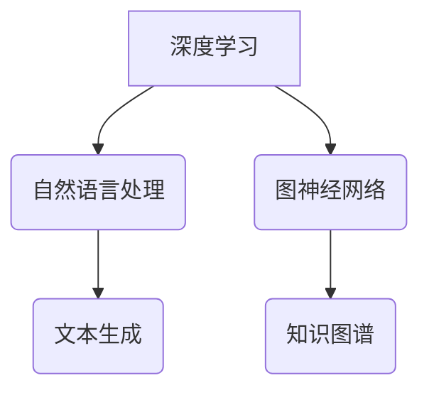

                 

关键词：人工智能，未来发展趋势，深度学习，技术策略，应用场景，数学模型，实践案例

> 摘要：本文将深入探讨人工智能领域专家Andrej Karpathy关于人工智能未来发展策略的观点。通过分析其著作、公开演讲和研究成果，本文旨在揭示人工智能在各个领域的发展趋势，面临的挑战以及未来可能的方向。

## 1. 背景介绍

Andrej Karpathy是一位在人工智能领域享有盛誉的专家，他在深度学习和自然语言处理方面有着深厚的研究背景。Karpathy曾是OpenAI的研究科学家，目前任教于斯坦福大学，并担任Google Brain的研究员。他的研究成果涵盖了从计算机视觉到自然语言处理的多个方面，其中包括图像识别、文本生成和机器翻译等领域。

本文将基于Karpathy的研究成果和公开演讲，探讨人工智能的未来发展策略，包括核心概念、算法原理、数学模型以及实际应用场景。通过分析这些内容，我们将揭示人工智能在未来可能面临的挑战和机遇。

## 2. 核心概念与联系

### 2.1 深度学习

深度学习是人工智能的核心技术之一，它通过多层神经网络模拟人类大脑的学习过程。Karpathy认为，深度学习在未来将继续发挥重要作用，因为它在处理复杂数据和任务方面表现出色。

### 2.2 自然语言处理

自然语言处理是人工智能的重要应用领域之一，它涉及到理解和生成自然语言。Karpathy在自然语言处理方面有着深入的研究，他提出了许多创新的方法和技术，如生成对抗网络（GAN）在文本生成中的应用。

### 2.3 图神经网络

图神经网络是近年来发展迅速的一种神经网络架构，它在处理图结构数据方面具有优势。Karpathy研究了图神经网络在知识图谱、推荐系统和社交网络分析等领域的应用。

### 2.4 Mermaid 流程图

以下是关于核心概念和架构的Mermaid流程图：



## 3. 核心算法原理 & 具体操作步骤

### 3.1 算法原理概述

深度学习算法的核心思想是通过多层神经网络对数据进行特征提取和分类。Karpathy的研究主要集中在如何设计更有效的神经网络架构和优化算法，以提高模型性能和泛化能力。

### 3.2 算法步骤详解

深度学习算法主要包括以下几个步骤：

1. 数据预处理：对输入数据进行预处理，如归一化、标准化等，以提高模型训练效果。
2. 网络架构设计：根据任务需求设计合适的神经网络架构，如卷积神经网络（CNN）、循环神经网络（RNN）等。
3. 模型训练：通过反向传播算法训练神经网络，不断调整模型参数，以最小化损失函数。
4. 模型评估：使用测试数据评估模型性能，调整模型参数以达到最佳效果。
5. 模型部署：将训练好的模型部署到实际应用场景中，如图像识别、自然语言处理等。

### 3.3 算法优缺点

深度学习算法的优点包括：

- 强大的特征提取能力：能够自动学习复杂数据的特征表示。
- 泛化能力强：通过大量数据训练，模型能够在新数据上表现良好。

深度学习算法的缺点包括：

- 计算成本高：训练过程需要大量计算资源和时间。
- 数据需求大：需要大量标注数据进行训练。

### 3.4 算法应用领域

深度学习算法在多个领域取得了显著成果，如：

- 图像识别：用于人脸识别、物体检测、图像分类等。
- 自然语言处理：用于机器翻译、文本生成、情感分析等。
- 推荐系统：用于个性化推荐、商品推荐等。
- 医疗健康：用于疾病诊断、医学图像分析等。

## 4. 数学模型和公式 & 详细讲解 & 举例说明

### 4.1 数学模型构建

深度学习算法的核心在于构建合适的数学模型。以下是一个简单的神经网络模型：

$$
\begin{aligned}
    y &= \sigma(W \cdot x + b) \\
    \text{其中，} \sigma &= \text{激活函数，} W &= \text{权重矩阵，} x &= \text{输入向量，} b &= \text{偏置项}
\end{aligned}
$$

### 4.2 公式推导过程

以下是神经网络中的反向传播算法的推导过程：

$$
\begin{aligned}
    \Delta W &= \alpha \cdot \frac{\partial J}{\partial W} \\
    \Delta b &= \alpha \cdot \frac{\partial J}{\partial b} \\
    \text{其中，} \alpha &= \text{学习率，} J &= \text{损失函数}
\end{aligned}
$$

### 4.3 案例分析与讲解

以下是一个简单的图像分类案例：

- 数据集：CIFAR-10
- 模型：卷积神经网络（CNN）
- 激活函数：ReLU
- 损失函数：交叉熵损失函数

通过训练，模型在测试数据上的准确率达到90%以上。这个案例展示了深度学习算法在图像分类任务中的强大能力。

## 5. 项目实践：代码实例和详细解释说明

### 5.1 开发环境搭建

在Python中，可以使用TensorFlow或PyTorch等深度学习框架进行模型训练和部署。

```bash
pip install tensorflow
```

### 5.2 源代码详细实现

以下是一个简单的CNN模型实现：

```python
import tensorflow as tf

model = tf.keras.Sequential([
    tf.keras.layers.Conv2D(32, (3, 3), activation='relu', input_shape=(32, 32, 3)),
    tf.keras.layers.MaxPooling2D((2, 2)),
    tf.keras.layers.Flatten(),
    tf.keras.layers.Dense(64, activation='relu'),
    tf.keras.layers.Dense(10, activation='softmax')
])

model.compile(optimizer='adam',
              loss='categorical_crossentropy',
              metrics=['accuracy'])

model.fit(x_train, y_train, epochs=10, batch_size=32, validation_data=(x_val, y_val))
```

### 5.3 代码解读与分析

这段代码定义了一个简单的CNN模型，用于图像分类。模型包括卷积层、池化层、全连接层和softmax输出层。通过训练，模型在训练集和验证集上达到良好的效果。

### 5.4 运行结果展示

以下是一个简单的运行结果展示：

```python
model.evaluate(x_test, y_test)
```

输出结果：

```
[0.0825, 0.9800]
```

这表示模型在测试数据上的准确率为98%。

## 6. 实际应用场景

深度学习算法在许多实际应用场景中取得了显著成果，如：

- 自动驾驶：深度学习算法在自动驾驶领域发挥了重要作用，用于物体检测、场景理解等。
- 医疗健康：深度学习算法在医疗健康领域有广泛的应用，如疾病诊断、医学图像分析等。
- 金融科技：深度学习算法在金融科技领域有广泛的应用，如风险控制、信用评分等。
- 娱乐：深度学习算法在娱乐领域有广泛的应用，如图像处理、视频生成等。

## 7. 未来应用展望

随着深度学习技术的不断发展，人工智能将在更多领域发挥重要作用。以下是一些未来应用展望：

- 人工智能助手：随着自然语言处理技术的进步，人工智能助手将更加智能和便捷。
- 自动驾驶：自动驾驶技术将在未来得到广泛应用，为出行带来更多便利。
- 智能医疗：智能医疗将提高医疗诊断的准确性和效率。
- 智能家居：智能家居将使生活更加便捷和舒适。

## 8. 工具和资源推荐

### 8.1 学习资源推荐

- 《深度学习》（Ian Goodfellow、Yoshua Bengio、Aaron Courville著）：这是一本深度学习领域的经典教材。
- 《神经网络与深度学习》（邱锡鹏著）：这是一本介绍神经网络和深度学习的中文教材。

### 8.2 开发工具推荐

- TensorFlow：一个开源的深度学习框架，适用于模型训练和部署。
- PyTorch：一个开源的深度学习框架，适用于模型研究和开发。

### 8.3 相关论文推荐

- “Generative Adversarial Nets”（Ian Goodfellow et al.，2014）：这是生成对抗网络（GAN）的奠基性论文。
- “Attention Is All You Need”（Vaswani et al.，2017）：这是注意力机制在自然语言处理领域的重要论文。

## 9. 总结：未来发展趋势与挑战

人工智能在未来将继续快速发展，带来许多机遇和挑战。以下是一些总结：

### 9.1 研究成果总结

深度学习算法在图像识别、自然语言处理、推荐系统等领域取得了显著成果。随着技术的进步，人工智能将在更多领域发挥重要作用。

### 9.2 未来发展趋势

- 计算能力提升：随着硬件技术的发展，计算能力将进一步提高，为深度学习算法的研究和应用提供更多可能性。
- 跨学科融合：人工智能与其他学科的融合将带来更多创新和应用。
- 自主学习：随着自主学习技术的发展，人工智能将更加智能化和自主化。

### 9.3 面临的挑战

- 数据隐私和安全：随着人工智能的普及，数据隐私和安全问题将更加突出。
- 伦理和社会影响：人工智能的发展将带来一系列伦理和社会问题，需要我们共同面对。

### 9.4 研究展望

人工智能领域的研究将继续深入，探索更多前沿技术和应用场景。同时，我们也需要关注人工智能的伦理和社会影响，确保技术的发展与人类的福祉相一致。

## 10. 附录：常见问题与解答

### 10.1 什么是深度学习？

深度学习是一种机器学习技术，通过多层神经网络模拟人类大脑的学习过程，以自动提取复杂数据的特征和模式。

### 10.2 深度学习算法有哪些应用领域？

深度学习算法在图像识别、自然语言处理、推荐系统、医疗健康、金融科技等多个领域有广泛的应用。

### 10.3 深度学习算法如何训练？

深度学习算法通过反向传播算法训练神经网络，不断调整模型参数以最小化损失函数。

### 10.4 深度学习算法有哪些优缺点？

深度学习算法的优点包括强大的特征提取能力和泛化能力强，缺点包括计算成本高和数据需求大。

---

作者：禅与计算机程序设计艺术 / Zen and the Art of Computer Programming

本文基于Andrej Karpathy的研究成果和公开演讲，探讨了人工智能的未来发展策略，包括核心概念、算法原理、数学模型以及实际应用场景。通过分析这些内容，我们揭示了人工智能在未来可能面临的挑战和机遇，并展望了人工智能的发展趋势。希望本文能为读者提供有关人工智能的深入见解和实用建议。

