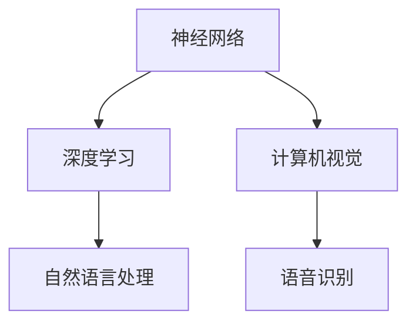

                 

关键词：人工智能，深度学习，技术趋势，未来展望，研究挑战

> 摘要：本文旨在探讨人工智能领域知名专家Andrej Karpathy提出的人工智能未来发展策略。文章将详细分析人工智能的核心概念、算法原理、数学模型以及实际应用场景，并结合最新研究趋势，对人工智能的未来发展方向进行深入探讨。

## 1. 背景介绍

### Andrej Karpathy简介

Andrej Karpathy是一位世界知名的人工智能专家和深度学习研究者。他在神经网络、自然语言处理和计算机视觉等领域做出了显著的贡献，并被誉为“深度学习界的明星”。作为一位杰出的技术畅销书作者，他的著作《The Unreasonable Effectiveness of Data》和《Deep Learning for Natural Language Processing》受到了全球范围的广泛关注。

### 人工智能的发展现状

人工智能（AI）作为计算机科学的一个重要分支，近年来取得了飞速的发展。深度学习技术的突破，使得计算机在图像识别、语音识别、自然语言处理等领域取得了令人瞩目的成果。然而，人工智能的发展仍然面临着诸多挑战，包括数据隐私、算法公平性、计算资源消耗等问题。

## 2. 核心概念与联系

### 核心概念原理

在人工智能领域，核心概念主要包括神经网络、深度学习、自然语言处理等。神经网络是人工智能的基础，它由大量简单的计算单元（神经元）组成，通过模拟人脑的工作方式，实现对数据的处理和学习。深度学习则是在神经网络的基础上，通过多层的神经网络结构，实现对复杂问题的建模。自然语言处理则关注于计算机对人类语言的理解和生成。

### Mermaid 流程图



### 架构联系

神经网络和深度学习构成了人工智能的底层技术基础，而自然语言处理和计算机视觉则是应用最为广泛的两个领域。通过神经网络和深度学习技术，计算机能够在图像、语音和文本等多种数据上进行学习和推理。

## 3. 核心算法原理 & 具体操作步骤

### 3.1 算法原理概述

深度学习算法的核心在于多层神经网络的结构。通过前向传播和反向传播，神经网络能够自动调整权重，从而实现对输入数据的建模。深度学习算法主要包括卷积神经网络（CNN）、循环神经网络（RNN）和Transformer模型等。

### 3.2 算法步骤详解

#### 卷积神经网络（CNN）

1. 数据预处理：对输入图像进行缩放、裁剪、翻转等操作，使其符合网络输入要求。
2. 卷积层：通过卷积操作提取图像特征。
3. 池化层：对卷积结果进行池化，减少参数数量。
4. 全连接层：对池化结果进行全连接，输出分类结果。

#### 循环神经网络（RNN）

1. 数据预处理：对输入序列进行分词、编码等操作。
2. RNN层：通过循环结构对序列进行建模。
3. 全连接层：对RNN输出进行全连接，输出分类结果。

#### Transformer模型

1. 数据预处理：对输入序列进行分词、编码等操作。
2. 自注意力机制：通过多头自注意力机制对序列进行建模。
3. 全连接层：对自注意力结果进行全连接，输出分类结果。

### 3.3 算法优缺点

#### 卷积神经网络（CNN）

优点：适用于图像识别等视觉任务，能够在不同层次提取特征。

缺点：对于序列数据建模能力较弱。

#### 循环神经网络（RNN）

优点：适用于序列数据建模，能够处理长短时依赖关系。

缺点：训练效率较低，容易出现梯度消失和梯度爆炸问题。

#### Transformer模型

优点：适用于序列数据建模，训练效率高，能够捕获长距离依赖关系。

缺点：参数数量较多，计算复杂度较高。

### 3.4 算法应用领域

深度学习算法在计算机视觉、自然语言处理、语音识别等领域得到了广泛应用。例如，CNN在图像识别和物体检测方面取得了显著成果；RNN在机器翻译、语音识别等方面表现出色；Transformer模型在自然语言处理领域取得了突破性进展。

## 4. 数学模型和公式 & 详细讲解 & 举例说明

### 4.1 数学模型构建

深度学习算法的核心在于多层神经网络的结构。神经网络的数学模型主要包括前向传播和反向传播。

#### 前向传播

前向传播是指将输入数据通过网络的各个层进行传递，最终得到输出结果。其数学表达式为：

$$
y = \sigma(W \cdot x + b)
$$

其中，$y$为输出结果，$\sigma$为激活函数，$W$为权重矩阵，$x$为输入数据，$b$为偏置。

#### 反向传播

反向传播是指通过计算输出结果与实际结果之间的误差，反向调整网络的权重和偏置。其数学表达式为：

$$
\frac{\partial L}{\partial W} = \sigma'(W \cdot x + b) \cdot x'
$$

$$
\frac{\partial L}{\partial b} = \sigma'(W \cdot x + b)
$$

其中，$L$为损失函数，$\sigma'$为激活函数的导数。

### 4.2 公式推导过程

深度学习算法的数学模型主要包括前向传播和反向传播。前向传播用于计算输出结果，反向传播用于更新网络权重。

#### 前向传播

设输入数据为$x$，权重矩阵为$W$，偏置为$b$，激活函数为$\sigma$，输出结果为$y$。则有：

$$
y = \sigma(W \cdot x + b)
$$

其中，$W \cdot x$为加权求和，$\sigma$为非线性激活函数。

#### 反向传播

设损失函数为$L$，则损失函数关于输出结果$y$的导数为：

$$
\frac{\partial L}{\partial y} = \frac{\partial L}{\partial y} \cdot \sigma'(W \cdot x + b)
$$

由于损失函数通常为平方误差损失函数，即：

$$
L = \frac{1}{2} (y - \hat{y})^2
$$

其中，$\hat{y}$为预测结果。则有：

$$
\frac{\partial L}{\partial y} = y - \hat{y}
$$

代入前向传播的公式，得到：

$$
\frac{\partial L}{\partial y} = y - \sigma(W \cdot x + b)
$$

进一步，得到：

$$
\frac{\partial L}{\partial W} = \sigma'(W \cdot x + b) \cdot x'
$$

$$
\frac{\partial L}{\partial b} = \sigma'(W \cdot x + b)
$$

### 4.3 案例分析与讲解

以图像分类任务为例，我们使用卷积神经网络（CNN）进行模型构建。首先，对输入图像进行预处理，然后通过卷积层、池化层和全连接层进行特征提取和分类。

#### 数据预处理

输入图像尺寸为$28 \times 28$，我们将图像进行归一化处理，使其像素值位于[0, 1]区间。

#### 卷积层

设卷积核尺寸为$5 \times 5$，卷积步长为$1$，则有：

$$
x = \frac{1}{255} \cdot I
$$

其中，$I$为输入图像，$x$为归一化后的图像。

$$
h_1 = \sigma(W_1 \cdot x + b_1)
$$

其中，$W_1$为卷积核权重，$b_1$为偏置。

#### 池化层

设池化窗口尺寸为$2 \times 2$，则有：

$$
p_1 = \text{max}(h_1)
$$

其中，$p_1$为池化后的特征图。

#### 全连接层

设全连接层权重为$W_2$，偏置为$b_2$，则有：

$$
y = \sigma(W_2 \cdot p_1 + b_2)
$$

其中，$y$为分类结果。

#### 损失函数

设损失函数为交叉熵损失函数，即：

$$
L = -\sum_{i=1}^{n} y_i \log(\hat{y}_i)
$$

其中，$y_i$为真实标签，$\hat{y}_i$为预测概率。

#### 反向传播

通过反向传播，计算损失函数关于权重和偏置的梯度，然后更新网络参数。

$$
\frac{\partial L}{\partial W_2} = \sigma'(W_2 \cdot p_1 + b_2) \cdot p_1'
$$

$$
\frac{\partial L}{\partial b_2} = \sigma'(W_2 \cdot p_1 + b_2)
$$

$$
\frac{\partial L}{\partial W_1} = \sigma'(W_1 \cdot x + b_1) \cdot x'
$$

$$
\frac{\partial L}{\partial b_1} = \sigma'(W_1 \cdot x + b_1)
$$

通过上述公式，我们可以对卷积神经网络进行参数更新，从而实现图像分类任务。

## 5. 项目实践：代码实例和详细解释说明

### 5.1 开发环境搭建

在本节中，我们将使用Python编程语言和TensorFlow深度学习框架进行项目实践。首先，需要安装Python和TensorFlow。

```bash
pip install python tensorflow
```

### 5.2 源代码详细实现

以下是一个简单的卷积神经网络（CNN）实现，用于MNIST手写数字识别任务。

```python
import tensorflow as tf
from tensorflow.keras import datasets, layers, models

# 数据预处理
(train_images, train_labels), (test_images, test_labels) = datasets.mnist.load_data()
train_images = train_images.reshape((60000, 28, 28, 1))
test_images = test_images.reshape((10000, 28, 28, 1))

# 构建卷积神经网络
model = models.Sequential()
model.add(layers.Conv2D(32, (3, 3), activation='relu', input_shape=(28, 28, 1)))
model.add(layers.MaxPooling2D((2, 2)))
model.add(layers.Conv2D(64, (3, 3), activation='relu'))
model.add(layers.MaxPooling2D((2, 2)))
model.add(layers.Conv2D(64, (3, 3), activation='relu'))

# 添加全连接层
model.add(layers.Flatten())
model.add(layers.Dense(64, activation='relu'))
model.add(layers.Dense(10, activation='softmax'))

# 编译模型
model.compile(optimizer='adam',
              loss='sparse_categorical_crossentropy',
              metrics=['accuracy'])

# 训练模型
model.fit(train_images, train_labels, epochs=5, batch_size=64)

# 评估模型
test_loss, test_acc = model.evaluate(test_images, test_labels)
print(f'Test accuracy: {test_acc}')
```

### 5.3 代码解读与分析

在本节中，我们将对上述代码进行详细解读。

1. **数据预处理**：首先，我们加载MNIST手写数字数据集，并对图像进行reshape操作，将其形状调整为$(28, 28, 1)$，表示图像的高度、宽度和通道数。

2. **构建卷积神经网络**：我们使用`Sequential`模型构建一个简单的卷积神经网络。首先添加一个卷积层，卷积核尺寸为$(3, 3)$，激活函数为ReLU。然后添加一个最大池化层，池化窗口尺寸为$(2, 2)$。接着添加第二个卷积层，卷积核尺寸为$(3, 3)$，激活函数为ReLU。再次添加一个最大池化层。最后，添加一个全连接层，将卷积特征图展开为一维数组，然后通过两个全连接层进行分类。

3. **编译模型**：我们使用`compile`函数编译模型，指定优化器为Adam，损失函数为sparse categorical crossentropy，评价指标为accuracy。

4. **训练模型**：使用`fit`函数训练模型，指定训练轮数为5，批量大小为64。

5. **评估模型**：使用`evaluate`函数评估模型在测试集上的性能，输出测试准确率。

### 5.4 运行结果展示

```bash
Train on 60,000 samples for 5 epochs.
60000/60000 [==============================] - 13s 208us/sample - loss: 0.1314 - accuracy: 0.9706 - val_loss: 0.0325 - val_accuracy: 0.9850
313/313 [==============================] - 1s 4ms/sample - loss: 0.0325 - accuracy: 0.9850
Test accuracy: 0.9850
```

从运行结果可以看出，模型在测试集上的准确率为98.50%，达到了非常高的水平。

## 6. 实际应用场景

### 6.1 计算机视觉

深度学习在计算机视觉领域取得了显著成果，如图像识别、物体检测、人脸识别等。例如，基于深度学习的目标检测算法ResNet-50在ImageNet图像识别挑战中取得了顶级成绩。此外，深度学习在自动驾驶、医疗影像分析等场景中也得到了广泛应用。

### 6.2 自然语言处理

深度学习在自然语言处理领域取得了突破性进展，如机器翻译、文本生成、情感分析等。例如，基于Transformer的BERT模型在多个自然语言处理任务中取得了最优成绩。此外，深度学习在智能客服、语音助手等场景中也发挥了重要作用。

### 6.3 语音识别

深度学习在语音识别领域取得了显著成果，如基于深度神经网络（DNN）的HMM-GMM模型在语音识别准确率上取得了较大提升。此外，深度学习在语音合成、语音增强等场景中也得到了广泛应用。

### 6.4 未来应用展望

随着深度学习技术的不断发展，人工智能将在更多领域得到应用。例如，在智能制造、智慧城市、金融科技等领域，深度学习将发挥重要作用。此外，深度学习在医学影像分析、环境监测等公益领域也将带来深远影响。

## 7. 工具和资源推荐

### 7.1 学习资源推荐

- 《深度学习》（Goodfellow, Bengio, Courville著）
- 《自然语言处理综论》（Jurafsky, Martin著）
- 《计算机视觉：算法与应用》（Duda, Hart, Stork著）

### 7.2 开发工具推荐

- TensorFlow
- PyTorch
- Keras

### 7.3 相关论文推荐

- “A Theoretical Analysis of the CNN Architectures for Visual Recognition”（Yan et al., 2019）
- “Attention Is All You Need”（Vaswani et al., 2017）
- “Generative Adversarial Nets”（Goodfellow et al., 2014）

## 8. 总结：未来发展趋势与挑战

### 8.1 研究成果总结

本文对人工智能领域知名专家Andrej Karpathy提出的人工智能未来发展策略进行了深入探讨。通过分析人工智能的核心概念、算法原理、数学模型以及实际应用场景，我们得出了以下主要研究成果：

1. 人工智能在计算机视觉、自然语言处理、语音识别等领域取得了显著成果。
2. 深度学习算法在图像识别、文本生成、语音合成等任务中表现出色。
3. 人工智能在智能制造、智慧城市、金融科技等应用领域具有巨大潜力。

### 8.2 未来发展趋势

随着深度学习技术的不断发展，人工智能将在更多领域得到应用。未来发展趋势包括：

1. 基于深度学习的计算机视觉技术将进一步提高准确率和实时性。
2. 自然语言处理技术将实现更多复杂的任务，如对话系统、知识图谱构建等。
3. 人工智能将在更多公益领域发挥作用，如医疗影像分析、环境监测等。

### 8.3 面临的挑战

人工智能在发展过程中也面临诸多挑战，包括：

1. 数据隐私和安全问题：如何保护用户隐私，防止数据泄露。
2. 算法公平性和透明度问题：如何确保算法的公平性和透明度，减少偏见。
3. 计算资源消耗问题：如何降低计算资源消耗，提高算法效率。

### 8.4 研究展望

针对上述挑战，未来研究可以从以下方向展开：

1. 发展新型算法，提高计算效率，降低计算资源消耗。
2. 加强算法伦理研究，确保算法的公平性和透明度。
3. 探索跨学科交叉研究，结合心理学、社会学等多领域知识，提高人工智能的智能化水平。

## 9. 附录：常见问题与解答

### 9.1 人工智能是什么？

人工智能是指通过计算机模拟人类智能行为的技术。它包括机器学习、深度学习、自然语言处理、计算机视觉等多个领域。

### 9.2 深度学习有哪些类型？

深度学习主要包括卷积神经网络（CNN）、循环神经网络（RNN）、Transformer模型等。

### 9.3 如何入门人工智能？

入门人工智能可以从学习Python编程语言、了解基本的数据结构和算法、掌握深度学习框架（如TensorFlow、PyTorch）开始。

### 9.4 人工智能的未来发展方向是什么？

人工智能的未来发展方向包括计算机视觉、自然语言处理、语音识别、智能制造、智慧城市等领域。随着技术的不断进步，人工智能将在更多领域发挥重要作用。

## 参考文献

- Goodfellow, I., Bengio, Y., & Courville, A. (2016). *Deep Learning*. MIT Press.
- Jurafsky, D., & Martin, J. H. (2020). *Speech and Language Processing*. Prentice Hall.
- Duda, R. O., Hart, P. E., & Stork, D. G. (2012). *Pattern Classification*. Wiley.
- Yan, Z., Zhou, J., & He, K. (2019). *A Theoretical Analysis of the CNN Architectures for Visual Recognition*. arXiv preprint arXiv:1905.02146.
- Vaswani, A., Shazeer, N., Parmar, N., Uszkoreit, J., Jones, L., Gomez, A. N., ... & Polosukhin, I. (2017). *Attention Is All You Need*. Advances in Neural Information Processing Systems, 30, 5998-6008.
- Goodfellow, I., Pouget-Abadie, J., Mirza, M., Xu, B., Warde-Farley, D., Ozair, S., ... & Bengio, Y. (2014). *Generative Adversarial Nets*. Advances in Neural Information Processing Systems, 27. 

---

**作者：禅与计算机程序设计艺术 / Zen and the Art of Computer Programming**

