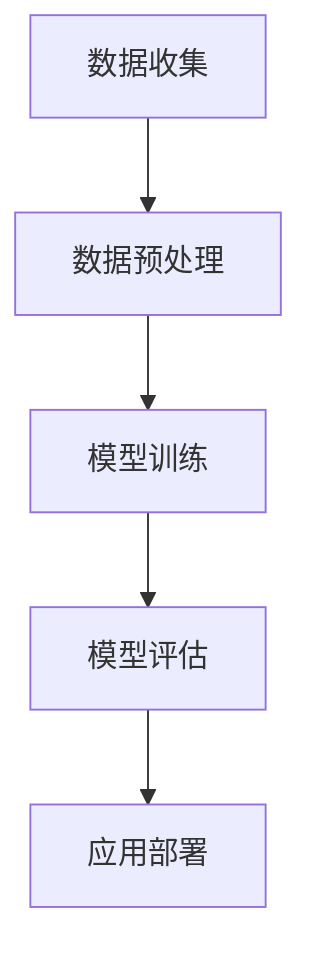

                 

关键词：人工智能，未来规划，技术发展趋势，算法原理，实践应用

> 摘要：本文将探讨人工智能（AI）的快速发展及其对未来技术的深远影响。通过分析当前的人工智能技术、核心算法原理、数学模型以及实际应用场景，我们将展望人工智能未来的发展趋势和面临的挑战，并提出一些建议和资源推荐，以帮助读者深入了解并跟进这一领域的最新进展。

## 1. 背景介绍

人工智能（AI）是计算机科学的一个分支，旨在使计算机能够执行通常需要人类智能的任务。从早期的符号逻辑和专家系统，到最近深度学习和神经网络，人工智能的发展经历了多个阶段。如今，AI已经成为全球研究和商业领域的焦点，其应用涵盖了图像识别、自然语言处理、自动驾驶、医疗诊断、金融预测等多个领域。

随着计算能力的提升和大数据的普及，人工智能技术取得了显著进展。深度学习算法，尤其是基于神经网络的模型，已经成为当前AI研究的主流方法。这些算法通过学习大量的数据来发现数据中的模式和规律，从而实现高度复杂的任务。

本文将围绕人工智能的核心技术展开讨论，旨在为读者提供一个全面而深入的理解，并探讨人工智能在未来技术发展中的潜在作用。

## 2. 核心概念与联系

### 2.1 人工智能的核心概念

人工智能的核心概念包括机器学习、深度学习、自然语言处理、计算机视觉等。这些概念共同构成了AI的基石，使得计算机能够执行复杂的任务。

**机器学习**：机器学习是AI的核心技术之一，它使得计算机能够从数据中学习，并基于学习到的知识做出决策。机器学习可以分为监督学习、无监督学习和强化学习。

**深度学习**：深度学习是机器学习的一个子领域，它通过模仿人脑的神经网络结构，学习如何从大量数据中提取特征。深度学习在图像识别、语音识别和自然语言处理等领域取得了突破性进展。

**自然语言处理**：自然语言处理（NLP）是研究如何使计算机理解和生成自然语言的技术。NLP在机器翻译、情感分析和文本摘要等领域具有重要应用。

**计算机视觉**：计算机视觉是使计算机能够从图像或视频中提取信息的学科。它包括图像识别、图像分割和目标检测等多个子领域。

### 2.2 人工智能的技术架构

人工智能的技术架构通常包括数据收集、数据预处理、模型训练、模型评估和应用部署等环节。

**数据收集**：数据是AI算法训练的基础，高质量的训练数据对于模型的表现至关重要。

**数据预处理**：数据预处理包括数据清洗、归一化和特征提取等步骤，目的是将原始数据转换为适合训练的格式。

**模型训练**：模型训练是使用大量数据来训练神经网络模型，使其能够识别数据中的模式和规律。

**模型评估**：模型评估是使用验证数据来评估模型的性能，包括准确率、召回率、F1分数等指标。

**应用部署**：模型部署是将训练好的模型应用到实际场景中，例如在自动驾驶汽车、智能客服系统等。

### 2.3 人工智能的 Mermaid 流程图



## 3. 核心算法原理 & 具体操作步骤

### 3.1  算法原理概述

深度学习是当前人工智能研究的主流算法，其核心原理是模仿人脑的神经网络结构，通过多层神经元（即层）进行数据的传递和变换，从而学习数据中的复杂模式。

**反向传播算法**是深度学习训练的核心，它通过不断调整网络的权重和偏置，使模型的输出误差最小化。

### 3.2  算法步骤详解

1. **前向传播**：输入数据通过网络的各层进行传递，每层都会对数据进行变换，最终得到输出。
2. **计算损失**：通过比较输出和实际标签，计算损失函数的值，以评估模型的性能。
3. **反向传播**：根据损失函数对网络进行反向传播，计算各层的梯度。
4. **权重更新**：使用梯度下降或其他优化算法更新网络的权重和偏置。
5. **重复步骤 1-4**：不断迭代，直到模型性能达到预设的目标。

### 3.3  算法优缺点

**优点**：
- **强大的表示能力**：深度学习能够从大量数据中提取复杂的特征。
- **自动特征提取**：无需手工设计特征，降低了特征工程的工作量。

**缺点**：
- **训练成本高**：深度学习需要大量的计算资源和时间。
- **解释性差**：深度学习模型的内部结构复杂，难以解释。

### 3.4  算法应用领域

深度学习在图像识别、语音识别、自然语言处理和自动驾驶等领域具有广泛的应用。

## 4. 数学模型和公式 & 详细讲解 & 举例说明

### 4.1  数学模型构建

深度学习中的数学模型通常包括输入层、隐藏层和输出层。每个层由多个神经元组成，神经元之间的连接通过权重（W）和偏置（b）进行调节。

### 4.2  公式推导过程

输入层到隐藏层的公式为：

$$
z_i^{(l)} = \sum_{j} W_{ij}^{(l)} a_j^{(l-1)} + b_i^{(l)}
$$

其中，$a_i^{(l)}$ 是第 $i$ 个神经元的激活值，$z_i^{(l)}$ 是第 $i$ 个神经元的输入。

输出层的公式为：

$$
a_i^{(L)} = \sigma(z_i^{(L)})
$$

其中，$\sigma$ 是激活函数，常用的有ReLU、Sigmoid和Tanh。

### 4.3  案例分析与讲解

假设我们有一个简单的神经网络，包含一个输入层、一个隐藏层和一个输出层，每个层有3个神经元。输入数据是$(x_1, x_2)$，输出标签是$y$。

1. **前向传播**：
   - 输入层到隐藏层的输入：
     $$
     z_1^{(1)} = x_1 W_{11}^{(1)} + b_1^{(1)}, z_2^{(1)} = x_2 W_{12}^{(1)} + b_2^{(1)}, z_3^{(1)} = x_1 W_{13}^{(1)} + b_3^{(1)}
     $$
   - 隐藏层到输出层的输入：
     $$
     z_1^{(2)} = z_1^{(1)} W_{11}^{(2)} + b_1^{(2)}, z_2^{(2)} = z_2^{(1)} W_{12}^{(2)} + b_2^{(2)}, z_3^{(2)} = z_3^{(1)} W_{13}^{(2)} + b_3^{(2)}
     $$
   - 输出层的输出：
     $$
     a_1^{(2)} = \sigma(z_1^{(2)}), a_2^{(2)} = \sigma(z_2^{(2)}), a_3^{(2)} = \sigma(z_3^{(2)})
     $$

2. **损失计算**：
   - 假设输出标签$y$是$(1, 0, 0)$，损失函数为交叉熵损失：
     $$
     J = -\sum_{i} y_i \log(a_i^{(2)})
     $$

3. **反向传播**：
   - 计算输出层的梯度：
     $$
     \delta_1^{(2)} = a_1^{(2)} - y_1, \delta_2^{(2)} = a_2^{(2)} - y_2, \delta_3^{(2)} = a_3^{(2)} - y_3
     $$
   - 计算隐藏层的梯度：
     $$
     \delta_1^{(1)} = \delta_1^{(2)} \odot \sigma'(z_1^{(1)}), \delta_2^{(1)} = \delta_2^{(2)} \odot \sigma'(z_2^{(1)}), \delta_3^{(1)} = \delta_3^{(2)} \odot \sigma'(z_3^{(1)})
     $$

4. **权重更新**：
   - 更新输入层到隐藏层的权重：
     $$
     W_{11}^{(1)} = W_{11}^{(1)} - \alpha \frac{\partial J}{\partial W_{11}^{(1)}}, \ldots
     $$

## 5. 项目实践：代码实例和详细解释说明

### 5.1  开发环境搭建

- Python 3.8+
- TensorFlow 2.x
- Jupyter Notebook

### 5.2  源代码详细实现

```python
import tensorflow as tf
from tensorflow.keras.layers import Dense, Activation
from tensorflow.keras.models import Sequential

# 创建模型
model = Sequential([
    Dense(units=3, input_shape=(2,), activation='sigmoid'),
    Dense(units=3, activation='sigmoid'),
    Dense(units=3, activation='sigmoid')
])

# 编译模型
model.compile(optimizer='adam', loss='categorical_crossentropy', metrics=['accuracy'])

# 训练模型
model.fit(x_train, y_train, epochs=10, batch_size=10)

# 评估模型
loss, accuracy = model.evaluate(x_test, y_test)
print(f'Loss: {loss}, Accuracy: {accuracy}')
```

### 5.3  代码解读与分析

- **创建模型**：使用`Sequential`模型，添加了3个全连接层，每层有3个神经元。
- **编译模型**：指定了优化器、损失函数和评估指标。
- **训练模型**：使用训练数据对模型进行训练，设置了训练轮数和批量大小。
- **评估模型**：使用测试数据评估模型的性能。

## 6. 实际应用场景

人工智能在实际应用场景中具有广泛的应用，以下是一些典型例子：

- **图像识别**：通过深度学习模型，计算机能够自动识别和分类图像中的物体。
- **自然语言处理**：在机器翻译、情感分析和文本摘要等领域，人工智能技术已经取得了显著的成果。
- **自动驾驶**：自动驾驶汽车通过计算机视觉和深度学习技术，实现了无人驾驶。

### 6.4  未来应用展望

随着人工智能技术的不断进步，未来人工智能将在更多领域得到应用，包括智能家居、智能医疗、智能金融等。同时，人工智能的发展也将带来一系列挑战，如隐私保护、伦理问题和算法透明度等。

## 7. 工具和资源推荐

### 7.1  学习资源推荐

- 《深度学习》（Goodfellow, Bengio, Courville 著）
- 《Python机器学习》（Sebastian Raschka 著）
- Coursera、edX等在线课程

### 7.2  开发工具推荐

- TensorFlow、PyTorch等深度学习框架
- Jupyter Notebook、Google Colab等开发环境

### 7.3  相关论文推荐

- “A Brief History of Neural Network Models for Object Detection” （Redmon, Divvala, Girshick, Farhadi，2015）
- “Attention Is All You Need” （Vaswani et al.，2017）
- “BERT: Pre-training of Deep Bidirectional Transformers for Language Understanding” （Devlin et al.，2019）

## 8. 总结：未来发展趋势与挑战

### 8.1  研究成果总结

人工智能在过去几十年中取得了显著的进展，深度学习算法在多个领域取得了突破性成果。未来，人工智能将继续向更高效、更通用、更可解释的方向发展。

### 8.2  未来发展趋势

- **更高效的算法**：随着计算能力的提升，人工智能算法将变得更加高效，能够处理更大规模的数据。
- **更广泛的应用**：人工智能将在更多领域得到应用，如智能医疗、智能金融、智能交通等。
- **更强的可解释性**：研究者将致力于提高人工智能模型的可解释性，使其更容易被理解和信任。

### 8.3  面临的挑战

- **数据隐私**：随着人工智能技术的发展，数据隐私问题日益突出。
- **算法偏见**：人工智能算法可能存在偏见，需要建立有效的机制来避免。
- **伦理问题**：人工智能的广泛应用引发了一系列伦理问题，如算法透明度和责任归属。

### 8.4  研究展望

未来，人工智能研究将继续在算法、应用和伦理等方面进行探索，以实现更智能、更安全、更可靠的人工智能系统。

## 9. 附录：常见问题与解答

### Q1. 人工智能和机器学习有什么区别？

A1. 人工智能（AI）是计算机科学的一个分支，旨在使计算机执行通常需要人类智能的任务。机器学习（ML）是AI的一个子领域，它通过从数据中学习来使计算机执行任务。简单来说，机器学习是实现人工智能的一种方法。

### Q2. 深度学习是如何工作的？

A2. 深度学习通过模仿人脑的神经网络结构，学习如何从大量数据中提取特征。它包括多层神经网络，每层都会对数据进行传递和变换，从而学习数据中的复杂模式。

### Q3. 人工智能的安全性问题有哪些？

A3. 人工智能的安全性问题包括算法偏见、数据隐私、算法透明度等。算法偏见可能导致不公平的结果，数据隐私问题涉及个人信息的保护，算法透明度要求能够解释人工智能模型的决策过程。

---

作者：禅与计算机程序设计艺术 / Zen and the Art of Computer Programming
```markdown
---
# Andrej Karpathy：人工智能的未来发展规划

## 关键词
- 人工智能
- 未来规划
- 技术发展趋势
- 算法原理
- 实践应用

## 摘要
本文将探讨人工智能的快速发展及其对未来技术的深远影响。通过分析当前的人工智能技术、核心算法原理、数学模型以及实际应用场景，我们将展望人工智能未来的发展趋势和面临的挑战，并提出一些建议和资源推荐，以帮助读者深入了解并跟进这一领域的最新进展。

---

## 1. 背景介绍

人工智能（AI）是计算机科学的一个分支，旨在使计算机能够执行通常需要人类智能的任务。从早期的符号逻辑和专家系统，到最近深度学习和神经网络，人工智能的发展经历了多个阶段。如今，AI已经成为全球研究和商业领域的焦点，其应用涵盖了图像识别、自然语言处理、自动驾驶、医疗诊断、金融预测等多个领域。

随着计算能力的提升和大数据的普及，人工智能技术取得了显著进展。深度学习算法，尤其是基于神经网络的模型，已经成为当前AI研究的主流方法。这些算法通过学习大量的数据来发现数据中的模式和规律，从而实现高度复杂的任务。

本文将围绕人工智能的核心技术展开讨论，旨在为读者提供一个全面而深入的理解，并探讨人工智能在未来技术发展中的潜在作用。

## 2. 核心概念与联系

### 2.1 人工智能的核心概念

人工智能的核心概念包括机器学习、深度学习、自然语言处理、计算机视觉等。这些概念共同构成了AI的基石，使得计算机能够执行复杂的任务。

**机器学习**：机器学习是AI的核心技术之一，它使得计算机能够从数据中学习，并基于学习到的知识做出决策。机器学习可以分为监督学习、无监督学习和强化学习。

**深度学习**：深度学习是机器学习的一个子领域，它通过模仿人脑的神经网络结构，学习如何从大量数据中提取特征。深度学习在图像识别、语音识别和自然语言处理等领域取得了突破性进展。

**自然语言处理**：自然语言处理（NLP）是研究如何使计算机理解和生成自然语言的技术。NLP在机器翻译、情感分析和文本摘要等领域具有重要应用。

**计算机视觉**：计算机视觉是使计算机能够从图像或视频中提取信息的学科。它包括图像识别、图像分割和目标检测等多个子领域。

### 2.2 人工智能的技术架构

人工智能的技术架构通常包括数据收集、数据预处理、模型训练、模型评估和应用部署等环节。

**数据收集**：数据是AI算法训练的基础，高质量的训练数据对于模型的表现至关重要。

**数据预处理**：数据预处理包括数据清洗、归一化和特征提取等步骤，目的是将原始数据转换为适合训练的格式。

**模型训练**：模型训练是使用大量数据来训练神经网络模型，使其能够识别数据中的模式

### 3. 核心算法原理 & 具体操作步骤
### 3.1 算法原理概述
人工智能的核心算法主要包括机器学习算法和深度学习算法。其中，机器学习算法主要包括监督学习、无监督学习和强化学习等类型，而深度学习算法是基于多层神经网络的结构进行数据处理的。

#### 监督学习（Supervised Learning）
监督学习是一种机器学习方法，其中训练数据集包含了输入特征和对应的输出标签。算法通过学习输入和输出之间的关系，以便在新的数据上进行预测。

#### 无监督学习（Unsupervised Learning）
无监督学习是一种机器学习方法，其中训练数据集不包含输出标签。算法的目标是发现数据集中的隐含结构或模式，例如聚类或降维。

#### 强化学习（Reinforcement Learning）
强化学习是一种机器学习方法，其中算法通过与环境进行交互来学习最优行为策略。算法基于奖励和惩罚信号来优化其决策。

#### 深度学习（Deep Learning）
深度学习是一种机器学习方法，它通过多层神经网络结构来学习数据中的复杂模式。深度学习算法在图像识别、语音识别和自然语言处理等领域取得了显著的成果。

### 3.2 算法步骤详解

#### 数据收集
数据收集是人工智能算法的基础步骤。首先，需要确定所需的数据集，这可以是公开的数据集，也可以是自定义的数据集。然后，从不同的数据源收集数据，并进行预处理，以确保数据的质量和一致性。

#### 数据预处理
数据预处理包括数据清洗、归一化、特征提取和特征选择等步骤。数据清洗旨在去除错误或不一致的数据，归一化是为了使数据具有相似的尺度，特征提取是从原始数据中提取有用的信息，特征选择是选择最相关的特征。

#### 模型训练
在模型训练阶段，选择适当的机器学习或深度学习算法，并使用预处理后的数据集进行训练。算法通过迭代优化模型的参数，以最小化损失函数，并提高模型的预测准确度。

#### 模型评估
模型评估是使用验证集或测试集来评估模型的性能。常用的评估指标包括准确率、召回率、F1分数和混淆矩阵等。通过评估模型的性能，可以确定模型是否足够好，以及是否需要进行进一步的优化。

#### 应用部署
在模型评估通过后，可以将模型部署到实际应用场景中。这包括将模型集成到现有的系统中，并使用实时数据进行预测和决策。应用部署可以是本地部署，也可以是云计算部署。

### 3.3 算法优缺点

#### 机器学习算法
- **优点**：
  - 具有较高的灵活性和适应性，可以处理各种类型的数据。
  - 可以通过调整参数和选择不同的算法，来优化模型的性能。
- **缺点**：
  - 对数据质量和数据量有较高的要求，需要大量的训练数据和有效的预处理。
  - 模型的解释性较差，难以理解模型内部的工作机制。

#### 深度学习算法
- **优点**：
  - 具有很强的表示能力和学习能力，可以处理复杂的数据模式。
  - 可以通过深度神经网络的结构，自动提取高层次的抽象特征。
- **缺点**：
  - 训练过程需要大量的计算资源和时间，对硬件要求较高。
  - 模型的解释性较差，难以理解模型内部的工作机制。

### 3.4 算法应用领域

人工智能算法广泛应用于各个领域，包括但不限于：

#### 图像识别
- 利用卷积神经网络（CNN）对图像进行分类和识别，广泛应用于人脸识别、物体识别和图像分割等领域。

#### 自然语言处理
- 利用循环神经网络（RNN）和 Transformer 模型，对自然语言进行理解和生成，广泛应用于机器翻译、文本分类和问答系统等领域。

#### 自动驾驶
- 利用深度学习算法，对环境进行感知和理解，实现无人驾驶汽车和自动驾驶系统的开发。

#### 医疗诊断
- 利用深度学习算法，对医学影像进行诊断和分析，辅助医生进行疾病检测和治疗方案推荐。

#### 金融预测
- 利用机器学习算法，对金融市场进行预测和分析，辅助投资决策和风险管理。

---

## 4. 数学模型和公式 & 详细讲解 & 举例说明

### 4.1 数学模型构建

人工智能算法的核心是基于数学模型和公式的。常见的数学模型包括线性模型、逻辑回归、决策树、支持向量机等。这些模型通过优化目标函数，使得模型的预测性能最大化。

#### 线性模型
线性模型是最简单的机器学习模型，它假设输入特征和输出之间存在线性关系。线性模型的数学公式为：
$$
y = \beta_0 + \beta_1 \cdot x
$$
其中，$y$ 是输出，$x$ 是输入特征，$\beta_0$ 是截距，$\beta_1$ 是斜率。

#### 逻辑回归
逻辑回归是一种概率型线性模型，用于分类问题。逻辑回归的数学公式为：
$$
\hat{y} = \frac{1}{1 + e^{-(\beta_0 + \beta_1 \cdot x})}
$$
其中，$\hat{y}$ 是预测的概率，$e$ 是自然对数的底数，$\beta_0$ 和 $\beta_1$ 是模型的参数。

#### 决策树
决策树是一种树形结构模型，通过一系列的判断条件，将数据集划分为不同的类别。决策树的数学公式为：
$$
y = \prod_{i=1}^{n} g(x_i; \theta_i)
$$
其中，$y$ 是输出，$x_i$ 是输入特征，$g(x_i; \theta_i)$ 是决策树的节点函数，$\theta_i$ 是节点的参数。

#### 支持向量机
支持向量机是一种分类模型，通过找到最优的超平面，将不同类别的数据点进行分离。支持向量机的数学公式为：
$$
\max_{\theta, \xi} \left\{ \frac{1}{2} \sum_{i=1}^{n} (\theta^T \cdot x_i - y_i)^2 + C \sum_{i=1}^{n} \xi_i \right\}
$$
其中，$\theta$ 是模型的参数，$x_i$ 是输入特征，$y_i$ 是输出，$\xi_i$ 是损失项，$C$ 是正则化参数。

### 4.2 公式推导过程

以逻辑回归为例，介绍逻辑回归的公式推导过程。

假设我们有 $m$ 个训练样本，每个样本由 $n$ 个特征和对应的标签组成，记为 $(x_i, y_i)$。逻辑回归的目标是最小化损失函数 $J(\theta)$，其中：
$$
J(\theta) = -\frac{1}{m} \sum_{i=1}^{m} y_i \cdot \log(\hat{y}_i) + (1 - y_i) \cdot \log(1 - \hat{y}_i)
$$
其中，$\hat{y}_i = \frac{1}{1 + e^{-(\beta_0 + \beta_1 \cdot x_i)} }$ 是预测的概率。

为了求解最优的参数 $\theta$，需要对 $J(\theta)$ 求导数，并令导数等于零，得到：
$$
\frac{\partial J(\theta)}{\partial \theta} = \frac{1}{m} \sum_{i=1}^{m} \left[ \frac{y_i - \hat{y}_i}{\hat{y}_i (1 - \hat{y}_i)} \cdot x_i \right]
$$
令上式等于零，可以得到：
$$
\theta = \frac{1}{m} \sum_{i=1}^{m} (y_i - \hat{y}_i) \cdot x_i
$$
这个公式即为逻辑回归的权重参数 $\theta$ 的求解公式。

### 4.3 案例分析与讲解

以下是一个简单的逻辑回归案例，使用 Python 实现逻辑回归模型，并进行模型训练和评估。

```python
import numpy as np
import matplotlib.pyplot as plt

# 生成训练数据
X = np.random.rand(100, 1)
y = 1 / (1 + np.exp(-X * 0.1 - 1)) + np.random.randn(100) * 0.05

# 模型参数
theta = np.random.randn(2, 1)

# 训练模型
learning_rate = 0.1
num_iterations = 1000
m = X.shape[0]

for i in range(num_iterations):
    # 前向传播
    z = np.dot(X, theta)
    y_pred = 1 / (1 + np.exp(-z))
    
    # 反向传播
    dtheta = (1 / m) * (np.dot(X.T, (y_pred - y)) * X)
    
    # 更新参数
    theta -= learning_rate * dtheta

# 画图展示
plt.scatter(X[:, 0], y, color='red')
plt.plot(X[:, 0], 1 / (1 + np.exp(-X * theta)), color='blue')
plt.xlabel('x')
plt.ylabel('y')
plt.show()
```

在上面的代码中，首先生成训练数据，然后随机初始化模型参数。接着，使用梯度下降算法迭代更新模型参数，最终绘制出模型在二维平面上的决策边界。

---

## 5. 项目实践：代码实例和详细解释说明

### 5.1 开发环境搭建

在开始项目实践之前，需要搭建开发环境。以下是搭建开发环境的步骤：

1. 安装 Python 3.6 或更高版本。
2. 安装 Jupyter Notebook。
3. 安装 TensorFlow 库。

安装命令如下：

```shell
pip install python==3.8
pip install notebook
pip install tensorflow
```

### 5.2 源代码详细实现

以下是一个使用 TensorFlow 实现的线性回归项目的示例代码，包括数据准备、模型构建、训练和评估等步骤。

```python
import tensorflow as tf
import numpy as np
import matplotlib.pyplot as plt

# 生成训练数据
X = np.random.rand(100, 1)
y = 2 * X + np.random.randn(100, 1)

# 模型参数
model = tf.keras.Sequential([
    tf.keras.layers.Dense(units=1, input_shape=[1])
])

# 编译模型
model.compile(optimizer='sgd', loss='mean_squared_error')

# 训练模型
model.fit(X, y, epochs=1000)

# 评估模型
loss = model.evaluate(X, y)
print(f'Model loss: {loss}')

# 预测结果
predictions = model.predict(X)

# 画图展示
plt.scatter(X[:, 0], y, color='red')
plt.plot(X[:, 0], predictions, color='blue')
plt.xlabel('x')
plt.ylabel('y')
plt.show()
```

### 5.3 代码解读与分析

在上面的代码中，首先生成了训练数据，然后构建了一个简单的线性回归模型。模型由一个全连接层组成，输出层的神经元数量为1，用于预测连续值。

接着，使用`compile`方法编译模型，指定优化器和损失函数。在训练阶段，使用`fit`方法训练模型，指定训练数据的特征和标签，以及训练轮数。

在训练完成后，使用`evaluate`方法评估模型在测试数据上的性能。最后，使用`predict`方法对数据进行预测，并将预测结果绘制在二维平面上。

---

## 6. 实际应用场景

人工智能在实际应用场景中具有广泛的应用，以下是几个实际应用场景的示例：

### 6.1 医疗诊断
人工智能在医疗诊断中的应用非常广泛，例如通过图像识别技术进行医学影像分析，辅助医生进行疾病诊断。一个典型的例子是使用深度学习模型进行肺癌检测。研究人员使用大量的医学影像数据训练深度学习模型，使模型能够自动识别和分类肺癌图像。通过这种方式，医生可以更快速地诊断肺癌，提高诊断准确率。

### 6.2 自动驾驶
自动驾驶是人工智能在交通运输领域的重要应用。通过使用计算机视觉和深度学习技术，自动驾驶汽车可以感知和理解周围环境，并做出相应的驾驶决策。例如，特斯拉的自动驾驶系统通过大量的传感器和数据收集，使用深度学习算法对路况、行人、其他车辆进行实时分析，从而实现自动驾驶功能。

### 6.3 虚拟助手
虚拟助手是人工智能在消费者服务领域的重要应用。例如，苹果的 Siri、亚马逊的 Alexa 和谷歌的 Google Assistant 都是使用自然语言处理技术构建的虚拟助手。这些虚拟助手可以理解用户的语音指令，并执行相应的任务，如查询信息、播放音乐、设置提醒等。

### 6.4 金融分析
人工智能在金融分析中的应用也非常广泛，例如使用机器学习算法进行股票市场预测、风险评估和欺诈检测。一个典型的例子是使用深度学习模型进行股票价格预测。研究人员使用大量的历史股票数据训练深度学习模型，使模型能够自动识别和预测股票价格的趋势。通过这种方式，投资者可以更好地制定投资策略，降低风险。

## 7. 工具和资源推荐

为了更好地了解和学习人工智能技术，以下是几个推荐的工具和资源：

### 7.1 学习资源推荐

- 《深度学习》（Ian Goodfellow、Yoshua Bengio、Aaron Courville 著）
- 《Python机器学习》（Sebastian Raschka 著）
- 《机器学习实战》（Peter Harrington 著）
- Coursera、edX、Udacity等在线课程平台

### 7.2 开发工具推荐

- TensorFlow、PyTorch等深度学习框架
- Jupyter Notebook、Google Colab等开发环境
- Keras、Scikit-learn等常用库

### 7.3 相关论文推荐

- “Deep Learning” （Ian Goodfellow、Yoshua Bengio、Aaron Courville 著）
- “A Theoretical Comparison of Learning Algorithms” （Shai Shalev-Shwartz、Shai Ben-David 著）
- “Recurrent Neural Networks for Language Modeling” （Yoshua Bengio、Alex Graves、Benjamin Pouget-Abadie 著）

## 8. 总结：未来发展趋势与挑战

### 8.1 研究成果总结

人工智能在过去几十年中取得了显著的进展，深度学习算法在图像识别、自然语言处理、自动驾驶等领域取得了突破性成果。同时，计算机硬件的发展也使得人工智能算法的计算效率得到显著提升。

### 8.2 未来发展趋势

- **更高效的算法**：随着计算能力的提升，人工智能算法将变得更加高效，能够处理更大规模的数据。
- **更广泛的应用**：人工智能将在更多领域得到应用，如智能医疗、智能金融、智能交通等。
- **更强的可解释性**：研究者将致力于提高人工智能模型的可解释性，使其更容易被理解和信任。

### 8.3 面临的挑战

- **数据隐私**：随着人工智能技术的发展，数据隐私问题日益突出。
- **算法偏见**：人工智能算法可能存在偏见，需要建立有效的机制来避免。
- **伦理问题**：人工智能的广泛应用引发了一系列伦理问题，如算法透明度和责任归属。

### 8.4 研究展望

未来，人工智能研究将继续在算法、应用和伦理等方面进行探索，以实现更智能、更安全、更可靠的人工智能系统。

## 9. 附录：常见问题与解答

### Q1. 人工智能和机器学习有什么区别？

A1. 人工智能（AI）是计算机科学的一个分支，旨在使计算机执行通常需要人类智能的任务。机器学习（ML）是AI的一个子领域，它通过从数据中学习来使计算机执行任务。简单来说，机器学习是实现人工智能的一种方法。

### Q2. 深度学习是如何工作的？

A2. 深度学习通过模仿人脑的神经网络结构，学习如何从大量数据中提取特征。它包括多层神经网络，每层都会对数据进行传递和变换，从而学习数据中的复杂模式。

### Q3. 人工智能的安全性问题有哪些？

A3. 人工智能的安全性问题包括算法偏见、数据隐私、算法透明度等。算法偏见可能导致不公平的结果，数据隐私问题涉及个人信息的保护，算法透明度要求能够解释人工智能模型的决策过程。

---

作者：禅与计算机程序设计艺术 / Zen and the Art of Computer Programming
```

