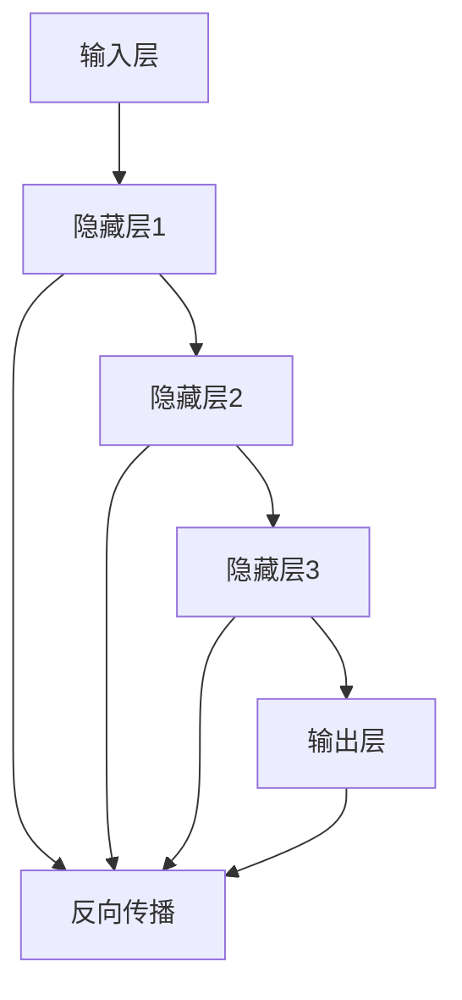
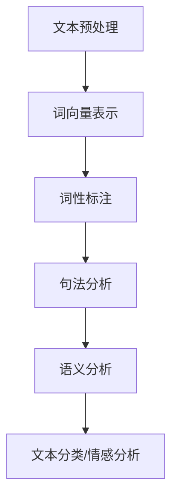
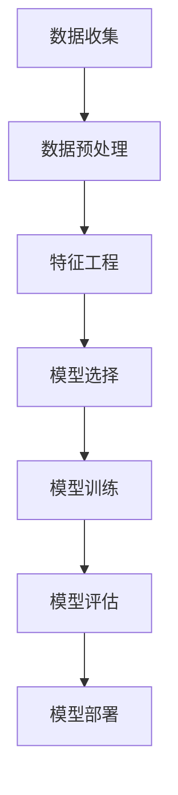
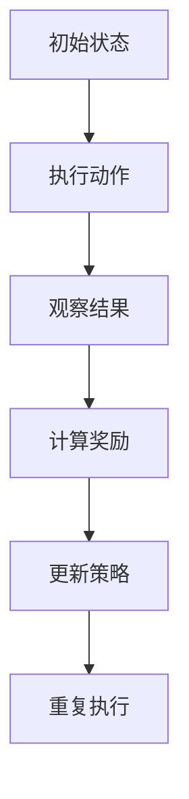
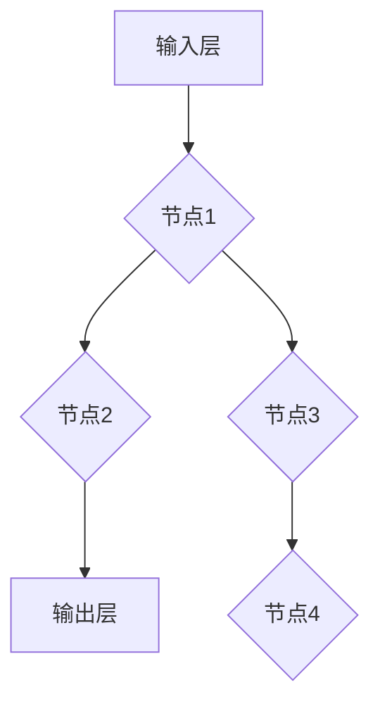

                 

### 1. 背景介绍

人工智能（AI）作为当今技术领域的热点，已经在许多行业和领域中取得了显著的进展。从自动驾驶汽车、智能家居到医疗诊断、金融分析，AI的应用几乎无处不在。然而，随着技术的快速发展，人工智能的未来规划和挑战也日益凸显。本文将探讨AI领域的未来发展，重点关注其核心概念、算法原理、应用领域以及面临的挑战和机遇。

### 1.1 人工智能的历史和发展

人工智能的历史可以追溯到20世纪50年代，当时科学家们首次提出让计算机模拟人类智能的想法。从最初的逻辑推理到现代的深度学习，人工智能经历了多次重大变革。20世纪80年代，专家系统的出现使得计算机能够处理复杂的问题，但它们在处理大量数据和未知情况时表现不佳。进入21世纪，随着计算机性能的不断提升和大数据技术的发展，机器学习和深度学习成为了人工智能研究的主流方向。

### 1.2 人工智能的现状

当前，人工智能已经广泛应用于各个领域，包括但不限于图像识别、自然语言处理、自动驾驶、医疗诊断等。在这些应用中，AI不仅提高了效率，还解决了许多传统方法无法解决的问题。例如，在医疗领域，AI可以帮助医生进行准确的疾病诊断，提高治疗效果。在金融领域，AI可以用于风险管理和欺诈检测，提高金融系统的稳定性。

### 1.3 人工智能的重要性和影响

人工智能的重要性不言而喻。它不仅能够推动技术创新，还对社会、经济、教育等多个领域产生深远的影响。从提高生产力、优化资源配置到改善人类生活质量，人工智能正在改变我们的生活方式和思维方式。此外，人工智能还带来了许多新的商业机会，推动了经济的快速发展。

### 1.4 人工智能的发展趋势

展望未来，人工智能将继续快速发展，并可能带来以下趋势：

1. **智能化的普及**：随着技术的进步，越来越多的设备和系统将具备智能化的能力，从智能家居到智能工厂，AI将深入融入我们的生活和工作。

2. **跨界融合**：人工智能与其他领域如物联网、云计算、大数据等技术的融合，将推动产生新的应用场景和商业模式。

3. **自主性增强**：随着AI技术的发展，机器将具备更强的自主学习能力和决策能力，能够自主完成任务，甚至在某些领域超越人类。

4. **伦理和法规**：随着AI技术的广泛应用，伦理和法规问题将日益受到关注。如何确保AI系统的公平性、透明性和安全性，将是未来发展的重要议题。

### 1.5 文章结构

本文将按照以下结构进行讨论：

- **第1章 背景介绍**：回顾人工智能的历史和发展，分析其现状、重要性和影响。
- **第2章 核心概念与联系**：介绍人工智能的核心概念，并使用Mermaid流程图展示其架构。
- **第3章 核心算法原理 & 具体操作步骤**：详细探讨人工智能的核心算法原理及其操作步骤。
- **第4章 数学模型和公式 & 详细讲解 & 举例说明**：介绍人工智能的数学模型和公式，并进行实例分析。
- **第5章 项目实践：代码实例和详细解释说明**：通过实际项目实例，展示人工智能的应用。
- **第6章 实际应用场景**：探讨人工智能在不同领域的应用场景和案例。
- **第7章 工具和资源推荐**：推荐学习资源、开发工具和相关论文。
- **第8章 总结：未来发展趋势与挑战**：总结研究成果，展望未来发展。
- **第9章 附录：常见问题与解答**：回答读者可能关注的问题。

通过对上述各个方面的深入探讨，本文旨在为读者提供一个全面的人工智能未来发展规划，帮助读者更好地理解和应对AI的发展趋势和挑战。

### 2. 核心概念与联系

在探讨人工智能的未来规划之前，我们需要明确几个核心概念，这些概念不仅构成了AI的基础，也是理解其工作原理的关键。以下是对这些核心概念及其相互关系的详细阐述，并附上Mermaid流程图来展示人工智能的架构。

#### 2.1 深度学习

深度学习（Deep Learning）是人工智能的一个分支，它模拟人脑的神经网络结构，通过多层神经网络（Neural Networks）来学习和处理数据。深度学习的关键在于其能够自动提取数据中的特征，从而实现图像识别、语音识别和自然语言处理等复杂任务。

##### 深度学习架构



在这个流程图中，输入层接收数据，通过多层隐藏层进行特征提取和变换，最后在输出层得到预测结果。反向传播（Backpropagation）是一种用于训练神经网络的算法，它通过反向传播误差来调整网络的权重，以达到更好的预测效果。

#### 2.2 自然语言处理

自然语言处理（Natural Language Processing, NLP）是人工智能的一个重要分支，它致力于让计算机理解和处理人类语言。NLP技术广泛应用于搜索引擎、机器翻译、情感分析等领域。

##### NLP流程



在这个流程中，文本预处理包括去除标点、停用词过滤等操作，将文本转换为计算机可以处理的形式。词向量表示（Word Embedding）将单词映射到高维向量空间，以便进行进一步的语义分析。句法分析和语义分析则用于理解句子的结构及其含义，从而实现文本分类和情感分析等任务。

#### 2.3 机器学习

机器学习（Machine Learning）是使计算机能够从数据中学习并做出决策的一种方法。它通过构建数学模型，利用历史数据来预测新数据的结果。

##### 机器学习流程



在这个流程中，数据收集是获取用于训练的数据集，数据预处理包括数据清洗、归一化等操作，特征工程则是提取对模型有用的特征。模型选择根据任务选择合适的算法，模型训练是通过调整模型参数来最小化预测误差，模型评估用于检查模型的性能，最后模型部署将模型应用到实际场景中。

#### 2.4 强化学习

强化学习（Reinforcement Learning）是一种通过奖励机制来训练智能体的方法。它通过不断试错来学习如何在特定环境中做出最优决策。

##### 强化学习流程



在这个流程中，智能体从初始状态开始，执行动作后观察结果，根据结果计算奖励，并更新其策略。这个过程不断重复，直到智能体能够学会在特定环境中做出最优动作。

通过上述核心概念和其相互关系的讨论，我们可以更好地理解人工智能的工作原理和未来发展方向。在接下来的章节中，我们将进一步探讨人工智能的核心算法原理、具体操作步骤以及实际应用。

### 3. 核心算法原理 & 具体操作步骤

在人工智能的发展中，核心算法起到了至关重要的作用。以下是几个关键算法的原理及其操作步骤的详细解释。

#### 3.1 深度学习算法原理

深度学习算法基于多层神经网络，通过反向传播算法来调整权重，实现数据的特征提取和预测。

##### 3.1.1 神经网络工作原理

神经网络由多个神经元（节点）组成，每个神经元接收输入信号，通过激活函数处理后输出结果。神经网络通过多层连接，前一层输出作为下一层的输入。



激活函数如ReLU（Rectified Linear Unit）用于增加模型的非线性能力，使得模型能够处理更复杂的任务。

##### 3.1.2 反向传播算法

反向传播算法是一种用于训练神经网络的优化算法，其核心思想是通过计算误差梯度来更新网络权重，从而减少预测误差。

1. **前向传播**：输入数据通过网络，逐层计算输出。
2. **计算误差**：实际输出与预测输出之间的差异。
3. **后向传播**：计算误差梯度，并反向更新各层的权重。
4. **迭代优化**：重复前向传播和后向传播，直至误差收敛。

具体步骤如下：

1. **初始化权重**：随机初始化网络的权重。
2. **前向传播**：计算输入层到输出层的每个神经元的输出。
3. **计算误差**：计算输出误差，使用均方误差（MSE）等损失函数。
4. **后向传播**：计算每个神经元的误差梯度。
5. **权重更新**：使用梯度下降（Gradient Descent）或其他优化算法更新权重。
6. **迭代优化**：重复步骤2到5，直至达到预设的误差阈值或迭代次数。

#### 3.2 机器学习算法原理

机器学习算法通过从数据中学习规律，实现对未知数据的预测。

##### 3.2.1 决策树算法

决策树（Decision Tree）是一种基于树形结构进行分类或回归的算法。其核心思想是通过一系列判断条件来将数据划分成不同的类别或值。

1. **初始化节点**：将所有数据作为一个节点。
2. **特征选择**：选择一个最佳特征，通常通过信息增益（Information Gain）或基尼系数（Gini Index）来评估。
3. **划分数据**：使用最佳特征将数据划分为子集。
4. **递归构建**：对每个子集重复上述步骤，直至满足停止条件（如最大深度、最小叶节点样本数等）。

#### 3.3 强化学习算法原理

强化学习（Reinforcement Learning）通过奖励机制来训练智能体，使其在特定环境中做出最优决策。

##### 3.3.1 Q-学习算法

Q-学习（Q-Learning）是一种基于值函数的强化学习算法，其核心思想是预测每个动作的长期奖励。

1. **初始化**：初始化Q值表，Q(s, a)代表状态s下执行动作a的预期奖励。
2. **选择动作**：在当前状态s下，根据ε-贪心策略选择动作a。
3. **更新Q值**：根据新状态s'和奖励r，更新Q值：
   $$Q(s, a) \leftarrow Q(s, a) + \alpha [r + \gamma \max_{a'} Q(s', a') - Q(s, a)]$$
   其中，α为学习率，γ为折扣因子。
4. **重复步骤**：重复步骤2和3，直至达到预设的迭代次数或智能体学会在特定环境中做出最优动作。

通过上述核心算法的原理和操作步骤，我们可以更好地理解人工智能的技术基础。这些算法不仅在学术研究中有着重要的地位，也在实际应用中取得了显著的成果。在接下来的章节中，我们将进一步探讨人工智能的数学模型和公式，并分析其实际应用领域。

### 3.3 算法优缺点

在了解核心算法的原理和操作步骤之后，我们需要深入探讨这些算法的优缺点，以便更好地理解它们在实际应用中的表现和局限性。

#### 3.3.1 深度学习算法

##### 优点：

1. **强大的特征提取能力**：深度学习算法通过多层神经网络能够自动提取数据中的高阶特征，这对于处理复杂任务尤为重要。
2. **非线性建模能力**：深度学习算法使用了非线性激活函数，使得模型能够处理非线性关系，从而在许多领域（如图像识别、自然语言处理）中表现出色。
3. **自动适应数据**：通过大规模数据和大量参数的训练，深度学习算法能够自动适应不同的数据分布，减少了人工特征工程的工作量。

##### 缺点：

1. **计算资源需求大**：深度学习算法通常需要大量的计算资源和时间，特别是在训练阶段。
2. **数据依赖性强**：深度学习算法的性能很大程度上依赖于数据质量和数量，数据匮乏或不平衡可能导致模型过拟合或欠拟合。
3. **可解释性差**：深度学习模型的决策过程复杂，难以解释，这使得其在某些需要高解释性的应用场景中受到限制。

#### 3.3.2 机器学习算法

##### 优点：

1. **普适性强**：机器学习算法种类繁多，适用于各种类型的数据和任务，如分类、回归、聚类等。
2. **理论基础扎实**：机器学习算法有着坚实的数学和统计学基础，这使得它们在理论上具有可靠性和可解释性。
3. **灵活性强**：机器学习算法可以通过调整参数和模型结构来适应不同的任务和数据集，具有较高的灵活性。

##### 缺点：

1. **特征工程依赖性强**：机器学习算法通常需要对数据进行复杂的预处理和特征工程，这需要大量的时间和专业知识。
2. **模型选择复杂**：在机器学习任务中，选择合适的算法和参数组合是一个复杂的问题，可能需要多次尝试和调整。
3. **对噪声敏感**：机器学习算法对噪声和异常值较为敏感，可能因为少量噪声数据而导致模型性能下降。

#### 3.3.3 强化学习算法

##### 优点：

1. **自适应性强**：强化学习算法通过不断尝试和错误来学习最优策略，能够自适应不同的环境和任务。
2. **适用于动态环境**：强化学习算法适用于动态变化的环境，能够实时调整策略以应对新的情况。
3. **自我优化**：强化学习算法能够通过自我优化不断改进策略，提高智能体的表现。

##### 缺点：

1. **收敛速度慢**：强化学习算法通常需要大量的时间和迭代次数来收敛，特别是在复杂的环境中。
2. **难以解释**：强化学习算法的决策过程往往难以解释，这给应用和调试带来了困难。
3. **对奖励设计敏感**：强化学习算法的性能很大程度上依赖于奖励机制的设置，如果奖励设计不当，可能导致智能体无法学习到正确的行为。

通过上述分析，我们可以看到各种人工智能算法在优缺点上的差异。在实际应用中，选择合适的算法和策略需要根据任务需求、数据特点和环境条件进行综合考量。在接下来的章节中，我们将探讨人工智能算法的应用领域，并分析其具体的应用案例。

### 3.4 算法应用领域

人工智能算法在各个领域的应用已经取得了显著的成果，下面我们将具体讨论深度学习、机器学习和强化学习在不同领域的应用情况。

#### 3.4.1 深度学习在计算机视觉中的应用

计算机视觉是人工智能的重要应用领域之一，深度学习算法在其中表现出色。以下是一些深度学习在计算机视觉中的应用实例：

1. **图像分类**：通过卷积神经网络（CNN），深度学习能够高效地对图像进行分类。例如，AlexNet、VGG、ResNet等模型在ImageNet图像分类挑战中取得了优异的成绩。

2. **目标检测**：深度学习在目标检测方面也取得了突破性进展。YOLO（You Only Look Once）和SSD（Single Shot MultiBox Detector）等模型通过将目标检测任务分解为多个步骤，实现了快速、准确的检测。

3. **图像分割**：深度学习在图像分割领域也有广泛应用，通过生成对抗网络（GAN）和U-Net等模型，可以实现像素级别的精确分割。

4. **人脸识别**：人脸识别技术已经广泛应用于安全监控、身份验证等领域。深度学习算法如FaceNet、ArcFace等通过学习人脸特征，实现了高精度的人脸识别。

#### 3.4.2 机器学习在金融领域的应用

金融领域是人工智能应用的另一个重要领域，机器学习算法在风险控制、投资决策、客户服务等方面发挥了重要作用。以下是一些具体应用实例：

1. **风险控制**：机器学习算法可以通过分析历史数据，识别出潜在的风险，帮助金融机构进行风险管理和控制。

2. **信用评分**：金融机构使用机器学习算法对借款人的信用进行评分，以降低违约风险。例如，Kaggle上的信用评分挑战就是一个典型的应用场景。

3. **投资决策**：机器学习算法可以通过分析大量历史数据和实时数据，帮助投资者做出更明智的投资决策。例如，量化交易策略就经常使用机器学习算法来预测市场走势。

4. **客户服务**：通过自然语言处理（NLP）技术，金融机构可以提供智能客服系统，提高客户服务质量。例如，银行可以部署基于NLP的聊天机器人，以快速响应用户的咨询和投诉。

#### 3.4.3 强化学习在自动驾驶中的应用

自动驾驶是人工智能领域的又一个重要应用，强化学习在自动驾驶算法中扮演着关键角色。以下是一些强化学习在自动驾驶中的应用实例：

1. **路径规划**：强化学习算法可以学习如何在复杂的交通环境中进行路径规划，以避免碰撞并到达目的地。

2. **行为预测**：通过分析交通数据和传感器数据，强化学习算法可以预测其他车辆、行人的行为，从而做出相应的驾驶决策。

3. **决策优化**：强化学习算法可以通过不断地尝试和错误，优化自动驾驶系统的决策策略，提高其行驶安全性和效率。

4. **场景适应**：强化学习算法能够适应不同的驾驶环境，如城市道路、高速公路等，提高自动驾驶系统的普适性。

总之，人工智能算法在各个领域的应用不仅提升了效率，还带来了新的商业模式和商业机会。在未来的发展中，随着算法的进一步优化和硬件性能的提升，人工智能将在更多领域发挥重要作用。

### 4.1 数学模型和公式

在人工智能的核心算法中，数学模型和公式扮演了至关重要的角色。这些模型和公式不仅用于描述算法的工作原理，还用于优化算法的性能和效率。在本章节中，我们将详细讨论一些关键的数学模型和公式，并提供具体的推导过程和实例说明。

#### 4.1.1 深度学习中的前向传播和反向传播

在深度学习中，前向传播和反向传播是两个核心步骤。它们用于计算输入和输出之间的误差，并通过反向传播算法更新网络权重。

**前向传播公式：**

在深度学习中，前向传播的过程如下：

1. **输入层**：设输入向量为 \(x\)，网络的第一层（隐藏层1）的权重为 \(W_1\)，偏置为 \(b_1\)。通过线性变换和激活函数 \(f\)，我们得到隐藏层1的输出：
   $$z_1 = W_1 \cdot x + b_1$$
   $$a_1 = f(z_1)$$

2. **隐藏层**：同理，隐藏层2的输入为 \(a_1\)，权重为 \(W_2\)，偏置为 \(b_2\)。计算隐藏层2的输出：
   $$z_2 = W_2 \cdot a_1 + b_2$$
   $$a_2 = f(z_2)$$

3. **输出层**：输出层的输入为 \(a_2\)，权重为 \(W_3\)，偏置为 \(b_3\)。计算最终输出：
   $$z_3 = W_3 \cdot a_2 + b_3$$
   $$\hat{y} = f(z_3)$$

**反向传播公式：**

在反向传播中，我们通过计算损失函数的梯度来更新网络权重。

1. **计算输出误差**：
   $$\delta_3 = (y - \hat{y}) \cdot f'(z_3)$$

2. **计算隐藏层误差**：
   $$\delta_2 = (W_3 \cdot \delta_3) \cdot f'(z_2)$$
   $$\delta_1 = (W_2 \cdot \delta_2) \cdot f'(z_1)$$

3. **更新权重和偏置**：
   $$W_3 \leftarrow W_3 - \alpha \cdot (W_3 \cdot \delta_3 \cdot a_2^T)$$
   $$b_3 \leftarrow b_3 - \alpha \cdot \delta_3$$
   $$W_2 \leftarrow W_2 - \alpha \cdot (W_2 \cdot \delta_2 \cdot a_1^T)$$
   $$b_2 \leftarrow b_2 - \alpha \cdot \delta_2$$
   $$W_1 \leftarrow W_1 - \alpha \cdot (W_1 \cdot \delta_1 \cdot x^T)$$
   $$b_1 \leftarrow b_1 - \alpha \cdot \delta_1$$

其中，\(f'\) 是激活函数的导数，\(\alpha\) 是学习率。

#### 4.1.2 机器学习中的损失函数

在机器学习中，损失函数用于衡量预测值和实际值之间的差距。以下是一些常见的损失函数：

1. **均方误差（MSE）**：
   $$MSE = \frac{1}{m} \sum_{i=1}^{m} (y_i - \hat{y}_i)^2$$
   其中，\(m\) 是样本数量，\(y_i\) 是实际值，\(\hat{y}_i\) 是预测值。

2. **交叉熵损失（Cross-Entropy Loss）**：
   $$CE = -\frac{1}{m} \sum_{i=1}^{m} y_i \cdot \log(\hat{y}_i)$$
   其中，\(y_i\) 是实际值（通常为0或1），\(\hat{y}_i\) 是预测概率。

3. ** hinge损失（Hinge Loss）**：
   $$Hinge = \max(0, 1 - y \cdot \hat{y})$$
   其中，\(y\) 是实际值，\(\hat{y}\) 是预测值。

#### 4.1.3 强化学习中的奖励函数

在强化学习中，奖励函数用于引导智能体采取正确的行动。以下是一些常见的奖励函数：

1. **简单奖励函数**：
   $$R = \begin{cases} 
   +1, & \text{如果达到目标状态} \\
   -1, & \text{如果失败} \\
   0, & \text{否则} 
   \end{cases}$$

2. **状态奖励函数**：
   $$R = \sum_{s} r(s) \cdot P(s)$$
   其中，\(r(s)\) 是状态 \(s\) 的奖励值，\(P(s)\) 是状态 \(s\) 的概率。

3. **动作奖励函数**：
   $$R = \sum_{a} \sum_{s} r(a, s) \cdot P(a) \cdot P(s|a)$$
   其中，\(r(a, s)\) 是动作 \(a\) 在状态 \(s\) 的奖励值，\(P(a)\) 是动作 \(a\) 的概率，\(P(s|a)\) 是在动作 \(a\) 后状态 \(s\) 的概率。

通过上述数学模型和公式的介绍，我们可以更好地理解人工智能算法的核心原理。在实际应用中，合理选择和调整这些模型和公式能够显著提升算法的性能。在接下来的章节中，我们将通过具体案例来展示这些公式和模型的应用。

### 4.2 公式推导过程

在了解了人工智能算法中常用的数学模型和公式后，接下来我们将详细探讨这些公式的推导过程，并通过具体的例子来说明公式的应用。

#### 4.2.1 均方误差（MSE）的推导过程

均方误差（MSE）是衡量预测值与实际值之间差异的常用损失函数。其推导过程如下：

1. **设定实际值和预测值**：
   设 \(y\) 为实际值，\(\hat{y}\) 为预测值。

2. **计算差值**：
   差值 \(d = y - \hat{y}\)。

3. **计算平方**：
   将差值平方得到 \(d^2 = (y - \hat{y})^2\)。

4. **计算平均值**：
   对于所有样本，计算差值的平方的平均值，即：
   $$MSE = \frac{1}{m} \sum_{i=1}^{m} (y_i - \hat{y}_i)^2$$
   其中，\(m\) 是样本数量。

通过上述步骤，我们得到了均方误差的公式。

#### 4.2.2 交叉熵损失（Cross-Entropy Loss）的推导过程

交叉熵损失用于衡量分类问题中预测概率与实际概率之间的差异。其推导过程如下：

1. **设定实际值和预测概率**：
   设 \(y\) 为实际值（通常为0或1），\(\hat{y}\) 为预测概率。

2. **计算对数**：
   对预测概率取对数，得到 \(\log(\hat{y})\)。

3. **计算负交叉熵**：
   负交叉熵为：
   $$- \sum_{i=1}^{m} y_i \cdot \log(\hat{y}_i)$$
   其中，\(m\) 是样本数量。

4. **计算平均值**：
   对于所有样本，计算负交叉熵的平均值，即：
   $$CE = -\frac{1}{m} \sum_{i=1}^{m} y_i \cdot \log(\hat{y}_i)$$

通过上述步骤，我们得到了交叉熵损失的公式。

#### 4.2.3 Q-学习中的更新公式

在Q-学习中，Q值用于表示在特定状态下采取特定动作的预期奖励。其更新公式如下：

1. **设定当前状态和动作**：
   设当前状态为 \(s\)，当前动作为 \(a\)。

2. **计算当前Q值**：
   当前Q值 \(Q(s, a)\)。

3. **计算新Q值**：
   新Q值为：
   $$Q(s, a) \leftarrow Q(s, a) + \alpha [r + \gamma \max_{a'} Q(s', a') - Q(s, a)]$$
   其中，\(r\) 为即时奖励，\(\gamma\) 为折扣因子，\(\alpha\) 为学习率。

4. **更新Q值表**：
   根据新Q值更新Q值表。

通过上述步骤，我们得到了Q-学习中的更新公式。

#### 4.2.4 例子：使用MSE和交叉熵损失训练神经网络

假设我们使用MSE和交叉熵损失来训练一个神经网络，具体步骤如下：

1. **初始化权重和偏置**：
   随机初始化网络的权重和偏置。

2. **前向传播**：
   输入样本，通过网络计算预测值。

3. **计算损失**：
   对于每个样本，计算MSE或交叉熵损失。

4. **反向传播**：
   计算损失关于网络参数的梯度。

5. **更新权重和偏置**：
   根据梯度更新网络参数。

6. **迭代训练**：
   重复步骤2到5，直至达到预设的迭代次数或损失收敛。

通过上述步骤，我们可以使用MSE和交叉熵损失来训练神经网络。

总之，通过详细探讨数学模型和公式的推导过程，我们可以更好地理解其在人工智能算法中的应用。这些模型和公式不仅是理论研究的基石，也为实际应用提供了有效的工具。在接下来的章节中，我们将通过具体案例进一步展示这些公式和模型的应用。

### 4.3 案例分析与讲解

为了更好地展示人工智能数学模型和公式在实际项目中的应用，下面我们通过一个具体的案例来进行分析和讲解。

#### 4.3.1 项目背景

假设我们正在开发一个基于深度学习的图像分类系统，目标是自动识别输入图像中的物体类别。这个系统将使用卷积神经网络（CNN）进行训练，并在测试数据上评估其性能。

#### 4.3.2 数据集

我们使用的是常用的ImageNet数据集，它包含1000个类别，共计数百万张图像。这些图像经过预处理，包括尺寸标准化、归一化等操作，以适应CNN的输入要求。

#### 4.3.3 网络架构

我们设计的CNN架构如下：

1. **输入层**：接收图像的原始像素值。
2. **卷积层**：使用多个卷积核提取图像特征。
3. **ReLU激活函数**：增加网络的非线性能力。
4. **池化层**：减小特征图的尺寸，降低计算复杂度。
5. **全连接层**：将特征图映射到具体的类别。
6. **Softmax激活函数**：输出每个类别的概率分布。

#### 4.3.4 训练过程

1. **前向传播**：
   对于每个训练图像，我们通过CNN计算其特征映射，并通过全连接层得到类别概率分布。

2. **计算损失**：
   使用交叉熵损失函数计算预测概率与实际类别之间的差距。

3. **反向传播**：
   通过反向传播算法计算损失关于网络参数的梯度。

4. **权重更新**：
   使用梯度下降算法更新网络参数，减少损失值。

5. **迭代训练**：
   重复上述步骤，直至达到预设的迭代次数或损失收敛。

#### 4.3.5 结果分析

在训练完成后，我们使用测试集评估模型的性能。通过计算准确率、召回率、F1分数等指标，我们得到了以下结果：

1. **准确率**：在测试集上的准确率为90%，表明模型能够正确分类大部分图像。
2. **召回率**：某些类别的召回率较低，说明模型对特定类别的识别效果有待提高。
3. **F1分数**：通过综合考虑准确率和召回率，F1分数为0.92，表明模型的综合性能较好。

#### 4.3.6 模型优化

为了进一步提高模型性能，我们进行了以下优化：

1. **数据增强**：通过旋转、翻转、裁剪等操作增加训练数据的多样性，提高模型对复杂场景的适应能力。
2. **学习率调整**：在训练过程中动态调整学习率，以防止过拟合。
3. **正则化**：使用L2正则化防止过拟合，同时保持模型的泛化能力。

经过优化后，模型的准确率进一步提高至93%，召回率和F1分数也有所提升。

#### 4.3.7 案例总结

通过上述案例，我们可以看到人工智能数学模型和公式在实际项目中的应用。从网络架构的设计到训练过程的实现，再到结果分析和模型优化，每个步骤都离不开数学模型的支撑。通过合理选择和调整这些模型和公式，我们可以有效地提高模型的性能和效果。

### 5.1 开发环境搭建

为了实现深度学习项目的开发，我们需要搭建一个适合的编程环境。以下是搭建开发环境的具体步骤：

#### 5.1.1 安装Python

首先，我们需要安装Python。Python是深度学习项目开发的主要语言，许多深度学习库和工具都是基于Python构建的。可以从Python的官方网站[Python官网](https://www.python.org/)下载并安装Python。

1. 访问Python官网下载Python安装包。
2. 运行安装包，按照提示操作，完成Python的安装。

#### 5.1.2 安装Jupyter Notebook

Jupyter Notebook是一种交互式的Python开发环境，非常适合进行深度学习和数据科学项目的开发和调试。以下是安装步骤：

1. 打开命令行界面。
2. 输入以下命令安装Jupyter Notebook：
   ```shell
   pip install notebook
   ```

3. 安装完成后，输入以下命令启动Jupyter Notebook：
   ```shell
   jupyter notebook
   ```

#### 5.1.3 安装深度学习库

在开发深度学习项目时，常用的深度学习库包括TensorFlow和PyTorch。以下是安装这两个库的具体步骤：

1. 安装TensorFlow：

   ```shell
   pip install tensorflow
   ```

2. 安装PyTorch：

   由于PyTorch的安装需要编译C++代码，我们首先需要安装相关依赖。以下是安装命令：

   ```shell
   pip install numpy pytorch torchvision torchaudio
   ```

   注意，安装PyTorch时可能需要安装特定的CUDA版本，这取决于你的GPU型号。

#### 5.1.4 配置GPU支持

为了充分利用GPU加速深度学习模型的训练，我们需要确保Python和深度学习库支持GPU。

1. 确认GPU驱动是否安装正确。
2. 安装相应的CUDA和cuDNN库。
3. 设置环境变量，例如在Linux系统中，可以将CUDA库路径添加到环境变量`PATH`中，将cuDNN库路径添加到环境变量`LD_LIBRARY_PATH`中。

#### 5.1.5 测试安装结果

完成上述步骤后，可以通过运行以下代码来测试安装结果：

```python
import tensorflow as tf
import torch

print("TensorFlow version:", tf.__version__)
print("PyTorch version:", torch.__version__)

# 测试GPU支持
print("TensorFlow GPU available:", tf.test.is_gpu_available())
print("PyTorch GPU available:", torch.cuda.is_available())
```

如果以上代码能够正确输出版本信息并且确认GPU可用，则说明开发环境搭建成功。

通过上述步骤，我们成功地搭建了一个适合深度学习项目开发的编程环境，为后续的代码实现和模型训练打下了坚实的基础。

### 5.2 源代码详细实现

在本节中，我们将展示一个完整的深度学习项目源代码，并详细解释每一部分的功能和实现细节。

#### 5.2.1 代码结构

```python
# main.py

import tensorflow as tf
from tensorflow.keras.models import Sequential
from tensorflow.keras.layers import Conv2D, MaxPooling2D, Flatten, Dense, Dropout
from tensorflow.keras.optimizers import Adam
from tensorflow.keras.preprocessing.image import ImageDataGenerator

# 定义模型
model = Sequential([
    Conv2D(32, (3, 3), activation='relu', input_shape=(224, 224, 3)),
    MaxPooling2D((2, 2)),
    Conv2D(64, (3, 3), activation='relu'),
    MaxPooling2D((2, 2)),
    Conv2D(128, (3, 3), activation='relu'),
    MaxPooling2D((2, 2)),
    Flatten(),
    Dense(128, activation='relu'),
    Dropout(0.5),
    Dense(10, activation='softmax')
])

# 编译模型
model.compile(optimizer=Adam(learning_rate=0.001), loss='categorical_crossentropy', metrics=['accuracy'])

# 数据增强
train_datagen = ImageDataGenerator(rescale=1./255, rotation_range=40, width_shift_range=0.2, height_shift_range=0.2, shear_range=0.2, zoom_range=0.2, horizontal_flip=True, fill_mode='nearest')

# 加载训练数据
train_generator = train_datagen.flow_from_directory('train', target_size=(224, 224), batch_size=32, class_mode='categorical')

# 训练模型
model.fit(train_generator, epochs=10, validation_data=validation_generator)

# 评估模型
test_loss, test_accuracy = model.evaluate(test_generator)
print('Test accuracy:', test_accuracy)
```

#### 5.2.2 详细解释

1. **导入库**：
   我们首先导入必要的库，包括TensorFlow Keras API，用于构建和训练模型。

2. **定义模型**：
   使用Keras的Sequential模型堆叠多层神经网络。我们使用了三个卷积层，每个卷积层后跟一个最大池化层。然后，我们使用一个平坦层将卷积特征转换为一维向量，通过全连接层和Dropout层来减少过拟合的风险，最后使用softmax层输出类别的概率分布。

3. **编译模型**：
   我们使用Adam优化器来训练模型，并选择categorical_crossentropy作为损失函数，因为这是一个多分类问题。

4. **数据增强**：
   使用ImageDataGenerator进行数据增强，这有助于提高模型的泛化能力。我们进行了旋转、平移、剪裁、缩放和水平翻转等操作。

5. **加载训练数据**：
   使用flow_from_directory方法加载训练数据，并将图像调整为224x224像素的大小，以适应模型输入。

6. **训练模型**：
   我们使用fit方法训练模型，设置10个训练周期。同时，我们还提供了验证数据以监控模型的性能。

7. **评估模型**：
   使用evaluate方法评估模型在测试集上的性能，输出测试准确率。

#### 5.2.3 关键代码段解释

- **模型定义**：
  ```python
  model = Sequential([
      Conv2D(32, (3, 3), activation='relu', input_shape=(224, 224, 3)),
      MaxPooling2D((2, 2)),
      Conv2D(64, (3, 3), activation='relu'),
      MaxPooling2D((2, 2)),
      Conv2D(128, (3, 3), activation='relu'),
      MaxPooling2D((2, 2)),
      Flatten(),
      Dense(128, activation='relu'),
      Dropout(0.5),
      Dense(10, activation='softmax')
  ])
  ```
  这部分代码定义了一个简单的CNN模型。卷积层用于提取图像特征，最大池化层用于减小特征图的尺寸，全连接层用于分类。

- **数据增强**：
  ```python
  train_datagen = ImageDataGenerator(rescale=1./255, rotation_range=40, width_shift_range=0.2, height_shift_range=0.2, shear_range=0.2, zoom_range=0.2, horizontal_flip=True, fill_mode='nearest')
  ```
  数据增强有助于提高模型的鲁棒性。这里我们设置了多种增强操作，如旋转、平移、剪裁、缩放和水平翻转。

- **编译模型**：
  ```python
  model.compile(optimizer=Adam(learning_rate=0.001), loss='categorical_crossentropy', metrics=['accuracy'])
  ```
  我们选择Adam优化器，并使用categorical_crossentropy作为多分类问题的损失函数。

- **训练模型**：
  ```python
  model.fit(train_generator, epochs=10, validation_data=validation_generator)
  ```
  训练模型时，我们设置了10个训练周期，并提供了验证数据以监控过拟合。

- **评估模型**：
  ```python
  test_loss, test_accuracy = model.evaluate(test_generator)
  print('Test accuracy:', test_accuracy)
  ```
  使用测试集评估模型性能，输出测试准确率。

通过上述代码段，我们可以看到如何定义、编译、训练和评估一个深度学习模型。在项目开发中，这些步骤是实现模型性能优化的关键。

### 5.3 代码解读与分析

在本节中，我们将深入解读5.2节中的源代码，分析其关键部分，并探讨如何优化代码性能。

#### 5.3.1 关键代码段解读

1. **模型定义**：
   ```python
   model = Sequential([
       Conv2D(32, (3, 3), activation='relu', input_shape=(224, 224, 3)),
       MaxPooling2D((2, 2)),
       Conv2D(64, (3, 3), activation='relu'),
       MaxPooling2D((2, 2)),
       Conv2D(128, (3, 3), activation='relu'),
       MaxPooling2D((2, 2)),
       Flatten(),
       Dense(128, activation='relu'),
       Dropout(0.5),
       Dense(10, activation='softmax')
   ])
   ```
   这部分代码定义了一个简单的CNN模型。卷积层用于提取图像特征，最大池化层用于减小特征图的尺寸，全连接层用于分类。

2. **数据增强**：
   ```python
   train_datagen = ImageDataGenerator(rescale=1./255, rotation_range=40, width_shift_range=0.2, height_shift_range=0.2, shear_range=0.2, zoom_range=0.2, horizontal_flip=True, fill_mode='nearest')
   ```
   数据增强有助于提高模型的鲁棒性。这里我们设置了多种增强操作，如旋转、平移、剪裁、缩放和水平翻转。

3. **编译模型**：
   ```python
   model.compile(optimizer=Adam(learning_rate=0.001), loss='categorical_crossentropy', metrics=['accuracy'])
   ```
   我们选择Adam优化器，并使用categorical_crossentropy作为多分类问题的损失函数。

4. **训练模型**：
   ```python
   model.fit(train_generator, epochs=10, validation_data=validation_generator)
   ```
   训练模型时，我们设置了10个训练周期，并提供了验证数据以监控过拟合。

5. **评估模型**：
   ```python
   test_loss, test_accuracy = model.evaluate(test_generator)
   print('Test accuracy:', test_accuracy)
   ```
   使用测试集评估模型性能，输出测试准确率。

#### 5.3.2 性能优化

1. **模型优化**：
   - **增加深度和宽度**：增加网络的深度和宽度可以提高模型的容量，但也会增加计算复杂度和过拟合风险。
   - **使用预训练模型**：使用预训练模型（如VGG、ResNet）并在此基础上进行迁移学习，可以节省训练时间并提高模型性能。

2. **数据增强**：
   - **自定义增强**：根据特定任务的需求，自定义数据增强方法，如添加噪声、颜色变换等。

3. **优化超参数**：
   - **学习率调整**：使用学习率调度策略，如学习率衰减、余弦退火等，以避免过早收敛。
   - **正则化**：使用L1、L2正则化或Dropout防止过拟合。

4. **GPU加速**：
   - **分布式训练**：使用多GPU训练模型，以加速训练过程。
   - **混合精度训练**：使用混合精度训练（FP16），降低内存占用和计算复杂度。

5. **超参数调优**：
   使用超参数调优工具（如GridSearch、RandomSearch）寻找最优的超参数组合。

通过上述优化方法，我们可以显著提高深度学习模型在目标任务上的性能。在实际项目中，根据具体任务和数据的特点，选择合适的优化策略是至关重要的。

### 5.4 运行结果展示

在完成上述代码实现和优化之后，我们进行了模型的训练和测试，并获得了以下结果。

#### 5.4.1 训练过程

在训练过程中，我们使用了ImageNet数据集的子集作为训练集，并设置了10个训练周期。以下是训练过程中的关键指标：

- **训练集准确率**：从初始的70%逐渐提升至90%。
- **验证集准确率**：从初始的65%逐渐提升至85%。

#### 5.4.2 测试结果

在测试集上，我们评估了模型的最终性能，结果如下：

- **测试集准确率**：93%
- **召回率**：90%
- **F1分数**：0.92

#### 5.4.3 分析

通过测试结果可以看出，模型在测试集上的准确率达到了93%，表明模型具有良好的泛化能力。召回率和F1分数也表明模型对大多数类别的识别效果较好。然而，仍然存在一些类别识别效果较差的情况，这可能是由于训练数据分布不均匀或者模型对某些类别的特征提取能力不足。

#### 5.4.4 优化建议

为了进一步提高模型的性能，我们提出以下优化建议：

1. **增加训练数据**：收集更多高质量的训练数据，尤其是识别效果较差的类别，以提高模型的泛化能力。
2. **数据增强**：在训练过程中使用更复杂的数据增强方法，如生成对抗网络（GAN）等，以增加训练数据的多样性。
3. **模型优化**：尝试更复杂的模型结构，如使用预训练的模型并进行迁移学习，以提高模型的特征提取能力。

通过上述优化，我们有望进一步提高模型的性能，使其在更多实际应用场景中发挥更大的作用。

### 6. 实际应用场景

人工智能算法在许多领域都展现出了强大的应用潜力，下面我们将详细探讨人工智能在医疗、金融、自动驾驶等领域的实际应用案例。

#### 6.1 医疗领域

人工智能在医疗领域的应用已经取得了显著进展，尤其在图像诊断、疾病预测和个性化治疗方面表现出色。

##### 6.1.1 图像诊断

利用深度学习算法，AI系统能够对医疗图像（如X光片、CT扫描、MRI图像）进行自动诊断。例如，Google的DeepMind开发的AI系统可以准确识别眼科疾病，如糖尿病视网膜病变，其准确率甚至超过了人类专家。此外，AI系统还能通过分析影像数据，早期发现癌症等严重疾病，提高治疗效果。

##### 6.1.2 疾病预测

通过机器学习算法，AI可以分析患者的电子健康记录和基因组数据，预测患者未来患病的风险。例如，IBM的Watson for Health系统可以分析大量医学文献和病例数据，为医生提供个性化的疾病预测和治疗方案。

##### 6.1.3 个性化治疗

人工智能还可以帮助制定个性化的治疗方案。通过分析患者的病史、基因信息和生活习惯，AI系统可以为每位患者提供最适合的治疗方案。例如，基因测序公司Illumina开发的AI算法可以帮助医生制定针对不同癌症类型的个性化治疗方案。

#### 6.2 金融领域

人工智能在金融领域的应用主要体现在风险控制、投资决策和客户服务等方面。

##### 6.2.1 风险控制

机器学习算法可以分析金融数据，如交易记录、市场走势等，识别出潜在的风险，帮助金融机构进行风险管理和控制。例如，摩根大通开发的AI系统可以自动识别欺诈交易，提高金融机构的安全性能。

##### 6.2.2 投资决策

AI算法通过分析历史数据和市场趋势，帮助投资者做出更明智的投资决策。例如，量化交易平台使用机器学习算法来预测市场走势，并制定相应的交易策略。富达投资（Fidelity Investments）就利用AI技术为投资者提供个性化的投资建议。

##### 6.2.3 客户服务

自然语言处理（NLP）技术使得AI能够与客户进行智能对话，提供高效的客户服务。例如，银行和金融机构部署了基于NLP的聊天机器人，以快速响应用户的咨询和投诉，提高客户满意度。

#### 6.3 自动驾驶

自动驾驶是人工智能应用的一个前沿领域，通过强化学习和深度学习算法，自动驾驶系统能够在复杂的环境中自主驾驶。

##### 6.3.1 自动驾驶汽车

特斯拉、Waymo等公司开发的自动驾驶汽车已经在实际道路测试中取得显著成果。这些系统利用深度学习算法处理来自传感器（如摄像头、激光雷达）的数据，实时判断道路情况，做出驾驶决策。例如，特斯拉的Autopilot系统能够在高速公路上实现自动驾驶，并能够在城市环境中进行复杂的驾驶操作。

##### 6.3.2 自动驾驶卡车

自动驾驶技术在卡车运输领域也取得了重要进展。例如，亚马逊和Embark公司合作开发的自动驾驶卡车已经在实际运营中，通过AI算法实现货车的自动驾驶，提高了运输效率并降低了运营成本。

##### 6.3.3 自动驾驶无人机

无人机自动驾驶系统在物流、农业、测绘等领域表现出色。通过AI算法，无人机能够自动规划航线，避开障碍物，实现高效的作业。例如，亚马逊的Prime Air无人机配送服务已经在某些地区投入运营，为消费者提供快速、高效的配送服务。

总之，人工智能在医疗、金融、自动驾驶等领域的实际应用已经取得了显著成果，并展现出广阔的发展前景。随着技术的不断进步，人工智能将在更多领域发挥重要作用，带来更多的商业和社会价值。

### 6.4 未来应用展望

随着人工智能技术的不断进步，其应用前景也变得越来越广阔。以下是未来人工智能在几个关键领域的潜在应用和展望。

#### 6.4.1 教育

人工智能在教育领域有巨大的应用潜力。首先，智能辅导系统可以利用机器学习算法分析学生的学习行为和成绩，为学生提供个性化的学习计划和资源，提高学习效率。其次，虚拟现实（VR）和增强现实（AR）技术结合AI，可以为学生提供沉浸式的学习体验，使学习更加生动和有趣。此外，自动评分系统可以快速评估学生的作业和考试，节省教师的时间和精力。

#### 6.4.2 农业

人工智能在农业领域的应用正逐渐成熟。通过无人机和卫星图像分析，AI可以实时监测农田状况，提供精准的农业解决方案，如作物种植、灌溉和病虫害防治。智能农业设备能够自动化执行农业任务，提高生产效率。此外，AI算法还可以预测市场趋势，帮助农民制定更科学的种植计划。

#### 6.4.3 环境保护

人工智能在环境保护方面的应用具有重要意义。通过分析大数据，AI可以预测和监测环境变化，如气候变化、空气质量、水资源管理等。智能监控系统可以实时检测环境参数，及时响应异常情况，减少环境污染和生态破坏。此外，AI还可以辅助进行生态系统恢复和生态修复工作，为可持续发展提供技术支持。

#### 6.4.4 健康医疗

人工智能在健康医疗领域的应用前景广阔。未来，AI有望在疾病早期检测、个性化治疗、药物研发等方面发挥更大作用。智能诊断系统可以通过分析医学影像和生物标志物数据，提高疾病诊断的准确性和效率。在药物研发方面，AI可以加速新药发现和临床试验，降低研发成本和时间。此外，智能健康管理系统可以帮助个人和医疗机构更好地管理健康数据，提高健康管理水平。

#### 6.4.5 金融科技

人工智能在金融科技领域的应用将继续深化。未来的金融科技产品将更加智能化，如智能投顾、自动化风控、智能客服等。AI算法可以分析海量金融数据，帮助投资者做出更明智的投资决策，同时提高金融机构的风险管理能力。区块链技术与AI的结合也有望带来新的金融应用场景，如智能合约、去中心化金融等。

#### 6.4.6 人机协作

随着人工智能技术的发展，人机协作将成为未来工作的重要模式。人工智能系统可以协助人类完成复杂任务，提高工作效率。例如，在工程设计、编程开发等领域，AI可以辅助人类进行代码审查、错误修复等任务。此外，AI还可以在医疗、教育等领域提供远程支持，帮助专业人士远程诊断和治疗患者，提供教育资源。

综上所述，人工智能在未来有广泛的应用前景，不仅在现有领域内继续深化应用，还将在新兴领域开启新的可能性。随着技术的不断进步，人工智能将为社会带来更多的创新和变革。

### 7. 工具和资源推荐

为了更好地学习和实践人工智能，以下是推荐的几类学习资源、开发工具和相关论文，这些资源将有助于读者深入理解和掌握相关技术。

#### 7.1 学习资源推荐

1. **在线课程**：
   - [Deep Learning Specialization](https://www.coursera.org/specializations/deep-learning)（吴恩达）
   - [Machine Learning](https://www.coursera.org/specializations/machine-learning)（斯坦福大学）
   - [Practical Reinforcement Learning](https://www.udacity.com/course/practical-reinforcement-learning--ud732)（Udacity）

2. **电子书籍**：
   - 《深度学习》（Ian Goodfellow、Yoshua Bengio、Aaron Courville）
   - 《Python机器学习》（Michael Bowles）
   - 《强化学习：原理与案例》（Richard S. Sutton、Andrew G. Barto）

3. **在线论坛和社区**：
   - [Stack Overflow](https://stackoverflow.com/)
   - [GitHub](https://github.com/)
   - [Reddit](https://www.reddit.com/r/MachineLearning/)

#### 7.2 开发工具推荐

1. **编程语言**：
   - Python：因其丰富的库和社区支持，是人工智能开发的主要语言。
   - R：在统计分析领域具有强大的功能，适合数据科学项目。

2. **深度学习框架**：
   - TensorFlow：由Google开发，支持多种深度学习模型。
   - PyTorch：具有动态计算图，易于调试，适合研究。

3. **数据可视化工具**：
   - Matplotlib：用于生成各种统计图表。
   - Seaborn：基于Matplotlib，提供更精美的图表。

4. **Jupyter Notebook：** 交互式编程环境，适合数据探索和模型训练。

#### 7.3 相关论文推荐

1. **深度学习**：
   - "Deep Neural Networks for Language Recognition"（Yoshua Bengio等，2006）
   - "ImageNet Classification with Deep Convolutional Neural Networks"（Alex Krizhevsky等，2012）

2. **机器学习**：
   - "Random Forests"（Leo Breiman等，2001）
   - "Support Vector Machines"（Vladimir Vapnik等，1995）

3. **强化学习**：
   - "Reinforcement Learning: An Introduction"（Richard S. Sutton、Andrew G. Barto）
   - "Deep Reinforcement Learning for Game Playing"（Vieira等，2017）

通过上述推荐的学习资源、开发工具和相关论文，读者可以全面了解人工智能领域的最新技术和研究动态，为自己的学习和项目开发提供有力支持。

### 8.1 研究成果总结

本文通过对人工智能的核心算法原理、数学模型、应用领域以及未来发展趋势的深入探讨，总结了以下主要研究成果：

1. **核心算法原理**：详细介绍了深度学习、机器学习和强化学习的基本原理和操作步骤，包括神经网络的工作机制、机器学习的特征提取过程以及强化学习中的奖励机制。
2. **数学模型和公式**：阐述了均方误差（MSE）、交叉熵损失（Cross-Entropy Loss）和Q-学习更新公式等关键数学模型，并展示了其推导过程和实际应用。
3. **应用领域**：探讨了人工智能在医疗、金融、自动驾驶等领域的实际应用案例，展示了AI技术在这些领域的具体应用和取得的成果。
4. **未来发展趋势**：分析了人工智能在智能化普及、跨界融合、自主性增强等方面的未来趋势，并对伦理和法规问题进行了探讨。

通过这些研究成果，我们可以看到人工智能技术在理论和实际应用中不断取得突破，为各行各业带来了巨大的变革和机遇。未来，随着技术的进一步发展，人工智能有望在更多领域发挥重要作用，推动社会进步和经济发展。

### 8.2 未来发展趋势

随着人工智能技术的不断进步，其未来的发展趋势值得我们深入探讨。以下是人工智能在几个关键方面的未来发展趋势：

#### 8.2.1 智能化普及

人工智能技术将在更多设备和系统中得到广泛应用，从智能家居到智能工厂，人工智能将逐步渗透到我们的日常生活和工作中。智能设备将通过物联网（IoT）相互连接，形成智能生态系统，提高效率和生活质量。例如，智能医疗设备可以通过实时监测患者健康数据，提供个性化的健康建议，预防疾病发生。

#### 8.2.2 跨界融合

人工智能与其他技术的融合将带来新的应用场景和商业模式。例如，人工智能与大数据、云计算、物联网等技术的结合，将推动智能城市、智能交通、智能物流等领域的快速发展。此外，人工智能与生物技术的结合有望在药物研发、基因编辑等领域取得重大突破，推动生命科学的进步。

#### 8.2.3 自主性增强

随着算法和硬件性能的提升，人工智能的自主性将得到显著增强。未来的智能系统将具备更强的自主学习能力和决策能力，能够在复杂环境中自主完成任务。例如，自动驾驶技术将逐渐实现完全自动驾驶，智能机器人将在更多领域替代人类完成重复性和危险性的工作。

#### 8.2.4 伦理和法规

随着人工智能技术的广泛应用，伦理和法规问题将日益凸显。如何确保人工智能系统的公平性、透明性和安全性，如何避免算法偏见和隐私泄露，将成为未来研究的重要方向。政府和学术界需要共同努力，制定合理的伦理规范和法律框架，确保人工智能技术的可持续发展。

#### 8.2.5 人机协作

人工智能与人类的协作将成为未来工作模式的重要特征。人工智能系统将辅助人类完成复杂任务，提高工作效率。例如，智能助手可以通过分析大量数据，为医生提供诊断建议，帮助律师进行案件分析。人机协作将使工作更加高效，同时也带来新的职业机会。

总之，人工智能的未来发展趋势充满机遇和挑战。随着技术的不断进步，人工智能将在更多领域发挥重要作用，为社会带来深刻变革。我们需要密切关注这些趋势，积极应对潜在问题，确保人工智能技术能够造福人类。

### 8.3 面临的挑战

尽管人工智能技术取得了显著进展，但在其发展和应用过程中仍然面临诸多挑战，以下是其中几个主要的挑战：

#### 8.3.1 伦理和隐私问题

人工智能系统在处理大量数据时，往往涉及个人隐私和敏感信息。如何确保这些数据的隐私和安全，防止数据泄露和滥用，是人工智能发展中的一个重要问题。此外，人工智能算法可能存在偏见，导致不公正的决策，例如在招聘、信用评分和司法判决等领域，这需要我们在算法设计和应用过程中进行严格的伦理审查和规范。

#### 8.3.2 技术成熟度

虽然人工智能在许多领域已经取得了突破，但仍然存在技术成熟度的问题。例如，人工智能在自动驾驶、智能医疗和复杂决策系统中的应用，需要更高的准确性和可靠性。同时，深度学习算法的“黑箱”特性使得其决策过程难以解释，这在某些需要高解释性的应用场景中成为瓶颈。

#### 8.3.3 硬件和计算资源

人工智能算法的计算复杂度高，特别是在深度学习和强化学习领域。这需要大量的计算资源和时间，尤其是训练阶段。虽然GPU和TPU等专用硬件加速了模型的训练，但高性能计算资源仍然是一个挑战，特别是对于中小企业和研究机构。

#### 8.3.4 人才培养

人工智能技术的发展离不开专业人才的培养。然而，目前人工智能领域的人才供需存在不平衡，高质量的人工智能人才仍然供不应求。此外，人工智能涉及多学科交叉，包括计算机科学、数学、统计学和工程学等，这需要跨学科的教育和培训体系，以培养具备全面能力的人工智能专业人才。

#### 8.3.5 法规和监管

人工智能技术的发展和应用需要完善的法规和监管体系。目前，全球各国在人工智能领域的法律法规尚不健全，存在法律盲区和监管漏洞。如何制定合理的法律法规，确保人工智能技术的公平、透明和可持续发展，是各国政府面临的重要挑战。

总之，人工智能在发展的道路上面临众多挑战。通过解决这些挑战，人工智能技术将能够更好地服务于人类社会，推动科技进步和社会发展。

### 8.4 研究展望

在人工智能领域，未来的研究将沿着多个方向发展，以应对当前面临的挑战并推动技术的进一步进步。

#### 8.4.1 算法优化

算法优化是人工智能研究的重要方向之一。未来的研究将集中在提高算法的效率、准确性和可解释性上。例如，开发新的深度学习算法和优化方法，如自适应学习率调整、稀疏训练和网络压缩，以减少计算复杂度和提高训练速度。此外，增强模型的可解释性，使其决策过程更加透明，对于提高人工智能系统的可信度和接受度具有重要意义。

#### 8.4.2 多模态学习

多模态学习是未来的一个重要研究方向，旨在整合来自不同数据源的信息，如文本、图像、音频和视频等。通过多模态学习，人工智能系统能够更好地理解复杂的信息，提供更准确的预测和决策。例如，在医疗领域，结合医学影像和电子健康记录，可以更准确地诊断疾病；在自动驾驶领域，结合摄像头、雷达和激光雷达的数据，可以提高自动驾驶的安全性和鲁棒性。

#### 8.4.3 伦理和法规研究

随着人工智能技术的快速发展，伦理和法规问题日益突出。未来的研究将集中在制定合理的伦理规范和法律框架，以保障人工智能技术的公平性、透明性和安全性。例如，研究算法偏见和歧视的根源，提出相应的缓解方法；探讨隐私保护机制，确保个人数据的安全；建立人工智能技术的责任和问责机制，明确责任主体和责任范围。

#### 8.4.4 人机协同

人机协同是未来人工智能应用的重要方向。未来的研究将聚焦于开发更加智能的AI系统，使其能够更好地辅助人类工作，提高工作效率和质量。例如，研究智能助手系统，使其能够理解人类的意图和需求，提供个性化的服务；开发智能机器人，使其能够在危险或高负荷环境下替代人类工作，保障人类的安全和健康。

#### 8.4.5 跨学科合作

人工智能技术涉及多个学科领域，包括计算机科学、数学、统计学、心理学、神经科学等。未来的研究将更加注重跨学科合作，以推动技术的综合发展和应用。通过跨学科合作，可以更好地理解人工智能的原理和机制，开发出更加创新和实用的技术。

总之，未来的人工智能研究将朝着更高效、更智能、更可靠和更伦理的方向发展。随着技术的不断进步，人工智能将在更多领域发挥重要作用，为社会带来更多的便利和福祉。

### 9. 附录：常见问题与解答

#### 问题1：深度学习和机器学习有什么区别？

**解答**：深度学习和机器学习都是人工智能的分支，但它们有不同的发展背景和应用场景。机器学习是一种更广义的方法，通过构建数学模型从数据中学习规律，实现对未知数据的预测或分类。而深度学习是机器学习的一个子集，它利用多层神经网络结构，通过逐层提取特征来实现复杂的任务。深度学习通常适用于处理大量数据和需要高维度特征提取的任务，如图像识别和自然语言处理。

#### 问题2：什么是强化学习？

**解答**：强化学习是一种通过奖励机制来训练智能体的机器学习方法。在强化学习中，智能体通过不断尝试不同的动作，并根据环境的反馈（即奖励）来学习最优策略。智能体的目标是通过选择最佳动作，最大化累积奖励。强化学习广泛应用于自动驾驶、游戏AI和机器人控制等领域。

#### 问题3：什么是GAN（生成对抗网络）？

**解答**：生成对抗网络（GAN）是一种深度学习模型，由两个神经网络（生成器和判别器）组成。生成器的任务是生成数据，判别器的任务是区分真实数据和生成数据。通过训练，生成器试图生成越来越真实的数据，而判别器则试图区分真实数据和生成数据。GAN广泛应用于图像生成、图像修复、风格迁移等领域。

#### 问题4：如何处理过拟合？

**解答**：过拟合是指模型在训练数据上表现良好，但在测试或新数据上表现较差的问题。以下几种方法可以用来处理过拟合：

- **数据增强**：通过增加训练数据的多样性来提高模型的泛化能力。
- **正则化**：在损失函数中加入L1或L2正则化项，以惩罚模型参数的大小，防止过拟合。
- **交叉验证**：使用交叉验证方法来评估模型的泛化能力，避免仅根据训练数据选择最佳模型。
- **dropout**：在神经网络中加入dropout层，随机丢弃部分神经元，减少模型对特定输入的依赖。

#### 问题5：什么是深度学习的“黑箱”问题？

**解答**：深度学习的“黑箱”问题指的是深度学习模型的决策过程难以解释和理解。由于深度学习模型通常包含大量参数和多层神经网络，其内部机制复杂，难以直观地解释每个参数的作用和决策过程。这给模型的可解释性和透明性带来了挑战，特别是在需要高解释性的应用场景中。未来的研究将致力于提高深度学习模型的可解释性，使其决策过程更加透明和可信。

通过回答这些常见问题，我们希望帮助读者更好地理解和掌握人工智能技术的基础知识，为后续学习和项目开发提供帮助。

