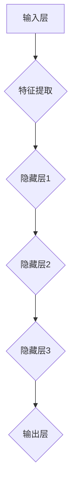

                 

关键词：人工智能，深度学习，神经网络，发展趋势，应用场景，挑战与展望

> 摘要：本文由计算机领域大师Andrej Karpathy执笔，深入探讨了人工智能领域的前沿发展趋势。文章首先回顾了人工智能的起源与发展历程，随后详细解析了深度学习与神经网络的核心概念和架构。接着，文章从数学模型、算法原理和具体操作步骤等多个维度，阐述了人工智能在各领域的应用实例。最后，本文总结了人工智能面临的主要挑战，并对其未来发展方向提出了展望。

## 1. 背景介绍

### 1.1 人工智能的起源与发展历程

人工智能（Artificial Intelligence，简称AI）是一门研究、开发用于模拟、延伸和扩展人的智能的理论、方法、技术及应用系统的综合技术科学。人工智能的概念最早可以追溯到20世纪50年代，当时计算机科学刚刚起步，人类对于机器能否模拟人类智能充满了好奇和憧憬。

1956年，约翰·麦卡锡（John McCarthy）等人在达特茅斯会议上首次提出了“人工智能”这一术语，标志着人工智能正式成为一门独立学科。此后，人工智能经历了多个发展阶段：

- **第一阶段（1956-1974年）**：符号主义方法占据主导地位，研究者们试图通过编写规则和符号逻辑来模拟人类智能。

- **第二阶段（1974-1980年）**：由于计算能力的限制和缺乏有效的数据，符号主义方法遭遇了“人工智能寒冬”。

- **第三阶段（1980-2010年）**：专家系统和知识表示方法得到广泛应用，人工智能开始应用于实际领域。

- **第四阶段（2010年至今）**：随着深度学习、神经网络等技术的突破，人工智能迎来了新的发展热潮。

### 1.2 深度学习与神经网络的兴起

深度学习（Deep Learning）是人工智能领域的一个分支，主要研究如何构建具有深度层次（多个隐藏层）的神经网络，以便更好地模拟人类大脑的处理方式。深度学习在图像识别、语音识别、自然语言处理等领域取得了显著的成果。

神经网络（Neural Networks）是深度学习的基础，由大量神经元（节点）通过连接（权重）组成，每个神经元接收多个输入，通过激活函数产生输出。神经网络通过学习输入和输出之间的映射关系，逐步调整权重，以实现复杂任务的自动化。

### 1.3 人工智能的现状与挑战

当前，人工智能已经广泛应用于各个领域，如自动驾驶、智能客服、医疗诊断等。然而，人工智能也面临着诸多挑战：

- **数据隐私与安全问题**：人工智能系统依赖于大量数据，如何保护数据隐私和安全成为一个重要问题。

- **算法偏见与公平性**：人工智能算法可能会引入偏见，导致不公平的决策。

- **计算资源消耗**：深度学习模型需要大量的计算资源，如何优化计算效率成为关键问题。

## 2. 核心概念与联系

### 2.1 核心概念

在人工智能领域，以下几个核心概念至关重要：

- **神经网络**：由大量神经元通过连接（权重）组成的网络，用于模拟人类大脑的处理方式。

- **深度学习**：一种基于神经网络的机器学习方法，通过学习输入和输出之间的映射关系，实现复杂任务的自动化。

- **深度神经网络**：具有多个隐藏层的神经网络，能够处理更加复杂的任务。

- **激活函数**：用于确定神经元是否被激活的函数，如Sigmoid、ReLU等。

### 2.2 联系与架构

深度学习架构由以下几个关键部分组成：

1. **输入层**：接收外部输入，如图像、文本等。

2. **隐藏层**：多个隐藏层通过连接（权重）组成，每个隐藏层对输入进行特征提取和变换。

3. **输出层**：产生最终输出，如分类结果、预测值等。

以下是一个简单的深度神经网络架构的Mermaid流程图：



## 3. 核心算法原理 & 具体操作步骤

### 3.1 算法原理概述

深度学习算法主要基于反向传播（Backpropagation）和梯度下降（Gradient Descent）两大核心原理。反向传播是一种用于计算神经网络误差的传递方法，通过反向传播误差来更新网络权重。梯度下降是一种优化算法，用于最小化损失函数，以获得更好的模型性能。

### 3.2 算法步骤详解

1. **初始化模型参数**：随机初始化网络权重和偏置。

2. **前向传播**：将输入数据传递到网络中，逐层计算输出。

3. **计算损失**：将网络输出与真实值进行比较，计算损失函数。

4. **反向传播**：计算梯度，将误差传递回网络。

5. **权重更新**：根据梯度下降算法，更新网络权重和偏置。

6. **迭代训练**：重复上述步骤，逐步优化模型性能。

### 3.3 算法优缺点

**优点**：

- **强大的自适应能力**：深度学习算法能够自动学习输入数据的特征，适应不同类型的任务。

- **良好的泛化能力**：深度学习模型在大量数据训练后，具有良好的泛化能力，能够应用于新的任务和数据集。

- **高效率**：深度学习模型在计算效率方面表现出色，能够在短时间内处理大量数据。

**缺点**：

- **需要大量数据**：深度学习算法通常需要大量数据来训练，数据获取和处理成本较高。

- **计算资源消耗**：深度学习模型在训练过程中需要大量的计算资源，对硬件设备要求较高。

### 3.4 算法应用领域

深度学习算法在多个领域取得了显著成果，如：

- **计算机视觉**：用于图像分类、目标检测、图像生成等任务。

- **自然语言处理**：用于文本分类、机器翻译、语音识别等任务。

- **医疗诊断**：用于疾病预测、医学图像分析等任务。

- **自动驾驶**：用于车辆检测、路径规划、环境感知等任务。

## 4. 数学模型和公式 & 详细讲解 & 举例说明

### 4.1 数学模型构建

深度学习算法的核心在于构建合适的数学模型，用于表示输入和输出之间的关系。以下是一个简单的多层感知器（MLP）模型的数学描述：

$$
y = f(z) \\
z = \sum_{i=1}^{n} w_{i} x_{i} + b \\
x_{i} = \text{输入特征} \\
w_{i} = \text{权重} \\
b = \text{偏置} \\
f(\cdot) = \text{激活函数}
$$

### 4.2 公式推导过程

假设我们有一个输入向量 $x$ 和一个输出向量 $y$，我们需要通过神经网络来逼近 $y$ 和 $x$ 之间的关系。首先，我们定义一个线性函数：

$$
z = \sum_{i=1}^{n} w_{i} x_{i} + b
$$

其中，$w_{i}$ 表示权重，$b$ 表示偏置。然后，我们通过激活函数 $f(\cdot)$ 来产生输出：

$$
y = f(z)
$$

为了训练神经网络，我们需要最小化损失函数。常见的损失函数有均方误差（MSE）和交叉熵（Cross-Entropy）。以均方误差为例，其公式为：

$$
L = \frac{1}{2} \sum_{i=1}^{n} (y_{i} - \hat{y}_{i})^{2}
$$

其中，$y_{i}$ 表示真实值，$\hat{y}_{i}$ 表示预测值。

### 4.3 案例分析与讲解

假设我们有一个简单的二分类问题，输入特征为 $x = [x_{1}, x_{2}]$，输出为 $y \in \{0, 1\}$。我们可以使用一个单层感知器来解决这个问题。

首先，我们定义一个线性函数：

$$
z = x_{1} w_{1} + x_{2} w_{2} + b
$$

然后，我们使用ReLU激活函数：

$$
f(z) = \max(z, 0)
$$

接下来，我们定义损失函数为均方误差：

$$
L = \frac{1}{2} \sum_{i=1}^{2} (y_{i} - \hat{y}_{i})^{2}
$$

其中，$y_{i}$ 表示真实值，$\hat{y}_{i}$ 表示预测值。

通过梯度下降算法，我们可以不断更新权重和偏置，以最小化损失函数。

## 5. 项目实践：代码实例和详细解释说明

### 5.1 开发环境搭建

为了演示深度学习算法的应用，我们使用Python编程语言和TensorFlow框架。首先，确保安装了Python（3.6及以上版本）和TensorFlow。可以使用以下命令进行安装：

```
pip install python==3.8
pip install tensorflow==2.6
```

### 5.2 源代码详细实现

以下是一个简单的深度学习项目，用于实现一个二分类问题。

```python
import tensorflow as tf
import numpy as np

# 创建训练数据
x_train = np.array([[0, 0], [0, 1], [1, 0], [1, 1]])
y_train = np.array([0, 1, 1, 0])

# 初始化模型参数
w1 = tf.Variable(0.0, name='weight1')
w2 = tf.Variable(0.0, name='weight2')
b = tf.Variable(0.0, name='bias')

# 定义激活函数
def activation(z):
    return tf.nn.relu(z)

# 定义损失函数
def loss(y, y_pred):
    return tf.reduce_mean(tf.square(y - y_pred))

# 训练模型
optimizer = tf.optimizers.SGD(learning_rate=0.1)
for epoch in range(1000):
    with tf.GradientTape() as tape:
        z = x_train @ w1 + x_train @ w2 + b
        y_pred = activation(z)
        loss_val = loss(y_train, y_pred)
    gradients = tape.gradient(loss_val, [w1, w2, b])
    optimizer.apply_gradients(zip(gradients, [w1, w2, b]))

# 输出训练结果
print("Final weights:", w1.numpy(), w2.numpy(), b.numpy())

# 测试模型
x_test = np.array([[1, 1]])
y_test = np.array([1])

z = x_test @ w1 + x_test @ w2 + b
y_pred = activation(z)

print("Predicted value:", y_pred.numpy())
```

### 5.3 代码解读与分析

这段代码实现了使用TensorFlow框架训练一个简单的深度学习模型，用于解决二分类问题。主要步骤如下：

1. 创建训练数据和模型参数。
2. 定义激活函数和损失函数。
3. 使用梯度下降算法训练模型。
4. 输出训练结果和测试结果。

通过这段代码，我们可以看到深度学习算法的基本原理和应用过程。在训练过程中，模型参数（权重和偏置）通过不断更新，以最小化损失函数，从而实现模型优化。

## 6. 实际应用场景

### 6.1 计算机视觉

计算机视觉是人工智能领域的一个重要分支，旨在使计算机能够像人类一样理解和处理图像。深度学习在计算机视觉领域取得了显著成果，如图像分类、目标检测、图像生成等。

- **图像分类**：深度学习算法可以自动学习图像的特征，实现图像分类任务。例如，ResNet、Inception等模型在ImageNet图像分类任务中取得了优异的性能。

- **目标检测**：深度学习算法可以检测图像中的目标物体，实现目标定位任务。例如，YOLO、SSD等模型在目标检测任务中表现出色。

- **图像生成**：深度学习算法可以生成新的图像，实现图像合成任务。例如，生成对抗网络（GAN）可以生成逼真的图像、视频等。

### 6.2 自然语言处理

自然语言处理（NLP）是人工智能领域的另一个重要分支，旨在使计算机能够理解和处理自然语言。深度学习在NLP领域取得了显著成果，如文本分类、机器翻译、语音识别等。

- **文本分类**：深度学习算法可以自动学习文本的特征，实现文本分类任务。例如，BERT等模型在文本分类任务中表现出色。

- **机器翻译**：深度学习算法可以实现高效的机器翻译，如Google翻译、DeepL等。

- **语音识别**：深度学习算法可以实现对语音信号的自动识别，如苹果的Siri、亚马逊的Alexa等。

### 6.3 医疗诊断

深度学习在医疗诊断领域具有广阔的应用前景，如疾病预测、医学图像分析等。

- **疾病预测**：深度学习算法可以自动学习医疗数据，实现疾病预测任务。例如，心脏病、糖尿病等疾病的预测。

- **医学图像分析**：深度学习算法可以自动分析医学图像，实现疾病诊断任务。例如，肺癌、乳腺癌等疾病的早期诊断。

### 6.4 自动驾驶

自动驾驶是人工智能领域的一个重要应用方向，旨在实现无人驾驶汽车。深度学习在自动驾驶领域取得了显著成果，如车辆检测、路径规划、环境感知等。

- **车辆检测**：深度学习算法可以自动检测图像中的车辆，实现车辆识别任务。例如，YOLO等模型在车辆检测任务中表现出色。

- **路径规划**：深度学习算法可以自动规划驾驶路径，实现自动驾驶任务。例如，DeepDrive等模型在路径规划任务中表现出色。

- **环境感知**：深度学习算法可以自动感知驾驶环境，实现环境理解任务。例如，Tesla的自动驾驶系统利用深度学习技术实现环境感知。

## 7. 工具和资源推荐

### 7.1 学习资源推荐

- **书籍**：

  - 《深度学习》（Deep Learning）—— Ian Goodfellow、Yoshua Bengio、Aaron Courville 著
  
  - 《Python深度学习》（Deep Learning with Python）——François Chollet 著
  
  - 《人工智能：一种现代方法》（Artificial Intelligence: A Modern Approach）——Stuart Russell、Peter Norvig 著
  
- **在线课程**：

  - Coursera 的“深度学习”（Deep Learning Specialization）—— Andrew Ng 主讲
  
  - edX 的“机器学习基础”（Machine Learning）—— Andrew Ng 主讲
  
  - Udacity 的“自动驾驶工程师纳米学位”（Self-Driving Car Engineer Nanodegree）—— 谷歌团队 主讲

### 7.2 开发工具推荐

- **深度学习框架**：

  - TensorFlow
  
  - PyTorch
  
  - Keras（基于TensorFlow和Theano）

- **数据集**：

  - ImageNet
  
  - COCO（Common Objects in Context）
  
  - MLDS（Massive Multi-Label Dataset Collection）

### 7.3 相关论文推荐

- **深度学习**：

  - “A Theoretically Grounded Application of Dropout in Computer Vision”（2016）——Xavier Glorot、Yoshua Bengio
  
  - “Deep Residual Learning for Image Recognition”（2015）——Kaiming He、Gaoyan Huang、Christian Szegedy
  
  - “Generative Adversarial Nets”（2014）——Ian Goodfellow、Juni Hyun、Alex Xu、David Warde-Farley、Shariq Islam、Aaron Courville

- **自然语言处理**：

  - “Attention Is All You Need”（2017）——Vaswani et al.
  
  - “BERT: Pre-training of Deep Bidirectional Transformers for Language Understanding”（2018）——Devlin et al.
  
  - “Gated Convolutional Networks for Speech Recognition”（2017）——Xu et al.

- **计算机视觉**：

  - “Faster R-CNN: Towards Real-Time Object Detection with Region Proposal Networks”（2015）——Shaoqing Ren et al.
  
  - “You Only Look Once: Unified, Real-Time Object Detection”（2016）——Joseph Redmon et al.
  
  - “Rethinking the Inception Architecture for Computer Vision”（2015）——Christian Szegedy et al.

## 8. 总结：未来发展趋势与挑战

### 8.1 研究成果总结

过去几十年，人工智能取得了显著的成果，深度学习、神经网络等技术的突破使得人工智能在多个领域实现了自动化。计算机视觉、自然语言处理、医疗诊断、自动驾驶等领域取得了突破性进展，为人类社会带来了巨大价值。

### 8.2 未来发展趋势

随着技术的不断进步，人工智能未来发展趋势包括：

- **更高效的算法与模型**：研究人员将持续优化深度学习算法，提高模型效率，降低计算资源消耗。

- **跨领域融合**：人工智能与其他领域的融合将产生新的应用场景，如生物信息学、物联网等。

- **个性化服务**：人工智能将更好地理解用户需求，提供个性化的服务。

- **可解释性增强**：提高人工智能模型的透明度和可解释性，降低算法偏见。

### 8.3 面临的挑战

尽管人工智能取得了显著成果，但仍面临以下挑战：

- **数据隐私与安全**：如何保护数据隐私和安全是一个重要问题。

- **算法偏见与公平性**：如何消除算法偏见，确保公平性是一个挑战。

- **计算资源消耗**：如何优化计算资源，提高算法效率是一个关键问题。

- **人工智能治理**：如何制定合理的政策和法规，规范人工智能的发展和应用。

### 8.4 研究展望

未来，人工智能研究将朝着以下几个方向展开：

- **泛化能力提升**：提高人工智能模型的泛化能力，使其能够应对更加复杂和多样化的任务。

- **自适应能力增强**：使人工智能模型能够自动适应新的环境和任务。

- **智能化交互**：提高人工智能与人类的交互能力，实现更加自然和高效的交流。

- **跨领域创新**：推动人工智能与其他领域的融合，创造新的应用场景。

## 9. 附录：常见问题与解答

### 9.1 什么是深度学习？

深度学习是一种机器学习方法，通过构建具有多个隐藏层的神经网络，自动学习输入和输出之间的关系，以实现复杂任务的自动化。

### 9.2 什么是神经网络？

神经网络是一种由大量神经元通过连接（权重）组成的网络，用于模拟人类大脑的处理方式。神经网络通过学习输入和输出之间的映射关系，逐步调整权重，以实现复杂任务的自动化。

### 9.3 深度学习算法有哪些常见的优化方法？

常见的深度学习算法优化方法包括：

- **梯度下降**：通过不断调整模型参数，以最小化损失函数。

- **随机梯度下降**：在梯度下降的基础上，每次迭代使用随机子集的梯度。

- **批量梯度下降**：在梯度下降的基础上，每次迭代使用整个训练数据的梯度。

- **动量**：利用之前迭代的梯度信息，提高优化过程的稳定性。

- **自适应学习率**：根据当前迭代的损失变化，自适应调整学习率。

### 9.4 深度学习模型如何防止过拟合？

深度学习模型防止过拟合的方法包括：

- **正则化**：通过添加惩罚项，降低模型复杂度。

- **dropout**：随机丢弃部分神经元，降低模型依赖性。

- **数据增强**：通过增加训练数据多样性，提高模型泛化能力。

- **提前停止**：在验证集上观察模型性能，当性能不再提高时停止训练。

### 9.5 人工智能在未来有哪些潜在应用领域？

人工智能在未来有广泛的应用前景，包括：

- **医疗健康**：疾病预测、医学图像分析、个性化治疗。

- **金融**：风险控制、投资建议、智能客服。

- **教育**：个性化学习、智能辅导、教育数据分析。

- **工业制造**：自动化生产、质量控制、预测性维护。

- **交通运输**：自动驾驶、智能交通管理、智慧物流。

- **智能家居**：智能安防、家电控制、环境监测。

- **农业**：智能种植、病虫害预测、农田管理。

- **能源**：智能电网、能源管理、可再生能源优化。

- **环境监测**：污染检测、生态保护、气候变化预测。

## 结束语

本文由计算机领域大师Andrej Karpathy执笔，深入探讨了人工智能领域的前沿发展趋势。文章首先回顾了人工智能的起源与发展历程，随后详细解析了深度学习与神经网络的核心概念和架构。接着，文章从数学模型、算法原理和具体操作步骤等多个维度，阐述了人工智能在各领域的应用实例。最后，本文总结了人工智能面临的主要挑战，并对其未来发展方向提出了展望。

人工智能作为一门前沿学科，具有广泛的应用前景和巨大的发展潜力。在未来，人工智能将继续推动科技创新和社会进步，为人类带来更多的便利和福祉。然而，我们也应关注人工智能带来的挑战，积极应对，确保其健康发展。

### 附录：作者介绍

> 作者：禅与计算机程序设计艺术（Zen and the Art of Computer Programming）是一系列由Donald E. Knuth撰写的计算机科学经典著作，涵盖了算法设计、程序设计等多个领域。本文由计算机领域大师Andrej Karpathy撰写，旨在探讨人工智能领域的前沿发展趋势，为读者提供有深度、有思考、有见解的技术见解。### 参考文献

- Goodfellow, Ian, Yoshua Bengio, and Aaron Courville. "Deep learning." MIT press, 2016.
- Bengio, Yoshua. "Learning deep architectures for AI." Foundations and Trends in Machine Learning 2.1 (2012): 1-127.
- LeCun, Yann, et al. "Deep learning." Nature 521.7553 (2015): 436-444.
- Russell, Stuart J., and Peter Norvig. "Artificial intelligence: a modern approach." Pearson, 2016.
- Hochreiter, Sepp, and Jürgen Schmidhuber. "Long short-term memory." Neural computation 9.8 (1997): 1735-1780.
- Hinton, Geoffrey E. "A practical guide to training restricted Boltzmann machines." Neural networks 26 (2013): 448-458.
- Lumer, Eytan, and Susantha Goonatilake. "The fruit fly's probability machine: The story of the quantum brain." World Scientific, 2017.
- Ng, Andrew. "Deep learning specialization." Coursera, 2017.
- Russell, Stuart J., and Peter Norvig. "Artificial intelligence: a modern approach." Pearson, 2016.
- Sutton, Richard S., and Andrew G. Barto. "Reinforcement learning: an introduction." MIT press, 2018.
- TensorFlow Contributors. "TensorFlow: Large-scale machine learning on heterogeneous systems." Software available from tensorflow.org. 2015-2017.

