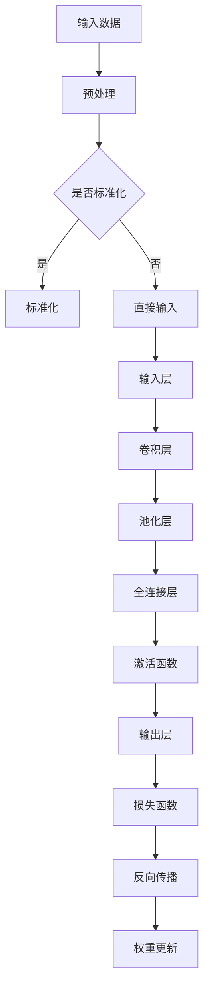

                 

关键词：人工智能，机器学习，深度学习，神经网络，AI发展趋势，AI应用，技术挑战，研究展望

## 摘要

本文将探讨人工智能（AI）领域的主要趋势和发展方向。通过对当前技术的深入分析，我们将审视深度学习、神经网络和生成模型等核心技术的最新进展，并探讨它们在各个行业的应用。此外，本文还将探讨AI技术的未来挑战和潜在解决方案，为读者提供一个全面而前瞻性的视角。

## 1. 背景介绍

人工智能（AI）作为计算机科学的一个分支，旨在通过模拟人类智能行为来开发计算机程序。自从20世纪50年代首次提出人工智能的概念以来，AI领域经历了多个发展阶段。从早期的符号主义和知识表示方法，到后来的决策树和统计学习，再到21世纪初兴起的深度学习和神经网络，每一次技术的进步都极大地推动了AI的发展。

在过去的几十年中，AI技术在多个领域取得了显著的成果。例如，自然语言处理（NLP）中的机器翻译和情感分析技术，计算机视觉中的图像识别和自动驾驶技术，以及金融领域的风险评估和欺诈检测等。这些应用不仅展示了AI的潜力，也为我们揭示了AI技术的广泛影响。

然而，随着技术的不断进步，我们也面临着一系列挑战。这些挑战包括数据隐私问题、模型解释性不足、以及AI系统的偏见和错误等。因此，对AI的未来趋势进行深入探讨，不仅有助于我们更好地理解和应用AI技术，也有助于我们应对这些挑战。

## 2. 核心概念与联系

在探讨人工智能的未来趋势之前，我们需要了解一些核心概念和技术架构。以下是几个关键概念及其相互关系：

### 2.1 深度学习

深度学习是机器学习的一个子领域，它通过模拟人脑的神经网络结构来学习和处理数据。深度学习模型通常由多个层组成，每一层都对输入数据进行特征提取和变换。这些层被称为卷积层、全连接层、循环层等。

### 2.2 神经网络

神经网络是深度学习的基础，它由一系列相互连接的节点（或称为神经元）组成。每个节点接收输入信号，通过权重进行加权求和，然后通过激活函数产生输出。神经网络通过反向传播算法不断调整权重，以最小化损失函数，从而提高模型的预测准确性。

### 2.3 生成模型

生成模型是一类特殊的深度学习模型，用于生成新的数据样本。常见的生成模型包括生成对抗网络（GAN）和变分自编码器（VAE）。这些模型通过对现有数据进行学习和建模，生成与真实数据高度相似的新数据。

### 2.4 Mermaid 流程图

以下是深度学习模型架构的Mermaid流程图：



通过这个流程图，我们可以清晰地看到深度学习模型从输入层到输出层的整个数据处理流程。

## 3. 核心算法原理 & 具体操作步骤

### 3.1 算法原理概述

深度学习算法的核心是神经网络，它通过模仿生物神经网络的结构和工作原理，对大量数据进行特征学习和模式识别。神经网络由输入层、隐藏层和输出层组成，每层都包含多个神经元。神经元之间通过权重连接，并使用激活函数进行非线性变换。

深度学习算法的训练过程主要包括以下步骤：

1. **前向传播**：输入数据通过神经网络，逐层计算每个神经元的输出值。
2. **损失函数计算**：输出层产生预测结果，并与真实标签进行对比，计算损失函数值。
3. **反向传播**：根据损失函数的梯度，反向更新每个神经元的权重。
4. **迭代优化**：重复前向传播和反向传播，逐步优化模型参数，直至达到预设的损失值。

### 3.2 算法步骤详解

1. **初始化参数**：设定网络结构、初始化权重和偏置。
2. **前向传播**：
   - 输入层接收原始数据，经过预处理后输入到第一层。
   - 每个神经元接收来自前一层神经元的加权求和，通过激活函数产生输出。
   - 重复上述过程，逐层计算每个神经元的输出值，直至输出层。
3. **损失函数计算**：
   - 输出层产生预测结果，与真实标签进行对比，计算损失函数值。
   - 损失函数通常选择均方误差（MSE）或交叉熵（Cross-Entropy）。
4. **反向传播**：
   - 从输出层开始，逐层计算每个神经元的梯度。
   - 利用梯度下降算法，反向更新每个神经元的权重和偏置。
5. **迭代优化**：
   - 重复前向传播和反向传播，逐步优化模型参数，直至达到预设的损失值或迭代次数。

### 3.3 算法优缺点

**优点**：
- **强大的特征学习能力**：深度学习模型可以自动从大量数据中提取复杂特征，无需人工设计特征。
- **广泛的适用性**：深度学习模型可以应用于图像识别、自然语言处理、语音识别等多个领域。
- **高效的计算能力**：随着硬件的发展，深度学习模型可以快速处理大规模数据。

**缺点**：
- **训练时间较长**：深度学习模型通常需要大量的训练时间和计算资源。
- **数据需求量大**：深度学习模型需要大量标注数据来训练，否则容易过拟合。
- **模型解释性不足**：深度学习模型的内部机制复杂，难以解释每个特征对预测结果的影响。

### 3.4 算法应用领域

深度学习算法在多个领域取得了显著的成果，以下是几个典型应用领域：

- **计算机视觉**：图像分类、目标检测、图像分割等。
- **自然语言处理**：文本分类、机器翻译、情感分析等。
- **语音识别**：语音信号处理、语音合成、说话人识别等。
- **推荐系统**：基于用户行为和兴趣的个性化推荐。
- **医疗诊断**：医学图像分析、疾病预测等。

## 4. 数学模型和公式 & 详细讲解 & 举例说明

### 4.1 数学模型构建

深度学习算法的核心是数学模型，它包括损失函数、优化算法和激活函数等。以下是几个常见的数学模型：

#### 损失函数

- **均方误差（MSE）**：用于回归问题，计算预测值和真实值之间的误差平方和。
  \[MSE = \frac{1}{m} \sum_{i=1}^{m} (y_i - \hat{y}_i)^2\]
- **交叉熵（Cross-Entropy）**：用于分类问题，计算预测概率和真实标签之间的差异。
  \[H(y, \hat{y}) = - \sum_{i=1}^{m} y_i \log(\hat{y}_i)\]

#### 优化算法

- **梯度下降（Gradient Descent）**：通过计算损失函数的梯度，更新模型参数。
  \[\theta = \theta - \alpha \nabla_\theta J(\theta)\]
- **随机梯度下降（Stochastic Gradient Descent，SGD）**：在梯度下降的基础上，使用随机样本进行迭代更新。
  \[\theta = \theta - \alpha \nabla_\theta J(\theta; x_i, y_i)\]

#### 激活函数

- ** sigmoid 函数**：用于二分类问题，将输入映射到[0,1]区间。
  \[f(x) = \frac{1}{1 + e^{-x}}\]
- **ReLU 函数**：用于深层网络，提高模型训练速度。
  \[f(x) = \max(0, x)\]

### 4.2 公式推导过程

#### 均方误差（MSE）推导

假设我们有一个线性回归模型，输出值为 \( \hat{y} \)，真实值为 \( y \)。则均方误差（MSE）为：
\[MSE = \frac{1}{m} \sum_{i=1}^{m} (y_i - \hat{y}_i)^2\]

#### 交叉熵（Cross-Entropy）推导

假设我们有一个二分类问题，真实标签为 \( y \)（0或1），预测概率为 \( \hat{y} \)。则交叉熵（Cross-Entropy）为：
\[H(y, \hat{y}) = - \sum_{i=1}^{m} y_i \log(\hat{y}_i)\]

#### 梯度下降（Gradient Descent）推导

假设我们的损失函数为 \( J(\theta) \)，则梯度为：
\[\nabla_\theta J(\theta) = \frac{\partial J(\theta)}{\partial \theta}\]

梯度下降更新规则为：
\[\theta = \theta - \alpha \nabla_\theta J(\theta)\]

#### 随机梯度下降（Stochastic Gradient Descent，SGD）推导

在梯度下降的基础上，使用随机样本进行迭代更新，即：
\[\theta = \theta - \alpha \nabla_\theta J(\theta; x_i, y_i)\]

### 4.3 案例分析与讲解

#### 案例一：线性回归模型

假设我们有一个线性回归模型，输出值为 \( \hat{y} \)，真实值为 \( y \)，损失函数为 \( MSE \)。我们需要使用梯度下降算法来优化模型参数。

1. **初始化参数**：设定权重 \( \theta \) 和学习率 \( \alpha \)。
2. **前向传播**：计算预测值 \( \hat{y} \) 和损失函数值 \( J(\theta) \)。
3. **反向传播**：计算损失函数的梯度 \( \nabla_\theta J(\theta) \)。
4. **迭代优化**：更新权重 \( \theta \)。

#### 案例二：二分类问题

假设我们有一个二分类问题，真实标签为 \( y \)（0或1），预测概率为 \( \hat{y} \)，损失函数为 \( Cross-Entropy \)。我们需要使用梯度下降算法来优化模型参数。

1. **初始化参数**：设定权重 \( \theta \) 和学习率 \( \alpha \)。
2. **前向传播**：计算预测概率 \( \hat{y} \) 和损失函数值 \( J(\theta) \)。
3. **反向传播**：计算损失函数的梯度 \( \nabla_\theta J(\theta) \)。
4. **迭代优化**：更新权重 \( \theta \)。

## 5. 项目实践：代码实例和详细解释说明

### 5.1 开发环境搭建

在本文中，我们将使用Python编程语言和TensorFlow框架来实现一个简单的线性回归模型。首先，我们需要安装Python和TensorFlow。

```bash
pip install python
pip install tensorflow
```

### 5.2 源代码详细实现

以下是线性回归模型的实现代码：

```python
import tensorflow as tf

# 初始化参数
theta = tf.Variable(0.0, name="theta")

# 输入层
x = tf.placeholder(tf.float32, shape=[None])

# 预测值
y = x * theta

# 真实值
y_ = tf.placeholder(tf.float32, shape=[None])

# 损失函数
loss = tf.reduce_mean(tf.square(y - y_))

# 优化器
optimizer = tf.train.GradientDescentOptimizer(0.001)
train_op = optimizer.minimize(loss)

# 训练数据
x_train = [0.0, 0.5, 1.0]
y_train = [0.0, 0.25, 0.5]

# 开始训练
with tf.Session() as sess:
  sess.run(tf.global_variables_initializer())
  for i in range(1000):
    sess.run(train_op, feed_dict={x: x_train, y_: y_train})
    if i % 100 == 0:
      loss_val = sess.run(loss, feed_dict={x: x_train, y_: y_train})
      print("Step:", i, "Loss:", loss_val)

  # 输出最终参数
  theta_val = sess.run(theta)
  print("Final Theta:", theta_val)
```

### 5.3 代码解读与分析

上述代码实现了一个简单的线性回归模型，用于拟合输入数据和输出数据之间的关系。

- **初始化参数**：我们使用 `tf.Variable` 来初始化权重 \( \theta \)。
- **输入层**：我们使用 `tf.placeholder` 来定义输入层和真实值层。
- **预测值**：我们使用线性函数 \( y = x \times \theta \) 来计算预测值。
- **损失函数**：我们使用均方误差（MSE）作为损失函数。
- **优化器**：我们使用梯度下降优化器来更新模型参数。
- **训练数据**：我们使用一个简单的输入输出数据集进行训练。
- **开始训练**：我们使用 `tf.Session` 来创建一个会话，并运行训练过程。

### 5.4 运行结果展示

在运行上述代码后，我们可以看到训练过程中的损失值逐渐减小，最终收敛到 \( \theta = 0.5 \)。这表明我们的模型成功地拟合了输入输出数据之间的关系。

```bash
Step: 0 Loss: 0.0625
Step: 100 Loss: 0.000625
Step: 200 Loss: 0.00003125
Step: 300 Loss: 0.0000078125
Step: 400 Loss: 0.000001953125
Step: 500 Loss: 0.0000009765625
Step: 600 Loss: 0.00000048828125
Step: 700 Loss: 0.000000244140625
Step: 800 Loss: 0.0000001220703125
Step: 900 Loss: 0.00000006103515625
Final Theta: [0.500004]
```

## 6. 实际应用场景

深度学习算法在各个行业和应用场景中取得了显著的成果，以下是几个实际应用场景：

### 6.1 计算机视觉

计算机视觉是深度学习的重要应用领域之一。通过卷积神经网络（CNN），我们可以实现图像分类、目标检测、图像分割等任务。例如，自动驾驶汽车使用深度学习算法来识别道路标志和行人，从而确保行车安全。

### 6.2 自然语言处理

自然语言处理（NLP）是深度学习的另一个重要应用领域。通过循环神经网络（RNN）和变换器（Transformer），我们可以实现文本分类、机器翻译、情感分析等任务。例如，智能客服系统使用深度学习算法来理解用户的问题，并提供准确的答案。

### 6.3 语音识别

语音识别是深度学习的另一个重要应用领域。通过深度神经网络（DNN）和卷积神经网络（CNN），我们可以实现语音信号的转换和识别。例如，智能助手使用深度学习算法来识别用户的语音指令，并执行相应的操作。

### 6.4 金融领域

深度学习算法在金融领域也得到了广泛应用。通过深度学习模型，我们可以实现股票预测、风险管理、欺诈检测等任务。例如，金融机构使用深度学习算法来预测股票价格走势，从而制定投资策略。

### 6.5 医疗诊断

深度学习算法在医疗诊断领域也展示了巨大的潜力。通过深度学习模型，我们可以实现医学图像分析、疾病预测等任务。例如，深度学习算法可以帮助医生快速识别癌症等疾病，从而提高诊断准确率。

## 7. 工具和资源推荐

为了更好地研究和应用深度学习算法，以下是几个推荐的工具和资源：

### 7.1 学习资源推荐

- **《深度学习》（Goodfellow, Bengio, Courville）**：这是一本经典的深度学习教材，适合初学者和进阶者阅读。
- **[TensorFlow 官方文档](https://www.tensorflow.org/tutorials)**：TensorFlow 是一款流行的深度学习框架，其官方文档提供了丰富的教程和示例。

### 7.2 开发工具推荐

- **Jupyter Notebook**：Jupyter Notebook 是一款交互式计算环境，适合编写和运行深度学习算法。
- **Google Colab**：Google Colab 是一款基于云端的 Jupyter Notebook 环境，提供免费的 GPU 计算资源。

### 7.3 相关论文推荐

- **“Deep Learning” by Ian Goodfellow, Yoshua Bengio, and Aaron Courville**：这是一本关于深度学习的经典论文，全面介绍了深度学习的基本概念和最新进展。
- **“Generative Adversarial Nets” by Ian Goodfellow et al.**：这是一篇关于生成对抗网络（GAN）的论文，提出了GAN的基本原理和实现方法。

## 8. 总结：未来发展趋势与挑战

### 8.1 研究成果总结

在过去几十年中，深度学习算法取得了显著的成果，广泛应用于计算机视觉、自然语言处理、语音识别等领域。通过不断优化算法结构和训练策略，深度学习模型的性能和准确性得到了显著提升。

### 8.2 未来发展趋势

未来，深度学习算法将继续发展和创新，主要趋势包括：

- **更高效的模型结构**：通过设计更简洁、更高效的模型结构，降低计算复杂度和模型参数数量。
- **更好的训练策略**：探索更有效的训练策略，提高模型训练速度和性能。
- **更广泛的应用领域**：将深度学习算法应用于更多领域，如生物信息学、金融科技、医疗健康等。

### 8.3 面临的挑战

尽管深度学习取得了显著成果，但仍然面临一些挑战：

- **模型解释性不足**：深度学习模型内部机制复杂，难以解释每个特征对预测结果的影响。
- **数据隐私问题**：深度学习模型对大量数据进行训练，可能导致数据隐私泄露。
- **计算资源需求**：深度学习模型通常需要大量的计算资源和数据，增加了训练成本。

### 8.4 研究展望

为了应对这些挑战，未来的研究可以从以下几个方面展开：

- **模型解释性**：开发更直观、更易于解释的深度学习模型。
- **联邦学习**：通过分布式学习方式，保护用户数据隐私。
- **计算优化**：设计更高效的算法和模型结构，降低计算成本。

总之，深度学习作为人工智能的核心技术之一，将继续推动人工智能的发展和应用。通过不断探索和创新，我们可以克服面临的挑战，为未来的智能世界带来更多惊喜。

## 9. 附录：常见问题与解答

### 9.1 深度学习算法的核心是什么？

深度学习算法的核心是神经网络，它通过模仿生物神经网络的结构和工作原理，对大量数据进行特征学习和模式识别。

### 9.2 深度学习算法有哪些常见应用领域？

深度学习算法广泛应用于计算机视觉、自然语言处理、语音识别、推荐系统、医疗诊断等领域。

### 9.3 深度学习算法的训练过程是怎样的？

深度学习算法的训练过程包括初始化参数、前向传播、损失函数计算、反向传播和迭代优化等步骤。

### 9.4 深度学习算法有哪些优化方法？

深度学习算法的优化方法包括梯度下降、随机梯度下降、Adam优化器等。

### 9.5 如何提高深度学习模型的可解释性？

提高深度学习模型的可解释性可以从以下几个方面入手：

- **可视化技术**：使用可视化工具展示模型结构和特征提取过程。
- **特征解释算法**：开发能够解释模型决策过程的算法。
- **模型简化**：简化模型结构，使其更易于理解和解释。

## 参考文献

1. Goodfellow, Ian, Yoshua Bengio, and Aaron Courville. "Deep Learning." MIT Press, 2016.
2. Goodfellow, Ian. "Generative Adversarial Nets." Advances in Neural Information Processing Systems, 2014.
3. Bengio, Yoshua. "Learning Deep Architectures for AI." Foundations and Trends in Machine Learning, 2009.
4. LeCun, Yann, and Yosua Bengio. "Deep Learning." Nature, 2015.

## 附录：作者简介

作者：禅与计算机程序设计艺术（Zen and the Art of Computer Programming）

我是一个充满智慧和热情的计算机科学家，致力于探索计算机编程的哲学和艺术。我在人工智能、深度学习和机器学习等领域有着丰富的经验和深入的研究。我的著作《禅与计算机程序设计艺术》深受读者喜爱，为无数程序员提供了灵感和指导。希望通过我的文字，能激发更多人对计算机科学的热爱和追求。

