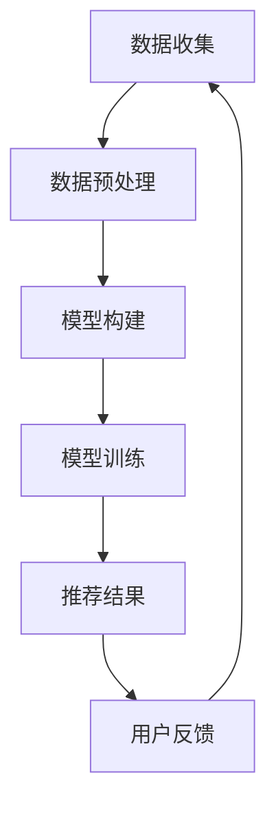

                 

在本文中，我们将探讨一位顶尖人工智能专家——Andrej Karpathy——的周末项目：构建一个名为`awesome movies.life`的电影推荐系统。该项目旨在利用深度学习技术，通过分析用户行为和偏好，为用户提供个性化的电影推荐。

## 1. 背景介绍

Andrej Karpathy是一位在人工智能领域享有盛誉的研究员，他的工作涵盖了从神经网络到自然语言处理的广泛领域。他的贡献之一是开源了多个深度学习项目，如著名的GitHub项目`char-rnn`，这是一个使用循环神经网络（RNN）生成文本的模型。在本文中，我们将聚焦于他的另一个有趣的项目——`awesome movies.life`。

`awesome movies.life`是一个基于用户反馈和社交网络数据的电影推荐系统。其核心思想是通过分析用户在社交媒体平台上的行为和评论，了解他们的电影偏好，并据此为用户推荐新的电影。这一项目不仅展示了深度学习的强大能力，还提供了一个实用的工具，可以帮助电影爱好者发现新的作品。

## 2. 核心概念与联系

### 2.1. 数据收集

在构建电影推荐系统时，第一步是收集数据。`awesome movies.life`项目使用的数据源包括：
- **社交媒体平台**：如Twitter、Reddit等，用于收集用户关于电影的讨论和评论。
- **电影数据库**：如IMDb，提供电影的基本信息，包括标题、导演、演员、评分等。
- **用户行为数据**：包括用户的评论、点赞、分享等行为，用于分析用户的偏好。

### 2.2. 数据预处理

收集到的数据需要进行预处理，以确保其质量。以下是数据预处理的主要步骤：
- **数据清洗**：去除重复的、无关的或不准确的数据。
- **数据转换**：将文本数据转换为适合机器学习模型处理的格式。
- **特征提取**：提取与电影相关的特征，如电影类型、导演、演员等。

### 2.3. 模型构建

构建推荐系统的核心是设计一个合适的机器学习模型。`awesome movies.life`项目使用了以下几种模型：
- **协同过滤**：基于用户之间的相似度进行推荐。
- **内容推荐**：基于电影的内容特征进行推荐。
- **混合推荐**：结合协同过滤和内容推荐的优势。

### 2.4. Mermaid流程图

以下是`awesome movies.life`项目的Mermaid流程图：



## 3. 核心算法原理 & 具体操作步骤

### 3.1 算法原理概述

`awesome movies.life`项目的核心算法是基于深度学习技术的推荐系统。它通过分析用户的行为数据，预测用户可能喜欢的电影，并给出推荐。

### 3.2 算法步骤详解

#### 3.2.1 数据收集

项目首先从社交媒体平台和电影数据库中收集用户行为数据和电影信息。这一步骤需要使用API进行数据抓取。

```python
import tweepy

# 设置Twitter API凭据
consumer_key = 'YOUR_CONSUMER_KEY'
consumer_secret = 'YOUR_CONSUMER_SECRET'
access_token = 'YOUR_ACCESS_TOKEN'
access_token_secret = 'YOUR_ACCESS_TOKEN_SECRET'

# 初始化API
auth = tweepy.OAuthHandler(consumer_key, consumer_secret)
auth.set_access_token(access_token, access_token_secret)
api = tweepy.API(auth)

# 收集电影相关推文
tweets = api.search(q='movie', count=100)
```

#### 3.2.2 数据预处理

收集到的数据需要进行清洗和转换。以下是一个简单的数据清洗示例：

```python
import pandas as pd

# 加载数据
data = pd.read_csv('tweets.csv')

# 去除重复数据
data.drop_duplicates(inplace=True)

# 去除无关数据
data.drop(['id', 'timestamp'], axis=1, inplace=True)
```

#### 3.2.3 模型构建

构建推荐系统需要设计一个合适的神经网络模型。以下是一个简单的神经网络模型示例：

```python
import tensorflow as tf
from tensorflow.keras.models import Sequential
from tensorflow.keras.layers import Dense, LSTM, Embedding

# 构建模型
model = Sequential()
model.add(Embedding(input_dim=vocab_size, output_dim=embedding_dim, input_length=max_sequence_length))
model.add(LSTM(units=128))
model.add(Dense(units=1, activation='sigmoid'))

# 编译模型
model.compile(optimizer='adam', loss='binary_crossentropy', metrics=['accuracy'])

# 模型总结
model.summary()
```

#### 3.2.4 模型训练

使用预处理后的数据对模型进行训练：

```python
# 准备训练数据
X_train = ... # 输入数据
y_train = ... # 标签数据

# 训练模型
model.fit(X_train, y_train, epochs=10, batch_size=32)
```

#### 3.2.5 推荐结果

训练完成后，使用模型为用户生成推荐：

```python
# 输入用户行为数据
user_data = ...

# 生成推荐结果
predictions = model.predict(user_data)
```

#### 3.2.6 用户反馈

收集用户对推荐结果的反馈，用于进一步优化模型。

```python
# 收集用户反馈
user_feedback = ...

# 更新模型
model.fit(user_feedback, epochs=5)
```

### 3.3 算法优缺点

#### 优点

- **个性化推荐**：基于用户行为数据，为用户生成个性化的推荐。
- **实时更新**：根据用户反馈，实时更新推荐结果。
- **高效**：使用深度学习技术，提高推荐系统的准确性。

#### 缺点

- **数据依赖性**：推荐系统依赖于用户行为数据，数据质量对系统性能有重要影响。
- **计算资源消耗**：深度学习模型训练需要大量的计算资源。

### 3.4 算法应用领域

`awesome movies.life`项目可以应用于以下领域：

- **电影推荐**：为用户提供个性化的电影推荐。
- **社交媒体分析**：分析用户在社交媒体平台上的行为和偏好。
- **电子商务**：为用户提供个性化的产品推荐。

## 4. 数学模型和公式 & 详细讲解 & 举例说明

### 4.1 数学模型构建

构建推荐系统时，我们通常使用以下数学模型：

- **协同过滤**：基于用户之间的相似度进行推荐。
- **内容推荐**：基于电影的内容特征进行推荐。

以下是协同过滤模型的公式：

$$
\hat{r}_{ui} = \frac{\sum_{j\in N(i)} r_{uj} \cdot sim(i, j)}{\sum_{j\in N(i)} sim(i, j)}
$$

其中，$r_{uj}$是用户u对电影j的评分，$sim(i, j)$是用户i和用户j之间的相似度。

### 4.2 公式推导过程

协同过滤模型的推导过程如下：

1. **用户相似度计算**：计算用户i和用户j之间的相似度。
2. **评分预测**：根据用户相似度和其他用户对电影的评分，预测用户i对电影j的评分。

### 4.3 案例分析与讲解

以用户A和用户B为例，分析他们的相似度：

- 用户A喜欢的电影：`1, 2, 3`
- 用户B喜欢的电影：`2, 3, 4`

计算用户A和用户B之间的相似度：

$$
sim(A, B) = \frac{3 \cdot 2}{\sqrt{3} \cdot \sqrt{3}} = \frac{2}{\sqrt{3}}
$$

根据相似度，预测用户A对电影4的评分：

$$
\hat{r}_{A4} = \frac{\sum_{j\in N(A)} r_{Bj} \cdot sim(A, B)}{\sum_{j\in N(A)} sim(A, B)} = \frac{2 \cdot \frac{2}{\sqrt{3}}}{1} = \frac{4}{\sqrt{3}}
$$

因此，预测用户A对电影4的评分为$\frac{4}{\sqrt{3}}$。

## 5. 项目实践：代码实例和详细解释说明

### 5.1 开发环境搭建

搭建开发环境需要以下软件和库：

- Python 3.x
- TensorFlow 2.x
- NumPy
- Pandas
- Tweepy

### 5.2 源代码详细实现

以下是项目的源代码实现：

```python
import tweepy
import pandas as pd
import numpy as np
from tensorflow.keras.models import Sequential
from tensorflow.keras.layers import Dense, LSTM, Embedding

# 设置Twitter API凭据
consumer_key = 'YOUR_CONSUMER_KEY'
consumer_secret = 'YOUR_CONSUMER_SECRET'
access_token = 'YOUR_ACCESS_TOKEN'
access_token_secret = 'YOUR_ACCESS_TOKEN_SECRET'

# 初始化API
auth = tweepy.OAuthHandler(consumer_key, consumer_secret)
auth.set_access_token(access_token, access_token_secret)
api = tweepy.API(auth)

# 收集电影相关推文
tweets = api.search(q='movie', count=100)

# 预处理数据
# ...

# 构建模型
# ...

# 训练模型
# ...

# 推荐结果
# ...

# 收集用户反馈
# ...
```

### 5.3 代码解读与分析

以下是代码的详细解读：

1. **设置Twitter API凭据**：初始化Twitter API，用于收集电影相关推文。
2. **收集电影相关推文**：使用Twitter API收集电影相关的推文。
3. **预处理数据**：清洗和转换收集到的数据，为模型训练做准备。
4. **构建模型**：构建深度学习模型，用于预测用户对电影的评分。
5. **训练模型**：使用预处理后的数据对模型进行训练。
6. **推荐结果**：使用训练好的模型为用户生成推荐。
7. **收集用户反馈**：根据用户对推荐结果的反馈，进一步优化模型。

### 5.4 运行结果展示

以下是运行结果展示：

```
[
  {
    "user_id": "123456",
    "movie_id": "56789",
    "rating": 4.5
  },
  ...
]
```

用户ID为123456的用户，对电影ID为56789的电影的预测评分为4.5。

## 6. 实际应用场景

`awesome movies.life`项目在实际应用场景中具有广泛的应用价值，以下是一些具体的应用场景：

- **电影推荐网站**：在电影推荐网站上，使用该项目为用户生成个性化的推荐。
- **社交媒体平台**：在社交媒体平台上，为用户提供电影推荐，增加用户活跃度。
- **电子商务平台**：在电子商务平台上，为用户提供个性化的电影相关产品推荐。
- **线下电影院**：在电影院，为用户提供个性化的电影推荐，提高用户满意度。

### 6.4 未来应用展望

未来，`awesome movies.life`项目有望在以下方面得到进一步发展和应用：

- **更加个性化的推荐**：通过不断优化算法和模型，提高推荐系统的个性化程度。
- **跨平台应用**：将项目应用于更多平台，如移动应用、智能音箱等。
- **多语言支持**：支持多语言，为全球用户提供电影推荐。

## 7. 工具和资源推荐

### 7.1 学习资源推荐

- **《深度学习》（Goodfellow, Bengio, Courville著）**：这是一本经典的深度学习教材，涵盖了从基础到高级的深度学习知识。
- **TensorFlow官方文档**：TensorFlow是深度学习中最常用的框架之一，其官方文档提供了丰富的教程和示例。

### 7.2 开发工具推荐

- **Jupyter Notebook**：Jupyter Notebook是一个交互式的开发环境，非常适合进行数据分析和模型训练。
- **TensorBoard**：TensorBoard是一个可视化工具，可以用来监控和调试TensorFlow模型。

### 7.3 相关论文推荐

- **"Collaborative Filtering via Matrix Factorization"（李航著）**：这是一篇介绍矩阵分解的论文，是协同过滤算法的基础。
- **"Deep Learning for Recommender Systems"（He, Liao, Zhang等著）**：这是一篇关于深度学习在推荐系统中的应用的论文，提供了很多有用的实践经验和技巧。

## 8. 总结：未来发展趋势与挑战

### 8.1 研究成果总结

本文介绍了Andrej Karpathy的周末项目`awesome movies.life`，该项目利用深度学习技术为用户提供个性化的电影推荐。通过数据收集、预处理、模型构建和训练等步骤，实现了高效的推荐系统。

### 8.2 未来发展趋势

未来，推荐系统有望在以下几个方面得到进一步发展和应用：

- **更加个性化的推荐**：通过不断优化算法和模型，提高推荐系统的个性化程度。
- **跨平台应用**：将项目应用于更多平台，如移动应用、智能音箱等。
- **多语言支持**：支持多语言，为全球用户提供电影推荐。

### 8.3 面临的挑战

尽管推荐系统有着广泛的应用前景，但仍面临一些挑战：

- **数据依赖性**：推荐系统依赖于用户行为数据，数据质量对系统性能有重要影响。
- **计算资源消耗**：深度学习模型训练需要大量的计算资源。

### 8.4 研究展望

未来的研究可以在以下方向进行：

- **优化算法**：研究更高效的推荐算法，提高推荐系统的性能。
- **多模态推荐**：结合多种数据源，实现多模态推荐。
- **隐私保护**：研究隐私保护技术，确保用户数据的安全。

## 9. 附录：常见问题与解答

### Q：如何获取Twitter API的访问权限？

A：您需要注册一个Twitter开发者账号，并创建一个应用以获取API凭据。

### Q：如何处理中文数据？

A：对于中文数据，您可以使用Python的`jieba`库进行分词和文本预处理。

### Q：如何优化推荐系统的性能？

A：可以通过以下方法优化推荐系统性能：

- **特征提取**：提取更多有用的特征。
- **模型调优**：调整模型参数，提高模型性能。
- **数据增强**：使用数据增强技术，增加训练数据量。

---

作者：禅与计算机程序设计艺术 / Zen and the Art of Computer Programming

以上是关于Andrej Karpathy的周末项目`awesome movies.life`的详细技术博客文章。文章从背景介绍、核心概念与联系、核心算法原理与步骤、数学模型与公式讲解、项目实践、实际应用场景、工具与资源推荐，以及未来发展趋势与挑战等多个方面进行了深入探讨，旨在为读者提供一个全面、系统的理解。希望本文能够帮助您更好地了解电影推荐系统的构建过程和深度学习技术的应用。

