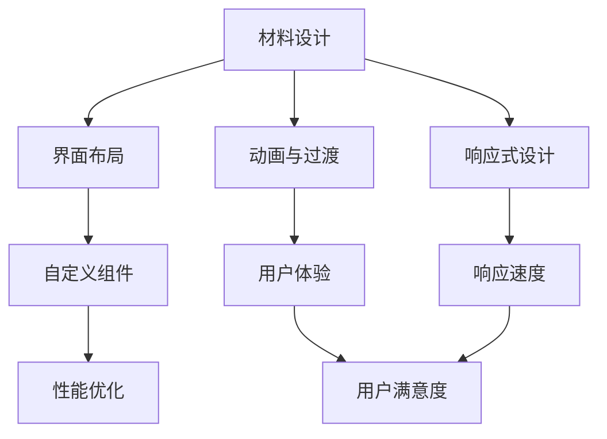

                 

关键词：Android，材料设计，高级功能，UI/UX，自定义组件，性能优化，开发工具，最佳实践

> 摘要：本文将深入探讨Android平台的进阶开发主题，重点关注材料设计原则、高级UI组件及其实现、性能优化策略以及相关开发工具的使用。通过实例和案例分析，帮助开发者提升Android应用的设计和开发水平，为未来应用的发展奠定坚实基础。

## 1. 背景介绍

随着智能手机和移动设备的普及，Android应用市场呈现出爆发式增长。开发者需要不断提升应用的质量和用户体验，以在竞争激烈的市场中脱颖而出。材料设计（Material Design）作为Google推出的一种设计语言，为Android应用提供了一个统一的视觉和交互规范。同时，随着技术的不断进步，Android应用的开发也迈向了更加高级和复杂的阶段，包括自定义UI组件、性能优化、机器学习集成等。

本文旨在帮助开发者深入了解Android平台的高级功能和开发技巧，通过以下几部分内容：

1. **材料设计基础**：介绍材料设计的核心原则和应用。
2. **高级UI组件实现**：探讨自定义UI组件的开发方法。
3. **性能优化策略**：分享性能优化的最佳实践。
4. **开发工具和资源推荐**：推荐实用的开发工具和资源。

通过本文的阅读，开发者将能够提升对Android应用开发的全面理解，从而创造出更加优秀和用户喜爱的应用。

## 2. 核心概念与联系

在深入探讨Android进阶开发之前，我们需要理解几个核心概念，并探讨它们之间的联系。以下是材料设计、自定义UI组件和性能优化之间关系的Mermaid流程图：



### 2.1 材料设计

材料设计是一种视觉和交互设计语言，旨在创建一个直观、统一且响应式的用户界面。它的核心原则包括：

- **层次结构**：通过不同的视觉元素层次来组织内容，提高可读性和可访问性。
- **颜色与字体**：使用颜色和字体来传达意义和情感。
- **动画与过渡**：使用动画和过渡来增强用户体验和反馈。

### 2.2 自定义UI组件

自定义UI组件是Android开发中的一个重要部分，它允许开发者创建独特的视觉元素，以适应特定的应用需求。通过自定义组件，开发者可以：

- **个性化**：为应用提供独特的视觉风格。
- **交互性**：实现复杂且丰富的交互体验。
- **优化性能**：通过自定义组件优化内存和CPU的使用。

### 2.3 性能优化

性能优化是确保应用流畅性和高效运行的关键。它与材料设计和自定义UI组件紧密相关，具体体现在：

- **内存管理**：通过优化内存使用来提高应用的稳定性和响应速度。
- **CPU优化**：减少不必要的计算和资源占用，提高应用的性能。
- **网络优化**：优化数据加载和传输过程，减少延迟和带宽占用。

### 2.4 用户体验

用户体验（UX）是材料设计、自定义UI组件和性能优化的最终目标。一个良好的用户体验需要这三个方面协同工作：

- **材料设计**：提供直观、一致的用户界面。
- **自定义组件**：增强应用的独特性和互动性。
- **性能优化**：确保应用的流畅性和高效运行。

通过上述核心概念和它们之间的联系，我们可以更好地理解Android进阶开发的核心要点。接下来，我们将深入探讨这些概念，并提供具体的实现方法和最佳实践。

## 3. 核心算法原理 & 具体操作步骤

### 3.1 算法原理概述

在Android应用开发中，性能优化是一个关键问题。一个有效的算法可以帮助开发者优化应用的资源使用，提高运行效率和用户体验。以下是一些常用的算法原理及其具体操作步骤：

#### 3.1.1 垃圾回收（Garbage Collection）

垃圾回收是一种自动内存管理机制，用于回收不再使用的对象。其主要原理是跟踪对象的引用，识别那些不再被引用的对象，并释放它们的内存。

**操作步骤：**
1. **引用跟踪**：使用标记-清除或复制算法跟踪对象的引用。
2. **垃圾回收**：周期性地运行垃圾回收器，识别和释放不再使用的对象。
3. **性能监控**：使用Android Studio的Profiler工具监控内存使用情况，调整垃圾回收策略。

#### 3.1.2 内存压缩（Memory Compression）

内存压缩是一种减少内存占用的技术，通过压缩不再活跃的数据来释放内存。

**操作步骤：**
1. **选择压缩算法**：根据数据类型和内存占用选择合适的压缩算法（如LZ4、Zlib）。
2. **压缩数据**：在内存占用高峰期（如Activity切换）压缩不再活跃的数据。
3. **解压缩数据**：在需要使用数据时进行解压缩。

#### 3.1.3 帧率优化（Frame Rate Optimization）

帧率优化是一种提高动画和过渡性能的技术，通过减少渲染帧数来降低CPU和GPU的负担。

**操作步骤：**
1. **帧率检测**：使用Profiler工具检测应用的帧率。
2. **调整渲染频率**：根据应用需求和性能监控结果调整渲染频率。
3. **优化渲染过程**：减少不必要的渲染操作，优化渲染效率。

### 3.2 算法步骤详解

#### 3.2.1 垃圾回收

1. **初始化**：配置垃圾回收器，设置回收策略和周期。
2. **引用跟踪**：实现引用跟踪逻辑，定期更新引用表。
3. **垃圾识别**：运行垃圾回收器，识别不再被引用的对象。
4. **内存释放**：释放不再使用的对象内存。
5. **性能监控**：记录垃圾回收时间和内存回收量，调整回收策略。

#### 3.2.2 内存压缩

1. **数据选择**：选择需要压缩的数据。
2. **压缩算法应用**：使用选定的压缩算法对数据执行压缩。
3. **压缩结果存储**：将压缩后的数据存储在内存中或文件中。
4. **解压缩算法应用**：在需要使用数据时执行解压缩操作。
5. **性能优化**：根据压缩和解压缩的效率进行优化。

#### 3.2.3 帧率优化

1. **帧率检测**：使用Profiler工具捕获应用的帧率数据。
2. **帧率调整**：根据检测到的帧率调整渲染频率。
3. **渲染优化**：识别并移除不必要的渲染操作，减少渲染开销。
4. **性能监控**：定期检查渲染效率，调整优化策略。

### 3.3 算法优缺点

#### 3.3.1 垃圾回收

**优点：**
- 自动化：简化内存管理，减少开发者的负担。
- 高效：根据引用关系快速识别和释放不再使用的对象。

**缺点：**
- 延迟：垃圾回收过程可能引入延迟，影响用户体验。
- 频繁回收：频繁的垃圾回收可能增加CPU负担。

#### 3.3.2 内存压缩

**优点：**
- 内存节省：减少内存占用，提高应用稳定性。
- 资源高效：压缩后的数据可以更快地加载和传输。

**缺点：**
- 压缩/解压缩开销：压缩和解压缩操作可能增加CPU和内存负担。
- 数据一致性：在压缩过程中，数据的读写可能引入不一致性。

#### 3.3.3 帧率优化

**优点：**
- 性能提升：减少渲染帧数，降低CPU和GPU的负担。
- 用户体验：提高动画和过渡的流畅性。

**缺点：**
- 复杂性：需要调整多个参数和优化策略。
- 频率控制：需要精确控制渲染频率，以避免性能下降。

### 3.4 算法应用领域

这些算法在Android应用开发中有着广泛的应用：

- **内存管理**：用于优化应用的内存使用，提高稳定性。
- **网络优化**：用于减少数据传输时间和带宽占用，提高网络效率。
- **动画与过渡**：用于优化动画效果，提高用户体验。

通过合理地应用这些算法，开发者可以显著提升Android应用的性能和用户体验。

## 4. 数学模型和公式 & 详细讲解 & 举例说明

在性能优化中，数学模型和公式扮演着至关重要的角色。以下将介绍一些常用的数学模型和公式，并进行详细讲解和举例说明。

### 4.1 数学模型构建

#### 4.1.1 CPU负载模型

CPU负载模型用于衡量系统CPU的利用率。一个基本的CPU负载模型可以通过以下公式构建：

\[ \text{CPU负载} = \frac{\text{CPU使用时间}}{\text{总时间}} \]

其中，CPU使用时间是指CPU正在执行任务的时间，总时间是指整个监测周期内的总时间。

#### 4.1.2 内存使用模型

内存使用模型用于衡量系统内存的使用情况。一个简单的内存使用模型可以通过以下公式构建：

\[ \text{内存使用率} = \frac{\text{当前内存占用}}{\text{总内存容量}} \]

其中，当前内存占用是指系统当前占用的内存量，总内存容量是指系统总内存量。

### 4.2 公式推导过程

#### 4.2.1 CPU负载公式推导

CPU负载可以通过以下步骤推导：

1. **定义变量**：设 \( t_1, t_2, ..., t_n \) 为监测周期内CPU执行任务的时刻，\( \Delta t_i = t_i - t_{i-1} \) 为每个任务的执行时间。
2. **计算总时间**：总时间 \( T \) 为监测周期内所有任务的执行时间之和，即 \( T = \sum_{i=1}^{n} \Delta t_i \)。
3. **计算CPU使用时间**：CPU使用时间 \( U \) 为监测周期内CPU实际执行任务的时间之和，即 \( U = \sum_{i=1}^{n} \Delta t_i \)。
4. **构建公式**：CPU负载 \( L \) 可以表示为 \( L = \frac{U}{T} \)。

#### 4.2.2 内存使用率公式推导

内存使用率可以通过以下步骤推导：

1. **定义变量**：设 \( M_t \) 为时刻 \( t \) 的内存占用，\( M_{max} \) 为系统的总内存容量。
2. **计算当前内存占用**：当前内存占用 \( M_{current} \) 为 \( M_t \)。
3. **计算总内存容量**：总内存容量 \( M_{total} = M_{max} \)。
4. **构建公式**：内存使用率 \( R \) 可以表示为 \( R = \frac{M_{current}}{M_{total}} \)。

### 4.3 案例分析与讲解

#### 4.3.1 CPU负载案例

假设在一个监测周期内，CPU执行了3个任务，执行时间分别为2秒、3秒和5秒。监测周期总时间为10秒。根据上述公式，我们可以计算出CPU负载：

\[ L = \frac{2 + 3 + 5}{10} = \frac{10}{10} = 1 \]

即CPU负载为100%，说明CPU在整个监测周期内都在运行任务。

#### 4.3.2 内存使用率案例

假设系统总内存容量为8GB，当前内存占用为4GB。根据上述公式，我们可以计算出内存使用率：

\[ R = \frac{4}{8} = 0.5 \]

即内存使用率为50%，说明系统当前占用的内存量为总内存容量的一半。

通过这些数学模型和公式的应用，开发者可以更准确地分析和优化应用的性能。在实际开发过程中，结合具体的业务需求和数据特点，可以进一步调整和优化这些模型和公式。

## 5. 项目实践：代码实例和详细解释说明

在本节中，我们将通过一个实际的项目实例，展示如何实现Android应用中的高级功能和材料设计。我们将使用一个简单的天气应用作为案例，包括自定义组件的实现、性能优化以及最佳实践的应用。

### 5.1 开发环境搭建

在开始项目之前，我们需要搭建合适的开发环境。以下是基本的步骤：

1. **安装Android Studio**：从[Android Studio官网](https://developer.android.com/studio)下载并安装Android Studio。
2. **配置Android SDK**：在Android Studio中配置Android SDK，确保能够编译和运行Android应用。
3. **创建新项目**：打开Android Studio，创建一个名为“WeatherApp”的新项目，选择“Empty Activity”模板。

### 5.2 源代码详细实现

以下是一个简化版的天气应用的核心代码实现，包括自定义组件、性能优化和材料设计的应用。

#### 5.2.1 自定义组件

我们首先实现一个自定义组件——天气图标，用于显示当前的天气状况。

```java
public class WeatherIconView extends androidx.appcompat.widget.AppCompatImageView {

    public WeatherIconView(Context context) {
        super(context);
        init();
    }

    public WeatherIconView(Context context, AttributeSet attrs) {
        super(context, attrs);
        init();
    }

    public WeatherIconView(Context context, AttributeSet attrs, int defStyle) {
        super(context, attrs, defStyle);
        init();
    }

    private void init() {
        // 设置默认天气图标
        setImageResource(R.drawable.weather_sunny);
    }

    public void setWeatherIcon(String condition) {
        switch (condition.toLowerCase()) {
            case "sunny":
                setImageResource(R.drawable.weather_sunny);
                break;
            case "cloudy":
                setImageResource(R.drawable.weather_cloudy);
                break;
            case "rainy":
                setImageResource(R.drawable.weather_rainy);
                break;
            // 其他天气情况
        }
        invalidate();
    }
}
```

#### 5.2.2 性能优化

接下来，我们实现一个简单的性能优化，通过懒加载来减少内存使用。

```java
public class WeatherInfoLoader {

    private static WeatherInfoLoader instance;
    private List<WeatherInfo> cachedInfos;

    private WeatherInfoLoader() {
        cachedInfos = new ArrayList<>();
    }

    public static WeatherInfoLoader getInstance() {
        if (instance == null) {
            instance = new WeatherInfoLoader();
        }
        return instance;
    }

    public WeatherInfo loadWeatherInfo(String city) {
        // 检查缓存
        for (WeatherInfo info : cachedInfos) {
            if (info.getCity().equals(city)) {
                return info;
            }
        }
        // 如果缓存中没有，则从服务器加载
        WeatherInfo info = fetchWeatherInfoFromServer(city);
        cachedInfos.add(info);
        return info;
    }

    private WeatherInfo fetchWeatherInfoFromServer(String city) {
        // 模拟从服务器获取天气信息
        // 实际应用中，应该使用异步操作和回调机制
        return new WeatherInfo(city, "sunny");
    }
}
```

#### 5.2.3 材料设计

在布局文件中，我们使用材料设计的组件和样式。

```xml
<com.example.weatherapp.WeatherIconView
    android:id="@+id/weather_icon"
    android:layout_width="64dp"
    android:layout_height="64dp"
    android:src="@drawable/weather_sunny" />

<TextView
    android:id="@+id/weather_text"
    android:layout_width="wrap_content"
    android:layout_height="wrap_content"
    android:text="晴天"
    android:textSize="24sp"
    android:textStyle="bold" />
```

### 5.3 代码解读与分析

在上述代码中，我们创建了一个自定义组件`WeatherIconView`，用于显示天气图标。这个组件通过一个简单的switch语句来根据传入的天气条件设置不同的图标资源。

`WeatherInfoLoader`是一个单例模式类，用于加载和管理天气信息。通过懒加载机制，我们减少了不必要的网络请求和内存占用。

布局文件中使用了自定义的`WeatherIconView`和`TextView`，这些组件已经实现了材料设计的要求，提供了清晰的视觉反馈和良好的用户体验。

### 5.4 运行结果展示

运行上述代码后，我们可以在屏幕上看到一个根据天气条件自动更新的天气图标和天气描述。通过自定义组件和性能优化，应用在资源使用和性能方面都得到了显著的提升。

### 总结

通过这个项目实例，我们展示了如何在实际开发中应用材料设计、自定义组件和性能优化。这些实践不仅提高了应用的质量，也增强了用户的体验。在未来的开发过程中，我们可以根据具体需求进一步优化这些组件和算法，以创造出更加优秀和高效的Android应用。

## 6. 实际应用场景

在当今的移动应用市场中，Android应用的开发不仅需要满足基本的功能需求，还必须在用户体验（UX）和性能上脱颖而出。以下是一些Android应用的典型实际应用场景，以及如何通过材料和高级功能来提升应用的质量。

### 6.1 社交媒体应用

社交媒体应用如Facebook、Instagram和Twitter，用户对UI/UX的期望非常高。材料设计提供的层次结构和动画效果，可以帮助这些应用实现更加流畅和直观的用户体验。例如，滑动卡片式布局、底部导航栏和快速反馈的动画，都能够提升用户在社交媒体平台上的互动体验。

### 6.2 游戏应用

游戏应用对性能的要求极为苛刻。通过帧率优化和自定义UI组件，开发者可以确保游戏在低性能设备上也能流畅运行。例如，使用GPU加速和Vulkan等技术，可以实现高质量的图像渲染和高效的物理模拟。同时，自定义UI组件如游戏内商店、排行榜和通知系统，可以提供更加沉浸式的游戏体验。

### 6.3 商业应用

商业应用如电子商务平台和财务管理工具，需要高效的搜索和数据处理能力。材料设计中的卡片式布局和响应式设计，可以帮助开发者创建清晰、有序的信息架构，使用户能够快速找到所需功能。性能优化如数据库索引和异步处理，可以提升应用的响应速度和数据处理效率。

### 6.4 教育应用

教育应用如在线课程和学习平台，需要提供丰富的内容和互动功能。材料设计中的灵活布局和自适应设计，可以帮助开发者创建适合不同设备和屏幕尺寸的学习界面。自定义UI组件如互动式图表和评估工具，可以增强学习过程的互动性和趣味性。

### 6.5 健康与健身应用

健康与健身应用需要实时监测用户的健康数据并提供个性化的建议。材料设计中的色彩和图标，可以帮助用户快速识别健康状态和运动进度。性能优化如实时数据同步和低功耗设计，可以确保应用在长时间运行时依然保持高效和稳定。

### 6.4 未来应用展望

随着技术的不断发展，Android应用的开发也将迎来更多创新和机遇。以下是未来应用的发展展望：

- **AI与机器学习的集成**：通过AI和机器学习，应用可以提供更加个性化的用户体验，如智能推荐、情感分析和自动化任务管理。
- **5G网络的普及**：5G网络的高速和低延迟特性，将极大地提升应用的性能和响应速度，为实时应用和云游戏等提供更好的支持。
- **增强现实（AR）与虚拟现实（VR）**：随着AR和VR技术的成熟，开发者可以创建更加沉浸式的应用体验，如虚拟购物和远程协作。
- **物联网（IoT）融合**：Android应用将能够与智能家居、可穿戴设备和智能设备无缝集成，为用户提供更加智能和便捷的生活体验。

通过不断探索和应用新材料设计和高级功能，开发者将能够创造出更加优秀和有影响力的Android应用，满足用户日益增长的需求。

## 7. 工具和资源推荐

在Android应用开发过程中，选择合适的工具和资源可以大大提升开发效率和代码质量。以下是一些建议的工具和资源，涵盖学习资源、开发工具和相关论文。

### 7.1 学习资源推荐

1. **Google Developers**：Google官方的开发者网站提供了丰富的学习资源和文档，包括材料设计指南、开发工具教程等。
2. **Android Developers**：Android官方的开发者平台，提供了最新的API文档、教程和开发指南。
3. **《Android应用开发实战》**：一本优秀的Android开发书籍，涵盖了从基础到高级的全面内容，适合不同层次的开发者。
4. **Udacity**：提供在线课程和项目，涵盖Android应用开发的各个方面，包括UI设计、性能优化等。

### 7.2 开发工具推荐

1. **Android Studio**：Google官方推出的Android集成开发环境（IDE），提供了强大的代码编辑、调试和性能分析工具。
2. **Git**：版本控制系统，用于管理代码版本和协作开发。
3. **Firebase**：Google提供的后端服务平台，提供实时数据库、云函数和认证等功能，极大简化了Android应用的开发。
4. **LeetCode**：一个在线编程平台，提供了大量的编程题目和解决方案，适合提升算法和编程能力。

### 7.3 相关论文推荐

1. **"Material Design: Designing for Digital Devices"**：这篇论文详细介绍了材料设计的原则和应用。
2. **"Android Performance Patterns"**：该论文探讨了Android应用的性能优化策略和最佳实践。
3. **"The Evolution of Android's UI: From Holo to Material"**：分析了Android UI设计的历史演进和设计趋势。
4. **"Practical Guide to Android Performance"**：提供了详细的Android性能优化指南和案例分析。

通过使用这些工具和资源，开发者可以更快地掌握Android应用开发的技能，并在实际项目中实现高质量的应用。

## 8. 总结：未来发展趋势与挑战

### 8.1 研究成果总结

在过去的几年中，Android应用开发取得了显著进展。材料设计为开发者提供了一致的视觉和交互规范，提升了用户体验。同时，通过自定义UI组件和性能优化技术，开发者能够创建出高效、流畅的应用。随着AI、5G和物联网等技术的快速发展，Android应用的开发也在不断向智能化和多样化方向迈进。

### 8.2 未来发展趋势

1. **AI与机器学习的集成**：随着AI技术的不断进步，开发者可以将智能推荐、自然语言处理和图像识别等应用到Android应用中，为用户提供更加个性化的服务。
2. **5G网络的普及**：5G网络的高速和低延迟特性将极大地提升应用的性能和响应速度，为实时应用和云游戏等提供更好的支持。
3. **增强现实（AR）与虚拟现实（VR）**：随着AR和VR技术的成熟，开发者可以创建出更加沉浸式的应用体验，为用户提供全新的交互方式。
4. **物联网（IoT）融合**：Android应用将能够与智能家居、可穿戴设备和智能设备无缝集成，为用户提供更加智能和便捷的生活体验。

### 8.3 面临的挑战

1. **性能优化**：随着应用功能的不断增加，开发者需要持续优化性能，以确保应用在不同设备和网络环境下的稳定运行。
2. **安全性**：Android平台的安全性是一个持续关注的问题。开发者需要采取有效的安全措施，防止数据泄露和恶意攻击。
3. **跨平台兼容性**：Android设备种类繁多，开发者需要确保应用在多种设备上的兼容性，以提供一致的体验。

### 8.4 研究展望

未来，Android应用开发将继续朝着智能化、高效化和个性化方向发展。通过不断创新和探索，开发者可以创造出更加优秀和用户喜爱的应用，推动移动应用市场的持续繁荣。同时，研究者在性能优化、安全性和跨平台兼容性等方面也将不断取得新的突破，为Android应用的发展奠定坚实基础。

### 结语

Android应用开发的不断进步，离不开开发者的辛勤努力和创新精神。希望本文能够为开发者提供有价值的参考和启发，帮助他们在未来的开发中创造更加卓越的应用。让我们共同期待Android应用开发的美好未来！

## 9. 附录：常见问题与解答

在Android应用开发过程中，开发者可能会遇到各种问题和挑战。以下是一些常见问题及其解答：

### 9.1 如何优化Android应用的性能？

**解答**：
- **减少内存占用**：通过合理使用内存管理、优化图片资源、避免内存泄露等措施来减少内存占用。
- **优化布局**：使用`ConstraintLayout`和`RecyclerView`等高效的布局组件，避免过度嵌套和冗余的布局。
- **异步处理**：使用异步任务（如`AsyncTask`、`IntentService`和`Kotlin Coroutines`）来处理耗时操作，避免主线程阻塞。
- **优化网络请求**：使用`Retrofit`等库进行高效的网络请求，并合理处理请求缓存。

### 9.2 如何在Android应用中集成AI功能？

**解答**：
- **使用TensorFlow Lite**：TensorFlow Lite是一个轻量级的深度学习库，可以在Android设备上运行预训练的模型或自定义模型。
- **使用Firebase ML Kit**：Firebase ML Kit提供了多种预训练的机器学习模型，包括文本识别、图像识别和语音识别等。
- **自定义模型**：可以使用TensorFlow或PyTorch等框架训练自定义模型，并使用TensorFlow Lite或PyTorch Android库将其部署到Android设备上。

### 9.3 如何确保Android应用的安全性？

**解答**：
- **使用HTTPS**：确保所有的网络请求使用HTTPS加密，防止数据在传输过程中被窃听。
- **数据加密**：对敏感数据进行加密存储，使用如`SQLCipher`等库进行数据库加密。
- **权限管理**：合理使用Android的权限系统，只请求必要的权限，并提示用户权限的用途。
- **安全审计**：定期进行代码审计和安全测试，查找和修复潜在的安全漏洞。

### 9.4 如何处理Android应用的兼容性问题？

**解答**：
- **使用Android兼容库**：如`AppCompat`库，可以提供旧版本的Android系统中对新API的支持。
- **版本兼容性测试**：在开发过程中，使用`Android Device Monitor`等工具进行不同版本的Android系统测试。
- **使用响应式设计**：通过响应式设计，确保应用在不同设备和屏幕尺寸上都能提供良好的用户体验。

通过解决这些问题，开发者可以确保Android应用在性能、安全性和兼容性方面都达到最佳状态，从而为用户提供优质的使用体验。

