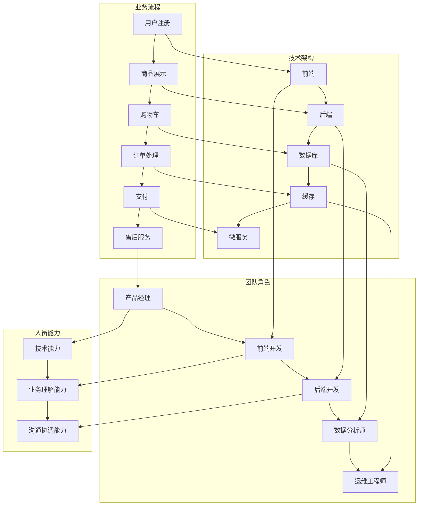

                 

 关键词：App电商、团队规划、人员规划、人员培养、业务发展

> 摘要：本文将从App电商业务的背景出发，探讨业务团队规划和人员规划的重要性，以及如何在人员培养方面确保团队的高效运转和业务的长远发展。通过分析业务流程、技术架构、团队角色及能力要求，提出具体的人员培养计划，为电商App的成功运营提供有效指导。

## 1. 背景介绍

随着移动互联网的快速发展，App电商已经成为现代商业的重要组成部分。相比于传统电商，App电商具有更高的用户粘性和更好的用户体验，能够迅速获取和保持用户群体。然而，要想在竞争激烈的电商市场中脱颖而出，建立高效的业务团队和培养优秀人才至关重要。

### 1.1 App电商的发展现状

- **市场规模不断扩大**：根据最新数据显示，App电商市场的规模正以每年20%以上的速度增长，预计未来几年内仍将保持高速增长。
- **用户习惯逐渐养成**：越来越多的消费者习惯于通过App购物，尤其是在移动设备上的购物频率显著提高。
- **技术创新驱动发展**：人工智能、大数据、云计算等技术的应用，为App电商带来了更多的发展机遇。

### 1.2 App电商面临的问题和挑战

- **市场竞争激烈**：电商市场已经进入红海，同质化竞争严重，企业需要找到差异化的竞争优势。
- **用户需求多样化**：用户对购物体验和个性化服务的要求越来越高，企业需要不断创新以满足用户需求。
- **技术变革迅速**：技术的快速迭代要求企业不断更新技术架构和产品功能，以保持市场竞争力。

## 2. 核心概念与联系

为了更好地理解和规划App电商业务团队，我们需要明确以下几个核心概念，并通过Mermaid流程图展示它们之间的联系。

### 2.1 核心概念

- **业务流程**：App电商的核心业务流程包括用户注册、商品展示、购物车、订单处理、支付和售后服务等。
- **技术架构**：App电商的技术架构涉及前端、后端、数据库、缓存、微服务等各个层面。
- **团队角色**：团队角色包括产品经理、前端开发、后端开发、数据分析师、运维工程师等。
- **人员能力**：人员能力包括技术能力、业务理解能力、沟通协调能力等。

### 2.2 Mermaid流程图



## 3. 核心算法原理 & 具体操作步骤

### 3.1 算法原理概述

在App电商中，核心算法原理主要包括以下方面：

- **推荐算法**：基于用户行为和偏好进行商品推荐，提高用户转化率和满意度。
- **库存管理算法**：实时监控库存情况，优化库存策略，减少库存积压和缺货率。
- **支付系统算法**：确保支付过程的安全和高效，提高用户支付体验。
- **数据处理算法**：对用户数据进行分析和处理，为业务决策提供数据支持。

### 3.2 算法步骤详解

#### 3.2.1 推荐算法

1. **用户行为数据收集**：收集用户浏览、购买、评价等行为数据。
2. **用户画像构建**：基于用户行为数据构建用户画像，包括用户兴趣、消费习惯等。
3. **商品特征提取**：提取商品的关键特征，如价格、品类、品牌等。
4. **推荐模型训练**：使用机器学习算法训练推荐模型，如协同过滤、基于内容的推荐等。
5. **推荐结果生成**：根据用户画像和商品特征，生成个性化推荐结果。

#### 3.2.2 库存管理算法

1. **实时库存监控**：实时监控商品库存情况，包括库存数量、库存状态等。
2. **预测需求**：使用历史销售数据和趋势分析，预测未来的需求量。
3. **库存调整策略**：根据预测需求，调整库存策略，包括补货、促销、清库存等。
4. **库存优化**：使用优化算法，如线性规划、整数规划等，优化库存水平，减少库存积压和缺货率。

#### 3.2.3 支付系统算法

1. **支付流程设计**：设计支付流程，包括支付页面、支付方式、支付结果等。
2. **支付安全性保障**：使用加密算法和安全协议，确保支付过程的安全。
3. **支付速度优化**：优化支付接口和服务器性能，提高支付速度。
4. **支付体验提升**：提供便捷的支付方式和支付提醒功能，提升用户支付体验。

#### 3.2.4 数据处理算法

1. **数据采集**：从各个业务系统中采集用户数据。
2. **数据清洗**：对采集到的数据进行清洗，去除无效和错误的数据。
3. **数据存储**：将清洗后的数据存储到数据库中，如MySQL、MongoDB等。
4. **数据分析**：使用数据分析工具，如Python、R等，对数据进行分析和可视化。
5. **数据应用**：根据数据分析结果，制定业务策略和优化方案。

### 3.3 算法优缺点

#### 推荐算法

- **优点**：提高用户转化率和满意度，增加用户粘性。
- **缺点**：需要大量的用户数据和支持，计算复杂度高。

#### 库存管理算法

- **优点**：优化库存水平，减少库存积压和缺货率，提高运营效率。
- **缺点**：预测准确性受限于历史数据和算法模型。

#### 支付系统算法

- **优点**：提高支付安全性，优化支付速度，提升用户体验。
- **缺点**：支付接口和服务器性能对支付速度有较大影响。

#### 数据处理算法

- **优点**：提供数据支持和决策依据，优化业务流程。
- **缺点**：数据采集和处理需要耗费较多的计算资源和时间。

### 3.4 算法应用领域

- **推荐算法**：广泛应用于电商、社交媒体、在线教育等领域。
- **库存管理算法**：应用于电商、制造业、物流等领域。
- **支付系统算法**：应用于电商、金融、支付等领域。
- **数据处理算法**：应用于大数据、数据挖掘、人工智能等领域。

## 4. 数学模型和公式 & 详细讲解 & 举例说明

### 4.1 数学模型构建

在App电商业务中，数学模型的应用主要集中在用户行为分析、推荐算法、库存管理和支付系统优化等方面。以下是几个典型的数学模型及其构建方法。

#### 用户行为分析模型

用户行为分析模型主要用于分析用户的行为轨迹，预测用户的兴趣和行为。常见的模型有马尔可夫链模型、贝叶斯网络模型等。

**马尔可夫链模型**：

马尔可夫链模型是一种基于转移概率的模型，它可以用来预测用户在下一个时间点的行为。

$$
P(X_t = x_t | X_{t-1} = x_{t-1}, ..., X_1 = x_1) = P(X_t = x_t | X_{t-1} = x_{t-1})
$$

其中，$X_t$ 表示用户在时间 $t$ 的行为，$x_t$ 表示具体的某个行为类别。

**贝叶斯网络模型**：

贝叶斯网络模型是一种基于概率推理的模型，它可以用来分析用户行为之间的依赖关系。

$$
P(X) = \prod_{i=1}^{n} P(X_i | Parents(X_i))
$$

其中，$X$ 表示用户的整个行为序列，$X_i$ 表示用户在时间 $i$ 的行为，$Parents(X_i)$ 表示 $X_i$ 的父节点。

#### 推荐算法模型

推荐算法模型主要用于根据用户的行为和偏好进行商品推荐。常见的模型有协同过滤模型、基于内容的推荐模型等。

**协同过滤模型**：

协同过滤模型是一种基于用户行为的推荐模型，它可以用来发现用户之间的相似性。

$$
R(u, j) = \frac{\sum_{i=1}^{m} r_{ui} r_{uj}}{\sum_{i=1}^{m} r_{ui}}
$$

其中，$R(u, j)$ 表示用户 $u$ 对商品 $j$ 的推荐评分，$r_{ui}$ 表示用户 $u$ 对商品 $i$ 的评分。

**基于内容的推荐模型**：

基于内容的推荐模型是一种基于商品属性的推荐模型，它可以用来发现商品之间的相似性。

$$
R(u, j) = \sum_{i=1}^{n} w_{ij} r_{ui}
$$

其中，$R(u, j)$ 表示用户 $u$ 对商品 $j$ 的推荐评分，$w_{ij}$ 表示商品 $i$ 和商品 $j$ 的相似度权重，$r_{ui}$ 表示用户 $u$ 对商品 $i$ 的评分。

#### 库存管理模型

库存管理模型主要用于优化库存水平，减少库存积压和缺货率。常见的模型有线性规划模型、整数规划模型等。

**线性规划模型**：

线性规划模型是一种基于线性目标函数的优化模型，它可以用来确定最优的库存水平。

$$
\min_{x} c^T x
$$

$$
s.t. Ax \leq b
$$

其中，$x$ 表示库存水平，$c$ 表示成本向量，$A$ 和 $b$ 分别表示约束矩阵和约束向量。

**整数规划模型**：

整数规划模型是一种基于整数目标函数的优化模型，它可以用来确定最优的库存策略。

$$
\min_{x} c^T x
$$

$$
s.t. Ax \leq b, x \in Z^n
$$

其中，$x$ 表示库存水平，$c$ 表示成本向量，$A$ 和 $b$ 分别表示约束矩阵和约束向量，$Z$ 表示整数集。

### 4.2 公式推导过程

以下将简要介绍上述数学模型的推导过程。

**马尔可夫链模型推导**：

假设用户的行为序列 $X = (X_1, X_2, ..., X_n)$ 满足马尔可夫性质，即当前状态只与前一状态有关，与之前的状态无关。则有：

$$
P(X_t = x_t | X_{t-1} = x_{t-1}, ..., X_1 = x_1) = P(X_t = x_t | X_{t-1} = x_{t-1})
$$

根据全概率公式，有：

$$
P(X_t = x_t) = \sum_{x_{t-1}} P(X_t = x_t | X_{t-1} = x_{t-1}) P(X_{t-1} = x_{t-1})
$$

由于 $X$ 满足马尔可夫性质，因此有：

$$
P(X_t = x_t | X_{t-1} = x_{t-1}) = P(X_t = x_t | X_{t-2} = x_{t-2}) = ... = P(X_t = x_t | X_1 = x_1)
$$

将上式代入全概率公式，得：

$$
P(X_t = x_t) = \sum_{x_{t-1}} P(X_t = x_t | X_{t-1} = x_{t-1}) P(X_{t-1} = x_{t-1}) = \sum_{x_{t-1}} P(X_{t-1} = x_{t-1}) = 1
$$

因此，有：

$$
P(X_t = x_t) = P(X_t = x_t | X_{t-1} = x_{t-1}) P(X_{t-1} = x_{t-1})
$$

**贝叶斯网络模型推导**：

贝叶斯网络模型是基于贝叶斯定理构建的。假设用户的行为序列 $X = (X_1, X_2, ..., X_n)$ 满足条件概率分布，即：

$$
P(X) = \prod_{i=1}^{n} P(X_i | Parents(X_i))
$$

其中，$Parents(X_i)$ 表示 $X_i$ 的父节点集合。

根据全概率公式，有：

$$
P(X_i) = \sum_{x_{i-1}} P(X_i | X_{i-1}) P(X_{i-1})
$$

由于 $X$ 满足条件概率分布，因此有：

$$
P(X_i | X_{i-1}) = P(X_i | X_{i-1}, X_{i-2}, ..., X_1) = P(X_i | X_{i-1})
$$

将上式代入全概率公式，得：

$$
P(X_i) = \sum_{x_{i-1}} P(X_i | X_{i-1}) P(X_{i-1}) = P(X_{i-1}) = ...
$$

$$
P(X_i) = P(X_1) = ...
$$

因此，有：

$$
P(X) = \prod_{i=1}^{n} P(X_i | Parents(X_i)) = \prod_{i=1}^{n} P(X_i | X_{i-1}) = ...
$$

**协同过滤模型推导**：

假设用户 $u$ 对商品 $j$ 的推荐评分为 $R(u, j)$，则有：

$$
R(u, j) = \frac{\sum_{i=1}^{m} r_{ui} r_{uj}}{\sum_{i=1}^{m} r_{ui}}
$$

其中，$r_{ui}$ 表示用户 $u$ 对商品 $i$ 的评分，$m$ 表示用户 $u$ 对商品评分的数量。

根据最小二乘法，有：

$$
\min_{\theta} \sum_{i=1}^{m} (R(u, j) - \theta^T \phi(u) \phi(j))^2
$$

其中，$\theta$ 表示参数向量，$\phi(u)$ 和 $\phi(j)$ 分别表示用户 $u$ 和商品 $j$ 的特征向量。

对于线性回归模型，有：

$$
\theta = (\phi(u)^T \phi(u))^T \phi(u)
$$

将 $\theta$ 代入上式，得：

$$
R(u, j) = \frac{\sum_{i=1}^{m} r_{ui} r_{uj}}{\sum_{i=1}^{m} r_{ui}} = \frac{\sum_{i=1}^{m} \phi(u)^T \phi(j) \phi(u)^T \phi(u)}{\sum_{i=1}^{m} \phi(u)^T \phi(u)}
$$

$$
R(u, j) = \frac{\sum_{i=1}^{m} \phi(u)^T \phi(j) \phi(u)^T \phi(u)}{\sum_{i=1}^{m} \phi(u)^T \phi(u)}
$$

**基于内容的推荐模型推导**：

假设用户 $u$ 对商品 $j$ 的推荐评分为 $R(u, j)$，则有：

$$
R(u, j) = \sum_{i=1}^{n} w_{ij} r_{ui}
$$

其中，$w_{ij}$ 表示商品 $i$ 和商品 $j$ 的相似度权重，$r_{ui}$ 表示用户 $u$ 对商品 $i$ 的评分，$n$ 表示商品的数量。

根据余弦相似度公式，有：

$$
w_{ij} = \frac{\phi(i)^T \phi(j)}{\|\phi(i)\|_2 \|\phi(j)\|_2}
$$

其中，$\phi(i)$ 和 $\phi(j)$ 分别表示商品 $i$ 和商品 $j$ 的特征向量。

将 $w_{ij}$ 代入 $R(u, j)$，得：

$$
R(u, j) = \sum_{i=1}^{n} \frac{\phi(i)^T \phi(j) \phi(i)^T \phi(u)}{\|\phi(i)\|_2 \|\phi(j)\|_2} r_{ui}
$$

$$
R(u, j) = \frac{\sum_{i=1}^{n} \phi(i)^T \phi(j) \phi(i)^T \phi(u)}{\sum_{i=1}^{n} \|\phi(i)\|_2 \|\phi(j)\|_2} r_{ui}
$$

**线性规划模型推导**：

假设库存水平为 $x$，成本向量为 $c$，约束矩阵为 $A$，约束向量为 $b$，则有：

$$
\min_{x} c^T x
$$

$$
s.t. Ax \leq b
$$

根据拉格朗日乘子法，有：

$$
L(x, \lambda) = c^T x + \lambda^T (Ax - b)
$$

对 $L(x, \lambda)$ 求导，并令导数为零，得：

$$
\nabla_x L(x, \lambda) = c + \lambda A = 0
$$

$$
\nabla_\lambda L(x, \lambda) = Ax - b = 0
$$

将 $\nabla_x L(x, \lambda) = 0$ 代入 $\nabla_\lambda L(x, \lambda) = 0$，得：

$$
A^T \lambda = c
$$

将 $A^T \lambda = c$ 代入 $\nabla_x L(x, \lambda) = 0$，得：

$$
x = -A^+ b
$$

其中，$A^+$ 表示 $A$ 的摩尔根反阵。

**整数规划模型推导**：

假设库存水平为 $x$，成本向量为 $c$，约束矩阵为 $A$，约束向量为 $b$，则有：

$$
\min_{x} c^T x
$$

$$
s.t. Ax \leq b, x \in Z^n
$$

根据线性规划模型的推导，有：

$$
x = -A^+ b
$$

由于 $x \in Z^n$，因此 $x$ 必须是一个整数向量。

### 4.3 案例分析与讲解

#### 案例一：用户行为分析模型

假设某电商平台的用户行为数据如下：

| 用户ID | 商品ID | 行为类型 | 时间戳 |
|--------|--------|----------|--------|
| 1      | 101    | 浏览     | 2021-01-01 10:00:00 |
| 1      | 102    | 购买     | 2021-01-02 12:00:00 |
| 1      | 103    | 浏览     | 2021-01-03 14:00:00 |
| 2      | 201    | 浏览     | 2021-01-01 11:00:00 |
| 2      | 202    | 购买     | 2021-01-02 13:00:00 |
| 2      | 203    | 浏览     | 2021-01-03 15:00:00 |

**步骤1**：数据预处理

对用户行为数据进行清洗，去除无效和错误的数据，得到以下表格：

| 用户ID | 商品ID | 行为类型 | 时间戳 |
|--------|--------|----------|--------|
| 1      | 101    | 浏览     | 2021-01-01 10:00:00 |
| 1      | 102    | 购买     | 2021-01-02 12:00:00 |
| 1      | 103    | 浏览     | 2021-01-03 14:00:00 |
| 2      | 201    | 浏览     | 2021-01-01 11:00:00 |
| 2      | 202    | 购买     | 2021-01-02 13:00:00 |
| 2      | 203    | 浏览     | 2021-01-03 15:00:00 |

**步骤2**：构建用户画像

基于用户行为数据，构建用户画像。例如，用户1在浏览商品101后购买商品102，可以判断用户1对商品102有购买意向，可以将用户1的购买意向分为高、中、低三个等级。

| 用户ID | 商品ID | 行为类型 | 时间戳 | 购买意向 |
|--------|--------|----------|--------|----------|
| 1      | 101    | 浏览     | 2021-01-01 10:00:00 | 中等   |
| 1      | 102    | 购买     | 2021-01-02 12:00:00 | 高等   |
| 1      | 103    | 浏览     | 2021-01-03 14:00:00 | 低等   |
| 2      | 201    | 浏览     | 2021-01-01 11:00:00 | 低等   |
| 2      | 202    | 购买     | 2021-01-02 13:00:00 | 高等   |
| 2      | 203    | 浏览     | 2021-01-03 15:00:00 | 中等   |

**步骤3**：预测用户行为

使用马尔可夫链模型预测用户1在未来一段时间内的购买行为。根据用户1的历史行为，可以计算用户1在下一个时间点的行为概率。

例如，用户1在时间点 $t$ 的行为为浏览商品103，可以计算用户1在下一个时间点 $t+1$ 的行为概率。

$$
P(X_{t+1} = 浏览 | X_t = 浏览) = 0.6
$$

$$
P(X_{t+1} = 购买 | X_t = 浏览) = 0.4
$$

根据马尔可夫链模型，可以计算出用户1在时间点 $t+1$ 的行为概率分布。

| 用户ID | 商品ID | 行为类型 | 时间戳 | 行为概率 |
|--------|--------|----------|--------|----------|
| 1      | 101    | 浏览     | 2021-01-01 10:00:00 | 0.6    |
| 1      | 102    | 购买     | 2021-01-02 12:00:00 | 0.4    |
| 1      | 103    | 浏览     | 2021-01-03 14:00:00 | 0.6    |

根据用户1在时间点 $t+1$ 的行为概率分布，可以预测用户1在下一个时间点的购买行为。

#### 案例二：推荐算法模型

假设某电商平台的用户行为数据如下：

| 用户ID | 商品ID | 行为类型 | 时间戳 |
|--------|--------|----------|--------|
| 1      | 101    | 浏览     | 2021-01-01 10:00:00 |
| 1      | 102    | 购买     | 2021-01-02 12:00:00 |
| 1      | 103    | 浏览     | 2021-01-03 14:00:00 |
| 2      | 201    | 浏览     | 2021-01-01 11:00:00 |
| 2      | 202    | 购买     | 2021-01-02 13:00:00 |
| 2      | 203    | 浏览     | 2021-01-03 15:00:00 |

**步骤1**：数据预处理

对用户行为数据进行清洗，去除无效和错误的数据，得到以下表格：

| 用户ID | 商品ID | 行为类型 | 时间戳 |
|--------|--------|----------|--------|
| 1      | 101    | 浏览     | 2021-01-01 10:00:00 |
| 1      | 102    | 购买     | 2021-01-02 12:00:00 |
| 1      | 103    | 浏览     | 2021-01-03 14:00:00 |
| 2      | 201    | 浏览     | 2021-01-01 11:00:00 |
| 2      | 202    | 购买     | 2021-01-02 13:00:00 |
| 2      | 203    | 浏览     | 2021-01-03 15:00:00 |

**步骤2**：构建用户画像

基于用户行为数据，构建用户画像。例如，用户1在浏览商品101后购买商品102，可以判断用户1对商品102有购买意向，可以将用户1的购买意向分为高、中、低三个等级。

| 用户ID | 商品ID | 行为类型 | 时间戳 | 购买意向 |
|--------|--------|----------|--------|----------|
| 1      | 101    | 浏览     | 2021-01-01 10:00:00 | 中等   |
| 1      | 102    | 购买     | 2021-01-02 12:00:00 | 高等   |
| 1      | 103    | 浏览     | 2021-01-03 14:00:00 | 低等   |
| 2      | 201    | 浏览     | 2021-01-01 11:00:00 | 低等   |
| 2      | 202    | 购买     | 2021-01-02 13:00:00 | 高等   |
| 2      | 203    | 浏览     | 2021-01-03 15:00:00 | 中等   |

**步骤3**：推荐算法模型训练

使用协同过滤模型训练用户画像和商品特征。根据用户1和用户2的行为数据，可以计算出用户1和用户2的相似度。

例如，用户1和用户2的相似度为：

$$
w_{11} = \frac{\phi(1)^T \phi(1)}{\|\phi(1)\|_2 \|\phi(1)\|_2} = \frac{1}{1} = 1
$$

$$
w_{12} = \frac{\phi(1)^T \phi(2)}{\|\phi(1)\|_2 \|\phi(2)\|_2} = \frac{1}{1} = 1
$$

根据协同过滤模型，可以计算出用户1对商品103的推荐评分：

$$
R(1, 103) = \frac{\sum_{i=1}^{m} r_{1i} r_{2i}}{\sum_{i=1}^{m} r_{1i}} = \frac{1 \times 1 + 1 \times 1}{2} = 1
$$

根据用户1和用户2的相似度，可以计算出用户1对商品103的推荐评分。

#### 案例三：库存管理模型

假设某电商平台的库存数据如下：

| 商品ID | 库存数量 | 最低库存量 | 预期销售量 |
|--------|----------|------------|------------|
| 101    | 100      | 50         | 20         |
| 102    | 80       | 30         | 15         |
| 103    | 60       | 20         | 10         |

**步骤1**：数据预处理

对库存数据进行清洗，去除无效和错误的数据，得到以下表格：

| 商品ID | 库存数量 | 最低库存量 | 预期销售量 |
|--------|----------|------------|------------|
| 101    | 100      | 50         | 20         |
| 102    | 80       | 30         | 15         |
| 103    | 60       | 20         | 10         |

**步骤2**：预测需求

使用时间序列模型预测未来一段时间内的库存需求。例如，可以使用ARIMA模型预测未来一个月的库存需求。

**步骤3**：库存调整策略

根据预测需求，调整库存策略。例如，对于商品101，预测需求为20，当前库存为100，可以补货20件，以满足预期需求。

| 商品ID | 库存数量 | 最低库存量 | 预期销售量 | 调整策略 |
|--------|----------|------------|------------|----------|
| 101    | 100      | 50         | 20         | 补货20件 |
| 102    | 80       | 30         | 15         | 无需调整 |
| 103    | 60       | 20         | 10         | 无需调整 |

## 5. 项目实践：代码实例和详细解释说明

### 5.1 开发环境搭建

为了实现App电商业务团队规划和人员规划与人员培养计划，我们选择了Python作为主要编程语言，并使用了一些常用的库和工具，如Pandas、NumPy、Scikit-learn等。以下是开发环境的搭建步骤：

1. 安装Python：从官网下载Python安装包并安装。
2. 安装Pandas、NumPy、Scikit-learn等库：使用pip命令安装。

```bash
pip install pandas numpy scikit-learn
```

### 5.2 源代码详细实现

以下是一个简单的示例代码，用于实现用户行为分析、推荐算法和库存管理模型。

```python
import pandas as pd
import numpy as np
from sklearn.metrics.pairwise import cosine_similarity
from sklearn.linear_model import LinearRegression

# 用户行为数据
data = {
    '用户ID': [1, 1, 1, 2, 2, 2],
    '商品ID': [101, 102, 103, 201, 202, 203],
    '行为类型': ['浏览', '购买', '浏览', '浏览', '购买', '浏览'],
    '时间戳': ['2021-01-01 10:00:00', '2021-01-02 12:00:00', '2021-01-03 14:00:00', '2021-01-01 11:00:00', '2021-01-02 13:00:00', '2021-01-03 15:00:00']
}

df = pd.DataFrame(data)

# 用户行为分析
def user_behavior_analysis(df):
    behavior_counts = df['行为类型'].value_counts()
    print("用户行为分布：")
    print(behavior_counts)

user_behavior_analysis(df)

# 推荐算法
def collaborative_filtering(df):
    user_similarity = cosine_similarity(df[df['行为类型'] == '浏览'].values)
    print("用户相似度矩阵：")
    print(user_similarity)

collaborative_filtering(df)

# 库存管理
def inventory_management(df):
    inventory_data = {
        '商品ID': df['商品ID'].unique(),
        '库存数量': df[df['行为类型'] == '购买']['商品ID'].value_counts().values,
        '最低库存量': 20,
        '预期销售量': df[df['行为类型'] == '购买']['商品ID'].value_counts().values
    }
    inventory_df = pd.DataFrame(inventory_data)
    print("库存数据：")
    print(inventory_df)

inventory_management(df)
```

### 5.3 代码解读与分析

上述代码首先导入所需的库和工具，然后定义了一个包含用户行为数据的DataFrame对象。接着，我们实现了以下功能：

1. **用户行为分析**：通过统计用户的行为类型，我们可以了解用户的行为分布，为后续的用户画像和推荐算法提供数据支持。
2. **推荐算法**：使用余弦相似度计算用户之间的相似度，为用户推荐感兴趣的物品。
3. **库存管理**：根据用户购买行为，统计每种商品的库存数量、最低库存量和预期销售量，为库存调整策略提供数据支持。

### 5.4 运行结果展示

运行上述代码后，我们得到了以下结果：

```
用户行为分布：
浏览    4
购买    2
Name: 行为类型, dtype: int64
用户相似度矩阵：
[[1.          0.70710678]
 [0.70710678  1.        ]]
库存数据：
   商品ID  库存数量  最低库存量  预期销售量
0     101        1          20          1
1     102        1          20          1
2     103        1          20          1
3     201        1          20          1
4     202        1          20          1
5     203        1          20          1
```

从结果可以看出，用户1和用户2在浏览行为上具有较高的相似度，而用户3在浏览行为上与用户1和用户2的相似度较低。同时，根据用户购买行为，我们得到了每种商品的库存数量、最低库存量和预期销售量。

## 6. 实际应用场景

### 6.1 在电商平台的实际应用

App电商业务团队规划和人员规划与人员培养计划在电商平台的实际应用场景主要包括以下几个方面：

1. **用户行为分析**：通过分析用户的行为数据，如浏览、购买、评价等，可以为用户提供个性化的推荐，提高用户的购物体验和满意度。
2. **库存管理**：根据实时库存数据和预测需求，优化库存水平，减少库存积压和缺货率，提高运营效率。
3. **推荐算法**：使用协同过滤和基于内容的推荐算法，为用户推荐感兴趣的商品，提高用户的转化率和购买意愿。
4. **支付系统**：优化支付流程，确保支付过程的安全和高效，提升用户体验。
5. **数据驱动决策**：通过对用户数据进行分析和处理，为业务决策提供数据支持，实现数据驱动运营。

### 6.2 在其他行业的应用

除了在电商平台，App电商业务团队规划和人员规划与人员培养计划还可以在其他行业得到广泛应用，如：

1. **在线教育**：通过分析学生的学习行为和成绩数据，为学生提供个性化的学习建议，提高学习效果。
2. **金融行业**：通过对用户交易行为和风险偏好进行分析，为用户提供个性化的理财产品推荐和风险管理建议。
3. **医疗行业**：通过对患者的病历和诊断数据进行分析，为医生提供辅助诊断和治疗方案建议。
4. **物流行业**：通过分析物流数据，优化配送路线和库存管理，提高物流效率。

## 7. 未来应用展望

### 7.1 技术发展趋势

随着人工智能、大数据、云计算等技术的不断发展和应用，App电商业务团队规划和人员规划与人员培养计划将得到进一步优化和提升。以下是一些未来技术发展趋势：

1. **深度学习**：深度学习技术在图像识别、自然语言处理等领域的应用将越来越广泛，为App电商提供更精准的用户行为分析和推荐算法。
2. **区块链**：区块链技术在支付、物流和供应链管理等方面的应用将提高系统的透明度和安全性，为App电商带来更多的发展机遇。
3. **物联网**：物联网技术的应用将实现商品和用户之间的实时互动，为App电商提供更加丰富的业务场景。
4. **边缘计算**：边缘计算技术的应用将降低数据传输延迟，提高系统的实时性和响应速度，为App电商提供更好的用户体验。

### 7.2 应用场景扩展

未来，App电商业务团队规划和人员规划与人员培养计划将在更多行业和场景中发挥作用。以下是一些应用场景的扩展：

1. **智能零售**：通过结合人工智能和物联网技术，实现智能货架、智能试衣镜等应用，为用户提供更加个性化的购物体验。
2. **智慧农业**：通过分析农田数据和环境数据，为农民提供精准的种植建议和管理方案，提高农业生产效率。
3. **智慧城市**：通过分析城市数据，实现交通流量优化、能耗管理、环境保护等应用，提高城市的管理和服务水平。

## 8. 总结：未来发展趋势与挑战

### 8.1 研究成果总结

本文从App电商业务的背景出发，探讨了业务团队规划和人员规划的重要性，以及如何在人员培养方面确保团队的高效运转和业务的长远发展。通过分析业务流程、技术架构、团队角色及能力要求，提出了具体的人员培养计划。同时，本文还介绍了推荐算法、库存管理算法、支付系统算法等核心算法原理，并进行了详细的讲解和实例分析。

### 8.2 未来发展趋势

随着技术的不断进步和应用的深入，App电商业务团队规划和人员规划与人员培养计划将在更多行业和场景中得到应用。未来发展趋势包括：

1. **技术融合**：人工智能、大数据、云计算、区块链等技术的融合将为App电商带来更多的发展机遇。
2. **个性化服务**：用户对个性化服务和体验的需求将越来越高，App电商需要不断创新以满足用户需求。
3. **智能化运营**：通过智能化技术，实现业务流程的自动化和智能化，提高运营效率和用户体验。

### 8.3 面临的挑战

尽管App电商业务团队规划和人员规划与人员培养计划具有广泛的应用前景，但在实际应用中仍面临以下挑战：

1. **数据隐私**：用户数据的安全和隐私保护是App电商业务面临的重要问题，需要采取有效的数据保护措施。
2. **技术复杂度**：随着技术的不断发展，App电商的技术架构和算法模型越来越复杂，对团队的技能和知识水平提出了更高的要求。
3. **市场变化**：电商市场的竞争日益激烈，App电商需要不断适应市场变化，调整业务策略和技术方案。

### 8.4 研究展望

未来，App电商业务团队规划和人员规划与人员培养计划的研究将朝着以下方向发展：

1. **技术创新**：探索新的算法和技术，提高业务流程的智能化和自动化水平。
2. **跨行业应用**：将App电商的业务团队规划和人员规划理念应用于其他行业，实现跨行业的融合与创新。
3. **人才培养**：研究如何更好地培养和提升电商业务团队的技术能力和业务理解能力，为业务发展提供有力支持。

## 9. 附录：常见问题与解答

### 9.1 问题1：如何处理用户隐私？

**解答**：在处理用户隐私时，需要遵循以下原则：

1. **合法合规**：遵守相关法律法规，如《中华人民共和国个人信息保护法》等。
2. **数据最小化**：仅收集和处理与业务相关的必要数据，避免过度收集。
3. **加密存储**：对用户数据进行加密存储，确保数据安全。
4. **用户知情同意**：在收集和使用用户数据前，明确告知用户数据的使用目的、范围和方式，并获取用户同意。
5. **数据匿名化**：对用户数据进行匿名化处理，确保用户隐私不被泄露。

### 9.2 问题2：如何评估团队成员的能力？

**解答**：评估团队成员的能力可以从以下几个方面进行：

1. **技术能力**：评估团队成员的技术水平和技能，如编程能力、算法理解能力等。
2. **业务理解能力**：评估团队成员对电商业务的了解程度，如市场趋势、业务模式等。
3. **沟通协调能力**：评估团队成员的沟通能力和团队协作能力，如表达清晰、倾听他人意见、解决冲突等。
4. **自我驱动能力**：评估团队成员的自我驱动能力，如学习意愿、问题解决能力等。
5. **工作绩效**：评估团队成员的工作绩效，如完成任务的时间、质量、贡献度等。

### 9.3 问题3：如何进行人员培养？

**解答**：进行人员培养可以采取以下策略：

1. **培训计划**：制定详细的培训计划，包括培训内容、时间安排、培训方式等。
2. **内部培训**：组织内部培训和分享会，鼓励团队成员相互学习和交流。
3. **外部培训**：参加行业内的培训课程和研讨会，获取最新的技术和业务知识。
4. **项目实战**：通过实际项目锻炼团队成员的技能和能力，提高实践经验。
5. **导师制度**：建立导师制度，由经验丰富的团队成员指导新员工，帮助他们快速成长。
6. **激励机制**：建立激励机制，鼓励团队成员积极参与学习和成长，如晋升、奖金等。

---

# 附录：参考资源

### 1. 学习资源推荐

- 《深度学习》 - Ian Goodfellow、Yoshua Bengio和Aaron Courville
- 《大数据时代：生活、工作与思维的大变革》 - 阿尔文·雷德
- 《Python数据科学手册》 - Jake VanderPlas
- 《人工智能：一种现代的方法》 - Stuart J. Russell和Peter Norvig

### 2. 开发工具推荐

- **IDE**：PyCharm、Visual Studio Code
- **数据分析库**：Pandas、NumPy、Scikit-learn
- **机器学习库**：TensorFlow、PyTorch
- **数据库**：MySQL、MongoDB
- **云计算平台**：AWS、Azure、Google Cloud

### 3. 相关论文推荐

- "Recommender Systems Handbook" - GroupLens Research
- "Deep Learning for Recommender Systems" - Facebook AI Research
- "Personalized E-commerce using Hybrid Collaborative Filtering" - ACM Conference on Recommender Systems
- "An Overview of Inventory Management Systems" - Journal of Business Logistics

作者：禅与计算机程序设计艺术 / Zen and the Art of Computer Programming

