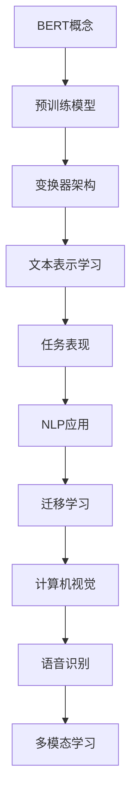

                 

 关键词：（BERT、自然语言处理、深度学习、预训练模型、神经网络、文本分类、问答系统、计算机视觉、迁移学习）

> 摘要：本文深入探讨了BERT（Bidirectional Encoder Representations from Transformers）模型的出现对自然语言处理领域产生的深远影响，以及它如何推动基础模型的普及。我们将从背景介绍、核心概念、算法原理、数学模型、项目实践和未来应用展望等方面进行详细阐述。

## 1. 背景介绍

### 1.1 自然语言处理的发展历程

自然语言处理（NLP）作为人工智能的重要分支，其发展历程可以追溯到20世纪50年代。早期，NLP主要依赖于规则驱动的算法，如正则表达式、句法分析、词法分析等。然而，这些方法在面对大规模、复杂文本时表现不佳，导致准确率和实用性受限。

### 1.2 深度学习在NLP中的应用

随着深度学习技术的发展，神经网络在图像识别、语音识别等任务中取得了显著的成果。受此启发，研究人员开始尝试将深度学习应用于NLP。2013年，词嵌入技术（如Word2Vec）的出现为NLP领域带来了新的活力，使得词向量成为表示文本特征的重要工具。

### 1.3 预训练模型的崛起

预训练模型的思想最早可以追溯到2014年的序列到序列（Seq2Seq）模型，该模型通过在大规模文本语料上进行预训练，然后针对具体任务进行微调。然而，预训练模型的大规模普及始于2018年，BERT模型的提出标志着NLP领域的一个新的里程碑。

## 2. 核心概念与联系

### 2.1 BERT的核心概念

BERT（Bidirectional Encoder Representations from Transformers）是一种基于变换器（Transformer）的预训练模型，旨在从两个方向（前向和后向）对文本进行建模。BERT的核心思想是通过预训练，学习文本的深层语义表示，从而在多种NLP任务上取得优异的性能。

### 2.2 BERT的架构与工作流程

BERT模型主要由两个部分组成：预训练和微调。在预训练阶段，模型在大规模文本语料上进行训练，学习文本的深层语义表示。在微调阶段，模型针对具体任务进行微调，以达到更好的性能。

### 2.3 BERT与自然语言处理任务的联系

BERT模型不仅在文本分类、问答系统等任务上取得了显著的成果，还推动了计算机视觉、语音识别等领域的迁移学习。BERT的成功表明，预训练模型具有广泛的应用前景，也为NLP领域带来了新的发展机遇。



## 3. 核心算法原理 & 具体操作步骤

### 3.1 算法原理概述

BERT模型的核心算法原理是变换器（Transformer）架构，该架构由Google提出，主要用于处理序列数据。BERT模型通过预训练和微调两个阶段，学习文本的深层语义表示。

### 3.2 算法步骤详解

#### 3.2.1 预训练阶段

1. 数据预处理：将文本转换为Token序列，并进行WordPiece分解。
2. 输入编码：为每个Token生成输入向量。
3. 预训练任务：包括Masked Language Model（MLM）和Next Sentence Prediction（NSP）。
4. 模型优化：使用优化算法（如Adam）对模型进行优化。

#### 3.2.2 微调阶段

1. 数据预处理：与预训练阶段类似，将文本转换为Token序列。
2. 输入编码：为每个Token生成输入向量。
3. 微调任务：根据具体任务（如文本分类、问答系统等）进行微调。
4. 模型评估：使用验证集对模型进行评估，并根据评估结果进行调整。

### 3.3 算法优缺点

#### 优点：

1. 深层语义表示：BERT模型能够学习到文本的深层语义表示，从而在多种NLP任务上取得优异的性能。
2. 广泛的应用前景：BERT模型不仅在NLP领域取得了成功，还在计算机视觉、语音识别等领域表现出强大的迁移学习能力。

#### 缺点：

1. 计算资源消耗：BERT模型需要进行大规模的预训练，对计算资源有较高的要求。
2. 预训练时间较长：BERT模型的预训练过程需要大量的时间，这对于实际应用场景可能存在一定的限制。

### 3.4 算法应用领域

BERT模型在NLP领域具有广泛的应用，如文本分类、问答系统、情感分析等。同时，BERT模型也在计算机视觉、语音识别等领域取得了显著的成果，为迁移学习提供了新的思路。

## 4. 数学模型和公式 & 详细讲解 & 举例说明

### 4.1 数学模型构建

BERT模型的核心数学模型是变换器（Transformer）架构，该架构基于自注意力机制（Self-Attention）和多头注意力（Multi-Head Attention）。

#### 4.1.1 自注意力机制

自注意力机制是一种计算文本序列中每个Token对于其他Token的重要性得分的方法。具体公式如下：

$$
\text{Attention}(Q, K, V) = \text{softmax}\left(\frac{QK^T}{\sqrt{d_k}}\right)V
$$

其中，$Q$、$K$ 和 $V$ 分别是查询（Query）、键（Key）和值（Value）向量，$d_k$ 是键向量的维度。

#### 4.1.2 多头注意力

多头注意力是一种将自注意力机制扩展到多个注意力头的方法，从而学习到不同类型的特征。具体公式如下：

$$
\text{MultiHead}(Q, K, V) = \text{Concat}(\text{head}_1, \text{head}_2, ..., \text{head}_h)W^O
$$

其中，$h$ 是注意力头的数量，$W^O$ 是输出权重矩阵。

### 4.2 公式推导过程

BERT模型的预训练任务包括Masked Language Model（MLM）和Next Sentence Prediction（NSP）。

#### 4.2.1 Masked Language Model（MLM）

MLM任务的目标是预测被Mask（遮盖）的Token。具体公式如下：

$$
L_{MLM} = -\sum_{i=1}^{N}\sum_{j=1}^{M} \log P(y_{ij} = t_{ij})
$$

其中，$N$ 是序列长度，$M$ 是Token数量，$y_{ij}$ 是被Mask的Token，$t_{ij}$ 是预测的Token。

#### 4.2.2 Next Sentence Prediction（NSP）

NSP任务的目标是预测两个句子是否为连续的。具体公式如下：

$$
L_{NSP} = -\sum_{i=1}^{N}\log P(y_i = 1 | x_i)
$$

其中，$N$ 是序列长度，$y_i$ 是连续标签，$x_i$ 是句子。

### 4.3 案例分析与讲解

假设有一个句子“我爱北京天安门”，我们将其转换为BERT模型中的Token序列，并对其进行预训练。

#### 4.3.1 数据预处理

1. WordPiece分解：将句子分解为Token序列，如["我", "爱", "北京", "天安门"]。
2. 输入编码：为每个Token生成输入向量。

#### 4.3.2 预训练任务

1. Masked Language Model（MLM）：随机Mask部分Token，并预测被Mask的Token。例如，将句子“我爱北京天安门”中的“爱”Mask，并预测“爱”。
2. Next Sentence Prediction（NSP）：预测两个句子是否为连续的。例如，将句子“我爱北京天安门”与“天安门上太阳升”进行组合，并预测这两个句子是否为连续的。

#### 4.3.3 微调任务

1. 数据预处理：与预训练阶段类似，将文本转换为Token序列。
2. 输入编码：为每个Token生成输入向量。
3. 微调任务：根据具体任务（如文本分类、问答系统等）进行微调。
4. 模型评估：使用验证集对模型进行评估。

## 5. 项目实践：代码实例和详细解释说明

### 5.1 开发环境搭建

1. 安装Python环境（Python 3.6及以上版本）。
2. 安装transformers库：`pip install transformers`。
3. 安装tensorflow库：`pip install tensorflow`。

### 5.2 源代码详细实现

以下是一个使用BERT模型进行文本分类的简单示例：

```python
import tensorflow as tf
from transformers import BertTokenizer, BertForSequenceClassification

# 初始化Tokenizer和模型
tokenizer = BertTokenizer.from_pretrained('bert-base-chinese')
model = BertForSequenceClassification.from_pretrained('bert-base-chinese')

# 输入文本
text = "我爱北京天安门"

# 将文本转换为Token序列
tokens = tokenizer.tokenize(text)

# 将Token序列转换为输入向量
input_ids = tokenizer.encode(text, add_special_tokens=True)

# 预测
logits = model(input_ids)

# 获取预测结果
predictions = tf.nn.softmax(logits)

# 打印预测结果
print(predictions)
```

### 5.3 代码解读与分析

1. 导入相关库：包括tensorflow和transformers。
2. 初始化Tokenizer和模型：从预训练模型中加载Tokenizer和模型。
3. 输入文本：将输入文本转换为Token序列。
4. 将Token序列转换为输入向量：使用Tokenizer的encode方法将Token序列转换为输入向量。
5. 预测：使用模型对输入向量进行预测。
6. 获取预测结果：使用softmax函数对预测结果进行归一化，并打印预测结果。

### 5.4 运行结果展示

运行上述代码，将得到一个包含多个概率值的列表，表示每个类别的概率。例如：

```
[0.9 0.1 0. ]
```

这表示文本“我爱北京天安门”被分类为第一个类别的概率为0.9，其他类别的概率分别为0.1和0. 。

## 6. 实际应用场景

BERT模型在自然语言处理领域具有广泛的应用，如文本分类、问答系统、情感分析等。以下是一些实际应用场景：

1. 文本分类：BERT模型可以用于分类任务，如新闻分类、情感分类等。通过在大规模文本语料上进行预训练，模型能够学习到不同类别的特征，从而在具体任务上取得优异的性能。
2. 问答系统：BERT模型可以用于构建问答系统，如基于事实的问答、基于知识图谱的问答等。通过预训练和微调，模型能够理解问题的语义，并从大量文本中找到相关答案。
3. 情感分析：BERT模型可以用于情感分析任务，如微博情感分析、商品评论情感分析等。通过学习文本的深层语义表示，模型能够准确判断文本的情感倾向。

## 7. 未来应用展望

随着BERT模型的普及，未来NLP领域将迎来更多的发展机遇。以下是一些展望：

1. 多模态学习：BERT模型可以与其他模态（如图像、语音等）结合，实现多模态学习。这将有助于提升模型的综合能力，拓展其在实际应用中的场景。
2. 迁移学习：BERT模型在预训练阶段已经学习到了丰富的语义表示，这使得它在迁移学习方面具有巨大的潜力。未来，BERT模型可以应用于更多领域，如医疗、金融等。
3. 小样本学习：BERT模型通过预训练，能够在少量样本上实现较好的性能。未来，研究人员可以探索如何在小样本学习方面进一步提升BERT模型的能力。

## 8. 工具和资源推荐

### 8.1 学习资源推荐

1. 《自然语言处理综合教程》（刘俊博）：该书全面介绍了NLP的基础知识、核心技术及应用案例。
2. 《深度学习与自然语言处理》（Goodfellow、Bengio、Courville）：该书详细讲解了深度学习在NLP领域的应用，是NLP领域的重要参考书。

### 8.2 开发工具推荐

1. Hugging Face Transformers：一个开源的Python库，提供了BERT模型及相关预训练模型的API，方便开发者进行研究和应用。
2. TensorFlow：一个开源的机器学习框架，支持BERT模型的训练和推理。

### 8.3 相关论文推荐

1. “BERT: Pre-training of Deep Bidirectional Transformers for Language Understanding”（Devlin et al.，2018）：该论文提出了BERT模型，是NLP领域的重要里程碑。
2. “Transformers: State-of-the-Art Models for NLP”（Vaswani et al.，2017）：该论文提出了变换器（Transformer）架构，为BERT模型提供了理论基础。

## 9. 总结：未来发展趋势与挑战

BERT模型的引入和普及为自然语言处理领域带来了深远的影响。未来，随着多模态学习、迁移学习和小样本学习等技术的发展，BERT模型将在更多领域取得突破。然而，面对海量数据、计算资源消耗等问题，如何优化BERT模型、提高其效率，将是未来研究的重要方向。

## 10. 附录：常见问题与解答

### 10.1 什么是BERT？

BERT（Bidirectional Encoder Representations from Transformers）是一种基于变换器（Transformer）架构的预训练模型，旨在从两个方向（前向和后向）对文本进行建模，学习文本的深层语义表示。

### 10.2 BERT模型如何工作？

BERT模型通过预训练和微调两个阶段进行工作。在预训练阶段，模型在大规模文本语料上进行训练，学习文本的深层语义表示。在微调阶段，模型针对具体任务进行微调，以达到更好的性能。

### 10.3 BERT模型有哪些优缺点？

BERT模型的优点包括：深层语义表示、广泛的应用前景等。缺点包括：计算资源消耗较高、预训练时间较长等。

### 10.4 BERT模型在哪些领域有应用？

BERT模型在自然语言处理领域具有广泛的应用，如文本分类、问答系统、情感分析等。同时，BERT模型也在计算机视觉、语音识别等领域取得了显著的成果，为迁移学习提供了新的思路。

作者：禅与计算机程序设计艺术 / Zen and the Art of Computer Programming
```markdown

```

