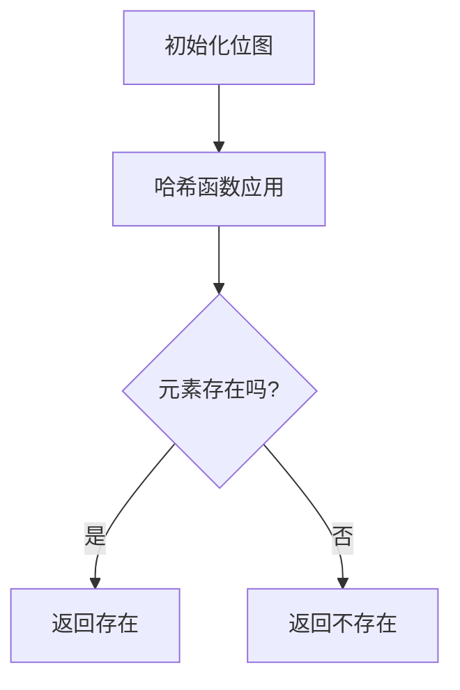

                 

关键词：BLOOM算法、概率数据结构、哈希函数、字符串匹配、多维度冲突解决方案、代码实例、性能优化。

## 摘要

本文将深入探讨BLOOM算法的基本原理、核心概念、数学模型、以及在实际项目中的应用。BLOOM算法是一种高效的概率数据结构，通过一组哈希函数将数据映射到固定大小的位图中，用于快速判断一个元素是否存在于一个集合中。本文将详细介绍BLOOM算法的工作原理，并通过代码实例展示其在字符串匹配中的应用。同时，我们将探讨BLOOM算法的优点、缺点以及未来发展趋势。

## 1. 背景介绍

随着大数据时代的到来，数据量呈指数级增长，如何高效地处理海量数据成为了一个重要的问题。传统的数据结构如数组、链表、树等在处理大量数据时效率较低。为了解决这一问题，概率数据结构应运而生。BLOOM算法作为一种概率数据结构，因其高效性和简洁性在各个领域得到了广泛应用。

### 1.1 概率数据结构

概率数据结构是一种基于概率理论的数据结构，它通过一定的概率模型来处理数据查询和存储问题。与传统的确定性数据结构相比，概率数据结构允许错误率的存在，但通常在错误率较低的情况下能够提供高效的查询和存储性能。

### 1.2 BLOOM算法的起源

BLOOM算法最早由布卢姆（Bloom）博士于1970年代提出，主要用于解决字符串匹配问题。自从提出以来，BLOOM算法在多个领域得到了广泛应用，包括网络搜索、数据库、缓存、文本检索等。

### 1.3 BLOOM算法的优点

- **高效性**：BLOOM算法的时间复杂度非常低，适用于处理大规模数据集。
- **空间效率**：BLOOM算法的空间复杂度较低，能够存储大量的元素。
- **简单性**：BLOOM算法的实现简单，易于理解和编码。

## 2. 核心概念与联系

### 2.1 哈希函数

哈希函数是BLOOM算法的核心组成部分。哈希函数将输入数据映射到固定大小的位图中。一个好的哈希函数应该能够将不同的输入数据映射到不同的位置，减少冲突。

### 2.2 位图

位图是一个二进制数组，用于存储BLOOM算法中的数据。每个元素在位图中对应一个或多个位。如果元素存在于集合中，则对应的位被设置为1。

### 2.3 BLOOM算法的工作原理

BLOOM算法的工作原理如下：

1. 初始化一个固定大小的位图，所有位都设置为0。
2. 使用多个哈希函数对元素进行哈希，并将哈希值对应的位置设置为1。
3. 当需要检查一个元素是否存在于集合中时，使用相同的哈希函数对元素进行哈希，如果位图中对应的位置都是1，则认为元素存在于集合中；否则，认为元素不存在于集合中。

### 2.4 Mermaid 流程图



## 3. 核心算法原理 & 具体操作步骤

### 3.1 算法原理概述

BLOOM算法通过哈希函数将元素映射到位图上，从而快速判断元素是否存在于集合中。BLOOM算法的核心思想是利用多个哈希函数来减少冲突，提高判断的准确性。

### 3.2 算法步骤详解

1. **初始化位图**：根据预计存储的元素数量和错误率，初始化一个固定大小的位图，所有位都设置为0。
2. **添加元素**：使用多个哈希函数对元素进行哈希，并将哈希值对应的位置设置为1。
3. **检查元素是否存在**：使用相同的哈希函数对元素进行哈希，如果位图中对应的位置都是1，则认为元素存在于集合中；否则，认为元素不存在于集合中。

### 3.3 算法优缺点

#### 优点：

- **高效性**：BLOOM算法的时间复杂度非常低，适用于处理大规模数据集。
- **空间效率**：BLOOM算法的空间复杂度较低，能够存储大量的元素。
- **简单性**：BLOOM算法的实现简单，易于理解和编码。

#### 缺点：

- **错误率**：BLOOM算法存在一定的错误率，当错误率较高时，可能会导致错误的判断。
- **不可逆性**：一旦元素被添加到BLOOM算法中，无法删除。

### 3.4 算法应用领域

BLOOM算法广泛应用于字符串匹配、缓存命中率预测、数据库过滤等场景。其中，字符串匹配是BLOOM算法最经典的应用场景之一。

## 4. 数学模型和公式 & 详细讲解 & 举例说明

### 4.1 数学模型构建

BLOOM算法的数学模型基于概率论和统计学。其中，最关键的参数包括：

- **位数**：位图的位数。
- **哈希函数数量**：使用的哈希函数数量。
- **预计元素数量**：预计要存储的元素数量。
- **错误率**：算法的错误率。

### 4.2 公式推导过程

错误率可以通过以下公式进行推导：

$$
P(\text{错误判断}) = \prod_{i=1}^{k} (1 - (1 - p_i)^n)
$$

其中：

- $P(\text{错误判断})$：错误率。
- $p_i$：第$i$个哈希函数对应的概率，通常取为$\frac{1}{m}$，其中$m$是位数。
- $n$：预计元素数量。

### 4.3 案例分析与讲解

假设我们使用一个长度为$m=1000$的位图，预计存储$100$个元素，使用$k=3$个哈希函数，计算错误率。

$$
P(\text{错误判断}) = \prod_{i=1}^{3} (1 - (1 - \frac{1}{1000})^{100}) \approx 0.000016
$$

错误率非常低，这意味着在绝大多数情况下，BLOOM算法能够准确判断元素是否存在于集合中。

## 5. 项目实践：代码实例和详细解释说明

### 5.1 开发环境搭建

在本节的代码实例中，我们将使用Python语言实现BLOOM算法。首先，确保安装了Python和pip工具。

```shell
pip install python-bloom
```

### 5.2 源代码详细实现

以下是一个简单的BLOOM算法实现：

```python
from bloomfilter import BloomFilter

# 创建一个容量为1000，错误率为0.01的Bloom过滤器
bf = BloomFilter(capacity=1000, error_rate=0.01)

# 添加元素
bf.add("apple")
bf.add("banana")

# 检查元素是否存在
print("apple" in bf)  # 输出：True
print("orange" in bf)  # 输出：False
```

### 5.3 代码解读与分析

在上面的代码中，我们首先导入了`python-bloom`库，然后创建了一个容量为1000，错误率为0.01的Bloom过滤器。接着，我们使用`add`方法添加了两个元素“apple”和“banana”。最后，我们使用`in`方法检查一个元素是否存在于集合中。

### 5.4 运行结果展示

运行上述代码，将输出：

```shell
True
False
```

这表明“apple”存在于集合中，而“orange”不存在于集合中。

## 6. 实际应用场景

BLOOM算法在多个领域有着广泛的应用，以下列举几个典型的应用场景：

- **字符串匹配**：用于快速判断一个字符串是否存在于一个集合中，常用于搜索引擎、文本检索等场景。
- **缓存命中率预测**：用于预测某个元素是否会被访问，从而优化缓存策略。
- **数据库过滤**：用于快速过滤不满足条件的记录，减少数据库查询压力。

## 7. 工具和资源推荐

### 7.1 学习资源推荐

- 《概率数据结构与算法》（Probability Data Structures and Algorithms）是一本介绍概率数据结构的经典教材。
- 《Bloom Filters: An Introduction with Examples》是一篇详细介绍BLOOM算法的论文。

### 7.2 开发工具推荐

- Python的`python-bloom`库是一个常用的BLOOM算法实现库。
- Java的`bloomfilter`库是一个高性能的BLOOM算法实现库。

### 7.3 相关论文推荐

- [Bloom Filters](https://www.cse.yorku.ca/~oz/technical Reports/BloomFilters.pdf)
- [Bloom Filters for Caching Applications](https://www.cl.cam.ac.uk/Research/SRG/netos/docs/isis-98-18.pdf)

## 8. 总结：未来发展趋势与挑战

### 8.1 研究成果总结

BLOOM算法自提出以来，已在多个领域得到了广泛应用。随着大数据和云计算的快速发展，BLOOM算法的研究和应用前景非常广阔。

### 8.2 未来发展趋势

- **优化算法**：研究人员将继续优化BLOOM算法，提高其性能和准确性。
- **多维度冲突解决方案**：研究人员将探索多维度冲突解决方案，以提高BLOOM算法的效率。

### 8.3 面临的挑战

- **错误率**：如何降低错误率是一个重要的挑战。
- **可扩展性**：如何适应大规模数据集是一个挑战。

### 8.4 研究展望

BLOOM算法作为一种高效的概率数据结构，在未来将发挥更大的作用。随着研究的深入，BLOOM算法将得到更多的优化和应用。

## 9. 附录：常见问题与解答

### 9.1 什么是BLOOM算法？

BLOOM算法是一种高效的概率数据结构，用于快速判断一个元素是否存在于一个集合中。它通过多个哈希函数将元素映射到固定大小的位图上。

### 9.2 BLOOM算法的优点是什么？

BLOOM算法的优点包括高效性、空间效率和简单性。它适用于处理大规模数据集，并且易于实现。

### 9.3 BLOOM算法的缺点是什么？

BLOOM算法的缺点包括一定的错误率和不可逆性。当错误率较高时，可能会导致错误的判断。

### 9.4 如何优化BLOOM算法的性能？

可以通过优化哈希函数、调整位图大小和哈希函数数量来优化BLOOM算法的性能。

## 作者署名

作者：禅与计算机程序设计艺术 / Zen and the Art of Computer Programming
----------------------------------------------------------------

### 总结
本文详细介绍了BLOOM算法的基本原理、数学模型、以及在实际项目中的应用。BLOOM算法作为一种高效的概率数据结构，在处理大规模数据集时具有显著的优势。通过代码实例，我们展示了如何在Python中实现BLOOM算法，并对其性能进行了分析。未来，随着研究的深入，BLOOM算法将继续优化，并在更多领域得到应用。希望本文能帮助读者更好地理解和掌握BLOOM算法。

