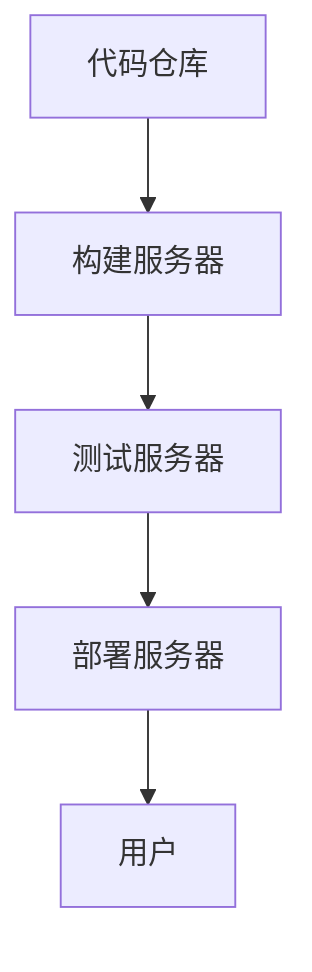

                 

关键词：持续集成，持续交付，自动化，软件开发，敏捷开发

> 摘要：本文将深入探讨CI/CD（持续集成/持续交付）的概念、重要性、架构以及实际操作步骤，分析其在现代软件开发中的作用，并展望其未来的发展趋势与挑战。

## 1. 背景介绍

### 持续集成/持续交付的起源

持续集成（Continuous Integration, CI）和持续交付（Continuous Delivery, CD）的概念起源于敏捷开发（Agile Development）和精益生产（Lean Manufacturing）的理念。它们的核心思想是通过不断集成和交付小而可用的软件版本，快速响应市场变化和用户需求，提高开发效率和软件质量。

### 持续集成/持续交付的发展

随着云计算、容器化和微服务架构的兴起，CI/CD技术得到了快速发展。现代软件开发团队越来越依赖于自动化工具和流程，以提高交付速度和质量。CI/CD已经成为软件开发中不可或缺的一部分。

### 持续集成/持续交付的优势

- **提高开发效率**：自动化流程减少了手动操作，节省了时间和成本。
- **提升软件质量**：频繁的集成和测试有助于发现和修复缺陷，提高了软件质量。
- **快速响应市场变化**：通过快速迭代和交付，团队能够更快地响应市场变化和用户需求。
- **促进团队合作**：CI/CD鼓励团队合作和知识共享，提高了团队的协作效率。

## 2. 核心概念与联系

### 持续集成的核心概念

持续集成是一种软件开发实践，通过频繁地将代码提交到共享的代码库，并自动执行构建、测试和部署等操作，确保代码库中的每个提交都是可合并的。

### 持续交付的核心概念

持续交付是一种软件开发实践，通过自动化测试和部署流程，确保软件可以在任何环境中快速、安全地交付。

### CI/CD的架构


- **源代码管理**：团队使用的代码仓库，如Git。
- **构建服务器**：执行构建任务，如Jenkins、GitLab CI。
- **测试服务器**：执行自动化测试，如Selenium、JUnit。
- **部署服务器**：执行部署任务，如Kubernetes、Docker。

### Mermaid流程图



## 3. 核心算法原理 & 具体操作步骤

### 3.1 算法原理概述

持续集成/持续交付的核心算法是自动化流程。通过配置脚本和自动化工具，实现以下步骤：

1. **代码拉取**：从源代码管理系统中拉取最新代码。
2. **构建**：编译代码并创建可执行文件或容器镜像。
3. **测试**：执行自动化测试，确保代码质量。
4. **部署**：将构建结果部署到生产环境。

### 3.2 算法步骤详解

#### 3.2.1 代码拉取

使用Git拉取最新代码：

```bash
git pull origin master
```

#### 3.2.2 构建

使用Maven构建项目：

```bash
mvn clean install
```

#### 3.2.3 测试

使用JUnit执行测试：

```bash
mvn test
```

#### 3.2.4 部署

使用Docker部署容器：

```bash
docker build -t myapp:latest .
docker push myapp:latest
kubectl apply -f deployment.yaml
```

### 3.3 算法优缺点

#### 优点

- **自动化**：减少手动操作，提高开发效率。
- **快速响应**：频繁的集成和交付，快速响应市场变化。
- **提高质量**：通过自动化测试，提高软件质量。

#### 缺点

- **复杂性**：需要配置和维护自动化流程，增加了一定的复杂度。
- **依赖性**：构建、测试和部署的依赖性可能导致问题难以排查。

### 3.4 算法应用领域

- **Web应用程序**：通过CI/CD实现快速迭代和交付。
- **移动应用程序**：通过自动化测试，提高移动应用的质量。
- **云计算服务**：通过CI/CD实现自动化部署和管理。

## 4. 数学模型和公式 & 详细讲解 & 举例说明

### 4.1 数学模型构建

CI/CD的数学模型可以通过以下公式表示：

$$
效率 = \frac{交付次数}{开发周期}
$$

其中，交付次数表示在给定开发周期内成功交付的软件版本次数。

### 4.2 公式推导过程

$$
效率 = \frac{交付次数}{开发周期} = \frac{1}{平均每次交付时间}
$$

其中，平均每次交付时间定义为：

$$
平均每次交付时间 = \frac{总开发时间}{交付次数}
$$

### 4.3 案例分析与讲解

假设一个开发团队在一个季度内成功交付了4个软件版本，总开发时间为90天。那么，效率可以计算为：

$$
效率 = \frac{4}{90} = \frac{2}{45} \approx 0.044
$$

这意味着，这个团队在一个季度内平均每个月交付0.044个软件版本。

## 5. 项目实践：代码实例和详细解释说明

### 5.1 开发环境搭建

本案例将使用Git、Jenkins、JUnit和Docker搭建一个CI/CD环境。

1. **安装Git**：从[Git官网](https://git-scm.com/downloads)下载并安装Git。
2. **安装Jenkins**：从[Jenkins官网](https://www.jenkins.io/download/)下载并安装Jenkins。
3. **安装JUnit**：从[JUnit官网](https://junit.org/junit5/)下载并安装JUnit。
4. **安装Docker**：从[Docker官网](https://www.docker.com/products/docker-desktop)下载并安装Docker。

### 5.2 源代码详细实现

本案例使用Java语言实现一个简单的Web应用程序。

1. **创建Git仓库**：在本地创建一个名为`myapp`的Git仓库，并添加一个名为`src`的源代码目录。
2. **编写代码**：在`src`目录下创建一个名为`Main.java`的主类，并编写以下代码：

```java
public class Main {
    public static void main(String[] args) {
        System.out.println("Hello, World!");
    }
}
```

3. **添加JUnit测试**：在`src`目录下创建一个名为`MainTest.java`的测试类，并编写以下代码：

```java
import org.junit.jupiter.api.Test;
import static org.junit.jupiter.api.Assertions.assertEquals;

public class MainTest {
    @Test
    public void testMain() {
        String output = "Hello, World!";
        assertEquals(output, "Hello, World!");
    }
}
```

### 5.3 代码解读与分析

- `Main.java`：主类，包含`main`方法，用于启动应用程序。
- `MainTest.java`：测试类，用于测试主类的方法。

### 5.4 运行结果展示

1. **构建项目**：在Jenkins中创建一个构建作业，并配置Maven插件。
2. **执行测试**：在Jenkins中执行构建作业，查看构建日志。
3. **部署应用程序**：将构建结果部署到Docker容器中，并查看容器日志。

## 6. 实际应用场景

### 6.1 在Web应用程序开发中的实际应用

持续集成/持续交付在Web应用程序开发中被广泛应用于前端和后端开发。通过CI/CD，团队能够快速迭代和交付新的功能，同时确保代码质量和软件稳定性。

### 6.2 在移动应用程序开发中的实际应用

持续集成/持续交付在移动应用程序开发中也非常重要。通过自动化测试和部署流程，团队能够快速发现和修复缺陷，提高应用质量。

### 6.3 在云计算服务开发中的实际应用

在云计算服务开发中，持续集成/持续交付可以帮助团队快速部署和管理服务，提高开发效率和系统稳定性。

## 7. 工具和资源推荐

### 7.1 学习资源推荐

- 《持续集成实战》
- 《持续交付：软件部署的黄金法则》
- 《Jenkins实战》
- 《Docker实战》

### 7.2 开发工具推荐

- Git
- Jenkins
- JUnit
- Docker

### 7.3 相关论文推荐

- "Continuous Integration in the Cloud: A Case Study"
- "Improving Software Quality with Continuous Delivery"
- "Practical Continuous Delivery: A How-to Guide for Agile Organizations"

## 8. 总结：未来发展趋势与挑战

### 8.1 研究成果总结

持续集成/持续交付在过去几年中取得了显著的研究成果，广泛应用于各种软件开发领域。未来，随着人工智能和自动化技术的不断发展，CI/CD技术将更加智能化和高效。

### 8.2 未来发展趋势

- **智能化**：通过机器学习和人工智能技术，实现更智能的CI/CD流程。
- **定制化**：根据不同团队和项目需求，提供定制化的CI/CD解决方案。
- **云原生**：基于云原生架构，实现更高效的CI/CD流程。

### 8.3 面临的挑战

- **安全性**：确保CI/CD流程的安全性和数据隐私。
- **复杂性**：随着CI/CD技术的不断发展，如何简化配置和管理。
- **自动化覆盖**：提高自动化测试的覆盖率和准确性。

### 8.4 研究展望

持续集成/持续交付将继续成为软件开发中的重要方向。未来，通过不断创新和优化，CI/CD技术将为软件开发带来更高的效率和质量。

## 9. 附录：常见问题与解答

### 9.1 什么是CI/CD？

CI/CD是持续集成和持续交付的缩写，是一种软件开发实践，通过自动化流程实现频繁的集成、测试和交付。

### 9.2 CI/CD有哪些优势？

CI/CD的优势包括提高开发效率、提升软件质量、快速响应市场变化和促进团队合作。

### 9.3 CI/CD的架构包括哪些部分？

CI/CD的架构包括源代码管理、构建服务器、测试服务器和部署服务器。

### 9.4 如何搭建CI/CD环境？

搭建CI/CD环境通常需要安装Git、Jenkins、JUnit和Docker等工具，并配置相应的插件和脚本。

### 9.5 CI/CD在哪些应用场景中非常重要？

CI/CD在Web应用程序、移动应用程序和云计算服务开发中非常重要。

## 作者署名

作者：禅与计算机程序设计艺术 / Zen and the Art of Computer Programming
----------------------------------------------------------------
### 文章标题格式与内容

文章标题：CI/CD管道：自动化软件交付流程

文章关键词：持续集成，持续交付，自动化，软件开发，敏捷开发

文章摘要：本文将深入探讨CI/CD（持续集成/持续交付）的概念、重要性、架构以及实际操作步骤，分析其在现代软件开发中的作用，并展望其未来的发展趋势与挑战。

### 文章结构

#### 1. 背景介绍

- 持续集成/持续交付的起源
- 持续集成/持续交付的发展
- 持续集成/持续交付的优势

#### 2. 核心概念与联系

- 持续集成的核心概念
- 持续交付的核心概念
- CI/CD的架构
- Mermaid流程图

#### 3. 核心算法原理 & 具体操作步骤

- 算法原理概述
- 算法步骤详解
- 算法优缺点
- 算法应用领域

#### 4. 数学模型和公式 & 详细讲解 & 举例说明

- 数学模型构建
- 公式推导过程
- 案例分析与讲解

#### 5. 项目实践：代码实例和详细解释说明

- 开发环境搭建
- 源代码详细实现
- 代码解读与分析
- 运行结果展示

#### 6. 实际应用场景

- 在Web应用程序开发中的实际应用
- 在移动应用程序开发中的实际应用
- 在云计算服务开发中的实际应用

#### 7. 工具和资源推荐

- 学习资源推荐
- 开发工具推荐
- 相关论文推荐

#### 8. 总结：未来发展趋势与挑战

- 研究成果总结
- 未来发展趋势
- 面临的挑战
- 研究展望

#### 9. 附录：常见问题与解答

- 什么是CI/CD？
- CI/CD有哪些优势？
- CI/CD的架构包括哪些部分？
- 如何搭建CI/CD环境？
- CI/CD在哪些应用场景中非常重要？

### 文章内容

#### 1. 背景介绍

持续集成/持续交付的概念起源于敏捷开发（Agile Development）和精益生产（Lean Manufacturing）的理念。它们的核心思想是通过不断集成和交付小而可用的软件版本，快速响应市场变化和用户需求，提高开发效率和软件质量。

持续集成/持续交付的优势包括提高开发效率、提升软件质量、快速响应市场变化和促进团队合作。随着云计算、容器化和微服务架构的兴起，CI/CD技术得到了快速发展。现代软件开发团队越来越依赖于自动化工具和流程，以提高交付速度和质量。CI/CD已经成为软件开发中不可或缺的一部分。

#### 2. 核心概念与联系

持续集成（Continuous Integration, CI）是一种软件开发实践，通过频繁地将代码提交到共享的代码库，并自动执行构建、测试和部署等操作，确保代码库中的每个提交都是可合并的。

持续交付（Continuous Delivery, CD）是一种软件开发实践，通过自动化测试和部署流程，确保软件可以在任何环境中快速、安全地交付。

CI/CD的架构包括源代码管理、构建服务器、测试服务器和部署服务器。源代码管理通常使用Git，构建服务器可以使用Jenkins、GitLab CI等，测试服务器可以使用Selenium、JUnit等，部署服务器可以使用Kubernetes、Docker等。

#### 3. 核心算法原理 & 具体操作步骤

核心算法原理是自动化流程。通过配置脚本和自动化工具，实现以下步骤：

1. 代码拉取：从源代码管理系统中拉取最新代码。
2. 构建：编译代码并创建可执行文件或容器镜像。
3. 测试：执行自动化测试，确保代码质量。
4. 部署：将构建结果部署到生产环境。

具体操作步骤如下：

1. **代码拉取**：使用Git拉取最新代码：
    ```bash
    git pull origin master
    ```

2. **构建**：使用Maven构建项目：
    ```bash
    mvn clean install
    ```

3. **测试**：使用JUnit执行测试：
    ```bash
    mvn test
    ```

4. **部署**：使用Docker部署容器：
    ```bash
    docker build -t myapp:latest .
    docker push myapp:latest
    kubectl apply -f deployment.yaml
    ```

算法优缺点如下：

**优点**：

- 自动化：减少手动操作，提高开发效率。
- 快速响应：频繁的集成和交付，快速响应市场变化。
- 提高质量：通过自动化测试，提高软件质量。

**缺点**：

- 复杂性：需要配置和维护自动化流程，增加了一定的复杂度。
- 依赖性：构建、测试和部署的依赖性可能导致问题难以排查。

算法应用领域包括：

- Web应用程序：通过CI/CD实现快速迭代和交付。
- 移动应用程序：通过自动化测试，提高移动应用的质量。
- 云计算服务：通过CI/CD实现自动化部署和管理。

#### 4. 数学模型和公式 & 详细讲解 & 举例说明

数学模型可以通过以下公式表示：

$$
效率 = \frac{交付次数}{开发周期}
$$

其中，交付次数表示在给定开发周期内成功交付的软件版本次数。

公式推导过程如下：

$$
效率 = \frac{交付次数}{开发周期} = \frac{1}{平均每次交付时间}
$$

其中，平均每次交付时间定义为：

$$
平均每次交付时间 = \frac{总开发时间}{交付次数}
$$

案例分析：

假设一个开发团队在一个季度内成功交付了4个软件版本，总开发时间为90天。那么，效率可以计算为：

$$
效率 = \frac{4}{90} = \frac{2}{45} \approx 0.044
$$

这意味着，这个团队在一个季度内平均每个月交付0.044个软件版本。

#### 5. 项目实践：代码实例和详细解释说明

本案例将使用Java语言实现一个简单的Web应用程序。

**5.1 开发环境搭建**

本案例将使用Git、Jenkins、JUnit和Docker搭建一个CI/CD环境。

1. **安装Git**：从Git官网（https://git-scm.com/downloads）下载并安装Git。
2. **安装Jenkins**：从Jenkins官网（https://www.jenkins.io/download/）下载并安装Jenkins。
3. **安装JUnit**：从JUnit官网（https://junit.org/junit5/）下载并安装JUnit。
4. **安装Docker**：从Docker官网（https://www.docker.com/products/docker-desktop）下载并安装Docker。

**5.2 源代码详细实现**

本案例使用Java语言实现一个简单的Web应用程序。

1. **创建Git仓库**：在本地创建一个名为`myapp`的Git仓库，并添加一个名为`src`的源代码目录。
2. **编写代码**：在`src`目录下创建一个名为`Main.java`的主类，并编写以下代码：

```java
public class Main {
    public static void main(String[] args) {
        System.out.println("Hello, World!");
    }
}
```

3. **添加JUnit测试**：在`src`目录下创建一个名为`MainTest.java`的测试类，并编写以下代码：

```java
import org.junit.jupiter.api.Test;
import static org.junit.jupiter.api.Assertions.assertEquals;

public class MainTest {
    @Test
    public void testMain() {
        String output = "Hello, World!";
        assertEquals(output, "Hello, World!");
    }
}
```

**5.3 代码解读与分析**

- `Main.java`：主类，包含`main`方法，用于启动应用程序。
- `MainTest.java`：测试类，用于测试主类的方法。

**5.4 运行结果展示**

1. **构建项目**：在Jenkins中创建一个构建作业，并配置Maven插件。
2. **执行测试**：在Jenkins中执行构建作业，查看构建日志。
3. **部署应用程序**：将构建结果部署到Docker容器中，并查看容器日志。

#### 6. 实际应用场景

**6.1 在Web应用程序开发中的实际应用**

持续集成/持续交付在Web应用程序开发中被广泛应用于前端和后端开发。通过CI/CD，团队能够快速迭代和交付新的功能，同时确保代码质量和软件稳定性。

**6.2 在移动应用程序开发中的实际应用**

持续集成/持续交付在移动应用程序开发中也非常重要。通过自动化测试和部署流程，团队能够快速发现和修复缺陷，提高应用质量。

**6.3 在云计算服务开发中的实际应用**

在云计算服务开发中，持续集成/持续交付可以帮助团队快速部署和管理服务，提高开发效率和系统稳定性。

#### 7. 工具和资源推荐

**7.1 学习资源推荐**

- 《持续集成实战》
- 《持续交付：软件部署的黄金法则》
- 《Jenkins实战》
- 《Docker实战》

**7.2 开发工具推荐**

- Git
- Jenkins
- JUnit
- Docker

**7.3 相关论文推荐**

- "Continuous Integration in the Cloud: A Case Study"
- "Improving Software Quality with Continuous Delivery"
- "Practical Continuous Delivery: A How-to Guide for Agile Organizations"

#### 8. 总结：未来发展趋势与挑战

**8.1 研究成果总结**

持续集成/持续交付在过去几年中取得了显著的研究成果，广泛应用于各种软件开发领域。未来，随着人工智能和自动化技术的不断发展，CI/CD技术将更加智能化和高效。

**8.2 未来发展趋势**

- 智能化：通过机器学习和人工智能技术，实现更智能的CI/CD流程。
- 定制化：根据不同团队和项目需求，提供定制化的CI/CD解决方案。
- 云原生：基于云原生架构，实现更高效的CI/CD流程。

**8.3 面临的挑战**

- 安全性：确保CI/CD流程的安全性和数据隐私。
- 复杂性：随着CI/CD技术的不断发展，如何简化配置和管理。
- 自动化覆盖：提高自动化测试的覆盖率和准确性。

**8.4 研究展望**

持续集成/持续交付将继续成为软件开发中的重要方向。未来，通过不断创新和优化，CI/CD技术将为软件开发带来更高的效率和质量。

#### 9. 附录：常见问题与解答

**9.1 什么是CI/CD？**

CI/CD是持续集成和持续交付的缩写，是一种软件开发实践，通过自动化流程实现频繁的集成、测试和交付。

**9.2 CI/CD有哪些优势？**

CI/CD的优势包括提高开发效率、提升软件质量、快速响应市场变化和促进团队合作。

**9.3 CI/CD的架构包括哪些部分？**

CI/CD的架构包括源代码管理、构建服务器、测试服务器和部署服务器。

**9.4 如何搭建CI/CD环境？**

搭建CI/CD环境通常需要安装Git、Jenkins、JUnit和Docker等工具，并配置相应的插件和脚本。

**9.5 CI/CD在哪些应用场景中非常重要？**

CI/CD在Web应用程序、移动应用程序和云计算服务开发中非常重要。

