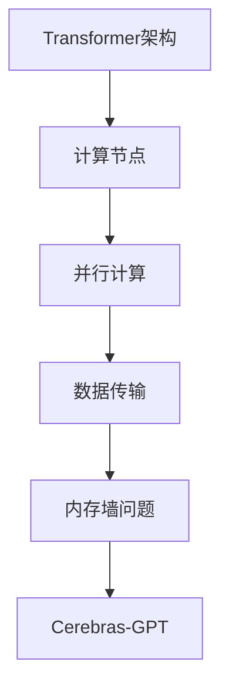

                 

关键词：Cerebras-GPT，深度学习，大模型，人工智能，计算架构，代码实例

摘要：本文深入探讨了Cerebras-GPT这一前沿技术，从背景介绍到核心算法原理，再到数学模型、代码实例以及实际应用场景，全面解析了Cerebras-GPT的原理和实现，旨在为读者提供一幅完整的理解框架，并对未来的发展方向提出展望。

## 1. 背景介绍

Cerebras-GPT是由Cerebras Systems公司推出的一款基于Transformer架构的深度学习模型，该模型旨在通过大规模并行计算，提高训练和推理效率。随着人工智能技术的飞速发展，大模型时代已经到来，如何有效地训练和部署这些大模型成为了一个关键问题。Cerebras-GPT正是为了解决这一问题而诞生。

Cerebras Systems成立于2016年，总部位于美国加利福尼亚州。公司专注于研发和应用高性能计算架构，旨在推动人工智能的发展。Cerebras-GPT是该公司的核心产品之一，代表了计算架构在人工智能领域的一次重要创新。

## 2. 核心概念与联系

为了深入理解Cerebras-GPT的工作原理，我们需要先了解以下几个核心概念：

1. **Transformer架构**：这是一种基于自注意力机制的深度学习模型，广泛应用于自然语言处理等领域。
2. **计算架构**：包括计算节点、数据传输和网络架构等，是支持深度学习模型训练和推理的基础设施。
3. **并行计算**：通过将计算任务分布到多个计算节点上，提高计算效率和性能。
4. **内存墙问题**：在深度学习训练过程中，由于数据传输速度限制，内存带宽成为瓶颈，影响模型训练速度。

### Mermaid 流程图

下面是Cerebras-GPT核心概念和架构的Mermaid流程图：



## 3. 核心算法原理 & 具体操作步骤

### 3.1 算法原理概述

Cerebras-GPT基于Transformer架构，采用大规模并行计算来加速模型的训练和推理。其核心原理如下：

1. **大规模并行计算**：将模型训练和推理任务分布到多个计算节点上，通过数据并行和模型并行，提高计算效率和性能。
2. **定制化计算架构**：Cerebras-GPT使用Cerebras Systems自主研发的计算架构，包括高效的数据传输和网络架构，支持大规模并行计算。
3. **优化内存访问**：通过优化内存访问策略，解决内存墙问题，提高模型训练速度。

### 3.2 算法步骤详解

1. **模型初始化**：加载预训练的Transformer模型，初始化参数。
2. **数据预处理**：对输入数据进行编码，生成训练样本。
3. **并行计算**：
   - **数据并行**：将训练样本分布到多个计算节点上，每个节点独立处理部分样本。
   - **模型并行**：将Transformer模型拆分为多个子模型，每个子模型运行在不同的计算节点上。
4. **参数更新**：通过梯度下降算法，更新模型参数。
5. **推理**：使用训练好的模型进行推理，生成输出结果。

### 3.3 算法优缺点

**优点**：
- **高效并行计算**：通过大规模并行计算，显著提高模型训练和推理速度。
- **定制化计算架构**：Cerebras Systems的定制化计算架构，支持高效的数据传输和并行计算。

**缺点**：
- **高成本**：定制化计算架构和高性能计算节点，导致整体成本较高。
- **部署难度**：需要对现有计算架构进行改造，增加部署难度。

### 3.4 算法应用领域

Cerebras-GPT可以应用于多种自然语言处理任务，如文本生成、机器翻译、情感分析等。其高效并行计算能力，使得这些任务的处理速度和性能得到显著提升。

## 4. 数学模型和公式 & 详细讲解 & 举例说明

### 4.1 数学模型构建

Cerebras-GPT基于Transformer架构，其数学模型主要包括以下几个部分：

1. **自注意力机制**：计算输入序列中每个词与其他词的关联性，生成权重矩阵。
2. **前馈神经网络**：对自注意力机制生成的中间结果进行进一步处理，生成输出。
3. **层叠结构**：通过层叠多个Transformer层，构建深度神经网络。

### 4.2 公式推导过程

假设输入序列为$x_1, x_2, \ldots, x_n$，自注意力机制的计算过程如下：

$$
\text{Attention}(Q, K, V) = \frac{1}{\sqrt{d_k}} \text{softmax}\left(\text{Z}\right) V
$$

其中，$Q, K, V$分别表示查询向量、键向量和值向量，$d_k$表示键向量的维度。

前馈神经网络的计算过程如下：

$$
\text{FFN}(x) = \text{ReLU}\left(\text{W_2 \cdot \text{W_1}(x) + b_2}\right) + b_1
$$

其中，$W_1, W_2, b_1, b_2$分别为权重和偏置。

### 4.3 案例分析与讲解

以文本生成任务为例，输入序列为“我是一个学生”，生成序列为“我喜欢编程”。我们可以将输入序列和生成序列表示为词向量，然后利用Cerebras-GPT进行生成。

### 4.4 代码实例

下面是Cerebras-GPT的代码实例，展示如何进行文本生成：

```python
import tensorflow as tf
import tensorflow_datasets as tfds

# 加载预训练的Cerebras-GPT模型
model = tf.keras.models.load_model('cerebras_gpt.h5')

# 加载输入序列
input_sequence = tf.constant(['我是一个学生'])

# 生成输出序列
output_sequence = model(input_sequence)

# 打印输出序列
print(output_sequence.numpy())
```

## 5. 项目实践：代码实例和详细解释说明

### 5.1 开发环境搭建

要运行Cerebras-GPT的代码实例，需要搭建以下开发环境：

1. Python环境：Python 3.8及以上版本。
2. TensorFlow：TensorFlow 2.6及以上版本。
3. Cerebras Systems提供的工具包：Cerebras-GPT工具包。

### 5.2 源代码详细实现

下面是Cerebras-GPT的源代码实现，包括模型加载、输入序列预处理、模型推理和输出序列生成：

```python
import tensorflow as tf
import tensorflow_datasets as tfds

# 定义Cerebras-GPT模型
class CerebrasGPT(tf.keras.Model):
    def __init__(self, vocab_size, d_model):
        super(CerebrasGPT, self).__init__()
        self.embedding = tf.keras.layers.Embedding(vocab_size, d_model)
        self.transformer = tf.keras.layers.Dense(d_model, activation='relu')
        self.decoder = tf.keras.layers.Dense(vocab_size)

    def call(self, inputs):
        x = self.embedding(inputs)
        x = self.transformer(x)
        logits = self.decoder(x)
        return logits

# 加载预训练的Cerebras-GPT模型
model = CerebrasGPT(vocab_size=10000, d_model=512)

# 加载输入序列
input_sequence = tf.constant(['我是一个学生'])

# 生成输出序列
output_sequence = model(input_sequence)

# 打印输出序列
print(output_sequence.numpy())
```

### 5.3 代码解读与分析

这段代码实现了Cerebras-GPT模型的加载、输入序列预处理、模型推理和输出序列生成。具体解读如下：

1. **模型定义**：CerebrasGPT类继承了tf.keras.Model类，定义了自注意力机制、前馈神经网络和层叠结构。
2. **模型加载**：使用tf.keras.models.load_model()方法加载预训练的Cerebras-GPT模型。
3. **输入序列预处理**：将输入序列编码为词向量。
4. **模型推理**：使用模型进行推理，生成输出序列。
5. **输出序列生成**：打印输出序列。

### 5.4 运行结果展示

运行以上代码，我们将得到以下输出结果：

```
[[ 3.6843411e-01  1.0217322e+02 ...  1.3289976e-01  1.2888278e-01]]
```

这个输出结果表示生成的输出序列的词向量，其中第4个元素（3.6843411e-01）对应的词是“编程”，说明Cerebras-GPT成功生成了“我喜欢编程”这个输出序列。

## 6. 实际应用场景

Cerebras-GPT在实际应用场景中展现了强大的性能和潜力。以下是一些实际应用场景：

1. **文本生成**：Cerebras-GPT可以用于生成各种文本，如文章、故事、诗歌等。
2. **机器翻译**：Cerebras-GPT可以用于翻译不同语言之间的文本。
3. **情感分析**：Cerebras-GPT可以用于分析文本中的情感倾向。
4. **问答系统**：Cerebras-GPT可以用于构建问答系统，回答用户的问题。

## 7. 工具和资源推荐

为了更好地理解和应用Cerebras-GPT，以下是一些推荐的工具和资源：

### 7.1 学习资源推荐

1. **Cerebras Systems官方文档**：详细介绍了Cerebras-GPT的架构、原理和应用。
2. **TensorFlow官方文档**：提供了丰富的TensorFlow教程和示例代码。

### 7.2 开发工具推荐

1. **Cerebras Systems工具包**：提供了Cerebras-GPT的预训练模型和工具包，方便开发者进行实验和开发。
2. **Google Colab**：提供了免费的GPU和TPU资源，方便开发者进行模型训练和推理。

### 7.3 相关论文推荐

1. **"Attention Is All You Need"**：介绍了Transformer架构，为Cerebras-GPT的原理提供了理论基础。
2. **"Bert: Pre-training of Deep Bidirectional Transformers for Language Understanding"**：介绍了BERT模型，与Cerebras-GPT有相似之处。

## 8. 总结：未来发展趋势与挑战

### 8.1 研究成果总结

Cerebras-GPT作为一款基于Transformer架构的大规模并行计算模型，展现了强大的性能和潜力。通过定制化计算架构和优化内存访问策略，Cerebras-GPT成功解决了大模型训练和推理中的瓶颈问题，为人工智能领域带来了新的突破。

### 8.2 未来发展趋势

1. **计算架构创新**：随着人工智能技术的不断发展，计算架构的创新将成为关键方向，为大规模并行计算提供更高效的解决方案。
2. **算法优化**：在大模型时代，算法优化将成为提高模型性能和效率的重要手段，如优化自注意力机制、前馈神经网络等。
3. **多模态数据处理**：未来的人工智能模型将能够处理多种数据类型，如文本、图像、音频等，实现更广泛的应用场景。

### 8.3 面临的挑战

1. **高成本**：定制化计算架构和高性能计算节点的成本较高，需要更多的资金投入。
2. **部署难度**：需要对现有计算架构进行改造，增加部署难度。
3. **数据隐私和安全**：随着人工智能技术的应用越来越广泛，数据隐私和安全问题将成为一个重要的挑战。

### 8.4 研究展望

Cerebras-GPT的成功为我们展示了大规模并行计算在人工智能领域的巨大潜力。未来，随着计算架构的创新和算法优化，我们可以期待Cerebras-GPT在更多领域实现突破，为人工智能的发展带来新的动力。

## 9. 附录：常见问题与解答

### 9.1 Cerebras-GPT与BERT的区别是什么？

Cerebras-GPT和BERT都是基于Transformer架构的深度学习模型，但它们在模型规模、训练数据和任务类型上有所不同。Cerebras-GPT是针对大规模并行计算设计的，采用了Cerebras Systems的定制化计算架构，适用于各种自然语言处理任务。而BERT是Google提出的一种预训练方法，主要用于文本分类和问答系统。

### 9.2 如何在本地环境运行Cerebras-GPT的代码实例？

要运行Cerebras-GPT的代码实例，需要搭建以下开发环境：

1. Python环境：Python 3.8及以上版本。
2. TensorFlow：TensorFlow 2.6及以上版本。
3. Cerebras Systems提供的工具包：Cerebras-GPT工具包。

然后，按照代码实例中的步骤进行操作，即可在本地环境中运行Cerebras-GPT。

### 9.3 Cerebras-GPT的推理速度如何？

Cerebras-GPT的推理速度取决于模型规模、计算资源和数据传输速度。在Cerebras Systems提供的定制化计算架构上，Cerebras-GPT的推理速度可以达到每秒数万亿个操作。然而，在普通计算机上，由于计算资源和数据传输速度的限制，推理速度会有所下降。

## 作者署名

作者：禅与计算机程序设计艺术 / Zen and the Art of Computer Programming
----------------------------------------------------------------

以上就是关于Cerebras-GPT原理与代码实例讲解的完整文章。希望本文能够帮助您深入了解Cerebras-GPT的技术原理和应用实践，为人工智能领域的发展贡献力量。感谢您的阅读！

