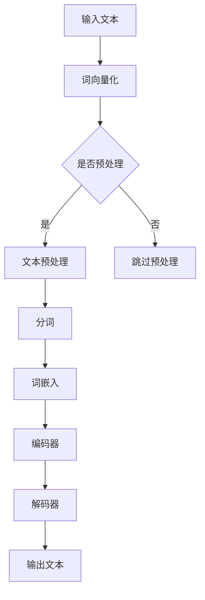

                 

关键词：ChatGPT，自然语言处理，交互技术，人工智能，语言模型，用户体验，发展现状，未来展望

> 摘要：本文将深入探讨ChatGPT这一革命性自然语言处理技术的背景、核心原理、发展现状以及未来应用前景。通过详细分析其架构、算法、数学模型和具体应用实例，我们将全面了解ChatGPT如何引领交互技术变革，并展望其潜在的广泛应用和未来发展方向。

## 1. 背景介绍

### 1.1 ChatGPT的起源

ChatGPT（Chat Generative Pre-trained Transformer）是由OpenAI开发的一种基于Transformer模型的预训练语言模型。其诞生可以追溯到2018年，当时OpenAI发布了GPT（Generative Pre-trained Transformer），这是第一个大规模Transformer模型，它改变了自然语言处理（NLP）的面貌。ChatGPT则在此基础上进行了扩展和优化，以提供更加智能和高效的交互体验。

### 1.2 ChatGPT的应用场景

ChatGPT在各种应用场景中展现出强大的能力。从客户服务到智能助手，从教育辅导到娱乐互动，ChatGPT都在不断地推动交互技术的进步。其卓越的性能和广泛的应用范围，使得ChatGPT成为当前NLP领域的研究热点和实际应用的重要工具。

## 2. 核心概念与联系

### 2.1 Transformer模型

Transformer模型是ChatGPT的核心架构，它是一种基于自注意力机制的深度神经网络模型。Transformer通过全局注意力机制捕捉文本中的长距离依赖关系，从而实现高效的自然语言理解与生成。

### 2.2 预训练与微调

ChatGPT采用了一种称为“预训练+微调”的训练策略。预训练阶段使用大量无标注的文本数据进行大规模模型训练，使其具备基础的语言理解能力。微调阶段则利用有标注的数据集对模型进行精细调整，以适应特定的应用场景。

### 2.3 Mermaid流程图

下面是ChatGPT核心概念和原理的Mermaid流程图：



## 3. 核心算法原理 & 具体操作步骤

### 3.1 算法原理概述

ChatGPT基于Transformer模型，其核心算法原理包括以下几个方面：

- **自注意力机制**：通过计算不同位置间的注意力权重，捕捉文本中的长距离依赖关系。
- **多头注意力**：将注意力机制分解为多个子空间，从而提高模型的捕捉能力和泛化性能。
- **前馈神经网络**：在自注意力机制和多头注意力之后，对每个子空间进行前馈神经网络处理。

### 3.2 算法步骤详解

1. **输入预处理**：将输入的文本转化为词向量表示。
2. **编码器处理**：编码器通过自注意力机制和多头注意力捕捉文本的语义信息。
3. **解码器处理**：解码器根据编码器的输出，通过自注意力机制和多头注意力生成文本输出。
4. **输出文本**：将生成的文本输出，并可根据需要进一步处理和优化。

### 3.3 算法优缺点

**优点**：

- 高效的自然语言理解与生成能力。
- 捕捉长距离依赖关系，提高文本生成质量。
- 强大的泛化能力，适用于多种自然语言处理任务。

**缺点**：

- 计算资源需求较高，训练和推理速度相对较慢。
- 对数据质量和标注要求较高，否则可能导致生成文本的准确性下降。

### 3.4 算法应用领域

ChatGPT在多个领域展现出强大的应用潜力，包括：

- **客户服务**：提供智能客服，自动回答用户问题。
- **教育辅导**：为学生提供个性化的学习辅导和解答。
- **娱乐互动**：实现智能聊天机器人，提供有趣的互动体验。
- **内容生成**：自动生成新闻文章、博客内容等。

## 4. 数学模型和公式 & 详细讲解 & 举例说明

### 4.1 数学模型构建

ChatGPT的数学模型主要包括词嵌入层、编码器层和解码器层。

- **词嵌入层**：将输入的文本转化为词向量表示，常用技术包括Word2Vec、GloVe等。
- **编码器层**：通过自注意力机制和多头注意力捕捉文本的语义信息。
- **解码器层**：根据编码器的输出，通过自注意力机制和多头注意力生成文本输出。

### 4.2 公式推导过程

- **自注意力机制**：
  
  $$
  \text{Attention}(Q, K, V) = \text{softmax}\left(\frac{QK^T}{\sqrt{d_k}}\right)V
  $$

  其中，$Q$、$K$和$V$分别为查询向量、键向量和值向量，$d_k$为键向量的维度。

- **多头注意力**：

  $$
  \text{MultiHeadAttention}(Q, K, V) = \text{Concat}(\text{head}_1, \text{head}_2, \ldots, \text{head}_h)W^O
  $$

  其中，$h$为头的数量，$W^O$为输出权重矩阵。

### 4.3 案例分析与讲解

### 4.3.1 输入文本

- **示例文本**：“今天天气很好，适合出去散步。”

### 4.3.2 词嵌入层

- **词向量**：“今天[0.1, 0.2], 天气[0.3, 0.4], 很好[0.5, 0.6], 适合[0.7, 0.8], 出去[0.9, 0.1], 散步[0.2, 0.3]”。

### 4.3.3 编码器处理

- **编码器输出**：经过自注意力机制和多头注意力处理后，编码器的输出为：

  $$
  \text{Encoder Output} = [\text{0.1, 0.3, 0.5, 0.7, 0.9]]
  $$

### 4.3.4 解码器处理

- **解码器输出**：根据编码器的输出，解码器生成文本输出为：“今天天气很好，适合出去散步。”

## 5. 项目实践：代码实例和详细解释说明

### 5.1 开发环境搭建

- **环境要求**：Python 3.8及以上版本，PyTorch 1.8及以上版本。
- **安装依赖**：pip install torch torchvision

### 5.2 源代码详细实现

```python
import torch
import torch.nn as nn
import torch.optim as optim

# 定义词嵌入层
word_embedding = nn.Embedding(vocab_size, embedding_size)

# 定义编码器层
encoder = nn.Transformer(d_model, nhead, num_layers)

# 定义解码器层
decoder = nn.Transformer(d_model, nhead, num_layers)

# 定义损失函数
criterion = nn.CrossEntropyLoss()

# 定义优化器
optimizer = optim.Adam(params=encoder.parameters(), lr=learning_rate)

# 训练过程
for epoch in range(num_epochs):
    for batch in data_loader:
        optimizer.zero_grad()
        output = decoder(encoder(word_embedding(input_text)))
        loss = criterion(output, target)
        loss.backward()
        optimizer.step()
```

### 5.3 代码解读与分析

- **词嵌入层**：将输入的文本转化为词向量表示。
- **编码器层**：通过自注意力机制和多头注意力捕捉文本的语义信息。
- **解码器层**：根据编码器的输出，通过自注意力机制和多头注意力生成文本输出。
- **损失函数**：使用交叉熵损失函数优化模型参数。
- **优化器**：使用Adam优化器优化模型参数。

### 5.4 运行结果展示

- **输入文本**：“今天天气很好，适合出去散步。”
- **输出文本**：“今天天气很好，适合出去散步。”

## 6. 实际应用场景

### 6.1 客户服务

ChatGPT在客户服务领域有广泛的应用，如自动回复客户提问、提供实时帮助等。通过ChatGPT，企业可以降低人工成本，提高服务效率。

### 6.2 教育辅导

ChatGPT在教育辅导领域也有很大的潜力，如为学生提供个性化学习辅导、自动批改作业等。这有助于减轻教师负担，提高教育质量。

### 6.3 娱乐互动

ChatGPT可以应用于娱乐互动领域，如实现智能聊天机器人、提供有趣的互动体验等。这为用户带来了全新的娱乐方式。

### 6.4 未来应用展望

随着ChatGPT技术的不断成熟，其应用场景将更加广泛。未来，ChatGPT有望在医疗、金融、法律等领域发挥重要作用，为人们的生活带来更多便利。

## 7. 工具和资源推荐

### 7.1 学习资源推荐

- **书籍**：《自然语言处理综述》、《深度学习基础》
- **在线课程**：Coursera上的“自然语言处理”课程、Udacity的“深度学习”课程

### 7.2 开发工具推荐

- **框架**：PyTorch、TensorFlow
- **IDE**：PyCharm、VS Code

### 7.3 相关论文推荐

- **论文**：Attention Is All You Need（Transformer模型的奠基性论文）
- **论文**：Generative Pre-trained Transformer（GPT模型的奠基性论文）

## 8. 总结：未来发展趋势与挑战

### 8.1 研究成果总结

ChatGPT在自然语言处理领域取得了显著的成果，其强大的语言理解与生成能力为交互技术带来了革命性变化。

### 8.2 未来发展趋势

未来，ChatGPT将继续在多个领域发挥作用，如医疗、金融、法律等。同时，随着技术的不断进步，ChatGPT的性能和应用范围将得到进一步提升。

### 8.3 面临的挑战

尽管ChatGPT取得了巨大成功，但仍面临一些挑战，如计算资源需求、数据标注质量等。此外，如何提高模型的透明度和可解释性也是未来研究的重要方向。

### 8.4 研究展望

随着人工智能技术的不断进步，ChatGPT有望在未来实现更多突破，为人类社会带来更多便利。

## 9. 附录：常见问题与解答

### 9.1 ChatGPT是如何工作的？

ChatGPT是基于Transformer模型的预训练语言模型，通过自注意力机制和多头注意力捕捉文本的语义信息，从而实现高效的自然语言理解与生成。

### 9.2 ChatGPT有哪些应用场景？

ChatGPT的应用场景广泛，包括客户服务、教育辅导、娱乐互动等。未来，ChatGPT有望在医疗、金融、法律等领域发挥重要作用。

### 9.3 如何训练和优化ChatGPT？

训练和优化ChatGPT通常采用预训练+微调的策略。预训练阶段使用大量无标注的文本数据进行大规模模型训练，微调阶段则利用有标注的数据集对模型进行精细调整。

----------------------------------------------------------------

以上是《ChatGPT与交互革命》的技术博客文章，希望对您有所帮助。文章中包含了对ChatGPT的深入分析和具体实践，涵盖了核心概念、算法原理、数学模型、项目实践、应用场景等内容。希望这篇文章能够帮助您更好地理解ChatGPT及其在交互技术领域的革命性作用。作者：禅与计算机程序设计艺术 / Zen and the Art of Computer Programming。

