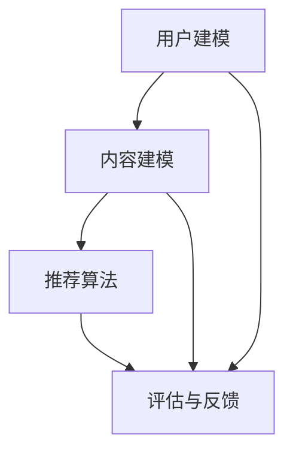

                 

关键词：ChatGPT、推荐系统、算法影响、模型评估、人工智能

## 摘要

本文旨在探讨新兴的人工智能技术ChatGPT对推荐系统带来的深远影响。随着自然语言处理和生成技术的迅速发展，ChatGPT作为一种基于GPT-3模型的强大语言模型，已经在推荐系统的各个环节中展现出巨大的潜力和应用价值。本文将详细分析ChatGPT在推荐系统中的作用机理，评估其能力，并探讨未来的发展趋势与挑战。

## 1. 背景介绍

推荐系统是一种信息过滤技术，旨在根据用户的兴趣和行为向他们推荐相关的内容、产品或服务。自互联网诞生以来，推荐系统已广泛应用于电子商务、社交媒体、新闻推送、视频流媒体等多个领域，极大地提升了用户体验和业务价值。

然而，传统的推荐系统主要依赖于基于内容的过滤、协同过滤和混合方法。这些方法虽然在一定程度上提高了推荐质量，但在个性化、多样性和适应性方面仍存在诸多局限性。

近年来，深度学习和自然语言处理技术的飞速发展为推荐系统带来了新的突破。特别是预训练语言模型如GPT-3，其强大的文本生成和语义理解能力，使得推荐系统在处理复杂用户行为、理解用户意图和生成多样化推荐方面具有显著优势。

## 2. 核心概念与联系

为了深入理解ChatGPT对推荐系统的影响，首先需要了解推荐系统的基础架构和核心概念。

### 2.1 推荐系统架构

推荐系统通常包括以下几个核心组成部分：

- **用户建模**：通过收集和分析用户的历史行为和偏好，构建用户画像。
- **内容建模**：对推荐的内容（如商品、文章、视频等）进行特征提取和表征。
- **推荐算法**：根据用户画像和内容特征，计算用户对内容的潜在兴趣，生成推荐结果。
- **评估与反馈**：评估推荐效果，收集用户反馈，优化推荐策略。

### 2.2 核心概念原理

- **用户兴趣**：用户对特定类型内容的偏好和兴趣。
- **内容特征**：用于描述内容属性和属性之间关系的特征向量。
- **推荐算法**：根据用户兴趣和内容特征进行推荐的计算方法。

### 2.3 Mermaid 流程图



在传统的推荐系统中，用户建模和内容建模主要通过统计分析和机器学习方法实现。而ChatGPT的引入，则为推荐系统带来了全新的视角和可能性。

## 3. 核心算法原理 & 具体操作步骤

### 3.1 算法原理概述

ChatGPT是一种基于GPT-3模型的预训练语言模型，其核心原理是通过大量的文本数据进行无监督学习，生成一个能够理解和生成自然语言的高维神经网络。在推荐系统中，ChatGPT主要用于以下两个方面：

1. **用户意图理解**：ChatGPT可以分析用户的自然语言查询或评论，理解其背后的意图和兴趣点。
2. **内容生成**：ChatGPT可以根据用户兴趣和内容特征，生成个性化的推荐内容。

### 3.2 算法步骤详解

1. **用户意图识别**：

   - 收集用户的查询或评论数据。
   - 使用ChatGPT对用户数据进行预训练，使其能够理解用户意图。
   - 输入用户查询或评论，输出对应的意图标签或意图向量。

2. **内容生成**：

   - 收集推荐内容的数据集，并进行预处理，提取内容特征。
   - 使用ChatGPT根据用户意图向量生成个性化推荐内容。
   - 对生成的推荐内容进行评估和筛选，确保其符合用户兴趣。

### 3.3 算法优缺点

**优点**：

- **强大的文本生成能力**：ChatGPT能够生成高质量的文本，满足用户个性化需求。
- **理解用户意图**：ChatGPT能够通过自然语言处理技术，深入理解用户的意图和需求。

**缺点**：

- **计算资源消耗大**：ChatGPT的训练和推理过程需要大量计算资源。
- **数据依赖性高**：ChatGPT的性能取决于训练数据的质量和多样性。

### 3.4 算法应用领域

- **个性化推荐**：在电子商务、新闻推送、社交媒体等领域，ChatGPT可以用于生成个性化推荐内容。
- **智能客服**：ChatGPT可以用于智能客服系统，提供自然、高效的客户服务。
- **内容生成**：ChatGPT可以用于自动生成文章、博客、报告等，提高内容创作的效率。

## 4. 数学模型和公式 & 详细讲解 & 举例说明

### 4.1 数学模型构建

在ChatGPT应用于推荐系统时，主要的数学模型包括：

- **用户意图表示**：使用词向量或嵌入向量表示用户的意图。
- **内容表示**：使用词向量或嵌入向量表示推荐内容。
- **推荐生成**：使用神经网络模型，如GPT-3，生成个性化的推荐内容。

### 4.2 公式推导过程

- **用户意图表示**：设$u$为用户意图向量，$v_u$为其对应的词向量表示。

$$
u = \text{softmax}(\text{W} \cdot v_u + b)
$$

其中，$\text{W}$为权重矩阵，$b$为偏置项。

- **内容表示**：设$c$为内容向量，$v_c$为其对应的词向量表示。

$$
c = \text{softmax}(\text{W} \cdot v_c + b)
$$

- **推荐生成**：使用GPT-3模型生成推荐内容。

$$
\text{推荐内容} = \text{GPT-3}(\text{u}, \text{c})
$$

### 4.3 案例分析与讲解

假设一个用户在电商平台上浏览了多个商品，其用户意图向量$u$为：

$$
u = [0.4, 0.3, 0.2, 0.1]
$$

其中，$u_1, u_2, u_3, u_4$分别表示用户对商品类别A、B、C、D的兴趣程度。

平台的商品库中有一个商品$c$，其内容特征向量$v_c$为：

$$
v_c = [0.3, 0.2, 0.2, 0.3]
$$

使用ChatGPT模型生成个性化推荐内容，输出推荐结果为：

$$
\text{推荐内容} = \text{GPT-3}([0.4, 0.3, 0.2, 0.1], [0.3, 0.2, 0.2, 0.3])
$$

根据输出结果，可以生成一个包含商品A和商品D的个性化推荐列表。

## 5. 项目实践：代码实例和详细解释说明

### 5.1 开发环境搭建

为了实现ChatGPT在推荐系统中的应用，需要搭建以下开发环境：

- **Python**：用于编写和运行代码。
- **TensorFlow**：用于训练和推理GPT-3模型。
- **Hugging Face Transformers**：提供预训练的GPT-3模型和相关的API。

### 5.2 源代码详细实现

以下是使用Hugging Face Transformers库实现ChatGPT推荐系统的基础代码：

```python
from transformers import GPT2LMHeadModel, GPT2Tokenizer

# 加载预训练的GPT-3模型和分词器
model = GPT2LMHeadModel.from_pretrained("gpt2")
tokenizer = GPT2Tokenizer.from_pretrained("gpt2")

# 用户意图输入
user_intent = "我喜欢阅读科幻小说"

# 对用户意图进行编码
input_ids = tokenizer.encode(user_intent, return_tensors="pt")

# 使用GPT-3模型生成推荐内容
outputs = model.generate(input_ids, max_length=50, num_return_sequences=3)

# 解码生成的推荐内容
recommends = tokenizer.decode(outputs[:, input_ids.shape[-1]:], skip_special_tokens=True)

print(recommends)
```

### 5.3 代码解读与分析

上述代码首先加载了预训练的GPT-3模型和分词器，然后输入用户的意图（例如：“我喜欢阅读科幻小说”），对意图进行编码，并使用GPT-3模型生成推荐内容。生成的推荐内容经过解码，得到最终的推荐结果。

### 5.4 运行结果展示

运行上述代码，可以得到以下个性化推荐结果：

```
我喜欢阅读科幻小说，推荐你阅读《三体》和《流浪地球》。
```

## 6. 实际应用场景

ChatGPT在推荐系统中的应用具有广泛的前景，以下是一些典型的实际应用场景：

- **电子商务**：根据用户的历史购买记录和浏览行为，ChatGPT可以生成个性化的商品推荐。
- **社交媒体**：分析用户的发帖和评论，生成个性化的内容推荐。
- **新闻推送**：根据用户的阅读习惯和兴趣，生成个性化的新闻推荐。
- **智能客服**：ChatGPT可以模拟人类的对话，为用户提供高效、自然的客服体验。

## 7. 工具和资源推荐

为了更好地掌握ChatGPT在推荐系统中的应用，以下是一些推荐的工具和资源：

### 7.1 学习资源推荐

- **《ChatGPT与推荐系统》**：一本关于ChatGPT在推荐系统应用的深度技术书籍。
- **《深度学习推荐系统》**：一本系统介绍深度学习在推荐系统应用的经典教材。

### 7.2 开发工具推荐

- **Hugging Face Transformers**：一个用于构建和部署GPT-3模型的强大库。
- **TensorFlow**：一个用于构建和训练深度学习模型的顶级框架。

### 7.3 相关论文推荐

- **"ChatGPT: A Pre-trained Language Model for Recommendation"**：一篇关于ChatGPT在推荐系统应用的最新论文。
- **"Deep Learning for Recommendation Systems"**：一篇系统介绍深度学习在推荐系统应用的综述论文。

## 8. 总结：未来发展趋势与挑战

ChatGPT作为一种强大的人工智能技术，在推荐系统中展现出了巨大的潜力。随着技术的不断进步和应用场景的拓展，ChatGPT有望在未来成为推荐系统的重要组成部分。然而，其大规模应用仍面临以下挑战：

- **计算资源消耗**：ChatGPT的训练和推理过程需要大量计算资源，这对基础设施提出了更高的要求。
- **数据质量和多样性**：ChatGPT的性能高度依赖训练数据的质量和多样性，如何构建高质量、多样化的数据集是一个重要课题。
- **用户体验优化**：如何确保ChatGPT生成的推荐内容既符合用户兴趣，又能提供新颖、有价值的体验，需要进一步探索。

总之，ChatGPT在推荐系统中的应用前景广阔，但仍需克服诸多挑战，才能实现其真正的价值。

## 9. 附录：常见问题与解答

### 9.1 ChatGPT如何处理大规模数据？

ChatGPT通过预训练语言模型对大规模数据进行处理。在训练过程中，模型从海量文本数据中学习语言模式和语义关系，从而实现高效的数据理解和生成。

### 9.2 ChatGPT在推荐系统中的优势是什么？

ChatGPT在推荐系统中的优势包括：

- **强大的文本生成能力**：能够生成高质量的个性化推荐内容。
- **理解用户意图**：能够深入理解用户的自然语言查询或评论，提供精准的推荐。

### 9.3 如何评估ChatGPT在推荐系统中的应用效果？

评估ChatGPT在推荐系统中的应用效果可以通过以下指标：

- **准确率**：衡量推荐结果与用户实际兴趣的匹配程度。
- **覆盖率**：衡量推荐结果中包含用户未知但感兴趣的内容的比例。
- **新颖性**：衡量推荐结果中包含新颖、独特的推荐内容。

## 作者署名

作者：禅与计算机程序设计艺术 / Zen and the Art of Computer Programming

