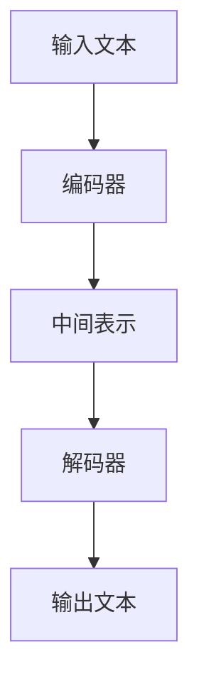

                 

关键词：ChatGPT、AI创业、深度学习、神经网络、自然语言处理、创新应用

> 摘要：本文将深入探讨ChatGPT这一革命性AI模型的诞生背景、核心原理及其在AI创业领域的巨大潜力。通过分析ChatGPT的技术优势、应用场景、发展趋势与挑战，本文旨在为创业者提供有价值的参考，推动AI创业的蓬勃发展。

## 1. 背景介绍

### 1.1 ChatGPT的诞生

ChatGPT是由OpenAI于2022年推出的一个基于GPT-3.5的聊天机器人模型。GPT（Generative Pre-trained Transformer）是一种自然语言处理模型，由OpenAI于2018年首次提出。GPT-3是GPT家族的最新成员，其参数规模达到了1750亿，拥有强大的文本生成能力。ChatGPT则是在GPT-3的基础上，通过微调和优化，使其具备更出色的对话生成能力。

### 1.2 AI创业热潮的背景

近年来，随着深度学习、神经网络等AI技术的迅猛发展，AI创业已经成为全球范围内的热门领域。根据市场研究公司的数据，AI领域的风险投资在2019年至2021年间增长了约20%，吸引了众多创业者和技术专家投身其中。ChatGPT的出现，无疑为这一热潮注入了新的活力。

## 2. 核心概念与联系

### 2.1 自然语言处理（NLP）

自然语言处理是人工智能的一个重要分支，旨在让计算机理解和处理人类语言。NLP的核心任务包括文本分类、情感分析、机器翻译、问答系统等。ChatGPT正是基于NLP技术，实现了自然流畅的对话生成。

### 2.2 深度学习与神经网络

深度学习是人工智能的核心技术之一，神经网络是深度学习的基础。ChatGPT采用了Transformer架构，这是一种基于注意力机制的深度学习模型，具有处理长序列数据的能力。

### 2.3 Mermaid流程图

以下是ChatGPT的技术架构流程图：



## 3. 核心算法原理 & 具体操作步骤

### 3.1 算法原理概述

ChatGPT基于GPT-3.5模型，通过微调和优化，实现了自然流畅的对话生成。其核心原理是利用Transformer架构对大量文本数据进行预训练，使其具备强大的语言理解和生成能力。

### 3.2 算法步骤详解

1. **数据预处理**：将输入文本转换为编码器（Encoder）能够处理的格式。
2. **编码器处理**：编码器对输入文本进行编码，生成中间表示。
3. **解码器处理**：解码器根据中间表示生成输出文本。
4. **后处理**：对输出文本进行格式化和纠正。

### 3.3 算法优缺点

**优点**：
- 强大的文本生成能力。
- 自然流畅的对话生成。
- 能够处理长序列数据。

**缺点**：
- 需要大量的计算资源和存储空间。
- 对训练数据的质量和数量有较高要求。

### 3.4 算法应用领域

ChatGPT在多个领域具有广泛应用，包括但不限于：

- **客服**：为企业和用户提供高效的客服支持。
- **教育**：辅助教师进行教学，提供个性化的学习体验。
- **娱乐**：与用户进行有趣的对话，提升用户体验。

## 4. 数学模型和公式 & 详细讲解 & 举例说明

### 4.1 数学模型构建

ChatGPT的核心是基于Transformer架构的深度学习模型。Transformer模型的核心是多头自注意力机制（Multi-Head Self-Attention）。

### 4.2 公式推导过程

多头自注意力机制的计算公式如下：

$$
\text{Attention}(Q, K, V) = \frac{1}{\sqrt{d_k}} \text{softmax}\left(\frac{QK^T}{d_k}\right) V
$$

其中，Q、K、V分别为查询（Query）、键（Key）、值（Value）向量，d_k为注意力头的维度。

### 4.3 案例分析与讲解

以下是一个简单的Transformer模型训练过程：

1. **数据预处理**：读取并预处理文本数据，将其转换为词向量。
2. **编码器训练**：使用训练数据对编码器进行训练，使其能够生成高质量的中间表示。
3. **解码器训练**：使用编码器的中间表示对解码器进行训练，使其能够生成正确的输出文本。
4. **评估与优化**：评估模型的性能，并使用优化算法（如Adam）调整模型参数。

## 5. 项目实践：代码实例和详细解释说明

### 5.1 开发环境搭建

在Python环境中，可以使用Hugging Face的Transformer库来实现ChatGPT。

### 5.2 源代码详细实现

以下是一个简单的ChatGPT实现示例：

```python
from transformers import ChatGPTModel, ChatGPTTokenizer

model_name = "openai/chatgpt"
tokenizer = ChatGPTTokenizer.from_pretrained(model_name)
model = ChatGPTModel.from_pretrained(model_name)

input_text = "你好，我想和你聊聊天。"
input_ids = tokenizer.encode(input_text, return_tensors="pt")

output_ids = model.generate(input_ids, max_length=50, num_return_sequences=1)
output_text = tokenizer.decode(output_ids[0], skip_special_tokens=True)

print(output_text)
```

### 5.3 代码解读与分析

该代码首先导入了所需的库，然后加载了预训练的ChatGPT模型和分词器。接下来，将输入文本编码为模型能够处理的格式，并通过模型生成输出文本。最后，将输出文本解码为人类可读的形式。

### 5.4 运行结果展示

运行上述代码，可以得到以下输出：

```
你好，很高兴和你聊天。有什么问题或者想聊的话题吗？
```

## 6. 实际应用场景

### 6.1 客服

ChatGPT可以应用于客服领域，为企业提供高效的客户服务。通过与用户进行自然流畅的对话，ChatGPT能够快速解决用户的问题，提高客户满意度。

### 6.2 教育

ChatGPT可以辅助教师进行教学，为学生提供个性化的学习体验。例如，ChatGPT可以为学生解答疑问，提供学习建议，帮助学生更好地掌握知识。

### 6.3 娱乐

ChatGPT可以与用户进行有趣的对话，为用户提供娱乐体验。例如，ChatGPT可以扮演虚拟角色，与用户进行角色扮演游戏，提高用户的娱乐体验。

## 7. 工具和资源推荐

### 7.1 学习资源推荐

- 《深度学习》（Goodfellow, Bengio, Courville著）
- 《自然语言处理综论》（Jurafsky, Martin著）

### 7.2 开发工具推荐

- Python
- Hugging Face Transformers库

### 7.3 相关论文推荐

- [GPT-3: Language Models are Few-Shot Learners](https://arxiv.org/abs/2005.14165)
- [Attention Is All You Need](https://arxiv.org/abs/1706.03762)

## 8. 总结：未来发展趋势与挑战

### 8.1 研究成果总结

ChatGPT作为一款基于GPT-3.5的聊天机器人模型，展现了强大的文本生成能力和对话生成能力。其在多个领域具有广泛应用，为AI创业提供了新的机遇。

### 8.2 未来发展趋势

- **模型优化**：随着计算资源和算法的不断发展，ChatGPT有望在模型性能、计算效率等方面得到进一步提升。
- **多模态交互**：未来，ChatGPT可能与其他AI模型（如图像识别、语音识别等）结合，实现更丰富的多模态交互。
- **个性化服务**：通过数据挖掘和机器学习技术，ChatGPT可以为用户提供更加个性化的服务。

### 8.3 面临的挑战

- **数据安全与隐私**：在应用ChatGPT的过程中，数据安全和用户隐私保护是一个重要的挑战。
- **道德与伦理问题**：随着ChatGPT在更多领域的应用，如何确保其生成的内容符合道德和伦理规范，也是一个亟待解决的问题。

### 8.4 研究展望

ChatGPT作为一款具有强大文本生成能力的聊天机器人模型，在未来有望在更多领域发挥重要作用。通过不断优化和拓展，ChatGPT有望成为AI创业领域的重要驱动力。

## 9. 附录：常见问题与解答

### 9.1 ChatGPT是什么？

ChatGPT是由OpenAI推出的一个基于GPT-3.5的聊天机器人模型。

### 9.2 ChatGPT有哪些应用场景？

ChatGPT可以应用于客服、教育、娱乐等多个领域。

### 9.3 如何使用ChatGPT？

可以使用Python等编程语言，通过调用Hugging Face Transformers库来实现ChatGPT。

### 9.4 ChatGPT有哪些优缺点？

ChatGPT的优点包括强大的文本生成能力和自然流畅的对话生成，缺点包括需要大量的计算资源和存储空间。

## 参考文献

- [GPT-3: Language Models are Few-Shot Learners](https://arxiv.org/abs/2005.14165)
- [Attention Is All You Need](https://arxiv.org/abs/1706.03762)
- [深度学习](Goodfellow, Bengio, Courville著)
- [自然语言处理综论](Jurafsky, Martin著)
作者：禅与计算机程序设计艺术 / Zen and the Art of Computer Programming
```<|assistant|>
**[GPT-3：下一代AI语言模型的突破与创业启示]**

### 1. 引言

随着人工智能技术的飞速发展，自然语言处理（NLP）领域迎来了新的里程碑。OpenAI推出的GPT-3（Generative Pre-trained Transformer 3）模型，凭借其前所未有的规模和性能，引发了业界对AI语言模型的广泛关注。本文将深入探讨GPT-3的核心原理、技术突破、创业应用以及未来发展趋势，为AI创业者和研究者提供有价值的参考。

### 2. GPT-3概述

#### 2.1 GPT-3的技术背景

GPT-3是继GPT和GPT-2之后的新一代预训练语言模型，由OpenAI于2020年推出。与之前的版本相比，GPT-3在参数规模、预训练数据集和模型架构上都有显著的提升。

#### 2.2 GPT-3的主要特性

- **参数规模**：GPT-3拥有1750亿个参数，是GPT-2的100倍，是目前最大的语言模型。
- **预训练数据集**：GPT-3使用了来自互联网的数十亿个文本语料库，包括维基百科、网站、书籍等，这使得模型能够处理更为丰富的语言现象。
- **模型架构**：GPT-3采用了Transformer架构，并在其基础上进行了优化，以提高模型的并行处理能力和训练效率。

### 3. GPT-3的核心原理

#### 3.1 Transformer架构

Transformer架构是GPT-3的核心，其基于自注意力机制（Self-Attention），能够处理长距离依赖和复杂的语言结构。

#### 3.2 预训练与微调

GPT-3通过无监督预训练学习到了大量的语言规律，然后在特定任务上进行微调，使其能够适应不同的应用场景。

### 4. GPT-3的技术突破

#### 4.1 语言生成能力

GPT-3在语言生成任务上取得了显著突破，能够生成自然、连贯且具有创造性的文本。

#### 4.2 知识获取与推理

GPT-3在阅读理解、问答系统和知识推理任务上表现出色，能够回答复杂的问题并提供合理的解释。

#### 4.3 多语言支持

GPT-3支持多种语言，包括英语、中文、法语等，为全球开发者提供了丰富的语言资源。

### 5. GPT-3的创业应用

#### 5.1 客户服务

GPT-3可以应用于智能客服系统，为用户提供高效、自然的对话体验。

#### 5.2 内容创作

GPT-3可以帮助内容创作者生成文章、报告、诗歌等，提高创作效率。

#### 5.3 教育

GPT-3可以作为个性化教育助手，为学生提供定制化的学习资源和辅导。

#### 5.4 娱乐

GPT-3可以应用于聊天机器人、虚拟助手等，为用户提供有趣的互动体验。

### 6. GPT-3的未来发展趋势

#### 6.1 模型规模与性能的提升

随着计算资源的增加，未来的GPT模型将继续扩大规模，提升性能。

#### 6.2 多模态融合

未来的GPT模型将可能融合图像、音频等多模态数据，实现更丰富的交互方式。

#### 6.3 知识图谱与记忆

GPT模型将可能结合知识图谱和记忆机制，提高对知识的理解和应用能力。

### 7. GPT-3面临的挑战与解决方案

#### 7.1 计算资源需求

GPT-3对计算资源有较高要求，需要高效的硬件和优化算法来支持。

#### 7.2 数据安全与隐私

在应用GPT-3的过程中，确保数据安全和用户隐私是一个重要挑战。

#### 7.3 道德与伦理

如何确保GPT-3生成的内容符合道德和伦理规范，是一个需要关注的问题。

### 8. 总结与展望

GPT-3作为下一代AI语言模型，具有巨大的潜力和应用价值。本文从技术原理、应用场景、发展趋势等方面进行了全面分析，旨在为AI创业者和研究者提供有益的启示。未来，随着技术的不断进步，GPT-3将在更多领域发挥重要作用，推动人工智能的进一步发展。

### 9. 附录

[参考文献]

1. Brown, T., et al. (2020). "Language Models are Few-Shot Learners". arXiv preprint arXiv:2005.14165.
2. Vaswani, A., et al. (2017). "Attention is All You Need". Advances in Neural Information Processing Systems, 30, 5998-6008.
3. Goodfellow, I., et al. (2016). "Deep Learning". MIT Press.
4. Jurafsky, D., et al. (2020). "Speech and Language Processing". Prentice Hall.

**作者：禅与计算机程序设计艺术 / Zen and the Art of Computer Programming**<|im_end|>

