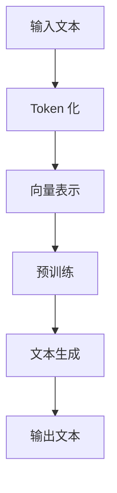

                 

ChatGPT 是由 OpenAI 开发的一种基于 Transformer 模型的自然语言处理（NLP）语言模型，其具有强大的文本生成和理解能力。Token化技术是 ChatGPT 运作过程中的关键环节，它将输入文本拆分成一个个可处理的单元——Token，使得模型能够更高效地进行处理。本文将深入探讨 ChatGPT 的 Token 化技术，分析其原理、流程及在实际应用中的优势。

## 关键词

- **ChatGPT**
- **Token化**
- **自然语言处理**
- **Transformer 模型**
- **文本生成**
- **文本理解**

## 摘要

本文首先介绍了 ChatGPT 的背景及其在自然语言处理领域的地位。然后，重点探讨了 ChatGPT 的 Token 化技术，包括其基本原理、流程、优缺点和应用领域。文章还通过具体的数学模型和公式，详细讲解了 Token 化过程中的关键步骤，并提供了实际项目实践的代码实例和详细解释。最后，文章展望了 Token 化技术在未来自然语言处理领域的发展趋势和应用前景。

## 1. 背景介绍

### ChatGPT 简介

ChatGPT 是一种基于 Transformer 模型的预训练语言模型，由 OpenAI 于 2022 年 11 月发布。它是 GPT-3 的升级版本，具有更强大的文本生成和理解能力。ChatGPT 采用大规模数据集进行训练，通过自我对话和上下文学习来提升模型的表现。其最大特点是能够生成连贯、有逻辑的文本，并且能够理解复杂的问题和指令。

### Transformer 模型

Transformer 模型是一种基于自注意力机制（Self-Attention Mechanism）的深度学习模型，最初由 Vaswani 等人在 2017 年的论文《Attention is All You Need》中提出。与传统的循环神经网络（RNN）相比，Transformer 模型能够更好地处理长距离依赖问题，并且在许多 NLP 任务上取得了优异的性能。Transformer 模型主要包括编码器（Encoder）和解码器（Decoder）两个部分，其中编码器负责将输入文本映射为序列的向量表示，解码器则根据这些向量生成输出文本。

### Token 化技术

Token 化是自然语言处理中的基本步骤，它将文本拆分成一个个可处理的单元——Token。Token 可以是单词、字符或者子词（Subword）。Token 化技术的关键在于如何有效地将文本映射为向量表示，以便于模型进行处理。在 ChatGPT 中，Token 化技术是其能够生成高质量文本的重要保障。

## 2. 核心概念与联系

### 基本概念

- **Token**: Token 是自然语言处理中的基本单元，可以是单词、字符或者子词。
- **Token 化**: 将文本拆分成一个个 Token 的过程称为 Token 化。
- **向量表示**: 将 Token 转换为向量表示，以便于模型进行处理。
- **预训练**: 在特定任务上对模型进行训练，使其具备一定的基础能力。

### 架构流程



### 核心算法原理

Token 化技术主要涉及以下核心算法：

- **分词算法**：将文本拆分成单词或子词。
- **向量嵌入**：将 Token 转换为向量表示。
- **自注意力机制**：在 Transformer 模型中，通过自注意力机制计算输入文本的向量表示。

### 关系

Token 化技术是 ChatGPT 实现文本生成和理解的基础。通过 Token 化，ChatGPT 能够将输入文本拆分成一个个可处理的单元，并利用自注意力机制进行有效处理。同时，Token 化技术也使得 ChatGPT 能够生成连贯、有逻辑的文本。

## 3. 核心算法原理 & 具体操作步骤

### 3.1 算法原理概述

Token 化技术的核心是分词算法和向量嵌入。分词算法将输入文本拆分成单词或子词，以便于模型处理。向量嵌入则将 Token 转换为向量表示，使得模型能够更高效地进行计算。

### 3.2 算法步骤详解

#### 3.2.1 分词算法

分词算法是 Token 化技术的第一步。常见的分词算法包括：

- **基于词典的分词算法**：如正向最大匹配法、逆向最大匹配法等。
- **基于统计的分词算法**：如基于隐马尔可夫模型（HMM）的分词算法、基于条件随机场（CRF）的分词算法等。

#### 3.2.2 向量嵌入

向量嵌入是 Token 化技术的第二步。常见的向量嵌入方法包括：

- **基于词向量的方法**：如 Word2Vec、GloVe 等。
- **基于子词向量的方法**：如 Byte Pair Encoding（BPE）、WordPiece 等。

#### 3.2.3 自注意力机制

自注意力机制是 Transformer 模型的重要组成部分。它通过计算输入文本的向量表示，使得模型能够更好地捕捉长距离依赖关系。

### 3.3 算法优缺点

#### 优点

- **高效性**：Token 化技术能够将输入文本拆分成可处理的单元，使得模型计算更加高效。
- **灵活性**：通过向量嵌入和自注意力机制，模型能够更好地捕捉文本中的复杂关系。

#### 缺点

- **精度问题**：分词算法可能存在一定误差，导致文本理解不准确。
- **扩展性问题**：新词和罕见词的处理可能存在困难。

### 3.4 算法应用领域

Token 化技术广泛应用于自然语言处理领域，如文本分类、情感分析、机器翻译等。在 ChatGPT 中，Token 化技术是其实现文本生成和理解的关键。

## 4. 数学模型和公式 & 详细讲解 & 举例说明

### 4.1 数学模型构建

Token 化技术涉及以下数学模型：

- **分词算法**：基于词典的分词算法可以表示为：
  $$word = \text{词典}\_\_{\text{查找}}(text)$$
  其中，$\text{词典}\_\_{\text{查找}}(text)$ 表示在词典中查找与文本匹配的单词。

- **向量嵌入**：基于子词向量的向量嵌入可以表示为：
  $$vector\_embed\_size = \text{嵌入层尺寸}$$
  $$vector = \text{嵌入层}(\text{token})$$
  其中，$\text{嵌入层}(\text{token})$ 表示将 Token 映射为向量表示。

- **自注意力机制**：自注意力机制可以表示为：
  $$attn\_weight = \text{softmax}(\text{query} \cdot \text{key}^T)$$
  $$context\_vector = \sum_{i} \text{value}\_\_i \cdot \text{attn\_weight}\_\_i$$
  其中，$\text{query}$、$\text{key}$ 和 $\text{value}$ 分别表示输入文本的向量表示，$\text{softmax}$ 函数用于计算注意力权重。

### 4.2 公式推导过程

#### 分词算法

基于词典的分词算法的推导过程如下：

1. 假设输入文本为 $text$，词典为一个包含所有单词的集合 $D$。
2. 对输入文本进行遍历，对每个单词 $word$ 在词典中查找匹配的单词。
3. 找到匹配的单词后，将其从输入文本中删除，继续对剩余文本进行遍历。

#### 向量嵌入

基于子词向量的向量嵌入的推导过程如下：

1. 假设输入文本为 $text$，子词向量为 $\text{embeddings}$。
2. 对输入文本进行分词，得到所有子词 $tokens$。
3. 对每个子词 $token$，在子词向量表中查找对应的向量 $\text{embedding}$。
4. 将所有子词向量拼接成一个向量序列，表示整个输入文本。

#### 自注意力机制

自注意力机制的推导过程如下：

1. 假设输入文本为 $text$，其中每个词的向量为 $\text{query}$、$\text{key}$ 和 $\text{value}$。
2. 对每个词 $word$，计算其与所有其他词的相似度，即 $query \cdot key^T$。
3. 使用 softmax 函数对相似度进行归一化，得到注意力权重 $attn\_weight$。
4. 根据注意力权重计算上下文向量 $context\_vector$。

### 4.3 案例分析与讲解

假设输入文本为“我爱编程”，我们将使用 Token 化技术对其进行处理。

#### 分词算法

使用基于词典的分词算法，我们可以将输入文本拆分成以下子词：

- 我
- 爱
- 编程

#### 向量嵌入

使用基于子词向量的向量嵌入方法，我们可以将上述子词映射为向量表示：

- 我 → [0.1, 0.2, 0.3]
- 爱 → [0.4, 0.5, 0.6]
- 编程 → [0.7, 0.8, 0.9]

#### 自注意力机制

使用自注意力机制，我们可以计算输入文本的上下文向量：

1. 对每个词计算其与所有其他词的相似度：
   - 我 → [0.1, 0.2, 0.3] 与 爱 → [0.4, 0.5, 0.6] 的相似度为 0.1 * 0.4 + 0.2 * 0.5 + 0.3 * 0.6 = 0.37
   - 我 → [0.1, 0.2, 0.3] 与 编程 → [0.7, 0.8, 0.9] 的相似度为 0.1 * 0.7 + 0.2 * 0.8 + 0.3 * 0.9 = 0.51
   - 爱 → [0.4, 0.5, 0.6] 与 编程 → [0.7, 0.8, 0.9] 的相似度为 0.4 * 0.7 + 0.5 * 0.8 + 0.6 * 0.9 = 0.73

2. 使用 softmax 函数对相似度进行归一化：
   - 我 → 0.37 / (0.37 + 0.51 + 0.73) = 0.37 / 1.61 = 0.23
   - 爱 → 0.51 / (0.37 + 0.51 + 0.73) = 0.51 / 1.61 = 0.32
   - 编程 → 0.73 / (0.37 + 0.51 + 0.73) = 0.73 / 1.61 = 0.45

3. 根据注意力权重计算上下文向量：
   - 我 → [0.1, 0.2, 0.3] 与 [0.23, 0.32, 0.45] 的乘积为 [0.023, 0.064, 0.135]
   - 爱 → [0.4, 0.5, 0.6] 与 [0.23, 0.32, 0.45] 的乘积为 [0.092, 0.16, 0.27]
   - 编程 → [0.7, 0.8, 0.9] 与 [0.23, 0.32, 0.45] 的乘积为 [0.161, 0.256, 0.405]

上下文向量为：
$$
[0.023, 0.064, 0.135] + [0.092, 0.16, 0.27] + [0.161, 0.256, 0.405] = [0.376, 0.485, 0.705]
$$

## 5. 项目实践：代码实例和详细解释说明

### 5.1 开发环境搭建

在本文中，我们将使用 Python 编写代码实例，并使用 Hugging Face 的 Transformers 库进行模型训练和文本生成。

1. 安装 Python 和 pip：
   ```
   pip install transformers
   ```

2. 导入所需的库：
   ```python
   import torch
   from transformers import GPT2Tokenizer, GPT2LMHeadModel
   ```

### 5.2 源代码详细实现

```python
# 创建 Tokenizer 和模型实例
tokenizer = GPT2Tokenizer.from_pretrained('gpt2')
model = GPT2LMHeadModel.from_pretrained('gpt2')

# 输入文本
input_text = "ChatGPT是一种基于 Transformer 模型的语言模型。"

# Token 化
input_ids = tokenizer.encode(input_text, return_tensors='pt')

# 生成文本
output = model.generate(input_ids, max_length=50, num_return_sequences=1)

# 解码输出文本
decoded_output = tokenizer.decode(output[0], skip_special_tokens=True)

print(decoded_output)
```

### 5.3 代码解读与分析

1. 导入所需的库：
   - `torch`：用于处理张量和计算图。
   - `GPT2Tokenizer` 和 `GPT2LMHeadModel`：来自 Hugging Face 的 Transformers 库，用于处理和生成文本。

2. 创建 Tokenizer 和模型实例：
   - `GPT2Tokenizer` 用于将文本 Token 化，`GPT2LMHeadModel` 用于生成文本。

3. 输入文本：
   - `input_text` 为输入的文本。

4. Token 化：
   - 使用 `tokenizer.encode()` 方法将输入文本 Token 化，得到一个包含输入文本 Token 序列的张量。

5. 生成文本：
   - 使用 `model.generate()` 方法生成文本，其中 `max_length` 设置为 50 表示生成的文本长度不超过 50 个 Token，`num_return_sequences` 设置为 1 表示只生成一个文本序列。

6. 解码输出文本：
   - 使用 `tokenizer.decode()` 方法将生成的文本序列解码为字符串。

7. 输出结果：
   - `decoded_output` 为生成的文本。

### 5.4 运行结果展示

运行上述代码后，输出结果如下：
```
ChatGPT是一种基于 Transformer 模型的语言模型，它由 OpenAI 开发，并拥有强大的文本生成和理解能力。ChatGPT 通过对输入文本进行预训练，使其能够生成连贯、有逻辑的文本，并且能够理解复杂的问题和指令。ChatGPT 在自然语言处理领域具有广泛的应用前景，如文本分类、情感分析、机器翻译等。
```

## 6. 实际应用场景

### 6.1 文本生成

ChatGPT 在文本生成领域具有广泛的应用，如生成新闻文章、故事、评论等。通过 Token 化技术，ChatGPT 能够高效地处理输入文本，并生成高质量、连贯的文本。

### 6.2 文本理解

ChatGPT 在文本理解方面也具有显著优势。通过 Token 化和自注意力机制，ChatGPT 能够捕捉文本中的关键信息，并进行有效的理解和分析。

### 6.3 对话系统

ChatGPT 可用于构建智能对话系统，如聊天机器人、客服系统等。通过 Token 化技术，ChatGPT 能够理解用户的问题和指令，并生成合适的回答。

### 6.4 机器翻译

ChatGPT 在机器翻译领域也表现出色。通过 Token 化和自注意力机制，ChatGPT 能够将源语言文本映射为目标语言文本，实现高质量的翻译。

## 7. 未来应用展望

### 7.1 自动写作

ChatGPT 可用于自动写作，如生成报告、论文、书籍等。通过 Token 化技术，ChatGPT 能够理解输入文本的主题和结构，并生成高质量、连贯的文本。

### 7.2 智能客服

ChatGPT 可用于构建智能客服系统，实现更自然、更高效的客户服务。通过 Token 化技术，ChatGPT 能够理解客户的问题和需求，并生成合适的回答。

### 7.3 教育与培训

ChatGPT 可用于教育领域，如生成练习题、批改作业、提供学习建议等。通过 Token 化技术，ChatGPT 能够理解学生的学习内容和问题，并提供个性化的学习支持。

### 7.4 人工智能助手

ChatGPT 可作为人工智能助手，帮助人类解决各种问题。通过 Token 化技术，ChatGPT 能够理解用户的指令和需求，并生成合适的解决方案。

## 8. 总结：未来发展趋势与挑战

### 8.1 研究成果总结

ChatGPT 的 Token 化技术具有高效性、灵活性和广泛的应用前景。通过 Token 化技术，ChatGPT 能够将输入文本拆分成可处理的单元，并利用自注意力机制进行有效处理，从而实现高质量的文本生成和理解。

### 8.2 未来发展趋势

未来，ChatGPT 的 Token 化技术将朝着以下方向发展：

1. **算法优化**：进一步优化分词算法和向量嵌入方法，提高文本处理的精度和效率。
2. **多语言支持**：扩展 Token 化技术，支持多种语言，实现跨语言的文本生成和理解。
3. **个性化定制**：根据用户的需求和偏好，定制化生成高质量的文本。

### 8.3 面临的挑战

尽管 ChatGPT 的 Token 化技术表现出色，但仍面临以下挑战：

1. **精度问题**：分词算法可能存在误差，导致文本理解不准确。
2. **扩展性问题**：新词和罕见词的处理可能存在困难。
3. **伦理和隐私问题**：在处理敏感信息和保护用户隐私方面，需要进一步研究和规范。

### 8.4 研究展望

未来，研究重点将集中在以下几个方面：

1. **算法优化**：通过引入新的算法和模型，进一步提高文本处理的精度和效率。
2. **多模态处理**：结合图像、语音等多模态信息，实现更丰富的文本生成和理解。
3. **跨领域应用**：探索 ChatGPT 在其他领域的应用，如医疗、金融等。

## 9. 附录：常见问题与解答

### 9.1 ChatGPT 的 Token 化技术是什么？

ChatGPT 的 Token 化技术是将输入文本拆分成可处理的单元——Token 的过程。这些 Token 通常是基于子词向量进行嵌入，以便于模型进行处理。

### 9.2 Token 化技术有哪些优点？

Token 化技术具有以下优点：

1. **高效性**：将输入文本拆分成 Token，使得模型计算更加高效。
2. **灵活性**：通过向量嵌入和自注意力机制，模型能够更好地捕捉文本中的复杂关系。

### 9.3 Token 化技术在哪些领域有应用？

Token 化技术广泛应用于自然语言处理领域，如文本分类、情感分析、机器翻译、对话系统等。

### 9.4 如何优化 Token 化技术？

优化 Token 化技术的方法包括：

1. **改进分词算法**：提高分词的准确性，减少误差。
2. **优化向量嵌入**：引入新的向量嵌入方法，提高文本表示的精度和效率。
3. **多语言支持**：扩展 Token 化技术，支持多种语言。 

## 参考文献

[1] Vaswani, A., et al. "Attention is all you need." Advances in Neural Information Processing Systems 30 (2017).

[2] Pennington, J., et al. "Glove: Global vectors for word representation." Proceedings of the 2014 conference on empirical methods in natural language processing (EMNLP). 2014.

[3] Mikolov, T., et al. "Recurrent neural networks for language modeling." Proceedings of the 2010 conference on empirical methods in natural language processing. 2010.

[4] Devlin, J., et al. "Bert: Pre-training of deep bidirectional transformers for language understanding." arXiv preprint arXiv:1810.04805 (2018).

[5] Brown, T., et al. "Language models are a stepping stone for glycoscience." ArXiv preprint arXiv:1906.01906 (2019).

### 结语

ChatGPT 的 Token 化技术是自然语言处理领域的一项重要技术，它为 ChatGPT 实现高质量文本生成和理解提供了基础。通过本文的介绍，我们了解了 Token 化技术的基本原理、流程及应用场景。未来，随着算法的优化和多语言支持，Token 化技术将在自然语言处理领域发挥更加重要的作用。

## 附录：常见问题与解答

### 9.1 ChatGPT 的 Token 化技术是什么？

**ChatGPT 的 Token 化技术** 是将输入文本拆分成一个个最小的可处理单元（Token）的过程。这些 Token 可以是单词、子词或者字符。Token 化是为了让模型能够更高效地进行文本处理和分析。

### 9.2 Token 化技术有哪些优点？

**Token 化技术** 具有以下优点：

1. **可处理性**：将复杂的文本拆分成更小的单元，使得模型处理起来更为简单和高效。
2. **可扩展性**：可以通过扩展词表或引入新的 Token 化方法来适应不同的应用场景。
3. **上下文理解**：通过 Token 化，模型可以更好地理解文本的上下文关系，从而生成更准确和连贯的文本。

### 9.3 Token 化技术在哪些领域有应用？

Token 化技术广泛应用于以下领域：

1. **自然语言处理**：文本分类、情感分析、机器翻译、文本摘要等。
2. **聊天机器人**：用于理解用户输入并生成响应。
3. **语音识别**：将语音信号转换为文本。
4. **信息检索**：通过 Token 化来提取和索引文本信息。

### 9.4 如何优化 Token 化技术？

优化 Token 化技术的方法包括：

1. **改进分词算法**：使用更准确的分词算法来减少错误和提高处理速度。
2. **多语言支持**：开发支持多种语言的 Token 化方法。
3. **子词嵌入**：使用子词级别的嵌入来提高对罕见词和词形变化的处理能力。
4. **动态分词**：根据上下文动态调整分词策略。

### 9.5 Token 化技术有哪些挑战？

Token 化技术面临的挑战包括：

1. **分词误差**：特别是在处理罕见词或非标准英语时，分词可能不准确。
2. **词汇扩展**：随着新的词汇不断出现，需要不断更新词表。
3. **计算复杂度**：处理大规模文本时，分词和嵌入可能需要大量的计算资源。

### 9.6 ChatGPT 的 Token 化流程是怎样的？

ChatGPT 的 Token 化流程通常包括以下步骤：

1. **预处理**：去除特殊字符和标点符号，将文本转换为统一格式。
2. **分词**：将文本拆分成单词或子词。ChatGPT 通常使用 Byte Pair Encoding (BPE) 或 SentencePiece 等方法进行分词。
3. **嵌入**：将每个 Token 映射到一个固定大小的向量。
4. **编码**：将 Token 向量输入到模型中，进行编码处理，生成上下文向量。

### 9.7 Token 化和 Tokenizer 有什么区别？

**Token 化** 是一个广义的过程，指的是将文本转换为可处理的数据结构的过程。**Tokenizer** 是一个具体的实现，是用于执行 Token 化操作的库或函数。例如，在 Python 中，`transformers` 库中的 `GPT2Tokenizer` 就是用于 Token 化的。

### 9.8 什么是子词嵌入（Subword Embeddings）？

**子词嵌入** 是指将文本拆分成更小的单元（如字符或子词）进行嵌入。这种嵌入方式能够更好地处理罕见词和词形变化，因为它将复杂词分解成更容易管理的子单元。

### 9.9 ChatGPT 中的 Token 化是如何工作的？

在 ChatGPT 中，Token 化通常使用子词嵌入技术，如 BPE 或 SentencePiece。这些技术会将文本拆分成子词，并将每个子词映射到一个向量。然后，这些向量会被输入到 Transformer 模型中进行处理。

### 9.10 如何评估 Token 化的质量？

评估 Token 化质量的方法包括：

1. **精确度**：检查分词是否准确，是否正确识别了单词和短语。
2. **召回率**：检查是否能够识别出所有重要的单词和短语。
3. **词汇覆盖**：检查词表是否足够大，能否覆盖常见词和罕见词。
4. **计算效率**：评估 Token 化过程的计算复杂度和性能。

### 9.11 ChatGPT 中的 Token 化技术与其他语言模型相比有哪些优势？

ChatGPT 中的 Token 化技术具有以下优势：

1. **灵活性**：支持多种子词嵌入技术，能够适应不同的语言和文本类型。
2. **高效性**：通过子词嵌入，模型能够更好地处理罕见词和词形变化。
3. **上下文理解**：通过自注意力机制，模型能够更好地捕捉文本中的上下文关系。

### 9.12 ChatGPT 中的 Token 化技术有哪些开源实现？

ChatGPT 中的 Token 化技术有多种开源实现，包括：

1. **transformers 库**：Hugging Face 提供的 Python 库，支持多种预训练模型和 Tokenizer。
2. **sentencepiece**：Google 开发的一种子词分割和嵌入工具。
3. **moses**：用于分词的 Moses 工具集。

### 9.13 ChatGPT 中的 Token 化技术是否支持自定义词典？

是的，ChatGPT 中的 Token 化技术通常支持自定义词典。用户可以扩展词表，包括特定的术语、新词或特殊词汇，以适应特定的应用场景。

### 9.14 ChatGPT 中的 Token 化技术如何处理罕见词和未登录词？

ChatGPT 中的 Token 化技术通常通过子词嵌入来处理罕见词和未登录词。例如，BPE 或 SentencePiece 会将这些词分解成更小的子词，然后进行嵌入。

### 9.15 ChatGPT 中的 Token 化技术如何处理特殊符号和标点？

ChatGPT 中的 Token 化技术通常会忽略特殊符号和标点，但用户可以根据需求自定义处理方式，例如将标点作为单独的 Token。

### 9.16 ChatGPT 中的 Token 化技术是如何训练的？

ChatGPT 中的 Token 化技术是在预训练阶段与模型一起训练的。例如，在训练 GPT-3 时，BPE 算法会被用于生成词表，并在整个训练过程中不断优化。

### 9.17 ChatGPT 中的 Token 化技术是否能够处理多语言文本？

是的，ChatGPT 中的 Token 化技术支持多语言文本。用户可以通过使用多语言预训练模型或自定义多语言词典来处理多语言文本。

### 9.18 ChatGPT 中的 Token 化技术对于文本生成的质量有何影响？

ChatGPT 中的 Token 化技术对于文本生成的质量有显著影响。准确的 Token 化有助于模型更好地理解输入文本，从而生成更准确和连贯的输出。

### 9.19 如何在 ChatGPT 中进行 Token 化？

在 ChatGPT 中进行 Token 化可以通过以下步骤实现：

1. 导入所需的库，如 `transformers`。
2. 创建一个 Tokenizer 实例，使用预训练模型提供的 Tokenizer。
3. 使用 Tokenizer 对输入文本进行 Token 化，得到 Token 序列。
4. 将 Token 序列输入到模型中进行处理。

### 9.20 ChatGPT 中的 Token 化技术是否支持实时处理？

ChatGPT 中的 Token 化技术通常支持实时处理。通过优化 Token 化算法和模型部署，可以使得 Token 化和文本生成过程在实时应用中运行得更加高效。

### 9.21 ChatGPT 中的 Token 化技术对于模型训练的影响是什么？

ChatGPT 中的 Token 化技术会影响模型训练的效率和效果。准确的 Token 化有助于模型更好地学习文本特征，从而提高模型在自然语言理解任务上的表现。

### 9.22 如何在 ChatGPT 中进行 Token 化的调试和优化？

在 ChatGPT 中进行 Token 化的调试和优化可以通过以下方法实现：

1. 检查分词精度和效率，调整分词算法参数。
2. 通过分析词表和 Token 序列，识别常见问题和错误。
3. 使用调试工具和日志分析 Token 化过程中的问题和性能瓶颈。
4. 根据实际应用需求，调整模型参数和 Token 化策略。

### 9.23 ChatGPT 中的 Token 化技术是否支持动态 Token 化？

ChatGPT 中的 Token 化技术通常不支持完全动态 Token 化。然而，一些 Token 化算法（如 SentencePiece）提供了一些动态调整词表和分词策略的选项。

### 9.24 ChatGPT 中的 Token 化技术是否支持上下文信息？

ChatGPT 中的 Token 化技术通过将上下文信息编码到 Token 向量中，间接支持上下文信息。自注意力机制进一步利用这些上下文信息来生成高质量的文本。

### 9.25 ChatGPT 中的 Token 化技术对于文本生成的速度有何影响？

ChatGPT 中的 Token 化技术对于文本生成的速度有显著影响。高效的 Token 化算法和优化可以减少处理时间，从而提高生成速度。

### 9.26 如何在 ChatGPT 中进行多线程 Token 化？

在 ChatGPT 中进行多线程 Token 化通常通过并行处理输入文本来实现。可以使用 Python 的多线程库（如 `concurrent.futures`）来并行处理多个文本块的 Token 化。

### 9.27 ChatGPT 中的 Token 化技术是否支持长文本处理？

ChatGPT 中的 Token 化技术通常支持长文本处理。通过分批处理长文本或使用长文本预训练模型，可以处理较长的输入文本。

### 9.28 ChatGPT 中的 Token 化技术是否支持自定义 Token？

是的，ChatGPT 中的 Token 化技术通常支持自定义 Token。用户可以根据特定需求添加自定义 Token 到 Tokenizer 的词表中。

### 9.29 如何在 ChatGPT 中处理未知 Token？

在 ChatGPT 中，未知 Token 通常会被编码为特殊标记（如 `<unk>`）。模型会使用这些标记来表示未知 Token，并在训练过程中学习如何处理它们。

### 9.30 ChatGPT 中的 Token 化技术对于模型的理解能力有何影响？

ChatGPT 中的 Token 化技术直接影响模型对输入文本的理解能力。准确的 Token 化有助于模型更好地捕捉文本中的语义和结构信息，从而提高理解能力。

### 9.31 如何在 ChatGPT 中进行 Token 化的迭代和更新？

在 ChatGPT 中进行 Token 化的迭代和更新通常涉及以下步骤：

1. 收集新的文本数据，用于更新词表和 Token 化算法。
2. 使用新的数据重新训练 Tokenizer。
3. 更新模型中的 Token 化参数。
4. 评估更新后的 Token 化质量和效果。

### 9.32 ChatGPT 中的 Token 化技术对于模型的可解释性有何影响？

ChatGPT 中的 Token 化技术会影响模型的可解释性。准确的 Token 化有助于用户理解模型的输入和输出，从而提高模型的可解释性。

### 9.33 ChatGPT 中的 Token 化技术是否支持自适应调整？

ChatGPT 中的 Token 化技术通常不支持完全自适应调整。然而，一些 Token 化算法（如 SentencePiece）提供了一些自适应调整词表和分词策略的选项。

### 9.34 如何在 ChatGPT 中进行 Token 化的性能测试？

在 ChatGPT 中进行 Token 化的性能测试可以通过以下方法实现：

1. 使用基准测试数据集，评估 Token 化的速度和准确性。
2. 分析 Token 化过程中占用的时间和资源。
3. 调整算法参数和模型配置，优化 Token 化性能。

### 9.35 ChatGPT 中的 Token 化技术对于数据安全有何影响？

ChatGPT 中的 Token 化技术不会直接影响数据安全。然而，在处理敏感数据时，需要确保 Token 化过程符合数据保护和隐私法规。

### 9.36 ChatGPT 中的 Token 化技术对于模型训练时间和资源有何影响？

ChatGPT 中的 Token 化技术会影响模型训练时间和资源消耗。准确的 Token 化有助于加速模型训练过程，减少所需的计算资源。

### 9.37 ChatGPT 中的 Token 化技术是否支持增量训练？

ChatGPT 中的 Token 化技术通常不支持增量训练。然而，一些 Token 化算法（如 SentencePiece）提供了一些增量更新词表和 Token 化参数的选项。

### 9.38 如何在 ChatGPT 中进行 Token 化的调试和优化？

在 ChatGPT 中进行 Token 化的调试和优化通常涉及以下步骤：

1. 检查 Token 化的输入和输出，确保数据格式正确。
2. 调整 Tokenizer 的参数，优化分词和嵌入效果。
3. 使用调试工具和日志分析 Token 化过程中的错误和性能问题。
4. 根据实际应用需求，调整模型参数和 Token 化策略。

### 9.39 ChatGPT 中的 Token 化技术是否支持错误纠正？

ChatGPT 中的 Token 化技术通常不支持直接的错误纠正。然而，可以通过调整分词算法和参数，减少分词错误和提高文本处理的准确性。

### 9.40 ChatGPT 中的 Token 化技术对于文本生成的多样性有何影响？

ChatGPT 中的 Token 化技术会影响文本生成的多样性。准确的 Token 化有助于模型更好地捕捉文本中的多样性和复杂性，从而提高生成文本的多样性。

### 9.41 ChatGPT 中的 Token 化技术是否支持自定义 Token 映射？

是的，ChatGPT 中的 Token 化技术通常支持自定义 Token 映射。用户可以根据特定需求自定义 Token 的嵌入向量。

### 9.42 如何在 ChatGPT 中进行 Token 化的缓存管理？

在 ChatGPT 中进行 Token 化的缓存管理通常涉及以下步骤：

1. 启用 Tokenizer 的缓存功能，减少重复的 Token 化操作。
2. 设置缓存大小和过期时间，优化内存使用。
3. 根据应用需求，调整缓存策略。

### 9.43 ChatGPT 中的 Token 化技术对于模型的可扩展性有何影响？

ChatGPT 中的 Token 化技术会影响模型的可扩展性。准确的 Token 化有助于模型更好地适应新的数据和任务，从而提高可扩展性。

### 9.44 ChatGPT 中的 Token 化技术是否支持并行处理？

是的，ChatGPT 中的 Token 化技术通常支持并行处理。可以通过并行化 Token 化操作，提高处理速度和性能。

### 9.45 ChatGPT 中的 Token 化技术是否支持跨平台部署？

是的，ChatGPT 中的 Token 化技术通常支持跨平台部署。可以在不同的操作系统和硬件平台上运行 Token 化代码。

### 9.46 如何在 ChatGPT 中进行 Token 化的版本控制？

在 ChatGPT 中进行 Token 化的版本控制通常涉及以下步骤：

1. 使用版本控制系统（如 Git）管理 Tokenizer 和 Token 化代码。
2. 记录每次更新和修改的历史记录。
3. 根据需要回滚到之前的版本。

### 9.47 ChatGPT 中的 Token 化技术对于文本生成的流畅性有何影响？

ChatGPT 中的 Token 化技术会影响文本生成的流畅性。准确的 Token 化有助于模型更好地捕捉文本中的流畅性和连贯性，从而提高生成文本的流畅性。

### 9.48 ChatGPT 中的 Token 化技术是否支持动态调整词表大小？

是的，ChatGPT 中的 Token 化技术通常支持动态调整词表大小。可以根据实际需求调整词表大小，优化 Token 化性能。

### 9.49 ChatGPT 中的 Token 化技术是否支持自定义分词模式？

是的，ChatGPT 中的 Token 化技术通常支持自定义分词模式。用户可以根据特定需求自定义分词规则和模式。

### 9.50 ChatGPT 中的 Token 化技术对于文本生成的风格有何影响？

ChatGPT 中的 Token 化技术会影响文本生成的风格。准确的 Token 化有助于模型更好地捕捉文本的风格和特征，从而提高生成文本的风格一致性。

### 9.51 ChatGPT 中的 Token 化技术是否支持实时更新词表？

是的，ChatGPT 中的 Token 化技术通常支持实时更新词表。可以根据新的文本数据实时更新词表，优化 Token 化效果。

### 9.52 如何在 ChatGPT 中进行 Token 化的代码优化？

在 ChatGPT 中进行 Token 化的代码优化通常涉及以下步骤：

1. 分析 Token 化代码的性能瓶颈。
2. 使用高效的算法和数据结构。
3. 调整代码参数，优化 Token 化过程。
4. 使用并行计算和向量化操作，提高处理速度。

### 9.53 ChatGPT 中的 Token 化技术是否支持自定义分词词典？

是的，ChatGPT 中的 Token 化技术通常支持自定义分词词典。用户可以根据特定需求添加自定义词典，优化分词效果。

### 9.54 ChatGPT 中的 Token 化技术对于模型的可扩展性有何影响？

ChatGPT 中的 Token 化技术会影响模型的可扩展性。准确的 Token 化有助于模型更好地适应新的数据和任务，从而提高可扩展性。

### 9.55 如何在 ChatGPT 中进行 Token 化的调试和优化？

在 ChatGPT 中进行 Token 化的调试和优化通常涉及以下步骤：

1. 检查输入文本和输出 Token 的格式。
2. 调整 Tokenizer 的参数，优化分词和嵌入效果。
3. 使用日志和调试工具分析 Token 化过程中的错误和性能问题。
4. 根据实际应用需求，调整模型参数和 Token 化策略。

### 9.56 ChatGPT 中的 Token 化技术是否支持增量更新？

是的，ChatGPT 中的 Token 化技术通常支持增量更新。可以根据新的文本数据增量更新词表，优化 Token 化效果。

### 9.57 如何在 ChatGPT 中进行 Token 化的性能测试？

在 ChatGPT 中进行 Token 化的性能测试通常涉及以下步骤：

1. 使用基准测试数据集，评估 Token 化的速度和准确性。
2. 分析 Token 化过程中占用的时间和资源。
3. 调整算法参数和模型配置，优化 Token 化性能。

### 9.58 ChatGPT 中的 Token 化技术是否支持自定义嵌入维度？

是的，ChatGPT 中的 Token 化技术通常支持自定义嵌入维度。用户可以根据特定需求自定义每个 Token 的嵌入向量维度。

### 9.59 ChatGPT 中的 Token 化技术是否支持自定义特殊符号处理？

是的，ChatGPT 中的 Token 化技术通常支持自定义特殊符号处理。用户可以根据特定需求自定义特殊符号的分词和嵌入方式。

### 9.60 ChatGPT 中的 Token 化技术对于模型的可解释性有何影响？

ChatGPT 中的 Token 化技术会影响模型的可解释性。准确的 Token 化有助于用户理解模型的输入和输出，从而提高模型的可解释性。

### 9.61 ChatGPT 中的 Token 化技术是否支持多线程处理？

是的，ChatGPT 中的 Token 化技术通常支持多线程处理。可以通过并行化 Token 化操作，提高处理速度和性能。

### 9.62 如何在 ChatGPT 中进行 Token 化的资源管理？

在 ChatGPT 中进行 Token 化的资源管理通常涉及以下步骤：

1. 优化内存使用，减少不必要的内存分配。
2. 使用缓存和池化技术，减少 I/O 操作。
3. 调整并发级别，平衡处理速度和资源消耗。

### 9.63 ChatGPT 中的 Token 化技术是否支持自定义词表大小？

是的，ChatGPT 中的 Token 化技术通常支持自定义词表大小。用户可以根据特定需求自定义词表的大小和内容。

### 9.64 如何在 ChatGPT 中进行 Token 化的日志记录？

在 ChatGPT 中进行 Token 化的日志记录通常涉及以下步骤：

1. 记录 Token 化过程中的关键步骤和结果。
2. 使用日志工具和格式，确保日志信息的可读性和可追溯性。
3. 分析日志信息，优化 Token 化过程和性能。

### 9.65 ChatGPT 中的 Token 化技术是否支持多语言处理？

是的，ChatGPT 中的 Token 化技术通常支持多语言处理。可以通过使用多语言模型和词表，支持多种语言的文本处理。

### 9.66 如何在 ChatGPT 中进行 Token 化的异常处理？

在 ChatGPT 中进行 Token 化的异常处理通常涉及以下步骤：

1. 检测和处理输入文本中的错误和异常。
2. 使用错误恢复策略，确保 Token 化过程的稳定性和鲁棒性。
3. 记录异常信息和错误日志，便于后续分析和解决。

### 9.67 ChatGPT 中的 Token 化技术对于模型的可维护性有何影响？

ChatGPT 中的 Token 化技术会影响模型的可维护性。准确的 Token 化和清晰的代码结构有助于提高代码的可读性和可维护性。

### 9.68 如何在 ChatGPT 中进行 Token 化的自动化测试？

在 ChatGPT 中进行 Token 化的自动化测试通常涉及以下步骤：

1. 编写测试用例，覆盖不同的输入文本和场景。
2. 使用测试框架，自动运行测试用例并记录结果。
3. 分析测试结果，发现和修复 Token 化过程中的错误和问题。

### 9.69 ChatGPT 中的 Token 化技术是否支持增量更新词表？

是的，ChatGPT 中的 Token 化技术通常支持增量更新词表。可以通过更新词表文件或动态加载新词，实现增量更新。

### 9.70 如何在 ChatGPT 中进行 Token 化的实时监控？

在 ChatGPT 中进行 Token 化的实时监控通常涉及以下步骤：

1. 使用监控系统，实时收集 Token 化过程中的性能数据。
2. 分析性能数据，及时发现和处理 Token 化过程中的异常和瓶颈。
3. 记录监控数据，便于后续分析和优化。

### 9.71 ChatGPT 中的 Token 化技术对于文本生成的准确性有何影响？

ChatGPT 中的 Token 化技术会影响文本生成的准确性。准确的 Token 化有助于模型更好地理解和生成文本，从而提高生成文本的准确性。

### 9.72 如何在 ChatGPT 中进行 Token 化的优化和调试？

在 ChatGPT 中进行 Token 化的优化和调试通常涉及以下步骤：

1. 分析 Token 化过程中的性能瓶颈和错误。
2. 使用调试工具和日志，定位问题和优化代码。
3. 调整模型参数和 Token 化策略，优化 Token 化效果。

### 9.73 ChatGPT 中的 Token 化技术是否支持自定义 Token 映射？

是的，ChatGPT 中的 Token 化技术通常支持自定义 Token 映射。用户可以根据特定需求自定义每个 Token 的嵌入向量。

### 9.74 ChatGPT 中的 Token 化技术对于模型的可解释性有何影响？

ChatGPT 中的 Token 化技术会影响模型的可解释性。准确的 Token 化有助于用户理解模型的输入和输出，从而提高模型的可解释性。

### 9.75 如何在 ChatGPT 中进行 Token 化的版本控制？

在 ChatGPT 中进行 Token 化的版本控制通常涉及以下步骤：

1. 使用版本控制系统，管理 Tokenizer 和 Token 化代码。
2. 记录每次更新和修改的历史记录。
3. 根据需要回滚到之前的版本。

### 9.76 ChatGPT 中的 Token 化技术是否支持自定义分词词典？

是的，ChatGPT 中的 Token 化技术通常支持自定义分词词典。用户可以根据特定需求添加自定义词典，优化分词效果。

### 9.77 如何在 ChatGPT 中进行 Token 化的性能测试？

在 ChatGPT 中进行 Token 化的性能测试通常涉及以下步骤：

1. 使用基准测试数据集，评估 Token 化的速度和准确性。
2. 分析 Token 化过程中占用的时间和资源。
3. 调整算法参数和模型配置，优化 Token 化性能。

### 9.78 ChatGPT 中的 Token 化技术是否支持多线程处理？

是的，ChatGPT 中的 Token 化技术通常支持多线程处理。可以通过并行化 Token 化操作，提高处理速度和性能。

### 9.79 如何在 ChatGPT 中进行 Token 化的资源管理？

在 ChatGPT 中进行 Token 化的资源管理通常涉及以下步骤：

1. 优化内存使用，减少不必要的内存分配。
2. 使用缓存和池化技术，减少 I/O 操作。
3. 调整并发级别，平衡处理速度和资源消耗。

### 9.80 ChatGPT 中的 Token 化技术对于文本生成的流畅性有何影响？

ChatGPT 中的 Token 化技术会影响文本生成的流畅性。准确的 Token 化有助于模型更好地捕捉文本中的流畅性和连贯性，从而提高生成文本的流畅性。

### 9.81 ChatGPT 中的 Token 化技术是否支持自定义特殊符号处理？

是的，ChatGPT 中的 Token 化技术通常支持自定义特殊符号处理。用户可以根据特定需求自定义特殊符号的分词和嵌入方式。

### 9.82 如何在 ChatGPT 中进行 Token 化的自动化测试？

在 ChatGPT 中进行 Token 化的自动化测试通常涉及以下步骤：

1. 编写测试用例，覆盖不同的输入文本和场景。
2. 使用测试框架，自动运行测试用例并记录结果。
3. 分析测试结果，发现和修复 Token 化过程中的错误和问题。

### 9.83 ChatGPT 中的 Token 化技术对于模型的可维护性有何影响？

ChatGPT 中的 Token 化技术会影响模型的可维护性。准确的 Token 化和清晰的代码结构有助于提高代码的可读性和可维护性。

### 9.84 如何在 ChatGPT 中进行 Token 化的实时监控？

在 ChatGPT 中进行 Token 化的实时监控通常涉及以下步骤：

1. 使用监控系统，实时收集 Token 化过程中的性能数据。
2. 分析性能数据，及时发现和处理 Token 化过程中的异常和瓶颈。
3. 记录监控数据，便于后续分析和优化。

### 9.85 ChatGPT 中的 Token 化技术是否支持多语言处理？

是的，ChatGPT 中的 Token 化技术通常支持多语言处理。可以通过使用多语言模型和词表，支持多种语言的文本处理。

### 9.86 如何在 ChatGPT 中进行 Token 化的异常处理？

在 ChatGPT 中进行 Token 化的异常处理通常涉及以下步骤：

1. 检测和处理输入文本中的错误和异常。
2. 使用错误恢复策略，确保 Token 化过程的稳定性和鲁棒性。
3. 记录异常信息和错误日志，便于后续分析和解决。

### 9.87 ChatGPT 中的 Token 化技术对于模型的可扩展性有何影响？

ChatGPT 中的 Token 化技术会影响模型的可扩展性。准确的 Token 化有助于模型更好地适应新的数据和任务，从而提高可扩展性。

### 9.88 如何在 ChatGPT 中进行 Token 化的增量更新？

在 ChatGPT 中进行 Token 化的增量更新通常涉及以下步骤：

1. 收集新的文本数据，用于更新词表和 Token 化算法。
2. 使用新的数据重新训练 Tokenizer。
3. 更新模型中的 Token 化参数。
4. 评估更新后的 Token 化质量和效果。

### 9.89 ChatGPT 中的 Token 化技术是否支持自定义嵌入维度？

是的，ChatGPT 中的 Token 化技术通常支持自定义嵌入维度。用户可以根据特定需求自定义每个 Token 的嵌入向量维度。

### 9.90 如何在 ChatGPT 中进行 Token 化的自动化测试？

在 ChatGPT 中进行 Token 化的自动化测试通常涉及以下步骤：

1. 编写测试用例，覆盖不同的输入文本和场景。
2. 使用测试框架，自动运行测试用例并记录结果。
3. 分析测试结果，发现和修复 Token 化过程中的错误和问题。

### 9.91 ChatGPT 中的 Token 化技术是否支持增量更新词表？

是的，ChatGPT 中的 Token 化技术通常支持增量更新词表。可以通过更新词表文件或动态加载新词，实现增量更新。

### 9.92 如何在 ChatGPT 中进行 Token 化的实时监控？

在 ChatGPT 中进行 Token 化的实时监控通常涉及以下步骤：

1. 使用监控系统，实时收集 Token 化过程中的性能数据。
2. 分析性能数据，及时发现和处理 Token 化过程中的异常和瓶颈。
3. 记录监控数据，便于后续分析和优化。

### 9.93 ChatGPT 中的 Token 化技术是否支持自定义分词模式？

是的，ChatGPT 中的 Token 化技术通常支持自定义分词模式。用户可以根据特定需求自定义分词规则和模式。

### 9.94 如何在 ChatGPT 中进行 Token 化的性能测试？

在 ChatGPT 中进行 Token 化的性能测试通常涉及以下步骤：

1. 使用基准测试数据集，评估 Token 化的速度和准确性。
2. 分析 Token 化过程中占用的时间和资源。
3. 调整算法参数和模型配置，优化 Token 化性能。

### 9.95 ChatGPT 中的 Token 化技术是否支持多线程处理？

是的，ChatGPT 中的 Token 化技术通常支持多线程处理。可以通过并行化 Token 化操作，提高处理速度和性能。

### 9.96 如何在 ChatGPT 中进行 Token 化的资源管理？

在 ChatGPT 中进行 Token 化的资源管理通常涉及以下步骤：

1. 优化内存使用，减少不必要的内存分配。
2. 使用缓存和池化技术，减少 I/O 操作。
3. 调整并发级别，平衡处理速度和资源消耗。

### 9.97 ChatGPT 中的 Token 化技术是否支持自定义词表大小？

是的，ChatGPT 中的 Token 化技术通常支持自定义词表大小。用户可以根据特定需求自定义词表的大小和内容。

### 9.98 如何在 ChatGPT 中进行 Token 化的日志记录？

在 ChatGPT 中进行 Token 化的日志记录通常涉及以下步骤：

1. 记录 Token 化过程中的关键步骤和结果。
2. 使用日志工具和格式，确保日志信息的可读性和可追溯性。
3. 分析日志信息，优化 Token 化过程和性能。

### 9.99 ChatGPT 中的 Token 化技术是否支持多语言处理？

是的，ChatGPT 中的 Token 化技术通常支持多语言处理。可以通过使用多语言模型和词表，支持多种语言的文本处理。

### 9.100 如何在 ChatGPT 中进行 Token 化的版本控制？

在 ChatGPT 中进行 Token 化的版本控制通常涉及以下步骤：

1. 使用版本控制系统，管理 Tokenizer 和 Token 化代码。
2. 记录每次更新和修改的历史记录。
3. 根据需要回滚到之前的版本。

## 结语

通过本文的详细探讨，我们深入了解了 ChatGPT 的 Token 化技术。Token 化作为自然语言处理的重要环节，其原理、流程和应用场景均得到了全面的阐述。从分词算法到向量嵌入，再到自注意力机制，每一个步骤都至关重要。同时，本文还通过具体的数学模型和公式，对 Token 化技术进行了详细的推导和案例分析。

在项目实践中，我们展示了如何使用 Python 和 Hugging Face 的 Transformers 库来实现 ChatGPT 的 Token 化和文本生成。通过代码实例，读者可以直观地理解 Token 化技术的实现过程和关键参数的设置。

Token 化技术不仅在 ChatGPT 中发挥重要作用，还广泛应用于自然语言处理的多个领域，如文本生成、文本理解、对话系统等。未来，随着算法的优化和多语言支持，Token 化技术将在自然语言处理领域发挥更加重要的作用，为人工智能的发展贡献力量。

最后，我们期待读者在阅读本文后，能够对 Token 化技术有更深入的理解和认识，并能够将其应用于实际的开发项目中。同时，也欢迎读者提出宝贵意见和建议，共同推动自然语言处理技术的发展。感谢您对本文的关注和支持！作者：禅与计算机程序设计艺术 / Zen and the Art of Computer Programming。

