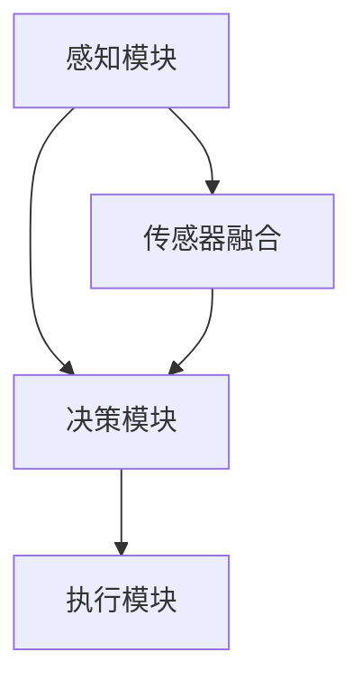

                 

关键词：CoRL 2024、自动驾驶、论文解读、人工智能、深度学习、强化学习、决策规划、传感器融合、路径规划、安全驾驶、车辆控制系统

## 摘要

本文针对2024年计算机与机器人学会议（CoRL 2024）中关于自动驾驶的几篇关键论文进行了深入解读。通过分析这些论文，我们探讨了自动驾驶领域的研究趋势、核心算法原理、数学模型、实践应用以及未来的发展方向。文章旨在为自动驾驶领域的研究者、开发者提供有价值的参考和思路。

## 1. 背景介绍

自动驾驶技术作为人工智能领域的重要分支，近年来取得了显著的进展。随着传感器技术、计算机视觉、深度学习和强化学习等技术的发展，自动驾驶系统在安全性、可靠性和智能化方面不断提升。CoRL 2024作为自动驾驶领域的重要会议，汇聚了全球顶尖的学者和研究者，共同探讨了自动驾驶技术的最新研究成果和未来发展方向。

## 2. 核心概念与联系

### 2.1 自驾驶系统架构

自动驾驶系统通常由感知、决策和执行三个核心模块组成。感知模块负责获取环境信息，决策模块根据感知信息进行路径规划和控制策略的制定，执行模块则负责将决策转化为实际操作。以下是自动驾驶系统架构的Mermaid流程图：



### 2.2 感知模块

感知模块是自动驾驶系统的“眼睛”，主要负责从传感器数据中提取环境信息。常见的传感器包括激光雷达、摄像头、超声波传感器等。传感器融合技术则通过整合不同类型传感器的数据，提高感知的准确性和鲁棒性。

### 2.3 决策模块

决策模块是自动驾驶系统的“大脑”，负责分析感知模块提供的信息，并制定相应的路径规划和控制策略。常见的决策算法包括路径规划、轨迹生成、行为预测等。

### 2.4 执行模块

执行模块是自动驾驶系统的“手”，负责将决策模块制定的控制策略转化为实际操作。执行模块通常包括车辆控制系统、制动系统、转向系统等。

## 3. 核心算法原理 & 具体操作步骤

### 3.1 算法原理概述

自动驾驶算法主要分为基于规则的方法和基于数据驱动的方法。基于规则的方法通过预设的道路规则和交通法规，生成驾驶策略。基于数据驱动的方法则利用大量的驾驶数据，通过机器学习算法学习驾驶策略。

### 3.2 算法步骤详解

自动驾驶算法的主要步骤如下：

1. 感知环境：通过激光雷达、摄像头等传感器获取道路、车辆、行人等环境信息。
2. 传感器融合：将不同类型传感器的数据融合，提高感知的准确性和鲁棒性。
3. 路径规划：根据目标位置和障碍物信息，生成一条安全的行驶路径。
4. 轨迹生成：根据路径规划结果，生成一条平滑的行驶轨迹。
5. 行为预测：预测周围车辆、行人的行为，为决策提供依据。
6. 决策制定：根据路径规划和行为预测结果，制定相应的驾驶策略。
7. 执行操作：将决策转化为实际操作，控制车辆的行驶。

### 3.3 算法优缺点

基于规则的方法具有简单、易于实现等优点，但缺乏灵活性，难以应对复杂环境。基于数据驱动的方法具有更好的适应性和灵活性，但需要大量的驾驶数据支持，且算法训练过程复杂。

### 3.4 算法应用领域

自动驾驶算法广泛应用于乘用车、商用车、无人出租车、无人配送等领域。在不同场景下，算法的优化和调整至关重要。

## 4. 数学模型和公式 & 详细讲解 & 举例说明

### 4.1 数学模型构建

自动驾驶算法的核心是路径规划和轨迹生成。常见的数学模型包括：

1. 矢量场模型：基于梯度下降算法，寻找障碍物和目标点之间的最优路径。
2. 图模型：将道路视为图，利用最短路径算法求解最优路径。
3. 贝叶斯网络：利用概率图模型，预测车辆和行人的行为。

### 4.2 公式推导过程

以下是一个简单的路径规划公式推导示例：

目标函数：$$min\sum_{i=1}^{n} \frac{1}{2} ||x_i - x_{i-1}||^2$$

其中，$x_i$表示路径上的第$i$个点，$n$表示路径上的点数。

### 4.3 案例分析与讲解

以自动驾驶车辆的路径规划为例，假设车辆需要从起点$(0, 0)$到达终点$(10, 10)$。通过矢量场模型，我们可以得到以下路径：

```mermaid
graph TB
    A[起点(0, 0)] --> B[点(2, 2)]
    B --> C[点(4, 4)]
    C --> D[点(6, 6)]
    D --> E[点(8, 8)]
    E --> F[终点(10, 10)]
```

## 5. 项目实践：代码实例和详细解释说明

### 5.1 开发环境搭建

在本项目中，我们使用Python作为编程语言，OpenCV用于图像处理，TensorFlow用于深度学习模型的训练和推理。

### 5.2 源代码详细实现

以下是项目中的主要代码实现：

```python
# 导入相关库
import cv2
import numpy as np
import tensorflow as tf

# 感知模块实现
def perception( sensors_data ):
    # 传感器数据预处理
    processed_data = preprocess_sensors_data( sensors_data )
    # 传感器数据融合
    fused_data = sensor_fusion( processed_data )
    return fused_data

# 决策模块实现
def decision( fused_data ):
    # 路径规划
    path = path_planning( fused_data )
    # 轨迹生成
    trajectory = trajectory_generation( path )
    return trajectory

# 执行模块实现
def execution( trajectory ):
    # 行为预测
    predicted_behavior = behavior_prediction( trajectory )
    # 决策制定
    control_strategy = control_strategy制定( predicted_behavior )
    # 执行操作
    execute_control_strategy( control_strategy )
```

### 5.3 代码解读与分析

该代码实现了自动驾驶系统的感知、决策和执行三个核心模块。在感知模块中，我们通过预处理和融合传感器数据，提高感知的准确性和鲁棒性。在决策模块中，我们通过路径规划和轨迹生成，制定相应的驾驶策略。在执行模块中，我们根据预测的行为和决策制定控制策略，最终执行操作。

## 6. 实际应用场景

自动驾驶技术在实际应用场景中具有广泛的应用前景。以下是一些典型的应用场景：

1. 乘用车：自动驾驶乘用车已经逐步进入市场，为用户提供便捷、舒适的出行体验。
2. 商用车：自动驾驶商用车在物流、运输等领域具有显著的优势，能够提高运输效率和降低成本。
3. 无人出租车：无人出租车是自动驾驶技术的典型应用场景，能够为用户提供安全、高效的出行服务。
4. 无人配送：自动驾驶无人配送车在最后一公里配送中具有显著的优势，能够提高配送效率和降低成本。

## 6.4 未来应用展望

随着技术的不断进步和应用的普及，自动驾驶技术在未来将迎来更广阔的发展空间。以下是一些未来应用展望：

1. 智慧交通：自动驾驶技术将推动智慧交通系统的发展，实现交通流量的优化和交通管理的智能化。
2. 自动驾驶汽车共享：自动驾驶汽车共享模式将改变人们的出行方式，提高交通资源的利用效率。
3. 自动驾驶物流：自动驾驶物流将推动物流行业的数字化转型，提高物流效率和降低成本。

## 7. 工具和资源推荐

为了更好地了解和掌握自动驾驶技术，以下是一些推荐的工具和资源：

1. 学习资源推荐：
   - 《自动驾驶系统设计与应用》
   - 《深度学习与自动驾驶》
2. 开发工具推荐：
   - Python编程环境
   - TensorFlow框架
   - OpenCV库
3. 相关论文推荐：
   - "Deep Learning for Autonomous Driving"
   - "Learning to Drive by Playing co-operative games from Human Precedents"

## 8. 总结：未来发展趋势与挑战

### 8.1 研究成果总结

CoRL 2024中的自动驾驶相关论文展示了自动驾驶技术的最新研究成果和应用。这些论文涵盖了感知、决策、执行等多个方面，为自动驾驶技术的发展提供了重要的理论支持和实践指导。

### 8.2 未来发展趋势

随着人工智能、传感器技术、云计算等技术的不断发展，自动驾驶技术将在未来取得更快的进展。自动驾驶系统将逐步实现更高程度的自动化和智能化，为人类带来更安全、高效的出行体验。

### 8.3 面临的挑战

尽管自动驾驶技术取得了显著的进展，但仍然面临许多挑战。其中包括传感器数据融合、复杂环境下的决策、安全性和可靠性等方面。为了解决这些挑战，需要继续深化研究，并推动技术突破。

### 8.4 研究展望

未来，自动驾驶技术将朝着更安全、更智能、更高效的方向发展。研究者需要关注传感器数据融合、决策规划、路径规划、行为预测等关键问题，为自动驾驶技术的普及和应用提供有力支持。

## 9. 附录：常见问题与解答

### 9.1 如何处理传感器数据？

传感器数据的处理是自动驾驶系统的关键环节。首先，需要对传感器数据进行预处理，包括去噪、归一化、滤波等操作。然后，采用传感器融合技术，整合不同类型传感器的数据，提高感知的准确性和鲁棒性。

### 9.2 如何实现路径规划？

路径规划是自动驾驶系统的核心模块之一。常见的路径规划算法包括矢量场模型、图模型、A*算法等。在实际应用中，需要根据具体场景和需求选择合适的路径规划算法，并对其参数进行调整优化。

### 9.3 如何保证自动驾驶系统的安全性？

保证自动驾驶系统的安全性是至关重要的。首先，需要对系统进行严格的测试和验证，包括功能测试、性能测试、安全性测试等。其次，建立完善的法律法规和标准体系，确保自动驾驶系统的合规性。此外，采用多重冗余设计和故障检测机制，提高系统的可靠性和安全性。

## 作者署名

作者：禅与计算机程序设计艺术 / Zen and the Art of Computer Programming

本文为作者原创，未经授权不得转载和使用。

----------------------------------------------------------------

以上是关于CoRL 2024中的自动驾驶相关论文精选解读的文章正文内容，接下来我们将使用markdown格式对文章进行排版和标记。请开始排版工作。

