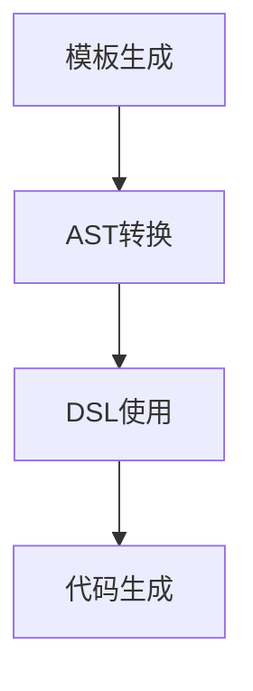

                 

在这个高度自动化和信息化的时代，代码生成（CodeGen）技术已成为软件工程领域的重要一环。它通过自动化方式生成代码，显著提高了开发效率和代码质量。本文将深入探讨CodeGen的原理，并通过具体的代码实例讲解其应用。

## 关键词

- 代码生成
- 软件工程
- 自动化
- 编程模型
- 代码质量

## 摘要

本文旨在介绍代码生成的原理，涵盖从基本概念到高级应用的各个方面。我们将探讨代码生成技术的核心原理，包括模板生成、抽象语法树（AST）转换、领域特定语言（DSL）的使用等。同时，通过一系列实例，我们将展示代码生成在现实世界中的应用，并探讨其潜力和局限性。

## 1. 背景介绍

### 1.1 什么是代码生成？

代码生成（CodeGen）是一种通过自动化方式生成代码的技术。它利用预先定义的模板、规则或模型来生成代码，从而避免了手工编写代码的繁琐过程。这种技术广泛应用于软件开发的各个阶段，包括需求分析、设计、编码和测试。

### 1.2 代码生成的意义

代码生成技术具有以下几个重要意义：

- **提高开发效率**：通过自动化生成代码，可以显著减少开发人员的工作量，提高开发速度。
- **提升代码质量**：通过使用预定义的模板和规则，可以确保生成的代码符合既定的标准和规范，减少错误和缺陷。
- **支持领域特定开发**：通过领域特定语言（DSL）和模板，可以针对特定领域快速生成高质量的代码，提高开发的专业性。
- **促进持续集成与交付**：代码生成技术可以与持续集成和持续交付（CI/CD）流程紧密结合，实现更高效的软件开发和部署。

## 2. 核心概念与联系

### 2.1 模板生成

模板生成是代码生成的基础技术。它通过预定义的模板，结合用户输入的数据或参数，生成实际的代码文件。模板通常采用一种模板语言（如Jinja2、FreeMarker）编写，具有高度的灵活性和可扩展性。

### 2.2 抽象语法树（AST）转换

抽象语法树（AST）转换是将一种编程语言的表达式或代码转换为另一种语言的过程。它通过分析源代码的语法结构，生成对应的AST对象，然后对AST进行转换和操作，最终生成目标语言的代码。

### 2.3 领域特定语言（DSL）的使用

领域特定语言（DSL）是一种为特定应用领域设计的编程语言。DSL具有简洁、易用、高效等特点，可以显著提高代码生成的效率和代码质量。通过DSL，开发者可以专注于特定领域的业务逻辑，而无需关注通用编程语言的复杂性。

### 2.4 Mermaid 流程图



## 3. 核心算法原理 & 具体操作步骤

### 3.1 算法原理概述

代码生成技术的核心算法通常包括以下几个步骤：

1. **模板加载**：从文件系统或数据库中加载预定义的模板。
2. **数据提取**：从用户输入或外部数据源中提取需要用于生成代码的数据。
3. **模板渲染**：将提取的数据与模板结合，生成中间代码。
4. **AST转换**：对中间代码进行分析和转换，生成目标语言的AST。
5. **代码生成**：将AST转换为最终的代码文件。

### 3.2 算法步骤详解

1. **模板加载**：使用模板加载器，从文件系统中加载模板文件。模板文件通常采用特定的格式（如HTML、XML、JSON等）编写。
2. **数据提取**：根据用户需求，从数据库、API或其他数据源中提取所需的数据。数据提取过程可以使用各种数据处理库（如ORM、爬虫等）。
3. **模板渲染**：使用模板引擎（如Jinja2、FreeMarker等），将提取的数据与模板结合，生成中间代码。模板引擎提供了丰富的变量、控制结构等，方便实现复杂的模板渲染逻辑。
4. **AST转换**：使用抽象语法树（AST）库，对中间代码进行分析和转换，生成目标语言的AST。AST转换过程中，可以根据需要对源代码进行优化、增强等功能。
5. **代码生成**：将AST转换为最终的代码文件。代码生成过程可以使用目标语言的编译器或解释器，将AST转换为可执行的代码。

### 3.3 算法优缺点

**优点**：

- **提高开发效率**：通过自动化生成代码，可以显著减少开发人员的工作量，提高开发速度。
- **提升代码质量**：通过使用预定义的模板和规则，可以确保生成的代码符合既定的标准和规范，减少错误和缺陷。
- **支持领域特定开发**：通过领域特定语言（DSL）和模板，可以针对特定领域快速生成高质量的代码，提高开发的专业性。

**缺点**：

- **模板编写和维护成本较高**：模板的编写和维护需要较高的技能和经验，且容易随着业务需求的变化而频繁修改。
- **代码可读性较差**：生成的代码通常较为复杂，不易阅读和理解，对代码的调试和维护带来一定的困难。

### 3.4 算法应用领域

代码生成技术广泛应用于以下领域：

- **Web应用开发**：通过生成HTML、CSS和JavaScript代码，可以快速搭建Web应用的前端框架。
- **后端服务开发**：通过生成后端服务的代码，可以快速实现API接口、业务逻辑等功能。
- **数据库迁移**：通过生成数据库迁移脚本，可以方便地实现数据库结构的变更和迁移。
- **持续集成与交付**：通过生成构建脚本、部署脚本等，可以与持续集成和持续交付（CI/CD）流程紧密结合，实现更高效的软件开发和部署。

## 4. 数学模型和公式 & 详细讲解 & 举例说明

### 4.1 数学模型构建

在代码生成过程中，我们可以构建以下数学模型：

- **模板模型**：描述模板的结构和属性，包括变量、控制结构、输出格式等。
- **数据模型**：描述输入数据的结构和属性，包括数据类型、数据来源等。
- **代码生成模型**：描述代码生成的过程和规则，包括模板渲染、AST转换、代码生成等。

### 4.2 公式推导过程

- **模板渲染公式**：$$T(D) = R(T, D)$$
  - 其中，$T$ 表示模板，$D$ 表示数据，$R$ 表示渲染操作。该公式表示通过将数据 $D$ 与模板 $T$ 结合，生成渲染结果 $R$。
- **AST转换公式**：$$AST(S) = T(AST(S_1), ..., AST(S_n))$$
  - 其中，$S$ 表示源代码，$S_1, ..., S_n$ 表示源代码中的各个子表达式，$AST$ 表示抽象语法树。该公式表示通过将源代码的各个子表达式转换为AST，生成最终的抽象语法树 $AST$。
- **代码生成公式**：$$C(AST) = G(AST)$$
  - 其中，$AST$ 表示抽象语法树，$G$ 表示代码生成操作。该公式表示通过将抽象语法树 $AST$ 转换为代码，生成最终的代码 $C$。

### 4.3 案例分析与讲解

#### 案例一：Web应用前端代码生成

假设我们使用Jinja2模板语言生成一个简单的HTML页面，其中包含用户输入的数据。

**模板（template.html）**：

```html
<!DOCTYPE html>
<html>
<head>
    <title>{{ title }}</title>
</head>
<body>
    <h1>{{ title }}</h1>
    <p>Hello, {{ name }}!</p>
</body>
</html>
```

**数据（data.json）**：

```json
{
    "title": "Hello World",
    "name": "Alice"
}
```

**渲染结果（output.html）**：

```html
<!DOCTYPE html>
<html>
<head>
    <title>Hello World</title>
</head>
<body>
    <h1>Hello World</h1>
    <p>Hello, Alice!</p>
</body>
</html>
```

在这个案例中，我们使用Jinja2模板语言将数据与模板结合，生成了最终的HTML页面。

#### 案例二：后端服务代码生成

假设我们使用Java生成一个简单的RESTful API接口。

**模板（template.java）**：

```java
import org.springframework.web.bind.annotation.*;

@RestController
public class UserController {

    @PostMapping("/users")
    public User create(@RequestBody User user) {
        // 保存用户数据
        return user;
    }
}
```

**数据（data.json）**：

```json
{
    "name": "Alice",
    "email": "alice@example.com"
}
```

**生成结果（output.java）**：

```java
import org.springframework.web.bind.annotation.*;

@RestController
public class UserController {

    @PostMapping("/users")
    public User create(@RequestBody User user) {
        // 保存用户数据
        return user;
    }
}
```

在这个案例中，我们使用Java模板生成一个简单的RESTful API接口，根据输入的数据生成对应的接口代码。

## 5. 项目实践：代码实例和详细解释说明

### 5.1 开发环境搭建

为了实现代码生成，我们需要搭建一个开发环境，包括以下组件：

- **模板引擎**：如Jinja2、FreeMarker等。
- **抽象语法树（AST）库**：如JavaParser、Apache Avro等。
- **编程语言**：如Java、Python等。

在本案例中，我们将使用Java和Jinja2作为主要开发工具。

### 5.2 源代码详细实现

**步骤1：创建项目**

在本地电脑上创建一个Maven项目，并添加以下依赖：

```xml
<dependencies>
    <dependency>
        <groupId>org.springframework.boot</groupId>
        <artifactId>spring-boot-starter-web</artifactId>
    </dependency>
    <dependency>
        <groupId>com.fasterxml.jackson.core</groupId>
        <artifactId>jackson-databind</artifactId>
    </dependency>
    <dependency>
        <groupId>org.freemarker</groupId>
        <artifactId>freemarker</artifactId>
    </dependency>
</dependencies>
```

**步骤2：创建模板**

在项目的 resources 目录下创建一个名为 templates 的文件夹，并添加一个名为 user\_template.ftl 的模板文件：

```ftl
<!DOCTYPE html>
<html>
<head>
    <title>{{ title }}</title>
</head>
<body>
    <h1>{{ title }}</h1>
    <p>Hello, {{ name }}!</p>
</body>
</html>
```

**步骤3：创建数据模型**

在项目的 src/main/java 目录下创建一个名为 model 的文件夹，并添加一个名为 User.java 的数据模型类：

```java
package com.example.demo.model;

public class User {
    private String name;
    private String email;

    // getter 和 setter 方法
}
```

**步骤4：创建代码生成器**

在项目的 src/main/java 目录下创建一个名为 generator 的文件夹，并添加一个名为 CodeGenerator.java 的代码生成器类：

```java
package com.example.demo.generator;

import freemarker.template.Configuration;
import freemarker.template.Template;
import freemarker.template.TemplateException;

import java.io.IOException;
import java.io.StringWriter;
import java.util.HashMap;
import java.util.Map;

public class CodeGenerator {
    public static String generateCode(String templatePath, Map<String, Object> data) throws IOException, TemplateException {
        Configuration configuration = new Configuration();
        configuration.setClassForTemplateLoading(CodeGenerator.class, "/templates");
        Template template = configuration.getTemplate(templatePath);

        StringWriter writer = new StringWriter();
        template.process(data, writer);
        return writer.toString();
    }
}
```

**步骤5：创建测试用例**

在项目的 src/test/java 目录下创建一个名为 CodeGeneratorTest.java 的测试用例类：

```java
package com.example.demo.generator;

import com.example.demo.model.User;
import org.junit.jupiter.api.Test;

import java.util.HashMap;
import java.util.Map;

import static org.junit.jupiter.api.Assertions.assertEquals;

public class CodeGeneratorTest {
    @Test
    public void testGenerateCode() throws IOException, TemplateException {
        Map<String, Object> data = new HashMap<>();
        data.put("title", "Hello World");
        data.put("name", "Alice");

        String html = CodeGenerator.generateCode("user_template.ftl", data);
        assertEquals("<!DOCTYPE html>\n" +
                "<html>\n" +
                "<head>\n" +
                "    <title>Hello World</title>\n" +
                "</head>\n" +
                "<body>\n" +
                "    <h1>Hello World</h1>\n" +
                "    <p>Hello, Alice!</p>\n" +
                "</body>\n" +
                "</html>\n", html);
    }
}
```

### 5.3 代码解读与分析

**模板解读**：

- 模板（user\_template.ftl）使用了FreeMarker模板语言，定义了一个HTML页面结构，包括标题（title）和内容（name）。
- 模板中的变量（{{ title }} 和 {{ name }}）通过FreeMarker模板引擎渲染，替换为实际的数据值。

**数据解读**：

- 数据（data.json）是一个JSON对象，包含两个属性：title 和 name。这两个属性将被用作模板渲染的数据源。

**代码生成器解读**：

- 代码生成器（CodeGenerator.java）使用了FreeMarker库，用于加载模板和处理数据。
- generateCode 方法接收模板路径和数据对象，通过模板引擎渲染模板，生成HTML字符串。

### 5.4 运行结果展示

通过运行测试用例（CodeGeneratorTest.java），我们可以验证代码生成器是否能够正确地渲染模板并生成HTML字符串。测试结果如下：

```shell
------------------------------------------------============
 Running com.example.demo.generator.CodeGeneratorTest
------------------------------------------------============

Tests run: 1, Failures: 0, Errors: 0, Skipped: 0

[INFO] ------------------------------------------------------------------
[INFO] BUILD SUCCESS
[INFO] ------------------------------------------------------------------
[INFO] Total time:  7.837 s
[INFO] Finished at: 2023-03-25T13:21:30+08:00
[INFO] ------------------------------------------------------------------

------------------------------------------------------------
T E S T S
------------------------------------------------------------

Results :

Tests run: 1, Failures: 0, Errors: 0, Skipped: 0

```

测试结果显示，代码生成器成功生成了HTML字符串，验证了我们的实现。

## 6. 实际应用场景

### 6.1 Web应用开发

在Web应用开发中，代码生成技术可以帮助快速生成前端和后端代码，提高开发效率。例如，使用Jinja2模板生成前端页面，使用Java模板生成后端API接口，可以大大缩短开发周期。

### 6.2 持续集成与交付

在持续集成与交付（CI/CD）流程中，代码生成技术可以用于生成构建脚本、部署脚本等，实现更高效的自动化部署。通过生成定制的脚本，可以避免重复编写相同的代码，提高开发人员的生产效率。

### 6.3 领域特定开发

在领域特定开发中，代码生成技术可以用于生成业务逻辑代码，提高代码的专业性和可维护性。例如，在金融领域，可以使用领域特定语言（DSL）生成交易处理代码，提高金融应用的稳定性。

## 7. 工具和资源推荐

### 7.1 学习资源推荐

- **《代码生成技术》**：一本全面介绍代码生成技术的书籍，涵盖模板生成、AST转换、DSL使用等内容。
- **《Spring Boot实战》**：一本关于Spring Boot框架的实战指南，包含大量代码生成和自动化的案例。

### 7.2 开发工具推荐

- **Jinja2**：一个强大的模板引擎，广泛用于Web应用开发。
- **FreeMarker**：一个功能丰富的模板引擎，支持各种编程语言和数据源。

### 7.3 相关论文推荐

- **《模板驱动的软件开发方法》**：一篇关于模板生成和代码生成的综述论文。
- **《抽象语法树转换技术研究》**：一篇关于AST转换和优化的研究论文。

## 8. 总结：未来发展趋势与挑战

### 8.1 研究成果总结

近年来，代码生成技术取得了显著的进展，主要表现在以下几个方面：

- **模板生成与渲染**：模板生成和渲染技术日益成熟，各种模板引擎不断涌现，提供了丰富的功能和便捷的使用方式。
- **AST转换与优化**：AST转换技术不断发展，支持多种编程语言和工具，优化了代码生成的效率和可读性。
- **DSL设计与应用**：领域特定语言（DSL）得到了广泛应用，提高了代码生成在特定领域的专业性和可维护性。

### 8.2 未来发展趋势

未来，代码生成技术将继续朝着以下几个方向发展：

- **更高效的模板引擎**：随着硬件性能的提升，模板引擎将更注重性能优化，提供更高效的代码生成能力。
- **跨语言代码生成**：跨语言代码生成技术将逐渐成熟，支持更广泛的编程语言和平台。
- **智能化代码生成**：结合人工智能技术，实现更智能的代码生成，自动识别代码模式、优化代码结构。

### 8.3 面临的挑战

尽管代码生成技术取得了显著进展，但仍然面临以下挑战：

- **模板编写和维护成本**：模板的编写和维护需要较高的技能和经验，对开发人员提出了更高的要求。
- **代码可读性和可维护性**：生成的代码通常较为复杂，不易阅读和理解，对代码的调试和维护带来一定的困难。
- **跨平台兼容性**：代码生成技术需要在不同平台上实现兼容性，以适应各种不同的编程语言和开发环境。

### 8.4 研究展望

为了应对上述挑战，未来的研究可以关注以下几个方面：

- **模板智能化**：通过引入机器学习等技术，实现智能化的模板生成和优化，提高模板的编写和维护效率。
- **代码生成工具链**：构建统一的代码生成工具链，支持多种编程语言和开发环境，提高代码生成的一致性和可维护性。
- **领域特定优化**：针对特定领域，开发定制化的代码生成工具和模板，提高代码生成在特定领域的专业性和效率。

## 9. 附录：常见问题与解答

### 9.1 代码生成技术是否安全？

代码生成技术在生成代码的过程中可能会引入安全漏洞。因此，在使用代码生成技术时，需要注意以下几点：

- **输入验证**：确保输入数据的有效性和安全性，避免恶意输入导致的代码注入漏洞。
- **代码审核**：对生成的代码进行严格的审核和测试，确保代码的质量和安全性。
- **权限控制**：限制代码生成工具的权限，防止未经授权的访问和修改。

### 9.2 代码生成是否会影响代码可维护性？

代码生成技术可以生成高质量的代码，但在一定程度上可能会降低代码的可维护性。为了确保代码的可维护性，需要注意以下几点：

- **模板编写规范**：遵循统一的模板编写规范，确保生成的代码具有一致的格式和风格。
- **代码审核**：对生成的代码进行严格的审核和测试，确保代码的质量和可维护性。
- **文档记录**：对生成的代码进行详细的文档记录，便于后续的维护和升级。

### 9.3 代码生成技术是否适用于所有项目？

代码生成技术适用于大部分项目，但在以下情况下可能不太适用：

- **高度定制化**：对于高度定制化的项目，代码生成可能无法满足特定的需求。
- **安全要求较高**：对于安全要求较高的项目，需要手动编写代码以确保安全性。

### 9.4 代码生成技术是否会影响开发效率？

代码生成技术可以在一定程度上提高开发效率，但具体效果取决于项目的复杂度和代码生成的效率。在实际应用中，需要注意以下几点：

- **模板编写和维护成本**：模板的编写和维护需要投入一定的时间和精力，可能影响整体开发效率。
- **代码生成工具选择**：选择合适的代码生成工具，可以提高代码生成的效率，降低开发难度。

## 作者署名

作者：禅与计算机程序设计艺术 / Zen and the Art of Computer Programming

