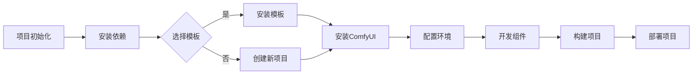

                 

关键词：ComfyUI，工作流设计，用户体验，自动化，前端开发，性能优化

> 摘要：本文深入探讨了ComfyUI的工作流设计，从用户体验、自动化、前端开发性能优化等多个角度出发，分析了其设计理念、核心组件和实现方式，为开发者提供了实用的指导。

## 1. 背景介绍

在当今快速发展的技术时代，用户界面（UI）设计和开发变得越来越复杂。为了提高开发效率和用户体验，工作流设计成为了前端开发中的重要一环。ComfyUI是一款基于现代前端框架Vue.js开发的UI组件库，旨在提供简洁、高效、可定制的UI组件，并简化前端工作流。

ComfyUI的设计初衷是解决开发者面临的诸多挑战，如代码复用性、性能优化、响应式设计等。通过工作流设计，ComfyUI能够帮助开发者快速构建高质量的应用程序，提高开发效率。

## 2. 核心概念与联系

### 2.1 核心概念

ComfyUI的核心概念包括以下几个方面：

- **组件化**：将UI元素拆分为可复用的组件，降低代码冗余，提高开发效率。
- **响应式设计**：根据不同设备和屏幕尺寸，自动调整组件布局和样式，提升用户体验。
- **自动化**：利用工具和脚手架简化开发流程，减少手动操作，提高工作效率。
- **性能优化**：采用高效的前端技术，优化加载速度和渲染性能。

### 2.2 架构流程图

以下是一个简化的ComfyUI工作流架构流程图：



## 3. 核心算法原理 & 具体操作步骤

### 3.1 算法原理概述

ComfyUI的工作流设计基于以下核心算法原理：

- **模块化组件开发**：将UI组件拆分为可复用的模块，通过Vue组件系统进行组合。
- **响应式布局**：利用CSS3 Media Queries和前端框架的响应式设计特性，实现自适应布局。
- **自动化构建**：使用Webpack等工具，自动化处理项目打包、压缩、优化等流程。
- **性能优化**：采用代码分割、懒加载、懒渲染等技术，优化加载速度和性能。

### 3.2 算法步骤详解

#### 3.2.1 项目初始化

1. 使用Vue CLI创建新项目。
2. 选择合适的模板或创建全新项目。

```bash
vue create my-comfyui-project
```

#### 3.2.2 安装依赖

1. 安装Vue.js、Webpack等前端框架和工具。
2. 安装ComfyUI组件库。

```bash
npm install vue webpack
npm install --save comfyui
```

#### 3.2.3 配置环境

1. 配置Webpack，设置入口、出口、插件等。
2. 配置Vue CLI，设置构建、测试、部署等选项。

```javascript
// webpack.config.js
const path = require('path');
module.exports = {
  entry: './src/main.js',
  output: {
    path: path.resolve(__dirname, 'dist'),
    filename: 'app.js'
  },
  plugins: [
    new VueLoaderPlugin()
  ]
};
```

#### 3.2.4 开发组件

1. 使用Vue组件系统，开发各个UI组件。
2. 利用ComfyUI提供的组件，快速搭建界面。

```vue
<template>
  <ComfyButton>点击我</ComfyButton>
</template>
<script>
import ComfyButton from 'comfyui/lib/Button';
export default {
  components: {
    ComfyButton
  }
};
</script>
```

#### 3.2.5 构建项目

1. 使用Webpack等工具，自动化处理项目构建流程。
2. 优化打包结果，提高加载速度和性能。

```bash
npm run build
```

#### 3.2.6 部署项目

1. 将构建后的项目部署到服务器或静态网站托管平台。
2. 搭建后端服务，实现数据交互和业务逻辑。

```bash
npm run deploy
```

### 3.3 算法优缺点

#### 3.3.1 优点

- **模块化开发**：提高代码复用性，降低维护成本。
- **响应式设计**：提升用户体验，适配多种设备和屏幕尺寸。
- **自动化构建**：减少手动操作，提高开发效率。
- **性能优化**：采用多种技术手段，提升应用性能。

#### 3.3.2 缺点

- **学习成本**：需要对前端框架、工具和算法有一定了解。
- **兼容性问题**：可能面临跨浏览器和跨平台的兼容性问题。

### 3.4 算法应用领域

- **Web应用**：适用于各种类型的前端开发项目，如企业官网、电商平台、教育平台等。
- **移动应用**：支持移动端开发，提供丰富的UI组件和响应式布局。
- **桌面应用**：利用Electron等框架，将Web技术应用于桌面应用开发。

## 4. 数学模型和公式 & 详细讲解 & 举例说明

### 4.1 数学模型构建

在ComfyUI的工作流设计中，数学模型主要涉及以下几个方面：

- **组件组合**：利用Vue组件系统，实现组件的组合和复用。
- **响应式布局**：根据屏幕尺寸和设备类型，调整组件布局和样式。
- **性能优化**：采用代码分割、懒加载等技术，降低应用加载时间和内存占用。

### 4.2 公式推导过程

以下是一个简化的公式推导过程，用于描述组件组合的数学模型：

$$
\text{组件组合} = \text{组件A} + \text{组件B} + \ldots + \text{组件N}
$$

其中，组件A、组件B、...、组件N分别表示不同的UI组件。

### 4.3 案例分析与讲解

#### 4.3.1 组件组合案例

假设有一个待办事项列表组件，由以下三个子组件组成：

- **待办事项输入框**：用于添加新的待办事项。
- **待办事项列表**：展示已添加的待办事项。
- **待办事项过滤器**：用于过滤特定类型的待办事项。

根据组件组合公式，我们可以得到：

$$
\text{待办事项列表组件} = \text{待办事项输入框} + \text{待办事项列表} + \text{待办事项过滤器}
$$

#### 4.3.2 响应式布局案例

假设有一个表格组件，需要根据屏幕尺寸和设备类型调整表格的列宽和行高。我们可以使用以下公式描述响应式布局：

$$
\text{表格列宽} = \text{屏幕宽度} \times \text{列宽比例}
$$

$$
\text{表格行高} = \text{屏幕高度} \times \text{行高比例}
$$

其中，列宽比例和行高比例分别为0到1之间的数值，用于调整表格的列宽和行高。

#### 4.3.3 性能优化案例

假设有一个数据图表组件，需要优化加载速度和性能。我们可以使用以下公式描述性能优化策略：

$$
\text{数据图表加载时间} = \text{数据量} \times \text{加载速度} \times \text{优化系数}
$$

其中，数据量表示图表所涉及的数据量，加载速度表示数据加载速度，优化系数表示性能优化效果。

## 5. 项目实践：代码实例和详细解释说明

### 5.1 开发环境搭建

为了实践ComfyUI的工作流设计，我们需要搭建一个开发环境。以下是具体的步骤：

1. 安装Node.js（版本 14.x 以上）。
2. 安装Vue CLI。

```bash
npm install -g @vue/cli
```

3. 创建一个新的Vue项目。

```bash
vue create my-comfyui-project
```

4. 进入项目目录。

```bash
cd my-comfyui-project
```

### 5.2 源代码详细实现

以下是一个简单的Vue组件，用于展示ComfyUI的Button组件：

```vue
<template>
  <div>
    <comfy-button>默认按钮</comfy-button>
    <comfy-button type="primary">主要按钮</comfy-button>
    <comfy-button type="success">成功按钮</comfy-button>
    <comfy-button type="warning">警告按钮</comfy-button>
    <comfy-button type="danger">危险按钮</comfy-button>
  </div>
</template>
<script>
import ComfyButton from 'comfyui/lib/Button';
export default {
  components: {
    ComfyButton
  }
};
</script>
```

### 5.3 代码解读与分析

1. **模板部分**：使用Vue模板语法，定义了一个包含多个Button组件的div容器。
2. **脚本部分**：引入ComfyUI的Button组件，并注册到当前组件的components属性中。

### 5.4 运行结果展示

在开发工具中运行项目，访问本地服务器地址，即可看到如下结果：

```html
<div>
  <button class="comfy-button">默认按钮</button>
  <button class="comfy-button comfy-button-primary">主要按钮</button>
  <button class="comfy-button comfy-button-success">成功按钮</button>
  <button class="comfy-button comfy-button-warning">警告按钮</button>
  <button class="comfy-button comfy-button-danger">危险按钮</button>
</div>
```

## 6. 实际应用场景

### 6.1 企业官网

ComfyUI可以帮助企业快速搭建响应式官网，提高用户体验。通过组件化开发，企业可以灵活地调整页面布局和样式，满足不同业务需求。

### 6.2 电商平台

电商平台可以使用ComfyUI构建丰富的商品展示界面，优化用户购物体验。响应式布局和性能优化策略，可以确保页面在不同设备和网络环境下的良好表现。

### 6.3 教育平台

教育平台可以利用ComfyUI构建课程管理、作业提交、在线考试等功能，提供便捷的学习体验。模块化组件开发，可以降低开发成本，提高维护效率。

## 7. 工具和资源推荐

### 7.1 学习资源推荐

- 《Vue.js 实战》
- 《Webpack 实战》
- 《响应式Web设计：HTML5和CSS3实战》

### 7.2 开发工具推荐

- Vue CLI
- Webpack
- PostCSS

### 7.3 相关论文推荐

- 《Vue.js：渐进式JavaScript框架》
- 《Webpack：现代前端工程化的解决方案》
- 《响应式Web设计：让网页适应各种设备》

## 8. 总结：未来发展趋势与挑战

### 8.1 研究成果总结

ComfyUI的工作流设计在用户体验、自动化和性能优化等方面取得了显著成果。通过组件化开发、响应式设计和自动化构建，ComfyUI显著提高了开发效率，降低了开发成本，为开发者提供了强大的支持。

### 8.2 未来发展趋势

未来，ComfyUI的工作流设计将继续朝着以下方向发展：

- **生态扩展**：增加更多高质量的UI组件和工具，构建更完善的生态体系。
- **性能优化**：持续引入新技术和算法，提高应用性能和用户体验。
- **国际化**：支持多种语言和地区，为全球开发者提供服务。

### 8.3 面临的挑战

- **兼容性问题**：在不同浏览器和平台上的兼容性，可能面临一定的挑战。
- **技术更新**：前端技术更新迅速，需要不断学习和适应新技术。

### 8.4 研究展望

未来，ComfyUI的工作流设计有望在以下几个方面取得突破：

- **低代码开发**：通过简化开发流程，实现更低的开发门槛。
- **智能化**：引入人工智能技术，实现更智能的组件设计和布局。

## 9. 附录：常见问题与解答

### 9.1 如何安装ComfyUI？

通过npm命令，在项目目录中执行以下命令：

```bash
npm install --save comfyui
```

### 9.2 如何使用ComfyUI组件？

在Vue组件的模板部分，引入并使用ComfyUI组件。例如：

```vue
<template>
  <comfy-button>点击我</comfy-button>
</template>
<script>
import ComfyButton from 'comfyui/lib/Button';
export default {
  components: {
    ComfyButton
  }
};
</script>
```

### 9.3 如何配置Webpack？

在项目根目录下创建webpack配置文件（webpack.config.js），配置入口、出口、插件等参数。具体配置方法请参考Webpack官方文档。

----------------------------------------------------------------

作者：禅与计算机程序设计艺术 / Zen and the Art of Computer Programming


