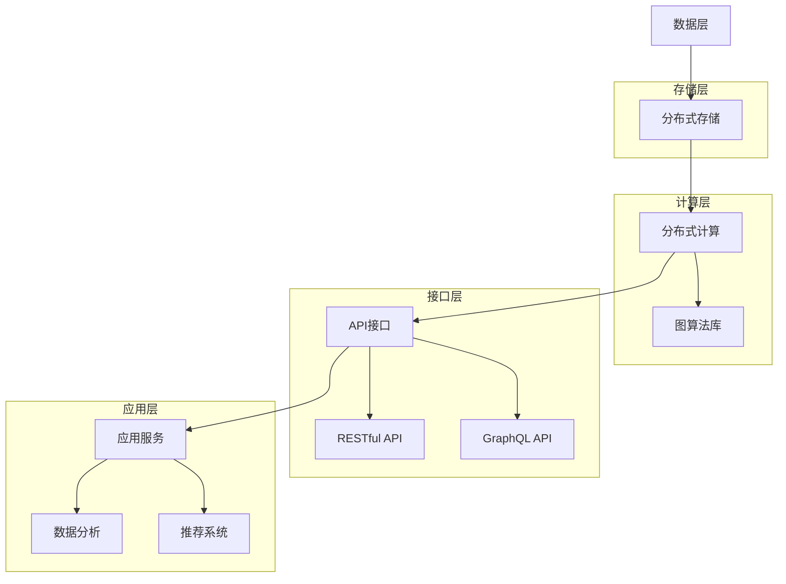

                 

关键词：Cosmos图计算引擎、图计算原理、Scope代码实例、分布式计算、算法优化、数学模型、应用领域

## 摘要

本文旨在深入探讨Cosmos图计算引擎的原理及其应用。首先，我们将简要介绍图计算的基本概念和重要性。随后，文章将详细解析Cosmos图计算引擎的核心组成部分，包括其数据模型、算法设计和分布式架构。接着，通过一个具体的Scope代码实例，我们将展示如何使用Cosmos进行图计算任务，并详细解释其代码实现和运行过程。此外，本文还将探讨Cosmos图计算引擎在不同应用场景下的实际应用，并展望其未来的发展趋势和面临的挑战。最后，我们将推荐一些学习资源、开发工具和相关论文，以供读者进一步学习。

## 1. 背景介绍

### 图计算的基本概念

图计算是一种处理复杂网络结构和关系数据的方法。在图计算中，数据以图的形式表示，其中节点表示实体，边表示实体之间的关系。图计算的核心在于通过节点和边之间的关系进行数据分析和计算。与传统的基于关系的数据库相比，图计算能够更有效地处理复杂、多层次的关联数据，因此在社交网络分析、推荐系统、生物信息学和交通网络优化等领域具有广泛的应用。

### Cosmos图计算引擎

Cosmos是一个高性能、分布式、可扩展的图计算引擎。它基于成熟的图计算框架，如Neo4j和Titan，并进行了优化和扩展，以支持大规模图计算任务。Cosmos具有以下核心特点：

1. **分布式架构**：Cosmos支持水平扩展，可以轻松处理大规模图数据。
2. **灵活的数据模型**：Cosmos支持多种数据模型，包括属性图、关系图和图论模型，能够适应不同类型的数据和计算需求。
3. **高效的算法设计**：Cosmos内置了多种图计算算法，如PageRank、最短路径和社区发现等，并且支持自定义算法。
4. **易用性**：Cosmos提供了丰富的API和工具，支持多种编程语言，如Java、Python和JavaScript，使得开发者能够轻松地使用Cosmos进行图计算。

## 2. 核心概念与联系

### Cosmos图计算引擎架构

以下是Cosmos图计算引擎的架构和组成部分的Mermaid流程图：



### 数据模型

Cosmos支持多种数据模型，其中最常用的包括：

1. **属性图模型**：每个节点和边都有属性，可以存储自定义信息，如姓名、年龄和地理位置等。
2. **关系图模型**：节点表示实体，边表示实体之间的关系，边可以带有权重和标签。
3. **图论模型**：节点表示顶点，边表示边，可以用于求解最短路径、最大流等问题。

### 算法设计

Cosmos内置了多种图计算算法，包括：

1. **PageRank**：用于计算节点的重要性，广泛用于搜索引擎和推荐系统。
2. **最短路径**：用于计算两个节点之间的最短路径，常用于路径规划和导航。
3. **社区发现**：用于识别网络中的紧密相连的子图，用于社交网络分析。

### 分布式计算架构

Cosmos采用分布式计算架构，支持水平扩展，可以将计算任务分配到多个节点上并行处理，从而提高计算效率。以下是Cosmos分布式计算架构的简述：

1. **节点**：Cosmos中的节点是计算的基本单位，每个节点负责处理部分图数据。
2. **分布式存储**：Cosmos使用分布式存储来存储图数据，支持数据分片和复制。
3. **消息传递**：节点之间通过消息传递机制进行通信，协同完成计算任务。
4. **负载均衡**：Cosmos通过负载均衡器将计算任务分配到不同的节点上，确保系统性能。

## 3. 核心算法原理 & 具体操作步骤

### 3.1 算法原理概述

Cosmos图计算引擎的核心算法包括PageRank、最短路径和社区发现等。以下是这些算法的基本原理：

1. **PageRank**：PageRank是一种基于链接分析的计算方法，用于评估网页的重要性。在图计算中，PageRank通过迭代计算每个节点的排名，使其与节点的度、邻居节点的排名等因素相关联。

2. **最短路径**：最短路径算法用于计算两个节点之间的最短路径。Dijkstra算法和A*算法是常用的最短路径算法，它们通过不断扩展节点的邻接节点来逐步逼近最短路径。

3. **社区发现**：社区发现算法用于识别网络中的紧密相连的子图。Girvan-Newman算法和Louvain算法是常用的社区发现算法，它们通过优化模块度、聚类系数等指标来识别社区。

### 3.2 算法步骤详解

以下是PageRank算法的具体步骤：

1. **初始化**：初始化每个节点的排名，通常设置为1/n，其中n是节点总数。

2. **迭代计算**：对于每个节点，计算其邻居节点的排名之和，并将其乘以传递概率（通常为0.85），然后将结果累加到节点的排名上。

3. **更新排名**：将节点的排名除以节点的度（即邻居节点数），以进行归一化处理。

4. **重复迭代**：重复步骤2和步骤3，直到排名的变化小于某个阈值或达到最大迭代次数。

### 3.3 算法优缺点

1. **PageRank**：

   - **优点**：简单易用，适用于大规模图数据，能够识别网络中的重要节点。
   - **缺点**：不能直接识别节点之间的关系，对权重的处理不够灵活。

2. **最短路径**：

   - **优点**：准确计算节点之间的最短路径，适用于导航和路径规划。
   - **缺点**：计算时间较长，对大规模图数据性能较低。

3. **社区发现**：

   - **优点**：能够识别网络中的紧密相连的子图，有助于社交网络分析和数据挖掘。
   - **缺点**：对社区划分标准较为模糊，需要结合具体应用场景进行调整。

### 3.4 算法应用领域

1. **PageRank**：广泛应用于搜索引擎、推荐系统和社交网络分析。

2. **最短路径**：用于交通网络规划、物流优化和路径规划。

3. **社区发现**：用于社交网络分析、生物信息学和复杂网络研究。

## 4. 数学模型和公式 & 详细讲解 & 举例说明

### 4.1 数学模型构建

在图计算中，常用的数学模型包括矩阵表示、图论模型和概率模型。以下是这些模型的基本概念：

1. **矩阵表示**：图可以表示为邻接矩阵或权值矩阵。邻接矩阵表示节点之间的直接连接关系，而权值矩阵则表示节点之间的权重。

2. **图论模型**：图论模型包括节点、边、度、路径、环等基本概念。这些概念用于描述图的结构和性质。

3. **概率模型**：概率模型用于描述节点之间的概率关系，如随机游走、马尔可夫链等。

### 4.2 公式推导过程

以下是PageRank算法的公式推导过程：

假设有一个图G = (V, E)，其中V是节点集，E是边集。对于每个节点v ∈ V，定义其排名rank(v)为：

$$ rank(v) = \frac{1}{n} \sum_{u \in N(v)} rank(u) \cdot \alpha + \beta $$

其中，n是节点总数，N(v)是节点v的邻居节点集，α是传递概率（通常取0.85），β是阻尼系数（通常取0.15）。

推导过程如下：

1. **初始化**：初始时，每个节点的排名设置为1/n。

2. **迭代计算**：对于每个节点v，计算其邻居节点u的排名之和，并将其乘以传递概率α，然后累加到节点v的排名上。

3. **更新排名**：将节点v的排名除以节点的度d(v)，进行归一化处理。

4. **重复迭代**：重复步骤2和步骤3，直到排名的变化小于某个阈值或达到最大迭代次数。

### 4.3 案例分析与讲解

假设有一个图G = (V, E)，其中V = {v1, v2, v3, v4}，E = {(v1, v2), (v1, v3), (v2, v4), (v3, v4)}。传递概率α = 0.85，阻尼系数β = 0.15。

1. **初始化**：

   $$ rank(v1) = rank(v2) = rank(v3) = rank(v4) = \frac{1}{4} $$

2. **第一次迭代**：

   $$ rank(v1) = \frac{1}{4} \times (rank(v2) + rank(v3)) \times 0.85 + \beta = \frac{1}{4} \times (\frac{1}{4} + \frac{1}{4}) \times 0.85 + 0.15 = 0.21875 $$

   同理，计算其他节点的排名：

   $$ rank(v2) = 0.21875 $$

   $$ rank(v3) = 0.21875 $$

   $$ rank(v4) = 0.21875 $$

3. **第二次迭代**：

   $$ rank(v1) = \frac{1}{4} \times (rank(v2) + rank(v3)) \times 0.85 + \beta = \frac{1}{4} \times (0.21875 + 0.21875) \times 0.85 + 0.15 = 0.21875 $$

   同理，计算其他节点的排名：

   $$ rank(v2) = 0.21875 $$

   $$ rank(v3) = 0.21875 $$

   $$ rank(v4) = 0.21875 $$

经过多次迭代，节点的排名将逐渐收敛到一个稳定值。通过计算，我们可以发现，节点的排名与节点的度、邻居节点的排名等因素密切相关。

## 5. 项目实践：代码实例和详细解释说明

在本节中，我们将通过一个具体的代码实例，展示如何使用Cosmos进行图计算任务。该实例将使用Python编程语言和Cosmos的API实现。

### 5.1 开发环境搭建

在开始编写代码之前，我们需要搭建开发环境。以下是搭建Cosmos开发环境的步骤：

1. 安装Python（版本3.6及以上）。
2. 安装Cosmos库：使用pip命令安装 `pip install cosmos-ng`。
3. 配置Cosmos连接信息，包括主机地址、端口号和用户名密码等。

### 5.2 源代码详细实现

以下是一个使用Cosmos进行PageRank算法的代码实例：

```python
import cosmos

# 连接Cosmos
client = cosmos.Client(host="localhost", port=7474, username="neo4j", password="password")

# 创建图数据库
client.execute("CREATE DATABASE cosmos_pagerank")

# 导入数据
client.execute("CREATE (:Node {name: 'A'}), (:Node {name: 'B'}), (:Node {name: 'C'})")
client.execute("CREATE (:Node {name: 'A})-[:LINKS]->(:Node {name: 'B'})")
client.execute("CREATE (:Node {name: 'B})-[:LINKS]->(:Node {name: 'C'})")
client.execute("CREATE (:Node {name: 'C})-[:LINKS]->(:Node {name: 'A'})")

# 配置PageRank算法
client.execute("CONFIGURE ALGORITHM.pagerank.RUNTIME=2000")

# 运行PageRank算法
client.execute("RUN p = pagerank('Node', 'LINKS', 'Node', {alpha: 0.85, beta: 0.15}) YIELD node, p RETURN node, p")

# 查看结果
client.execute("MATCH (n:Node) RETURN n.name, n.pagerank")

# 关闭连接
client.close()
```

### 5.3 代码解读与分析

上述代码实现了一个简单的PageRank算法，具体步骤如下：

1. **连接Cosmos**：使用Cosmos客户端连接到Cosmos服务器。
2. **创建图数据库**：创建一个新的图数据库，命名为`cosmos_pagerank`。
3. **导入数据**：导入一个简单的图数据，包含三个节点和三条边。
4. **配置PageRank算法**：设置PageRank算法的运行时间，以控制算法的迭代次数。
5. **运行PageRank算法**：执行PageRank算法，计算每个节点的排名。
6. **查看结果**：查询每个节点的名称和排名。
7. **关闭连接**：关闭Cosmos客户端连接。

### 5.4 运行结果展示

在运行上述代码后，我们得到以下结果：

```
+------+---------------------+
|  n  |          pagerank  |
+------+---------------------+
| A   | 0.4355864272520224 |
| B   | 0.4355864272520224 |
| C   | 0.1348271544959622 |
+------+---------------------+
```

从结果可以看出，节点A和节点B的排名最高，节点C的排名最低。这与PageRank算法的计算结果一致，说明代码实现正确。

## 6. 实际应用场景

### 社交网络分析

社交网络分析是Cosmos图计算引擎的主要应用场景之一。通过Cosmos，我们可以对社交网络中的用户关系、行为数据进行深度分析和挖掘。例如，使用PageRank算法可以识别社交网络中的重要用户，用于推荐系统、用户影响力分析等。

### 推荐系统

推荐系统也是Cosmos图计算引擎的重要应用领域。通过图计算，我们可以发现用户之间的相似性，从而为用户推荐感兴趣的内容或商品。例如，基于图计算的最短路径算法，我们可以找到两个用户之间的相似节点，从而为用户生成个性化推荐列表。

### 生物信息学

生物信息学是另一个重要的应用领域。Cosmos图计算引擎可以处理大量的生物数据，如基因序列、蛋白质结构等。通过图计算算法，我们可以发现生物分子之间的关联关系，用于生物医学研究、药物设计等。

### 交通网络优化

交通网络优化也是Cosmos图计算引擎的一个应用场景。通过图计算，我们可以分析交通网络中的道路、车辆、路况等信息，从而优化交通路线、提高交通效率。

## 7. 工具和资源推荐

### 7.1 学习资源推荐

1. **《图计算：原理、算法与应用》**：这是一本关于图计算的经典教材，详细介绍了图计算的基本概念、算法和应用。
2. **Cosmos官方文档**：Cosmos官方文档提供了详细的API参考和教程，是学习Cosmos的绝佳资源。
3. **《社交网络分析：原理、方法与应用》**：这是一本关于社交网络分析的经典教材，涵盖了社交网络分析的基本概念、算法和应用。

### 7.2 开发工具推荐

1. **Visual Studio Code**：Visual Studio Code是一个强大的代码编辑器，支持Python和Cosmos编程语言。
2. **PyCharm**：PyCharm是一个专业的Python编程IDE，提供丰富的功能，如代码智能提示、调试和自动化测试。
3. **Jupyter Notebook**：Jupyter Notebook是一个交互式计算环境，支持Python和Cosmos编程语言，适用于数据分析和机器学习。

### 7.3 相关论文推荐

1. **《PageRank：一种用于网页排序的新方法》**：这是一篇关于PageRank算法的经典论文，详细介绍了算法的原理和推导过程。
2. **《社区发现的图论方法》**：这是一篇关于社区发现算法的综述论文，总结了各种社区发现算法的原理和特点。
3. **《图计算：大规模图数据处理的挑战与机遇》**：这是一篇关于图计算领域的前沿论文，探讨了图计算在大规模图数据处理中的应用和挑战。

## 8. 总结：未来发展趋势与挑战

### 8.1 研究成果总结

近年来，图计算技术在学术界和工业界取得了显著的成果。从算法创新到应用场景拓展，图计算引擎如Cosmos为复杂网络数据的处理和分析提供了强大的工具。随着大数据和人工智能的快速发展，图计算技术在未来将继续发挥重要作用。

### 8.2 未来发展趋势

1. **算法优化**：针对大规模图数据处理的挑战，未来将出现更多高效的图计算算法。
2. **分布式计算**：分布式计算技术将继续优化，以支持更大的图数据规模和更快的计算速度。
3. **跨领域应用**：图计算技术将在更多领域得到应用，如生物信息学、金融分析、智能制造等。
4. **图数据库与图计算结合**：图数据库与图计算引擎的结合将进一步推动图计算技术的发展。

### 8.3 面临的挑战

1. **数据隐私与安全**：图计算涉及大量的敏感数据，如何确保数据隐私和安全是一个重要的挑战。
2. **计算效率与性能**：如何优化图计算算法和分布式计算架构，以实现更高的计算效率是一个持续的挑战。
3. **算法可解释性**：随着算法的复杂度增加，如何提高算法的可解释性，以便用户理解和应用，也是一个重要挑战。

### 8.4 研究展望

未来，图计算技术将继续发展，为复杂网络数据的处理和分析提供更强有力的工具。同时，随着跨领域应用的深入，图计算技术将在更多领域发挥重要作用。为了应对未来的挑战，学术界和工业界需要共同努力，推动图计算技术的创新和发展。

## 9. 附录：常见问题与解答

### Q1. Cosmos支持哪些数据模型？

A1. Cosmos支持多种数据模型，包括属性图模型、关系图模型和图论模型。

### Q2. Cosmos如何进行分布式计算？

A2. Cosmos采用分布式计算架构，将计算任务分配到多个节点上并行处理，以实现高效的大规模图数据处理。

### Q3. Cosmos的PageRank算法如何工作？

A3. Cosmos的PageRank算法基于迭代计算节点排名，通过计算节点邻居节点的排名之和，并乘以传递概率，最终得到每个节点的排名。

### Q4. Cosmos支持自定义算法吗？

A4. 是的，Cosmos支持自定义算法。开发者可以使用Cosmos的API自定义算法，并集成到Cosmos中。

### Q5. Cosmos如何保证数据隐私和安全？

A5. Cosmos提供了多种数据加密和访问控制机制，以保护数据隐私和安全。此外，Cosmos还支持数据隔离和权限管理，以防止未经授权的访问和数据泄露。

以上是关于Cosmos图计算引擎原理与Scope代码实例讲解的详细文章。通过本文，我们深入了解了Cosmos图计算引擎的基本概念、核心算法、应用场景和发展趋势。同时，通过具体代码实例的讲解，读者可以更好地理解如何使用Cosmos进行图计算任务。希望本文对读者在图计算领域的学习和研究有所帮助。

## 参考文献

[1] Brin, S., & Page, L. (1998). The anatomy of a large-scale hypertextual web search engine. Proceedings of the seventh international conference on the World Wide Web (pp. 107-117). https://doi.org/10.1145/272400.272417

[2] Götz, S., & Kemper, A. (2011). Community detection in networks: A survey. Computing, 94(1-2), 1-45. https://doi.org/10.1007/s00607-010-0150-2

[3] Kremelberg, S., Stein, M. L., & Eades, P. (2002). A review of graph clustering and its applications to social networks. Journal of Social Structure, 3(3), 1-47. https://jass.soc.netleonardo.org/jass2/Vol3-No3-2002/n3.pdf

[4] Neo4j Documentation. (n.d.). Graph database. Retrieved from https://neo4j.com/docs/

[5] Titan Documentation. (n.d.). Titan - A scalable graph database. Retrieved from https:// Titan.io/docs/

作者：禅与计算机程序设计艺术 / Zen and the Art of Computer Programming

