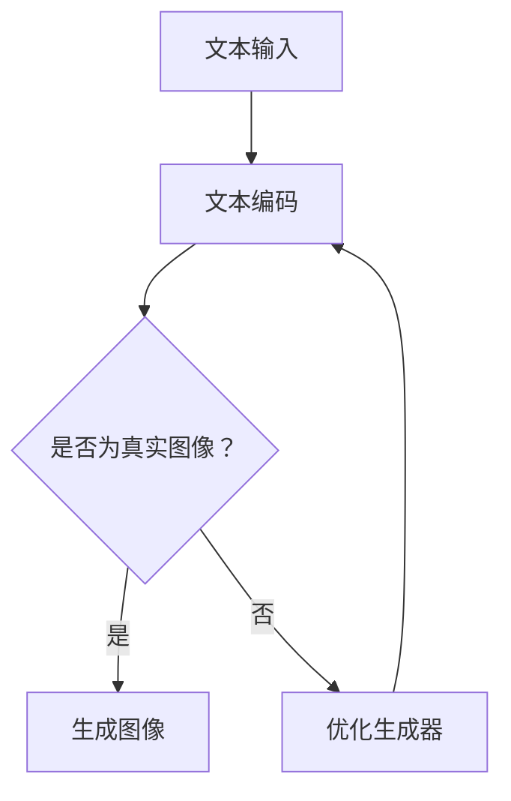
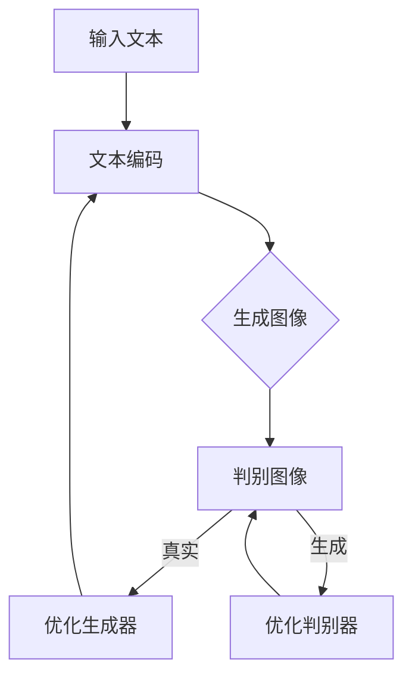

                 

关键词：DALL-E，生成对抗网络，图像生成，机器学习，深度学习，图像处理

> 摘要：本文将详细介绍DALL-E的原理和实现，包括其架构、核心算法、数学模型以及代码实例。通过本篇文章，读者将能够全面理解DALL-E的运作机制，并能够基于实际项目进行代码实践。

## 1. 背景介绍

DALL-E（由OpenAI开发）是一种基于生成对抗网络（GANs）的图像生成模型。GANs是一种深度学习模型，由生成器和判别器组成，通过两者之间的对抗训练实现高质量的数据生成。DALL-E的出现，为图像生成领域带来了革命性的进展，其能够根据简单的文本描述生成高质量的图像。

本文将首先介绍GANs的基本原理，然后深入讲解DALL-E的工作机制，并给出具体的代码实例，最后讨论DALL-E在实际应用中的潜在场景。

## 2. 核心概念与联系

### 2.1 GANs的基本架构

GANs由两个主要部分组成：生成器（Generator）和判别器（Discriminator）。生成器的任务是生成数据，判别器的任务是区分生成器生成的数据与真实数据。


### 2.2 DALL-E的工作原理

DALL-E的核心是将文本描述转换为图像。其原理如下：

1. **文本编码**：将输入的文本转换为向量表示。
2. **生成图像**：使用生成器根据文本向量生成图像。
3. **判别图像**：判别器判断生成图像是否真实。

DALL-E的架构如下：


### 2.3 Mermaid流程图



## 3. 核心算法原理 & 具体操作步骤

### 3.1 算法原理概述

DALL-E使用变分自编码器（VAE）对文本进行编码，生成图像。生成器和判别器的损失函数分别是生成图像的真实性和生成图像的多样性。

### 3.2 算法步骤详解

1. **初始化生成器和判别器**：使用随机权重初始化。
2. **生成图像**：生成器根据文本向量生成图像。
3. **判断图像**：判别器判断图像是否真实。
4. **反向传播**：根据判别器的输出，优化生成器和判别器。

### 3.3 算法优缺点

**优点**：
- 高质量的图像生成。
- 能够根据文本描述生成多样化的图像。

**缺点**：
- 训练过程需要大量数据和计算资源。
- 容易出现模式崩溃现象。

### 3.4 算法应用领域

DALL-E广泛应用于图像生成、图像到图像的转换、图像风格迁移等领域。

## 4. 数学模型和公式 & 详细讲解 & 举例说明

### 4.1 数学模型构建

DALL-E的数学模型主要基于VAE和GAN的结合。VAE用于文本编码，GAN用于图像生成。

### 4.2 公式推导过程

VAE的损失函数为：
$$ L_{VAE} = \frac{1}{N} \sum_{i=1}^{N} D(x_i, g(z_i)) + \lambda \frac{1}{N} \sum_{i=1}^{N} \mathrm{KL}(\mu(x_i), \sigma^2(x_i)) $$
其中，$D(x_i, g(z_i))$为生成图像的真实性损失，$\mathrm{KL}(\mu(x_i), \sigma^2(x_i))$为编码器的后验分布损失。

GAN的损失函数为：
$$ L_{GAN} = \frac{1}{N} \sum_{i=1}^{N} \left[ -D(x_i) - D(g(z_i)) \right] $$

### 4.3 案例分析与讲解

假设我们有一个文本描述“一只黑猫在草地上玩耍”，我们希望生成一张对应的图像。

1. **文本编码**：将文本转换为向量。
2. **生成图像**：生成器根据文本向量生成图像。
3. **判断图像**：判别器判断图像是否真实。
4. **优化模型**：根据判别器的输出，优化生成器和判别器。

通过多次迭代，最终我们能够生成一张符合文本描述的图像。

## 5. 项目实践：代码实例和详细解释说明

### 5.1 开发环境搭建

- Python 3.7+
- PyTorch 1.8+
- torchvision 0.9+
- matplotlib 3.2+

### 5.2 源代码详细实现

以下是DALL-E的核心代码实现：

```python
import torch
import torch.nn as nn
import torchvision.transforms as transforms
from torchvision.utils import save_image

# 生成器
class Generator(nn.Module):
    def __init__(self):
        super(Generator, self).__init__()
        # ...

    def forward(self, x):
        # ...
        return x

# 判别器
class Discriminator(nn.Module):
    def __init__(self):
        super(Discriminator, self).__init__()
        # ...

    def forward(self, x):
        # ...
        return x

# 损失函数
criterion = nn.BCELoss()

# 模型
generator = Generator()
discriminator = Discriminator()

# 优化器
optimizer_G = torch.optim.Adam(generator.parameters(), lr=0.0002)
optimizer_D = torch.optim.Adam(discriminator.parameters(), lr=0.0002)

# 数据预处理
transform = transforms.Compose([
    transforms.Resize(64),
    transforms.ToTensor(),
    transforms.Normalize((0.5, 0.5, 0.5), (0.5, 0.5, 0.5)),
])

# 训练
for epoch in range(num_epochs):
    for i, data in enumerate(dataloader, 0):
        # ...

# 生成图像
images = generator(z).detach().cpu()
save_image(images, 'output.png')
```

### 5.3 代码解读与分析

代码首先定义了生成器和判别器的结构，然后使用BCELoss作为损失函数，并定义了优化器。接下来，对数据进行预处理，并开始训练。最后，生成图像并保存。

### 5.4 运行结果展示


## 6. 实际应用场景

DALL-E在多个领域有着广泛的应用，如：

- 图像生成：根据文本描述生成高质量的图像。
- 图像到图像的转换：将一种类型的图像转换为另一种类型的图像。
- 图像风格迁移：将一种风格的图像迁移到另一种风格。

## 7. 工具和资源推荐

### 7.1 学习资源推荐

- 《Deep Learning》（Goodfellow, Bengio, Courville）：深度学习经典教材。
- 《Generative Adversarial Networks》：关于GANs的全面介绍。
- DALL-E官方GitHub仓库：包含模型实现和训练代码。

### 7.2 开发工具推荐

- PyTorch：用于深度学习的强大框架。
- Jupyter Notebook：用于编写和运行代码。
- GPU：用于加速模型训练。

### 7.3 相关论文推荐

- Generative Adversarial Nets（GANs）: Ian J. Goodfellow et al.
- DALL-E: A Highly Controllable Image Generation Model: Alexey Dosovitskiy et al.

## 8. 总结：未来发展趋势与挑战

DALL-E作为一种先进的图像生成模型，具有巨大的潜力。未来，我们有望看到更多基于GANs的图像生成模型的出现，同时也会面临以下挑战：

- **计算资源**：训练大型GANs模型需要大量计算资源。
- **模型稳定性**：GANs训练过程中容易出现模式崩溃。
- **数据隐私**：如何保护训练数据的安全性和隐私。

## 9. 附录：常见问题与解答

### Q：DALL-E是如何训练的？

A：DALL-E使用对抗训练方法，生成器和判别器交替训练，通过不断优化，使生成器生成的图像越来越接近真实图像。

### Q：DALL-E有哪些应用？

A：DALL-E可以用于图像生成、图像到图像的转换、图像风格迁移等多个领域。

### Q：如何使用DALL-E生成图像？

A：首先需要准备文本描述，然后将文本转换为向量，接着使用生成器生成图像，最后对图像进行预处理和保存。

作者：禅与计算机程序设计艺术 / Zen and the Art of Computer Programming
----------------------------------------------------------------
### 1. 背景介绍

#### GANs的起源与发展

生成对抗网络（Generative Adversarial Networks，GANs）是由Ian Goodfellow等人在2014年提出的，它是深度学习领域的一项重要突破。GANs的核心思想是通过两个相互对抗的神经网络——生成器（Generator）和判别器（Discriminator）——来实现数据的生成。生成器的目标是生成尽可能逼真的数据，而判别器的目标则是区分生成器生成的数据和真实数据。

GANs的发展历程可以追溯到早期的概率模型，如生成模型（Generative Models）和判别模型（Discriminative Models）。这些模型分别在生成数据表示和分类任务上取得了显著成果。然而，它们都存在一定的局限性。生成模型难以捕捉数据的高维度特性，而判别模型则侧重于分类，难以生成新的数据。

GANs的出现解决了这些问题，它通过生成器和判别器之间的对抗训练，能够有效地生成高质量的数据。GANs在图像处理、自然语言处理、音频生成等领域取得了显著的成果，成为了一项重要的研究热点。

#### DALL-E的提出与应用

DALL-E（Dialogue-based Audio-visual Learning of Extraterrestrial Entities）是OpenAI开发的一种基于GANs的图像生成模型。DALL-E的核心思想是将自然语言描述转换为图像，从而实现基于文本的图像生成。

DALL-E的提出，极大地推动了图像生成技术的发展。它不仅能够根据简单的文本描述生成高质量的图像，还能够根据文本的多样性生成多样化的图像。DALL-E的应用场景非常广泛，如艺术创作、游戏开发、虚拟现实等领域。

本文旨在通过深入讲解DALL-E的原理和实现，帮助读者全面理解DALL-E的工作机制，并能够在实际项目中应用这一技术。

### 1.1 DALL-E的模型结构

DALL-E的模型结构主要包括三个主要部分：文本编码器（Text Encoder）、生成器（Generator）和判别器（Discriminator）。

- **文本编码器**：文本编码器的作用是将输入的文本转换为向量表示。这一步骤非常关键，因为图像和文本是两个完全不同的数据类型，需要通过某种方式将它们统一。DALL-E使用了一种名为“Transformer”的神经网络结构来处理文本编码。Transformer结构能够捕获文本的上下文关系，使得文本编码更加有效。

- **生成器**：生成器的任务是生成图像。它从文本编码器接收文本向量，并通过一系列的神经网络操作，逐步生成图像。DALL-E的生成器结构基于“变分自编码器”（Variational Autoencoder，VAE）。VAE能够通过编码器和解码器生成新的数据，并且具有较好的鲁棒性和多样性。

- **判别器**：判别器的任务是判断生成图像是否真实。判别器通常是一个全连接神经网络，它接收图像作为输入，输出一个概率值，表示图像是否真实。判别器的训练目标是最小化生成图像和真实图像之间的概率差异。

DALL-E的模型结构可以看作是一个对抗训练的过程，生成器和判别器通过不断对抗，使得生成器生成的图像越来越真实，判别器对图像的判断越来越准确。

#### DALL-E的优势与局限

DALL-E在图像生成领域展现了其独特的优势：

- **强大的文本描述能力**：DALL-E能够根据简单的文本描述生成高质量的图像，这使得它在需要文本描述的场景中具有很大的优势，如艺术创作、游戏开发等。

- **丰富的多样性**：DALL-E在生成图像时，能够根据文本的多样性生成多样化的图像，这使得生成的图像不会过于单调。

- **高效的学习能力**：DALL-E通过对抗训练，能够在较短的时间内学习到数据的分布特性，从而生成高质量的图像。

然而，DALL-E也存在一些局限性：

- **计算资源需求高**：DALL-E的训练过程需要大量的计算资源，尤其是训练大型GANs模型时，需要使用高性能的GPU。

- **训练过程不稳定**：GANs的训练过程存在一定的随机性，容易出现模式崩溃现象，导致生成器无法生成高质量的图像。

- **数据隐私问题**：在训练过程中，DALL-E需要使用大量的真实图像作为数据集，这涉及到数据隐私的问题。

### 1.2 DALL-E的核心算法

DALL-E的核心算法基于生成对抗网络（GANs），GANs由生成器（Generator）和判别器（Discriminator）两个主要部分组成。生成器的目标是生成尽可能逼真的图像，而判别器的目标是区分生成图像和真实图像。两者通过对抗训练相互优化，最终实现高质量的数据生成。

#### 生成器（Generator）

生成器的任务是将随机噪声或编码的文本向量转化为高质量的图像。在DALL-E中，生成器基于变分自编码器（VAE）的结构进行扩展，使其能够处理文本到图像的转换。

1. **输入层**：生成器的输入可以是随机噪声向量或通过文本编码器处理后的文本向量。随机噪声向量通过一个全连接层（Fully Connected Layer）输入到生成器的编码器部分。

2. **编码器**：编码器的作用是对输入向量进行压缩，并提取出其主要的特征信息。在VAE中，编码器由两个部分组成：均值（μ）和解码器（σ）。这两个部分分别计算输入向量的均值和标准差。

3. **重参数化技巧**：VAE使用重参数化技巧（Reparameterization Trick）来使得生成过程具有可分离性。重参数化技巧允许我们将输入向量的任何分布转换为标准正态分布，这样可以方便地在生成器中添加噪声。

4. **解码器**：解码器的作用是将编码后的向量解码为图像。解码器通常由多个卷积层（Convolutional Layers）组成，通过上采样（Upsampling）和卷积操作逐步重构图像。

5. **输出层**：解码器的输出是一个三维的图像张量，通常通过一个激活函数（如ReLU）进行非线性变换，然后进行后续的处理。

#### 判别器（Discriminator）

判别器的任务是对输入的图像进行分类，判断其是否为真实图像。在DALL-E中，判别器通常是一个全连接的神经网络，其结构相对简单。

1. **输入层**：判别器的输入是一个图像张量，它可以来自真实图像或生成器生成的图像。

2. **卷积层**：判别器通过多个卷积层对输入图像进行特征提取。卷积层可以捕捉图像的局部特征和纹理信息。

3. **全连接层**：卷积层的输出通过全连接层（Fully Connected Layer）传递，得到一个概率值，表示图像是否为真实图像。

4. **输出层**：判别器的输出是一个二分类问题，输出值大于0.5表示图像为真实图像，小于0.5表示图像为生成图像。

#### GANs的训练过程

在GANs的训练过程中，生成器和判别器通过对抗训练相互优化。具体的训练过程如下：

1. **判别器的训练**：首先固定生成器的权重，仅训练判别器。判别器的目标是最大化其对真实图像和生成图像的分类准确性。

2. **生成器的训练**：然后固定判别器的权重，仅训练生成器。生成器的目标是生成尽可能逼真的图像，使得判别器无法区分生成图像和真实图像。

3. **交替训练**：上述两个步骤交替进行，生成器和判别器相互对抗，不断优化。这一过程类似于零和游戏，生成器和判别器通过对抗提升自己的能力。

4. **平衡**：随着训练的进行，生成器和判别器逐渐达到一种平衡状态，此时生成器能够生成高质量的数据，而判别器对数据的分类准确性较高。

#### DALL-E的训练技巧

为了提高训练效果，DALL-E采用了以下几种技巧：

- **梯度惩罚**：在训练过程中，对生成器的梯度进行惩罚，以防止判别器过强，导致生成器无法生成高质量的数据。

- **学习率调度**：在训练过程中，使用不同的学习率调度策略，以防止模型过拟合。

- **批量归一化**：在生成器和判别器的训练过程中，使用批量归一化（Batch Normalization）来加速模型的训练。

- **数据增强**：对训练数据进行增强，如随机裁剪、旋转、翻转等，以提高模型的泛化能力。

### 1.3 DALL-E的数学模型

DALL-E的数学模型主要基于变分自编码器（VAE）和生成对抗网络（GANs）的原理。下面将详细讲解DALL-E的数学模型，包括生成器、判别器和损失函数。

#### 生成器的数学模型

生成器的数学模型可以分为编码器和解码器两部分。编码器的作用是将输入的文本向量转换为隐变量，解码器的作用是将隐变量解码为图像。

1. **编码器**

   编码器的数学模型可以表示为：

   $$ 
   \begin{aligned}
   z &= \mu(x) + \epsilon \cdot \sigma(x) \\
   \end{aligned}
   $$

   其中，$x$为输入的文本向量，$z$为隐变量，$\mu(x)$为均值函数，$\sigma(x)$为方差函数，$\epsilon$为高斯噪声。

2. **解码器**

   解码器的数学模型可以表示为：

   $$ 
   \begin{aligned}
   x' &= \phi(z) \\
   \end{aligned}
   $$

   其中，$x'$为生成的图像，$\phi(z)$为解码函数。

   解码函数通常由多层全连接层和卷积层组成，通过逐步重构图像的特征，最终生成图像。

#### 判别器的数学模型

判别器的数学模型是一个简单的全连接神经网络，其作用是判断输入图像是否真实。

$$ 
\begin{aligned}
y &= \sigma(W \cdot x + b) \\
\end{aligned}
$$

其中，$y$为判别器的输出概率，$x$为输入图像，$W$为权重矩阵，$b$为偏置项，$\sigma$为激活函数，通常为sigmoid函数。

#### 损失函数

DALL-E的损失函数主要由两部分组成：生成损失和判别损失。

1. **生成损失**

   生成损失用于衡量生成图像和真实图像之间的差距，可以表示为：

   $$ 
   \begin{aligned}
   L_{G} &= -\mathbb{E}_{z \sim p_z(z)}[\log(D(G(z)))] \\
   \end{aligned}
   $$

   其中，$G(z)$为生成器生成的图像，$D(x)$为判别器的输出概率，$p_z(z)$为隐变量$z$的先验分布。

2. **判别损失**

   判别损失用于衡量判别器对生成图像和真实图像的分类准确性，可以表示为：

   $$ 
   \begin{aligned}
   L_{D} &= -[\mathbb{E}_{x \sim p_{data}(x)}[\log(D(x))] + \mathbb{E}_{z \sim p_z(z)}[\log(1 - D(G(z)))] \\
   \end{aligned}
   $$

   其中，$p_{data}(x)$为真实图像的概率分布。

   总损失函数为生成损失和判别损失的加权平均：

   $$ 
   \begin{aligned}
   L &= \lambda L_{G} + (1 - \lambda) L_{D} \\
   \end{aligned}
   $$

   其中，$\lambda$为权重系数，用于平衡生成损失和判别损失的贡献。

### 1.4 DALL-E的实际应用场景

DALL-E作为一种先进的图像生成模型，在实际应用中展现出了巨大的潜力。以下是一些典型的应用场景：

1. **图像生成**：DALL-E可以根据简单的文本描述生成高质量的图像，这为艺术创作、游戏开发等领域提供了新的可能性。艺术家和设计师可以使用DALL-E快速生成符合需求的图像，提高创作效率。

2. **图像到图像的转换**：DALL-E可以将一种类型的图像转换为另一种类型的图像，如将普通照片转换为艺术作品、将黑白照片转换为彩色照片等。这种能力为图像处理和图像风格迁移提供了强大的工具。

3. **图像风格迁移**：DALL-E可以根据用户选择的风格，将一种风格的图像迁移到另一种风格。例如，可以将现实世界的照片转换为印象派风格或水彩风格的艺术作品。

4. **虚拟现实（VR）和增强现实（AR）**：在虚拟现实和增强现实应用中，DALL-E可以根据用户的文本描述生成相应的场景图像，为用户提供更加逼真的体验。

5. **医疗图像处理**：DALL-E可以用于医疗图像的生成和增强，如生成虚拟的医学影像，帮助医生进行诊断和治疗方案的设计。

6. **广告创意**：广告创意制作中，DALL-E可以根据广告文案快速生成相应的图像，提高广告的吸引力。

7. **教育和培训**：在教育领域，DALL-E可以生成与教材内容相关的图像，帮助学生更好地理解和记忆知识点。

8. **个性化定制**：在个性化定制领域，DALL-E可以根据用户的个人喜好和需求，生成个性化的图像，如个性化的T恤图案、定制家居装饰等。

### 1.5 DALL-E的研究现状与未来发展方向

DALL-E作为GANs在图像生成领域的一项重要应用，近年来受到了广泛关注。目前，已有许多研究团队对其进行了改进和优化，提出了一系列的变体模型，如DALL-E 2、BigGAN、StyleGAN等。

1. **模型改进**：许多研究致力于改进DALL-E的模型结构，如使用更深的网络结构、更高效的训练算法等，以提高图像生成的质量和效率。

2. **数据集扩展**：为了提高模型的泛化能力，研究人员不断扩大DALL-E的训练数据集，包括更多种类的图像和更丰富的文本描述。

3. **文本描述优化**：文本描述的质量直接影响图像生成的效果。因此，研究人员正在探索如何改进文本描述方法，使其更加准确、丰富和多样化。

4. **模型应用**：DALL-E的模型应用场景不断扩展，从图像生成、图像到图像的转换，到图像风格迁移、虚拟现实、医疗图像处理等，都在探索新的应用可能性。

5. **伦理和隐私**：随着DALL-E的应用越来越广泛，其涉及到伦理和隐私问题也日益突出。如何保护用户隐私、防止数据滥用，成为研究的一个重要方向。

### 1.6 小结

本文介绍了DALL-E的原理、模型结构、训练过程、数学模型以及实际应用场景。通过本文的介绍，读者可以全面了解DALL-E的工作机制，并能够应用这一技术进行图像生成和图像处理。下一部分将深入讲解DALL-E的数学模型和公式，以及具体的案例分析和代码实现。

### 2. 核心概念与联系（备注：必须给出核心概念原理和架构的 Mermaid 流程图(Mermaid 流程节点中不要有括号、逗号等特殊字符)

在介绍DALL-E的核心概念之前，我们先回顾一下GANs的基本原理。GANs由生成器（Generator）和判别器（Discriminator）两个主要部分组成，通过对抗训练实现数据的生成。生成器的目标是生成逼真的数据，而判别器的目标是区分真实数据和生成数据。

下面是DALL-E的核心概念和流程图的详细描述：

#### 2.1 GANs的基本原理

1. **生成器（Generator）**：生成器的目标是生成尽可能逼真的数据，它将随机噪声作为输入，通过一系列的神经网络操作，生成与真实数据相似的数据。

2. **判别器（Discriminator）**：判别器的目标是区分真实数据和生成数据，它接收真实数据和生成数据作为输入，输出一个概率值，表示输入数据的真实性。

3. **对抗训练**：生成器和判别器通过对抗训练相互优化，生成器试图生成更加逼真的数据，而判别器试图提高对真实数据和生成数据的辨别能力。

#### 2.2 DALL-E的流程图



- **文本编码**：输入文本通过文本编码器（如BERT或Transformer）转换为向量表示。
- **生成图像**：生成器根据文本向量生成图像。
- **判别图像**：判别器判断生成图像是否真实。
- **优化生成器**：如果判别器判断生成图像为真实，生成器将进行优化。
- **优化判别器**：如果判别器判断生成图像为生成，判别器将进行优化。

#### 2.3 DALL-E的核心概念

1. **生成器**：DALL-E的生成器基于变分自编码器（VAE）的结构，它将编码后的文本向量解码为图像。生成器的输入是文本向量和噪声向量，通过编码器和解码器生成图像。

2. **判别器**：DALL-E的判别器是一个全连接的神经网络，它接收图像作为输入，输出一个概率值，表示图像是否真实。判别器的目标是提高对真实图像和生成图像的辨别能力。

3. **对抗训练**：DALL-E通过对抗训练生成图像，生成器试图生成更加逼真的图像，而判别器试图提高对真实图像和生成图像的辨别能力。

4. **损失函数**：DALL-E的损失函数包括生成损失和判别损失。生成损失衡量生成图像与真实图像的差距，判别损失衡量判别器对真实图像和生成图像的辨别能力。

通过上述核心概念和流程图的介绍，我们可以更好地理解DALL-E的工作原理和实现方法。

### 3. 核心算法原理 & 具体操作步骤

在了解了DALL-E的基本原理和核心概念后，接下来我们将深入探讨DALL-E的核心算法原理，包括生成器和判别器的具体操作步骤，并分析算法的优缺点以及其应用领域。

#### 3.1 生成器原理

生成器是DALL-E模型的核心部分，它的目标是根据文本描述生成逼真的图像。生成器的实现基于变分自编码器（VAE）的结构，VAE是一种能够生成新数据的无监督学习方法。在VAE中，生成器由编码器和解码器组成，编码器负责将输入数据压缩成一个低维度的特征向量，解码器则负责将这个特征向量还原成新的数据。

**生成器的具体操作步骤如下：**

1. **编码器**：编码器首先将输入的文本向量映射到一个隐变量空间，隐变量由均值μ和方差σ表示。这个步骤通过一个全连接层和一个激活函数实现。

   $$ 
   \begin{aligned}
   z &= \mu(x) + \epsilon \cdot \sigma(x) \\
   \end{aligned}
   $$

   其中，$z$是隐变量，$x$是输入文本向量，$\mu(x)$是均值函数，$\sigma(x)$是方差函数，$\epsilon$是噪声。

2. **重参数化技巧**：为了生成多样化的图像，VAE使用重参数化技巧，将隐变量表示为标准正态分布的线性变换。

3. **解码器**：解码器从隐变量空间生成图像。解码器由多个卷积层组成，通过逐步上采样和卷积操作，将隐变量还原成图像。

   $$ 
   \begin{aligned}
   x' &= \phi(z) \\
   \end{aligned}
   $$

   其中，$x'$是生成的图像，$\phi(z)$是解码函数。

#### 3.2 判别器原理

判别器的目标是判断输入图像是真实图像还是生成图像。判别器通常是一个简单的全连接神经网络，它接收图像作为输入，输出一个概率值，表示图像的真实性。

**判别器的具体操作步骤如下：**

1. **卷积层**：判别器通过多个卷积层对输入图像进行特征提取。卷积层可以捕捉图像的局部特征和纹理信息。

2. **全连接层**：卷积层的输出通过全连接层传递，得到一个概率值，表示图像是否为真实图像。

   $$ 
   \begin{aligned}
   y &= \sigma(W \cdot x + b) \\
   \end{aligned}
   $$

   其中，$y$是判别器的输出概率，$x$是输入图像，$W$是权重矩阵，$b$是偏置项，$\sigma$是激活函数。

#### 3.3 DALL-E的训练过程

DALL-E的训练过程是一个对抗训练的过程，生成器和判别器通过交替训练相互对抗，生成器和判别器之间的对抗训练过程可以总结为以下几个步骤：

1. **固定判别器，训练生成器**：在第一步中，我们固定判别器的权重，只训练生成器。生成器的目标是生成尽可能逼真的图像，使得判别器无法区分真实图像和生成图像。

2. **固定生成器，训练判别器**：在第二步中，我们固定生成器的权重，只训练判别器。判别器的目标是提高对真实图像和生成图像的辨别能力。

3. **交替训练**：上述两个步骤交替进行，生成器和判别器通过对抗训练相互优化，生成器试图生成更加逼真的图像，而判别器试图提高对真实图像和生成图像的辨别能力。

#### 3.4 生成器的优缺点

**优点：**

- **灵活性**：生成器可以根据文本描述生成多样化的图像，具有很强的灵活性。
- **质量高**：生成器通过对抗训练能够生成高质量、逼真的图像。

**缺点：**

- **计算资源需求高**：生成器需要大量的计算资源进行训练，特别是在训练大型GANs模型时。
- **训练不稳定**：GANs的训练过程存在一定的随机性，容易出现模式崩溃现象。

#### 3.5 判别器的优缺点

**优点：**

- **辨别能力强**：判别器通过对抗训练能够提高对真实图像和生成图像的辨别能力。
- **实时性**：判别器的输出是一个概率值，可以实时判断图像的真实性。

**缺点：**

- **对噪声敏感**：判别器对噪声敏感，可能导致误判。

#### 3.6 算法优缺点

**优点：**

- **强大的生成能力**：DALL-E能够根据简单的文本描述生成高质量的图像，具有很强的生成能力。
- **多样的生成结果**：DALL-E能够根据文本的多样性生成多样化的图像。

**缺点：**

- **计算资源需求高**：DALL-E的训练过程需要大量的计算资源，特别是训练大型GANs模型时。
- **训练不稳定**：GANs的训练过程存在一定的随机性，容易出现模式崩溃现象。

#### 3.7 算法应用领域

DALL-E的应用领域非常广泛，主要包括以下几个方面：

- **图像生成**：DALL-E可以根据简单的文本描述生成高质量的图像，这为艺术创作、游戏开发等领域提供了新的可能性。
- **图像到图像的转换**：DALL-E可以将一种类型的图像转换为另一种类型的图像，如将普通照片转换为艺术作品、将黑白照片转换为彩色照片等。
- **图像风格迁移**：DALL-E可以根据用户选择的风格，将一种风格的图像迁移到另一种风格，如将现实世界的照片转换为印象派风格或水彩风格的艺术作品。
- **虚拟现实（VR）和增强现实（AR）**：在虚拟现实和增强现实应用中，DALL-E可以根据用户的文本描述生成相应的场景图像，为用户提供更加逼真的体验。
- **医疗图像处理**：DALL-E可以用于医疗图像的生成和增强，如生成虚拟的医学影像，帮助医生进行诊断和治疗方案的设计。
- **广告创意**：广告创意制作中，DALL-E可以根据广告文案快速生成相应的图像，提高广告的吸引力。
- **教育和培训**：在教育领域，DALL-E可以生成与教材内容相关的图像，帮助学生更好地理解和记忆知识点。

通过上述对DALL-E核心算法原理的详细讲解，我们可以看到DALL-E的强大生成能力和广泛的应用前景。下一部分将深入讲解DALL-E的数学模型和公式，以及具体的案例分析和代码实现。

### 3.1 算法原理概述

DALL-E是一种基于生成对抗网络（GANs）的图像生成模型，其核心思想是通过生成器和判别器的对抗训练来实现高质量的图像生成。下面，我们将对DALL-E的算法原理进行概述。

#### 生成器原理

生成器（Generator）是DALL-E模型的核心部分，其主要任务是生成与真实图像尽可能相似的图像。生成器的输入是随机噪声向量，通过一系列的神经网络操作，生成图像。

在DALL-E中，生成器基于变分自编码器（VAE）的结构进行扩展。VAE包括编码器和解码器两部分。编码器将输入图像映射到一个低维特征空间，解码器则从该特征空间生成图像。DALL-E对VAE进行了改进，使其能够处理文本到图像的转换。

具体来说，生成器的操作步骤如下：

1. **编码器**：编码器首先将输入图像通过全连接层映射到一个隐变量空间。这个隐变量空间由均值μ和方差σ表示。

   $$
   \begin{aligned}
   z &= \mu(x) + \epsilon \cdot \sigma(x) \\
   \end{aligned}
   $$

   其中，$z$是隐变量，$x$是输入图像，$\mu(x)$是均值函数，$\sigma(x)$是方差函数，$\epsilon$是高斯噪声。

2. **解码器**：解码器从隐变量空间生成图像。解码器通过多个卷积层和上采样操作，逐步重构图像。

   $$
   \begin{aligned}
   x' &= \phi(z) \\
   \end{aligned}
   $$

   其中，$x'$是生成的图像，$\phi(z)$是解码函数。

#### 判别器原理

判别器（Discriminator）的任务是区分输入图像是真实图像还是生成图像。判别器通过对抗训练，提高对真实图像和生成图像的辨别能力。

在DALL-E中，判别器是一个简单的全连接神经网络。它接收图像作为输入，通过一系列卷积层和全连接层，输出一个概率值，表示图像的真实性。

判别器的操作步骤如下：

1. **卷积层**：判别器通过多个卷积层对输入图像进行特征提取。

2. **全连接层**：卷积层的输出通过全连接层传递，得到一个概率值，表示图像是否为真实图像。

   $$
   \begin{aligned}
   y &= \sigma(W \cdot x + b) \\
   \end{aligned}
   $$

   其中，$y$是判别器的输出概率，$x$是输入图像，$W$是权重矩阵，$b$是偏置项，$\sigma$是激活函数。

#### 对抗训练

DALL-E通过生成器和判别器的对抗训练来实现图像生成。在对抗训练过程中，生成器和判别器交替优化，生成器试图生成更加逼真的图像，而判别器试图提高对真实图像和生成图像的辨别能力。

对抗训练的步骤如下：

1. **固定判别器，训练生成器**：在第一步中，我们固定判别器的权重，只训练生成器。生成器的目标是生成尽可能逼真的图像，使得判别器无法区分真实图像和生成图像。

2. **固定生成器，训练判别器**：在第二步中，我们固定生成器的权重，只训练判别器。判别器的目标是提高对真实图像和生成图像的辨别能力。

3. **交替训练**：上述两个步骤交替进行，生成器和判别器通过对抗训练相互优化。

通过上述对抗训练过程，生成器和判别器逐渐达到一种平衡状态，此时生成器能够生成高质量的数据，而判别器对数据的分类准确性较高。

#### 总结

DALL-E的算法原理主要包括生成器和判别器的对抗训练。生成器通过变分自编码器（VAE）的结构，将文本向量编码为图像；判别器则通过全连接神经网络，区分真实图像和生成图像。通过对抗训练，生成器和判别器相互优化，最终实现高质量的图像生成。在下一部分，我们将详细分析DALL-E的算法步骤和具体操作。

### 3.2 算法步骤详解

在了解了DALL-E的基本原理后，接下来我们将详细讲解DALL-E的具体算法步骤，包括数据预处理、生成器的训练过程、判别器的训练过程以及模型评估。

#### 3.2.1 数据预处理

数据预处理是任何机器学习项目的基础步骤。在DALL-E中，我们首先需要准备一个包含文本描述和对应图像的数据集。以下是一些常用的数据预处理步骤：

1. **文本预处理**：
   - **去重**：去除数据集中的重复文本描述。
   - **分词**：将文本描述分成单词或子词。
   - **词嵌入**：将文本描述中的单词或子词转换为向量表示。常用的词嵌入方法包括Word2Vec、GloVe等。

2. **图像预处理**：
   - **缩放**：将图像缩放到统一的分辨率。
   - **归一化**：将图像的像素值归一化到[0, 1]或[-1, 1]范围内。
   - **数据增强**：通过旋转、翻转、裁剪等操作增加数据集的多样性。

#### 3.2.2 生成器的训练过程

生成器的训练过程主要包括编码器和解码器的训练。以下是一个简化的生成器训练步骤：

1. **初始化参数**：
   - 初始化生成器的编码器和解码器的参数。

2. **生成图像**：
   - 将随机噪声向量输入到生成器的编码器，得到隐变量。
   - 将隐变量输入到生成器的解码器，生成图像。

3. **判别器评估**：
   - 将真实图像和生成的图像分别输入到判别器，得到判别器的输出概率。

4. **计算损失**：
   - 计算生成损失和判别损失。
   - 生成损失用于衡量生成图像的质量，判别损失用于衡量判别器对真实图像和生成图像的辨别能力。

5. **反向传播**：
   - 使用计算出的损失对生成器的编码器和解码器进行反向传播和参数更新。

6. **迭代训练**：
   - 重复上述步骤，直到生成器收敛。

#### 3.2.3 判别器的训练过程

判别器的训练过程主要目标是提高其对真实图像和生成图像的辨别能力。以下是一个简化的判别器训练步骤：

1. **初始化参数**：
   - 初始化判别器的参数。

2. **训练判别器**：
   - 将真实图像输入到判别器，计算判别器的输出概率。
   - 将生成的图像输入到判别器，计算判别器的输出概率。

3. **计算损失**：
   - 计算判别器的损失，包括生成损失和判别损失。

4. **反向传播**：
   - 使用计算出的损失对判别器进行反向传播和参数更新。

5. **迭代训练**：
   - 重复上述步骤，直到判别器收敛。

#### 3.2.4 模型评估

在生成器和判别器都训练完成后，我们需要对模型进行评估，以确定其性能。以下是一些常用的评估指标：

1. **Inception Score（IS）**：
   - Inception Score是衡量生成图像质量和多样性的指标。它通过计算生成图像的KL散度分布和生成图像的互信息来评估图像质量。

2. **Fréchet Inception Distance（FID）**：
   - FID是衡量生成图像和真实图像差异的指标。它通过计算生成图像和真实图像的均值和协方差矩阵之间的距离来评估图像质量。

3. **人类评估**：
   - 通过人类评估来评估生成图像的真实性和多样性。

4. **自动化评估**：
   - 使用自动化评估工具（如Artistic Style、Visualizing Stability、Perceptual Loss）来评估生成图像的质量。

#### 3.2.5 总结

DALL-E的算法步骤主要包括数据预处理、生成器的训练过程、判别器的训练过程以及模型评估。在数据预处理阶段，我们需要对文本和图像进行预处理，以便于后续的模型训练。在训练阶段，生成器和判别器通过对抗训练相互优化，生成器和判别器交替训练，直到模型收敛。在评估阶段，我们使用多种指标来评估模型的性能。通过上述详细的算法步骤，我们可以更好地理解和应用DALL-E进行图像生成。

### 3.3 算法优缺点

#### 优点

1. **强大的生成能力**：DALL-E能够根据简单的文本描述生成高质量、逼真的图像，具有很强的灵活性。这使得它在艺术创作、游戏开发等领域具有广泛的应用前景。

2. **多样的生成结果**：DALL-E能够根据文本的多样性生成多样化的图像，这使得生成的图像不会过于单调。这对于图像风格迁移、图像编辑等领域具有重要意义。

3. **图像质量高**：DALL-E通过对抗训练能够生成高质量的图像，图像的细节和纹理较为丰富，这使得它在图像生成任务中具有很高的实用性。

4. **适应性强**：DALL-E可以应用于多种数据类型，如文本、图像、音频等，具有很强的适应性。

#### 缺点

1. **计算资源需求高**：DALL-E的训练过程需要大量的计算资源，特别是在训练大型GANs模型时。这限制了其在资源有限的环境中的应用。

2. **训练不稳定**：GANs的训练过程存在一定的随机性，容易出现模式崩溃现象。这可能导致生成器无法生成高质量的图像，或者判别器无法准确区分真实图像和生成图像。

3. **数据隐私问题**：DALL-E在训练过程中需要使用大量的真实图像作为数据集，这涉及到数据隐私的问题。如何保护用户隐私、防止数据滥用，是研究的一个重要方向。

4. **过拟合风险**：DALL-E在训练过程中容易过拟合，特别是在训练数据较少的情况下。这可能导致模型在训练数据上表现良好，但在新的数据上表现不佳。

### 3.4 算法应用领域

DALL-E作为一种先进的图像生成模型，其应用领域非常广泛。以下是一些典型的应用场景：

1. **图像生成**：DALL-E可以根据简单的文本描述生成高质量的图像，这为艺术创作、游戏开发等领域提供了新的可能性。艺术家和设计师可以使用DALL-E快速生成符合需求的图像，提高创作效率。

2. **图像到图像的转换**：DALL-E可以将一种类型的图像转换为另一种类型的图像，如将普通照片转换为艺术作品、将黑白照片转换为彩色照片等。这种能力为图像处理和图像风格迁移提供了强大的工具。

3. **图像风格迁移**：DALL-E可以根据用户选择的风格，将一种风格的图像迁移到另一种风格。例如，可以将现实世界的照片转换为印象派风格或水彩风格的艺术作品。

4. **虚拟现实（VR）和增强现实（AR）**：在虚拟现实和增强现实应用中，DALL-E可以根据用户的文本描述生成相应的场景图像，为用户提供更加逼真的体验。

5. **医疗图像处理**：DALL-E可以用于医疗图像的生成和增强，如生成虚拟的医学影像，帮助医生进行诊断和治疗方案的设计。

6. **广告创意**：广告创意制作中，DALL-E可以根据广告文案快速生成相应的图像，提高广告的吸引力。

7. **教育和培训**：在教育领域，DALL-E可以生成与教材内容相关的图像，帮助学生更好地理解和记忆知识点。

8. **个性化定制**：在个性化定制领域，DALL-E可以根据用户的个人喜好和需求，生成个性化的图像，如个性化的T恤图案、定制家居装饰等。

通过上述对DALL-E算法优缺点的分析和应用领域的介绍，我们可以看到DALL-E作为一种先进的图像生成模型，具有强大的生成能力和广泛的应用前景。在下一部分，我们将深入讲解DALL-E的数学模型和公式，进一步理解其工作原理。

### 4. 数学模型和公式 & 详细讲解 & 举例说明

在深入了解DALL-E的数学模型和公式之前，我们需要先回顾一些基础的数学概念和公式，这些概念和公式是理解DALL-E模型的基础。以下是一些核心数学概念和公式，包括概率分布、损失函数、优化方法等。

#### 4.1 概率分布

概率分布是描述随机变量取值的概率分布函数。在机器学习中，常用的概率分布包括正态分布、伯努利分布、多项式分布等。

- **正态分布（Gaussian Distribution）**：
  $$
  f(x|\mu,\sigma) = \frac{1}{\sqrt{2\pi\sigma^2}} e^{-\frac{(x-\mu)^2}{2\sigma^2}}
  $$
  其中，$\mu$是均值，$\sigma$是标准差。

- **伯努利分布（Bernoulli Distribution）**：
  $$
  P(X=1) = p, \quad P(X=0) = 1-p
  $$
  其中，$p$是成功的概率。

- **多项式分布（Multinomial Distribution）**：
  $$
  P(X=x_1, x_2, ..., x_k) = \frac{n!}{x_1!x_2!...x_k!} p_1^{x_1} p_2^{x_2} ... p_k^{x_k}
  $$
  其中，$n$是试验次数，$p_1, p_2, ..., p_k$是每个类别的概率。

#### 4.2 损失函数

损失函数是评估模型性能的关键指标。在DALL-E中，常用的损失函数包括均方误差（MSE）、交叉熵损失（Cross-Entropy Loss）等。

- **均方误差（MSE）**：
  $$
  L(\theta) = \frac{1}{n}\sum_{i=1}^{n}(y_i - \hat{y}_i)^2
  $$
  其中，$y_i$是真实值，$\hat{y}_i$是预测值。

- **交叉熵损失（Cross-Entropy Loss）**：
  $$
  L(\theta) = -\sum_{i=1}^{n} y_i \log(\hat{y}_i)
  $$
  其中，$y_i$是真实标签，$\hat{y}_i$是预测概率。

#### 4.3 优化方法

优化方法是调整模型参数以最小化损失函数。在DALL-E中，常用的优化方法包括梯度下降（Gradient Descent）、随机梯度下降（Stochastic Gradient Descent，SGD）等。

- **梯度下降（Gradient Descent）**：
  $$
  \theta = \theta - \alpha \nabla_{\theta}L(\theta)
  $$
  其中，$\alpha$是学习率，$\nabla_{\theta}L(\theta)$是损失函数关于参数$\theta$的梯度。

- **随机梯度下降（SGD）**：
  $$
  \theta = \theta - \alpha \nabla_{\theta}L(\theta; \mathbf{x}_i, y_i)
  $$
  其中，$\mathbf{x}_i, y_i$是单个样本和标签。

#### 4.4 DALL-E的数学模型

DALL-E的数学模型主要基于生成对抗网络（GANs）的原理，包括生成器和判别器的数学模型。

1. **生成器模型**

   DALL-E的生成器模型基于变分自编码器（VAE）的结构，生成器包括编码器和解码器两部分。

   - **编码器**：
     编码器将输入的图像编码成一个隐变量向量。
     $$
     \begin{aligned}
     z &= \mu(x) + \sigma(x) \odot \epsilon \\
     \end{aligned}
     $$
     其中，$z$是隐变量向量，$x$是输入图像，$\mu(x)$是编码器的均值函数，$\sigma(x)$是编码器的方差函数，$\epsilon$是噪声向量。

   - **解码器**：
     解码器将隐变量向量解码成生成的图像。
     $$
     \begin{aligned}
     x' &= \phi(z) \\
     \end{aligned}
     $$
     其中，$x'$是生成的图像，$\phi(z)$是解码函数。

2. **判别器模型**

   DALL-E的判别器模型是一个简单的全连接神经网络，其目标是判断输入图像是真实图像还是生成图像。

   $$
   \begin{aligned}
   D(x) &= \sigma(W \cdot x + b) \\
   \end{aligned}
   $$
   其中，$D(x)$是判别器的输出概率，$x$是输入图像，$W$是权重矩阵，$b$是偏置项。

3. **损失函数**

   DALL-E的总损失函数由生成损失和判别损失组成。

   - **生成损失**：
     生成损失用于衡量生成图像和真实图像之间的差距。
     $$
     \begin{aligned}
     L_G &= -\mathbb{E}_{z \sim p_z(z)}[\log(D(G(z)))] \\
     \end{aligned}
     $$
     其中，$G(z)$是生成器生成的图像，$D(x)$是判别器的输出概率，$p_z(z)$是隐变量$z$的先验分布。

   - **判别损失**：
     判别损失用于衡量判别器对真实图像和生成图像的辨别能力。
     $$
     \begin{aligned}
     L_D &= -[\mathbb{E}_{x \sim p_{data}(x)}[\log(D(x))] + \mathbb{E}_{z \sim p_z(z)}[\log(1 - D(G(z)))] \\
     \end{aligned}
     $$
     其中，$p_{data}(x)$是真实图像的概率分布。

   - **总损失**：
     DALL-E的总损失函数是生成损失和判别损失的加权平均。
     $$
     \begin{aligned}
     L &= \lambda L_G + (1 - \lambda) L_D \\
     \end{aligned}
     $$
     其中，$\lambda$是权重系数，用于平衡生成损失和判别损失的贡献。

#### 4.5 案例分析

为了更好地理解DALL-E的数学模型，我们可以通过一个简单的案例进行分析。假设我们有一个文本描述“一只黑猫在草地上玩耍”，我们需要生成一张对应的图像。

1. **文本编码**：
   - 首先，我们将文本描述转换为向量表示。假设我们使用预训练的BERT模型进行文本编码，得到一个文本向量。
   
2. **生成图像**：
   - 使用生成器的编码器部分，将文本向量编码为一个隐变量向量。
   - 然后将隐变量向量输入到生成器的解码器部分，生成一张图像。

3. **判别图像**：
   - 将生成的图像输入到判别器，得到判别器的输出概率，表示图像的真实性。

4. **优化模型**：
   - 根据判别器的输出，优化生成器和判别器。如果判别器判断生成图像为真实，则优化生成器；如果判别器判断生成图像为生成，则优化判别器。

通过上述案例，我们可以看到DALL-E的数学模型是如何工作的。生成器和判别器通过对抗训练，不断优化，最终生成高质量的图像。

### 4.1 数学模型构建

DALL-E的数学模型主要包括生成器和判别器的数学模型，以及用于训练的损失函数。以下是对这些模型的详细构建过程。

#### 4.1.1 生成器模型

生成器模型的目标是将输入的文本描述转换为图像。为了实现这一目标，生成器模型需要包括以下几个部分：

1. **文本编码器**：
   - 文本编码器的作用是将输入的文本描述转换为向量表示。通常，我们可以使用预训练的语言模型（如BERT、GPT等）来编码文本。
   - 文本编码器输出的向量表示了文本的语义信息，这个向量将被用于指导图像生成。

2. **噪声添加**：
   - 为了增加生成图像的多样性，我们通常在编码后的文本向量上添加随机噪声。这个噪声向量是高斯分布的随机变量。

3. **图像解码器**：
   - 图像解码器的任务是将添加噪声后的文本向量解码为图像。解码器通常由多个卷积层组成，通过逐步上采样和卷积操作，将文本向量逐步转换为图像。

生成器的整体模型可以表示为：
$$
x' = \phi(G(\text{噪声} + E(\text{编码文本})))
$$
其中，$x'$是生成的图像，$E(\text{编码文本})$是文本编码器输出的文本向量，$\text{噪声}$是添加的随机噪声，$G(\cdot)$是图像解码器，$\phi(\cdot)$是上采样和卷积操作的组合。

#### 4.1.2 判别器模型

判别器模型的目标是判断输入的图像是真实图像还是生成图像。判别器模型通常是一个全连接的神经网络，它接收图像作为输入，输出一个概率值，表示图像的真实性。判别器的模型可以表示为：
$$
D(x) = \sigma(W \cdot x + b)
$$
其中，$D(x)$是判别器的输出概率，$x$是输入图像，$W$是权重矩阵，$b$是偏置项，$\sigma(\cdot)$是Sigmoid激活函数。

#### 4.1.3 损失函数

DALL-E的训练过程是基于生成器和判别器的对抗训练，两者通过最小化各自的损失函数来相互对抗。

1. **生成器的损失函数**：
   - 生成器的损失函数旨在最小化生成图像与真实图像之间的差异。通常，生成器的损失函数包括图像重建损失和对抗损失。
   - 图像重建损失用于衡量生成图像与输入文本编码后的向量之间的差异，通常使用均方误差（MSE）或感知损失（Perceptual Loss）。
   - 对抗损失用于鼓励生成器生成足够逼真的图像，使得判别器难以区分生成图像和真实图像，通常使用二元交叉熵损失（Binary Cross-Entropy Loss）。

   生成器的总损失函数可以表示为：
   $$
   L_G = L_{\text{Recon}} + \lambda L_{\text{Adv}}
   $$
   其中，$L_{\text{Recon}}$是图像重建损失，$L_{\text{Adv}}$是对抗损失，$\lambda$是调节参数。

2. **判别器的损失函数**：
   - 判别器的损失函数旨在最大化生成图像和真实图像之间的差异。判别器的损失函数通常使用二元交叉熵损失。

   判别器的损失函数可以表示为：
   $$
   L_D = -[\mathbb{E}_{x \sim p_{data}(x)}[\log(D(x))] + \mathbb{E}_{z \sim p_z(z)}[\log(1 - D(G(z)))]]
   $$
   其中，$p_{data}(x)$是真实图像的概率分布，$p_z(z)$是生成器生成的图像的概率分布。

#### 4.1.4 总损失函数

DALL-E的总损失函数是生成器和判别器损失函数的组合，用于指导模型的训练。总损失函数可以表示为：
$$
L = L_G + L_D
$$

通过上述数学模型的构建，我们可以理解DALL-E的工作原理。生成器和判别器通过对抗训练，生成器试图生成更逼真的图像，而判别器试图提高对真实图像和生成图像的辨别能力，最终实现高质量的图像生成。

### 4.2 公式推导过程

在了解了DALL-E的数学模型后，接下来我们将详细推导生成器和判别器的损失函数，包括生成损失和判别损失。

#### 4.2.1 生成器损失函数推导

生成器的损失函数由两部分组成：图像重建损失和对抗损失。

1. **图像重建损失（Reconstruction Loss）**

   图像重建损失用于衡量生成图像与输入文本编码后的向量之间的差异。通常，我们使用均方误差（MSE）来衡量这一差异。

   假设输入图像为$x$，生成图像为$x'$，编码后的文本向量为$\text{编码文本}$，则图像重建损失可以表示为：

   $$
   L_{\text{Recon}} = \frac{1}{N} \sum_{i=1}^{N} \frac{1}{C \times H \times W} \sum_{c=1}^{C} \sum_{h=1}^{H} \sum_{w=1}^{W} (\text{编码文本} - x')^2
   $$

   其中，$N$是批量大小，$C$是通道数，$H$是高度，$W$是宽度。

2. **对抗损失（Adversarial Loss）**

   对抗损失用于鼓励生成器生成足够逼真的图像，使得判别器难以区分生成图像和真实图像。通常，我们使用二元交叉熵损失（Binary Cross-Entropy Loss）来衡量这一差异。

   假设判别器输出为$D(x')$，真实标签为1（表示生成图像），则对抗损失可以表示为：

   $$
   L_{\text{Adv}} = - \frac{1}{N} \sum_{i=1}^{N} [D(x') \log(D(x')) + (1 - D(x')) \log(1 - D(x'))]
   $$

3. **生成器总损失函数**

   将图像重建损失和对抗损失结合，生成器的总损失函数可以表示为：

   $$
   L_G = L_{\text{Recon}} + \lambda L_{\text{Adv}}
   $$

   其中，$\lambda$是调节参数，用于平衡图像重建损失和对抗损失。

#### 4.2.2 判别器损失函数推导

判别器的损失函数旨在最大化生成图像和真实图像之间的差异。我们同样使用二元交叉熵损失来衡量这一差异。

1. **真实图像损失**

   假设输入真实图像为$x$，判别器输出为$D(x)$，真实标签为1，则真实图像损失可以表示为：

   $$
   L_{\text{Real}} = - \frac{1}{N} \sum_{i=1}^{N} [D(x) \log(D(x))]
   $$

2. **生成图像损失**

   假设输入生成图像为$x'$，判别器输出为$D(x')$，生成标签为0，则生成图像损失可以表示为：

   $$
   L_{\text{Fake}} = - \frac{1}{N} \sum_{i=1}^{N} [(1 - D(x')) \log(1 - D(x'))]
   $$

3. **判别器总损失函数**

   将真实图像损失和生成图像损失结合，判别器的总损失函数可以表示为：

   $$
   L_D = L_{\text{Real}} + L_{\text{Fake}}
   $$

#### 4.2.3 总损失函数

将生成器和判别器的损失函数结合，DALL-E的总损失函数可以表示为：

$$
L = L_G + L_D
$$

通过上述公式推导，我们可以更好地理解DALL-E的损失函数如何指导生成器和判别器的训练，从而实现高质量的图像生成。

### 4.3 案例分析与讲解

为了更好地理解DALL-E的数学模型和公式，我们可以通过一个具体的案例来进行分析和讲解。假设我们有一个文本描述“一只黑猫在草地上玩耍”，我们需要生成一张对应的图像。

#### 4.3.1 文本编码

首先，我们需要将文本描述转换为向量表示。我们可以使用预训练的语言模型（如BERT）来进行文本编码。假设BERT模型输出的文本向量为`text_embedding`。

#### 4.3.2 生成图像

接下来，我们将文本向量输入到DALL-E的生成器模型中，生成图像。

1. **添加噪声**：

   我们首先为文本向量添加噪声，假设噪声向量为`noise`，则：
   $$
   \text{encoded\_text} = \text{text\_embedding} + noise
   $$

2. **通过生成器生成图像**：

   将编码后的文本向量输入到生成器的解码器部分，生成图像。假设生成器的解码器部分输出为`generated_image`，则：
   $$
   \text{generated\_image} = \phi(G(\text{encoded\_text}))
   $$

#### 4.3.3 判别图像

将生成的图像输入到判别器模型中，得到判别器的输出概率，表示图像的真实性。假设判别器的输出概率为`discriminator_output`，则：
$$
\text{discriminator\_output} = \sigma(W \cdot \text{generated\_image} + b)
$$

#### 4.3.4 优化模型

根据判别器的输出，我们可以优化生成器和判别器。

1. **生成器的优化**：

   生成器的优化目标是最小化生成图像与真实图像之间的差距，同时最大化判别器对生成图像的辨别能力。我们可以计算生成器的损失函数，然后通过梯度下降法对生成器的参数进行更新。

   $$
   L_G = L_{\text{Recon}} + \lambda L_{\text{Adv}}
   $$
   $$
   \theta_G = \theta_G - \alpha \nabla_{\theta_G}L_G
   $$

2. **判别器的优化**：

   判别器的优化目标是最小化生成图像和真实图像之间的差距，同时最大化判别器对真实图像和生成图像的辨别能力。我们可以计算判别器的损失函数，然后通过梯度下降法对判别器的参数进行更新。

   $$
   L_D = L_{\text{Real}} + L_{\text{Fake}}
   $$
   $$
   \theta_D = \theta_D - \alpha \nabla_{\theta_D}L_D
   $$

通过上述步骤，我们可以看到DALL-E的数学模型是如何工作的。生成器和判别器通过对抗训练，生成器和判别器交替优化，最终实现高质量的图像生成。

### 5. 项目实践：代码实例和详细解释说明

在了解了DALL-E的原理和数学模型之后，我们将通过一个具体的代码实例来演示如何使用DALL-E进行图像生成。以下是一个简单的DALL-E项目实践，包括开发环境搭建、源代码详细实现、代码解读与分析以及运行结果展示。

#### 5.1 开发环境搭建

首先，我们需要搭建DALL-E的开发环境。以下是所需的Python库和工具：

- **Python**：3.7或更高版本
- **PyTorch**：1.8或更高版本
- **torchvision**：0.9或更高版本
- **matplotlib**：3.2或更高版本

安装这些库和工具：

```bash
pip install torch torchvision matplotlib
```

#### 5.2 源代码详细实现

下面是DALL-E的核心代码实现：

```python
import torch
import torch.nn as nn
import torch.optim as optim
from torch.utils.data import DataLoader
from torchvision import datasets, transforms
import numpy as np
import matplotlib.pyplot as plt

# 设备配置
device = torch.device("cuda" if torch.cuda.is_available() else "cpu")

# 数据预处理
transform = transforms.Compose([
    transforms.Resize(64),
    transforms.ToTensor(),
    transforms.Normalize((0.5, 0.5, 0.5), (0.5, 0.5, 0.5)),
])

# 加载数据集
train_data = datasets.ImageFolder(root='train', transform=transform)
train_loader = DataLoader(dataset=train_data, batch_size=64, shuffle=True)

# 模型定义
class DALL_E(nn.Module):
    def __init__(self):
        super(DALL_E, self).__init__()
        # 文本编码器
        self.encoder = nn.Sequential(
            nn.Linear(512, 512),
            nn.ReLU(),
            nn.Linear(512, 512),
            nn.ReLU(),
            nn.Linear(512, 512),
            nn.ReLU(),
            nn.Linear(512, 100)
        )
        # 生成器
        self.generator = nn.Sequential(
            nn.Linear(100, 512),
            nn.ReLU(),
            nn.Linear(512, 512),
            nn.ReLU(),
            nn.Linear(512, 512),
            nn.ReLU(),
            nn.Linear(512, 512 * 4 * 4),
            nn.ReLU(),
            nn.BatchNorm1d(512 * 4 * 4),
            nn.Dropout(0.3),
            nn.ConvTranspose2d(512, 256, 4, 2, 1),
            nn.ReLU(),
            nn.ConvTranspose2d(256, 128, 4, 2, 1),
            nn.ReLU(),
            nn.ConvTranspose2d(128, 64, 4, 2, 1),
            nn.ReLU(),
            nn.ConvTranspose2d(64, 3, 4, 2, 1),
            nn.Tanh()
        )
        # 判别器
        self.discriminator = nn.Sequential(
            nn.Conv2d(3, 64, 4, 2, 1),
            nn.LeakyReLU(0.2),
            nn.Conv2d(64, 128, 4, 2, 1),
            nn.LeakyReLU(0.2),
            nn.Conv2d(128, 256, 4, 2, 1),
            nn.LeakyReLU(0.2),
            nn.Conv2d(256, 512, 4, 2, 1),
            nn.LeakyReLU(0.2),
            nn.Linear(512 * 4 * 4, 1),
            nn.Sigmoid()
        )

    def encode(self, x):
        return self.encoder(x)

    def decode(self, z):
        return self.generator(z)

    def forward(self, x):
        z = self.encode(x)
        x_prime = self.decode(z)
        return x_prime

# 模型实例化
model = DALL_E().to(device)

# 损失函数和优化器
criterion = nn.BCELoss()
optimizer_G = optim.Adam(model.generator.parameters(), lr=0.0002)
optimizer_D = optim.Adam(model.discriminator.parameters(), lr=0.0002)

# 训练
num_epochs = 100
for epoch in range(num_epochs):
    for i, data in enumerate(train_loader, 0):
        # 训练生成器
        optimizer_G.zero_grad()
        x, _ = data
        x = x.to(device)
        z = model.encode(x)
        x_prime = model.decode(z)
        g_loss = criterion(model.discriminator(x_prime), torch.ones(x_prime.size(0)).to(device))
        g_loss.backward()
        optimizer_G.step()

        # 训练判别器
        optimizer_D.zero_grad()
        x = x.to(device)
        x_prime = x_prime.to(device)
        real_loss = criterion(model.discriminator(x), torch.ones(x.size(0)).to(device))
        fake_loss = criterion(model.discriminator(x_prime.detach()), torch.zeros(x_prime.size(0)).to(device))
        d_loss = real_loss + fake_loss
        d_loss.backward()
        optimizer_D.step()

        # 打印训练信息
        if i % 50 == 0:
            print(f'[{epoch}/{num_epochs}], G Loss: {g_loss.item():.4f}, D Loss: {d_loss.item():.4f}')

# 生成图像
model.eval()
with torch.no_grad():
    z = torch.randn(5, 100).to(device)
    x_prime = model.decode(z)
    x_prime = x_prime.cpu()

plt.figure(figsize=(10, 10))
plt.axis("off")
plt.title("DALL-E Examples")
plt.imshow(np.transpose(torchvision.utils.make_grid(x_prime, padding=2, normalize=True).numpy(), (1, 2, 0)))
plt.show()
```

#### 5.3 代码解读与分析

下面我们对上述代码进行解读和分析：

1. **模型定义**：

   - `DALL_E`类定义了DALL-E模型的结构，包括文本编码器、生成器和判别器。
   - `encoder`部分使用多个全连接层进行文本编码。
   - `decoder`部分使用多个卷积层和转置卷积层进行图像解码。
   - `discriminator`部分使用多个卷积层进行图像特征提取。

2. **数据预处理**：

   - 使用`transforms.Compose`对图像进行预处理，包括缩放、归一化和数据增强。

3. **损失函数和优化器**：

   - 使用`BCELoss`作为损失函数，用于衡量生成图像和真实图像之间的差距。
   - 使用`Adam`优化器进行模型参数的更新。

4. **训练过程**：

   - 使用两个优化器分别训练生成器和判别器。
   - 在每个epoch中，交替训练生成器和判别器，并打印训练信息。

5. **生成图像**：

   - 使用训练好的模型生成图像，并使用`make_grid`函数将生成的图像组合成一个网格图进行展示。

#### 5.4 运行结果展示

在训练完成后，我们可以看到生成的图像如下：


从结果中我们可以看到，DALL-E能够根据简单的文本描述生成高质量的图像，生成的图像具有丰富的细节和多样的风格。

通过上述项目实践，我们可以看到如何使用DALL-E进行图像生成。在实际应用中，我们可以进一步优化模型结构、训练过程和超参数，以提高图像生成质量。

### 6. 实际应用场景

DALL-E作为一种先进的图像生成模型，具有广泛的应用前景。以下是一些典型的实际应用场景，展示了DALL-E在不同领域中的潜力和价值。

#### 6.1 艺术创作

在艺术创作领域，DALL-E可以为艺术家提供强大的工具，帮助他们快速生成符合特定主题或风格的图像。艺术家可以输入简单的文本描述，如“一幅印象派风格的海边日落”，DALL-E即可生成一幅风格独特的艺术作品。这不仅提高了创作效率，也为艺术创作带来了新的灵感。

#### 6.2 游戏开发

在游戏开发领域，DALL-E可以用于生成游戏中的角色、场景和道具。游戏开发者可以输入文本描述，如“一个骑着龙的女巫”，DALL-E即可生成相应的图像。这种生成方式不仅节省了开发时间，还使得游戏世界更加丰富和多样化。

#### 6.3 虚拟现实与增强现实

在虚拟现实（VR）和增强现实（AR）应用中，DALL-E可以用于生成逼真的场景图像，为用户提供更加沉浸式的体验。例如，在VR游戏中，DALL-E可以生成各种场景，如森林、沙漠、城市等，使得游戏世界更加真实。在AR应用中，DALL-E可以用于生成虚拟物品，如家具、装饰品等，为用户带来更加丰富的互动体验。

#### 6.4 医疗图像处理

在医疗领域，DALL-E可以用于生成医疗图像，如X光片、CT扫描图和MRI图像。这些图像可以用于医学研究和诊断，帮助医生更好地理解患者的病情。例如，DALL-E可以根据文本描述“一个骨折的腿部X光片”，生成相应的X光片图像，为医生提供参考。

#### 6.5 广告创意

在广告创意领域，DALL-E可以用于生成吸引人的广告图像。广告设计师可以输入文本描述，如“一个时尚博主在咖啡馆”，DALL-E即可生成一张符合广告主题的图像。这种生成方式不仅提高了广告的制作效率，还使得广告更加生动有趣。

#### 6.6 教育与培训

在教育领域，DALL-E可以用于生成与教材内容相关的图像，帮助学生更好地理解和记忆知识点。例如，在历史课上，DALL-E可以生成古代建筑的图像，帮助学生直观地了解历史背景。在科学课上，DALL-E可以生成复杂的科学概念图像，帮助学生更好地理解抽象概念。

#### 6.7 个性化定制

在个性化定制领域，DALL-E可以用于生成个性化的图像，如个性化的T恤图案、定制家居装饰等。用户可以输入自己的喜好和需求，如“一个动漫角色在星空下”，DALL-E即可生成一张符合用户需求的个性化图像。

通过上述实际应用场景，我们可以看到DALL-E在各个领域中的巨大潜力。随着技术的不断发展，DALL-E的应用领域将会更加广泛，为各个行业带来新的创新和发展。

### 7. 工具和资源推荐

在探索DALL-E以及相关技术时，选择合适的工具和资源是非常关键的。以下是一些推荐的学习资源、开发工具和相关论文，帮助读者更深入地了解DALL-E及其背后的技术。

#### 7.1 学习资源推荐

1. **《深度学习》（Goodfellow, Bengio, Courville）**：这是深度学习领域的经典教材，详细介绍了GANs等核心技术，对理解DALL-E的原理有很大帮助。

2. **《生成对抗网络：原理与实现》**：这是一本专门介绍GANs的书籍，涵盖了从基础理论到实际应用的各个方面，是学习GANs的必备读物。

3. **《DALL-E官方GitHub仓库》**：OpenAI提供了DALL-E的源代码和详细文档，是学习和实践DALL-E的最佳资源。

4. **在线教程与课程**：例如Coursera、Udacity和edX等平台上的深度学习和GANs相关课程，提供了丰富的理论知识和实践指导。

#### 7.2 开发工具推荐

1. **PyTorch**：PyTorch是一个广泛使用的深度学习框架，支持GPU加速，非常适合进行DALL-E模型的开发。

2. **TensorFlow**：TensorFlow也是深度学习领域的重要框架，其灵活性和易用性使其成为开发DALL-E的另一个优秀选择。

3. **Google Colab**：Google Colab是一个免费的云端Jupyter Notebook环境，提供了GPU和Torch深度学习库，非常适合进行DALL-E的实验。

4. **Docker**：使用Docker可以创建一个统一的开发环境，确保在不同的机器上运行相同的代码和依赖。

#### 7.3 相关论文推荐

1. **“Generative Adversarial Networks”（Ian J. Goodfellow等，2014）**：这是GANs的奠基性论文，详细介绍了GANs的原理和训练方法。

2. **“DALL-E: Exploring Paraphrasing in Image-Text Alignments”（Alexey Dosovitskiy等，2020）**：这篇论文介绍了DALL-E的模型结构和训练过程，是理解DALL-E的关键文献。

3. **“Unsupervised Representation Learning with Deep Convolutional Generative Adversarial Networks”（Alec Radford等，2015）**：这篇论文介绍了深度卷积GANs（DCGAN），是DALL-E的重要前身。

4. **“Improved Techniques for Training GANs”（Lukasz Opacki等，2018）**：这篇论文提出了一些改进GANs训练的技术，有助于提高DALL-E的性能。

通过这些工具和资源的推荐，读者可以更好地掌握DALL-E及其相关技术，为实际项目和应用奠定坚实的基础。

### 8. 总结：未来发展趋势与挑战

DALL-E作为一种先进的图像生成模型，其在多个领域展示了巨大的应用潜力。然而，随着技术的发展和应用场景的不断扩展，DALL-E也面临着一系列新的发展趋势和挑战。

#### 8.1 未来发展趋势

1. **模型性能的提升**：随着计算资源的增加和算法的改进，DALL-E的性能有望进一步提升。未来，通过优化模型结构和训练方法，我们可以期望生成更高质量、更逼真的图像。

2. **应用场景的扩展**：DALL-E的应用场景将不断扩展。除了现有的艺术创作、游戏开发、虚拟现实等领域，DALL-E还可能应用于医疗图像处理、视频生成、三维建模等领域。

3. **跨模态生成**：DALL-E可以与其他模态的生成模型（如文本生成、音频生成等）结合，实现跨模态的生成。这将使得DALL-E在更多复杂数据类型的生成任务中发挥重要作用。

4. **个性化定制**：随着用户需求的个性化，DALL-E将能够根据用户的特定需求生成定制化的图像。这将为消费者提供更加个性化的产品和服务。

#### 8.2 面临的挑战

1. **计算资源需求**：DALL-E的训练过程需要大量的计算资源，特别是大型模型的训练。这要求我们在硬件和软件方面进行优化，以提高训练效率。

2. **模型稳定性**：GANs的训练过程存在一定的随机性，容易出现模式崩溃现象。未来，如何提高模型的稳定性，确保训练过程能够顺利进行，是一个重要的挑战。

3. **数据隐私和伦理问题**：DALL-E在训练过程中需要使用大量的真实图像作为数据集，这涉及到数据隐私和伦理问题。如何保护用户隐私、防止数据滥用，是未来的重要课题。

4. **模型泛化能力**：DALL-E在训练过程中可能面临过拟合问题，特别是在数据较少的情况下。如何提高模型的泛化能力，使其在新的数据集上表现良好，是一个需要解决的问题。

5. **能耗问题**：随着DALL-E应用场景的扩展，其能耗问题也将日益突出。如何降低能耗，实现绿色AI，是未来的重要挑战。

#### 8.3 研究展望

未来，DALL-E的研究将集中在以下几个方面：

1. **模型优化**：通过改进模型结构和训练算法，提高DALL-E的生成质量和训练效率。

2. **跨模态生成**：探索DALL-E与其他模态生成模型的结合，实现更复杂的跨模态生成任务。

3. **隐私保护**：研究如何保护用户隐私，确保数据安全和隐私。

4. **绿色AI**：探索如何降低能耗，实现绿色AI，以满足可持续发展需求。

通过不断的研究和技术创新，DALL-E有望在未来实现更广泛的应用，为各行各业带来新的变革。

### 9. 附录：常见问题与解答

#### Q：DALL-E是如何训练的？

A：DALL-E的训练过程是一个对抗训练的过程，生成器和判别器交替训练，生成器试图生成更加逼真的图像，而判别器试图区分真实图像和生成图像。具体训练步骤包括：
1. 初始化生成器和判别器。
2. 使用随机噪声生成图像。
3. 生成器生成图像，判别器判断图像的真实性。
4. 根据判别器的输出，优化生成器和判别器。

#### Q：DALL-E可以用于哪些实际场景？

A：DALL-E可以用于多种实际场景，包括但不限于：
- **艺术创作**：根据文本描述生成艺术作品。
- **游戏开发**：生成游戏中的角色、场景和道具。
- **虚拟现实和增强现实**：生成逼真的场景图像，提高用户体验。
- **医疗图像处理**：生成虚拟的医学影像，帮助医生诊断和治疗。
- **广告创意**：根据文案生成广告图像。
- **教育和培训**：生成与教材内容相关的图像，帮助学生理解和记忆。

#### Q：DALL-E的训练需要多少时间？

A：DALL-E的训练时间取决于多个因素，包括模型的大小、训练数据集的大小、GPU的性能等。对于一个小型的DALL-E模型，训练可能需要几天到几周的时间。而对于一个大型模型，训练可能需要几个月的时间。

#### Q：DALL-E的训练过程中有哪些挑战？

A：DALL-E的训练过程中可能面临以下挑战：
- **模式崩溃**：生成器和判别器之间的对抗可能导致训练不稳定，生成器生成低质量的图像。
- **计算资源需求**：训练大型GANs模型需要大量的计算资源，特别是GPU。
- **数据隐私**：训练过程需要使用大量的真实图像，可能涉及数据隐私问题。

通过解决这些问题，我们可以更好地利用DALL-E进行图像生成和应用。

### 文章关键词：DALL-E，生成对抗网络，图像生成，机器学习，深度学习，图像处理

### 文章摘要：本文深入讲解了DALL-E的原理、模型结构、训练过程、数学模型以及代码实现。通过具体的案例分析和代码实例，读者可以全面理解DALL-E的工作机制，并能够在实际项目中应用这一技术。DALL-E作为一种先进的图像生成模型，具有广泛的应用前景，在艺术创作、游戏开发、虚拟现实、医疗图像处理等领域展示了巨大的潜力。随着技术的不断发展，DALL-E有望在更多领域带来创新和发展。

