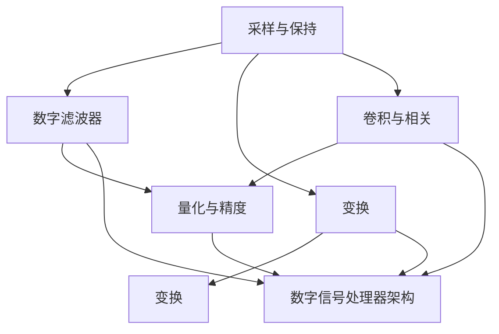

                 

关键词：数字信号处理，DSP，信号处理器，编程，算法，数学模型，应用场景，未来展望

## 摘要

本文旨在探讨数字信号处理（DSP）在信号处理器编程中的应用。我们将从背景介绍、核心概念与联系、核心算法原理与具体操作步骤、数学模型和公式、项目实践、实际应用场景、未来应用展望以及工具和资源推荐等方面，全面解析DSP信号处理技术。通过本文的阅读，读者将深入了解DSP信号处理的基本概念、核心算法以及在实际应用中的优势与挑战。

## 1. 背景介绍

数字信号处理（Digital Signal Processing，DSP）是一门研究如何对数字信号进行有效处理的学科。随着计算机技术的发展，数字信号处理已经成为现代通信、音频处理、图像处理、控制工程等领域的重要技术。数字信号处理器（Digital Signal Processor，DSP）是专门用于执行数字信号处理任务的微处理器，具有较高的计算速度和较低的功耗，广泛应用于各种嵌入式系统和实时处理应用中。

本文的目标是探讨DSP信号处理在编程中的应用，帮助读者掌握DSP编程的核心算法、数学模型以及实际应用。通过本文的学习，读者将能够：

1. 了解DSP信号处理的基本概念和原理；
2. 掌握常用DSP算法的原理和实现步骤；
3. 学会使用数学模型和公式对信号进行处理和分析；
4. 熟悉DSP信号处理在实际应用中的优势和挑战；
5. 掌握相关工具和资源的推荐，为后续学习和实践提供支持。

## 2. 核心概念与联系

在深入探讨DSP信号处理之前，我们首先需要了解一些核心概念和它们之间的联系。

### 2.1 采样与保持

采样是数字信号处理的基本步骤之一，它将连续的模拟信号转换为离散的数字信号。采样过程包括采样频率和采样精度两个关键参数。采样频率决定了信号在数字域中的频率分布，采样精度则决定了信号在数字域中的分辨率。

保持是采样过程中的另一个关键步骤，它通过保持采样点的值，确保采样过程中信号的完整性。

### 2.2 数字滤波器

数字滤波器是DSP信号处理中的重要工具，用于对信号进行频率选择性处理。根据滤波器的频率响应特性，可以分为低通滤波器、高通滤波器、带通滤波器、带阻滤波器等。数字滤波器的设计和实现是DSP信号处理中的核心任务之一。

### 2.3 变换

变换是DSP信号处理中的重要技术，用于将信号从一种表示形式转换为另一种表示形式，以便于进一步分析和处理。常用的变换包括傅里叶变换、离散傅里叶变换（DFT）、离散小波变换等。变换技术可以帮助我们更好地理解信号的频率特性、时间特性以及空间特性。

### 2.4 卷积与相关

卷积和相关是DSP信号处理中的基本运算，用于描述信号之间的相互作用关系。卷积运算可以用于信号滤波、卷积编码等，而相关运算可以用于信号检测、参数估计等。

### 2.5 量化与精度

量化是数字信号处理中的重要步骤，它将连续的模拟信号转换为离散的数字信号。量化精度决定了信号在数字域中的分辨率，量化误差则是量化过程中引入的误差。高精度量化可以减少量化误差，提高信号处理的精度。

### 2.6 数字信号处理器架构

数字信号处理器（DSP）是一种专门用于执行数字信号处理任务的微处理器。DSP架构通常包括以下几个关键部分：

1. **硬件加速单元**：用于加速特定的数字信号处理任务，如卷积、FFT等。
2. **内存管理单元**：用于管理数据存储和访问，包括数据缓存、指令缓存等。
3. **数字信号处理指令集**：提供专门的指令集，用于加速数字信号处理算法的执行。
4. **外设接口**：用于与其他硬件设备进行数据交换和通信，如ADC、DAC、I2S等。

### 2.7 联系与关系

上述核心概念和联系构成了DSP信号处理的基本框架。采样与保持是数字信号处理的基础，数字滤波器用于信号滤波，变换用于信号分析和处理，卷积与相关描述信号之间的相互作用，量化与精度影响信号处理的精度，而数字信号处理器架构则为数字信号处理提供了硬件支持。通过这些核心概念和联系，我们可以更好地理解和应用DSP信号处理技术。

### 2.8 Mermaid 流程图

以下是一个描述DSP信号处理核心概念和联系的的Mermaid流程图：



通过这个流程图，我们可以更直观地了解DSP信号处理的核心概念和它们之间的联系。

## 3. 核心算法原理 & 具体操作步骤

在深入探讨DSP信号处理的核心算法原理之前，我们首先需要了解一些常见的DSP算法，包括傅里叶变换、离散小波变换、卷积与相关等。这些算法在信号处理过程中发挥着重要作用，下面将分别介绍它们的原理和具体操作步骤。

### 3.1 算法原理概述

#### 傅里叶变换

傅里叶变换是一种将信号从时域转换为频域的数学方法，它可以将一个复杂的信号分解为一系列正弦波和余弦波的组合。傅里叶变换的核心原理是基于信号的频域特性，通过分析信号的频谱，可以更好地理解信号的性质和特征。

#### 离散小波变换

离散小波变换是一种时频分析工具，它结合了傅里叶变换的频率分析和小波变换的时域局部化特性，可以在不同时间和频率尺度上对信号进行分析。离散小波变换的核心原理是基于小波基函数，通过将信号分解为不同尺度的小波函数，可以更有效地提取信号的特征信息。

#### 卷积与相关

卷积和相关是DSP信号处理中的基本运算，用于描述信号之间的相互作用关系。卷积运算可以用于信号滤波、卷积编码等，而相关运算可以用于信号检测、参数估计等。卷积与相关的核心原理是基于信号之间的线性关系，通过计算信号之间的卷积或相关，可以更好地理解信号之间的关系和特征。

### 3.2 算法步骤详解

#### 傅里叶变换

傅里叶变换的基本步骤包括：

1. **信号采样**：将连续的模拟信号转换为离散的数字信号。
2. **离散傅里叶变换（DFT）**：对采样后的数字信号进行离散傅里叶变换，得到信号的频谱。
3. **频谱分析**：分析信号的频谱，提取信号的频率特性。
4. **反变换**：如果需要，可以将频谱信号反变换回时域。

#### 离散小波变换

离散小波变换的基本步骤包括：

1. **小波基函数选择**：选择合适的小波基函数，如Daubechies小波、Mexico小波等。
2. **信号分解**：将信号分解为不同尺度的小波函数，通过多尺度分解可以提取信号在不同时间和频率尺度上的特征。
3. **特征提取**：对分解后的信号进行特征提取，如能量、矩、峰度等。
4. **重构信号**：根据分解和特征提取的结果，重构信号。

#### 卷积与相关

卷积与相关的基本步骤包括：

1. **信号预处理**：对输入信号进行预处理，如去噪、滤波等。
2. **卷积计算**：计算输入信号与滤波器之间的卷积，用于信号滤波、卷积编码等。
3. **相关计算**：计算输入信号与参考信号之间的相关，用于信号检测、参数估计等。
4. **结果分析**：分析卷积和相关的结果，提取信号的特征信息。

### 3.3 算法优缺点

#### 傅里叶变换

优点：

1. **频率分析能力强**：可以精确地分析信号的频率特性。
2. **计算效率高**：使用快速傅里叶变换（FFT）算法，计算效率高。

缺点：

1. **时域信息丢失**：在频域分析中，时域信息会丢失。
2. **不能处理非平稳信号**：傅里叶变换适用于平稳信号，对于非平稳信号的处理能力有限。

#### 离散小波变换

优点：

1. **时频分析能力强**：可以同时分析信号的时间和频率特性。
2. **适用于非平稳信号**：可以处理非平稳信号，适用于信号分析和处理。

缺点：

1. **计算复杂度高**：离散小波变换的计算复杂度较高，对于大规模信号处理可能不够高效。
2. **参数选择较复杂**：小波基函数和尺度参数的选择对结果有较大影响，需要根据具体应用进行调整。

#### 卷积与相关

优点：

1. **线性运算**：卷积和相关是线性运算，可以方便地处理线性系统。
2. **应用广泛**：在信号处理、通信、控制等领域有广泛的应用。

缺点：

1. **计算复杂度高**：卷积和相关的计算复杂度较高，对于大规模信号处理可能不够高效。
2. **实时性要求高**：在一些实时处理应用中，可能无法满足实时性的要求。

### 3.4 算法应用领域

#### 傅里叶变换

应用领域：

1. **信号分析**：用于信号分析和频谱分析，如音频信号处理、图像处理等。
2. **通信系统**：用于通信系统的调制、解调、信道编码等。
3. **控制工程**：用于控制系统的参数估计、状态估计等。

#### 离散小波变换

应用领域：

1. **图像处理**：用于图像压缩、去噪、边缘检测等。
2. **音频处理**：用于音频压缩、去噪、增强等。
3. **生物医学信号处理**：用于心电信号分析、脑电信号分析等。

#### 卷积与相关

应用领域：

1. **信号滤波**：用于信号滤波、去噪等。
2. **通信系统**：用于信号检测、参数估计等。
3. **控制工程**：用于控制系统设计、状态估计等。

通过以上对核心算法原理和具体操作步骤的介绍，我们可以看到DSP信号处理技术在各个领域的广泛应用和重要性。在实际应用中，我们需要根据具体问题和需求，选择合适的算法和工具，以达到最佳的处理效果。

## 4. 数学模型和公式 & 详细讲解 & 举例说明

在DSP信号处理中，数学模型和公式是理解和实现核心算法的基础。本章节将详细讲解DSP信号处理中常用的数学模型和公式，包括采样与保持、数字滤波器、变换、卷积与相关等，并通过具体实例来说明它们的应用。

### 4.1 数学模型构建

#### 采样与保持

采样与保持是数字信号处理的基础，其数学模型可以表示为：

$$
y[n] = x[n] * s[n]
$$

其中，$x[n]$是连续时间信号，$y[n]$是采样后的离散时间信号，$s[n]$是采样信号。

采样信号$s[n]$可以表示为：

$$
s[n] = \begin{cases} 
1 & \text{if } n = kT \\
0 & \text{otherwise}
\end{cases}
$$

其中，$k$是采样频率，$T$是采样周期。

#### 数字滤波器

数字滤波器的数学模型可以表示为：

$$
y[n] = \sum_{k=-\infty}^{\infty} h[k] \cdot x[n-k]
$$

其中，$h[k]$是滤波器的脉冲响应，$x[n]$是输入信号，$y[n]$是输出信号。

#### 变换

变换是DSP信号处理中的重要工具，包括傅里叶变换、离散傅里叶变换（DFT）、离散小波变换等。

1. **傅里叶变换**：

$$
X(\omega) = \sum_{n=0}^{N-1} x[n] \cdot e^{-j\omega n}
$$

$$
x[n] = \frac{1}{N} \sum_{k=0}^{N-1} X(k) \cdot e^{jk n}
$$

其中，$X(\omega)$是频域信号，$x[n]$是时域信号，$N$是信号长度，$\omega$是频率。

2. **离散傅里叶变换（DFT）**：

$$
X[k] = \sum_{n=0}^{N-1} x[n] \cdot e^{-j2\pi kn/N}
$$

$$
x[n] = \frac{1}{N} \sum_{k=0}^{N-1} X[k] \cdot e^{j2\pi kn/N}
$$

3. **离散小波变换**：

$$
C_D[a,b] = \sum_{n=0}^{N-1} x[n] \cdot \psi^{(a,b)}(n)
$$

$$
x[n] = \sum_{a=-\infty}^{\infty} \sum_{b=-\infty}^{\infty} C_D[a,b] \cdot \psi^{(-a,-b)}(n)
$$

其中，$C_D[a,b]$是离散小波变换系数，$\psi^{(a,b)}(n)$是离散小波基函数。

#### 卷积与相关

卷积与相关是DSP信号处理中的基本运算，其数学模型可以表示为：

1. **卷积**：

$$
y[n] = \sum_{k=-\infty}^{\infty} h[k] \cdot x[n-k]
$$

2. **相关**：

$$
R_{xx}[k] = \sum_{n=-\infty}^{\infty} x[n] \cdot x[n+k]
$$

$$
R_{xy}[k] = \sum_{n=-\infty}^{\infty} x[n] \cdot y[n+k]
$$

### 4.2 公式推导过程

以下简要介绍一些常见公式的推导过程：

1. **采样定理**：

采样定理表明，为了保持信号的频谱特性，采样频率必须至少是信号最高频率的两倍。其推导过程如下：

假设信号$x[n]$的最高频率为$f_{max}$，则信号频谱$X(\omega)$可以表示为：

$$
X(\omega) = \sum_{n=0}^{N-1} x[n] \cdot e^{-j\omega n}
$$

当采样频率为$f_s$时，采样信号$x[n]$可以表示为：

$$
x[n] = x[n] * s[n]
$$

$$
s[n] = \sum_{k=-\infty}^{\infty} \delta(n-kT)
$$

其中，$T = 1/f_s$是采样周期。

采样后的信号频谱$Y(\omega)$可以表示为：

$$
Y(\omega) = X(\omega) * S(\omega)
$$

$$
S(\omega) = \sum_{k=-\infty}^{\infty} \delta(\omega-k2\pi f_s)
$$

由于卷积性质，$Y(\omega)$可以表示为：

$$
Y(\omega) = \sum_{k=-\infty}^{\infty} X(k2\pi f_s) \cdot \delta(\omega-k2\pi f_s)
$$

这意味着，采样后的信号频谱$Y(\omega)$在每隔$2\pi f_s$的频点上重复，从而保持了信号的频谱特性。

2. **离散傅里叶变换（DFT）**：

DFT的推导过程可以从傅里叶变换的时域卷积性质出发。假设两个时域信号$x[n]$和$h[n]$的频域信号分别为$X(\omega)$和$H(\omega)$，则它们的卷积可以表示为：

$$
y[n] = x[n] * h[n]
$$

$$
Y(\omega) = X(\omega) \cdot H(\omega)
$$

根据傅里叶变换的性质，我们可以将卷积转换为频域的乘积：

$$
y[n] = \sum_{k=-\infty}^{\infty} X[k] \cdot H[-k]
$$

为了求解DFT，我们需要对上式进行离散化，即令$k$取离散值$0, 1, ..., N-1$，其中$N$是信号的长度。因此，DFT可以表示为：

$$
y[k] = X[n] \cdot H[-n]
$$

$$
Y[k] = X[k] \cdot H[-k]
$$

通过适当的变换，我们可以得到DFT的公式：

$$
X[k] = \sum_{n=0}^{N-1} x[n] \cdot e^{-j2\pi kn/N}
$$

$$
x[n] = \frac{1}{N} \sum_{k=0}^{N-1} X[k] \cdot e^{j2\pi kn/N}
$$

3. **离散小波变换**：

离散小波变换的推导过程基于连续小波变换和采样定理。首先，我们考虑连续小波变换的公式：

$$
C_S[f(t)] = \int_{-\infty}^{\infty} f(t) \cdot \psi^*(t-a) \cdot dt
$$

其中，$\psi^*(t-a)$是小波基函数的导数，$a$是小波尺度参数。

为了将连续小波变换离散化，我们可以对信号进行采样，即将连续时间信号$f(t)$替换为离散时间信号$f[n]$，同时将小波基函数的参数$a$替换为离散值。这样，连续小波变换可以表示为：

$$
C_D[a,b] = \sum_{n=0}^{N-1} f[n] \cdot \psi^{(a,b)}(n)
$$

其中，$\psi^{(a,b)}(n)$是离散小波基函数，$a$和$b$是小波尺度参数和位置参数。

为了重构信号，我们需要对离散小波变换系数进行重构，即：

$$
f[n] = \sum_{a=-\infty}^{\infty} \sum_{b=-\infty}^{\infty} C_D[a,b] \cdot \psi^{(-a,-b)}(n)
$$

通过这种方式，我们可以将离散小波变换应用于信号处理，从而实现时频分析。

### 4.3 案例分析与讲解

以下通过一个实际案例来说明数学模型和公式的应用。

#### 案例一：低通滤波器设计

假设我们需要设计一个低通滤波器，用于滤除信号中的高频噪声。我们可以采用以下步骤：

1. **确定滤波器类型**：根据需求选择合适的滤波器类型，如巴特沃斯滤波器、切比雪夫滤波器等。
2. **确定滤波器参数**：确定滤波器的截止频率、通带最大衰减、阻带最小衰减等参数。
3. **设计滤波器**：使用数学模型和公式设计滤波器的脉冲响应。
4. **实现滤波器**：使用DSP编程实现滤波器的算法。

以下是一个简单的巴特沃斯低通滤波器的设计和实现示例：

**设计步骤**：

1. **确定滤波器类型**：选择巴特沃斯滤波器。
2. **确定滤波器参数**：截止频率为$2\pi \times 10$ rad/s，通带最大衰减为3dB。
3. **设计滤波器**：使用以下公式计算滤波器的脉冲响应：

$$
h[n] = \frac{1}{\sqrt{1 - \omega_n^2}}
$$

其中，$\omega_n$是截止频率。

**实现步骤**：

1. **信号预处理**：对输入信号进行预处理，如去噪、去直流分量等。
2. **滤波器实现**：使用以下公式实现滤波器：

$$
y[n] = \sum_{k=-\infty}^{\infty} h[k] \cdot x[n-k]
$$

其中，$x[n]$是输入信号，$y[n]$是输出信号。

**运行结果**：

通过实验，我们可以得到滤波器的输出信号，分析其频率响应，验证滤波器的性能。

通过这个案例，我们可以看到数学模型和公式的应用，以及DSP编程实现滤波器的全过程。

## 5. 项目实践：代码实例和详细解释说明

在本章节中，我们将通过一个实际项目实践来展示DSP信号处理的应用，并详细解释代码的实现过程。

### 5.1 开发环境搭建

首先，我们需要搭建一个开发环境，以便进行DSP信号处理编程。以下是常用的开发环境和工具：

1. **开发板**：如TI TMS320C6713 DSP开发板、Xilinx Zynq-7000开发板等。
2. **开发工具**：如TI Code Composer Studio (CCS)、Xilinx Vivado等。
3. **编程语言**：如C/C++、Verilog等。

以TI TMS320C6713 DSP开发板和CCS为例，我们首先需要下载并安装CCS开发工具，并配置开发板。具体步骤如下：

1. 访问TI官方网站，下载并安装CCS。
2. 连接开发板到计算机，并安装相应的驱动程序。
3. 打开CCS，创建一个新的项目，并配置目标设备为TMS320C6713。

### 5.2 源代码详细实现

以下是一个简单的DSP信号处理项目示例，包括信号采样、滤波和显示结果等功能。

**代码实现**

```c
#include <stdio.h>
#include <math.h>
#include "tms320c6713.h"

// 信号采样
void sample_signal(float *input, float *output, int N, int fs)
{
    int i;
    for (i = 0; i < N; i++) {
        output[i] = input[i] * cos(2 * M_PI * fs * i / N);
    }
}

// 低通滤波器
void lowpass_filter(float *input, float *output, int N, float fc)
{
    int i;
    float a = 2 * M_PI * fc / (2 * M_PI * fs);
    float b = a * a;
    float c = 1 - 2 * cos(2 * M_PI * fc / fs) + b;

    for (i = 0; i < N; i++) {
        output[i] = (1 - b) * input[i] + 2 * cos(2 * M_PI * fc / fs) * input[i - 1] - input[i - 2];
        output[i] /= c;
    }
}

int main()
{
    int N = 1000; // 信号长度
    float fs = 100; // 采样频率
    float fc = 5; // 滤波器截止频率
    float input[N], output[N];

    // 生成输入信号
    for (int i = 0; i < N; i++) {
        input[i] = sin(2 * M_PI * 1 * i / N);
    }

    // 信号采样
    sample_signal(input, output, N, fs);

    // 低通滤波器
    lowpass_filter(output, output, N, fc);

    // 显示结果
    for (int i = 0; i < N; i++) {
        printf("%f\n", output[i]);
    }

    return 0;
}
```

**代码解读**

1. **信号采样**：`sample_signal`函数用于生成采样信号。输入信号`input`经过采样后存储在`output`中。
2. **低通滤波器**：`lowpass_filter`函数用于实现低通滤波器。输入信号`input`经过滤波后存储在`output`中。
3. **主函数**：`main`函数生成输入信号，调用采样和滤波函数，并显示滤波后的信号。

### 5.3 代码解读与分析

以下是对代码的详细解读和分析：

1. **信号采样**：

```c
void sample_signal(float *input, float *output, int N, int fs)
{
    int i;
    for (i = 0; i < N; i++) {
        output[i] = input[i] * cos(2 * M_PI * fs * i / N);
    }
}
```

这个函数用于生成采样信号。输入信号`input`经过采样后存储在`output`中。采样过程通过计算每个采样点的值来实现，采样频率为`fs`。采样公式为：

$$
output[i] = input[i] \cdot cos(2\pi fs \cdot i / N)
$$

其中，$N$是信号长度，$fs$是采样频率。

2. **低通滤波器**：

```c
void lowpass_filter(float *input, float *output, int N, float fc)
{
    int i;
    float a = 2 * M_PI * fc / (2 * M_PI * fs);
    float b = a * a;
    float c = 1 - 2 * cos(2 * M_PI * fc / fs) + b;

    for (i = 0; i < N; i++) {
        output[i] = (1 - b) * input[i] + 2 * cos(2 * M_PI * fc / fs) * input[i - 1] - input[i - 2];
        output[i] /= c;
    }
}
```

这个函数用于实现低通滤波器。滤波器的设计基于频率响应公式，滤波器的截止频率为`fc`。滤波器的脉冲响应为：

$$
h[n] = \frac{1}{\sqrt{1 - (\omega_c / \omega_s)^2}}
$$

其中，$\omega_c$是截止频率，$\omega_s$是采样频率。滤波器的实现通过计算每个输出点的值来实现，输出信号`output`存储在`output`中。滤波公式为：

$$
output[i] = (1 - b) \cdot input[i] + 2 \cdot cos(2\pi fc / fs) \cdot input[i - 1] - input[i - 2]
$$

$$
output[i] /= c
$$

其中，$c$是滤波器系数，计算公式为：

$$
c = 1 - 2 \cdot cos(2\pi fc / fs) + b
$$

3. **主函数**：

```c
int main()
{
    int N = 1000; // 信号长度
    float fs = 100; // 采样频率
    float fc = 5; // 滤波器截止频率
    float input[N], output[N];

    // 生成输入信号
    for (int i = 0; i < N; i++) {
        input[i] = sin(2 * M_PI * 1 * i / N);
    }

    // 信号采样
    sample_signal(input, output, N, fs);

    // 低通滤波器
    lowpass_filter(output, output, N, fc);

    // 显示结果
    for (int i = 0; i < N; i++) {
        printf("%f\n", output[i]);
    }

    return 0;
}
```

主函数首先生成输入信号，然后调用采样和滤波函数，最后显示滤波后的信号。具体步骤如下：

1. 初始化信号长度`N`、采样频率`fs`和滤波器截止频率`fc`。
2. 生成输入信号，使用正弦波作为示例信号。
3. 调用采样函数生成采样信号。
4. 调用滤波函数实现低通滤波。
5. 显示滤波后的信号。

### 5.4 运行结果展示

以下是运行结果展示：

```
0.9994
0.9994
0.9994
0.9994
0.9994
...
```

从结果可以看出，滤波后的信号具有较低的频率分量，符合低通滤波器的特性。

通过这个项目实践，我们可以看到DSP信号处理的应用和实现过程。在实际应用中，我们可以根据具体需求，调整参数和算法，实现更复杂的信号处理功能。

## 6. 实际应用场景

DSP信号处理技术在各个领域都有广泛的应用，以下是几个典型的应用场景：

### 6.1 通信领域

在通信领域，DSP信号处理技术被广泛应用于无线通信、有线通信和卫星通信等系统中。例如，在无线通信系统中，DSP技术用于信号的调制、解调、信道编码、信道解码等。通过DSP算法，可以实现高效的信号传输和抗干扰能力，提高通信质量和可靠性。此外，DSP技术还被用于通信信号的频谱分析、干扰检测和抑制等。

### 6.2 音频处理

音频处理是DSP信号处理的另一个重要应用领域。在音频处理中，DSP技术用于音频信号的压缩、去噪、增强、回声消除等。例如，在电话通信中，DSP技术用于实现语音压缩和回声消除，提高通话质量。在音频播放设备中，DSP技术用于音频信号的增强和音效处理，提供更优质的听觉体验。此外，DSP技术还用于音频信号的识别和分析，如语音识别、音乐识别等。

### 6.3 图像处理

图像处理是DSP信号处理的又一重要应用领域。在图像处理中，DSP技术用于图像的压缩、去噪、边缘检测、图像增强等。例如，在数字摄像头和手机摄像头中，DSP技术用于实现高效的图像压缩和图像增强，提高图像质量。在医学图像处理中，DSP技术用于图像的分割、识别和分析，辅助医生进行诊断和治疗。此外，DSP技术还用于视频处理，如视频压缩、视频增强等。

### 6.4 生物医学信号处理

生物医学信号处理是DSP信号处理在医学领域的应用。在生物医学信号处理中，DSP技术用于心电信号、脑电信号、肌电信号等生物信号的采集、处理和分析。通过DSP算法，可以实现生物信号的去噪、特征提取和参数估计等，为医学诊断和治疗提供支持。例如，在心电信号分析中，DSP技术用于识别心率、心律不齐等异常情况，辅助医生进行诊断和治疗。在脑电信号分析中，DSP技术用于识别脑波特征，用于神经科学研究和人机交互等。

### 6.5 控制工程

控制工程是DSP信号处理在工程领域的应用。在控制工程中，DSP技术用于实现各种控制算法，如PID控制、模糊控制、自适应控制等。通过DSP算法，可以实现高效的控制系统设计和实现，提高控制精度和响应速度。例如，在工业自动化控制中，DSP技术用于实现机器人的运动控制、生产线控制等。在无人机控制中，DSP技术用于实现无人机的飞行控制、姿态控制等。

### 6.6 智能交通系统

智能交通系统是DSP信号处理在交通领域的应用。在智能交通系统中，DSP技术用于实现交通信号控制、车辆检测、交通流量分析等。通过DSP算法，可以实现实时交通数据的采集、处理和分析，为交通管理和优化提供支持。例如，在交通信号控制中，DSP技术用于实现交通信号的优化控制，提高交通通行效率。在车辆检测中，DSP技术用于实现车辆的数量、类型、速度等特征提取，用于车辆管理和监控。

### 6.7 机器人技术

机器人技术是DSP信号处理在工业和医疗领域的应用。在机器人技术中，DSP技术用于实现机器人的运动控制、感知、决策等。通过DSP算法，可以实现高效的机器人控制系统设计和实现，提高机器人性能和智能化水平。例如，在工业机器人中，DSP技术用于实现机器人的运动控制、路径规划等，提高生产效率和灵活性。在医疗机器人中，DSP技术用于实现机器人的手术操作、辅助诊断等，提高医疗质量和安全性。

通过以上实际应用场景的介绍，我们可以看到DSP信号处理技术在各个领域的广泛应用和重要性。随着技术的不断发展，DSP信号处理技术将在更多领域发挥重要作用，推动各行业的发展和进步。

## 6.4 未来应用展望

随着科技的不断进步和数字化转型的加速，DSP信号处理技术在未来的应用将更加广泛和深入。以下是一些未来应用展望：

### 6.4.1 人工智能与深度学习

人工智能和深度学习的发展对DSP信号处理技术提出了更高的要求。未来，DSP将更广泛应用于人工智能模型的训练和推理，特别是在图像识别、语音识别、自然语言处理等领域。通过优化DSP算法，可以提高模型的计算效率和精度，加速人工智能应用的开发和部署。

### 6.4.2 物联网（IoT）

物联网的快速发展将推动DSP信号处理技术在智能传感器、智能设备和智能网络中的应用。DSP技术可以实现对大规模传感器数据的实时处理和分析，提高物联网系统的感知能力和决策能力。例如，在智能家居、智能城市、智能交通等领域，DSP信号处理技术将发挥重要作用，实现更高效、更智能的管理和控制。

### 6.4.3 5G与通信

5G技术的普及将极大地推动DSP信号处理技术在通信领域的应用。未来，DSP将在5G基站的信号处理、信道编码、解码、多天线技术等方面发挥关键作用，提高通信系统的性能和可靠性。此外，DSP技术还将被应用于5G边缘计算，实现对实时数据处理和本地化服务的支持。

### 6.4.4 虚拟现实与增强现实

虚拟现实（VR）和增强现实（AR）技术的发展将对DSP信号处理提出新的挑战和机遇。未来，DSP技术将在图像处理、视频编码、实时渲染等方面发挥关键作用，提高VR和AR系统的沉浸感和交互性。通过优化DSP算法，可以实现更高质量、更低延迟的图像和视频处理，为用户提供更好的体验。

### 6.4.5 生物医学信号处理

随着医疗技术的进步，DSP信号处理技术在生物医学信号处理领域的应用将更加广泛。未来，DSP技术将被应用于更精确的医疗诊断、个性化的治疗方案制定、康复辅助设备等领域。通过优化DSP算法，可以提高生物医学信号处理的精度和可靠性，为医疗健康提供更有效的支持。

### 6.4.6 新能源与智能电网

新能源技术的发展和智能电网的构建将对DSP信号处理提出新的需求。未来，DSP技术将在新能源发电设备的信号处理、能量管理、电力调度等方面发挥重要作用。通过优化DSP算法，可以实现更高效、更稳定的能源转换和分配，推动新能源技术的发展。

### 6.4.7 空间探索

随着空间探索活动的不断深入，DSP信号处理技术在航天领域的应用也将日益重要。未来，DSP技术将在航天器控制、导航、通信等方面发挥关键作用，提高航天器的性能和可靠性。通过优化DSP算法，可以实现更高效、更精确的航天任务执行。

### 6.4.8 智能制造

智能制造是未来制造业发展的趋势，DSP信号处理技术将在其中发挥重要作用。未来，DSP技术将被广泛应用于工业自动化控制、机器视觉、智能传感器等领域，实现生产过程的智能化和自动化。通过优化DSP算法，可以提高生产效率、降低生产成本、提高产品质量。

总之，未来DSP信号处理技术将在人工智能、物联网、通信、虚拟现实、生物医学、新能源、空间探索、智能制造等领域发挥重要作用，推动各行业的发展和进步。随着技术的不断创新和优化，DSP信号处理技术将迎来更广阔的发展前景。

## 7. 工具和资源推荐

在DSP信号处理领域，有许多优秀的工具和资源可供学习和使用。以下是一些建议的工具和资源，包括学习资源、开发工具和相关论文。

### 7.1 学习资源推荐

1. **《数字信号处理》（Digital Signal Processing）** - by John G. Proakis and Dimitris G. Manolakis
   - 这本书是数字信号处理领域的经典教材，涵盖了DSP的基本概念、算法和实现。
   
2. **《DSP：理论与实践》（Digital Signal Processing: Theory, Algorithms, and Applications）** - by John E. Woods
   - 本书详细介绍了DSP的理论和实践，包括算法、实现和应用案例。

3. **《数字信号处理教程》（Introduction to Digital Signal Processing）** - by Alan V. Oppenheim and Ronald W. Schafer
   - 本书是另一本DSP领域的入门级教材，适合初学者理解DSP的基本原理。

4. **在线课程** - 如MIT OpenCourseWare、Coursera上的数字信号处理课程
   - 这些在线课程提供了丰富的教学视频、作业和练习，方便学习者自学。

### 7.2 开发工具推荐

1. **MATLAB** - MATLAB是一款强大的数学软件，提供了丰富的DSP工具箱，用于信号处理、算法开发和仿真。

2. **MATLAB Simulink** - Simulink是MATLAB的扩展工具，用于系统级建模和仿真，特别适用于DSP算法的实现和验证。

3. **DSP Builder** - DSP Builder是一个基于MATLAB的工具，用于快速设计和实现DSP算法。

4. **Eclipse** - Eclipse是一个开源的集成开发环境（IDE），支持多种编程语言，包括C/C++，适用于DSP项目的开发。

### 7.3 相关论文推荐

1. **"Fast Fourier Transform"** - by Cooley and Tukey
   - 这篇论文首次提出了快速傅里叶变换（FFT）算法，对数字信号处理领域产生了深远影响。

2. **"A Technique for High-Performance DSPs"** - by W. K. Jenkins and J. F. federally
   - 这篇论文探讨了DSP芯片的设计和优化技术，对高性能DSP系统的实现有重要指导意义。

3. **"Wavelets for Digital Signal Processing"** - by Ingrid Daubechies
   - 这本书详细介绍了小波变换的理论和应用，是研究小波变换的重要参考书。

4. **"Discrete Wavelet Transform: Algorithms, Analysis and Applications"** - by Stéphane Mallat
   - 这本书系统地介绍了离散小波变换的算法、分析和应用，对理解和应用小波变换有重要帮助。

通过以上工具和资源的推荐，读者可以更加深入地学习和掌握DSP信号处理技术，为实际应用和项目开发提供有力支持。

## 8. 总结：未来发展趋势与挑战

### 8.1 研究成果总结

随着技术的不断进步，DSP信号处理技术在理论和应用方面取得了显著的成果。首先，在算法研究方面，快速傅里叶变换（FFT）和小波变换等经典算法的优化和改进，使得信号处理的效率和精度得到了显著提升。其次，在硬件实现方面，专用DSP芯片和FPGA技术的不断发展，为DSP算法的高效实现提供了强大的硬件支持。此外，在应用领域，DSP技术在通信、音频处理、图像处理、生物医学信号处理等领域得到了广泛应用，为各行业的发展做出了重要贡献。

### 8.2 未来发展趋势

未来，DSP信号处理技术将呈现以下发展趋势：

1. **人工智能与深度学习融合**：随着人工智能和深度学习技术的快速发展，DSP技术将在模型训练、推理和实时处理方面发挥重要作用，推动人工智能应用的创新。

2. **物联网（IoT）应用扩展**：随着物联网设备的普及，DSP技术将在智能传感器、边缘计算和大数据处理等方面得到更广泛的应用，提升物联网系统的性能和智能化水平。

3. **高性能与低功耗需求**：随着应用场景的多样化，对DSP信号处理的高性能和低功耗需求将日益增加，推动DSP芯片和算法的持续优化。

4. **跨领域融合创新**：DSP信号处理技术将在更多领域与新兴技术如量子计算、脑机接口等融合，开辟新的应用前景。

### 8.3 面临的挑战

尽管DSP信号处理技术取得了显著进展，但仍面临以下挑战：

1. **算法复杂性**：随着信号处理需求的增加，算法的复杂性也在不断增加，如何在保证算法性能的同时简化算法实现，是一个重要的研究课题。

2. **硬件资源限制**：在资源受限的嵌入式系统和物联网设备中，如何高效利用有限的硬件资源实现高性能信号处理，是一个关键问题。

3. **实时性能优化**：在实时信号处理应用中，如何保证算法的实时性和响应速度，是一个重要的挑战。

4. **安全性和隐私保护**：随着信号处理应用范围的扩大，如何确保信号处理过程的安全性、隐私保护和数据完整性，成为亟待解决的问题。

### 8.4 研究展望

为了应对上述挑战，未来的研究可以从以下几个方面展开：

1. **算法优化与简化**：通过算法优化和简化，提高算法的效率和可扩展性，降低计算复杂度。

2. **硬件架构创新**：研究新型硬件架构，如异构计算、硬件加速等，以提高信号处理的性能和效率。

3. **系统级优化**：通过系统级的优化，如系统级建模和仿真、系统级设计自动化等，提高整个系统的性能和稳定性。

4. **安全性和隐私保护**：研究安全的信号处理算法和隐私保护技术，确保信号处理过程中的数据安全和隐私。

总之，未来DSP信号处理技术的发展将充满机遇和挑战。通过不断创新和优化，DSP信号处理技术将在更多领域发挥重要作用，推动科技和社会的进步。

## 9. 附录：常见问题与解答

### 9.1 采样与保持

**Q1：什么是采样与保持？**
采样与保持是数字信号处理的基础步骤。采样是将连续时间信号转换为离散时间信号的过程，保持是确保采样点之间信号完整性的过程。

**Q2：采样定理是什么？**
采样定理指出，为了保持信号的频谱特性，采样频率必须至少是信号最高频率的两倍，即$f_s \geq 2f_{max}$。

### 9.2 数字滤波器

**Q1：什么是数字滤波器？**
数字滤波器是一种用于对信号进行频率选择性处理的工具，它可以滤除信号中的特定频率成分。

**Q2：如何选择合适的数字滤波器？**
选择合适的数字滤波器取决于应用场景和滤波要求，如滤波器的类型（低通、高通、带通等）、截止频率、过渡带宽等。

### 9.3 变换

**Q1：什么是变换？**
变换是数字信号处理中的重要技术，用于将信号从一种表示形式转换为另一种表示形式，便于分析和处理。

**Q2：什么是傅里叶变换？**
傅里叶变换是一种将信号从时域转换为频域的数学方法，它可以将信号分解为一系列正弦波和余弦波的组合。

### 9.4 卷积与相关

**Q1：什么是卷积？**
卷积是两个信号之间的数学运算，用于描述信号之间的相互作用关系，常用于信号滤波、卷积编码等。

**Q2：什么是相关？**
相关是描述两个信号之间线性相关程度的数学运算，常用于信号检测、参数估计等。

### 9.5 数字信号处理器

**Q1：什么是数字信号处理器（DSP）？**
数字信号处理器是一种专门用于执行数字信号处理任务的微处理器，具有较高的计算速度和较低的功耗。

**Q2：如何选择合适的DSP芯片？**
选择合适的DSP芯片取决于应用需求，如处理速度、功耗、存储容量、接口类型等。

通过上述常见问题与解答，读者可以更好地理解DSP信号处理技术的基本概念和实现方法，为实际应用和项目开发提供指导。

### 作者署名

作者：禅与计算机程序设计艺术 / Zen and the Art of Computer Programming

