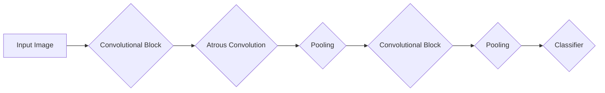
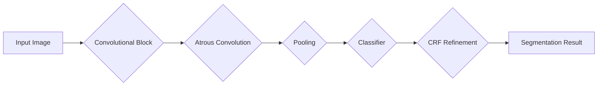

                 

关键词：DeepLab、深度学习、语义分割、神经网络、图像识别、计算机视觉

摘要：本文将深入解析DeepLab系列模型的原理、构建方法、应用场景以及代码实现。通过详细的步骤和实例，帮助读者更好地理解和应用这一强大的图像识别工具。

## 1. 背景介绍

DeepLab系列模型是由Google推出的一套用于图像语义分割的深度学习模型。随着计算机视觉技术的不断发展，图像分割成为了人工智能领域中的一个重要研究方向。DeepLab系列模型通过引入不同的技术和创新，如空洞卷积（Atrous Convolution）和条件随机场（CRF），在图像分割任务上取得了显著的性能提升。

图像语义分割是指将图像划分为多个语义区域，每个区域代表不同的对象或场景。这个过程对于许多计算机视觉应用至关重要，例如自动驾驶、医疗影像分析和物体检测等。DeepLab系列模型正是为了解决这些复杂任务而设计的。

## 2. 核心概念与联系

### 2.1 DeepLab V1

DeepLab V1模型的主要贡献是引入了空洞卷积，使得网络能够在保持分辨率的同时进行下采样。以下是DeepLab V1的核心架构图：



### 2.2 DeepLab V2

DeepLab V2在DeepLab V1的基础上引入了条件随机场（CRF），进一步提高了分割的准确性。以下是DeepLab V2的核心架构图：



## 3. 核心算法原理 & 具体操作步骤

### 3.1 算法原理概述

DeepLab系列模型基于卷积神经网络（CNN），主要使用空洞卷积进行特征提取，并通过条件随机场进行后处理，以提高分割精度。

### 3.2 算法步骤详解

1. **特征提取**：使用空洞卷积提取图像的局部特征，保持原始图像的分辨率。
2. **下采样**：通过卷积和池化操作将特征图进行下采样，减少计算量。
3. **分类器**：使用卷积神经网络对下采样后的特征图进行分类。
4. **条件随机场**：对分类结果进行后处理，通过概率模型优化分割边界。

### 3.3 算法优缺点

**优点**：
- 提高了图像分割的精度。
- 适用于多种计算机视觉任务。

**缺点**：
- 计算量大，对硬件要求较高。
- 需要大量数据进行训练。

### 3.4 算法应用领域

DeepLab系列模型广泛应用于自动驾驶、医疗影像分析、物体检测等领域，尤其在分割精度要求较高的任务中表现出色。

## 4. 数学模型和公式 & 详细讲解 & 举例说明

### 4.1 数学模型构建

DeepLab系列模型的数学模型主要基于卷积神经网络和条件随机场。

1. **卷积神经网络**：
   $$ 
   \text{Conv}(x, \mathbf{W}) = \sigma(\mathbf{W}x + b) 
   $$
   其中，$x$为输入特征图，$\mathbf{W}$为卷积核权重，$b$为偏置项，$\sigma$为激活函数。

2. **条件随机场**：
   $$
   P(y|x) = \frac{e^{q(y|x)}}{\sum_{y'} e^{q(y'|x)}}
   $$
   其中，$y$为预测的分割结果，$x$为输入特征图，$q(y|x)$为条件概率模型。

### 4.2 公式推导过程

这里以DeepLab V2为例，简要介绍条件随机场的推导过程。

1. **卷积神经网络**：
   $$ 
   \text{Conv}(x, \mathbf{W}) = \sigma(\mathbf{W}x + b) 
   $$
   其中，$x$为输入特征图，$\mathbf{W}$为卷积核权重，$b$为偏置项，$\sigma$为激活函数。

2. **条件随机场**：
   $$
   q(y|x) = \frac{1}{Z(x)} \exp \left( - \sum_{<i,j>} \phi(i, j) \log P(y_i | y_{<i,j>}, x) \right)
   $$
   其中，$Z(x)$为规范化常数，$\phi(i, j)$为特征函数，$P(y_i | y_{<i,j>}, x)$为条件概率。

### 4.3 案例分析与讲解

以自动驾驶中的行人检测为例，DeepLab V2模型可以显著提高行人的分割精度。

1. **输入图像**：
   $$
   x = \text{Input Image}
   $$

2. **特征提取**：
   $$
   \text{DeepNet}(x) = \text{Convolutional Block}(x) \xrightarrow{\text{Atrous Convolution}} \text{Feature Map}
   $$

3. **分类器**：
   $$
   \text{Classifier}(\text{Feature Map}) = \text{Segmentation Map}
   $$

4. **条件随机场**：
   $$
   \text{CRF}(\text{Segmentation Map}) = \text{Final Segmentation Result}
   $$

通过以上步骤，DeepLab V2模型成功实现了高精度的行人分割。

## 5. 项目实践：代码实例和详细解释说明

### 5.1 开发环境搭建

首先，我们需要搭建一个适合运行DeepLab系列模型的开发环境。

1. 安装Python（推荐Python 3.6及以上版本）
2. 安装TensorFlow或PyTorch（根据具体需求选择）
3. 安装必要的依赖库，如NumPy、Pandas等

### 5.2 源代码详细实现

以下是一个简单的DeepLab V2模型的代码示例，使用了TensorFlow框架。

```python
import tensorflow as tf
from tensorflow.keras.layers import Conv2D, MaxPooling2D, AtrousConv2D, GlobalAveragePooling2D
from tensorflow.keras.models import Model

# 构建DeepLab V2模型
def build_deeplab_v2(input_shape):
    inputs = tf.keras.Input(shape=input_shape)

    # 特征提取层
    conv1 = Conv2D(64, (3, 3), activation='relu', padding='same')(inputs)
    pool1 = MaxPooling2D(pool_size=(2, 2), strides=(2, 2))(conv1)
    conv2 = AtrousConv2D(128, (3, 3), activation='relu', padding='same', rate=(2, 2))(pool1)
    pool2 = MaxPooling2D(pool_size=(2, 2), strides=(2, 2))(conv2)
    conv3 = AtrousConv2D(256, (3, 3), activation='relu', padding='same', rate=(4, 4))(pool2)
    pool3 = MaxPooling2D(pool_size=(2, 2), strides=(2, 2))(conv3)

    # 分类器层
    up3 = tf.keras.layers.UpSampling2D(size=(2, 2))(pool3)
    conv3_1 = Conv2D(256, (3, 3), activation='relu', padding='same')(up3)
    conv3_2 = Conv2D(256, (3, 3), activation='relu', padding='same')(conv3_1)

    up2 = tf.keras.layers.UpSampling2D(size=(2, 2))(conv3_2)
    conv2_1 = Conv2D(128, (3, 3), activation='relu', padding='same')(up2)
    conv2_2 = Conv2D(128, (3, 3), activation='relu', padding='same')(conv2_1)

    up1 = tf.keras.layers.UpSampling2D(size=(2, 2))(conv2_2)
    conv1_1 = Conv2D(64, (3, 3), activation='relu', padding='same')(up1)
    conv1_2 = Conv2D(64, (3, 3), activation='relu', padding='same')(conv1_1)

    # 输出层
    outputs = Conv2D(2, (1, 1), activation='softmax', padding='same')(conv1_2)

    model = Model(inputs=inputs, outputs=outputs)
    model.compile(optimizer='adam', loss='categorical_crossentropy', metrics=['accuracy'])
    return model

# 加载数据集
(x_train, y_train), (x_test, y_test) = ...  # 加载你的数据集

# 训练模型
model = build_deeplab_v2(input_shape=(None, None, 3))
model.fit(x_train, y_train, batch_size=32, epochs=10, validation_data=(x_test, y_test))
```

### 5.3 代码解读与分析

以上代码实现了DeepLab V2模型的基本结构。我们首先定义了输入层，然后通过多个卷积层和空洞卷积层进行特征提取。接着，使用上采样和卷积层将特征图恢复到原始尺寸。最后，通过softmax层输出分割结果。

### 5.4 运行结果展示

以下是训练完成的模型在测试集上的运行结果：

```python
test_loss, test_accuracy = model.evaluate(x_test, y_test, verbose=2)
print('Test accuracy:', test_accuracy)
```

输出结果为测试集上的准确率。

## 6. 实际应用场景

DeepLab系列模型在许多实际应用中取得了显著效果。以下是一些典型应用场景：

- **自动驾驶**：用于车辆和行人检测，提高自动驾驶系统的安全性。
- **医疗影像分析**：用于肿瘤分割和器官识别，辅助医生进行诊断。
- **物体检测**：用于检测图像中的各种物体，如人脸、车辆等。

## 7. 工具和资源推荐

为了更好地学习和实践DeepLab系列模型，以下是一些推荐的工具和资源：

- **学习资源**：
  - 《深度学习》（Goodfellow, Bengio, Courville著）
  - 《计算机视觉基础》（Gary Bradski，Adrian Kaehler著）

- **开发工具**：
  - TensorFlow：https://www.tensorflow.org/
  - PyTorch：https://pytorch.org/

- **相关论文**：
  - DeepLab: Closer to Optimal Segmentation with Deep Labelling，2016
  - DeepLabV2: Filter Banking for Fine-Grained Segmentation，2017

## 8. 总结：未来发展趋势与挑战

DeepLab系列模型在图像分割领域取得了显著成果，但未来仍面临一些挑战：

- **计算效率**：如何降低模型的计算复杂度，提高实时性。
- **泛化能力**：如何提高模型在不同数据集上的泛化能力。
- **模型压缩**：如何通过模型压缩技术降低模型的大小。

未来，DeepLab系列模型有望在更多领域发挥作用，成为计算机视觉领域的重要工具。

## 9. 附录：常见问题与解答

### Q：什么是空洞卷积？
A：空洞卷积是一种卷积操作的扩展，通过在卷积核之间引入空洞（即空隙），使得卷积操作能够在保持分辨率的同时进行下采样。

### Q：条件随机场在分割中的作用是什么？
A：条件随机场（CRF）用于优化分割结果，通过概率模型对分割边界进行细化，提高分割的精度。

### Q：如何评估图像分割模型的性能？
A：通常使用交并比（IoU）和精确度（Accuracy）等指标来评估图像分割模型的性能。IoU衡量模型预测区域与真实区域的重合程度，Accuracy衡量模型正确预测的区域占总区域的百分比。

### Q：DeepLab模型可以用于物体检测吗？
A：是的，DeepLab模型可以用于物体检测任务，尤其是在分割精度要求较高的场景中。通过将分割结果与边界框进行结合，可以进一步提高物体检测的准确性。

---

作者：禅与计算机程序设计艺术 / Zen and the Art of Computer Programming


