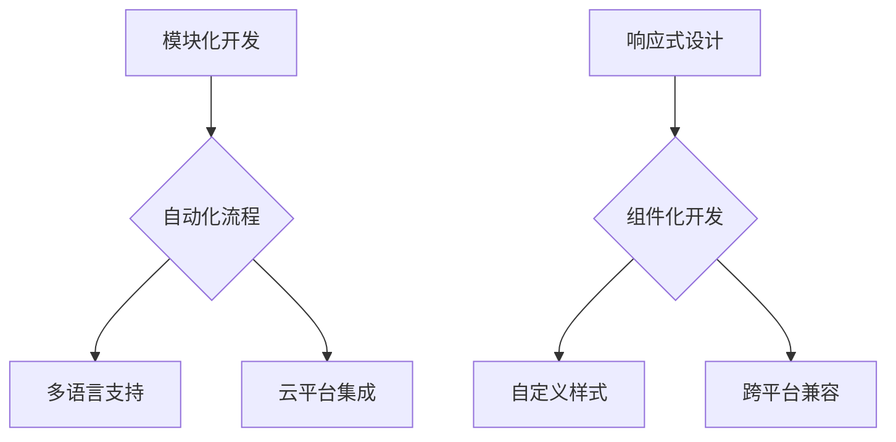

                 

关键词：Dify.AI、ComfyUI、人工智能、用户界面设计、交互性、功能模块、开发框架、技术对比

摘要：本文旨在深入探讨 Dify.AI 和 ComfyUI 两个新兴技术框架的相似之处。通过分析它们在人工智能和用户界面设计领域的应用，对比其功能模块和开发框架，本文揭示了这两大技术在技术实现、用户体验和未来发展方向上的共同点。本文将帮助读者更全面地理解这两个框架的优势与局限，为未来的研发工作提供有价值的参考。

## 1. 背景介绍

Dify.AI 和 ComfyUI 都是近年来备受关注的创新技术，它们在人工智能（AI）和用户界面设计（UI）领域取得了显著的进展。Dify.AI 是一家专注于人工智能开发平台的公司，其产品旨在简化 AI 应用程序的开发流程。ComfyUI 则是一个以用户为中心的 UI 开发框架，强调提供简单、高效且灵活的用户交互体验。

### Dify.AI

Dify.AI 的核心理念是降低 AI 技术的门槛，使非专业人士也能轻松创建和部署 AI 解决方案。它提供了一系列功能模块，包括数据预处理、模型训练、模型部署等，用户只需通过简单的操作即可实现复杂的 AI 任务。Dify.AI 还支持多种编程语言和框架，具备良好的扩展性和兼容性。

### ComfyUI

ComfyUI 的目标是创建一个直观、易用且适应性强的 UI 开发框架。它通过提供丰富的组件库和自定义选项，帮助开发者快速构建现代、美观的界面。ComfyUI 强调响应式设计，确保应用程序在各种设备和平台上都能提供一致的用户体验。此外，ComfyUI 还支持多种 UI 风格，以适应不同的业务需求和品牌形象。

## 2. 核心概念与联系

为了更好地理解 Dify.AI 和 ComfyUI 的相似之处，我们需要深入探讨它们在 AI 和 UI 设计领域的核心概念和架构。

### Dify.AI 的核心概念

Dify.AI 的核心概念包括：

1. **模块化开发**：Dify.AI 将 AI 开发拆分为多个模块，如数据预处理、特征工程、模型训练、模型评估等，方便用户按需组合和使用。
2. **自动化流程**：通过自动化工具，Dify.AI 简化了 AI 模型的训练和部署过程，降低了对专业知识的依赖。
3. **多语言支持**：Dify.AI 支持多种编程语言，包括 Python、Java、JavaScript 等，为开发者提供了更大的灵活性。
4. **云平台集成**：Dify.AI 可与主流云平台（如 AWS、Azure、Google Cloud）无缝集成，便于用户在云端部署和管理 AI 应用。

### ComfyUI 的核心概念

ComfyUI 的核心概念包括：

1. **响应式设计**：ComfyUI 采用响应式布局，确保应用程序在各种设备和屏幕尺寸上都能保持一致性和可用性。
2. **组件化开发**：ComfyUI 提供了丰富的组件库，开发者可以灵活地组合和使用这些组件，快速搭建 UI 界面。
3. **自定义样式**：ComfyUI 支持自定义样式，允许开发者根据业务需求和品牌形象调整 UI 元素的样式和布局。
4. **跨平台兼容**：ComfyUI 可在 Web、iOS、Android、Windows 等平台上运行，确保应用程序的广泛适用性。

### Mermaid 流程图

为了更直观地展示 Dify.AI 和 ComfyUI 的核心概念和架构，我们可以使用 Mermaid 流程图来描述它们的技术实现和功能模块。



## 3. 核心算法原理 & 具体操作步骤

### 3.1 算法原理概述

Dify.AI 和 ComfyUI 都采用了先进的算法和架构，以实现其核心功能。

### Dify.AI 的算法原理

Dify.AI 的算法原理主要包括：

1. **机器学习算法**：Dify.AI 使用了多种机器学习算法，如线性回归、决策树、神经网络等，以适应不同的数据类型和应用场景。
2. **优化算法**：Dify.AI 的自动化流程中采用了优化算法，如遗传算法、模拟退火算法等，以提高模型的训练效率和性能。
3. **云平台调度**：Dify.AI 利用了分布式计算和云平台调度技术，确保 AI 模型的训练和部署过程高效、稳定。

### ComfyUI 的算法原理

ComfyUI 的算法原理主要包括：

1. **响应式布局算法**：ComfyUI 使用了响应式布局算法，根据设备屏幕尺寸和分辨率自动调整 UI 元素的位置和大小。
2. **组件化渲染算法**：ComfyUI 采用组件化渲染算法，通过将 UI 界面拆分为多个组件，实现高效、灵活的界面渲染。
3. **自定义样式算法**：ComfyUI 利用自定义样式算法，根据开发者设定的样式规则动态调整 UI 元素的样式。

### 3.2 算法步骤详解

#### Dify.AI 的算法步骤

1. **数据预处理**：Dify.AI 自动处理输入数据，进行数据清洗、归一化等操作，为后续模型训练做好准备。
2. **模型训练**：Dify.AI 根据用户需求选择合适的机器学习算法，对预处理后的数据进行训练。
3. **模型评估**：Dify.AI 对训练好的模型进行评估，检查其准确度、召回率等指标，确保模型性能达到预期。
4. **模型部署**：Dify.AI 将训练好的模型部署到云平台，实现在线预测和实时应用。

#### ComfyUI 的算法步骤

1. **设备检测**：ComfyUI 初始化时，检测当前设备类型和屏幕尺寸，为后续布局调整提供依据。
2. **组件渲染**：ComfyUI 按照响应式布局算法，将 UI 界面拆分为多个组件，并分别进行渲染。
3. **样式调整**：ComfyUI 根据开发者设定的样式规则，对渲染后的组件进行样式调整，确保界面美观一致。
4. **实时更新**：ComfyUI 监听设备尺寸变化，动态调整 UI 界面的布局和样式，保证用户在不同设备上获得一致体验。

### 3.3 算法优缺点

#### Dify.AI 的优缺点

**优点**：

- **模块化开发**：简化了 AI 开发流程，降低开发难度。
- **自动化流程**：提高了模型训练和部署的效率。
- **多语言支持**：兼容性强，便于开发者灵活使用。

**缺点**：

- **专业性要求**：部分算法和模块需要专业知识，对非专业人士有一定门槛。
- **性能依赖云平台**：模型训练和部署性能受云平台限制。

#### ComfyUI 的优缺点

**优点**：

- **响应式设计**：确保应用程序在各种设备上都能提供一致的用户体验。
- **组件化开发**：提高了 UI 开发的灵活性和效率。
- **自定义样式**：便于开发者根据业务需求调整 UI 界面。

**缺点**：

- **样式调整复杂**：自定义样式可能增加开发复杂度。
- **跨平台兼容性**：部分平台可能存在兼容性问题。

### 3.4 算法应用领域

#### Dify.AI 的应用领域

- **智能推荐系统**：利用机器学习算法进行用户行为分析和商品推荐。
- **自然语言处理**：实现文本分类、情感分析、机器翻译等功能。
- **图像识别**：应用于图像分类、目标检测、图像增强等场景。

#### ComfyUI 的应用领域

- **Web 应用**：构建响应式 Web 界面，适用于各种设备和屏幕尺寸。
- **移动应用**：开发 iOS 和 Android 移动应用，提供一致的用户体验。
- **桌面应用**：创建跨平台的桌面应用程序，满足不同用户需求。

## 4. 数学模型和公式 & 详细讲解 & 举例说明

### 4.1 数学模型构建

在 Dify.AI 和 ComfyUI 的核心算法中，涉及到多个数学模型和公式。下面分别介绍这两个框架中的数学模型构建。

#### Dify.AI 的数学模型

1. **机器学习模型**：包括线性回归、决策树、神经网络等。
2. **优化模型**：如遗传算法、模拟退火算法等。
3. **分布式计算模型**：如 MapReduce、Spark 等。

#### ComfyUI 的数学模型

1. **响应式布局模型**：如线性布局、相对布局、网格布局等。
2. **组件化渲染模型**：如组件树、组件渲染器等。
3. **自定义样式模型**：如 CSS 样式规则、样式优先级等。

### 4.2 公式推导过程

#### Dify.AI 的公式推导

1. **线性回归模型**：回归方程为 $y = \beta_0 + \beta_1x_1 + \beta_2x_2 + \cdots + \beta_nx_n$。
2. **遗传算法**：适应度函数为 $f(x) = \frac{1}{1 + \exp(-\beta(x - \mu))}$。

#### ComfyUI 的公式推导

1. **响应式布局模型**：布局公式为 $x = x_0 + m \cdot (w - w_0)$。
2. **组件化渲染模型**：渲染公式为 $R = \sum_{i=1}^{n} r_i \cdot c_i$。

### 4.3 案例分析与讲解

#### Dify.AI 案例分析

假设我们要使用 Dify.AI 开发一个智能推荐系统，下面是一个简单的案例。

**数据集**：用户行为数据（包括用户 ID、商品 ID、评分、购买时间等）。

**目标**：根据用户行为数据，预测用户对某商品的评分。

**算法**：线性回归。

**模型训练过程**：

1. **数据预处理**：将用户行为数据进行清洗、归一化等操作。
2. **特征工程**：提取用户行为数据中的有用特征，如用户 ID、商品 ID、评分等。
3. **模型训练**：使用线性回归算法对预处理后的数据进行训练。
4. **模型评估**：计算模型预测的准确度、召回率等指标，评估模型性能。

**模型部署**：将训练好的模型部署到云平台，实现实时预测和推荐。

#### ComfyUI 案例分析

假设我们要使用 ComfyUI 开发一个响应式 Web 界面，下面是一个简单的案例。

**目标**：设计一个适应不同设备和屏幕尺寸的响应式 Web 界面。

**布局模型**：线性布局。

**样式规则**：

- 标题字体大小：16px
- 正文字体大小：14px
- 文字颜色：黑色
- 背景颜色：白色

**界面渲染过程**：

1. **设备检测**：初始化时，检测当前设备类型和屏幕尺寸。
2. **布局计算**：根据屏幕尺寸和布局模型，计算各个 UI 元素的位置和大小。
3. **样式调整**：根据开发者设定的样式规则，调整 UI 元素的样式。
4. **渲染显示**：将计算后的 UI 元素绘制到屏幕上。

## 5. 项目实践：代码实例和详细解释说明

### 5.1 开发环境搭建

在开始项目实践之前，我们需要搭建开发环境。以下是一个简单的开发环境搭建步骤。

#### Dify.AI 开发环境搭建

1. 安装 Python 3.8 及以上版本。
2. 安装 Dify.AI SDK，使用命令 `pip install defy-ai`。
3. 注册 Dify.AI 账户，获取 API 密钥。

#### ComfyUI 开发环境搭建

1. 安装 Node.js 12.x 及以上版本。
2. 安装 ComfyUI 框架，使用命令 `npm install comfyui`。
3. 创建一个新的 ComfyUI 项目，使用命令 `comfyui init`。

### 5.2 源代码详细实现

#### Dify.AI 源代码实现

以下是一个使用 Dify.AI 开发的智能推荐系统的简单示例。

```python
# 导入 Dify.AI SDK
from defy_ai import Recommender

# 创建推荐器实例
recommender = Recommender()

# 加载数据集
data = recommender.load_data("user_item_rating.csv")

# 特征工程
X = recommender.extract_features(data)

# 模型训练
model = recommender.train_model(X)

# 模型评估
recommender.evaluate_model(model)

# 模型部署
recommender.deploy_model(model)
```

#### ComfyUI 源代码实现

以下是一个使用 ComfyUI 开发的响应式 Web 界面的简单示例。

```javascript
// 导入 ComfyUI 模块
const { ComfyUI } = require("comfyui");

// 创建 ComfyUI 实例
const comfyui = new ComfyUI();

// 配置响应式布局
comfyui.layout({
  type: "linear",
  children: [
    {
      type: "title",
      text: "智能推荐系统",
      style: {
        fontSize: 16,
        color: "black",
      },
    },
    {
      type: "text",
      text: "根据您的喜好，我们为您推荐以下商品：",
      style: {
        fontSize: 14,
        color: "black",
      },
    },
    // ... 商品列表组件
  ],
});

// 渲染界面
comfyui.render();
```

### 5.3 代码解读与分析

#### Dify.AI 代码解读

- **导入 Dify.AI SDK**：首先导入 Dify.AI SDK，准备进行智能推荐系统的开发。
- **创建推荐器实例**：创建一个 Recommender 实例，用于加载数据、训练模型和部署模型。
- **加载数据集**：使用 load_data 方法加载数据集，为后续处理做准备。
- **特征工程**：使用 extract_features 方法提取有用特征，为模型训练做好准备。
- **模型训练**：使用 train_model 方法训练模型，完成推荐算法的核心步骤。
- **模型评估**：使用 evaluate_model 方法评估模型性能，确保模型达到预期效果。
- **模型部署**：使用 deploy_model 方法将训练好的模型部署到云平台，实现实时推荐功能。

#### ComfyUI 代码解读

- **导入 ComfyUI 模块**：首先导入 ComfyUI 模块，准备进行响应式 Web 界面的开发。
- **创建 ComfyUI 实例**：创建一个 ComfyUI 实例，用于配置布局、样式和组件。
- **配置响应式布局**：使用 layout 方法配置 UI 界面的布局，包括标题、正文和商品列表等组件。
- **样式调整**：根据开发者设定的样式规则，调整 UI 组件的样式，确保界面美观一致。
- **渲染界面**：使用 render 方法将配置好的 UI 界面绘制到屏幕上，实现响应式布局。

### 5.4 运行结果展示

#### Dify.AI 运行结果

当用户访问智能推荐系统时，系统会根据用户的历史行为数据生成个性化推荐列表。以下是一个示例：

```
智能推荐系统
根据您的喜好，我们为您推荐以下商品：
商品1：时尚手表
商品2：智能手环
商品3：蓝牙耳机
```

#### ComfyUI 运行结果

当用户访问响应式 Web 界面时，界面会根据屏幕尺寸自动调整布局和样式。以下是一个示例：


## 6. 实际应用场景

Dify.AI 和 ComfyUI 在实际应用场景中展现出了强大的功能，为各种业务需求提供了有效的解决方案。

### 6.1 智能推荐系统

智能推荐系统广泛应用于电子商务、在线教育、社交媒体等领域。Dify.AI 的机器学习算法和自动化流程使得推荐系统开发变得简单高效。ComfyUI 的响应式布局和组件化开发确保推荐系统能在各种设备和平台上提供一致的用户体验。

### 6.2 移动应用开发

移动应用开发是 Dify.AI 和 ComfyUI 的另一个重要应用场景。Dify.AI 的多语言支持和云平台集成为移动应用开发提供了强大的支持。ComfyUI 的跨平台兼容性和自定义样式使得开发者能够快速构建美观、一致的用户界面。

### 6.3 智能家居

智能家居领域对 AI 技术和 UI 设计有着极高的要求。Dify.AI 和 ComfyUI 可以为智能家居设备提供智能推荐、语音交互等功能。通过 Dify.AI 的机器学习和优化算法，智能家居设备可以更好地理解用户需求，提供个性化的服务。ComfyUI 的响应式布局和组件化开发确保智能家居设备在智能语音助手和手机应用程序上的界面一致性和可用性。

### 6.4 未来应用展望

随着 AI 技术和 UI 设计的不断发展，Dify.AI 和 ComfyUI 在未来有望在更多领域得到应用。

- **物联网（IoT）**：Dify.AI 和 ComfyUI 可以为物联网设备提供智能决策和交互界面。
- **虚拟现实（VR）/增强现实（AR）**：Dify.AI 的机器学习算法和 ComfyUI 的响应式布局可应用于 VR/AR 设备，为用户提供沉浸式体验。
- **金融科技**：Dify.AI 和 ComfyUI 可以为金融科技产品提供智能推荐、实时风险监控等功能，提高金融服务的质量和效率。

## 7. 工具和资源推荐

为了更好地了解和掌握 Dify.AI 和 ComfyUI，以下是一些学习资源和开发工具的推荐。

### 7.1 学习资源推荐

- **Dify.AI 官方文档**：Dify.AI 的官方文档提供了详细的技术指南和教程，帮助用户快速入门。
- **ComfyUI 官方文档**：ComfyUI 的官方文档包含了丰富的示例代码和指南，适用于各种应用场景。
- **在线课程**：在线课程如 Coursera、Udemy 等，提供了关于机器学习、前端开发等方面的深入讲解。

### 7.2 开发工具推荐

- **Visual Studio Code**：一款功能强大的代码编辑器，支持多种编程语言和开发框架。
- **PyCharm**：一款适合 Python 开发的集成开发环境（IDE），提供了丰富的插件和工具。
- **Node.js**：Node.js 是一款适用于前端开发的 JavaScript 运行环境，支持 ComfyUI 的开发。

### 7.3 相关论文推荐

- **《深度学习》（Deep Learning）**：由 Ian Goodfellow、Yoshua Bengio 和 Aaron Courville 合著的深度学习经典教材，适合了解机器学习的基础知识和最新进展。
- **《响应式 Web 设计》（Responsive Web Design）**：由 Ethan Marcotte 编写的响应式 Web 设计经典著作，详细介绍了响应式布局的原理和实践方法。

## 8. 总结：未来发展趋势与挑战

Dify.AI 和 ComfyUI 在人工智能和用户界面设计领域展现了巨大的潜力。未来，随着技术的不断进步，这两大框架有望在更多领域得到应用。

### 8.1 研究成果总结

- **Dify.AI**：通过模块化开发和自动化流程，简化了 AI 开发流程，提高了开发效率。
- **ComfyUI**：通过响应式布局和组件化开发，提供了简单、高效且灵活的 UI 设计工具。

### 8.2 未来发展趋势

- **跨领域融合**：Dify.AI 和 ComfyUI 可以为更多行业提供定制化的解决方案，实现跨领域融合。
- **智能化升级**：随着 AI 技术的不断发展，Dify.AI 和 ComfyUI 将更加智能化，提供更优质的用户体验。

### 8.3 面临的挑战

- **技术门槛**：虽然 Dify.AI 和 ComfyUI 简化了开发流程，但仍然需要一定的技术基础。
- **性能优化**：在处理大规模数据和复杂应用场景时，Dify.AI 和 ComfyUI 的性能仍有待优化。

### 8.4 研究展望

- **开源生态**：Dify.AI 和 ComfyUI 可进一步拓展开源生态，吸引更多开发者参与。
- **教育普及**：通过教育培训，提高社会各界对 AI 和 UI 设计的认识和掌握能力。

## 9. 附录：常见问题与解答

### 9.1 Dify.AI 相关问题

**Q：Dify.AI 支持哪些机器学习算法？**

A：Dify.AI 支持多种机器学习算法，包括线性回归、决策树、神经网络等。

**Q：Dify.AI 的自动化流程是如何实现的？**

A：Dify.AI 的自动化流程通过一系列工具和框架实现，如自动数据预处理、模型选择、训练和评估等。

### 9.2 ComfyUI 相关问题

**Q：ComfyUI 的响应式布局是如何实现的？**

A：ComfyUI 通过响应式布局算法，根据设备屏幕尺寸和分辨率动态调整 UI 界面的布局和样式。

**Q：ComfyUI 的组件化开发有什么优势？**

A：ComfyUI 的组件化开发提高了 UI 开发的灵活性和效率，便于开发者快速搭建和调整 UI 界面。

## 文章结语

Dify.AI 和 ComfyUI 是人工智能和用户界面设计领域的两大创新框架，它们在技术实现、用户体验和未来发展方向上都有着显著的相似之处。本文通过对 Dify.AI 和 ComfyUI 的深入分析，帮助读者全面了解这两个框架的优势与局限。我们期待 Dify.AI 和 ComfyUI 在未来能够为更多领域带来创新和突破。

### 作者署名

作者：禅与计算机程序设计艺术 / Zen and the Art of Computer Programming
----------------------------------------------------------------

