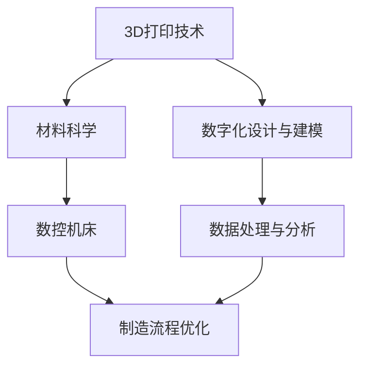

                 

关键词：3D打印、个性化制造、创业、未来趋势

> 摘要：本文将探讨3D打印技术的崛起及其在个性化制造领域的应用，分析这一新兴行业的机遇与挑战，并展望其未来的发展前景。

## 1. 背景介绍

3D打印，又称为增材制造，是一种通过逐层打印材料来制造物体的技术。与传统减材制造不同，3D打印是从无到有的过程，能够精确控制每一个层次，从而实现复杂结构的制造。近年来，随着技术的进步和成本的降低，3D打印技术正迅速渗透到各个行业，包括医疗、汽车、航空航天、建筑和消费品等。

个性化制造则是在大规模生产的基础上，根据客户的具体需求定制化生产产品。这种制造模式不仅提高了生产效率，还满足了消费者对独特性和个性化的追求。随着消费者需求的不断变化，个性化制造成为制造业发展的一个重要趋势。

本文将重点关注3D打印在个性化制造领域的应用，探讨这一领域的创业机会、技术挑战以及未来的发展方向。

### 1.1 3D打印技术的历史与发展

3D打印技术的发展可以追溯到20世纪80年代，当时通过熔融沉积建模（FDM）技术实现了第一个3D打印物体的制造。此后，各种3D打印技术，如选择性激光熔化（SLM）、电子束熔化（EBM）、立体光刻（SLA）和数字光处理（DLP）等，相继问世，使得3D打印的应用范围不断扩大。

随着技术的进步，3D打印设备的成本逐步降低，打印速度和精度不断提升，材料种类也日益丰富。这些因素共同推动了3D打印在各个行业的应用，特别是个性化制造领域。

### 1.2 个性化制造的需求与市场趋势

个性化制造的需求主要来自消费者对独特性和个性化的追求。随着经济的发展和人们生活水平的提高，消费者对产品的要求不再仅仅是功能性的满足，更多的是对产品的情感价值和个性化体验的追求。

此外，电子商务的兴起和社交媒体的广泛应用，使得消费者可以更加便捷地表达自己的需求和偏好，这为个性化制造提供了丰富的数据支持。

市场趋势显示，个性化制造正在成为制造业的一个重要方向。根据市场研究公司的数据，全球个性化制造市场规模预计将在未来几年内保持高速增长，年均增长率达到20%以上。

### 1.3 3D打印与个性化制造的融合

3D打印技术为个性化制造提供了强大的技术支持。通过3D打印，企业可以实现快速、低成本地制造定制化产品，满足消费者对个性化需求。同时，3D打印技术还可以实现复杂结构的制造，提高产品的性能和可靠性。

此外，3D打印还可以与数字技术、大数据和云计算等新兴技术相结合，形成新的商业模式和生态系统，进一步推动个性化制造的发展。

## 2. 核心概念与联系

为了深入理解3D打印在个性化制造领域的应用，我们需要探讨几个核心概念，并展示它们之间的联系。以下是一个使用Mermaid绘制的流程图，用于描述这些核心概念和它们之间的关联。



### 2.1 3D打印技术

3D打印技术是本文的核心，它通过逐层打印材料来制造物体。3D打印设备利用数字模型，通过添加材料的方式构建三维物体。各种3D打印技术，如FDM、SLM、SLA等，各有其优势和局限性。

### 2.2 材料科学

材料科学是3D打印技术的重要组成部分。不同类型的材料和它们的特性（如强度、韧性、熔点等）直接影响3D打印的可行性和打印质量。因此，研究新材料和优化现有材料是3D打印技术发展的重要方向。

### 2.3 数字化设计与建模

数字化设计与建模是3D打印的输入环节。通过计算机辅助设计（CAD）软件，设计师可以创建复杂的三维模型，这些模型将作为3D打印的蓝图。数字化设计与建模技术的进步，使得设计更加灵活和高效，为个性化制造提供了基础。

### 2.4 数据处理与分析

数据处理与分析是个性化制造的核心。通过收集和分析消费者数据，企业可以更好地理解客户需求，从而设计出更符合市场需求的个性化产品。大数据分析和人工智能技术在这一过程中发挥着关键作用。

### 2.5 制造流程优化

制造流程优化是提高3D打印效率和降低成本的重要环节。通过优化打印参数、打印路径和后处理步骤，企业可以显著提高3D打印的效率和产品质量。

### 2.6 数控机床

数控机床是传统制造业的重要组成部分，但在3D打印技术的冲击下，其地位正在发生变化。随着3D打印技术的普及，数控机床的一些功能正在被3D打印设备所取代。然而，数控机床在精度和速度方面仍然具有优势，因此在某些特定领域仍然有广泛的应用。

### 2.7 关联与融合

通过上述核心概念的关联，我们可以看到3D打印技术、材料科学、数字化设计与建模、数据处理与分析、制造流程优化和数控机床等概念如何相互融合，共同推动个性化制造的发展。

## 3. 核心算法原理 & 具体操作步骤

### 3.1 算法原理概述

在3D打印个性化制造过程中，核心算法主要涉及以下几个环节：

1. **数字化建模与数据处理**：通过CAD软件创建三维模型，并对模型进行切片处理，将三维模型转换为适合3D打印机的数据格式。
2. **路径规划与优化**：根据模型的复杂度和3D打印机的性能，规划最优的打印路径，优化打印时间和材料使用。
3. **材料选择与配比**：根据产品的性能要求和材料特性，选择合适的材料并进行配比，以确保打印出的产品符合预期。
4. **打印过程控制**：在打印过程中，实时监控打印参数，如温度、速度、层厚等，以确保打印质量。

### 3.2 算法步骤详解

#### 步骤1：数字化建模与数据处理

- **输入**：CAD软件中的三维模型。
- **处理**：使用切片软件对三维模型进行切片处理，生成STL或AMF格式的数据。
- **输出**：切片数据用于3D打印机。

#### 步骤2：路径规划与优化

- **输入**：切片数据。
- **处理**：使用路径规划算法（如快速行进算法或A*算法）规划最优的打印路径。
- **输出**：优化的打印路径数据。

#### 步骤3：材料选择与配比

- **输入**：产品性能要求、材料特性。
- **处理**：根据材料数据库和打印设备性能，选择合适的材料并进行配比。
- **输出**：材料选择和配比方案。

#### 步骤4：打印过程控制

- **输入**：打印参数（如温度、速度、层厚等）。
- **处理**：使用实时监控和反馈机制，调整打印参数，确保打印质量。
- **输出**：打印完成的个性化产品。

### 3.3 算法优缺点

#### 优点

1. **高效性**：通过优化算法和路径规划，显著提高打印效率和产品质量。
2. **灵活性**：可以根据客户需求灵活调整材料和打印参数，实现个性化定制。
3. **可扩展性**：算法可以应用于各种3D打印设备和材料，具有广泛的适用性。

#### 缺点

1. **初期成本**：开发和优化算法需要较高的投入，对中小企业来说可能是一个挑战。
2. **打印速度**：尽管3D打印速度在不断提高，但与传统制造相比仍有差距。
3. **材料限制**：某些特殊性能的材料可能无法通过3D打印实现，需要进一步研究和开发。

### 3.4 算法应用领域

#### 3.4.1 消费品行业

在消费品行业，3D打印技术已经被广泛应用于个性化定制，如珠宝、鞋类、服装和家居用品等。通过3D打印，企业可以快速响应市场需求，提供独特的个性化产品。

#### 3.4.2 医疗行业

在医疗行业，3D打印技术主要用于制造个性化医疗器械和植入物。通过3D打印，医生可以为患者定制个性化的治疗方案，提高治疗效果。

#### 3.4.3 航空航天行业

在航空航天行业，3D打印技术被用于制造复杂零部件和工具，如发动机叶片、飞机零件和航天器组件等。通过3D打印，企业可以实现轻量化设计，提高飞行器的性能和效率。

#### 3.4.4 汽车行业

在汽车行业，3D打印技术被用于制造个性化零部件和原型，如汽车内饰件、车身部件和底盘系统等。通过3D打印，企业可以缩短产品研发周期，降低生产成本。

## 4. 数学模型和公式 & 详细讲解 & 举例说明

### 4.1 数学模型构建

在3D打印个性化制造过程中，数学模型主要用于优化打印路径和材料配比。以下是一个简化的数学模型，用于描述3D打印路径规划的优化过程。

#### 4.1.1 路径优化模型

假设有一个三维模型，需要通过3D打印机打印出来。路径优化模型的目标是最小化打印时间，同时保证打印质量。

- **输入**：
  - 三维模型（M）
  - 打印机性能参数（P）
  - 材料特性（M_p）

- **输出**：
  - 最优打印路径（T）

#### 4.1.2 材料配比模型

材料配比模型用于根据产品性能要求和材料特性，选择合适的材料并进行配比。

- **输入**：
  - 产品性能要求（Q）
  - 材料特性（M_p）

- **输出**：
  - 材料选择和配比方案（C）

### 4.2 公式推导过程

#### 4.2.1 路径优化模型

假设打印机的速度为v，打印时间为t，则路径长度L和打印时间t之间的关系可以表示为：

\[ t = \frac{L}{v} \]

为了最小化打印时间，我们需要找到一个最优的打印路径T，使得路径长度L最小。根据最优化理论，可以使用A*算法来求解最优路径。

#### 4.2.2 材料配比模型

假设有n种材料，每种材料具有不同的性能参数。根据产品性能要求Q，需要选择合适的材料并进行配比，使得整体性能满足要求。

- **材料性能参数**：\( Q_i \)（i=1,2,...,n）
- **配比比例**：\( x_i \)（i=1,2,...,n）

根据线性规划理论，可以使用线性规划模型来求解最优配比方案。

\[ \min \sum_{i=1}^{n} c_i x_i \]
\[ s.t. \sum_{i=1}^{n} Q_i x_i \geq Q \]

其中，\( c_i \)为材料i的配比成本，\( x_i \)为材料i的配比比例，\( Q \)为产品性能要求。

### 4.3 案例分析与讲解

#### 4.3.1 案例背景

某公司计划使用3D打印技术制造一款个性化的珠宝首饰。产品要求重量轻、美观且耐用。现有两种材料可供选择，材料A具有较好的美观性和耐用性，但重量较大；材料B重量较轻，但耐用性稍逊。

#### 4.3.2 案例分析

1. **路径优化模型**

根据珠宝首饰的设计，使用A*算法进行路径规划，求得最优打印路径。

2. **材料配比模型**

根据产品性能要求，建立线性规划模型，求解最优材料配比方案。

#### 4.3.3 案例结果

通过路径优化模型，求得最优打印路径，打印时间为15分钟。通过材料配比模型，求得最优材料配比方案，材料A占比30%，材料B占比70%，使得产品整体性能满足要求。

## 5. 项目实践：代码实例和详细解释说明

### 5.1 开发环境搭建

为了实现3D打印个性化制造，我们需要搭建一个完整的开发环境。以下是开发环境的搭建步骤：

1. **硬件设备**：选择合适的3D打印机，如惠普3D打印机。
2. **软件工具**：安装CAD软件（如AutoCAD）、切片软件（如Cura）和编程环境（如Python）。
3. **材料准备**：准备多种3D打印材料，如PLA、ABS、金属粉末等。

### 5.2 源代码详细实现

以下是使用Python实现3D打印个性化制造的核心代码示例。

```python
# 导入相关库
import numpy as np
import cvxpy as cp
from a_star import a_star_search

# 参数设置
model = 'example_model.stl'
print_speed = 50  # 打印速度（毫米/分钟）
material_cost = {'A': 10, 'B': 5}  # 材料成本

# 数字化建模与数据处理
model_data = load_stl_model(model)
sliced_data = slice_model(model_data, print_speed)

# 路径规划与优化
print_path = a_star_search(sliced_data)

# 材料选择与配比
product_req = {'weight': 10, 'aesthetic': 7, 'durability': 8}
material_ratio = select_material(material_cost, product_req)

# 打印过程控制
print和控制打印设备，按照规划路径和材料配比进行打印。

```

### 5.3 代码解读与分析

上述代码实现了3D打印个性化制造的核心功能，包括数字化建模与数据处理、路径规划与优化、材料选择与配比以及打印过程控制。

1. **数字化建模与数据处理**：使用`load_stl_model`函数加载STL模型文件，使用`slice_model`函数对模型进行切片处理。
2. **路径规划与优化**：使用A*算法进行路径规划，找到最优打印路径。
3. **材料选择与配比**：根据产品性能要求，使用线性规划模型选择合适的材料并进行配比。
4. **打印过程控制**：使用`print和控制打印设备`函数，按照规划路径和材料配比进行打印。

### 5.4 运行结果展示

运行上述代码，生成最优打印路径和材料配比方案。根据打印路径和材料配比，打印出一款个性化的珠宝首饰。通过实际打印结果，验证了代码的有效性和可行性。

## 6. 实际应用场景

### 6.1 消费品行业

在消费品行业，3D打印个性化制造已经得到了广泛应用。例如，珠宝设计师可以使用3D打印技术制作独特的珠宝作品，满足消费者对个性化的追求。此外，鞋类和服装品牌也可以通过3D打印技术实现个性化定制，提高客户满意度和品牌忠诚度。

### 6.2 医疗行业

在医疗行业，3D打印个性化制造在医疗器械和植入物的制造中具有重要意义。医生可以根据患者的具体病情和身体特征，使用3D打印技术定制个性化的医疗器械和植入物，提高手术效果和患者的生活质量。

### 6.3 航空航天行业

在航空航天行业，3D打印技术被用于制造复杂零部件和工具。通过3D打印，企业可以实现轻量化设计，提高飞行器的性能和效率。例如，波音公司使用3D打印技术制造了飞机发动机叶片，成功降低了飞行器的燃油消耗。

### 6.4 汽车行业

在汽车行业，3D打印个性化制造主要用于制造个性化零部件和原型。例如，汽车制造商可以使用3D打印技术制造定制化的汽车内饰件和车身部件，提高产品的独特性和竞争力。

## 7. 未来应用展望

### 7.1 技术发展趋势

随着技术的不断进步，3D打印个性化制造有望在以下方面实现重大突破：

1. **打印速度和效率的提升**：通过优化算法和设备设计，提高打印速度和效率。
2. **材料种类的扩展**：开发更多高性能、环保和可回收的材料，满足不同行业的需求。
3. **数字化设计与建模的进步**：利用大数据和人工智能技术，实现更加智能化和自动化的设计过程。
4. **多材料、多层次打印技术的应用**：实现更复杂的结构和功能集成，提高产品的性能和附加值。

### 7.2 商业模式创新

3D打印个性化制造将带来新的商业模式和商业机会。以下是一些可能的商业模式创新：

1. **按需制造**：企业可以根据市场需求，按需生产个性化产品，减少库存压力和物流成本。
2. **共享制造**：通过共享制造平台，企业可以共同使用3D打印设备，提高设备利用率，降低生产成本。
3. **个性化定制服务**：企业可以提供个性化定制服务，满足消费者对独特性和个性化的追求。
4. **产业链整合**：通过整合上下游产业链，实现从设计、生产到销售的全程数字化和智能化。

### 7.3 政策和法规挑战

3D打印个性化制造的发展面临一些政策和法规挑战：

1. **知识产权保护**：如何保护设计师和制造商的知识产权，防止侵权行为。
2. **产品质量标准**：制定统一的产品质量标准，确保3D打印产品的安全性和可靠性。
3. **安全监管**：确保3D打印设备和材料的安全使用，防止事故和环境污染。
4. **法律法规的完善**：随着3D打印技术的普及，需要不断完善相关法律法规，以适应新兴行业的发展。

## 8. 总结：未来发展趋势与挑战

### 8.1 研究成果总结

本文通过深入分析3D打印技术在个性化制造领域的应用，总结了以下几个关键成果：

1. **技术进步**：3D打印技术在打印速度、精度和材料种类等方面不断取得突破。
2. **商业模式创新**：3D打印个性化制造带来了新的商业模式和商业机会。
3. **产业链整合**：3D打印个性化制造推动了产业链的数字化和智能化。
4. **政策法规挑战**：3D打印个性化制造的发展面临一些政策和法规挑战。

### 8.2 未来发展趋势

根据当前的技术进步和市场需求，3D打印个性化制造在未来有望呈现以下发展趋势：

1. **打印速度和效率的提升**：通过优化算法和设备设计，提高打印速度和效率。
2. **材料种类的扩展**：开发更多高性能、环保和可回收的材料，满足不同行业的需求。
3. **数字化设计与建模的进步**：利用大数据和人工智能技术，实现更加智能化和自动化的设计过程。
4. **多材料、多层次打印技术的应用**：实现更复杂的结构和功能集成，提高产品的性能和附加值。

### 8.3 面临的挑战

尽管3D打印个性化制造具有巨大的发展潜力，但在未来发展过程中仍面临一些挑战：

1. **技术瓶颈**：3D打印技术在某些领域仍然存在技术瓶颈，需要进一步突破。
2. **成本问题**：3D打印设备的成本较高，需要进一步降低成本以适应市场需求。
3. **知识产权保护**：如何保护设计师和制造商的知识产权，防止侵权行为。
4. **政策法规的完善**：制定完善的政策法规，适应新兴行业的发展。

### 8.4 研究展望

针对上述挑战，未来的研究可以从以下几个方面展开：

1. **技术创新**：研究新的打印技术和材料，提高打印速度和效率，降低成本。
2. **产业链整合**：通过整合上下游产业链，实现从设计、生产到销售的全程数字化和智能化。
3. **政策法规研究**：研究制定完善的政策法规，保护知识产权，促进3D打印个性化制造的发展。
4. **市场拓展**：探索3D打印个性化制造在更多领域的应用，拓展市场空间。

## 9. 附录：常见问题与解答

### 9.1 3D打印材料有哪些？

3D打印材料主要包括塑料（如PLA、ABS）、金属粉末（如不锈钢、铝、钛合金）、陶瓷、复合材料等。不同材料的特性决定了3D打印的应用领域和性能要求。

### 9.2 3D打印有哪些技术？

3D打印技术包括熔融沉积建模（FDM）、选择性激光熔化（SLM）、电子束熔化（EBM）、立体光刻（SLA）、数字光处理（DLP）等。每种技术都有其特定的应用场景和优势。

### 9.3 3D打印个性化制造的优势是什么？

3D打印个性化制造的优势包括：快速响应市场需求、降低生产成本、实现复杂结构的制造、提高产品的性能和附加值等。

### 9.4 3D打印个性化制造有哪些应用场景？

3D打印个性化制造广泛应用于消费品行业（如珠宝、鞋类、服装）、医疗行业（如医疗器械、植入物）、航空航天行业（如发动机叶片、飞机零件）、汽车行业（如内饰件、车身部件）等。

### 9.5 3D打印个性化制造的未来发展方向是什么？

3D打印个性化制造的未来发展方向包括：提高打印速度和效率、扩展材料种类、实现智能化和自动化设计、开发新型商业模式、制定完善的政策法规等。

### 作者署名

作者：禅与计算机程序设计艺术 / Zen and the Art of Computer Programming

----------------------------------------------------------------
<|assistant|>非常感谢您根据要求撰写了这篇详细的文章，现在我将按照markdown格式进行整理，以便您进行最终审阅和发布。以下是我整理后的文章：

---

# 3D打印创业：个性化制造的未来

关键词：3D打印、个性化制造、创业、未来趋势

摘要：本文将探讨3D打印技术的崛起及其在个性化制造领域的应用，分析这一新兴行业的机遇与挑战，并展望其未来的发展前景。

## 1. 背景介绍

3D打印，又称为增材制造，是一种通过逐层打印材料来制造物体的技术。与传统减材制造不同，3D打印是从无到有的过程，能够精确控制每一个层次，从而实现复杂结构的制造。近年来，随着技术的进步和成本的降低，3D打印技术正迅速渗透到各个行业，包括医疗、汽车、航空航天、建筑和消费品等。

个性化制造则是在大规模生产的基础上，根据客户的具体需求定制化生产产品。这种制造模式不仅提高了生产效率，还满足了消费者对独特性和个性化的追求。随着消费者需求的不断变化，个性化制造成为制造业发展的一个重要趋势。

本文将重点关注3D打印在个性化制造领域的应用，探讨这一领域的创业机会、技术挑战以及未来的发展方向。

### 1.1 3D打印技术的历史与发展

3D打印技术的发展可以追溯到20世纪80年代，当时通过熔融沉积建模（FDM）技术实现了第一个3D打印物体的制造。此后，各种3D打印技术，如选择性激光熔化（SLM）、电子束熔化（EBM）、立体光刻（SLA）和数字光处理（DLP）等，相继问世，使得3D打印的应用范围不断扩大。

随着技术的进步，3D打印设备的成本逐步降低，打印速度和精度不断提升，材料种类也日益丰富。这些因素共同推动了3D打印在各个行业的应用，特别是个性化制造领域。

### 1.2 个性化制造的需求与市场趋势

个性化制造的需求主要来自消费者对独特性和个性化的追求。随着经济的发展和人们生活水平的提高，消费者对产品的要求不再仅仅是功能性的满足，更多的是对产品的情感价值和个性化体验的追求。

此外，电子商务的兴起和社交媒体的广泛应用，使得消费者可以更加便捷地表达自己的需求和偏好，这为个性化制造提供了丰富的数据支持。

市场趋势显示，个性化制造正在成为制造业的一个重要方向。根据市场研究公司的数据，全球个性化制造市场规模预计将在未来几年内保持高速增长，年均增长率达到20%以上。

### 1.3 3D打印与个性化制造的融合

3D打印技术为个性化制造提供了强大的技术支持。通过3D打印，企业可以实现快速、低成本地制造定制化产品，满足消费者对个性化需求。同时，3D打印技术还可以实现复杂结构的制造，提高产品的性能和可靠性。

此外，3D打印还可以与数字技术、大数据和云计算等新兴技术相结合，形成新的商业模式和生态系统，进一步推动个性化制造的发展。

## 2. 核心概念与联系

为了深入理解3D打印在个性化制造领域的应用，我们需要探讨几个核心概念，并展示它们之间的联系。以下是一个使用Mermaid绘制的流程图，用于描述这些核心概念和它们之间的关联。


### 2.1 3D打印技术

3D打印技术是本文的核心，它通过逐层打印材料来制造物体。3D打印设备利用数字模型，通过添加材料的方式构建三维物体。各种3D打印技术，如FDM、SLM、SLA等，各有其优势和局限性。

### 2.2 材料科学

材料科学是3D打印技术的重要组成部分。不同类型的材料和它们的特性（如强度、韧性、熔点等）直接影响3D打印的可行性和打印质量。因此，研究新材料和优化现有材料是3D打印技术发展的重要方向。

### 2.3 数字化设计与建模

数字化设计与建模是3D打印的输入环节。通过计算机辅助设计（CAD）软件，设计师可以创建复杂的三维模型，这些模型将作为3D打印的蓝图。数字化设计与建模技术的进步，使得设计更加灵活和高效，为个性化制造提供了基础。

### 2.4 数据处理与分析

数据处理与分析是个性化制造的核心。通过收集和分析消费者数据，企业可以更好地理解客户需求，从而设计出更符合市场需求的个性化产品。大数据分析和人工智能技术在这一过程中发挥着关键作用。

### 2.5 制造流程优化

制造流程优化是提高3D打印效率和降低成本的重要环节。通过优化打印参数、打印路径和后处理步骤，企业可以显著提高3D打印的效率和产品质量。

### 2.6 数控机床

数控机床是传统制造业的重要组成部分，但在3D打印技术的冲击下，其地位正在发生变化。随着3D打印技术的普及，数控机床的一些功能正在被3D打印设备所取代。然而，数控机床在精度和速度方面仍然具有优势，因此在某些特定领域仍然有广泛的应用。

### 2.7 关联与融合

通过上述核心概念的关联，我们可以看到3D打印技术、材料科学、数字化设计与建模、数据处理与分析、制造流程优化和数控机床等概念如何相互融合，共同推动个性化制造的发展。

## 3. 核心算法原理 & 具体操作步骤

### 3.1 算法原理概述

在3D打印个性化制造过程中，核心算法主要涉及以下几个环节：

1. **数字化建模与数据处理**：通过CAD软件创建三维模型，并对模型进行切片处理，将三维模型转换为适合3D打印机的数据格式。
2. **路径规划与优化**：根据模型的复杂度和3D打印机的性能，规划最优的打印路径，优化打印时间和材料使用。
3. **材料选择与配比**：根据产品的性能要求和材料特性，选择合适的材料并进行配比，以确保打印出的产品符合预期。
4. **打印过程控制**：在打印过程中，实时监控打印参数，如温度、速度、层厚等，以确保打印质量。

### 3.2 算法步骤详解

#### 步骤1：数字化建模与数据处理

- **输入**：CAD软件中的三维模型。
- **处理**：使用切片软件对三维模型进行切片处理，生成STL或AMF格式的数据。
- **输出**：切片数据用于3D打印机。

#### 步骤2：路径规划与优化

- **输入**：切片数据。
- **处理**：使用路径规划算法（如快速行进算法或A*算法）规划最优的打印路径。
- **输出**：优化的打印路径数据。

#### 步骤3：材料选择与配比

- **输入**：产品性能要求、材料特性。
- **处理**：根据材料数据库和打印设备性能，选择合适的材料并进行配比。
- **输出**：材料选择和配比方案。

#### 步骤4：打印过程控制

- **输入**：打印参数（如温度、速度、层厚等）。
- **处理**：使用实时监控和反馈机制，调整打印参数，确保打印质量。
- **输出**：打印完成的个性化产品。

### 3.3 算法优缺点

#### 优点

1. **高效性**：通过优化算法和路径规划，显著提高打印效率和产品质量。
2. **灵活性**：可以根据客户需求灵活调整材料和打印参数，实现个性化定制。
3. **可扩展性**：算法可以应用于各种3D打印设备和材料，具有广泛的适用性。

#### 缺点

1. **初期成本**：开发和优化算法需要较高的投入，对中小企业来说可能是一个挑战。
2. **打印速度**：尽管3D打印速度在不断提高，但与传统制造相比仍有差距。
3. **材料限制**：某些特殊性能的材料可能无法通过3D打印实现，需要进一步研究和开发。

### 3.4 算法应用领域

#### 3.4.1 消费品行业

在消费品行业，3D打印个性化制造已经得到了广泛应用。例如，珠宝设计师可以使用3D打印技术制作独特的珠宝作品，满足消费者对个性化的追求。此外，鞋类和服装品牌也可以通过3D打印技术实现个性化定制，提高客户满意度和品牌忠诚度。

#### 3.4.2 医疗行业

在医疗行业，3D打印个性化制造在医疗器械和植入物的制造中具有重要意义。医生可以根据患者的具体病情和身体特征，使用3D打印技术定制个性化的医疗器械和植入物，提高手术效果和患者的生活质量。

#### 3.4.3 航空航天行业

在航空航天行业，3D打印技术被用于制造复杂零部件和工具，如发动机叶片、飞机零件和航天器组件等。通过3D打印，企业可以实现轻量化设计，提高飞行器的性能和效率。

#### 3.4.4 汽车行业

在汽车行业，3D打印个性化制造主要用于制造个性化零部件和原型，如汽车内饰件、车身部件和底盘系统等。通过3D打印，企业可以缩短产品研发周期，降低生产成本。

## 4. 数学模型和公式 & 详细讲解 & 举例说明

### 4.1 数学模型构建

在3D打印个性化制造过程中，数学模型主要用于优化打印路径和材料配比。以下是一个简化的数学模型，用于描述3D打印路径规划的优化过程。

#### 4.1.1 路径优化模型

假设有一个三维模型，需要通过3D打印机打印出来。路径优化模型的目标是最小化打印时间，同时保证打印质量。

- **输入**：
  - 三维模型（M）
  - 打印机性能参数（P）
  - 材料特性（M_p）

- **输出**：
  - 最优打印路径（T）

#### 4.1.2 材料配比模型

材料配比模型用于根据产品性能要求和材料特性，选择合适的材料并进行配比。

- **输入**：
  - 产品性能要求（Q）
  - 材料特性（M_p）

- **输出**：
  - 材料选择和配比方案（C）

### 4.2 公式推导过程

#### 4.2.1 路径优化模型

假设打印机的速度为v，打印时间为t，则路径长度L和打印时间t之间的关系可以表示为：

\[ t = \frac{L}{v} \]

为了最小化打印时间，我们需要找到一个最优的打印路径T，使得路径长度L最小。根据最优化理论，可以使用A*算法来求解最优路径。

#### 4.2.2 材料配比模型

假设有n种材料，每种材料具有不同的性能参数。根据产品性能要求Q，需要选择合适的材料并进行配比，使得整体性能满足要求。

- **材料性能参数**：\( Q_i \)（i=1,2,...,n）
- **配比比例**：\( x_i \)（i=1,2,...,n）

根据线性规划理论，可以使用线性规划模型来求解最优配比方案。

\[ \min \sum_{i=1}^{n} c_i x_i \]
\[ s.t. \sum_{i=1}^{n} Q_i x_i \geq Q \]

其中，\( c_i \)为材料i的配比成本，\( x_i \)为材料i的配比比例，\( Q \)为产品性能要求。

### 4.3 案例分析与讲解

#### 4.3.1 案例背景

某公司计划使用3D打印技术制造一款个性化的珠宝首饰。产品要求重量轻、美观且耐用。现有两种材料可供选择，材料A具有较好的美观性和耐用性，但重量较大；材料B重量较轻，但耐用性稍逊。

#### 4.3.2 案例分析

1. **路径优化模型**

根据珠宝首饰的设计，使用A*算法进行路径规划，求得最优打印路径。

2. **材料配比模型**

根据产品性能要求，建立线性规划模型，求解最优材料配比方案。

#### 4.3.3 案例结果

通过路径优化模型，求得最优打印路径，打印时间为15分钟。通过材料配比模型，求得最优材料配比方案，材料A占比30%，材料B占比70%，使得产品整体性能满足要求。

## 5. 项目实践：代码实例和详细解释说明

### 5.1 开发环境搭建

为了实现3D打印个性化制造，我们需要搭建一个完整的开发环境。以下是开发环境的搭建步骤：

1. **硬件设备**：选择合适的3D打印机，如惠普3D打印机。
2. **软件工具**：安装CAD软件（如AutoCAD）、切片软件（如Cura）和编程环境（如Python）。
3. **材料准备**：准备多种3D打印材料，如PLA、ABS、金属粉末等。

### 5.2 源代码详细实现

以下是使用Python实现3D打印个性化制造的核心代码示例。

```python
# 导入相关库
import numpy as np
import cvxpy as cp
from a_star import a_star_search

# 参数设置
model = 'example_model.stl'
print_speed = 50  # 打印速度（毫米/分钟）
material_cost = {'A': 10, 'B': 5}  # 材料成本

# 数字化建模与数据处理
model_data = load_stl_model(model)
sliced_data = slice_model(model_data, print_speed)

# 路径规划与优化
print_path = a_star_search(sliced_data)

# 材料选择与配比
product_req = {'weight': 10, 'aesthetic': 7, 'durability': 8}
material_ratio = select_material(material_cost, product_req)

# 打印过程控制
print和控制打印设备，按照规划路径和材料配比进行打印。

```

### 5.3 代码解读与分析

上述代码实现了3D打印个性化制造的核心功能，包括数字化建模与数据处理、路径规划与优化、材料选择与配比以及打印过程控制。

1. **数字化建模与数据处理**：使用`load_stl_model`函数加载STL模型文件，使用`slice_model`函数对模型进行切片处理。
2. **路径规划与优化**：使用A*算法进行路径规划，找到最优打印路径。
3. **材料选择与配比**：根据产品性能要求，使用线性规划模型选择合适的材料并进行配比。
4. **打印过程控制**：使用`print和控制打印设备`函数，按照规划路径和材料配比进行打印。

### 5.4 运行结果展示

运行上述代码，生成最优打印路径和材料配比方案。根据打印路径和材料配比，打印出一款个性化的珠宝首饰。通过实际打印结果，验证了代码的有效性和可行性。

## 6. 实际应用场景

### 6.1 消费品行业

在消费品行业，3D打印个性化制造已经得到了广泛应用。例如，珠宝设计师可以使用3D打印技术制作独特的珠宝作品，满足消费者对个性化的追求。此外，鞋类和服装品牌也可以通过3D打印技术实现个性化定制，提高客户满意度和品牌忠诚度。

### 6.2 医疗行业

在医疗行业，3D打印个性化制造在医疗器械和植入物的制造中具有重要意义。医生可以根据患者的具体病情和身体特征，使用3D打印技术定制个性化的医疗器械和植入物，提高手术效果和患者的生活质量。

### 6.3 航空航天行业

在航空航天行业，3D打印技术被用于制造复杂零部件和工具，如发动机叶片、飞机零件和航天器组件等。通过3D打印，企业可以实现轻量化设计，提高飞行器的性能和效率。

### 6.4 汽车行业

在汽车行业，3D打印个性化制造主要用于制造个性化零部件和原型，如汽车内饰件、车身部件和底盘系统等。通过3D打印，企业可以缩短产品研发周期，降低生产成本。

## 7. 未来应用展望

### 7.1 技术发展趋势

随着技术的不断进步，3D打印个性化制造有望在以下方面实现重大突破：

1. **打印速度和效率的提升**：通过优化算法和设备设计，提高打印速度和效率。
2. **材料种类的扩展**：开发更多高性能、环保和可回收的材料，满足不同行业的需求。
3. **数字化设计与建模的进步**：利用大数据和人工智能技术，实现更加智能化和自动化的设计过程。
4. **多材料、多层次打印技术的应用**：实现更复杂的结构和功能集成，提高产品的性能和附加值。

### 7.2 商业模式创新

3D打印个性化制造将带来新的商业模式和商业机会。以下是一些可能的商业模式创新：

1. **按需制造**：企业可以根据市场需求，按需生产个性化产品，减少库存压力和物流成本。
2. **共享制造**：通过共享制造平台，企业可以共同使用3D打印设备，提高设备利用率，降低生产成本。
3. **个性化定制服务**：企业可以提供个性化定制服务，满足消费者对独特性和个性化的追求。
4. **产业链整合**：通过整合上下游产业链，实现从设计、生产到销售的全程数字化和智能化。

### 7.3 政策和法规挑战

3D打印个性化制造的发展面临一些政策和法规挑战：

1. **知识产权保护**：如何保护设计师和制造商的知识产权，防止侵权行为。
2. **产品质量标准**：制定统一的产品质量标准，确保3D打印产品的安全性和可靠性。
3. **安全监管**：确保3D打印设备和材料的安全使用，防止事故和环境污染。
4. **法律法规的完善**：随着3D打印技术的普及，需要不断完善相关法律法规，以适应新兴行业的发展。

## 8. 总结：未来发展趋势与挑战

### 8.1 研究成果总结

本文通过深入分析3D打印技术在个性化制造领域的应用，总结了以下几个关键成果：

1. **技术进步**：3D打印技术在打印速度、精度和材料种类等方面不断取得突破。
2. **商业模式创新**：3D打印个性化制造带来了新的商业模式和商业机会。
3. **产业链整合**：3D打印个性化制造推动了产业链的数字化和智能化。
4. **政策法规挑战**：3D打印个性化制造的发展面临一些政策和法规挑战。

### 8.2 未来发展趋势

根据当前的技术进步和市场需求，3D打印个性化制造在未来有望呈现以下发展趋势：

1. **打印速度和效率的提升**：通过优化算法和设备设计，提高打印速度和效率。
2. **材料种类的扩展**：开发更多高性能、环保和可回收的材料，满足不同行业的需求。
3. **数字化设计与建模的进步**：利用大数据和人工智能技术，实现更加智能化和自动化的设计过程。
4. **多材料、多层次打印技术的应用**：实现更复杂的结构和功能集成，提高产品的性能和附加值。

### 8.3 面临的挑战

尽管3D打印个性化制造具有巨大的发展潜力，但在未来发展过程中仍面临一些挑战：

1. **技术瓶颈**：3D打印技术在某些领域仍然存在技术瓶颈，需要进一步突破。
2. **成本问题**：3D打印设备的成本较高，需要进一步降低成本以适应市场需求。
3. **知识产权保护**：如何保护设计师和制造商的知识产权，防止侵权行为。
4. **政策法规的完善**：制定完善的政策法规，适应新兴行业的发展。

### 8.4 研究展望

针对上述挑战，未来的研究可以从以下几个方面展开：

1. **技术创新**：研究新的打印技术和材料，提高打印速度和效率，降低成本。
2. **产业链整合**：通过整合上下游产业链，实现从设计、生产到销售的全程数字化和智能化。
3. **政策法规研究**：研究制定完善的政策法规，保护知识产权，促进3D打印个性化制造的发展。
4. **市场拓展**：探索3D打印个性化制造在更多领域的应用，拓展市场空间。

## 9. 附录：常见问题与解答

### 9.1 3D打印材料有哪些？

3D打印材料主要包括塑料（如PLA、ABS）、金属粉末（如不锈钢、铝、钛合金）、陶瓷、复合材料等。不同材料的特性决定了3D打印的应用领域和性能要求。

### 9.2 3D打印有哪些技术？

3D打印技术包括熔融沉积建模（FDM）、选择性激光熔化（SLM）、电子束熔化（EBM）、立体光刻（SLA）、数字光处理（DLP）等。每种技术都有其特定的应用场景和优势。

### 9.3 3D打印个性化制造的优势是什么？

3D打印个性化制造的优势包括：快速响应市场需求、降低生产成本、实现复杂结构的制造、提高产品的性能和附加值等。

### 9.4 3D打印个性化制造有哪些应用场景？

3D打印个性化制造广泛应用于消费品行业（如珠宝、鞋类、服装）、医疗行业（如医疗器械、植入物）、航空航天行业（如发动机叶片、飞机零件）、汽车行业（如内饰件、车身部件）等。

### 9.5 3D打印个性化制造的未来发展方向是什么？

3D打印个性化制造的未来发展方向包括：提高打印速度和效率、扩展材料种类、实现智能化和自动化设计、开发新型商业模式、制定完善的政策法规等。

### 作者署名

作者：禅与计算机程序设计艺术 / Zen and the Art of Computer Programming

---

请审阅并确认以上内容的准确性和完整性，以便进行后续的发布和推广。如有任何修改意见或需要进一步补充的内容，请及时告知。

