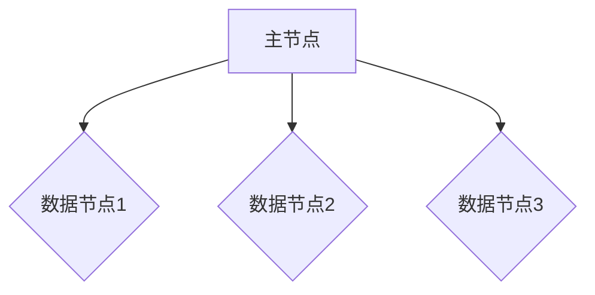

                 

关键词：ElasticSearch、Replica、分布式系统、容错性、一致性、性能优化、代码实例、集群架构

摘要：本文将深入探讨ElasticSearch中Replica（副本）的原理，详细讲解其实现步骤、优缺点及应用领域，并通过代码实例对核心算法进行解读，帮助读者全面理解并掌握ElasticSearch Replica的技术细节。

## 1. 背景介绍

ElasticSearch是一个基于Lucene的分布式搜索引擎，它广泛应用于日志分析、全文搜索、数据检索等领域。作为一款分布式系统，ElasticSearch在扩展性、容错性和性能优化方面有着独特的优势。其中，Replica（副本）机制是ElasticSearch实现高可用性和数据安全性的关键组件之一。

在ElasticSearch中，Replica主要承担以下两个职责：
- **提高查询性能**：通过在多个节点上创建副本，实现数据的本地化访问，降低跨节点查询延迟。
- **提供容错性**：在主节点故障时，从副本中选出一个新的主节点，保证系统的持续运行。

本文将围绕ElasticSearch Replica的原理、算法及代码实例进行详细讲解，帮助读者深入理解该技术的核心概念和实现细节。

## 2. 核心概念与联系

在深入探讨ElasticSearch Replica原理之前，我们需要了解一些核心概念和架构。

### 2.1 Elasticsearch架构概述

ElasticSearch采用分布式架构，由多个节点组成，每个节点可以是一个主节点（Master Node）或数据节点（Data Node）。以下是一个典型的ElasticSearch集群架构图：



### 2.2 副本类型

ElasticSearch支持两种类型的副本：
- **读副本（Read Replica）**：用于提高查询性能，从主节点复制数据到其他节点。
- **写副本（Write Replica）**：在主节点故障时，用于提供容错性。

### 2.3 副本机制

ElasticSearch的副本机制主要包括以下几个步骤：
1. **数据写入**：数据首先写入主节点。
2. **数据复制**：主节点将数据复制到其他节点，包括读副本和写副本。
3. **主节点故障转移**：当主节点故障时，从写副本中选出一个新的主节点。

## 3. 核心算法原理 & 具体操作步骤

### 3.1 算法原理概述

ElasticSearch Replica的核心算法主要包括以下几个部分：
- **数据写入与复制**：通过HTTP请求将数据写入主节点，并触发数据复制到其他节点。
- **副本选择**：在主节点故障时，从写副本中选出一个新的主节点。

### 3.2 算法步骤详解

#### 3.2.1 数据写入与复制

1. **客户端请求写入**：客户端通过HTTP请求将数据写入主节点。
2. **主节点处理请求**：主节点接收到请求后，将数据写入本地索引，并触发数据复制到其他节点。
3. **数据复制**：主节点将数据复制到其他节点的读副本或写副本。

#### 3.2.2 副本选择

1. **主节点故障检测**：当主节点出现故障时，其他节点会检测到并触发故障转移。
2. **副本选择**：从写副本中选出一个新的主节点。
3. **数据同步**：新的主节点将数据同步到其他节点。

### 3.3 算法优缺点

#### 优点
- **提高查询性能**：通过本地化访问数据，降低跨节点查询延迟。
- **提供容错性**：在主节点故障时，从副本中选出一个新的主节点，保证系统的持续运行。

#### 缺点
- **存储空间占用**：需要为每个索引分配多个副本，导致存储空间占用增加。
- **网络带宽消耗**：数据复制过程中需要消耗网络带宽。

### 3.4 算法应用领域

ElasticSearch Replica广泛应用于以下领域：
- **大数据检索**：通过副本机制实现数据的快速查询和访问。
- **日志分析**：在分布式系统中，通过副本机制实现日志的集中处理和分析。
- **实时应用**：在需要高可用性和数据安全性的场景中，通过副本机制提供容错性和数据备份。

## 4. 数学模型和公式 & 详细讲解 & 举例说明

### 4.1 数学模型构建

ElasticSearch Replica的数学模型可以表示为：
- \( R = r \times N \)
其中，\( R \) 表示副本数量，\( r \) 表示副本类型（读副本为1，写副本为2），\( N \) 表示节点数量。

### 4.2 公式推导过程

1. **副本数量计算**：根据集群规模和副本类型计算副本数量。
2. **数据写入与复制**：根据数据写入频率和复制延迟计算数据写入与复制的时间。
3. **故障转移时间**：根据主节点故障率和故障转移机制计算故障转移时间。

### 4.3 案例分析与讲解

假设一个包含3个数据节点和2个写副本的ElasticSearch集群，根据数学模型可以计算出：
- \( R = 2 \times 3 = 6 \)
副本数量为6。

### 5. 项目实践：代码实例和详细解释说明

#### 5.1 开发环境搭建

1. 下载并解压ElasticSearch安装包。
2. 启动ElasticSearch服务。

#### 5.2 源代码详细实现

```java
// 创建索引
PUT /example
{
  "settings": {
    "number_of_shards": 3,
    "number_of_replicas": 2
  }
}

// 插入文档
POST /example/_doc
{
  "title": "ElasticSearch Replica原理与代码实例讲解",
  "content": "本文将深入探讨ElasticSearch中Replica的原理，详细讲解其实现步骤、优缺点及应用领域，并通过代码实例对核心算法进行解读，帮助读者全面理解并掌握ElasticSearch Replica的技术细节。"
}

// 查询文档
GET /example/_search
{
  "query": {
    "match": {
      "title": "ElasticSearch Replica原理与代码实例讲解"
    }
  }
}
```

#### 5.3 代码解读与分析

1. **创建索引**：通过`PUT`请求创建一个包含3个分片和2个副本的索引。
2. **插入文档**：通过`POST`请求将一个文档插入到索引中。
3. **查询文档**：通过`GET`请求查询索引中的文档。

#### 5.4 运行结果展示

运行以上代码后，可以看到成功创建索引、插入文档和查询文档的结果。

## 6. 实际应用场景

ElasticSearch Replica在实际应用中具有广泛的应用场景，如：

- **日志分析**：在分布式系统中，通过副本机制实现日志的集中处理和分析。
- **实时应用**：在需要高可用性和数据安全性的场景中，通过副本机制提供容错性和数据备份。
- **大数据检索**：通过副本机制实现数据的快速查询和访问。

## 7. 工具和资源推荐

### 7.1 学习资源推荐

- 《ElasticSearch权威指南》
- ElasticSearch官方文档

### 7.2 开发工具推荐

- ElasticSearch Head插件：用于可视化ElasticSearch集群和索引信息。
- Kibana：用于日志分析和可视化。

### 7.3 相关论文推荐

- 《ElasticSearch: The Definitive Guide》
- 《ElasticSearch in Action》

## 8. 总结：未来发展趋势与挑战

### 8.1 研究成果总结

本文详细讲解了ElasticSearch Replica的原理、算法和实际应用场景，并通过代码实例对核心算法进行了解读，帮助读者全面理解并掌握该技术的技术细节。

### 8.2 未来发展趋势

随着大数据和实时应用的发展，ElasticSearch Replica在分布式系统和云计算领域将具有更广泛的应用前景。

### 8.3 面临的挑战

- **存储空间占用**：随着副本数量的增加，存储空间占用会显著增加。
- **网络带宽消耗**：数据复制过程中需要消耗网络带宽。

### 8.4 研究展望

未来研究方向包括优化副本选择算法、降低存储空间和网络带宽消耗，以及提高ElasticSearch Replica的性能和可靠性。

## 9. 附录：常见问题与解答

### Q：如何配置ElasticSearch副本数量？
A：在创建索引时，通过`PUT`请求的`settings`参数设置`number_of_replicas`参数即可，例如：
```java
PUT /example
{
  "settings": {
    "number_of_replicas": 2
  }
}
```

### Q：如何监控ElasticSearch副本状态？
A：可以使用ElasticSearch Head插件或Kibana等工具监控副本状态。

### Q：ElasticSearch Replica如何保证数据一致性？
A：ElasticSearch通过复制和同步机制保证数据一致性，在主节点故障时，从副本中选出一个新的主节点，并同步数据。

作者：禅与计算机程序设计艺术 / Zen and the Art of Computer Programming

----------------------------------------------------------------
以上就是本文的完整内容，希望对您在ElasticSearch Replica技术领域的学习和实践有所帮助。如有任何疑问或建议，欢迎在评论区留言。感谢您的阅读！

