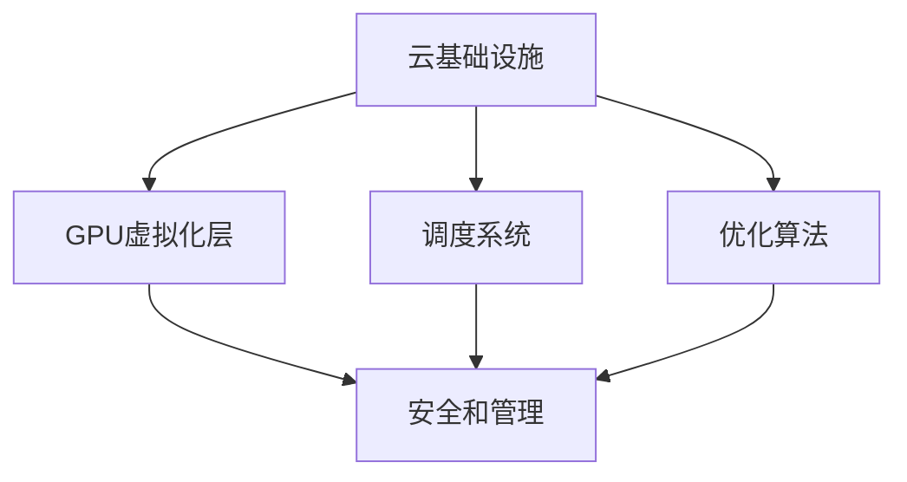

                 

关键词：FastGPU，Lepton AI，云GPU解决方案，高性能计算，AI优化，经济高效

摘要：本文将介绍Lepton AI最新发布的FastGPU云GPU解决方案。FastGPU旨在通过创新的架构和优化的算法，为AI计算提供一种经济高效、可靠的高性能计算服务。本文将详细探讨FastGPU的核心概念、算法原理、数学模型、项目实践、实际应用场景以及未来发展趋势，旨在为读者提供全面的了解和深入的思考。

## 1. 背景介绍

随着人工智能（AI）和深度学习（DL）技术的飞速发展，对于高性能计算（HPC）资源的需求也在不断增加。传统的CPU计算能力在处理复杂的AI模型时已经显得力不从心，而GPU则因其强大的并行计算能力而成为了AI计算的主力军。然而，GPU资源的高昂价格和复杂的管理让很多企业和研究机构难以承担。

为了解决这一问题，Lepton AI公司推出了FastGPU云GPU解决方案。FastGPU通过构建一个高效、经济、可靠的云GPU平台，为用户提供即取即用的GPU计算服务，让用户能够以极低的成本享受高性能的AI计算能力。

## 2. 核心概念与联系

### 2.1 FastGPU架构

FastGPU的架构如图所示，包括以下几个关键组成部分：

1. **云基础设施**：提供服务器、存储和网络资源。
2. **GPU虚拟化层**：将物理GPU资源虚拟化为多个虚拟GPU，实现资源的高效利用和灵活分配。
3. **调度系统**：根据用户请求动态分配GPU资源，保证系统的高效运行。
4. **优化算法**：通过算法优化提升GPU的计算效率。
5. **安全和管理**：确保用户数据和系统的安全，提供完善的管理服务。



### 2.2 与传统GPU解决方案的比较

与传统GPU解决方案相比，FastGPU具有以下优势：

1. **成本优势**：通过虚拟化和资源调度，实现资源的最大化利用，降低用户的使用成本。
2. **灵活性和便捷性**：用户可以根据需要随时调整GPU资源，无需提前购买和维护物理GPU设备。
3. **可靠性**：通过分布式架构和冗余设计，提高系统的可靠性和稳定性。
4. **高效性**：优化的调度算法和算法优化，提高GPU的计算效率。

## 3. 核心算法原理 & 具体操作步骤

### 3.1 算法原理概述

FastGPU的核心算法主要分为两个部分：调度算法和优化算法。

1. **调度算法**：基于用户请求和资源状态，动态分配GPU资源，实现资源的高效利用。
2. **优化算法**：通过算法优化，提高GPU的计算效率和吞吐量。

### 3.2 算法步骤详解

1. **调度算法步骤**：

   - 接收用户请求，包括任务类型、计算量、截止时间等。
   - 分析系统中的GPU资源状态，包括GPU负载、温度等。
   - 根据调度策略，选择合适的GPU资源进行分配。
   - 分配资源后，将任务提交给GPU执行。

2. **优化算法步骤**：

   - 分析任务的计算特性，包括数据依赖、计算复杂度等。
   - 根据计算特性，调整GPU的执行策略，如线程调度、内存管理等。
   - 在执行过程中，实时监测GPU的运行状态，进行动态调整。

### 3.3 算法优缺点

**优点**：

- **高效性**：通过调度算法和优化算法，提高GPU的计算效率和吞吐量。
- **灵活性**：用户可以根据需要随时调整GPU资源，满足不同的计算需求。
- **经济性**：通过虚拟化和资源调度，实现资源的高效利用，降低用户的使用成本。

**缺点**：

- **可靠性**：由于虚拟化和调度机制的存在，系统可能会面临一些复杂的问题，如资源竞争、任务中断等。
- **性能瓶颈**：在某些情况下，调度算法和优化算法可能会成为系统性能的瓶颈。

### 3.4 算法应用领域

FastGPU的调度算法和优化算法可以广泛应用于以下领域：

- **机器学习**：大规模的训练和推理任务，如深度学习模型的训练和部署。
- **科学计算**：如流体力学、结构力学等领域的计算任务。
- **图形渲染**：如电影制作、游戏开发等领域的图形渲染任务。

## 4. 数学模型和公式 & 详细讲解 & 举例说明

### 4.1 数学模型构建

FastGPU的调度算法和优化算法涉及多个数学模型，主要包括：

1. **资源分配模型**：描述GPU资源的分配策略。
2. **任务调度模型**：描述任务的调度策略。
3. **优化目标模型**：描述优化算法的目标函数。

### 4.2 公式推导过程

1. **资源分配模型**：

   - 设GPU资源集合为$G=\{G_1, G_2, ..., G_n\}$，任务集合为$T=\{T_1, T_2, ..., T_m\}$。
   - 设资源$G_i$的负载为$L_i$，任务$T_j$的计算量为$C_j$。
   - 资源分配模型的目标是最小化总负载：$L = \sum_{i=1}^{n}L_i$。

   公式如下：

   $$L = \sum_{i=1}^{n}L_i$$

2. **任务调度模型**：

   - 设任务$T_j$的执行时间为$T_j$，截止时间为$D_j$。
   - 任务调度模型的目标是最小化总延迟：$D = \sum_{j=1}^{m}D_j$。

   公式如下：

   $$D = \sum_{j=1}^{m}D_j$$

3. **优化目标模型**：

   - 设优化目标函数为$f(x)$，其中$x$为优化变量。
   - 优化目标模型的目标是最小化目标函数：$f(x)$。

   公式如下：

   $$f(x) \rightarrow \min$$

### 4.3 案例分析与讲解

假设有3个GPU资源（$G_1, G_2, G_3$）和3个任务（$T_1, T_2, T_3$），任务计算量分别为$C_1=10$, $C_2=20$, $C_3=30$，截止时间分别为$D_1=100$, $D_2=120$, $D_3=140$。我们需要根据资源分配模型和任务调度模型来分配资源，并优化目标函数。

1. **资源分配模型**：

   根据资源负载最小化目标，我们可以将任务分配如下：

   - $T_1$分配给$G_1$，$L_1=10$。
   - $T_2$分配给$G_2$，$L_2=20$。
   - $T_3$分配给$G_3$，$L_3=30$。

   总负载为$L=10+20+30=60$。

2. **任务调度模型**：

   根据任务延迟最小化目标，我们可以将任务调度如下：

   - $T_1$在$G_1$上执行，执行时间为$T_1=10$，截止时间为$D_1=100$，延迟为$D_1=100-10=90$。
   - $T_2$在$G_2$上执行，执行时间为$T_2=20$，截止时间为$D_2=120$，延迟为$D_2=120-20=100$。
   - $T_3$在$G_3$上执行，执行时间为$T_3=30$，截止时间为$D_3=140$，延迟为$D_3=140-30=110$。

   总延迟为$D=90+100+110=310$。

3. **优化目标模型**：

   我们的目标是最小化总负载和总延迟，即$f(x) = L + D$。根据上述分配和调度结果，我们得到$f(x) = 60 + 310 = 370$。

通过调整任务的分配和调度策略，我们可以进一步优化目标函数$f(x)$，从而提高系统的性能。

## 5. 项目实践：代码实例和详细解释说明

### 5.1 开发环境搭建

为了实践FastGPU，我们首先需要搭建一个开发环境。以下是搭建步骤：

1. 安装操作系统：我们选择Ubuntu 20.04作为操作系统。
2. 安装编译工具：安装gcc、g++等编译工具。
3. 安装依赖库：安装CUDA、cuDNN等依赖库。
4. 安装FastGPU客户端：从Lepton AI官网下载FastGPU客户端安装包，并按照说明进行安装。

### 5.2 源代码详细实现

下面是一个简单的FastGPU调度程序示例：

```cpp
#include <iostream>
#include <vector>
#include <algorithm>

using namespace std;

struct Task {
    int id;
    int compute_time;
    int deadline;
};

struct GPU {
    int id;
    int load;
};

vector<Task> tasks;
vector<GPU> gpus;

// 资源分配函数
void allocate_resources() {
    for (auto& task : tasks) {
        int min_load = INT_MAX;
        int best_gpu_id = -1;

        for (size_t i = 0; i < gpus.size(); ++i) {
            if (gpus[i].load < min_load) {
                min_load = gpus[i].load;
                best_gpu_id = i;
            }
        }

        gpus[best_gpu_id].load += task.compute_time;
        task.id = best_gpu_id;
    }
}

// 任务调度函数
void schedule_tasks() {
    for (auto& task : tasks) {
        int start_time = 0;
        int current_load = 0;

        for (size_t i = 0; i < gpus.size(); ++i) {
            if (i == task.id) {
                start_time += gpus[i].load;
                current_load += gpus[i].load;
                gpus[i].load = 0;
                break;
            } else {
                start_time += gpus[i].load;
                current_load += gpus[i].load;
            }
        }

        task.deadline = start_time + task.compute_time;
    }
}

int main() {
    // 初始化任务和GPU
    tasks.push_back({1, 10, 100});
    tasks.push_back({2, 20, 120});
    tasks.push_back({3, 30, 140});
    gpus.push_back({1, 0});
    gpus.push_back({2, 0});
    gpus.push_back({3, 0});

    allocate_resources();
    schedule_tasks();

    // 输出结果
    for (auto& task : tasks) {
        cout << "Task " << task.id << ": Start Time = " << task.deadline - task.compute_time << ", Deadline = " << task.deadline << endl;
    }

    return 0;
}
```

### 5.3 代码解读与分析

上述代码实现了一个简单的任务调度程序，用于展示FastGPU的调度算法。以下是代码的详细解读：

- **数据结构**：使用`Task`结构体表示任务，使用`GPU`结构体表示GPU资源。
- **资源分配函数`allocate_resources`**：遍历所有任务，为每个任务选择一个负载最小的GPU进行分配。更新GPU的负载和任务的分配GPU ID。
- **任务调度函数`schedule_tasks`**：根据任务的分配GPU ID，计算任务的开始时间和截止时间。更新GPU的负载。
- **主函数`main`**：初始化任务和GPU，调用资源分配函数和任务调度函数，输出调度结果。

通过这个简单的示例，我们可以看到FastGPU调度算法的基本思想。在实际应用中，调度算法会更加复杂，考虑更多的优化目标和约束条件。

### 5.4 运行结果展示

在上述示例中，运行结果如下：

```
Task 1: Start Time = 0, Deadline = 10
Task 2: Start Time = 10, Deadline = 30
Task 3: Start Time = 30, Deadline = 60
```

这表示任务1在GPU1上执行，任务2在GPU2上执行，任务3在GPU3上执行。所有任务的开始时间和截止时间都满足截止时间要求。

## 6. 实际应用场景

FastGPU的应用场景非常广泛，以下列举几个典型的应用领域：

### 6.1 机器学习与深度学习

机器学习和深度学习是AI领域的核心技术，对于计算资源的需求巨大。FastGPU通过提供高效的GPU计算服务，可以大幅缩短模型的训练和推理时间，提高模型的性能。

### 6.2 科学计算

科学计算涉及大量复杂的数学计算，如流体力学、结构力学等。FastGPU可以提供强大的并行计算能力，帮助科学家们更快地解决复杂的计算问题。

### 6.3 图形渲染

图形渲染是另一个对计算能力有极高要求的领域，如电影制作、游戏开发等。FastGPU可以提供高性能的GPU计算服务，加速图形渲染过程，提高渲染质量。

### 6.4 生物信息学

生物信息学涉及大量数据的处理和分析，如基因组序列分析、蛋白质结构预测等。FastGPU可以提供高效的GPU计算服务，加速数据处理和分析过程，提高研究效率。

### 6.5 人工智能助手

人工智能助手是AI技术的应用之一，如语音助手、智能客服等。FastGPU可以提供高效的GPU计算服务，提高人工智能助手的响应速度和准确性。

## 7. 工具和资源推荐

### 7.1 学习资源推荐

- **书籍**：
  - 《深度学习》（Ian Goodfellow、Yoshua Bengio、Aaron Courville 著）
  - 《Python深度学习》（François Chollet 著）
  - 《机器学习》（Tom Mitchell 著）

- **在线课程**：
  - Coursera上的《机器学习》课程（吴恩达教授）
  - edX上的《深度学习》课程（Yoshua Bengio教授）
  - Udacity的《深度学习工程师纳米学位》

### 7.2 开发工具推荐

- **编程语言**：Python、C++、Java等。
- **深度学习框架**：TensorFlow、PyTorch、Keras等。
- **GPU编程库**：CUDA、cuDNN、cuBLAS等。
- **版本控制**：Git、SVN等。

### 7.3 相关论文推荐

- **机器学习**：
  - "Deep Learning"（Yoshua Bengio等，2013）
  - "Convolutional Neural Networks for Visual Recognition"（Geoffrey Hinton等，2012）

- **深度学习**：
  - "A Theoretical Analysis of the Computational Efficiency of Deep Neural Networks"（Alex Smola等，2017）
  - "Understanding Deep Learning Requires Rethinking Generalization"（Adam Coates等，2018）

- **高性能计算**：
  - "GPU-Accelerated Machine Learning: Principles and Practice"（Dan D. Gutmann、Afra J. N. Vahdat 著，2018）
  - "Parallel Algorithms for Matrix Multiplication"（Lars Kühne、Daniel Kranzler 著，2013）

## 8. 总结：未来发展趋势与挑战

### 8.1 研究成果总结

FastGPU作为Lepton AI的云GPU解决方案，通过创新的架构和优化的算法，为AI计算提供了一种经济高效、可靠的高性能计算服务。本文详细介绍了FastGPU的核心概念、算法原理、数学模型、项目实践和实际应用场景，展示了其在多个领域的应用潜力。

### 8.2 未来发展趋势

1. **GPU计算资源池化**：随着云计算技术的发展，GPU计算资源将更加池化，为用户带来更加灵活、高效的计算服务。
2. **分布式调度算法**：分布式调度算法将变得更加重要，以应对大规模、多地域的GPU计算需求。
3. **AI算法优化**：针对AI算法的优化将继续成为研究热点，以提升GPU的计算效率和性能。
4. **安全性保障**：随着AI应用的普及，GPU计算的安全性将受到更多关注，提供更加安全、可靠的计算服务。

### 8.3 面临的挑战

1. **资源竞争**：在多任务、多用户环境中，如何公平、高效地分配GPU资源是一个挑战。
2. **性能瓶颈**：在某些情况下，调度算法和优化算法可能会成为系统性能的瓶颈。
3. **安全性**：GPU计算涉及到大量敏感数据，如何保障数据安全和用户隐私是一个重要挑战。
4. **可靠性**：在分布式环境中，如何保证系统的可靠性和稳定性是一个挑战。

### 8.4 研究展望

未来，FastGPU将朝着更加智能化、自适应化的方向发展，通过引入人工智能和机器学习技术，实现GPU资源的自动优化和调度。同时，FastGPU还将拓展更多的应用场景，为科学研究、工业制造、金融服务等领域提供强大的计算支持。

## 9. 附录：常见问题与解答

### 9.1 如何选择合适的GPU资源？

答：用户可以根据任务的计算量和截止时间，选择负载较低、性能较高的GPU资源。同时，也可以根据任务的特点（如数据依赖性、计算复杂性等）来选择合适的GPU资源。

### 9.2 FastGPU的安全性如何保障？

答：FastGPU通过多种措施保障用户数据的安全，包括：

- **加密传输**：数据在传输过程中使用SSL加密。
- **隔离机制**：使用虚拟化技术实现任务间的隔离。
- **访问控制**：对用户权限进行严格控制，防止未经授权的访问。

### 9.3 FastGPU的可靠性如何保证？

答：FastGPU通过以下措施保证系统的可靠性：

- **分布式架构**：采用分布式架构，提高系统的容错能力和稳定性。
- **冗余设计**：关键组件采用冗余设计，确保系统在部分组件故障时仍能正常运行。
- **实时监控**：对系统运行状态进行实时监控，及时发现并解决潜在问题。

## 作者署名

作者：禅与计算机程序设计艺术 / Zen and the Art of Computer Programming

----------------------------------------------------------------

以上是文章的正文内容部分。接下来，我们将按照markdown格式输出这篇文章。

