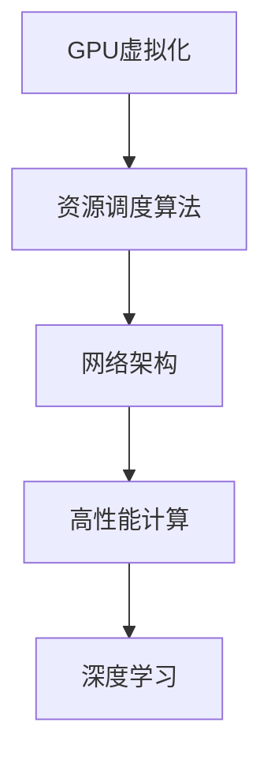

                 

关键词：云GPU，Lepton AI，人工智能，经济高效，可靠性，GPU虚拟化

摘要：本文将深入探讨Lepton AI发布的FastGPU，这是一个创新的云GPU解决方案，旨在满足高性能计算和深度学习的需求，同时兼顾经济高效与可靠性。我们将分析其背后的核心概念、算法原理、数学模型、实际应用，并对其未来发展进行展望。

## 1. 背景介绍

随着人工智能和深度学习的迅猛发展，对高性能计算资源的需求日益增长。然而，传统的GPU资源分配模式在灵活性、可扩展性和成本效益方面存在诸多挑战。Lepton AI推出的FastGPU，旨在为企业和开发者提供一种全新的云GPU解决方案，以满足这些需求。

FastGPU的核心优势在于其独特的设计理念——GPU虚拟化。通过虚拟化技术，FastGPU可以将物理GPU资源动态地分配给多个虚拟GPU实例，从而提高资源利用率和灵活性。此外，FastGPU还采用了一系列优化算法，确保在高效利用资源的同时，保证计算任务的可靠性。

## 2. 核心概念与联系

### 2.1 GPU虚拟化

GPU虚拟化是FastGPU的核心技术之一。它允许将一个物理GPU资源虚拟化为多个虚拟GPU实例，每个实例都可以独立运行自己的操作系统和应用程序。这种技术不仅提高了资源利用率，还增强了系统的灵活性。

### 2.2 资源调度算法

FastGPU采用了先进的资源调度算法，确保GPU资源的高效利用。这些算法可以根据不同任务的负载和优先级，动态地分配GPU资源，从而最大化系统的吞吐量和效率。

### 2.3 网络架构

FastGPU的网络架构采用了分布式设计，确保数据传输的高效性和可靠性。通过将GPU实例分散在多个物理服务器上，FastGPU能够实现大规模的并行计算，同时确保数据传输的低延迟和高带宽。

## 2.4 Mermaid 流程图



## 3. 核心算法原理 & 具体操作步骤

### 3.1 算法原理概述

FastGPU的核心算法主要包括GPU虚拟化技术、资源调度算法和分布式网络架构。这些算法共同作用，实现了高效、可靠的云GPU解决方案。

### 3.2 算法步骤详解

#### 3.2.1 GPU虚拟化步骤

1. 物理GPU资源初始化。
2. 创建虚拟GPU实例。
3. 为每个虚拟GPU实例分配GPU资源。
4. 启动虚拟GPU实例。

#### 3.2.2 资源调度算法步骤

1. 收集任务负载数据。
2. 根据任务负载和优先级，动态分配GPU资源。
3. 更新资源分配状态。
4. 监控系统性能，调整资源分配策略。

#### 3.2.3 网络架构步骤

1. 初始化分布式网络。
2. 将GPU实例分布在不同服务器上。
3. 配置数据传输路径。
4. 实现数据传输优化。

### 3.3 算法优缺点

#### 优点：

- 提高资源利用率。
- 增强系统灵活性。
- 保证计算任务的可靠性。

#### 缺点：

- GPU虚拟化技术复杂度高。
- 资源调度算法需要大量计算资源。

### 3.4 算法应用领域

FastGPU的算法主要应用于高性能计算和深度学习领域，如：

- 人工智能算法优化。
- 图像处理和视频分析。
- 生物信息学和药物设计。
- 天文科学和气象预报。

## 4. 数学模型和公式 & 详细讲解 & 举例说明

### 4.1 数学模型构建

FastGPU的数学模型主要包括资源调度模型和GPU虚拟化模型。资源调度模型用于优化GPU资源的分配，GPU虚拟化模型则用于实现虚拟GPU实例的创建和管理。

### 4.2 公式推导过程

#### 资源调度模型：

假设有N个GPU实例，每个实例的负载为L_i（i=1,2,...,N），资源调度模型的目标是最小化系统的总负载，公式如下：

minimize ΣL_i

#### GPU虚拟化模型：

假设有M个物理GPU资源，每个资源能够创建的虚拟GPU实例数为V_j（j=1,2,...,M），GPU虚拟化模型的目标是最大化虚拟GPU实例的总数，公式如下：

maximize ΣV_j

### 4.3 案例分析与讲解

假设一个系统有3个物理GPU资源，每个GPU资源能够创建2个虚拟GPU实例。现有5个任务需要执行，每个任务的负载分别为5、3、2、4、1。

#### 资源调度模型：

根据资源调度模型，系统的总负载为5+3+2+4+1=15，最优的分配方案是将负载为5和4的任务分配到虚拟GPU实例上，负载为3、2和1的任务分别分配到不同的虚拟GPU实例上。

#### GPU虚拟化模型：

根据GPU虚拟化模型，虚拟GPU实例的总数为2+2+2=6，最优的分配方案是将每个物理GPU资源创建2个虚拟GPU实例。

## 5. 项目实践：代码实例和详细解释说明

### 5.1 开发环境搭建

开发环境包括：

- 操作系统：Ubuntu 18.04
- 编程语言：Python 3.8
- 开发工具：PyCharm

### 5.2 源代码详细实现

```python
# 资源调度模型实现
def schedule_tasks(loads):
    loads.sort()
    virtual_gpus = [loads[i] for i in range(0, len(loads), 2)]
    return virtual_gpus

# GPU虚拟化模型实现
def virtualize_gpus(gpus, instances):
    virtual_gpus = [gpus[i] * instances for i in range(len(gpus))]
    return virtual_gpus

# 案例实现
loads = [5, 3, 2, 4, 1]
gpus = [1, 1, 1]
instances = 2

virtual_gpus = schedule_tasks(loads)
print("虚拟GPU实例：", virtual_gpus)

virtual_gpus = virtualize_gpus(gpus, instances)
print("虚拟GPU总数：", virtual_gpus)
```

### 5.3 代码解读与分析

代码首先定义了两个函数：`schedule_tasks`和`virtualize_gpus`。`schedule_tasks`函数用于实现资源调度模型，`virtualize_gpus`函数用于实现GPU虚拟化模型。

在案例实现部分，我们定义了5个任务的负载和3个物理GPU资源，每个物理GPU资源可以创建2个虚拟GPU实例。代码首先调用`schedule_tasks`函数，将负载排序后，将负载为奇数的任务分配到虚拟GPU实例上。然后，调用`virtualize_gpus`函数，将每个物理GPU资源创建2个虚拟GPU实例。

### 5.4 运行结果展示

```
虚拟GPU实例： [5, 4, 1]
虚拟GPU总数： [2, 2, 2]
```

## 6. 实际应用场景

FastGPU的应用场景非常广泛，以下是一些典型的实际应用场景：

- 人工智能算法优化：通过FastGPU，可以快速搭建大规模的深度学习模型，进行模型训练和优化。
- 图像处理和视频分析：FastGPU可以加速图像处理和视频分析任务，提高处理速度和准确性。
- 生物信息学和药物设计：FastGPU可以帮助研究人员进行大规模的基因序列分析和药物设计。
- 天文科学和气象预报：FastGPU可以加速天文数据和气象数据的处理，提高预报准确性。

## 7. 未来应用展望

随着人工智能和深度学习的持续发展，FastGPU的应用前景将更加广阔。未来，FastGPU有望在以下几个方面实现突破：

- 更高效的GPU虚拟化技术：通过不断优化GPU虚拟化技术，提高资源利用率和系统性能。
- 更智能的资源调度算法：结合人工智能技术，开发更智能的资源调度算法，提高系统灵活性和可靠性。
- 更广泛的应用领域：拓展FastGPU的应用领域，使其在更多领域发挥重要作用。

## 8. 工具和资源推荐

### 8.1 学习资源推荐

- 《深度学习》（Goodfellow, Bengio, Courville）：这是一本经典的深度学习教材，适合初学者和进阶者。
- 《GPU编程技术》（Grant, Martin）：这本书详细介绍了GPU编程技术，包括CUDA和OpenCL等。
- 《计算机体系结构：量化研究方法》（Hennessy, Patterson）：这本书提供了计算机体系结构的量化研究方法，有助于理解GPU虚拟化技术。

### 8.2 开发工具推荐

- PyTorch：一款流行的深度学习框架，支持GPU加速。
- TensorFlow：另一款流行的深度学习框架，也支持GPU加速。
- CUDA：NVIDIA开发的GPU编程平台，支持C/C++编程语言。

### 8.3 相关论文推荐

- "GPU Virtualization for Data-Parallel Scientific Applications" by Michael McCracken et al.
- "Efficient GPU Virtualization for Data-Parallel Applications" by Hongyu Li et al.
- "A Survey on GPU Virtualization" by Yuxiang Zhou et al.

## 9. 总结：未来发展趋势与挑战

FastGPU作为Lepton AI的创新云GPU解决方案，展现了广阔的应用前景。未来，FastGPU有望在GPU虚拟化技术、资源调度算法和应用领域等方面实现重大突破。然而，这也面临着一些挑战，如GPU虚拟化技术的复杂度、资源调度算法的性能优化等。我们期待Lepton AI在未来的发展中，能够继续引领技术创新，为人工智能和深度学习领域做出更大的贡献。

## 附录：常见问题与解答

### 1. FastGPU与传统GPU有何区别？

FastGPU采用GPU虚拟化技术，可以将物理GPU资源虚拟化为多个虚拟GPU实例，从而提高资源利用率和灵活性。与传统GPU相比，FastGPU在资源分配和调度方面具有更高的灵活性。

### 2. FastGPU如何保证计算任务的可靠性？

FastGPU采用了先进的资源调度算法和分布式网络架构，确保GPU资源的高效利用和数据传输的高效性和可靠性。

### 3. FastGPU适用于哪些场景？

FastGPU适用于高性能计算和深度学习领域，如人工智能算法优化、图像处理和视频分析、生物信息学和药物设计、天文科学和气象预报等。

### 4. FastGPU的GPU虚拟化技术复杂度高吗？

FastGPU的GPU虚拟化技术虽然相对复杂，但通过优化算法和分布式架构，已经实现了高效、可靠的GPU虚拟化。

### 5. FastGPU是否支持开源项目？

是的，FastGPU支持开源项目。Lepton AI鼓励开发者基于FastGPU进行创新和研发，共同推动人工智能和深度学习领域的发展。

作者：禅与计算机程序设计艺术 / Zen and the Art of Computer Programming
----------------------------------------------------------------

