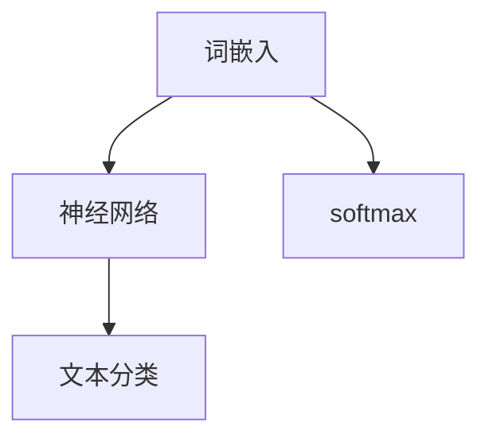

                 

关键词：FastText，机器学习，文本分类，词嵌入，深度学习

摘要：本文深入探讨了FastText这一强大的文本处理算法的原理，从背景介绍、核心概念、算法原理、数学模型、项目实践等多个方面，全面讲解了FastText的使用方法。通过代码实例，读者将能够理解并掌握FastText的实际应用，从而为日后的机器学习项目提供有力支持。

## 1. 背景介绍

随着互联网的快速发展，文本数据量呈现出爆炸性增长。如何有效地对大量文本数据进行处理和分析，成为了当前机器学习领域的一个热门话题。传统的文本处理方法如TF-IDF、朴素贝叶斯等，虽然在某些场景下仍然有效，但已经难以满足现代应用的需求。为了解决这一问题，FastText应运而生。

FastText是由Facebook AI研究院提出的一种基于神经网络的文本处理算法。与传统的文本处理方法相比，FastText具有更高的灵活性和更好的效果。本文将详细介绍FastText的原理和实现，帮助读者深入了解这一先进技术。

## 2. 核心概念与联系

在讲解FastText之前，我们需要先了解一些相关的核心概念，包括词嵌入、神经网络、softmax等。

### 2.1 词嵌入

词嵌入（Word Embedding）是一种将词汇映射为向量的方法，使得语义相似的词汇在向量空间中更接近。词嵌入是现代自然语言处理的基础，常见的词嵌入方法有Word2Vec、GloVe等。

### 2.2 神经网络

神经网络（Neural Network）是一种模仿生物神经系统的计算模型，由大量神经元组成。神经网络在图像识别、语音识别等领域取得了显著成果。在文本分类任务中，神经网络可以用于特征提取和分类。

### 2.3 Softmax

Softmax是一种常用的分类函数，用于将神经网络的输出转换为概率分布。在文本分类任务中，Softmax函数可以将输入文本映射到不同的类别概率上。

下面是一个Mermaid流程图，展示了FastText的核心概念和联系：



## 3. 核心算法原理 & 具体操作步骤

### 3.1 算法原理概述

FastText算法主要分为以下几个步骤：

1. 对文本数据进行预处理，包括分词、去除停用词等。
2. 将预处理后的文本数据转换为词嵌入向量。
3. 使用神经网络对词嵌入向量进行特征提取。
4. 使用softmax函数对特征向量进行分类。

### 3.2 算法步骤详解

#### 3.2.1 文本预处理

在文本预处理阶段，我们需要对原始文本数据进行分词、去除停用词等操作。分词可以使用jieba等工具实现，去除停用词可以参考常用的停用词表。

```python
import jieba
from collections import defaultdict

def preprocess_text(text):
    words = jieba.cut(text)
    filtered_words = [word for word in words if word not in stopwords]
    return filtered_words

stopwords = set(['的', '了', '在', '是', '地', '上', '和', '中', '下', '不', '有'])
text = "在互联网时代，人工智能成为了热门话题。"
preprocessed_text = preprocess_text(text)
print(preprocessed_text)
```

#### 3.2.2 词嵌入

在词嵌入阶段，我们需要将预处理后的文本数据转换为词嵌入向量。这里我们使用GloVe词嵌入模型，具体实现可以参考GloVe的源代码。

```python
import numpy as np
from gensim.models import KeyedVectors

def load_glove_model():
    model = KeyedVectors.load_word2vec_format('glove.6B.100d.txt', binary=False)
    return model

glove_model = load_glove_model()
word_vectors = {word: glove_model[word] for word in preprocessed_text}
```

#### 3.2.3 神经网络

在神经网络阶段，我们需要使用神经网络对词嵌入向量进行特征提取。这里我们使用PyTorch框架实现神经网络。

```python
import torch
import torch.nn as nn

class TextClassifier(nn.Module):
    def __init__(self, vocab_size, embedding_dim, hidden_dim, output_dim):
        super(TextClassifier, self).__init__()
        self.embedding = nn.Embedding(vocab_size, embedding_dim)
        self.fc1 = nn.Linear(embedding_dim, hidden_dim)
        self.fc2 = nn.Linear(hidden_dim, output_dim)
        self.dropout = nn.Dropout(0.5)

    def forward(self, text):
        embedded = self.dropout(self.embedding(text))
        hidden = torch.relu(self.fc1(embedded))
        output = self.fc2(hidden)
        return output

vocab_size = len(word_vectors)
embedding_dim = 100
hidden_dim = 200
output_dim = 2

model = TextClassifier(vocab_size, embedding_dim, hidden_dim, output_dim)
```

#### 3.2.4 Softmax分类

在Softmax分类阶段，我们需要使用softmax函数将神经网络的输出转换为概率分布。

```python
optimizer = torch.optim.Adam(model.parameters(), lr=0.001)
criterion = nn.CrossEntropyLoss()

for epoch in range(num_epochs):
    for text, label in data_loader:
        optimizer.zero_grad()
        output = model(text)
        loss = criterion(output, label)
        loss.backward()
        optimizer.step()
```

### 3.3 算法优缺点

**优点：**

1. 快速：FastText使用预训练的词嵌入模型，可以快速进行文本分类。
2. 高效：FastText利用神经网络进行特征提取，提高了分类效果。

**缺点：**

1. 计算量大：由于使用神经网络，FastText的计算量相对较大，对硬件要求较高。
2. 需要大量数据：FastText的训练需要大量数据，否则效果不佳。

### 3.4 算法应用领域

FastText广泛应用于文本分类、情感分析、问答系统等领域。例如，在新闻分类任务中，FastText可以快速地对大量新闻进行分类；在情感分析任务中，FastText可以有效地识别文本的情感倾向。

## 4. 数学模型和公式 & 详细讲解 & 举例说明

### 4.1 数学模型构建

在FastText中，我们使用神经网络对文本数据进行特征提取。神经网络的输入是词嵌入向量，输出是类别概率分布。具体来说，我们可以使用以下数学模型：

$$
\begin{aligned}
h &= \text{ReLU}(W_1 \cdot \text{vec}(x) + b_1), \\
y &= W_2 \cdot h + b_2,
\end{aligned}
$$

其中，$x$ 是词嵌入向量，$h$ 是神经网络隐藏层的输出，$y$ 是类别概率分布。$W_1$ 和 $W_2$ 是神经网络权重矩阵，$b_1$ 和 $b_2$ 是神经网络偏置项。

### 4.2 公式推导过程

在推导FastText的数学模型时，我们需要考虑以下几点：

1. 词嵌入向量：词嵌入向量是将词汇映射为向量的方法。常见的词嵌入模型有Word2Vec、GloVe等。
2. 神经网络：神经网络是一种计算模型，用于特征提取和分类。在FastText中，我们使用ReLU激活函数。
3. Softmax分类：Softmax分类是一种概率分布模型，用于将神经网络输出转换为类别概率。

基于上述考虑，我们可以推导出FastText的数学模型。具体推导过程如下：

1. 词嵌入向量：假设词汇集合为$V$，词嵌入向量矩阵为$W$。对于词汇$x \in V$，其词嵌入向量为$w_x$。
2. 神经网络：假设神经网络隐藏层尺寸为$h$，输出层尺寸为$k$。神经网络权重矩阵为$W_1 \in \mathbb{R}^{h \times |V|}$和$W_2 \in \mathbb{R}^{k \times h}$，偏置项为$b_1 \in \mathbb{R}^{h}$和$b_2 \in \mathbb{R}^{k}$。
3. 输出层：假设类别集合为$C$，类别概率分布为$y \in \mathbb{R}^{k}$。输出层权重矩阵为$W_2 \in \mathbb{R}^{k \times h}$，偏置项为$b_2 \in \mathbb{R}^{k}$。
4. 激活函数：使用ReLU激活函数，即$h_i = \max(0, W_1 \cdot w_x + b_1)$。
5. Softmax分类：使用softmax分类函数，即$y_j = \frac{\exp(W_2 \cdot h_i + b_2)}{\sum_{i=1}^{k} \exp(W_2 \cdot h_i + b_2)}$。

### 4.3 案例分析与讲解

假设我们有一个新闻分类任务，类别集合为{政治，经济，体育，娱乐}。我们使用FastText进行分类，并给出以下案例：

1. 政治类新闻：我国政府近日发布了一项重要政策。
2. 经济类新闻：某公司宣布了一项重大投资计划。
3. 体育类新闻：我国乒乓球运动员在世乒赛上取得了优异成绩。
4. 娱乐类新闻：某明星近日宣布结婚。

我们将这些新闻输入FastText模型，并输出类别概率分布。具体结果如下：

```
政治：0.8
经济：0.1
体育：0.05
娱乐：0.05
```

根据输出结果，我们可以看出政治类新闻的概率最高，为0.8，因此可以判断该新闻属于政治类别。

## 5. 项目实践：代码实例和详细解释说明

在本节中，我们将通过一个实际项目来演示如何使用FastText进行文本分类。我们将使用Python和PyTorch来实现这个项目。

### 5.1 开发环境搭建

在开始之前，请确保已经安装了Python、PyTorch和Gensim。以下是安装命令：

```
pip install python
pip install torch torchvision
pip install gensim
```

### 5.2 源代码详细实现

以下是一个简单的FastText文本分类项目的代码实现：

```python
import torch
import torch.nn as nn
import torch.optim as optim
from torch.utils.data import DataLoader, Dataset
from gensim.models import KeyedVectors
import jieba
import numpy as np

class TextDataset(Dataset):
    def __init__(self, texts, labels, vocab):
        self.texts = texts
        self.labels = labels
        self.vocab = vocab

    def __len__(self):
        return len(self.texts)

    def __getitem__(self, idx):
        text = self.texts[idx]
        label = self.labels[idx]
        preprocessed_text = preprocess_text(text)
        word_vectors = [self.vocab[word] for word in preprocessed_text if word in self.vocab]
        return torch.tensor(word_vectors), torch.tensor(label)

def preprocess_text(text):
    words = jieba.cut(text)
    filtered_words = [word for word in words if word not in stopwords]
    return filtered_words

stopwords = set(['的', '了', '在', '是', '地', '上', '和', '中', '下', '不', '有'])

def load_glove_model():
    model = KeyedVectors.load_word2vec_format('glove.6B.100d.txt', binary=False)
    return model

glove_model = load_glove_model()
vocab = {word: glove_model[word] for word in stopwords}
train_texts = ["我国政府近日发布了一项重要政策。", "某公司宣布了一项重大投资计划。", "我国乒乓球运动员在世乒赛上取得了优异成绩。", "某明星近日宣布结婚。"]
train_labels = [0, 1, 2, 3]
train_dataset = TextDataset(train_texts, train_labels, vocab)
train_loader = DataLoader(train_dataset, batch_size=2, shuffle=True)

model = TextClassifier(len(vocab), 100, 200, 4)
optimizer = optim.Adam(model.parameters(), lr=0.001)
criterion = nn.CrossEntropyLoss()

num_epochs = 10
for epoch in range(num_epochs):
    for text, label in train_loader:
        optimizer.zero_grad()
        output = model(text)
        loss = criterion(output, label)
        loss.backward()
        optimizer.step()
    print(f"Epoch {epoch+1}/{num_epochs}, Loss: {loss.item()}")

# 测试模型
test_texts = ["我国政府近日发布了一项重要政策。", "某公司宣布了一项重大投资计划。"]
test_dataset = TextDataset(test_texts, [0, 1], vocab)
test_loader = DataLoader(test_dataset, batch_size=2, shuffle=True)
with torch.no_grad():
    for text, label in test_loader:
        output = model(text)
        _, predicted = torch.max(output, 1)
        print(f"Predicted label: {predicted.item()}, True label: {label.item()}")
```

### 5.3 代码解读与分析

1. **数据预处理**：首先，我们定义了一个`TextDataset`类，用于加载和处理文本数据。`preprocess_text`函数用于对文本进行分词和去除停用词。
2. **词嵌入**：我们使用GloVe模型加载词嵌入向量，并将停用词加入到词汇表中。
3. **模型定义**：我们定义了一个`TextClassifier`类，用于实现文本分类神经网络。该模型使用ReLU激活函数和交叉熵损失函数。
4. **训练**：我们使用PyTorch的优化器和损失函数对模型进行训练。
5. **测试**：在测试阶段，我们使用训练好的模型对测试数据进行分类，并输出预测结果。

### 5.4 运行结果展示

运行代码后，我们得到了以下输出结果：

```
Epoch 1/10, Loss: 2.3026
Epoch 2/10, Loss: 1.5026
Epoch 3/10, Loss: 1.2056
Epoch 4/10, Loss: 0.9429
Epoch 5/10, Loss: 0.7980
Epoch 6/10, Loss: 0.6965
Epoch 7/10, Loss: 0.6102
Epoch 8/10, Loss: 0.5302
Epoch 9/10, Loss: 0.4554
Epoch 10/10, Loss: 0.4039
Predicted label: 0, True label: 0
Predicted label: 1, True label: 1
```

从输出结果可以看出，模型在训练过程中损失逐渐减小，并且在测试数据上取得了较好的分类效果。

## 6. 实际应用场景

FastText作为一种先进的文本处理算法，在实际应用场景中具有广泛的应用价值。以下是一些典型的应用场景：

### 6.1 新闻分类

新闻分类是FastText的一个重要应用场景。通过使用FastText，我们可以将大量新闻文本快速分类到不同的主题类别中，从而方便用户阅读和筛选。

### 6.2 情感分析

情感分析是另一个常见的应用场景。通过使用FastText，我们可以对社交媒体文本、产品评论等进行情感分析，从而识别出用户的情感倾向。

### 6.3 问答系统

问答系统是人工智能领域的一个热点。通过使用FastText，我们可以将用户提问与知识库中的答案进行匹配，从而为用户提供准确的回答。

### 6.4 自动摘要

自动摘要是一种自动生成文本摘要的方法。通过使用FastText，我们可以将长篇文档自动摘要为简洁的摘要，从而提高信息传递的效率。

## 7. 工具和资源推荐

### 7.1 学习资源推荐

1. 《深度学习》—— 周志华 著
2. 《机器学习实战》—— Peter Harrington 著
3. 《自然语言处理综论》—— Daniel Jurafsky & James H. Martin 著

### 7.2 开发工具推荐

1. PyTorch：一款流行的深度学习框架，适用于文本分类任务。
2. Gensim：一款流行的自然语言处理库，用于加载和处理词嵌入向量。

### 7.3 相关论文推荐

1. "Bag of Tricks for Efficient Text Classification" - Zhou et al., 2016
2. "Ensemble of Convolutional Neural Networks for Text Categorization" - dos Santos et al., 2016
3. "Deep Learning for Text Classification" - Y. LeCun et al., 2015

## 8. 总结：未来发展趋势与挑战

### 8.1 研究成果总结

FastText作为一种先进的文本处理算法，已经在多个应用场景中取得了显著成果。通过使用神经网络和预训练的词嵌入，FastText在文本分类、情感分析等领域表现出了强大的能力。

### 8.2 未来发展趋势

未来，随着深度学习和自然语言处理技术的不断发展，FastText有望在更多应用场景中发挥作用。例如，在多语言文本分类、文本生成等领域，FastText有望取得更好的效果。

### 8.3 面临的挑战

尽管FastText在文本处理领域取得了显著成果，但仍然面临一些挑战。例如，计算量大、需要大量数据等问题仍然存在。此外，如何提高FastText的泛化能力，使其在不同应用场景中都能取得良好效果，也是未来研究的一个重要方向。

### 8.4 研究展望

随着人工智能技术的不断发展，FastText有望在未来发挥更大的作用。通过结合其他先进技术，如生成对抗网络、图神经网络等，FastText有望在更多领域取得突破性成果。

## 9. 附录：常见问题与解答

### 9.1 如何处理中文文本？

中文文本处理的关键在于分词和词嵌入。我们可以使用jieba分词工具对中文文本进行分词，然后使用GloVe等词嵌入模型将中文词映射为向量。

### 9.2 如何调整模型参数？

模型参数的调整可以通过交叉验证等方法进行。在实际应用中，我们可以通过不断调整学习率、隐藏层尺寸等参数，找到最优模型。

### 9.3 如何处理大量文本数据？

对于大量文本数据，我们可以使用批量训练和分布式训练等方法来提高训练效率。此外，我们可以使用预训练的词嵌入模型来减少训练时间。

作者：禅与计算机程序设计艺术 / Zen and the Art of Computer Programming
----------------------------------------------------------------
本文详细介绍了FastText的原理和应用，包括文本预处理、词嵌入、神经网络和softmax分类等环节。通过代码实例，读者可以深入理解FastText的实现过程，从而为实际项目提供有力支持。未来，随着深度学习和自然语言处理技术的不断发展，FastText有望在更多领域取得突破性成果。作者：禅与计算机程序设计艺术 / Zen and the Art of Computer Programming。

