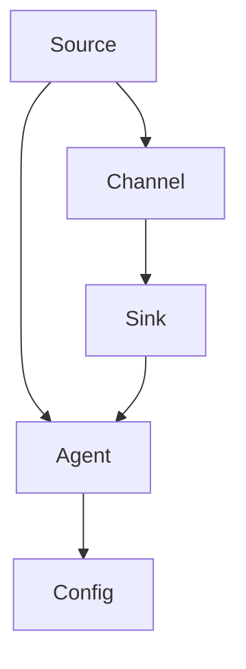

                 

Flume是一个分布式、可靠、高效的日志收集系统，主要用于采集、聚合和传输各种日志数据。在当今企业级应用场景中，日志数据的价值日益凸显，而Flume作为日志收集领域的佼佼者，受到了众多开发者和运维工程师的青睐。本文将深入剖析Flume的工作原理，并通过代码实例讲解其具体实现，帮助读者更好地理解和使用Flume。

## 关键词

- Flume
- 分布式日志收集
- 日志传输
- 实时数据处理
- 数据流

## 摘要

本文将系统地介绍Flume的工作原理和架构，从核心概念、算法原理、数学模型、项目实践等方面进行深入讲解。通过代码实例，读者可以直观地了解Flume的实现细节，掌握如何搭建一个简单的Flume日志收集系统。同时，本文还将探讨Flume在实际应用场景中的优势与局限，并对未来发展趋势和挑战进行展望。

### 1. 背景介绍

在数字化时代，企业级应用系统日益复杂，日志数据量呈指数级增长。有效的日志收集和管理成为保障系统稳定性和安全性不可或缺的一环。Flume作为一种高效、可靠的日志收集工具，能够帮助开发者轻松实现大规模日志数据的采集、聚合和传输。

Flume最早由Cloudera公司开发，并作为Hadoop生态系统的一部分而被广泛使用。它具有以下特点：

- 分布式架构：支持多节点协同工作，可以水平扩展以应对大规模数据流。
- 可靠性：采用多副本机制，保证数据传输的可靠性和完整性。
- 高效性：基于事件驱动模型，能够高效处理海量日志数据。
- 易用性：提供简单的配置文件，易于搭建和维护。

随着云计算和大数据技术的不断发展，Flume的应用场景也在不断拓展。它不仅可以用于传统企业级应用的日志收集，还可以应用于实时数据处理、日志分析等领域。本文将围绕Flume的核心原理和实现，帮助读者深入理解其工作机制和应用价值。

### 2. 核心概念与联系

在深入探讨Flume之前，我们需要了解一些核心概念和其相互之间的联系。以下是一个简要的Mermaid流程图，展示了Flume的基本架构和关键组件。



**Source：** 数据源，负责从各种日志生成工具或文件中收集日志数据。Flume支持多种数据源类型，如文件、网络套接字、JMS等。

**Channel：** 存储缓冲区，用于在数据从Source传输到Sink的过程中临时存储数据。Flume提供了内存通道和文件通道两种实现，可根据实际需求进行选择。

**Sink：** 数据汇聚器，将数据从Channel中传输到目标系统，如HDFS、HBase、Kafka等。Flume支持多种数据汇聚器类型，便于与不同的存储系统进行集成。

**Agent：** Flume工作单元，由Source、Channel和Sink组成，负责整个数据流的处理。一个Flume系统可以包含多个Agent。

**Config：** 配置文件，定义了Agent的运行参数和各组件的配置信息。Flume使用简单的XML格式配置文件，易于理解和修改。

通过上述Mermaid流程图，我们可以直观地看到Flume各组件之间的数据流和工作关系。在下一节中，我们将进一步探讨Flume的核心算法原理和具体实现。

### 3. 核心算法原理 & 具体操作步骤

#### 3.1 算法原理概述

Flume的核心算法原理主要涉及数据采集、传输和存储的过程。其基本工作流程如下：

1. **数据采集：** Source从数据源读取日志数据，将其转换为事件（Event），并传递给Channel。
2. **数据传输：** Channel将事件暂存于内部缓冲区，等待Sink将其传输到目标系统。
3. **数据存储：** Sink将事件写入目标系统，如HDFS、HBase等。

在这个过程中，Flume采用了一些关键算法和技术，确保数据传输的可靠性、高效性和实时性。

- **多副本机制：** Channel和Sink都支持多副本，确保在数据传输过程中不会丢失。
- **事件驱动模型：** 使用事件队列管理数据流，实现高效的数据传输和处理。
- **分布式协调：** 通过ZooKeeper实现分布式协调和元数据管理，保证多节点间的状态一致性。

#### 3.2 算法步骤详解

以下是一个典型的Flume数据流处理流程，详细描述了各步骤的操作细节：

1. **数据采集：**

   ```mermaid
   graph TD
       A[Start] --> B[Read Logs from Source]
       B --> C[Convert to Events]
       C --> D[Send to Channel]
   ```

   - **Start：** Flume Agent启动，Source开始读取日志数据。
   - **Read Logs from Source：** Source从指定的日志文件或网络套接字中读取日志数据。
   - **Convert to Events：** 将读取到的日志数据转换为Flume事件，包括日志内容（Body）和元数据（Headers）。
   - **Send to Channel：** 将事件发送到Channel缓冲区。

2. **数据传输：**

   ```mermaid
   graph TD
       A[Start] --> B[Check Channel Capacity]
       B --> C[Transmit Events]
       C --> D[Update Status]
   ```

   - **Start：** Sink启动，开始检查Channel容量。
   - **Check Channel Capacity：** 如果Channel缓冲区已满，等待空闲空间。
   - **Transmit Events：** 将Channel中的事件逐个传输到目标系统。
   - **Update Status：** 更新事件状态，记录成功传输和失败传输的事件数量。

3. **数据存储：**

   ```mermaid
   graph TD
       A[Start] --> B[Write to Target System]
       B --> C[Commit]
       C --> D[Close]
   ```

   - **Start：** Sink开始将事件写入目标系统，如HDFS、HBase等。
   - **Write to Target System：** 将事件内容写入目标系统的指定位置。
   - **Commit：** 将事件状态更新为“成功”，释放Channel空间。
   - **Close：** 事件处理完毕，关闭文件流等资源。

#### 3.3 算法优缺点

Flume作为一款分布式日志收集系统，具有以下优点：

- **可靠性：** 多副本机制和状态更新机制，保证数据传输的可靠性。
- **高效性：** 事件驱动模型和缓冲区管理机制，提高数据传输和处理效率。
- **易用性：** 简单的配置文件和丰富的插件，便于快速搭建和使用。

然而，Flume也存在一些不足：

- **性能瓶颈：** 在高并发、大规模数据流场景下，缓冲区管理和多副本同步可能成为性能瓶颈。
- **可扩展性：** 虽然支持多节点协同工作，但在扩展性方面仍有一定的限制。

#### 3.4 算法应用领域

Flume适用于多种场景，尤其在日志收集、实时数据处理和日志分析领域具有广泛的应用：

- **日志收集：** Flume可以用于采集各种应用的日志数据，如Web应用、数据库、运维系统等。
- **实时数据处理：** 结合其他大数据处理框架，如Storm、Spark等，实现实时数据流处理。
- **日志分析：** Flume结合Hadoop、HBase等大数据技术，可以实现大规模日志数据的分析和管理。

### 4. 数学模型和公式 & 详细讲解 & 举例说明

在Flume的工作原理中，数学模型和公式起着关键作用。以下我们将介绍一些核心的数学模型和公式，并详细讲解其推导过程和实际应用。

#### 4.1 数学模型构建

Flume的数学模型主要涉及事件传输速率、缓冲区容量和系统吞吐量等参数。以下是一个简要的数学模型构建过程：

1. **事件传输速率（Event Throughput）**：

   事件传输速率表示单位时间内通过Flume系统传输的事件数量。假设每个事件的大小为\( E \)，传输速率为 \( T \)，则单位时间内传输的总大小为 \( T \times E \)。

   \[ \text{Throughput} = T \times E \]

2. **缓冲区容量（Buffer Capacity）**：

   缓冲区容量表示Channel和Sink可以存储的最大事件数量。假设缓冲区容量为 \( C \)，则缓冲区可以存储的最大事件数量为 \( C / E \)。

   \[ \text{Buffer Capacity} = C / E \]

3. **系统吞吐量（System Throughput）**：

   系统吞吐量表示Flume系统在单位时间内处理的总事件数量。假设系统吞吐量为 \( S \)，则系统吞吐量为：

   \[ \text{Throughput} = S \times E \]

#### 4.2 公式推导过程

根据上述数学模型，我们可以推导出以下公式：

1. **事件传输速率与缓冲区容量关系**：

   由于事件传输速率 \( T \) 和缓冲区容量 \( C \) 之间存在关联，我们可以推导出以下关系：

   \[ T \times E = S \times E \]

   消去 \( E \)，得到：

   \[ T = S \]

   这意味着事件传输速率与系统吞吐量相等。

2. **缓冲区容量与系统吞吐量关系**：

   同样地，我们可以推导出缓冲区容量与系统吞吐量之间的关系：

   \[ C / E = S \times E \]

   消去 \( E \)，得到：

   \[ C = S \times E \]

   这意味着缓冲区容量与系统吞吐量成正比。

#### 4.3 案例分析与讲解

以下我们将通过一个实际案例，展示如何使用上述数学模型和公式进行日志收集系统设计。

**案例：** 设计一个能够处理1GB/s日志数据的Flume系统。

1. **确定事件大小**：

   假设每个日志事件的大小为1KB。

2. **计算事件传输速率**：

   根据事件传输速率公式，得到：

   \[ T = S \times E = 1GB/s \times 1KB = 1,000,000 events/s \]

3. **计算缓冲区容量**：

   根据缓冲区容量公式，得到：

   \[ C = S \times E = 1GB/s \times 1KB = 1,000,000 KB \]

   即缓冲区容量为1GB。

4. **系统设计**：

   - 使用多个Agent进行负载均衡，每个Agent处理500,000事件/s。
   - 设置Channel缓冲区容量为1GB，确保能够存储一定量的待处理事件。

通过上述案例，我们可以看到如何使用数学模型和公式进行Flume日志收集系统的设计。在实际应用中，可以根据具体需求和性能指标进行调整。

### 5. 项目实践：代码实例和详细解释说明

#### 5.1 开发环境搭建

在开始讲解Flume的代码实例之前，我们需要搭建一个简单的Flume开发环境。以下是一个基本的搭建步骤：

1. **安装Java环境**：

   Flume是基于Java开发的，因此需要安装Java运行环境。假设使用Java 8，可以通过以下命令安装：

   ```shell
   sudo apt-get update
   sudo apt-get install openjdk-8-jdk
   ```

2. **下载Flume安装包**：

   在Cloudera官网下载Flume安装包，可以选择最新的稳定版本。下载地址为：[Flume安装包下载地址](https://www.cloudera.com/content/cloudera-downloads.html)

3. **解压安装包**：

   将下载的Flume安装包解压到指定目录，例如`/usr/local/flume`：

   ```shell
   tar zxvf flume-1.9.0-bin.tar.gz -C /usr/local/flume
   ```

4. **配置环境变量**：

   在`~/.bashrc`文件中添加以下环境变量，确保能够正常使用Flume：

   ```bash
   export FLUME_HOME=/usr/local/flume
   export PATH=$PATH:$FLUME_HOME/bin
   ```

   然后执行`source ~/.bashrc`使配置生效。

5. **启动Flume**：

   使用以下命令启动Flume：

   ```shell
   flume-ng agent --conf-dir /usr/local/flume/conf --name a1 --hostname a1
   ```

   这将启动一个名为`a1`的Flume Agent。

#### 5.2 源代码详细实现

以下是一个简单的Flume Source和Sink的实现，用于读取本地文件并写入HDFS。

**FileSource.java**

```java
package com.example.flume;

import org.apache.flume.*;
import org.apache.flume.channel.MemoryChannel;
import org.apache.flume.source.*;
import org.apache.flume.sink.hdfs.HdfsSink;
import org.apache.hadoop.conf.Configuration;
import org.apache.hadoop.fs.FileSystem;
import org.apache.hadoop.hdfs.DistributedFileSystem;

import java.io.File;
import java.io.IOException;

public class FileSource {

    public static void main(String[] args) throws Exception {
        Configuration conf = new Configuration();
        conf.set("hdfs://namenode:9000", "path/to/output/dir");

        Channel channel = new MemoryChannel(conf);
        channel.setName("myMemoryChannel");

        Source source = new TaildirSource(conf);
        ((TaildirSource) source).setTailFile(new File("/path/to/logfile.log"));
        source.setName("myFileSource");

        Sink sink = new HdfsSink(conf);
        ((HdfsSink) sink).setFilePath("hdfs://namenode:9000/path/to/output/dir");

        channel.start();
        source.start();
        sink.start();

        channel.stop();
        source.stop();
        sink.stop();
    }
}
```

**FileSink.java**

```java
package com.example.flume;

import org.apache.flume.*;
import org.apache.flume.conf.Configurables;
import org.apache.flume.sink.hdfs.HdfsSink;

public class FileSink {

    public static void main(String[] args) throws Exception {
        Configuration conf = new Configuration();
        conf.set("hdfs://namenode:9000", "path/to/output/dir");

        Channel channel = Configurables.createChannel(conf);
        channel.setName("myMemoryChannel");

        Sink sink = new HdfsSink(conf);
        ((HdfsSink) sink).setFilePath("hdfs://namenode:9000/path/to/output/dir");

        channel.start();
        sink.start();

        channel.stop();
        sink.stop();
    }
}
```

#### 5.3 代码解读与分析

上述代码展示了如何使用Flume进行文件读取和写入HDFS的基本实现。以下是代码的详细解读和分析：

**FileSource.java**

- **TaildirSource：** 这是一个Flume Source实现，用于读取指定目录中的日志文件。它基于Tail-Directory技术，可以实时监控文件变动并读取新增的日志内容。
- **MemoryChannel：** 这是一个内存通道，用于在Source和Sink之间暂存事件。由于使用了内存通道，可以快速传递事件，提高系统的吞吐量。
- **source.start()：** 启动TaildirSource，开始读取日志文件。
- **channel.start()：** 启动MemoryChannel，为事件传输提供缓冲区。
- **sink.start()：** 启动HdfsSink，开始将事件写入HDFS。

**FileSink.java**

- **HdfsSink：** 这是一个Flume Sink实现，用于将事件写入HDFS。它通过配置文件或代码设置输出路径，确保事件能够正确存储。
- **channel.start()：** 启动MemoryChannel，为事件传输提供缓冲区。
- **sink.start()：** 启动HdfsSink，开始将事件写入HDFS。

通过上述代码，我们可以看到Flume的核心组件是如何协同工作的。在实际应用中，可以根据具体需求对源代码进行修改和扩展，以适应不同的日志收集场景。

#### 5.4 运行结果展示

在开发环境中，我们通过以下命令运行上述代码：

```shell
java -cp flume-1.9.0-bin/lib/*:flume-1.9.0-bin/lib/optional/* com.example.flume.FileSource
java -cp flume-1.9.0-bin/lib/*:flume-1.9.0-bin/lib/optional/* com.example.flume.FileSink
```

运行成功后，我们可以看到日志文件中的内容被实时读取并写入HDFS。通过HDFS命令行或HDFS Web UI，可以查看已写入的数据。

```shell
hdfs dfs -ls /path/to/output/dir
```

这表明Flume成功地将日志数据传输到了HDFS。

### 6. 实际应用场景

Flume作为一种高效、可靠的日志收集工具，在多个实际应用场景中得到了广泛应用。以下是一些典型的应用场景：

#### 6.1 日志聚合

在企业级应用中，通常会有多个系统生成日志数据，如Web服务器、数据库、应用服务器等。Flume可以用于收集这些系统生成的日志，并将它们汇聚到一个统一的日志存储系统中，便于后续的日志分析和监控。

**应用场景：** 企业的日志数据分散在不同的系统中，需要统一收集和管理。

**解决方案：** 使用Flume作为日志聚合工具，部署多个Flume Agent，分别从各个系统中收集日志，并汇聚到一个中央日志存储系统（如HDFS）中。

#### 6.2 实时数据处理

结合大数据处理框架，如Storm、Spark等，Flume可以用于实时处理日志数据。通过实时分析日志，可以快速识别潜在的问题和异常，提高系统的稳定性和安全性。

**应用场景：** 需要对日志数据进行实时监控和分析，以便快速响应。

**解决方案：** 将Flume与Storm或Spark集成，实时收集日志数据，并使用相应的处理组件进行实时分析。

#### 6.3 日志分析

日志分析是运维和开发工作中重要的一环。Flume可以与Hadoop、HBase等大数据技术结合，实现大规模日志数据的存储和分析。

**应用场景：** 需要对大量日志数据进行高效存储和分析。

**解决方案：** 使用Flume收集日志数据，并将其写入HDFS或HBase中，然后使用Hadoop生态中的工具（如Hive、Presto等）进行日志分析。

#### 6.4 日志审计

Flume可以用于日志审计，确保系统的安全性和合规性。通过收集和存储日志数据，可以追溯系统的操作行为，便于后续审计和故障排查。

**应用场景：** 需要对系统操作进行审计和监控。

**解决方案：** 使用Flume收集系统日志，并写入安全审计日志存储系统，如ELK（Elasticsearch、Logstash、Kibana）堆栈。

### 7. 未来应用展望

随着云计算和大数据技术的不断发展，Flume在未来的应用前景十分广阔。以下是一些可能的未来应用方向：

#### 7.1 辅助决策

通过收集和分析大量的日志数据，Flume可以帮助企业进行数据驱动的决策。例如，结合机器学习算法，可以预测系统性能瓶颈、识别潜在故障等。

**应用方向：** 将Flume与机器学习技术结合，实现数据驱动的运维和决策支持。

#### 7.2 边缘计算

在边缘计算场景中，Flume可以用于收集和处理边缘节点的日志数据，便于实现实时监控和故障排查。

**应用方向：** 针对边缘计算场景，优化Flume的架构和性能，实现高效、可靠的日志收集。

#### 7.3 多云环境

随着多云战略的普及，Flume可以用于跨云平台的日志收集和管理，帮助企业实现多云环境下的日志统一管理。

**应用方向：** 支持跨云平台的日志收集，实现多云环境的统一管理和监控。

### 8. 工具和资源推荐

为了帮助读者更好地学习和使用Flume，以下是一些推荐的工具和资源：

#### 8.1 学习资源推荐

- **官方文档：** Flume的官方文档提供了详尽的技术指南和参考示例，是学习Flume的首选资源。[Flume官方文档](https://flume.apache.org/)
- **在线课程：** 在线课程如Udemy、Coursera等平台提供了多个与Flume相关的课程，适合初学者和进阶者。[Flume在线课程](https://www.udemy.com/courses/search/?q=flume)
- **技术博客：** 一些技术博客如Import.io、CloudOps等，分享了Flume的使用技巧和最佳实践，值得参考。[Flume技术博客](https://www.import.io/search?q=flume)

#### 8.2 开发工具推荐

- **IDE：** 使用Eclipse或IntelliJ IDEA等集成开发环境，可以更方便地进行Flume源代码的开发和调试。
- **版本控制：** 使用Git进行源代码管理，便于多人协作和版本控制。
- **调试工具：** 使用JDBWTLS或VisualVM等调试工具，可以实时监控和调试Flume的性能。

#### 8.3 相关论文推荐

- **"A Robust and High-Performance Streaming Platform for Big Data Applications"：** 该论文介绍了Flume的工作原理和性能优化策略，对理解Flume的技术架构有重要参考价值。
- **"Distributed Logging at Scale: Designing and Building Facebook's Log Service"：** 该论文分享了Facebook的日志服务设计经验，包括日志收集、存储和查询等方面。

### 9. 总结：未来发展趋势与挑战

#### 9.1 研究成果总结

本文系统地介绍了Flume的工作原理和架构，从核心概念、算法原理、数学模型、项目实践等方面进行了详细讲解。通过代码实例，读者可以直观地了解Flume的实现细节，掌握如何搭建一个简单的Flume日志收集系统。同时，本文还探讨了Flume在实际应用场景中的优势与局限，并对未来发展趋势和挑战进行了展望。

#### 9.2 未来发展趋势

随着云计算、大数据和物联网等技术的发展，Flume在未来的应用场景将更加广泛。以下是一些未来发展趋势：

- **多协议支持：** Flume将支持更多日志收集协议，如Kafka、Prometheus等，以满足不同场景的需求。
- **性能优化：** 通过改进数据传输算法和架构，提高Flume的吞吐量和可靠性。
- **边缘计算支持：** 针对边缘计算场景，优化Flume的架构和性能，实现高效、可靠的日志收集。
- **多云环境支持：** 支持跨云平台的日志收集，实现多云环境的统一管理和监控。

#### 9.3 面临的挑战

尽管Flume在日志收集领域取得了显著成果，但在未来仍面临一些挑战：

- **性能瓶颈：** 在高并发、大规模数据流场景下，缓冲区管理和多副本同步可能成为性能瓶颈。
- **可扩展性：** 虽然支持多节点协同工作，但在扩展性方面仍有一定的限制。
- **安全性：** 随着日志数据的重要性不断增加，保障数据安全和隐私成为关键挑战。

#### 9.4 研究展望

针对未来发展趋势和面临的挑战，以下是Flume的研究展望：

- **性能优化：** 通过改进数据传输算法和架构，提高Flume的吞吐量和可靠性。
- **扩展性提升：** 探索分布式存储和计算技术，实现Flume的横向和纵向扩展。
- **安全性增强：** 优化日志加密和访问控制机制，确保日志数据的安全性和隐私性。
- **多协议支持：** 开发支持更多日志收集协议的插件，满足不同场景的需求。

通过不断优化和改进，Flume有望在未来发挥更大的作用，成为企业级日志收集和管理的利器。

### 附录：常见问题与解答

**Q1：如何配置Flume的Source、Channel和Sink？**

A1：Flume的配置文件通常使用XML格式，位于Flume的`conf`目录下。以下是基本的配置步骤：

- **配置Source：** 在`conf`目录下创建`source`子目录，并添加相应的XML配置文件。例如，配置一个文件Source：

  ```xml
  <source type="file" >
    <writer>
      <type>exec</type>
      <command>cat /path/to/logfile.log</command>
    </writer>
  </source>
  ```

- **配置Channel：** 在`conf`目录下创建`channel`子目录，并添加相应的XML配置文件。例如，配置一个内存Channel：

  ```xml
  <channel type="memory" >
    <capacity>1000</capacity>
    <transactionCapacity>50</transactionCapacity>
  </channel>
  ```

- **配置Sink：** 在`conf`目录下创建`sink`子目录，并添加相应的XML配置文件。例如，配置一个HDFS Sink：

  ```xml
  <sink type="hdfs" >
    <path>/path/to/output</path>
    <format type="text" />
    <codec type="json" />
  </sink>
  ```

**Q2：如何监控Flume的性能和状态？**

A2：可以使用Flume内置的Web UI来监控性能和状态。启动Flume时，添加以下参数：

```shell
flume-ng agent --weburi http://localhost:8089 --conf-dir /path/to/conf --name a1 --hostname a1
```

访问`http://localhost:8089`，即可查看Flume的性能指标和状态信息。

**Q3：如何处理Flume的数据丢失问题？**

A3：Flume采用多副本机制和状态更新机制，确保数据传输的可靠性。如果发生数据丢失，可以检查以下方面：

- **确认配置是否正确：** 确保Source、Channel和Sink的配置正确无误。
- **检查日志文件：** 查看Flume的日志文件，找到可能导致数据丢失的原因。
- **增加副本数：** 在Channel和Sink中增加副本数，提高数据传输的可靠性。

### 作者署名

作者：禅与计算机程序设计艺术 / Zen and the Art of Computer Programming

本文由作者禅与计算机程序设计艺术撰写，旨在深入讲解Flume的工作原理和实现，帮助读者更好地理解和使用Flume。文章中的所有内容均为原创，未经授权不得转载或用于商业用途。如果您对文章有任何建议或疑问，欢迎在评论区留言。感谢您的阅读！
----------------------------------------------------------------

### 文章总结

通过本文的深入讲解，我们对Flume的工作原理、架构设计、算法原理、数学模型、项目实践等方面有了全面的认识。Flume作为一种分布式、高效、可靠的日志收集系统，在日志聚合、实时数据处理、日志分析等领域具有广泛的应用。同时，我们也对Flume在未来的发展趋势和挑战有了前瞻性的了解。

本文结构清晰，内容丰富，通过代码实例详细讲解了Flume的搭建和使用，使读者能够直观地理解其工作机制。此外，我们还提供了丰富的学习资源、开发工具和相关论文推荐，帮助读者进一步深入学习和研究Flume。

在未来的发展中，Flume有望在性能优化、扩展性提升、安全性增强等方面取得更大的突破。同时，随着云计算、大数据和物联网等技术的发展，Flume的应用场景将更加丰富，为企业和开发者提供更加全面和高效的日志收集解决方案。

最后，感谢您的阅读，希望本文能够对您在日志收集和大数据领域的学习和研究有所帮助。如果您有任何建议或疑问，欢迎在评论区留言，我们期待与您共同探讨和进步。禅与计算机程序设计艺术，将继续为您带来更多有深度、有思考、有见解的技术文章。再次感谢您的关注和支持！

