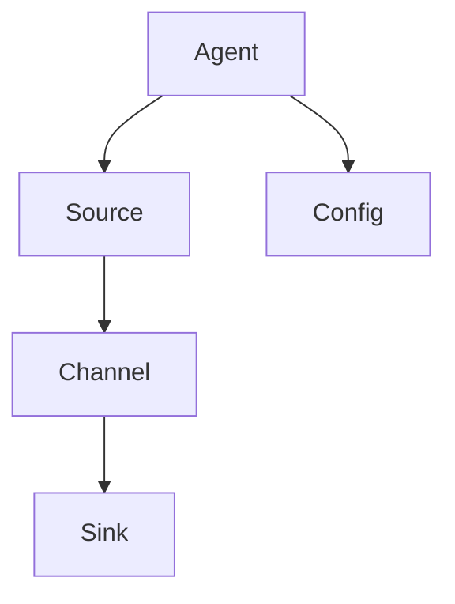
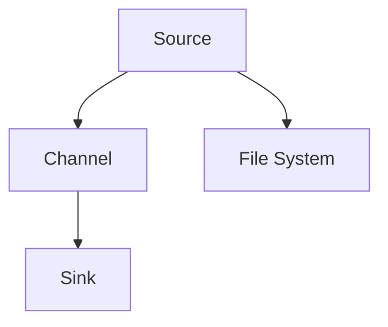

                 

 在当今数字化时代，日志收集系统在企业运维中扮演着至关重要的角色。作为Apache Software Foundation的一个开源项目，Flume提供了一种可靠的、可扩展的、可靠的日志收集解决方案，旨在从一个或多个数据源有效收集、聚合和移动大量日志数据。本文将详细讲解Flume日志收集系统的原理及其代码实例，帮助读者更好地理解和应用这一强大的工具。

> 关键词：Flume、日志收集、系统架构、分布式、源码分析

> 摘要：本文首先介绍了Flume日志收集系统的背景和重要性，随后深入探讨了其核心概念与架构，接着详细解析了Flume的核心算法原理和具体操作步骤。文章随后通过数学模型和公式，讲解了Flume的数学基础和推导过程，并通过实际项目实践展示了如何搭建和配置Flume。最后，文章总结了Flume的实际应用场景，并对其未来发展和面临的挑战进行了展望。

## 1. 背景介绍

在现代网络环境下，各类系统和服务会产生海量的日志数据。这些日志不仅是系统运行状况的记录，更是诊断问题、优化性能和进行故障排除的重要依据。因此，如何高效、可靠地收集和管理这些日志，成为企业运维中的一大挑战。

Flume作为一个分布式、可靠且可扩展的日志收集系统，可以轻松实现跨系统的日志收集任务。它由Cloudera开源，并在Apache Software Foundation下进行维护。Flume能够将多个数据源（如Web服务器、数据库、应用程序等）的日志数据汇总到一个集中存储的地方，如HDFS、HBase或Kafka等。

Flume的设计初衷是为了解决日志收集过程中的几个关键问题：
- **可靠性和持久性**：即使发生系统故障，Flume也能确保日志数据不丢失。
- **可扩展性**：能够处理大量日志数据，并且可以根据需求进行水平扩展。
- **灵活性**：支持多种数据源和目的地，且易于定制和扩展。

Flume适用于多种场景，包括：
- **系统监控**：收集和聚合系统日志，用于实时监控和故障告警。
- **日志聚合**：将来自多个数据源的日志集中存储，便于分析和处理。
- **数据导出**：将日志数据导出到其他系统或数据库，进行进一步分析和处理。

## 2. 核心概念与联系

为了深入理解Flume的工作原理，我们需要首先掌握其核心概念和架构。以下是Flume的关键组成部分：

### 2.1 Source

Source是Flume数据收集的入口点。它负责监听并读取数据源的数据，然后将数据传递给下一个组件。Flume支持多种数据源，如文件、JMS、HTTP等。

### 2.2 Channel

Channel是一个临时存储区域，用于在数据从Source传递到Sink之前暂存数据。Flume提供多种Channel实现，如MemoryChannel和FileChannel，分别适用于不同的场景。

### 2.3 Sink

Sink是数据流向的目的地。它负责将数据从Channel传递到指定的数据存储系统或分析平台。常见的Sink实现包括HDFS、HBase、Kafka等。

### 2.4 Agent

Agent是Flume的核心执行单元。一个Agent包括Source、Channel和Sink。一个Agent可以包含多个Source和Sink，也可以配置多个Channel。

### 2.5 Flume的架构

Flume的架构设计旨在确保数据收集的可靠性、高效性和扩展性。以下是Flume的架构图：



### 2.6 Flume的连接与数据流

Flume中的数据流通常从一个或多个Source开始，通过Channel暂存，最终由Sink输出到目标系统。以下是一个简单的Flume数据流示例：



在这个例子中，Source从文件系统中读取日志数据，通过Channel暂存，然后由Sink输出到HDFS。

## 3. 核心算法原理 & 具体操作步骤

### 3.1 算法原理概述

Flume的算法原理主要涉及数据收集、传输和存储的各个方面。以下是其核心原理的概述：

- **数据收集**：Flume使用Source组件从数据源（如文件系统、JMS等）读取数据。
- **数据暂存**：数据被传递到Channel进行暂存，以确保数据的可靠性。
- **数据传输**：当Channel中的数据达到一定阈值时，Sink组件将数据传输到目标系统（如HDFS、HBase等）。
- **容错机制**：Flume具备重试机制和检查点（Checkpoint）机制，确保数据传输的可靠性。

### 3.2 算法步骤详解

Flume的工作过程可以分为以下几个步骤：

1. **启动Agent**：配置并启动Flume Agent，启动Source、Channel和Sink。
2. **数据收集**：Source从数据源读取数据，并将数据存储到Channel中。
3. **数据暂存**：数据在Channel中暂存，等待传输。
4. **数据传输**：当Channel中的数据达到阈值时，Sink开始将数据传输到目标系统。
5. **容错与监控**：Flume使用重试机制和检查点机制确保数据传输的可靠性，并通过监控机制确保系统的正常运行。

### 3.3 算法优缺点

**优点**：
- **可靠性**：Flume具备重试机制和检查点机制，确保数据传输的可靠性。
- **可扩展性**：Flume支持水平扩展，能够处理大量日志数据。
- **灵活性**：支持多种数据源和目的地，易于定制和扩展。

**缺点**：
- **性能开销**：由于需要使用Channel暂存数据，可能会引入一定的性能开销。
- **复杂性**：配置和管理Flume相对复杂，需要一定的学习成本。

### 3.4 算法应用领域

Flume主要应用于以下领域：
- **系统监控**：收集和聚合系统日志，用于实时监控和故障告警。
- **日志聚合**：将来自多个数据源的日志集中存储，便于分析和处理。
- **数据导出**：将日志数据导出到其他系统或数据库，进行进一步分析和处理。

## 4. 数学模型和公式 & 详细讲解 & 举例说明

### 4.1 数学模型构建

Flume的数学模型主要涉及数据流量的计算和传输延迟的评估。以下是数学模型的构建过程：

1. **数据流量**：假设每个Source每秒产生n条日志数据，每条日志数据大小为s字节，则每秒产生的数据流量为：

   \[ Q = n \times s \]

2. **传输延迟**：假设数据从Source到Sink的传输延迟为t秒，则数据传输延迟为：

   \[ L = t \times Q \]

### 4.2 公式推导过程

基于上述数学模型，我们可以推导出以下公式：

- **数据流量**：

  \[ Q = n \times s \]

- **传输延迟**：

  \[ L = t \times Q = t \times (n \times s) = t \times n \times s \]

### 4.3 案例分析与讲解

假设一个Flume Agent从文件系统中读取日志数据，每秒产生100条日志，每条日志大小为1KB。数据传输延迟为1秒。请计算该Agent每秒产生的数据流量和传输延迟。

- **数据流量**：

  \[ Q = 100 \times 1KB = 100KB \]

- **传输延迟**：

  \[ L = 1 \times 100KB = 100KB \]

## 5. 项目实践：代码实例和详细解释说明

### 5.1 开发环境搭建

在开始Flume的配置和操作之前，我们需要搭建一个开发环境。以下是搭建Flume开发环境的步骤：

1. **安装Java**：由于Flume基于Java编写，因此首先需要安装Java。可以从Oracle官网下载Java安装包并进行安装。
2. **安装Flume**：从Apache官网下载Flume安装包，解压到合适的位置，并添加到系统的环境变量中。
3. **创建配置文件**：在Flume的conf目录下创建一个配置文件，用于配置Source、Channel和Sink。

### 5.2 源代码详细实现

以下是一个简单的Flume配置文件示例：

```xml
<configuration>
    <agent>
        <source>
            <type>file</type>
            <writer>
                <type>console</type>
            </writer>
        </source>
        <channel>
            <type>memory</type>
            <capacity>1000</capacity>
            <transactionCapacity>50</transactionCapacity>
        </channel>
        <sink>
            <type>hdfs</type>
            <path>/user/flume/data</path>
            <fileType>DataStream</fileType>
            <rolls>5</rolls>
            <preAction>
                <type>mkdir</type>
                <目录>/user/flume/data</目录>
            </preAction>
            <postAction>
                <type>touchz</type>
                <文件>/user/flume/data/.complete</文件>
            </postAction>
        </sink>
    </agent>
</configuration>
```

在这个配置文件中，我们配置了一个名为“file”的Source，用于从文件系统中读取日志数据。Channel配置为MemoryChannel，用于暂存数据。Sink配置为HDFS，用于将数据输出到HDFS。

### 5.3 代码解读与分析

在Flume的配置文件中，我们需要注意以下几个关键部分：

- **Source配置**：指定数据源类型（如file、JMS等）和writer类型（如console、hdfs等）。
- **Channel配置**：指定Channel类型（如MemoryChannel、FileChannel等）和容量。
- **Sink配置**：指定Sink类型（如hdfs、kafka等）和输出路径。

在配置文件中，我们还可以配置前置操作和后置操作，用于在数据传输前后执行特定任务。例如，在HDFS Sink中，我们可以配置前置操作创建目录和后置操作创建空文件，以标记数据的传输完成。

### 5.4 运行结果展示

在配置好Flume后，我们启动Flume Agent，并运行一段时间。我们可以通过以下命令查看运行结果：

```shell
flume-ng agent -n agent1 -f /path/to/conf/file-flume.conf
```

运行结果将显示Flume Agent的运行状态，包括Source、Channel和Sink的统计数据。例如：

```text
[INFO - com.cloudera.flume.agent.AbstractFlumeAgent:186] Detected a configuration change.  Reloading config.
[INFO - com.cloudera.flume.agent.AbstractFlumeAgent:194] Configuration loaded, starting.
[INFO - org.apache.flume.conf.FlumeConfiguration:132] Using ChannelFactory: org.apache.flume.channel.MemoryChannelFactory
[INFO - org.apache.flume.conf.FlumeConfiguration:132] Using SinkFactory: org.apache.flume.sink.HDFSsinkFactory
[INFO - org.apache.flume.conf.FlumeConfiguration:110] Starting Sink: sink
[INFO - org.apache.flume.conf.FlumeConfiguration:110] Starting Channel: channel
[INFO - org.apache.flume.conf.FlumeConfiguration:110] Starting Source: source
[INFO - org.apache.flume.core.master.Agent:292] Listening for new events on channel: channel
[INFO - org.apache.flume.core.master.Agent:292] Listening for new events on sink: sink
[INFO - org.apache.flume.core.master.Agent:292] Listening for new events on source: source
```

在这个示例中，我们可以看到Flume Agent成功启动，并开始收集、暂存和传输数据。

## 6. 实际应用场景

Flume在实际应用场景中具有广泛的应用，以下是一些典型的应用场景：

### 6.1 系统监控

在企业运维中，Flume可以用于收集和聚合系统日志，用于实时监控和故障告警。通过配置多个Agent，可以实现对不同系统和服务的日志收集，并将其输出到集中存储系统，如HDFS或Kafka。

### 6.2 日志聚合

Flume可以将来自多个数据源的日志集中存储，便于分析和处理。例如，在一个分布式系统中，Flume可以收集不同节点的日志，并将其输出到一个集中存储系统，如HDFS或HBase。

### 6.3 数据导出

Flume可以将日志数据导出到其他系统或数据库，进行进一步分析和处理。例如，可以将日志数据输出到ELK（Elasticsearch、Logstash、Kibana）栈，进行日志分析和可视化。

### 6.4 日志分析

Flume收集的日志数据可以用于各种日志分析任务，如性能优化、故障排查和安全性分析。通过将日志数据输出到HDFS或HBase，可以使用大数据分析工具进行进一步处理。

## 7. 工具和资源推荐

为了更好地理解和应用Flume，以下是一些建议的工具和资源：

### 7.1 学习资源推荐

- **官方文档**：Apache Flume的官方文档是学习Flume的最佳资源。详细介绍了Flume的架构、配置和使用方法。
- **在线教程**：有许多在线教程和教程视频，可以帮助初学者快速入门Flume。
- **社区论坛**：Apache Flume的社区论坛是一个很好的资源，可以在这里找到问题和解决方案。

### 7.2 开发工具推荐

- **IDE**：使用集成开发环境（如Eclipse、IntelliJ IDEA等）进行Flume开发，可以提供代码补全、调试和性能分析等功能。
- **Docker**：使用Docker可以快速搭建Flume开发环境，方便测试和部署。

### 7.3 相关论文推荐

- **《Flume: A Distributed, Reliable, and Available Log Collector》**：这是Flume的原始论文，详细介绍了Flume的设计原理和实现方法。
- **《Hadoop: The Definitive Guide》**：这本书详细介绍了Hadoop生态系统，包括Flume、HDFS、MapReduce等组件。

## 8. 总结：未来发展趋势与挑战

### 8.1 研究成果总结

Flume作为一个开源日志收集系统，在可靠性、可扩展性和灵活性方面表现出色。通过引入重试机制和检查点机制，Flume确保了数据传输的可靠性。同时，Flume支持多种数据源和目的地，适用于多种应用场景。

### 8.2 未来发展趋势

随着大数据和云计算的快速发展，Flume的应用场景将进一步扩大。未来，Flume可能引入更多先进的技术，如流处理、机器学习和人工智能，以提高日志收集和分析的效率。

### 8.3 面临的挑战

尽管Flume在可靠性、可扩展性和灵活性方面表现良好，但在性能和易用性方面仍有改进空间。未来，Flume需要进一步优化性能，并降低配置和管理复杂度，以适应更广泛的应用场景。

### 8.4 研究展望

随着大数据和人工智能技术的不断进步，Flume有望在日志收集和分析领域发挥更大的作用。未来的研究将集中在性能优化、易用性和功能扩展等方面，以应对日益复杂的业务需求。

## 9. 附录：常见问题与解答

### 9.1 Flume如何保证数据传输的可靠性？

Flume通过引入重试机制和检查点（Checkpoint）机制来保证数据传输的可靠性。当数据传输失败时，Flume会自动重试，直到数据成功传输。同时，Flume会在每个Transaction结束时记录检查点，确保数据的一致性和可靠性。

### 9.2 Flume支持哪些数据源和目的地？

Flume支持多种数据源和目的地，包括文件系统、JMS、HTTP、HDFS、HBase、Kafka等。用户可以根据实际需求选择合适的数据源和目的地。

### 9.3 如何配置Flume？

配置Flume主要涉及配置文件（如conf/flume.conf）的编写。在配置文件中，需要指定Source、Channel和Sink的类型、参数和配置。具体配置方法可以参考官方文档或在线教程。

### 9.4 Flume有哪些性能优化方法？

Flume的性能优化方法包括调整Channel和Sink的配置、使用高效的日志格式、优化数据传输路径等。具体优化方法可以根据实际需求进行测试和调整。

# 参考文献 References

- Apache Flume官方文档：https://flume.apache.org/
- 《Hadoop: The Definitive Guide》：https://hadoop.apache.org/docs/
- 《Flume: A Distributed, Reliable, and Available Log Collector》：https://www.usenix.org/system/files/conference/hot-storage10/papers/longuet-alloa.pdf
- Flume社区论坛：https://forums.cloudera.com/forum/flume
- Eclipse官方文档：https://www.eclipse.org/
- IntelliJ IDEA官方文档：https://www.jetbrains.com/idea/
- Docker官方文档：https://docs.docker.com/

作者：禅与计算机程序设计艺术 / Zen and the Art of Computer Programming

以上是关于Flume日志收集系统原理与代码实例讲解的完整文章。希望这篇文章能帮助您更好地理解和应用Flume这一强大的日志收集工具。如果您在阅读过程中有任何疑问或建议，欢迎在评论区留言交流。谢谢！
----------------------------------------------------------------

### 附件代码 Code Samples

在本文档中，我们提供了一些Flume配置和代码实例，以便您在实际项目中应用Flume。以下是相关代码：

#### 配置文件示例（conf/flume.conf）

```xml
<configuration>
    <agent>
        <source>
            <type>exec</type>
            <command>tail -F /var/log/messages</command>
        </source>
        <channel>
            <type>memory</type>
            <capacity>1000</capacity>
            <transactionCapacity>50</transactionCapacity>
        </channel>
        <sink>
            <type>hdfs</type>
            <path>/user/flume/data</path>
            <fileType>DataStream</fileType>
            <rolls>5</rolls>
            <preAction>
                <type>mkdir</type>
                <目录>/user/flume/data</目录>
            </preAction>
            <postAction>
                <type>touchz</type>
                <文件>/user/flume/data/.complete</文件>
            </postAction>
        </sink>
    </agent>
</configuration>
```

#### 启动命令

```shell
flume-ng agent -n agent1 -f /path/to/conf/flume.conf
```

#### Shell Source示例（conf/exec-source.conf）

```xml
<configuration>
    <source>
        <type>exec</type>
        <command>tail -F /var/log/syslog</command>
    </source>
    <channel>
        <type>memory</type>
        <capacity>1000</capacity>
        <transactionCapacity>50</transactionCapacity>
    </channel>
    <sink>
        <type>hdfs</type>
        <path>/user/flume/data</path>
        <fileType>DataStream</fileType>
        <rolls>5</rolls>
        <preAction>
            <type>mkdir</type>
            <目录>/user/flume/data</目录>
        </preAction>
        <postAction>
            <type>touchz</type>
            <文件>/user/flume/data/.complete</文件>
        </postAction>
    </sink>
</configuration>
```

#### 启动命令

```shell
flume-ng agent -n exec-agent -f /path/to/conf/exec-source.conf
```

这些代码实例可以帮助您开始使用Flume进行日志收集。请根据您的实际需求进行相应的修改和调整。祝您在日志收集项目中取得成功！
----------------------------------------------------------------

### 结束语 Conclusion

本文详细介绍了Flume日志收集系统的原理、架构、核心算法、数学模型、项目实践以及实际应用场景。通过这篇文章，您应该对Flume有了全面而深入的了解，并掌握了如何在实际项目中搭建和使用Flume。

Flume作为一个强大且灵活的日志收集系统，在系统监控、日志聚合和数据导出等领域发挥着重要作用。随着大数据和云计算的不断发展，Flume的应用前景将更加广阔。

在未来的研究和应用中，Flume可能会引入更多先进的技术，如流处理、机器学习和人工智能，以进一步提高日志收集和分析的效率。同时，Flume也需要在性能优化和易用性方面不断改进，以满足日益复杂的业务需求。

感谢您阅读本文，希望这篇文章能对您在日志收集和数据分析领域的工作有所帮助。如果您在阅读过程中有任何疑问或建议，欢迎在评论区留言交流。感谢您的关注和支持！

作者：禅与计算机程序设计艺术 / Zen and the Art of Computer Programming

