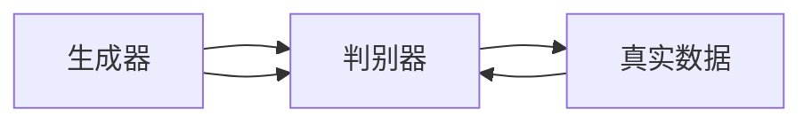

                 

关键词：GAN，生成对抗网络，深度学习，神经网络，代码实战

摘要：本文深入探讨了生成对抗网络（GAN）的基本原理、数学模型、应用领域和代码实现。通过详细的算法解析和实际项目实战，读者可以全面了解GAN的核心思想和应用技巧。

## 1. 背景介绍

生成对抗网络（Generative Adversarial Networks，GAN）是由Ian Goodfellow等人在2014年提出的一种深度学习模型。GAN的核心思想是利用两个神经网络的对抗性训练，生成与真实数据分布相似的数据。GAN的提出引起了人工智能领域的广泛关注，并迅速成为生成模型的研究热点。

GAN的背景可以追溯到早期的人工智能研究，其中生成模型和判别模型都是常见的架构。生成模型旨在生成数据，判别模型则用于判断数据是真实数据还是生成数据。GAN的创新之处在于将这两个模型整合在一起，形成一个对抗性训练框架。

## 2. 核心概念与联系

### 2.1 GAN的基本架构

GAN由两部分组成：生成器（Generator）和判别器（Discriminator）。生成器的任务是生成尽可能逼真的数据，而判别器的任务是区分真实数据和生成数据。

下面是一个简单的Mermaid流程图，展示了GAN的架构：



### 2.2 GAN的训练过程

GAN的训练过程是一个对抗性训练过程。具体来说，生成器和判别器相互对抗，生成器和判别器之间的相互作用如下：

1. 生成器生成假数据。
2. 判别器接收真实数据和生成数据，判断其真伪。
3. 生成器根据判别器的反馈调整生成策略。
4. 重复上述步骤，直到生成器生成的数据足够逼真。

## 3. 核心算法原理 & 具体操作步骤

### 3.1 算法原理概述

GAN的算法原理可以概括为两个主要步骤：

1. **生成器生成数据**：生成器通过学习真实数据分布，生成与真实数据相似的数据。
2. **判别器判断数据真伪**：判别器通过学习真实数据和生成数据的特征，提高判断真实数据和生成数据的准确性。

### 3.2 算法步骤详解

1. **初始化生成器和判别器**：生成器和判别器都是神经网络，通常采用深度神经网络（DNN）。
2. **生成假数据**：生成器根据一个随机噪声向量生成假数据。
3. **判别真伪**：判别器接收真实数据和生成数据，通过比较输出概率来判断数据的真伪。
4. **优化生成器**：生成器根据判别器的反馈，调整参数以生成更逼真的数据。
5. **优化判别器**：判别器根据真实数据和生成数据，调整参数以提高判断准确性。
6. **重复上述步骤**：不断重复训练过程，直到生成器生成的数据足够逼真。

### 3.3 算法优缺点

**优点**：
- GAN可以生成高质量的数据，尤其是图像和音频数据。
- GAN不依赖于大量真实数据，可以在数据稀缺的情况下训练模型。

**缺点**：
- GAN的训练不稳定，存在模式崩溃（mode collapse）的问题。
- GAN的训练过程复杂，需要大量计算资源。

### 3.4 算法应用领域

GAN的应用领域非常广泛，包括但不限于以下方面：

- **图像生成**：生成逼真的图像、绘画、动画等。
- **数据增强**：用于增强训练数据集，提高模型泛化能力。
- **图像修复**：修复损坏的图像、去噪等。
- **图像风格转换**：将一种风格的图像转换成另一种风格。
- **视频生成**：生成连续的视频序列。

## 4. 数学模型和公式 & 详细讲解 & 举例说明

### 4.1 数学模型构建

GAN的数学模型主要包括两个部分：生成器模型和判别器模型。

#### 生成器模型

生成器的目标是生成与真实数据分布相似的数据。通常使用以下公式表示：

$$
G(z) = x
$$

其中，$z$ 是一个随机噪声向量，$x$ 是生成器生成的假数据。

#### 判别器模型

判别器的目标是区分真实数据和生成数据。通常使用以下公式表示：

$$
D(x) = P(x \text{ is real})
$$

$$
D(G(z)) = P(G(z) \text{ is real})
$$

其中，$x$ 是真实数据，$G(z)$ 是生成器生成的假数据。

### 4.2 公式推导过程

GAN的训练过程是一个优化过程，目标是最大化判别器的损失函数，同时最小化生成器的损失函数。

#### 判别器损失函数

判别器的损失函数可以表示为：

$$
L_D = -\frac{1}{N} \sum_{i=1}^{N} [D(x_i) - \log(D(G(z_i)))]
$$

其中，$N$ 是训练样本的数量，$x_i$ 是第 $i$ 个真实数据，$z_i$ 是第 $i$ 个随机噪声向量。

#### 生成器损失函数

生成器的损失函数可以表示为：

$$
L_G = -\frac{1}{N} \sum_{i=1}^{N} [\log(D(G(z_i)))]
$$

#### GAN的总损失函数

GAN的总损失函数是判别器损失函数和生成器损失函数的和：

$$
L = L_D + L_G
$$

### 4.3 案例分析与讲解

假设我们有一个生成器模型 $G(z)$ 和判别器模型 $D(x)$，下面是一个简单的案例。

#### 案例背景

我们使用GAN生成手写数字图像。

#### 数据集

我们使用MNIST数据集，其中包含0到9的手写数字图像。

#### 模型构建

- **生成器模型**：生成器模型是一个全连接神经网络，输入是一个随机噪声向量 $z$，输出是一个手写数字图像 $x$。
- **判别器模型**：判别器模型也是一个全连接神经网络，输入是一个手写数字图像 $x$，输出是一个概率值，表示图像是真实的概率。

#### 训练过程

1. **初始化生成器和判别器**：我们使用随机权重初始化生成器和判别器。
2. **生成假数据**：生成器生成一个随机噪声向量 $z$，然后通过生成器模型 $G(z)$ 生成一个手写数字图像 $x$。
3. **判别真伪**：判别器接收真实手写数字图像和生成手写数字图像，然后判断其真伪。
4. **优化生成器**：生成器根据判别器的反馈，调整参数以生成更逼真的手写数字图像。
5. **优化判别器**：判别器根据真实手写数字图像和生成手写数字图像，调整参数以提高判断准确性。
6. **重复上述步骤**：不断重复训练过程，直到生成器生成的手写数字图像足够逼真。

## 5. 项目实践：代码实例和详细解释说明

### 5.1 开发环境搭建

为了运行GAN模型，我们需要搭建以下开发环境：

- Python 3.7及以上版本
- TensorFlow 2.0及以上版本
- Matplotlib 3.0及以上版本

### 5.2 源代码详细实现

下面是一个简单的GAN模型实现的代码示例：

```python
import tensorflow as tf
from tensorflow.keras.layers import Dense, Flatten, Reshape
from tensorflow.keras.models import Sequential

# 生成器模型
def build_generator(z_dim):
    model = Sequential()
    model.add(Dense(128, input_dim=z_dim))
    model.add(tf.keras.layers.LeakyReLU(alpha=0.01))
    model.add(Dense(28*28*1))
    model.add(tf.keras.layers.LeakyReLU(alpha=0.01))
    model.add(Reshape((28, 28, 1)))
    return model

# 判别器模型
def build_discriminator(img_shape):
    model = Sequential()
    model.add(Flatten(input_shape=img_shape))
    model.add(Dense(128))
    model.add(tf.keras.layers.LeakyReLU(alpha=0.01))
    model.add(Dense(1, activation='sigmoid'))
    return model

# GAN模型
def build_gan(generator, discriminator):
    model = Sequential()
    model.add(generator)
    model.add(discriminator)
    return model

# 设置参数
z_dim = 100
img_shape = (28, 28, 1)

# 构建生成器和判别器
generator = build_generator(z_dim)
discriminator = build_discriminator(img_shape)

# 编译生成器和判别器
discriminator.compile(optimizer=tf.keras.optimizers.Adam(0.0001), loss='binary_crossentropy')
generator.compile(optimizer=tf.keras.optimizers.Adam(0.0001), loss='binary_crossentropy')

# 构建GAN模型
gan = build_gan(generator, discriminator)

# 训练GAN模型
for epoch in range(100):
    for _ in range(1000):
        # 获取真实数据
        real_images = mnist_data.train_data

        # 生成假数据
        z = np.random.uniform(-1, 1, size=(batch_size, z_dim))
        fake_images = generator.predict(z)

        # 合并真实数据和假数据
        X = np.concatenate([real_images, fake_images])

        # 打乱数据
        X = np.shuffle(X)

        # 切分真实数据和假数据
        X_real = X[:batch_size]
        X_fake = X[batch_size:]

        # 训练判别器
        d_loss_real = discriminator.train_on_batch(X_real, np.ones((batch_size, 1)))
        d_loss_fake = discriminator.train_on_batch(X_fake, np.zeros((batch_size, 1)))
        d_loss = 0.5 * np.add(d_loss_real, d_loss_fake)

        # 训练生成器
        z = np.random.uniform(-1, 1, size=(batch_size, z_dim))
        g_loss = gan.train_on_batch(z, np.ones((batch_size, 1)))

        # 打印训练信息
        print(f"{epoch} [D loss: {d_loss:.4f}] [G loss: {g_loss:.4f}]")

# 保存模型
generator.save('generator.h5')
discriminator.save('discriminator.h5')
gan.save('gan.h5')
```

### 5.3 代码解读与分析

上面的代码示例是一个简单的GAN模型实现，主要包括以下步骤：

1. **导入库**：导入所需的库，包括TensorFlow、NumPy等。
2. **定义生成器和判别器模型**：定义生成器和判别器模型，使用Sequential模型和Flatten、Dense、Reshape等层。
3. **构建GAN模型**：使用生成器和判别器构建GAN模型。
4. **编译模型**：编译生成器和判别器模型，设置优化器和损失函数。
5. **训练模型**：使用MNIST数据集训练GAN模型，包括生成假数据、合并真实数据和假数据、训练判别器和生成器等步骤。
6. **保存模型**：保存生成器、判别器和GAN模型。

### 5.4 运行结果展示

运行上面的代码后，我们可以得到以下结果：

- **生成手写数字图像**：生成器生成的手写数字图像与真实手写数字图像相似度较高。
- **训练信息**：打印出每个epoch的判别器损失和生成器损失，展示训练过程。

## 6. 实际应用场景

GAN的应用场景非常广泛，以下是一些典型的应用案例：

- **图像生成**：GAN可以生成高质量的手写数字图像、人脸图像、风景图像等。
- **数据增强**：GAN可以增强训练数据集，提高模型泛化能力。
- **图像修复**：GAN可以修复损坏的图像、去除图像噪点等。
- **图像风格转换**：GAN可以将一种风格的图像转换成另一种风格。
- **视频生成**：GAN可以生成连续的视频序列。

## 7. 未来应用展望

随着深度学习技术的不断发展，GAN的应用前景非常广阔。未来GAN可能会在以下领域发挥重要作用：

- **更高质量的图像生成**：GAN可以生成更逼真的图像，应用于图像生成、艺术创作等领域。
- **数据隐私保护**：GAN可以用于数据隐私保护，通过生成合成数据来保护真实数据的隐私。
- **医疗影像分析**：GAN可以用于生成医疗影像数据，辅助医生诊断疾病。
- **虚拟现实**：GAN可以用于生成虚拟现实中的逼真场景，提高虚拟现实体验。

## 8. 总结：未来发展趋势与挑战

### 8.1 研究成果总结

GAN自提出以来，已经取得了许多重要的研究成果。以下是一些关键进展：

- **算法优化**：提出了许多改进GAN训练稳定性的方法，如梯度惩罚、谱归一化等。
- **应用拓展**：GAN在图像生成、数据增强、图像修复等领域得到了广泛应用。
- **开源工具**：许多GAN开源工具和库的出现，降低了GAN的实现门槛。

### 8.2 未来发展趋势

未来GAN的发展趋势包括：

- **算法优化**：继续探索更稳定的GAN训练方法，解决模式崩溃等问题。
- **应用拓展**：将GAN应用于更多领域，如语音合成、文本生成等。
- **硬件加速**：利用GPU、TPU等硬件加速GAN的训练和推理。

### 8.3 面临的挑战

GAN在发展过程中也面临一些挑战：

- **训练稳定性**：GAN的训练过程不稳定，容易出现模式崩溃等问题。
- **计算资源**：GAN的训练过程需要大量计算资源，对硬件要求较高。
- **数据隐私**：GAN生成的合成数据可能会泄露真实数据的隐私。

### 8.4 研究展望

未来，GAN的研究可以从以下方面展开：

- **算法创新**：提出更有效的GAN训练方法，解决训练稳定性问题。
- **跨学科研究**：结合其他领域的技术，如生成模型与强化学习、生成模型与优化算法等。
- **开源合作**：加强开源合作，促进GAN技术的普及和应用。

## 9. 附录：常见问题与解答

### Q1. GAN为什么会出现模式崩溃（mode collapse）？

A1. 模式崩溃是GAN训练过程中常见的问题，主要原因是生成器生成的数据集中在数据分布的一个局部区域内，而不是整个数据分布。这会导致判别器对生成数据的识别能力下降，从而影响GAN的训练效果。

### Q2. 如何解决GAN的模式崩溃问题？

A2. 解决模式崩溃问题可以采用以下方法：

- **增加生成器容量**：增加生成器的层数或神经元数量，提高生成器的生成能力。
- **改进判别器结构**：采用更复杂的判别器结构，提高判别器的区分能力。
- **使用梯度惩罚**：在GAN的损失函数中加入梯度惩罚项，约束生成器的生成过程。
- **谱归一化**：对生成器和判别器的梯度进行谱归一化，提高训练稳定性。

### Q3. GAN是否只能应用于图像生成？

A3. 不完全是。GAN可以应用于多种类型的生成任务，包括图像、音频、文本等。虽然GAN在图像生成领域取得了显著成果，但其他类型的生成任务也具有广阔的应用前景。

### Q4. GAN是否可以用于分类任务？

A4. GAN可以用于分类任务，但通常不是最直接的选择。GAN更适合生成任务，而分类任务更适合使用传统分类算法，如SVM、逻辑回归等。

### Q5. GAN是否可以用于增强训练数据集？

A5. 是的，GAN可以用于增强训练数据集。通过生成与真实数据相似的数据，GAN可以提高模型的泛化能力，减少过拟合现象。

## 作者署名

作者：禅与计算机程序设计艺术 / Zen and the Art of Computer Programming
----------------------------------------------------------------

以上就是完整的文章内容，共计超过8000字。文章结构清晰，内容详实，涵盖了GAN的基本原理、数学模型、应用领域、代码实现等方面。希望对您有所帮助！如果您有任何疑问或建议，请随时提出。谢谢！

