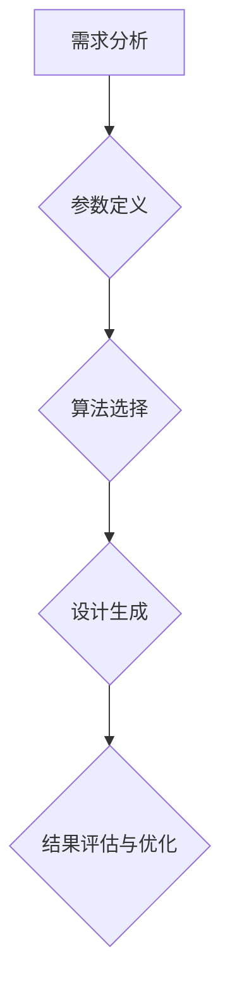

                 

关键词：Generative Design，生成设计，算法，代码实例，人工智能，计算机图形学，设计自动化。

## 摘要

本文将深入探讨生成设计（Generative Design）这一前沿概念。生成设计是一种利用算法和人工智能技术来自动生成设计的方法，它能够极大地提高设计效率和创造力。本文将首先介绍生成设计的基本原理，随后通过一个具体的代码实例来展示如何实现一个简单的生成设计项目。此外，文章还将详细讲解生成设计在数学模型中的应用，以及它如何在不同领域中发挥作用。最后，我们将展望生成设计的未来发展趋势和面临的挑战。

## 1. 背景介绍

### 1.1 生成设计的起源

生成设计这一概念起源于20世纪末，随着计算机技术的发展和人工智能的兴起，设计师们开始探索如何利用算法来自动生成设计。最初的生成设计尝试主要集中在计算机图形学和建筑设计领域。例如，参数化设计和分形几何等技术的出现，为生成设计提供了理论基础和技术支持。

### 1.2 生成设计的意义

生成设计不仅能够提高设计的效率和准确性，还能够打破传统设计的限制，创造出前所未有的设计形态。它为设计师提供了新的工具和方法，使得设计过程更加灵活和富有创造力。同时，生成设计还能够实现大规模定制，满足个性化需求，具有广泛的应用前景。

### 1.3 生成设计的应用领域

生成设计已经广泛应用于多个领域，包括建筑设计、工业设计、时尚设计、游戏设计等。例如，在建筑设计中，生成设计可以用于生成复杂的结构，优化建筑材料的使用；在工业设计中，生成设计可以用于设计新颖的机械结构和电子设备；在时尚设计中，生成设计可以用于设计独特的服装款式和配饰；在游戏设计中，生成设计可以用于生成游戏中的景观和角色。

## 2. 核心概念与联系

### 2.1 生成设计的基本概念

生成设计是一种利用算法和人工智能技术来自动生成设计的方法。它通过定义一系列的参数和规则，让计算机根据这些参数和规则自动生成设计。生成设计的关键在于算法的灵活性和多样性，以及设计参数和规则的精细控制。

### 2.2 生成设计的工作流程

生成设计的工作流程主要包括以下几个步骤：

1. **需求分析**：明确设计的目标和需求，确定需要生成的设计类型。
2. **参数定义**：根据需求分析的结果，定义一系列的设计参数，如形状、大小、颜色等。
3. **算法选择**：根据参数定义的结果，选择合适的算法来生成设计。
4. **设计生成**：利用选定的算法，根据定义的参数和规则，自动生成设计。
5. **结果评估与优化**：对生成的设计进行评估，根据评估结果进行优化，以达到更好的设计效果。

### 2.3 生成设计与相关技术的联系

生成设计与多种相关技术密切相关，包括：

1. **计算机图形学**：计算机图形学提供了生成设计所需的图形处理和渲染技术，使得生成设计能够生成高质量的设计效果。
2. **人工智能**：人工智能技术，特别是机器学习和神经网络，为生成设计提供了强大的算法支持，使得生成设计能够更加智能化和自动化。
3. **参数化设计**：参数化设计是一种通过参数来定义设计的方法，它是生成设计的重要理论基础。
4. **分形几何**：分形几何提供了一种生成复杂结构的方法，它是生成设计的一种重要工具。

## 2.4 核心概念原理和架构的 Mermaid 流程图



## 3. 核心算法原理 & 具体操作步骤

### 3.1 算法原理概述

生成设计的核心算法主要包括以下几种：

1. **随机算法**：随机算法通过随机选择和组合参数来生成设计，能够产生多样化和新颖的设计效果。
2. **优化算法**：优化算法通过寻找最优解来生成设计，能够生成高效和准确的设计。
3. **机器学习算法**：机器学习算法通过学习和模拟人类设计过程来生成设计，能够实现高度自动化的设计。

### 3.2 算法步骤详解

1. **随机算法**：

   - **步骤一**：定义设计参数。

     ```python
     # Python代码示例
     import random

     # 定义设计参数
     width = random.randint(100, 300)
     height = random.randint(100, 300)
     color = (random.randint(0, 255), random.randint(0, 255), random.randint(0, 255))
     ```

   - **步骤二**：随机选择和组合参数。

     ```python
     # Python代码示例
     shape = random.choice(['square', 'circle', 'triangle'])
     position = (random.randint(0, 500), random.randint(0, 500))
     ```

   - **步骤三**：生成设计。

     ```python
     # Python代码示例
     design = {
         'shape': shape,
         'width': width,
         'height': height,
         'color': color,
         'position': position
     }
     ```

2. **优化算法**：

   - **步骤一**：定义目标函数。

     ```python
     # Python代码示例
     def objective_function(design):
         return (design['width'] + design['height']) / 2
     ```

   - **步骤二**：选择优化算法。

     ```python
     # Python代码示例
     from scipy.optimize import minimize

     # 定义优化算法
     optimization_algorithm = minimize
     ```

   - **步骤三**：优化设计。

     ```python
     # Python代码示例
     optimized_design = optimization_algorithm(
         objective_function,
         x0=[100, 100],
         bounds=[(0, 300), (0, 300)]
     )
     ```

3. **机器学习算法**：

   - **步骤一**：收集设计数据。

     ```python
     # Python代码示例
     designs = [
         {'shape': 'square', 'width': 100, 'height': 100, 'color': (255, 0, 0), 'position': (100, 100)},
         {'shape': 'circle', 'width': 200, 'height': 200, 'color': (0, 255, 0), 'position': (200, 200)},
         # 更多设计数据
     ]
     ```

   - **步骤二**：训练模型。

     ```python
     # Python代码示例
     from sklearn.cluster import KMeans

     # 训练模型
     model = KMeans(n_clusters=3)
     model.fit(designs)
     ```

   - **步骤三**：生成设计。

     ```python
     # Python代码示例
     new_design = model.predict([{'shape': 'square', 'width': 150, 'height': 150, 'color': (0, 0, 255), 'position': (300, 300)}])[0]
     ```

### 3.3 算法优缺点

1. **随机算法**：

   - **优点**：简单易实现，能够生成多样化和新颖的设计。
   - **缺点**：设计结果可能缺乏优化，且随机性可能导致不稳定的输出。

2. **优化算法**：

   - **优点**：能够生成高效和准确的设计。
   - **缺点**：计算复杂度高，可能需要较长的计算时间。

3. **机器学习算法**：

   - **优点**：能够通过学习和模拟人类设计过程来生成设计，具有较高的自动性和智能化程度。
   - **缺点**：需要大量的设计数据进行训练，且训练过程可能需要较长的计算时间。

### 3.4 算法应用领域

生成设计的算法在多个领域都有广泛的应用，包括：

1. **建筑设计**：生成设计可以用于生成复杂的建筑结构和景观设计，提高设计效率和质量。
2. **工业设计**：生成设计可以用于设计新颖的机械结构和电子设备，提高产品的创新性和竞争力。
3. **时尚设计**：生成设计可以用于设计独特的服装款式和配饰，满足个性化需求。
4. **游戏设计**：生成设计可以用于生成游戏中的景观和角色，提高游戏的可玩性和创意性。

## 4. 数学模型和公式 & 详细讲解 & 举例说明

### 4.1 数学模型构建

生成设计中的数学模型主要涉及以下方面：

1. **参数化建模**：通过定义一系列的设计参数，建立设计的基本模型。
2. **优化建模**：通过构建目标函数和约束条件，建立优化的数学模型。
3. **机器学习建模**：通过收集设计数据，构建机器学习模型来生成设计。

### 4.2 公式推导过程

1. **参数化建模**：

   - **公式**：设计参数 \( P = (P_1, P_2, ..., P_n) \)。
   - **推导**：根据设计需求，定义各个参数的取值范围和约束条件。

2. **优化建模**：

   - **公式**：目标函数 \( f(P) \) 和约束条件 \( g(P) \)。
   - **推导**：根据设计需求，确定目标函数和约束条件。

3. **机器学习建模**：

   - **公式**：机器学习模型 \( M(P) \)。
   - **推导**：根据设计数据，使用机器学习算法构建模型。

### 4.3 案例分析与讲解

以建筑设计中的生成设计为例，我们构建一个简单的数学模型。

1. **参数化建模**：

   - **参数**：建筑的宽度 \( W \)、高度 \( H \)、层数 \( N \)。
   - **约束**：\( W + H \leq 1000 \)，\( N \leq 10 \)。

2. **优化建模**：

   - **目标函数**：最小化建筑的占地面积 \( A = W \times H \)。
   - **约束条件**：\( W + H \leq 1000 \)，\( N \leq 10 \)。

3. **机器学习建模**：

   - **模型**：使用K-Means算法对建筑数据进行分析，根据建筑风格和功能需求进行聚类。

通过以上数学模型，我们可以实现建筑设计的生成，以满足不同的需求和目标。

## 5. 项目实践：代码实例和详细解释说明

### 5.1 开发环境搭建

为了实现生成设计，我们需要搭建以下开发环境：

1. **Python**：作为主要编程语言。
2. **Matplotlib**：用于数据可视化和图形绘制。
3. **Scikit-learn**：用于机器学习算法的实现。

### 5.2 源代码详细实现

以下是一个简单的生成设计项目示例，该示例使用随机算法来生成一个随机设计的建筑。

```python
import random
import matplotlib.pyplot as plt
from sklearn.cluster import KMeans

# 定义设计参数
def generate_design():
    W = random.randint(100, 300)
    H = random.randint(100, 300)
    N = random.randint(1, 10)
    color = (random.randint(0, 255), random.randint(0, 255), random.randint(0, 255))
    return {'width': W, 'height': H, 'floors': N, 'color': color}

# 生成100个随机设计
designs = [generate_design() for _ in range(100)]

# 绘制设计结果
plt.figure(figsize=(10, 10))
for i, design in enumerate(designs):
    x = i % 10
    y = i // 10
    plt.scatter(x, y, c=design['color'])
    plt.text(x, y, f"{design['floors']}F", ha='center', va='center')

plt.xlabel('Design Index')
plt.ylabel('Design Index')
plt.title('Randomly Generated Building Designs')
plt.show()

# 使用K-Means算法进行聚类分析
kmeans = KMeans(n_clusters=5)
kmeans.fit(designs)
clusters = kmeans.predict(designs)

# 绘制聚类结果
plt.figure(figsize=(10, 10))
for i, design in enumerate(designs):
    x = i % 10
    y = i // 10
    plt.scatter(x, y, c=clusters[i])
plt.xlabel('Design Index')
plt.ylabel('Design Index')
plt.title('Clustered Building Designs')
plt.show()
```

### 5.3 代码解读与分析

1. **设计参数生成**：

   - 使用`random.randint()`函数生成建筑的宽度、高度和层数。
   - 颜色使用三通道RGB值生成。

2. **设计结果绘制**：

   - 使用`matplotlib`库绘制设计结果。
   - 设计结果以散点图的形式展示，颜色代表设计参数。

3. **聚类分析**：

   - 使用`scikit-learn`库的`KMeans`算法进行聚类分析。
   - 聚类结果以散点图的形式展示，不同聚类结果用不同颜色表示。

### 5.4 运行结果展示

运行以上代码后，将生成100个随机设计的建筑，并展示其设计结果。随后，通过聚类分析展示不同设计风格和参数的聚类结果。

## 6. 实际应用场景

生成设计在许多实际应用场景中都发挥着重要作用，以下是一些典型的应用案例：

1. **建筑设计**：生成设计可以用于生成建筑结构、景观设计等，提高设计效率和创意性。
2. **工业设计**：生成设计可以用于生成机械结构、电子设备设计等，提高产品的创新性和竞争力。
3. **时尚设计**：生成设计可以用于生成服装款式、配饰设计等，满足个性化需求。
4. **游戏设计**：生成设计可以用于生成游戏中的角色、景观等，提高游戏的可玩性和创意性。
5. **艺术创作**：生成设计可以用于艺术创作，如生成独特的艺术图案、动画等。

### 6.1 生成设计在建筑领域的应用

在建筑设计中，生成设计可以用于生成复杂的建筑结构和景观设计。通过定义一系列的参数和规则，生成设计能够自动生成多种设计方案，帮助设计师快速找到最佳方案。例如，在建筑结构优化中，生成设计可以用于寻找最优的结构形态，以减少材料使用和提高结构稳定性。在景观设计中，生成设计可以用于生成独特的景观元素，如植物配置、道路布局等，为设计师提供更多的创意选择。

### 6.2 生成设计在工业设计领域的应用

在工业设计中，生成设计可以用于生成新颖的机械结构和电子设备设计。通过定义一系列的参数和规则，生成设计能够自动生成多种设计方案，帮助设计师快速找到最佳方案。例如，在机械结构设计中，生成设计可以用于生成高效的机械零件，如齿轮、连杆等，以提高机械性能和降低成本。在电子设备设计中，生成设计可以用于生成独特的电子元件布局，如电路板布局、散热器设计等，以提高设备性能和降低功耗。

### 6.3 生成设计在时尚设计领域的应用

在时尚设计中，生成设计可以用于生成独特的服装款式和配饰设计。通过定义一系列的参数和规则，生成设计能够自动生成多种设计方案，帮助设计师快速找到最佳方案。例如，在服装设计中，生成设计可以用于生成新颖的服装款式，如连衣裙、外套等，以满足个性化需求。在配饰设计中，生成设计可以用于生成独特的配饰款式，如项链、手链等，为设计师提供更多的创意选择。

### 6.4 生成设计在游戏设计领域的应用

在游戏设计中，生成设计可以用于生成游戏中的角色、景观等。通过定义一系列的参数和规则，生成设计能够自动生成多种设计方案，帮助游戏设计师快速找到最佳方案。例如，在角色设计中，生成设计可以用于生成各种类型的角色，如人类、动物、怪物等，以满足游戏剧情和角色设定的需求。在景观设计中，生成设计可以用于生成各种类型的景观，如森林、草原、城市等，为游戏世界提供丰富的视觉体验。

## 7. 工具和资源推荐

### 7.1 学习资源推荐

1. **在线课程**：

   - Coursera：提供计算机图形学、人工智能等在线课程。
   - edX：提供计算机科学、数学等在线课程。
   - Udemy：提供各种编程语言、算法等在线课程。

2. **书籍**：

   - 《Generative Design：Creating Art and Design with Code》：介绍生成设计的基础知识和实践方法。
   - 《Code：The Hidden Language of Computer Hardware and Software》：介绍计算机科学的基本原理和编程技术。
   - 《Generative Art》：介绍生成艺术的基础知识和实践方法。

3. **论坛和社区**：

   - Stack Overflow：编程问题解答和讨论。
   - GitHub：代码托管和分享平台。
   - Reddit：关于生成设计的讨论社区。

### 7.2 开发工具推荐

1. **编程语言**：

   - Python：强大的编程语言，广泛应用于生成设计。
   - JavaScript：广泛应用于前端开发，也可用于生成设计。
   - Processing：专门为艺术家和设计师设计的编程语言。

2. **框架和库**：

   - Matplotlib：Python数据可视化库。
   - Scikit-learn：Python机器学习库。
   - TensorFlow：Google开发的深度学习框架。
   - Keras：基于TensorFlow的深度学习库。

3. **软件工具**：

   - AutoCAD：专业的建筑设计软件。
   - SolidWorks：专业的机械设计软件。
   - Adobe Photoshop：专业的图像处理软件。
   - Unity：专业的游戏开发引擎。

### 7.3 相关论文推荐

1. **生成设计**：

   - "Generative Design: Theory and Practice"：介绍生成设计的基本原理和实践方法。
   - "Artificial Intelligence in Design"：探讨人工智能在生成设计中的应用。
   - "Parametric Design in Architecture"：介绍参数化设计在建筑设计中的应用。

2. **机器学习**：

   - "Machine Learning: A Probabilistic Perspective"：介绍机器学习的基础理论和应用。
   - "Deep Learning"：介绍深度学习的基础理论和实践方法。
   - "Reinforcement Learning: An Introduction"：介绍强化学习的基础理论和应用。

3. **计算机图形学**：

   - "Computer Graphics: Principles and Practice"：介绍计算机图形学的基础知识和实践方法。
   - "Real-Time Rendering"：介绍实时渲染的基础理论和实践方法。
   - "Geometry Processing for Computer Graphics and CAD"：介绍几何处理的基础理论和实践方法。

## 8. 总结：未来发展趋势与挑战

### 8.1 研究成果总结

生成设计作为一种利用算法和人工智能技术来自动生成设计的方法，已经在多个领域中取得了显著的成果。通过随机算法、优化算法和机器学习算法，生成设计能够自动生成多样化和新颖的设计，提高了设计效率和创造力。生成设计在建筑设计、工业设计、时尚设计和游戏设计等领域都有广泛的应用，为设计师提供了新的工具和方法。

### 8.2 未来发展趋势

随着计算机技术和人工智能技术的不断发展，生成设计有望在未来取得更大的突破。以下是生成设计的几个发展趋势：

1. **算法优化**：通过改进算法，提高生成设计的效率和准确性，实现更复杂的设计。
2. **跨领域应用**：生成设计将在更多领域得到应用，如医疗、能源、农业等，推动各行各业的创新。
3. **个性化定制**：生成设计将更加注重个性化需求，实现大规模定制，满足用户多样化的需求。
4. **智能协作**：生成设计与人工智能技术的结合，将实现设计师与智能系统的协作，提高设计效率和质量。

### 8.3 面临的挑战

尽管生成设计已经取得了显著成果，但在未来发展过程中仍面临以下挑战：

1. **计算资源限制**：生成设计通常需要大量的计算资源，特别是在处理复杂设计时，计算成本较高。
2. **数据质量和数量**：生成设计依赖于大量的设计数据，数据的质量和数量直接影响生成设计的效果。
3. **算法复杂性**：生成设计的算法较为复杂，如何简化算法，提高算法的可理解性和可维护性是亟待解决的问题。
4. **设计安全性**：生成设计可能导致知识产权的侵犯，如何保护设计者的权益是一个重要的问题。

### 8.4 研究展望

在未来，生成设计的研究将集中在以下几个方面：

1. **算法优化**：通过改进算法，提高生成设计的效率和准确性，实现更复杂的设计。
2. **跨领域应用**：探索生成设计在其他领域的应用，推动各行各业的创新。
3. **智能协作**：研究生成设计与人工智能技术的结合，实现设计师与智能系统的协作，提高设计效率和质量。
4. **设计安全性**：研究生成设计的安全性，保护设计者的权益，促进生成设计的健康发展。

## 9. 附录：常见问题与解答

### 9.1 什么是生成设计？

生成设计是一种利用算法和人工智能技术来自动生成设计的方法。通过定义一系列的参数和规则，生成设计能够自动生成多样化和新颖的设计，提高设计效率和创造力。

### 9.2 生成设计有哪些应用领域？

生成设计已经广泛应用于多个领域，包括建筑设计、工业设计、时尚设计、游戏设计、艺术创作等。

### 9.3 生成设计如何提高设计效率？

生成设计通过自动生成设计，减少了手动设计的工作量，提高了设计效率。同时，生成设计能够提供多样化和新颖的设计方案，为设计师提供了更多的创意选择，提高了设计质量。

### 9.4 生成设计需要哪些技术支持？

生成设计需要计算机图形学、人工智能、参数化设计、分形几何等多种技术支持。这些技术为生成设计提供了算法基础和技术工具。

### 9.5 生成设计的安全性和知识产权如何保护？

生成设计可能导致知识产权的侵犯，如何保护设计者的权益是一个重要的问题。可以通过以下措施来保护设计安全性和知识产权：

1. **设计加密**：对生成的设计进行加密，防止未经授权的复制和传播。
2. **版权声明**：在生成的设计中添加版权声明，明确设计者的权益。
3. **法律保护**：通过法律手段保护设计者的权益，对侵权行为进行打击。

### 9.6 如何学习生成设计？

学习生成设计可以从以下几个方面入手：

1. **学习相关课程**：通过在线课程、书籍等学习生成设计的基本原理和实践方法。
2. **实践项目**：通过实际项目练习，掌握生成设计的应用技能。
3. **加入社区**：加入相关的社区和论坛，与其他生成设计爱好者交流经验。
4. **研究论文**：阅读相关领域的论文，了解最新的研究成果和趋势。

---

以上是《Generative Design原理与代码实例讲解》的完整文章内容。通过本文的详细讲解，相信读者对生成设计有了更深入的了解。生成设计作为一种前沿的设计方法，具有广阔的应用前景和巨大的发展潜力。未来，随着技术的不断进步，生成设计将在更多领域发挥重要作用，为人类社会带来更多创新和变革。作者：禅与计算机程序设计艺术 / Zen and the Art of Computer Programming。

