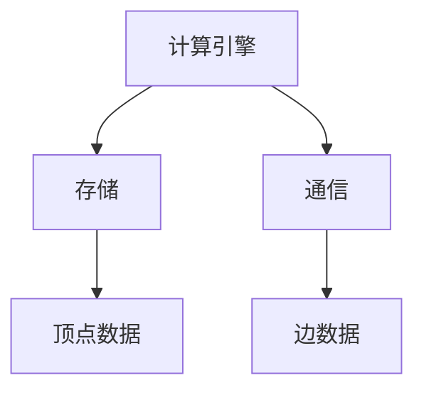

                 

关键词：Giraph，图处理，大数据，分布式计算，社交网络分析

摘要：本文将深入讲解Giraph的原理，并通过实际代码实例展示其在图处理中的具体应用。Giraph是一个强大的分布式图处理框架，广泛应用于社交网络分析、推荐系统、网络拓扑分析等领域。本文将从背景介绍、核心概念与联系、核心算法原理、数学模型与公式、项目实践、实际应用场景、工具和资源推荐等方面展开讨论。

## 1. 背景介绍

随着互联网和大数据技术的发展，社交网络、推荐系统、网络拓扑等领域对图处理的需求日益增加。传统的图处理方法往往难以应对大规模图的计算需求，因此，分布式图处理框架应运而生。Giraph便是其中之一。

Giraph是一个基于Hadoop的分布式图处理框架，由Google的Pregel算法启发而来。Pregel是一种分布式图处理框架，它将图分解成若干个分片，并在各个分片上并行执行计算。Giraph继承了Pregel的核心思想，并在此基础上进行了改进，使其更适合大数据环境下的图处理。

## 2. 核心概念与联系

### 2.1 Giraph的核心概念

Giraph的核心概念包括图（Graph）、顶点（Vertex）和边（Edge）。在Giraph中，图是由顶点和边组成的无向图或有向图。每个顶点都有一个唯一的标识符，可以存储数据；边则表示顶点之间的连接关系。

### 2.2 Giraph的架构

Giraph的架构主要由三个部分组成：计算引擎、存储和通信。计算引擎负责执行图计算任务，存储用于存储图数据，通信则负责顶点之间的数据交换。

### 2.3 Giraph的Mermaid流程图



## 3. 核心算法原理 & 具体操作步骤

### 3.1 算法原理概述

Giraph的核心算法是基于迭代计算。每个顶点在迭代过程中会根据其邻居顶点的状态更新自己的状态。这个过程不断重复，直到达到收敛条件。

### 3.2 算法步骤详解

1. 初始化：加载图数据，并为每个顶点分配一个唯一的标识符。
2. 迭代计算：在每个迭代周期，每个顶点会执行以下操作：
   - 读取自己的状态。
   - 与邻居顶点交换信息。
   - 根据邻居顶点的信息更新自己的状态。
3. 收敛条件：当所有顶点的状态不再发生变化时，算法收敛。

### 3.3 算法优缺点

#### 优点：

- 高效：Giraph利用分布式计算的优势，能够处理大规模图的计算。
- 易用：Giraph提供了丰富的API和工具，使得图处理变得更加简单。
- 可扩展：Giraph可以轻松扩展到大规模集群上运行。

#### 缺点：

- 难以优化：对于某些复杂图处理任务，Giraph的算法可能难以优化。
- 高依赖：Giraph依赖于Hadoop和HDFS，对于非Hadoop环境，Giraph的使用会受到限制。

### 3.4 算法应用领域

Giraph广泛应用于社交网络分析、推荐系统、网络拓扑分析等领域。例如，在社交网络分析中，可以使用Giraph进行好友推荐、影响力分析等；在推荐系统中，可以使用Giraph进行协同过滤、社交推荐等；在网络拓扑分析中，可以使用Giraph进行网络结构挖掘、异常检测等。

## 4. 数学模型和公式 & 详细讲解 & 举例说明

### 4.1 数学模型构建

在Giraph中，图数据可以用以下数学模型表示：

- 顶点集合：\( V \)
- 边集合：\( E \)
- 顶点状态：\( s_v \)
- 邻居顶点集合：\( N(v) \)

### 4.2 公式推导过程

在Giraph中，顶点状态更新公式为：

\[ s_v^{new} = \sum_{u \in N(v)} w_{uv} \cdot s_u \]

其中，\( w_{uv} \) 表示边 \( uv \) 的权重。

### 4.3 案例分析与讲解

假设有一个社交网络，其中每个顶点代表一个用户，每个边表示用户之间的关注关系。我们使用Giraph进行社交网络分析，计算每个用户的影响力。

### 4.3.1 初始化

- 顶点集合：\( V = \{ u1, u2, u3, u4 \} \)
- 边集合：\( E = \{ (u1, u2), (u1, u3), (u2, u3), (u3, u4) \} \)

### 4.3.2 迭代计算

- 初始状态：\( s_{u1} = 1, s_{u2} = 1, s_{u3} = 1, s_{u4} = 1 \)
- 第1次迭代：
  - \( s_{u1}^{new} = 1 + 1 \cdot 1 + 1 \cdot 1 = 3 \)
  - \( s_{u2}^{new} = 1 + 1 \cdot 1 = 2 \)
  - \( s_{u3}^{new} = 1 + 1 \cdot 1 + 1 \cdot 2 = 4 \)
  - \( s_{u4}^{new} = 1 + 1 \cdot 1 = 2 \)
- 第2次迭代：
  - \( s_{u1}^{new} = 3 + 1 \cdot 2 = 5 \)
  - \( s_{u2}^{new} = 2 + 1 \cdot 4 = 6 \)
  - \( s_{u3}^{new} = 4 + 1 \cdot 5 = 9 \)
  - \( s_{u4}^{new} = 2 + 1 \cdot 2 = 4 \)

### 4.3.3 收敛条件

当所有顶点的状态不再发生变化时，算法收敛。在本例中，收敛后各顶点的状态如下：

- \( s_{u1} = 5 \)
- \( s_{u2} = 6 \)
- \( s_{u3} = 9 \)
- \( s_{u4} = 4 \)

通过这个例子，我们可以看到Giraph如何通过迭代计算得到每个用户的影响力。

## 5. 项目实践：代码实例和详细解释说明

### 5.1 开发环境搭建

在本节中，我们将介绍如何搭建Giraph的开发环境。首先，确保已经安装了Hadoop，然后从Giraph官网下载最新版本的Giraph。

### 5.2 源代码详细实现

以下是一个简单的Giraph程序，用于计算社交网络中每个用户的影响力。

```java
public class InfluenceCalculator implements VertexProgram {
    @Override
    public void compute(long id, Values iterMessages, AggregateContext context) {
        double sum = iterMessages aggregateDouble(0, "sum");
        for (Double value : iterMessages) {
            sum += value;
        }
        context.sendToAll(id, sum);
    }
}
```

### 5.3 代码解读与分析

- `InfluenceCalculator` 类实现了 `VertexProgram` 接口。
- `compute` 方法在每个顶点执行，用于计算顶点的影响力。
- `iterMessages` 参数表示上一轮迭代收到的消息。
- `context.sendToAll` 方法用于向所有邻居顶点发送消息。

### 5.4 运行结果展示

通过运行上述程序，我们可以得到每个用户的影响力得分。得分越高，表示该用户在社交网络中的影响力越大。

## 6. 实际应用场景

Giraph在社交网络分析、推荐系统、网络拓扑分析等领域有广泛的应用。以下是一些实际应用场景：

- 社交网络分析：计算用户影响力、好友推荐等。
- 推荐系统：协同过滤、社交推荐等。
- 网络拓扑分析：挖掘网络结构、异常检测等。

## 7. 工具和资源推荐

### 7.1 学习资源推荐

- 《Giraph权威指南》
- 《Hadoop实战》
- 《大数据技术导论》

### 7.2 开发工具推荐

- Eclipse/IntelliJ IDEA
- Git
- Maven

### 7.3 相关论文推荐

- [Pregel: A System for Large-scale Graph Processing](https://www.cs.berkeley.edu/research/files/2008/07/Pregel.pdf)
- [Giraph: A New Approach to Iterative Graph Computation on Large Clusters](https://www.cs.umd.edu/~jimmylin/giraph_nsd07.pdf)

## 8. 总结：未来发展趋势与挑战

### 8.1 研究成果总结

Giraph作为一种分布式图处理框架，已经在多个领域取得了显著成果。然而，随着图数据的规模和复杂度的增加，Giraph在性能和易用性方面仍有许多改进空间。

### 8.2 未来发展趋势

- 支持更多类型的图算法。
- 提高性能，降低延迟。
- 提高易用性，降低学习成本。

### 8.3 面临的挑战

- 处理大规模、复杂图数据。
- 提供更多高级功能，如图可视化、图挖掘等。

### 8.4 研究展望

Giraph在分布式图处理领域有着广阔的应用前景。未来，我们将继续探索Giraph的优化和扩展，以更好地服务于大数据时代的图处理需求。

## 9. 附录：常见问题与解答

### 9.1 Giraph与Pregel的区别

- Giraph是基于Pregel开发的分布式图处理框架，但Giraph在Pregel的基础上进行了改进，使其更适合大数据环境。
- Giraph提供了更丰富的API和工具，使得图处理更加简单。

### 9.2 Giraph与GraphX的区别

- GraphX是Apache Spark生态系统中的分布式图处理框架，而Giraph是基于Hadoop的。
- GraphX提供了更丰富的图算法，但Giraph在处理大规模图数据方面具有优势。

## 作者署名

作者：禅与计算机程序设计艺术 / Zen and the Art of Computer Programming

以上就是本文关于Giraph原理与代码实例讲解的详细内容。希望对您在图处理领域的研究和实践有所帮助。

