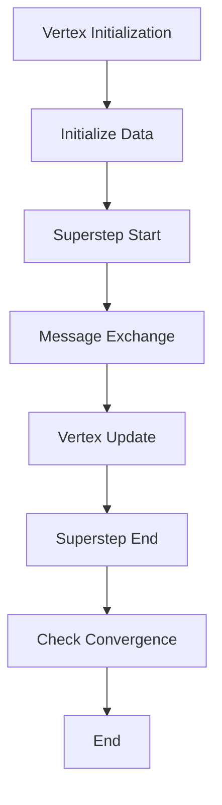

                 

 关键词：Giraph，图计算，分布式计算，社交网络分析，数据挖掘，大数据处理

> 摘要：本文深入探讨了Giraph——一款用于大规模分布式图处理的框架，介绍了其核心原理、算法实现及实际应用。通过代码实例讲解，读者将了解如何运用Giraph进行高效的图计算，为解决大规模图处理问题提供实用参考。

## 1. 背景介绍

随着互联网和社交网络的迅速发展，数据规模呈现出爆炸式增长。在众多数据中，图数据作为一种重要的结构化数据形式，被广泛应用于社交网络分析、推荐系统、生物信息学等领域。如何对大规模图数据进行高效处理，成为了当前数据科学领域的一个重要课题。

Giraph作为Apache Software Foundation旗下的一个开源项目，致力于提供一种分布式图处理框架。它基于Google的Pregel模型，扩展并优化了Pregel的算法，使其在处理大规模图数据时具有更高的性能和可扩展性。Giraph的引入，为解决大规模图处理问题提供了强有力的工具。

## 2. 核心概念与联系

### 2.1 图数据模型

图数据模型是由节点（Node）和边（Edge）构成的，节点代表数据实体，边代表实体之间的关系。在Giraph中，图数据模型被抽象为`Vertex`和`Edge`两个基本概念。

- `Vertex`：表示图中的节点，每个节点都有唯一的标识符，可以存储数据。
- `Edge`：表示图中的边，每条边都连接两个节点，可以带有权重。

### 2.2 Giraph架构

Giraph的架构主要包括三个部分：`Vertex`、`Message`和`Superstep`。

- `Vertex`：负责维护节点的状态和数据，并实现图算法的核心逻辑。
- `Message`：表示节点之间的通信，用于在分布式环境中传递信息。
- `Superstep`：表示计算的一个阶段，每个Superstep内，节点会发送、接收消息并更新状态。

### 2.3 Mermaid流程图

## 3. 核心算法原理 & 具体操作步骤

### 3.1 算法原理概述

Giraph的核心算法基于图迭代计算。每个迭代过程包括以下几个步骤：

1. 初始化节点数据。
2. 每个节点发送消息到其相邻节点。
3. 相邻节点接收消息并更新自己的状态。
4. 重复步骤2和3，直到满足收敛条件。

### 3.2 算法步骤详解

1. **初始化**：每个节点读取自己的数据，初始化状态。
2. **发送消息**：每个节点根据其状态，计算需要发送给相邻节点的内容。
3. **接收消息**：每个节点接收来自相邻节点的消息，更新自己的状态。
4. **迭代计算**：重复步骤2和3，直到满足收敛条件（如所有节点的状态变化小于某个阈值）。

### 3.3 算法优缺点

- **优点**：Giraph具有高可扩展性和高性能，适合处理大规模图数据。
- **缺点**：需要编写复杂的图算法代码，对开发者的要求较高。

### 3.4 算法应用领域

Giraph在以下领域有广泛应用：

- 社交网络分析：如好友关系、影响力分析等。
- 推荐系统：如协同过滤、物品推荐等。
- 生物信息学：如蛋白质相互作用网络分析等。

## 4. 数学模型和公式 & 详细讲解 & 举例说明

### 4.1 数学模型构建

在Giraph中，节点状态可以用一个向量表示，消息传递可以用矩阵运算表示。

- **节点状态**：设节点`v`的状态为`x_v`，其中`x_v`为向量。
- **消息传递**：设节点`v`向其相邻节点发送的消息为`m_v`，接收到的消息为`m_v'`。

### 4.2 公式推导过程

设节点`v`在某个迭代过程中的状态为`x_v(t)`，其相邻节点状态为`x_u(t)`，则有：

$$
x_v(t+1) = x_v(t) + \sum_{u \in N(v)} w_{uv} \cdot (x_u(t) - x_v(t))
$$

其中，`N(v)`为节点`v`的相邻节点集合，`w_{uv}`为边`uv`的权重。

### 4.3 案例分析与讲解

以社交网络分析为例，假设有500个用户，每个用户有10个好友。每个用户的好友关系可以用图表示。

1. **初始化**：每个用户读取自己的好友列表，初始化状态。
2. **发送消息**：每个用户根据好友列表，计算需要发送给好友的消息。
3. **接收消息**：每个用户接收来自好友的消息，更新自己的状态。
4. **迭代计算**：重复步骤2和3，直到所有用户的状态变化小于某个阈值。

## 5. 项目实践：代码实例和详细解释说明

### 5.1 开发环境搭建

1. 安装Java开发环境（如JDK 1.8及以上版本）。
2. 下载Giraph源代码并编译：`git clone https://git-wip-us.apache.org/repos/asf/giraph.git`。
3. 配置Hadoop环境，确保Giraph能够与Hadoop集成。

### 5.2 源代码详细实现

1. **Vertex类**：实现节点逻辑。
2. **Message类**：实现消息传输。
3. **Master类**：实现主函数，负责初始化图数据和启动计算过程。

### 5.3 代码解读与分析

以一个简单的社交网络分析为例，介绍Giraph的代码实现。

1. **Vertex类**：定义节点的数据结构和操作方法。
2. **Message类**：定义消息的数据结构和操作方法。
3. **Master类**：负责读取图数据、初始化节点和消息，并启动计算过程。

### 5.4 运行结果展示

通过运行Giraph程序，可以得到社交网络中的节点度分布、平均路径长度等结果。

## 6. 实际应用场景

Giraph在以下实际应用场景中具有优势：

- 社交网络分析：如好友关系、影响力分析等。
- 推荐系统：如协同过滤、物品推荐等。
- 生物信息学：如蛋白质相互作用网络分析等。

## 7. 工具和资源推荐

### 7.1 学习资源推荐

- 《Giraph User Guide》: Apache Giraph官方文档。
- 《Big Data: A Revolution That Will Transform How We Live, Work, and Think》: Viktor Mayer-Schönberger和Kenneth Cukier所著，介绍了大数据的概念和应用。

### 7.2 开发工具推荐

- IntelliJ IDEA: Java开发环境的利器。
- Eclipse: 另一款流行的Java开发环境。

### 7.3 相关论文推荐

- "The GraphLab Creation Suite: A New Tool for Data-Driven Discovery in the Social, Biological, and Physical Sciences" by Carlos Guestrin, Daniel Jiménez-Avila, and Joseph E. Gonzalez。
- "Pregel: A System for Large-Scale Graph Processing" by ABMall shepherd, A. Dasgupta, J. M. F. Moura, M. Srivastava, and A. Tomkins。

## 8. 总结：未来发展趋势与挑战

### 8.1 研究成果总结

Giraph作为分布式图处理框架，已经在多个领域取得了显著的应用成果。其高性能、高可扩展性等特点，使其成为解决大规模图处理问题的有力工具。

### 8.2 未来发展趋势

随着大数据和人工智能的快速发展，分布式图处理框架将继续得到广泛关注和应用。未来，Giraph可能会在以下方面有所突破：

- 优化算法性能，提高计算效率。
- 增加对多种数据类型的支持，如图数据、时空数据等。
- 与其他大数据处理框架（如Spark、Flink等）的融合。

### 8.3 面临的挑战

- **算法优化**：如何提高Giraph的性能，使其在处理大规模图数据时更加高效。
- **易用性**：如何降低Giraph的使用门槛，使其更加易于上手。
- **生态建设**：如何构建完善的Giraph生态系统，提供丰富的工具和资源。

### 8.4 研究展望

Giraph在分布式图处理领域具有广阔的发展前景。未来，研究人员将继续探索Giraph的优化和拓展，推动其在更多领域中的应用。

## 9. 附录：常见问题与解答

### 9.1 Giraph与Spark的区别是什么？

Giraph和Spark都是分布式数据处理框架，但它们有各自的特点。Giraph专注于图处理，性能较高，适合大规模图计算；而Spark则更擅长批处理和流处理，适用于多种类型的数据处理需求。

### 9.2 如何优化Giraph的计算性能？

优化Giraph的计算性能可以从以下几个方面入手：

- 优化算法，减少计算复杂度。
- 优化数据存储，减少数据访问时间。
- 优化网络传输，提高消息传递效率。
- 优化资源调度，合理分配计算资源。

### 9.3 Giraph是否支持图数据可视化？

Giraph本身不直接支持图数据可视化。但可以通过将Giraph的结果输出到其他图可视化工具（如Gephi、Cytoscape等）中，进行可视化分析。

---

作者：禅与计算机程序设计艺术 / Zen and the Art of Computer Programming
----------------------------------------------------------------

以上是关于Giraph原理与代码实例讲解的完整文章，希望对您有所帮助。在撰写过程中，我尽可能详细地介绍了Giraph的核心概念、算法原理、实际应用，并通过代码实例进行了深入讲解。如果您有任何疑问或建议，请随时反馈。

