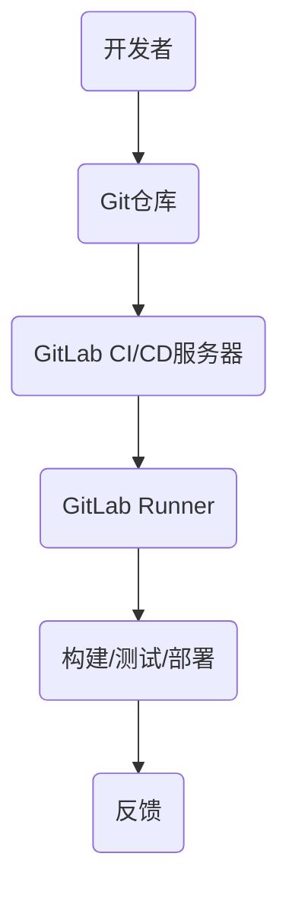

                 

 关键词：GitLab, Runner, 配置，优化，CI/CD，容器化，性能，扩展性

## 摘要

本文将深入探讨GitLab Runner的配置与优化，旨在帮助开发者和运维人员更好地理解和应用GitLab Runner，以实现高效的持续集成和持续交付（CI/CD）流程。文章将首先介绍GitLab Runner的基本概念和重要性，然后详细解析其配置文件和运行机制，最后提供一系列优化策略，包括性能优化、扩展性和可靠性。

## 1. 背景介绍

### GitLab Runner简介

GitLab Runner是GitLab CI/CD生态系统中的一部分，它是一个用于执行构建、测试和部署任务的代理服务器。GitLab CI/CD是一个持续集成和持续交付的平台，它允许开发者在代码提交后自动执行一系列预定义的任务，从而提高开发效率和代码质量。

### GitLab Runner的作用

GitLab Runner的主要作用包括：

1. **执行作业（Jobs）**：GitLab CI/CD中的作业是由GitLab Runner执行的。每个作业可以包含多个步骤，如构建、测试和部署。
2. **资源管理**：GitLab Runner可以在不同的环境中运行，如虚拟机、Docker容器或物理服务器。
3. **分布式执行**：通过配置多个GitLab Runner实例，可以实现作业的分布式执行，提高CI/CD的效率和可靠性。

## 2. 核心概念与联系

### GitLab CI/CD架构

GitLab CI/CD的架构包括三个主要组件：仓库（Repository）、GitLab CI/CD服务器和GitLab Runner。以下是GitLab CI/CD架构的Mermaid流程图：



### GitLab Runner配置

GitLab Runner的配置文件通常位于`/etc/gitlab-runner/`目录下，主要包含以下内容：

1. **注册令牌**：每个GitLab Runner实例在注册时都会生成一个唯一的令牌，用于验证和授权作业执行。
2. **共享运行器**：共享运行器允许多个用户和项目使用同一个运行器实例。
3. **特定运行器**：特定运行器绑定到特定的用户或项目，以确保作业在特定的环境中运行。

## 3. 核心算法原理 & 具体操作步骤

### 3.1 算法原理概述

GitLab Runner的配置和优化算法主要基于以下几个方面：

1. **资源调度**：根据运行器资源和作业需求进行调度，确保作业在高可用性和性能之间取得平衡。
2. **负载均衡**：通过多个GitLab Runner实例实现负载均衡，防止单个运行器过载。
3. **缓存策略**：优化缓存策略，减少重复作业的执行时间。

### 3.2 算法步骤详解

1. **配置GitLab Runner**：

    - 安装GitLab Runner。
    - 编辑`/etc/gitlab-runner/config.toml`文件，配置注册令牌、共享运行器、特定运行器等信息。
    - 注册GitLab Runner到GitLab CI/CD服务器。

2. **创建作业**：

    - 在GitLab仓库的`.gitlab-ci.yml`文件中定义作业。
    - 作业定义包括步骤、环境变量、缓存配置等。

3. **执行作业**：

    - GitLab CI/CD服务器根据作业定义调度到合适的GitLab Runner实例。
    - GitLab Runner执行作业的各个步骤，并将结果反馈给GitLab CI/CD服务器。

### 3.3 算法优缺点

**优点**：

- **灵活性和扩展性**：GitLab Runner支持多种运行环境，如虚拟机、Docker容器等，便于扩展。
- **高可用性**：通过分布式执行和负载均衡，提高系统的可靠性。
- **易于配置**：通过`.gitlab-ci.yml`文件定义作业，配置简单明了。

**缺点**：

- **维护成本**：多个GitLab Runner实例需要定期维护和更新。
- **性能瓶颈**：在作业数量和复杂性较高时，可能存在性能瓶颈。

### 3.4 算法应用领域

GitLab Runner广泛应用于企业级持续集成和持续交付，特别是在容器化和微服务架构中。它可以用于以下场景：

1. **自动化构建**：自动化构建项目代码，确保代码质量。
2. **自动化测试**：执行单元测试、集成测试等，快速发现代码缺陷。
3. **自动化部署**：将代码部署到不同的环境中，如开发、测试、生产环境。

## 4. 数学模型和公式 & 详细讲解 & 举例说明

### 4.1 数学模型构建

GitLab Runner的优化模型可以基于以下数学模型：

$$
\begin{aligned}
\text{优化目标} &= \min \sum_{i=1}^{n} \text{Cost}_{i} \\
\text{约束条件} &= \sum_{i=1}^{n} \text{Resource}_{i} \leq \text{Total Resource}
\end{aligned}
$$

其中，`Cost_i`表示作业i的执行成本，`Resource_i`表示作业i所需的资源，`Total Resource`表示总资源量。

### 4.2 公式推导过程

假设有n个作业需要执行，每个作业i具有执行成本`Cost_i`和所需资源`Resource_i`。总资源量为`Total Resource`。则优化目标为：

$$
\min \sum_{i=1}^{n} \text{Cost}_{i} \quad \text{subject to} \quad \sum_{i=1}^{n} \text{Resource}_{i} \leq \text{Total Resource}
$$

通过线性规划方法，可以得到最优解。

### 4.3 案例分析与讲解

假设有以下3个作业：

| 作业ID | 执行成本 | 所需资源 |
| --- | --- | --- |
| 1 | 10 | 20 |
| 2 | 20 | 10 |
| 3 | 30 | 30 |

总资源量为50。根据优化模型，可以列出以下线性规划问题：

$$
\begin{aligned}
\min \text{Cost}_{1} + \text{Cost}_{2} + \text{Cost}_{3} \\
\text{subject to} \\
\text{Resource}_{1} + \text{Resource}_{2} + \text{Resource}_{3} \leq 50
\end{aligned}
$$

通过求解线性规划问题，可以得到最优解。例如，可以安排作业1和作业2同时执行，作业3在作业1和作业2完成后执行。

## 5. 项目实践：代码实例和详细解释说明

### 5.1 开发环境搭建

1. **安装GitLab Runner**：

    - 在运行器上安装GitLab Runner。
    - 编辑`/etc/gitlab-runner/config.toml`文件，配置注册令牌、共享运行器等信息。

2. **注册GitLab Runner**：

    - 运行`gitlab-runner register`命令，将GitLab Runner注册到GitLab CI/CD服务器。

### 5.2 源代码详细实现

在GitLab仓库的`.gitlab-ci.yml`文件中定义作业：

```yaml
image: ubuntu:latest

stages:
  - build
  - test
  - deploy

build:
  stage: build
  script:
    - apt-get update
    - apt-get install -y build-essential
    - make build

test:
  stage: test
  script:
    - make test

deploy:
  stage: deploy
  script:
    - make deploy
```

### 5.3 代码解读与分析

`.gitlab-ci.yml`文件定义了一个包含3个阶段的CI/CD流程：

1. **build阶段**：安装依赖和构建项目。
2. **test阶段**：执行测试。
3. **deploy阶段**：部署项目。

### 5.4 运行结果展示

通过GitLab CI/CD服务器，可以查看作业的执行结果。如果作业成功执行，会生成相应的日志和输出。如果作业失败，会显示错误信息和原因。

## 6. 实际应用场景

### 6.1 跨平台构建

GitLab Runner支持多种运行环境，如Linux、Windows和Mac OS，适用于跨平台的构建任务。

### 6.2 容器化部署

GitLab Runner可以与Docker集成，实现容器化的部署。在`.gitlab-ci.yml`文件中，可以使用Docker镜像作为运行环境。

### 6.3 分布式执行

通过配置多个GitLab Runner实例，可以实现作业的分布式执行，提高CI/CD的效率和可靠性。

## 7. 未来应用展望

### 7.1 自动化程度提升

随着AI技术的发展，GitLab Runner可以更加智能化地调度作业，优化资源利用率。

### 7.2 云原生支持

GitLab Runner将加强对云原生技术的支持，如Kubernetes，实现更高效的容器化部署。

### 7.3 可观测性和监控

GitLab Runner将增强可观测性和监控能力，提供更全面的日志和统计信息，帮助开发者和管理员更好地理解CI/CD流程。

## 8. 工具和资源推荐

### 8.1 学习资源推荐

- 《GitLab CI/CD最佳实践》
- 《Docker实战》
- 《Kubernetes权威指南》

### 8.2 开发工具推荐

- GitLab
- Docker
- Kubernetes

### 8.3 相关论文推荐

- "Continuous Integration in the Cloud: Experiences from the Trenches"
- "Kubernetes: A System for Automating Deployment, Scaling, and Operations of Distributed Systems"

## 9. 总结：未来发展趋势与挑战

### 9.1 研究成果总结

GitLab Runner在配置与优化方面取得了显著成果，为开发者和运维人员提供了高效的CI/CD解决方案。

### 9.2 未来发展趋势

未来，GitLab Runner将朝着更智能、更容器化、更可观测的方向发展。

### 9.3 面临的挑战

主要挑战包括：维护成本、性能优化、安全性和可扩展性。

### 9.4 研究展望

深入研究GitLab Runner的优化算法，提高自动化程度和资源利用率，为开发者和运维人员提供更便捷的CI/CD体验。

## 10. 附录：常见问题与解答

### 10.1 GitLab Runner注册失败

- 检查网络连接。
- 确保GitLab CI/CD服务器地址正确。
- 检查注册令牌。

### 10.2 作业执行失败

- 检查`.gitlab-ci.yml`文件配置。
- 查看日志文件，查找错误信息。
- 确保运行器有足够的资源。

### 10.3 运行器性能瓶颈

- 检查运行器配置，优化资源分配。
- 增加运行器实例，实现负载均衡。

## 作者署名

作者：禅与计算机程序设计艺术 / Zen and the Art of Computer Programming
----------------------------------------------------------------

