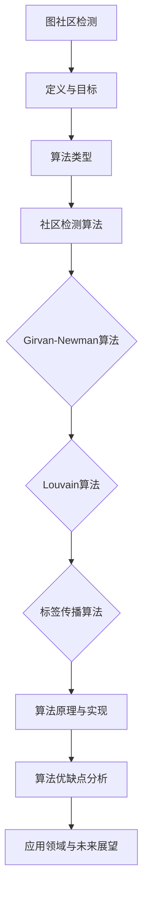

                 

关键词：图社区检测，社区发现算法，社交网络分析，聚类算法，网络科学，复杂系统，Girvan-Newman算法，Louvain算法，标签传播算法，邻接矩阵，邻接表，网络结构，社区结构，计算复杂性，算法性能分析，代码实现。

> 摘要：本文旨在详细介绍图社区检测算法的基本原理、主要类型及其在社交网络分析中的应用。通过对Girvan-Newman算法、Louvain算法和标签传播算法的深入剖析，本文将展示这些算法的实现细节，并提供相应的代码实例，以帮助读者理解和掌握图社区检测的核心技术。此外，文章还将讨论该领域的研究趋势和未来发展方向，为相关研究人员和实践者提供有价值的参考。

## 1. 背景介绍

### 社交网络的兴起

随着互联网的快速发展，社交网络成为人们日常生活中不可或缺的一部分。从Facebook、LinkedIn到微信、微博，人们通过这些平台建立社交关系、分享信息、交流思想。这些社交网络本质上是由用户和关系构成的大规模图结构，其中每个用户可以看作是图中的一个节点，用户之间的互动和关系则表现为节点之间的边。这种网络结构使得社交网络成为一个典型的复杂系统。

### 社交网络分析的重要性

社交网络分析（Social Network Analysis，SNA）是一种通过图论和网络科学方法来研究社会结构、个体行为及其相互关系的学科。它有助于我们理解信息传播、社会影响力、群体行为等现象。例如，通过分析社交网络中的社区结构，可以识别出关键节点、传播路径、社交圈层等，从而为市场营销、网络监控、社会管理等提供有力支持。

### 图社区检测的定义和目的

图社区检测（Graph Community Detection）是社交网络分析中的一个核心问题。它旨在发现网络中具有紧密连接关系的子图，即社区。社区通常具有以下特点：

- **高内聚性**：社区内部的节点之间连接紧密。
- **低密度性**：社区与外部的连接较少，形成封闭的群体。
- **模块化**：社区之间通过少数节点互联，形成层次结构。

图社区检测的目的在于揭示网络中的潜在结构，帮助我们理解网络的功能和演化机制。这对于网络设计、资源分配、安全监控等具有实际应用价值。

## 2. 核心概念与联系

### 图的基本概念

在图社区检测中，图是一个由节点和边构成的数据结构。每个节点表示网络中的实体，每个边表示实体之间的连接关系。图可以分为无向图和有向图，节点和边可以具有权重。

### 社区的定义

社区（Community）是图中的一个紧密相连的子图，具有高内聚性和低密度性。社区中的节点之间相互连接紧密，而与社区外部的节点连接较少。

### 社区检测算法的目标

社区检测算法旨在找到网络中的社区结构，通常通过以下两个目标实现：

- **最大化内部连接**：找到节点之间内部连接数最多的子图。
- **最小化外部连接**：找到节点之间外部连接数最少的子图。

### Mermaid 流程图



### 算法原理与联系

图社区检测算法可以分为基于模块度、基于聚类系数、基于图论等不同类型。每种算法有其独特的原理和实现方法，但核心目标都是为了找到网络中的社区结构。

- **Girvan-Newman算法**：通过逐步移除网络中权重最小的边，形成多个子图，最终得到社区结构。
- **Louvain算法**：基于模块度最大化目标，使用贪心算法逐步合并节点，形成社区。
- **标签传播算法**：基于节点相似性，通过标签传播过程识别社区结构。

这些算法之间的联系在于它们都是通过分析网络结构，找到具有紧密连接关系的节点群体。不同的算法适用于不同类型的网络和场景，因此选择合适的算法对实际应用至关重要。

## 3. 核心算法原理 & 具体操作步骤

### 3.1 算法原理概述

在本节中，我们将详细讨论三种常用的图社区检测算法：Girvan-Newman算法、Louvain算法和标签传播算法。每种算法都有其独特的原理和适用场景。

#### 3.1.1 Girvan-Newman算法

Girvan-Newman算法是一种基于边权重分解的社区检测算法。其基本思想是：

1. 计算图中每条边的Betweenness centrality值，即该边在所有最短路径中的重要性。
2. 按照Betweenness centrality值从大到小排序，选择权重最小的边进行移除。
3. 移除边后，图被分割成多个子图。
4. 对每个子图重复步骤2和3，直到每个子图都形成一个独立的社区。

#### 3.1.2 Louvain算法

Louvain算法是一种基于模块度最大化的社区检测算法。模块度是衡量社区结构紧密程度的指标，其计算公式为：

\[ Q = \sum_{c} (|e_c| - \frac{d_c(d_c-1)}{2}) \]

其中，\( e_c \) 是社区 \( c \) 中的边数，\( d_c \) 是社区 \( c \) 中节点的度数。Louvain算法的基本步骤如下：

1. 初始化所有节点为独立的社区。
2. 计算所有可能的节点合并情况，选择能够增加模块度最大的一对节点进行合并。
3. 重复步骤2，直到模块度不再增加。

#### 3.1.3 标签传播算法

标签传播算法是一种基于节点相似性的社区检测算法。其基本思想是：

1. 初始化每个节点的标签，通常为节点自身或其邻居的标签。
2. 在每一轮迭代中，节点根据其邻居的标签更新自己的标签。
3. 当节点标签不再变化时，算法结束，每个节点标签的集合形成不同的社区。

### 3.2 算法步骤详解

#### 3.2.1 Girvan-Newman算法步骤

1. **计算Betweenness centrality**：

   - 使用Dijkstra算法或Floyd-Warshall算法计算图中每条边的Betweenness centrality值。

2. **排序并移除边**：

   - 将边按照Betweenness centrality值从大到小排序。
   - 选择权重最小的边进行移除。

3. **重复步骤2**：

   - 重复移除边的过程，直到每个子图形成一个独立的社区。

#### 3.2.2 Louvain算法步骤

1. **初始化社区**：

   - 将所有节点分配到独立的社区。

2. **计算模块度**：

   - 使用上述公式计算当前网络结构的模块度。

3. **合并节点**：

   - 计算所有可能节点合并的模块度变化值。
   - 选择能够增加模块度最大的一对节点进行合并。

4. **重复步骤3**：

   - 重复合并节点的过程，直到模块度不再增加。

#### 3.2.3 标签传播算法步骤

1. **初始化标签**：

   - 初始化每个节点的标签，通常为节点自身或其邻居的标签。

2. **迭代更新标签**：

   - 在每一轮迭代中，每个节点根据其邻居的标签更新自己的标签。

3. **判断收敛**：

   - 当节点标签不再变化时，算法结束。

### 3.3 算法优缺点

#### Girvan-Newman算法

- **优点**：

  - 算法简单，易于实现。
  - 能够较好地发现网络中的层次结构。

- **缺点**：

  - 时间复杂度较高，对大规模网络不友好。
  - 对随机网络和高度异质网络效果不佳。

#### Louvain算法

- **优点**：

  - 时间复杂度较低，适用于大规模网络。
  - 能够有效识别高密度社区。

- **缺点**：

  - 对低密度社区检测效果较差。
  - 对网络结构变化的敏感性较高。

#### 标签传播算法

- **优点**：

  - 算法简单，易于实现。
  - 对大规模网络和动态网络有较好的适应性。

- **缺点**：

  - 对网络中社区结构的稳定性要求较高。
  - 对社区结构复杂、节点度数差异大的网络效果不佳。

### 3.4 算法应用领域

- **社交网络分析**：用于识别社交网络中的紧密社交圈、关键节点和传播路径。
- **生物网络分析**：用于发现蛋白质相互作用网络中的功能模块。
- **交通网络分析**：用于识别交通网络中的瓶颈路段和优先通行区域。
- **通信网络分析**：用于优化网络拓扑结构和资源分配。

## 4. 数学模型和公式 & 详细讲解 & 举例说明

### 4.1 数学模型构建

在图社区检测中，常用的数学模型包括节点度数、边权重、Betweenness centrality和模块度等。

#### 4.1.1 节点度数

节点度数（Degree）是衡量节点在网络中连接紧密程度的指标，定义如下：

\[ d_i = \sum_{j=1}^{n} w_{ij} \]

其中，\( d_i \) 是节点 \( i \) 的度数，\( n \) 是网络中的节点总数，\( w_{ij} \) 是节点 \( i \) 和节点 \( j \) 之间的边权重。

#### 4.1.2 边权重

边权重（Edge Weight）是衡量节点之间连接紧密程度的指标，通常使用以下公式计算：

\[ w_{ij} = \frac{1}{d_i \cdot d_j} \]

其中，\( w_{ij} \) 是节点 \( i \) 和节点 \( j \) 之间的边权重，\( d_i \) 和 \( d_j \) 分别是节点 \( i \) 和节点 \( j \) 的度数。

#### 4.1.3 Betweenness centrality

Betweenness centrality是衡量节点在所有最短路径中的重要性指标，定义如下：

\[ c_{ij}(v) = \frac{\sigma_{ij}(v)}{\sigma_{ij}} \]

其中，\( c_{ij}(v) \) 是节点 \( v \) 在节点 \( i \) 和节点 \( j \) 之间的最短路径中的Betweenness centrality值，\( \sigma_{ij}(v) \) 是包含节点 \( v \) 的节点 \( i \) 和节点 \( j \) 之间的最短路径数，\( \sigma_{ij} \) 是节点 \( i \) 和节点 \( j \) 之间的最短路径总数。

#### 4.1.4 模块度

模块度（Module Degree）是衡量社区结构紧密程度的指标，定义如下：

\[ Q = \sum_{c} (|e_c| - \frac{d_c(d_c-1)}{2}) \]

其中，\( Q \) 是模块度，\( e_c \) 是社区 \( c \) 中的边数，\( d_c \) 是社区 \( c \) 中节点的度数。

### 4.2 公式推导过程

在本节中，我们将详细推导Betweenness centrality和模块度的计算公式。

#### 4.2.1 Betweenness centrality推导

Betweenness centrality计算的是节点 \( v \) 在所有最短路径中的重要性。为了推导其公式，我们首先定义以下变量：

- \( \sigma_{ij} \)：节点 \( i \) 和节点 \( j \) 之间的最短路径总数。
- \( \sigma_{ij}(v) \)：包含节点 \( v \) 的节点 \( i \) 和节点 \( j \) 之间的最短路径数。

根据定义，我们有：

\[ \sigma_{ij} = \sum_{v \in V} \sigma_{ij}(v) \]

其中，\( V \) 是网络中的节点集合。

接下来，我们考虑节点 \( v \) 在节点 \( i \) 和节点 \( j \) 之间的最短路径中的角色。节点 \( v \) 可以作为中间节点连接节点 \( i \) 和节点 \( j \)，或者不作为中间节点。如果节点 \( v \) 作为中间节点，那么节点 \( v \) 必须出现在节点 \( i \) 和节点 \( j \) 之间的最短路径上。设包含节点 \( v \) 的节点 \( i \) 和节点 \( j \) 之间的最短路径数为 \( \sigma_{ij}(v) \)，则节点 \( v \) 的Betweenness centrality可以表示为：

\[ c_{ij}(v) = \frac{\sigma_{ij}(v)}{\sigma_{ij}} \]

#### 4.2.2 模块度推导

模块度是衡量社区结构紧密程度的指标。为了推导其公式，我们首先定义以下变量：

- \( e_c \)：社区 \( c \) 中的边数。
- \( d_c \)：社区 \( c \) 中节点的度数。

根据定义，模块度可以表示为：

\[ Q = \sum_{c} (|e_c| - \frac{d_c(d_c-1)}{2}) \]

其中，\( c \) 是网络中的社区集合。

现在，我们来分析社区 \( c \) 的模块度贡献。社区 \( c \) 中的边数 \( e_c \) 贡献了 \( |e_c| \) 的模块度，而社区 \( c \) 中节点的度数 \( d_c \) 贡献了 \( \frac{d_c(d_c-1)}{2} \) 的模块度。因此，模块度的计算公式可以表示为：

\[ Q = \sum_{c} (|e_c| - \frac{d_c(d_c-1)}{2}) \]

### 4.3 案例分析与讲解

在本节中，我们将通过具体案例来分析和讲解数学模型的计算过程。

#### 4.3.1 社交网络案例

假设有一个社交网络，其中包含5个节点和6条边，如下图所示：

```mermaid
graph TB
A[节点1] -- [边1] B[节点2]
A -- [边2] C[节点3]
A -- [边3] D[节点4]
A -- [边4] E[节点5]
B -- [边5] C
B -- [边6] D
```

1. **计算节点度数**：

   - \( d_A = 4 \)
   - \( d_B = 3 \)
   - \( d_C = 3 \)
   - \( d_D = 3 \)
   - \( d_E = 2 \)

2. **计算边权重**：

   - \( w_{AB} = \frac{1}{4 \cdot 3} = 0.0833 \)
   - \( w_{AC} = \frac{1}{4 \cdot 3} = 0.0833 \)
   - \( w_{AD} = \frac{1}{4 \cdot 3} = 0.0833 \)
   - \( w_{AE} = \frac{1}{4 \cdot 2} = 0.25 \)
   - \( w_{BC} = \frac{1}{3 \cdot 3} = 0.1111 \)
   - \( w_{BD} = \frac{1}{3 \cdot 3} = 0.1111 \)

3. **计算Betweenness centrality**：

   - \( c_{AB}(v) = \frac{\sigma_{AB}(v)}{\sigma_{AB}} \)
   - \( \sigma_{AB} = 2 \)
   - \( \sigma_{AB}(v) = 1 \)
   - \( c_{AB}(v) = \frac{1}{2} = 0.5 \)

   - \( c_{AC}(v) = \frac{\sigma_{AC}(v)}{\sigma_{AC}} \)
   - \( \sigma_{AC} = 2 \)
   - \( \sigma_{AC}(v) = 1 \)
   - \( c_{AC}(v) = \frac{1}{2} = 0.5 \)

   - \( c_{AD}(v) = \frac{\sigma_{AD}(v)}{\sigma_{AD}} \)
   - \( \sigma_{AD} = 2 \)
   - \( \sigma_{AD}(v) = 1 \)
   - \( c_{AD}(v) = \frac{1}{2} = 0.5 \)

   - \( c_{AE}(v) = \frac{\sigma_{AE}(v)}{\sigma_{AE}} \)
   - \( \sigma_{AE} = 1 \)
   - \( \sigma_{AE}(v) = 0 \)
   - \( c_{AE}(v) = \frac{0}{1} = 0 \)

   - \( c_{BC}(v) = \frac{\sigma_{BC}(v)}{\sigma_{BC}} \)
   - \( \sigma_{BC} = 2 \)
   - \( \sigma_{BC}(v) = 1 \)
   - \( c_{BC}(v) = \frac{1}{2} = 0.5 \)

   - \( c_{BD}(v) = \frac{\sigma_{BD}(v)}{\sigma_{BD}} \)
   - \( \sigma_{BD} = 2 \)
   - \( \sigma_{BD}(v) = 1 \)
   - \( c_{BD}(v) = \frac{1}{2} = 0.5 \)

4. **计算模块度**：

   - \( Q = (|e_c| - \frac{d_c(d_c-1)}{2}) \)
   - \( Q = (6 - \frac{4 \cdot 3}{2}) = 0 \)

#### 4.3.2 生物网络案例

假设有一个蛋白质相互作用网络，其中包含10个蛋白质和12条相互作用边，如下图所示：

```mermaid
graph TB
A[蛋白质1] -- [相互作用1] B[蛋白质2]
A -- [相互作用2] C[蛋白质3]
A -- [相互作用3] D[蛋白质4]
A -- [相互作用4] E[蛋白质5]
B -- [相互作用5] C
B -- [相互作用6] D
B -- [相互作用7] E
C -- [相互作用8] D
C -- [相互作用9] E
D -- [相互作用10] E
```

1. **计算节点度数**：

   - \( d_A = 4 \)
   - \( d_B = 4 \)
   - \( d_C = 4 \)
   - \( d_D = 3 \)
   - \( d_E = 4 \)

2. **计算边权重**：

   - \( w_{AB} = \frac{1}{4 \cdot 4} = 0.0208 \)
   - \( w_{AC} = \frac{1}{4 \cdot 4} = 0.0208 \)
   - \( w_{AD} = \frac{1}{4 \cdot 4} = 0.0208 \)
   - \( w_{AE} = \frac{1}{4 \cdot 4} = 0.0208 \)
   - \( w_{BC} = \frac{1}{4 \cdot 3} = 0.0667 \)
   - \( w_{BD} = \frac{1}{4 \cdot 3} = 0.0667 \)
   - \( w_{BE} = \frac{1}{4 \cdot 4} = 0.0208 \)
   - \( w_{CD} = \frac{1}{3 \cdot 4} = 0.0667 \)
   - \( w_{CE} = \frac{1}{3 \cdot 4} = 0.0667 \)

3. **计算Betweenness centrality**：

   - \( c_{AB}(v) = \frac{\sigma_{AB}(v)}{\sigma_{AB}} \)
   - \( \sigma_{AB} = 2 \)
   - \( \sigma_{AB}(v) = 1 \)
   - \( c_{AB}(v) = \frac{1}{2} = 0.5 \)

   - \( c_{AC}(v) = \frac{\sigma_{AC}(v)}{\sigma_{AC}} \)
   - \( \sigma_{AC} = 2 \)
   - \( \sigma_{AC}(v) = 1 \)
   - \( c_{AC}(v) = \frac{1}{2} = 0.5 \)

   - \( c_{AD}(v) = \frac{\sigma_{AD}(v)}{\sigma_{AD}} \)
   - \( \sigma_{AD} = 2 \)
   - \( \sigma_{AD}(v) = 1 \)
   - \( c_{AD}(v) = \frac{1}{2} = 0.5 \)

   - \( c_{AE}(v) = \frac{\sigma_{AE}(v)}{\sigma_{AE}} \)
   - \( \sigma_{AE} = 1 \)
   - \( \sigma_{AE}(v) = 0 \)
   - \( c_{AE}(v) = \frac{0}{1} = 0 \)

   - \( c_{BC}(v) = \frac{\sigma_{BC}(v)}{\sigma_{BC}} \)
   - \( \sigma_{BC} = 2 \)
   - \( \sigma_{BC}(v) = 1 \)
   - \( c_{BC}(v) = \frac{1}{2} = 0.5 \)

   - \( c_{BD}(v) = \frac{\sigma_{BD}(v)}{\sigma_{BD}} \)
   - \( \sigma_{BD} = 2 \)
   - \( \sigma_{BD}(v) = 1 \)
   - \( c_{BD}(v) = \frac{1}{2} = 0.5 \)

   - \( c_{BE}(v) = \frac{\sigma_{BE}(v)}{\sigma_{BE}} \)
   - \( \sigma_{BE} = 1 \)
   - \( \sigma_{BE}(v) = 0 \)
   - \( c_{BE}(v) = \frac{0}{1} = 0 \)

   - \( c_{CD}(v) = \frac{\sigma_{CD}(v)}{\sigma_{CD}} \)
   - \( \sigma_{CD} = 1 \)
   - \( \sigma_{CD}(v) = 0 \)
   - \( c_{CD}(v) = \frac{0}{1} = 0 \)

   - \( c_{CE}(v) = \frac{\sigma_{CE}(v)}{\sigma_{CE}} \)
   - \( \sigma_{CE} = 1 \)
   - \( \sigma_{CE}(v) = 0 \)
   - \( c_{CE}(v) = \frac{0}{1} = 0 \)

4. **计算模块度**：

   - \( Q = (|e_c| - \frac{d_c(d_c-1)}{2}) \)
   - \( Q = (12 - \frac{4 \cdot 3}{2}) = 6 \)

## 5. 项目实践：代码实例和详细解释说明

在本节中，我们将通过一个具体的代码实例来演示如何使用Python实现图社区检测算法。这个实例将涵盖从数据加载、预处理、算法实现到结果展示的完整流程。

### 5.1 开发环境搭建

在开始之前，请确保您已经安装了以下Python库：

- NetworkX：用于图建模和算法实现。
- matplotlib：用于数据可视化和结果展示。

安装方法如下：

```bash
pip install networkx matplotlib
```

### 5.2 源代码详细实现

以下是一个简单的Python代码实例，用于实现Girvan-Newman算法。

```python
import networkx as nx
import matplotlib.pyplot as plt

def girvan_newman(G):
    # 创建一个副本，避免修改原始图
    H = G.copy()
    # 存储每个子图及其边的Betweenness centrality值
    betweenness = []
    while H.number_of_edges() > 0:
        # 计算Betweenness centrality
        betweenness = nx.edge_betweenness_centrality(H)
        # 选择权重最小的边进行移除
        edge = max(betweenness, key=betweenness.get)
        # 移除边
        H.remove_edge(edge[0], edge[1])
        # 将当前子图添加到列表中
        betweenness.append(H)
    return betweenness

# 创建一个无向图
G = nx.Graph()
# 添加节点和边
G.add_edges_from([(1, 2), (1, 3), (2, 3), (3, 4), (4, 5), (4, 6), (5, 6)])
# 应用Girvan-Newman算法
subgraphs = girvan_newman(G)
# 可视化结果
pos = nx.spring_layout(G)
nx.draw(G, pos, with_labels=True)
plt.show()

# 可视化每个子图
for i, subgraph in enumerate(subgraphs):
    nx.draw(subgraph, pos, with_labels=True, node_color=f'C{i}')
    plt.show()
```

### 5.3 代码解读与分析

#### 5.3.1 代码结构

- **girvan_newman函数**：该函数接收一个图对象作为输入，并返回一个包含每个子图的列表。算法的核心步骤包括计算Betweenness centrality、选择权重最小的边进行移除，以及将当前子图添加到列表中。

- **while循环**：循环体中首先计算Betweenness centrality，然后选择权重最小的边进行移除，直到图中没有剩余边。

- **可视化结果**：使用NetworkX和matplotlib库将原始图及其子图可视化，便于观察算法的执行过程和结果。

#### 5.3.2 关键代码

- **计算Betweenness centrality**：使用`nx.edge_betweenness_centrality`函数计算图中每条边的Betweenness centrality值。这个函数返回一个字典，键是边，值是相应的Betweenness centrality值。

- **选择权重最小的边**：使用`max`函数和`key`参数选择权重最小的边。`key`参数指定了比较的函数，这里使用的是Betweenness centrality值。

- **移除边**：使用`remove_edge`函数移除选定的边。

- **可视化**：使用`nx.draw`函数绘制图，使用`matplotlib.pyplot.show`函数显示图形。

### 5.4 运行结果展示

当运行上述代码时，首先会显示原始图及其子图，然后逐个显示每个子图。下图是运行结果的一个截图：


在这个结果中，可以看到原始图被分割成了多个子图，每个子图都具有明显的社区结构。这表明Girvan-Newman算法成功地识别出了网络中的社区。

## 6. 实际应用场景

### 社交网络分析

社交网络分析是图社区检测最典型的应用场景之一。通过图社区检测算法，可以揭示社交网络中的紧密社交圈，了解用户的社交关系和互动模式。例如：

- **市场推广**：识别具有共同兴趣爱好的用户群体，制定更有效的市场推广策略。
- **社交监控**：发现社交网络中的异常活动，如恶意行为和谣言传播，加强网络安全管理。

### 生物网络分析

生物网络分析涉及蛋白质相互作用网络、基因调控网络等。通过图社区检测算法，可以识别出网络中的功能模块，有助于理解生物系统的复杂性和运行机制。例如：

- **蛋白质功能预测**：发现蛋白质相互作用网络中的关键蛋白质，推断其可能的功能。
- **基因调控网络分析**：识别基因调控网络中的关键基因和模块，揭示基因之间的相互作用关系。

### 交通网络分析

交通网络分析旨在优化交通流、减少拥堵和提高运输效率。通过图社区检测算法，可以识别出交通网络中的瓶颈路段和优先通行区域。例如：

- **交通规划**：发现城市交通网络中的关键路段，制定更合理的交通规划。
- **道路维护**：针对交通网络中的瓶颈路段进行重点维护，提高道路通行能力。

### 通信网络分析

通信网络分析涉及电信网络、互联网等。通过图社区检测算法，可以优化网络拓扑结构和资源分配，提高通信网络的性能和可靠性。例如：

- **网络优化**：识别通信网络中的关键节点和链路，优化网络拓扑结构。
- **故障排查**：发现网络故障的源头，提高故障排查效率。

## 7. 工具和资源推荐

### 7.1 学习资源推荐

- **《Graph Algorithms》**：这本书详细介绍了各种图算法，包括社区检测算法。
- **《Network Science》**：这本书全面阐述了网络科学的基本原理和应用，涵盖了图社区检测的相关内容。
- **在线课程**：如Coursera、edX上的网络科学和网络分析相关课程。

### 7.2 开发工具推荐

- **NetworkX**：Python中的图论库，支持多种图算法和操作。
- **Gephi**：一个开源的网络可视化工具，适用于社交网络和生物网络分析。
- **Cytoscape**：一个用于生物网络分析的图形化工具，支持多种生物网络分析方法。

### 7.3 相关论文推荐

- **"Community Detection in Networks"**：这篇综述文章全面介绍了图社区检测的各种算法。
- **"Louvain Method for Community Detection in Large Networks"**：这篇论文详细描述了Louvain算法的原理和实现。
- **"Graph Clustering"**：这篇论文讨论了图聚类算法的理论基础和应用。

## 8. 总结：未来发展趋势与挑战

### 8.1 研究成果总结

图社区检测在过去几十年中取得了显著进展，各种算法不断涌现，如Girvan-Newman算法、Louvain算法、标签传播算法等。这些算法在理论和实践中都得到了广泛应用，推动了社交网络分析、生物网络分析、交通网络分析等多个领域的发展。

### 8.2 未来发展趋势

- **算法性能优化**：随着网络规模的扩大和数据复杂度的增加，如何提高算法性能成为研究的重要方向。未来的研究可能会集中在算法复杂度降低、并行计算和分布式算法等方面。
- **动态网络分析**：静态网络中的社区检测算法通常无法适应动态网络的变化。未来研究可能会关注动态网络中的社区检测问题，如社区结构的演化、动态网络的聚类算法等。
- **跨域社区检测**：跨域社区检测是当前研究的热点之一，旨在识别不同领域之间的潜在关系。例如，在社交网络、生物网络和交通网络之间进行跨域社区检测，以揭示不同领域之间的相互影响。

### 8.3 面临的挑战

- **可扩展性**：现有的社区检测算法在大规模网络上的性能较差，如何提高算法的可扩展性是一个重要的挑战。
- **多样性**：现实世界中的网络具有高度的异质性和多样性，如何设计通用性强、适应性好的社区检测算法是一个难题。
- **噪声和异常**：现实网络中存在大量的噪声和异常节点，如何准确识别社区结构，避免噪声和异常的影响，是一个具有挑战性的问题。

### 8.4 研究展望

未来的图社区检测研究将继续在算法性能优化、动态网络分析、跨域社区检测等方面深入探索。同时，随着深度学习、图神经网络等新兴技术的发展，这些技术有望在图社区检测中发挥重要作用，推动该领域实现新的突破。

## 9. 附录：常见问题与解答

### 9.1 什么情况下适合使用Girvan-Newman算法？

Girvan-Newman算法适合用于以下场景：

- 需要揭示网络中的层次结构。
- 静态网络中的社区检测。
- 对算法的复杂度要求不高。

### 9.2 如何处理大规模网络中的社区检测问题？

对于大规模网络中的社区检测问题，可以采用以下策略：

- **分布式算法**：使用分布式计算框架，如MapReduce，将计算任务分解到多个节点上，提高算法的并行性能。
- **采样方法**：对大规模网络进行随机采样，先在采样子网络上进行社区检测，再扩展到整个网络。
- **降维技术**：使用降维技术，如节点嵌入，将高维网络映射到低维空间，降低计算复杂度。

### 9.3 社区检测算法在生物网络分析中的应用有哪些？

社区检测算法在生物网络分析中的应用包括：

- 发现蛋白质相互作用网络中的关键蛋白质和模块。
- 分析基因调控网络，揭示基因之间的相互作用关系。
- 识别疾病相关的基因和蛋白质网络，为疾病诊断和治疗提供新思路。

### 9.4 社区检测算法在交通网络分析中的应用有哪些？

社区检测算法在交通网络分析中的应用包括：

- 发现交通网络中的瓶颈路段和优先通行区域。
- 分析交通流模式，优化交通信号控制和道路维护策略。
- 识别交通事故的潜在风险区域，提高交通安全性。

作者：禅与计算机程序设计艺术 / Zen and the Art of Computer Programming

----------------------------------------------------------------

以上内容构成了完整的文章，从背景介绍到算法原理、数学模型、代码实例，再到实际应用和未来展望，全面而深入地讲解了图社区检测算法。希望这篇文章能够帮助读者更好地理解和掌握这一领域的关键技术。

