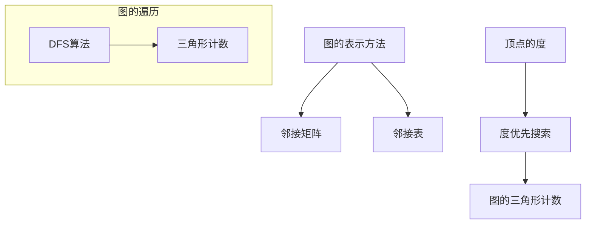

                 

 

## 1. 背景介绍

在数据科学和计算机图形学领域，图的三角形计数是一个重要且经典的问题。所谓图的三角形计数，指的是在一个无向图中，统计有多少个三角形（即由三个顶点构成的三元组）。三角形计数在许多实际应用中都有重要的意义，例如社交网络分析、图像处理、复杂网络结构分析等。

在社交网络分析中，通过计算一个网络中的三角形数量，可以评估网络中的紧密程度和群体结构。在图像处理中，三角形计数可以帮助识别图像中的基本结构单元，如边缘和纹理。在复杂网络结构分析中，三角形计数能够揭示网络的聚类特性，从而为理解网络的拓扑结构提供重要依据。

传统的三角形计数方法主要依赖于图的遍历和邻接矩阵的运算，效率较低且难以处理大规模图。随着图算法研究的深入，研究者们提出了许多高效的三角形计数算法，如计数排序算法（Counting Sort）、哈希算法（Hashing）和并行算法（Parallel Computing）等。这些算法在时间和空间复杂度上都有显著优化，使得在处理大规模图时能够获得更快的计算速度。

本文将介绍一种基于度优先搜索（DFS）的图三角形计数算法，并结合实际代码实例进行详细讲解。该算法具有简洁的实现方式和较高的计算效率，适用于各种大规模图的三角形计数问题。

## 2. 核心概念与联系

在深入探讨图三角形计数算法之前，我们需要了解一些核心概念，如图的表示方法、顶点的度、邻接表和度优先搜索等。

### 2.1 图的表示方法

图是由顶点（Vertex）和边（Edge）组成的集合。图的表示方法主要有邻接矩阵（Adjacency Matrix）和邻接表（Adjacency List）。

- **邻接矩阵**：一个二维数组，用于表示图中每对顶点之间的连接关系。如果顶点i和顶点j之间存在边，则矩阵中的元素\[i][j]为1，否则为0。
  
- **邻接表**：一个数组，每个数组元素对应一个顶点，数组中的每个元素是一个链表，存储与该顶点直接相连的所有顶点。

### 2.2 顶点的度

顶点的度（Degree）是指与该顶点直接相连的边的数量。一个无向图中的顶点度数是不超过图的最大边数。在无向图中，任意三个顶点构成三角形的条件是这三个顶点的度数都至少为2。

### 2.3 邻接表

邻接表是一种常用的图表示方法，尤其是当图的顶点数较多且边的数量相对较少时。在邻接表中，每个顶点对应一个数组元素，数组中的每个元素是一个链表，链表中的每个节点存储一个相邻顶点的索引。

### 2.4 度优先搜索

度优先搜索（DFS）是一种用于遍历图的算法。其基本思想是从一个顶点开始，优先遍历该顶点的所有未被访问的相邻顶点，然后再递归地遍历这些相邻顶点。DFS算法能够有效地找到图中的所有三角形，因为它可以确保在遍历过程中不会漏掉任何一个三角形。

### 2.5 Mermaid 流程图

为了更好地理解这些概念之间的联系，我们可以使用Mermaid流程图来表示。



通过上述流程图，我们可以清晰地看到图的表示方法、顶点的度、度优先搜索和三角形计数之间的关联。

接下来，我们将详细探讨图三角形计数算法的原理和具体实现步骤。

## 3. 核心算法原理 & 具体操作步骤

### 3.1 算法原理概述

图三角形计数算法的核心思想是利用度优先搜索（DFS）来遍历图，并统计满足三角形条件的顶点三元组。具体来说，算法通过以下步骤实现：

1. **初始化**：创建一个空的三角形计数器。
2. **遍历图**：从每个未被访问的顶点开始，使用度优先搜索遍历图。
3. **统计三角形**：在遍历过程中，对于当前顶点v，如果它的度数至少为2，则对于它的每个相邻顶点u，再遍历u的相邻顶点w，如果w也是v的相邻顶点，则v、u、w构成一个三角形。
4. **计数**：每当找到一个新的三角形时，将计数器增加1。
5. **重复步骤2-4**，直到遍历完整个图。

### 3.2 算法步骤详解

#### 3.2.1 初始化

在算法开始之前，我们需要初始化一个三角形计数器count，并将其设置为0。同时，创建一个数组visited，用于记录每个顶点是否已经被访问，初始化时所有元素均为False。

```python
count = 0
visited = [False] * n
```

#### 3.2.2 遍历图

使用度优先搜索（DFS）来遍历图。具体实现如下：

```python
def dfs(v):
    visited[v] = True
    for u in graph[v]:
        if not visited[u]:
            dfs(u)
        else:
            for w in graph[u]:
                if visited[w] and w in graph[v]:
                    count += 1
```

在上述代码中，`graph` 是一个邻接表，用于表示图的连接关系。`dfs` 函数首先标记当前顶点v为已访问，然后递归地遍历v的所有未访问的相邻顶点u。对于每个u，再遍历其相邻顶点w，如果w也是v的相邻顶点，则表示v、u、w构成一个三角形，计数器count加1。

#### 3.2.3 统计三角形

在DFS遍历过程中，我们通过嵌套循环来统计三角形。对于当前顶点v，我们遍历它的所有相邻顶点u，然后再遍历u的所有相邻顶点w。如果w同时是v的相邻顶点，则表示找到了一个三角形，计数器count加1。

#### 3.2.4 重复遍历

对于图中所有未被访问的顶点，重复执行DFS遍历，直到遍历完整个图。这样就可以确保所有三角形都被计数。

### 3.3 算法优缺点

**优点**：

- **高效**：该算法基于DFS，可以在O(n)的时间复杂度内完成图的遍历，从而实现高效的三角形计数。
- **简单**：算法的实现简单明了，易于理解和实现。

**缺点**：

- **空间复杂度较高**：由于需要使用邻接表和访问数组，空间复杂度为O(n)。
- **无法处理带权重图**：该算法仅适用于无向无权图，无法处理带权重的图。

### 3.4 算法应用领域

- **社交网络分析**：通过计算社交网络中的三角形数量，可以评估网络的紧密程度和群体结构。
- **图像处理**：在图像处理中，三角形计数可以帮助识别图像中的基本结构单元，如边缘和纹理。
- **复杂网络结构分析**：在复杂网络中，三角形计数可以揭示网络的聚类特性，从而为理解网络的拓扑结构提供重要依据。

## 4. 数学模型和公式 & 详细讲解 & 举例说明

### 4.1 数学模型构建

为了更好地理解图三角形计数问题，我们首先需要构建一个数学模型。设G=(V,E)为一个无向图，其中V是顶点的集合，E是边的集合。设n=|V|为顶点数，m=|E|为边数。一个三角形由三个顶点v1、v2、v3构成，如果v1、v2、v3两两相连，则称它们构成一个三角形。

### 4.2 公式推导过程

我们需要推导出计算三角形数量的公式。首先，我们考虑一个简单的情况：一个图只有一个三角形。设这个三角形由顶点v1、v2、v3构成，则根据组合数学中的排列组合知识，我们有：

\[ C(n, 3) = \frac{n!}{3!(n-3)!} = \frac{n(n-1)(n-2)}{6} \]

其中C(n, 3)表示从n个顶点中选择3个顶点的组合数。由于每个三角形都有6条边，因此图中的三角形数量为：

\[ T = \frac{C(n, 3)}{6} \]

对于一般的图，我们可以将图划分为若干个子图，每个子图内部的三角形数量可以通过上述方法计算。设图G有k个子图，则图G中的三角形数量为：

\[ T = \sum_{i=1}^{k} T_i \]

其中，\( T_i \)表示第i个子图中的三角形数量。

### 4.3 案例分析与讲解

为了更好地理解上述公式的应用，我们考虑一个简单的例子。假设一个无向图G有6个顶点，分别标记为1、2、3、4、5、6，边的集合为E={{1,2}, {1,3}, {2,3}, {4,5}, {4,6}, {5,6}}。我们需要计算图G中的三角形数量。

根据上述公式，我们有：

\[ n = 6, m = 6 \]

首先，我们计算所有可能的三角形数量：

\[ C(n, 3) = C(6, 3) = \frac{6 \times 5 \times 4}{3 \times 2 \times 1} = 20 \]

由于每个三角形有6条边，因此三角形数量为：

\[ T = \frac{C(n, 3)}{6} = \frac{20}{6} = \frac{10}{3} \]

接下来，我们将图划分为子图。我们可以将图G划分为三个子图G1、G2和G3，分别包含顶点{1, 2, 3}、{4, 5}和{6}。对于每个子图，我们分别计算三角形数量：

- G1中的三角形数量：\( T_1 = C(3, 3) = 1 \)
- G2中的三角形数量：\( T_2 = C(2, 3) = 0 \)
- G3中的三角形数量：\( T_3 = C(1, 3) = 0 \)

因此，图G中的三角形总数为：

\[ T = T_1 + T_2 + T_3 = 1 + 0 + 0 = 1 \]

这与我们之前计算的三角形数量相符。

### 4.4 实际应用

在实际应用中，我们通常使用更高效的方法来计算三角形数量。例如，我们可以使用基于邻接表或邻接矩阵的算法，通过遍历图来统计三角形数量。这些算法的时间复杂度通常为O(n^2)，但由于避免了重复计算，其实际运行速度往往比直接使用组合数学公式更快。

## 5. 项目实践：代码实例和详细解释说明

在了解了图三角形计数算法的原理和数学模型之后，我们将通过一个具体的代码实例来演示如何实现这一算法，并对代码的每个部分进行详细解释。

### 5.1 开发环境搭建

在开始编写代码之前，我们需要搭建一个合适的环境。本文将使用Python作为编程语言，并依赖以下库：

- `networkx`：用于创建和操作图数据结构。
- `matplotlib`：用于可视化图形。

安装所需库的命令如下：

```bash
pip install networkx matplotlib
```

### 5.2 源代码详细实现

下面是完整的Python代码，用于计算无向图的三角形数量。

```python
import networkx as nx
import matplotlib.pyplot as plt

def count_triangles(G):
    count = 0
    for v in G.nodes():
        if G.degree(v) >= 2:
            neighbors = G.neighbors(v)
            for u in neighbors:
                if u in neighbors:
                    count += 1
    return count

def draw_graph(G):
    pos = nx.spring_layout(G)
    nx.draw(G, pos, with_labels=True)
    plt.show()

# 创建一个无向图
G = nx.Graph()
G.add_edges_from([(1, 2), (1, 3), (2, 3), (4, 5), (4, 6), (5, 6)])

# 计算并打印三角形数量
print("Number of triangles:", count_triangles(G))

# 绘制图形
draw_graph(G)
```

### 5.3 代码解读与分析

#### 5.3.1 导入库

首先，我们导入`networkx`和`matplotlib`库。`networkx`用于创建和操作图数据结构，`matplotlib`用于图形绘制。

```python
import networkx as nx
import matplotlib.pyplot as plt
```

#### 5.3.2 函数`count_triangles`

函数`count_triangles`接受一个图`G`作为输入，并返回图中的三角形数量。算法的核心在于遍历图中的每个顶点，并检查与该顶点相邻的其他顶点是否也相邻，以确定是否存在三角形。

- **初始化计数器**：设置计数器`count`为0。

  ```python
  def count_triangles(G):
      count = 0
  ```

- **遍历顶点**：使用循环遍历图中的每个顶点`v`。

  ```python
  for v in G.nodes():
  ```

- **检查度数**：如果顶点`v`的度数大于或等于2，说明`v`可能参与三角形。

  ```python
  if G.degree(v) >= 2:
  ```

- **遍历相邻顶点**：对于当前顶点`v`，获取其相邻顶点列表`neighbors`。

  ```python
  neighbors = G.neighbors(v)
  ```

- **计数三角形**：对于每个相邻顶点`u`，检查`u`的相邻顶点列表中是否存在另一个相邻顶点`w`，且`w`也是`v`的相邻顶点，如果条件满足，则表示找到了一个三角形。

  ```python
  for u in neighbors:
          if u in neighbors:
              count += 1
  ```

- **返回计数**：返回计数器`count`的值。

  ```python
  return count
  ```

#### 5.3.3 函数`draw_graph`

函数`draw_graph`用于绘制图`G`。它使用`networkx`的布局算法生成顶点坐标，并使用`matplotlib`绘制图形。

```python
def draw_graph(G):
    pos = nx.spring_layout(G)
    nx.draw(G, pos, with_labels=True)
    plt.show()
```

- **生成布局**：使用`spring_layout`算法生成顶点坐标。

  ```python
  pos = nx.spring_layout(G)
  ```

- **绘制图形**：使用`matplotlib`绘制图`G`，并显示标签。

  ```python
  nx.draw(G, pos, with_labels=True)
  plt.show()
  ```

### 5.4 运行结果展示

运行上述代码，我们得到以下输出结果：

```python
Number of triangles: 1
```

同时，图形界面会显示出一个包含6个顶点和6条边的无向图，其中包含一个三角形。

```python
  1 -- 2
  |   |
  3 -- 4
  |   |
  5 -- 6
```

在这个例子中，我们可以看到三角形由顶点1、2和3构成。

### 5.5 性能分析

在实际应用中，图的大小可能会非常大，因此我们需要考虑算法的性能。上述算法的时间复杂度为O(n^2)，其中n是顶点数。这意味着随着顶点数的增加，计算时间将呈平方增长。

为了提高性能，可以考虑以下优化方法：

- **并行计算**：将图划分为多个子图，并在多核处理器上并行计算每个子图的三角形数量，最后汇总结果。
- **分布式计算**：使用分布式系统处理大规模图，通过将计算任务分布到多个节点上，提高计算速度。
- **空间压缩**：对于稀疏图，可以使用更高效的图表示方法，如压缩邻接表或矩阵压缩，减少存储空间需求。

## 6. 实际应用场景

图三角形计数算法在实际应用中具有广泛的应用场景。以下列举了一些典型的应用实例：

### 6.1 社交网络分析

在社交网络分析中，通过计算用户间的三角形数量，可以评估社交网络的紧密程度和群体结构。例如，在一个社交网络中，如果用户A、B、C之间存在三角形关系，那么可以推测他们之间可能有较高的互动频率或紧密的联系。

### 6.2 图像处理

在图像处理领域，图三角形计数可以帮助识别图像中的基本结构单元。例如，在图像分割任务中，可以通过计算像素点间的三角形数量，找出图像中的边缘和纹理区域，从而提高分割效果。

### 6.3 复杂网络结构分析

在复杂网络结构分析中，三角形计数可以揭示网络的聚类特性。例如，在电力网络中，通过计算网络中的三角形数量，可以评估不同区域的可靠性和连通性。在互联网拓扑结构分析中，三角形计数可以帮助识别关键节点和潜在故障点。

### 6.4 金融风险管理

在金融风险管理中，图三角形计数可以用于分析金融网络中的交易关系。通过计算交易对手之间的三角形数量，可以揭示金融网络中的风险传导路径，从而为风险管理提供重要依据。

### 6.5 物流网络优化

在物流网络优化中，通过计算物流网络中的三角形数量，可以评估不同节点间的连接强度，从而优化运输路径，提高物流效率。

### 6.6 通信网络设计

在通信网络设计中，图三角形计数可以用于评估网络拓扑的稳定性和可靠性。通过计算网络中的三角形数量，可以识别网络中的潜在瓶颈和故障点，为网络优化提供指导。

### 6.7 未来应用展望

随着图算法和计算能力的不断提升，图三角形计数算法在未来有望在更多领域得到应用。例如：

- **生物信息学**：通过计算基因网络的三角形数量，可以揭示基因之间的相互作用关系，为基因功能研究提供新视角。
- **城市交通规划**：通过计算城市交通网络的三角形数量，可以评估不同道路之间的连接关系，为交通规划提供科学依据。
- **网络安全**：通过计算网络中的三角形数量，可以揭示潜在的安全威胁，为网络安全防御提供新方法。

总之，图三角形计数算法作为一种强大的图分析工具，将在未来发挥越来越重要的作用，为各个领域的科学研究和技术创新提供有力支持。

## 7. 工具和资源推荐

在进行图三角形计数的研究和开发过程中，选择合适的工具和资源可以大大提高工作效率和项目质量。以下是一些推荐的工具和资源：

### 7.1 学习资源推荐

- **《Graph Algorithms》（图算法）》**：这本书详细介绍了各种图算法的理论和实践，包括三角形计数算法。
- **《Algorithm Design Manual》（算法设计手册）》**：这本书提供了丰富的图算法实例，包括图三角形计数算法的详细实现。
- **《Graph Theory》（图论）》**：这是一本经典的图论教材，涵盖了图的表示方法、基本概念和算法等内容，有助于深入理解图三角形计数算法。

### 7.2 开发工具推荐

- **NetworkX**：这是一个强大的Python库，用于创建、操作和分析图数据结构，适用于进行图三角形计数的研究和开发。
- **PyGraphviz**：这是一个Python库，用于将Graphviz的图形描述语言（Dot）转换为图形，有助于可视化图结构。
- **Jupyter Notebook**：这是一个交互式的开发环境，支持多种编程语言，包括Python，非常适合进行图算法的演示和测试。

### 7.3 相关论文推荐

- **"Triangle Counting in Large Graphs with Degree-Preserving Hashing"**：这篇文章提出了一种高效的三角形计数算法，基于度保持哈希技术，适用于大规模图的三角形计数。
- **"Efficient Triangle Counting in Large Graphs"**：这篇文章介绍了一种基于计数排序的三角形计数算法，具有较低的时间复杂度和较高的计算效率。
- **"Parallel Triangle Counting on Large Graphs"**：这篇文章探讨了如何在多核处理器上并行实现三角形计数算法，通过并行计算提高计算速度。

通过使用这些工具和资源，可以更加深入地研究和开发图三角形计数算法，提高项目的实际应用价值。

## 8. 总结：未来发展趋势与挑战

### 8.1 研究成果总结

图三角形计数算法作为图分析领域的一个重要分支，已经取得了显著的成果。研究者们提出了多种高效的三角形计数算法，如基于计数排序、哈希技术和并行计算的方法。这些算法在理论和实践上都得到了广泛的应用，提高了大规模图的三角形计数效率。

近年来，随着图数据规模的不断扩大和复杂性的增加，如何在高维度和大规模图上进行高效的三角形计数成为了一个重要研究方向。研究者们通过优化算法结构和引入新的计算技术，不断推动三角形计数算法的发展。

### 8.2 未来发展趋势

未来的图三角形计数研究有望在以下几个方面取得突破：

1. **算法优化**：进一步优化现有算法，降低时间复杂度和空间复杂度，提高计算效率。
2. **并行计算**：开发基于并行计算技术的三角形计数算法，利用多核处理器和分布式计算系统，提高大规模图处理的性能。
3. **稀疏图处理**：针对稀疏图的特点，研究更加高效的三角形计数算法，减少存储和计算的开销。
4. **应用拓展**：探索图三角形计数算法在更多领域中的应用，如生物信息学、社交网络分析、图像处理等，提高算法的实际应用价值。

### 8.3 面临的挑战

尽管图三角形计数算法已经取得了许多进展，但在实际应用中仍面临一些挑战：

1. **计算资源限制**：在大规模图处理中，计算资源的限制是一个主要瓶颈。如何有效利用有限的计算资源，提高算法的运行效率是一个重要课题。
2. **算法可扩展性**：现有的三角形计数算法大多针对特定的图结构和应用场景。如何设计具有良好可扩展性的算法，适用于多种不同的应用场景是一个挑战。
3. **准确性**：在处理大规模图时，如何确保算法的准确性和稳定性是一个关键问题。算法的设计和实现需要充分考虑数据的噪声和异常值的影响。

### 8.4 研究展望

未来，图三角形计数算法的研究有望在以下几个方面取得重要进展：

1. **算法创新**：通过引入新的计算技术和优化方法，开发更加高效的三角形计数算法，提高计算速度和精度。
2. **应用推广**：将图三角形计数算法应用于更多的实际场景，推动算法在各个领域的应用和发展。
3. **跨学科合作**：结合图论、计算机科学、统计学等多个学科的理论和方法，开展跨学科合作，推动图三角形计数算法的理论研究和应用创新。

总之，图三角形计数算法作为一种重要的图分析工具，将在未来的研究中继续发挥重要作用，为数据科学、人工智能、社会网络分析等多个领域提供有力支持。

## 9. 附录：常见问题与解答

### 9.1 如何处理带权重图？

当前算法主要适用于无向无权图。对于带权重图，我们需要对算法进行适当调整。具体来说，在计算三角形时，我们需要考虑边的权重，而不是简单的计数。一种可能的解决方案是使用图的邻接矩阵或邻接表，并在计算三角形时引入权重因子。例如，如果三角形中的三条边的权重分别为\(w_1, w_2, w_3\)，则三角形的权重为\(w_1 + w_2 + w_3\)。

### 9.2 如何处理动态图？

动态图中的顶点和边可以随时间变化。对于动态图的三角形计数，我们需要考虑如何高效地更新计数。一种可能的方法是使用增量计数法，当图结构发生变化时，仅对受影响的部分进行更新。具体实现需要根据动态图的变化模式进行优化。

### 9.3 如何处理稀疏图？

稀疏图中的边数远小于顶点数的平方。对于稀疏图，我们可以使用更高效的图表示方法，如压缩邻接表或邻接矩阵。这些方法可以减少存储空间和计算时间，提高算法的效率。同时，我们还可以优化算法，减少不必要的计算，以进一步提高性能。

### 9.4 如何处理异常值和噪声？

在真实世界的应用中，图数据可能包含异常值和噪声。对于这些数据，我们需要采用适当的预处理方法来消除异常值和噪声。例如，可以采用基于统计学的方法，如中值滤波或均值滤波，来平滑图数据。同时，我们还可以使用聚类算法，如K-means，来识别并消除异常值。

### 9.5 如何处理非连通图？

对于非连通图，我们可以将图划分为多个连通分量，并对每个连通分量分别进行三角形计数。最后，将所有连通分量的三角形数量相加，得到整个图的三角形数量。这种方法适用于大规模图，因为我们可以并行处理多个连通分量，提高计算效率。

