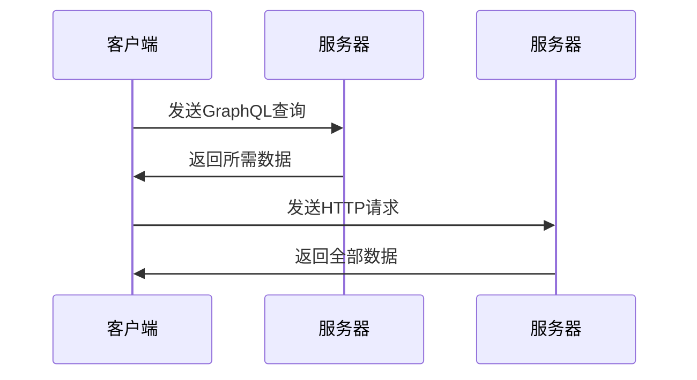

                 

关键词：GraphQL，查询语言，API，前端开发，后端开发

> 摘要：本文旨在探讨GraphQL作为一种灵活查询语言的应用。我们将深入了解GraphQL的核心概念、优势与劣势，并通过实际项目实践展示其如何提高前端与后端开发的效率。

## 1. 背景介绍

在传统的Web开发中，RESTful API作为前后端通信的桥梁，已经被广泛采用。然而，随着互联网应用的日益复杂，RESTful API的一些局限性开始显现。开发者需要编写大量的重复代码来获取所需的数据，这导致了代码的冗余和维护成本的增加。此外，客户端的请求往往需要多次发送，导致性能和用户体验的下降。

为了解决这些问题，GraphQL作为一种新的查询语言应运而生。它由Facebook于2015年推出，旨在提供一个更加灵活和高效的查询系统。GraphQL允许客户端直接指定需要获取的数据，从而减少了重复请求和无效数据的传输，提高了API的效率。

## 2. 核心概念与联系

### 2.1. GraphQL的核心概念

GraphQL是一种查询语言，它允许开发者通过一种结构化的查询语言来获取他们需要的数据。与RESTful API相比，GraphQL的主要区别在于它允许客户端直接指定所需的数据，而不是由服务器决定返回的数据。

以下是GraphQL的一些核心概念：

- **查询（Query）**：查询是GraphQL中最基本的概念，它用于获取数据。一个查询可以包含多个字段，每个字段对应一个数据点。
- **类型（Type）**：类型是GraphQL中的数据结构，它定义了数据的基本单位。GraphQL中的类型可以是对象、标量、枚举或接口。
- **字段（Field）**：字段是类型中的属性，它用于描述数据点。
- **变量（Variable）**：变量是可以在查询中使用的动态值，它允许开发者传递参数以获取不同条件下的数据。

### 2.2. GraphQL与RESTful API的联系与区别

尽管GraphQL与RESTful API在功能上有所重叠，但它们之间也存在显著的区别。

- **数据获取方式**：RESTful API通过URL路径获取数据，而GraphQL通过查询语句获取数据。这使得GraphQL能够更好地适应复杂的数据结构。
- **灵活性**：GraphQL允许客户端指定所需的数据，而RESTful API通常要求客户端接受服务器返回的全部数据。这使得GraphQL在处理大量数据时更为高效。
- **性能**：由于GraphQL能够减少重复请求和无效数据的传输，因此它在性能上通常优于RESTful API。

下面是一个简单的Mermaid流程图，展示了GraphQL与RESTful API的数据获取流程：



## 3. 核心算法原理 & 具体操作步骤

### 3.1. 算法原理概述

GraphQL的核心算法主要涉及以下几个方面：

- **查询解析**：解析客户端发送的GraphQL查询，将其转换为内部表示形式。
- **数据获取**：根据解析后的查询，从数据库或其他数据源获取所需数据。
- **数据转换**：将获取到的数据转换为GraphQL响应格式。

### 3.2. 算法步骤详解

以下是GraphQL算法的具体步骤：

1. **查询解析**：GraphQL服务器接收客户端发送的查询。服务器首先解析查询语句，将其转换为抽象语法树（AST）。

2. **查询优化**：服务器对查询进行优化，以减少查询的执行时间。这包括去除冗余查询、合并多个查询等。

3. **数据获取**：服务器根据AST，从数据库或其他数据源获取所需数据。这一步骤通常涉及多次查询，以获取所有所需数据。

4. **数据转换**：将获取到的数据转换为GraphQL响应格式，并返回给客户端。

### 3.3. 算法优缺点

**优点**：

- **灵活性**：GraphQL允许客户端指定所需数据，减少了无效数据的传输。
- **性能**：减少了重复请求和无效数据传输，提高了API性能。
- **易于维护**：GraphQL通过结构化的查询语言，使得代码更易于理解和维护。

**缺点**：

- **学习曲线**：GraphQL相对于RESTful API来说，学习曲线更陡峭。
- **复杂查询**：GraphQL在处理复杂查询时可能不如RESTful API高效。

### 3.4. 算法应用领域

GraphQL广泛应用于以下领域：

- **前端开发**：用于构建高性能的单页面应用（SPA）。
- **后端开发**：用于构建RESTful API的替代方案。
- **数据聚合**：用于从多个数据源获取数据。

## 4. 数学模型和公式 & 详细讲解 & 举例说明

### 4.1. 数学模型构建

在GraphQL中，查询可以表示为一种数学模型。假设有一个数据源，包含N个数据点，每个数据点可以表示为一个向量。则查询可以表示为一个N×N的矩阵。矩阵的每个元素表示数据点之间的依赖关系。

### 4.2. 公式推导过程

假设有一个查询，需要获取数据点A、B、C。则查询可以表示为以下矩阵：

$$
\begin{bmatrix}
1 & 0 & 1 \\
0 & 1 & 0 \\
1 & 1 & 1 \\
\end{bmatrix}
$$

其中，矩阵的行表示数据点，列表示字段。矩阵的元素表示数据点之间的依赖关系。例如，第一个元素1表示数据点A依赖于字段A。

### 4.3. 案例分析与讲解

假设有一个用户数据源，包含以下数据点：

- 用户ID
- 用户姓名
- 用户邮箱
- 用户生日

现在，我们需要获取用户ID、用户姓名和用户邮箱。则查询可以表示为以下矩阵：

$$
\begin{bmatrix}
1 & 0 & 1 \\
0 & 1 & 0 \\
0 & 0 & 1 \\
\end{bmatrix}
$$

这个矩阵表示我们需要获取数据点A、B和C，而不需要获取数据点D。

通过这个例子，我们可以看到如何使用数学模型来表示GraphQL查询，以及如何通过矩阵运算来获取所需数据。

## 5. 项目实践：代码实例和详细解释说明

### 5.1. 开发环境搭建

要开始使用GraphQL，我们需要搭建一个基本的开发环境。以下是所需的步骤：

1. 安装Node.js（版本要求：>= 8.0.0）
2. 安装GraphQL JavaScript库（使用npm安装：`npm install graphql`)
3. 创建一个新的Node.js项目（使用命令：`npm init`）

### 5.2. 源代码详细实现

以下是使用GraphQL构建一个简单用户数据源的示例代码：

```javascript
// 引入GraphQL库
const { GraphQLServer } = require('graphql-yoga');

// 定义数据源
const users = [
    { id: '1', name: '张三', email: 'zhangsan@example.com', birthdate: '1990-01-01' },
    { id: '2', name: '李四', email: 'lisi@example.com', birthdate: '1991-02-02' },
    { id: '3', name: '王五', email: 'wangwu@example.com', birthdate: '1992-03-03' }
];

// 定义GraphQL类型
const UserType = new GraphQLObjectType({
    name: 'User',
    fields: {
        id: { type: GraphQLString },
        name: { type: GraphQLString },
        email: { type: GraphQLString },
        birthdate: { type: GraphQLString }
    }
});

// 定义GraphQL查询
const QueryType = new GraphQLObjectType({
    name: 'Query',
    fields: {
        users: {
            type: new GraphQLList(UserType),
            resolve: () => users
        }
    }
});

// 创建GraphQL服务器
const server = new GraphQLServer({
    typeDefs: `
        type User {
            id: String
            name: String
            email: String
            birthdate: String
        }

        type Query {
            users: [User]
        }
    `,
    resolvers: {
        Query
    }
});

// 启动服务器
server.start(() => {
    console.log('GraphQL服务器启动成功');
});
```

### 5.3. 代码解读与分析

以上代码首先引入了GraphQL库，并定义了一个用户数据源。然后，我们创建了一个GraphQL类型`UserType`，用于表示用户数据。接下来，我们定义了一个GraphQL查询`QueryType`，用于获取用户数据。最后，我们使用GraphQL库创建了一个GraphQL服务器，并启动了服务器。

通过这个示例，我们可以看到如何使用GraphQL构建一个简单的用户数据源。GraphQL服务器将接受客户端发送的查询，并根据查询从数据源中获取数据。

### 5.4. 运行结果展示

要测试GraphQL服务器，我们可以在命令行中运行以下命令：

```
node server.js
```

然后，我们可以在浏览器中访问以下URL：

```
http://localhost:4000/graphql
```

在GraphQL playground中，我们可以编写查询来获取用户数据。例如：

```
{
    users {
        id
        name
        email
    }
}
```

运行结果将返回所有用户的数据：

```
{
    "data": {
        "users": [
            {
                "id": "1",
                "name": "张三",
                "email": "zhangsan@example.com"
            },
            {
                "id": "2",
                "name": "李四",
                "email": "lisi@example.com"
            },
            {
                "id": "3",
                "name": "王五",
                "email": "wangwu@example.com"
            }
        ]
    }
}
```

## 6. 实际应用场景

### 6.1. 前端开发

在单页面应用（SPA）中，GraphQL可以提高数据获取的效率。开发者可以通过GraphQL直接获取所需数据，而无需多次发送请求。这使得SPA可以更快地加载和更新数据。

### 6.2. 后端开发

GraphQL可以作为RESTful API的替代方案，用于构建灵活和高效的后端服务。开发者可以通过GraphQL提供自定义的API，使客户端可以获取他们所需的数据。

### 6.3. 数据聚合

GraphQL可以用于从多个数据源获取数据。开发者可以使用GraphQL聚合多个API的数据，从而提供一个统一的接口。这有助于简化数据获取流程，并提高系统的可维护性。

## 7. 未来应用展望

随着互联网应用的日益复杂，GraphQL有望在未来得到更广泛的应用。它的灵活性和高性能使其成为构建现代Web应用的理想选择。此外，随着GraphQL生态系统的不断发展和完善，我们有望看到更多工具和资源的涌现，进一步推动GraphQL的应用。

## 8. 工具和资源推荐

### 8.1. 学习资源推荐

- 《GraphQL：核心概念与实战》
- 《用GraphQL构建现代Web应用》
- 《GraphQL官方文档》

### 8.2. 开发工具推荐

- GraphQL Playground：用于测试GraphQL查询的在线工具。
- GraphQL schema JSON Generator：用于自动生成GraphQL schema的工具。
- GraphiQL：用于在浏览器中调试GraphQL的IDE。

### 8.3. 相关论文推荐

- "GraphQL: A Data Query Language for APIs"（GraphQL：API的数据查询语言）
- "Principles of Schema Design for GraphQL"（GraphQL的架构设计原则）

## 9. 总结：未来发展趋势与挑战

GraphQL作为一种灵活查询语言，已经在Web开发中展现出其强大的潜力。然而，要实现其广泛应用，仍需克服一系列挑战，包括学习曲线、性能优化和生态系统建设。随着技术的发展，GraphQL有望在未来的Web开发中发挥更大的作用。

## 10. 附录：常见问题与解答

### 10.1. GraphQL与RESTful API的区别是什么？

GraphQL与RESTful API的主要区别在于数据获取方式。GraphQL允许客户端直接指定所需数据，而RESTful API通常要求客户端接受服务器返回的全部数据。

### 10.2. GraphQL的优势是什么？

GraphQL的优势包括灵活性、性能和易于维护。它允许客户端直接获取所需数据，减少了无效数据的传输，提高了API的性能。

### 10.3. GraphQL的劣势是什么？

GraphQL的劣势包括学习曲线较陡、复杂查询的性能可能不如RESTful API。此外，GraphQL在处理大量数据时可能不如传统数据库查询高效。

### 10.4. 如何在项目中使用GraphQL？

在项目中使用GraphQL的步骤包括：搭建开发环境、定义GraphQL schema、编写GraphQL查询和创建GraphQL服务器。通过这些步骤，开发者可以构建一个灵活高效的API。

---

作者：禅与计算机程序设计艺术 / Zen and the Art of Computer Programming


