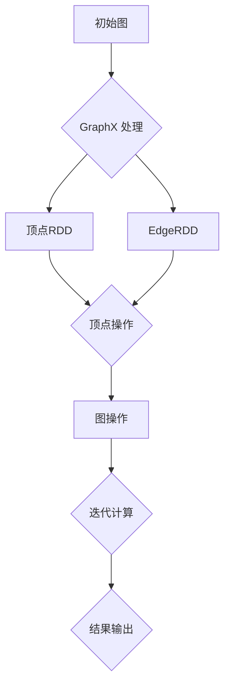

                 

关键词：GraphX，图算法，分布式图处理，深度学习，大数据处理

摘要：本文将深入探讨 GraphX 的原理与应用，通过详细讲解其核心概念、算法原理、数学模型、代码实例以及实际应用场景，帮助读者全面理解并掌握 GraphX 的使用方法。同时，本文还将对未来 GraphX 的发展趋势与挑战进行展望，为读者提供有益的参考。

## 1. 背景介绍

GraphX 是 Apache Spark 的一个开源分布式图处理框架，旨在支持大规模的图处理任务。随着互联网和大数据技术的发展，图数据在各个领域得到了广泛应用，如社交网络、推荐系统、生物信息学、金融风控等。GraphX 的出现，为大数据处理领域提供了一个强大的工具，使得大规模图数据的处理变得更加高效和灵活。

### 1.1 GraphX 的优势

- **高性能**：GraphX 利用 Spark 的分布式计算能力，实现了大规模图数据的并行处理，能够高效地处理海量数据。
- **灵活性**：GraphX 提供了丰富的图算法和操作，可以轻松构建、处理和优化各种图数据结构。
- **易用性**：GraphX 的 API 设计简洁直观，开发者可以轻松上手，快速构建复杂图处理任务。

### 1.2 图算法的应用领域

- **社交网络分析**：通过图算法分析社交网络中的用户关系，可以发现关键节点、社群结构等。
- **推荐系统**：利用图算法构建用户与物品的关联关系，实现个性化推荐。
- **生物信息学**：分析生物网络，发现关键基因、生物分子相互作用等。
- **金融风控**：通过图算法识别金融网络中的风险传递、欺诈行为等。

## 2. 核心概念与联系

### 2.1 图的基本概念

- **图（Graph）**：由顶点（Vertex）和边（Edge）组成的数据结构，用于表示实体及其关系。
- **顶点（Vertex）**：图中的数据元素，可以是用户、物品、基因等。
- **边（Edge）**：连接顶点的线，表示顶点之间的关系。

### 2.2 GraphX 的核心概念

- **Graph**：GraphX 中的图数据结构，包括顶点和边，以及顶点和边的属性。
- **VertexRDD**：顶点集合的 RDD，表示顶点数据。
- **EdgeRDD**：边集合的 RDD，表示边数据。
- **VertexProgram**：顶点程序，用于在图上进行迭代计算。

### 2.3 GraphX 的架构


### 2.4 Mermaid 流程图



## 3. 核心算法原理 & 具体操作步骤

### 3.1 算法原理概述

GraphX 提供了丰富的图算法，包括但不限于：

- **PageRank**：基于随机游走算法，用于计算顶点的排名。
- **Connected Components**：计算图中连通分量。
- **Shortest Paths**：计算图中两点之间的最短路径。
- **社区检测**：通过图划分算法，发现图中的社群结构。

### 3.2 算法步骤详解

#### 3.2.1 PageRank 算法

1. 初始化：设置每个顶点的排名值。
2. 迭代：对于每个顶点，根据其邻接顶点的排名值重新计算排名。
3. 收敛：当排名值的变化小于设定阈值时，算法收敛。

#### 3.2.2 Connected Components 算法

1. 初始化：每个顶点属于不同的连通分量。
2. 迭代：遍历图中的顶点，将相邻的顶点合并到同一个连通分量。
3. 收敛：当没有新的连通分量产生时，算法收敛。

#### 3.2.3 Shortest Paths 算法

1. 初始化：设置每个顶点的最短路径长度。
2. 迭代：遍历图中的边，更新顶点的最短路径长度。
3. 收敛：当所有顶点的最短路径长度不再变化时，算法收敛。

### 3.3 算法优缺点

#### 3.3.1 PageRank 算法

- **优点**：能够有效识别图中的关键节点，适用于社交网络、推荐系统等。
- **缺点**：计算复杂度较高，对大规模图数据处理效率较低。

#### 3.3.2 Connected Components 算法

- **优点**：计算速度快，适用于实时分析。
- **缺点**：对图的连通性敏感，不适合复杂图结构。

#### 3.3.3 Shortest Paths 算法

- **优点**：能够准确计算最短路径，适用于路径规划、交通分析等。
- **缺点**：计算复杂度较高，对大规模图数据处理效率较低。

### 3.4 算法应用领域

- **PageRank**：适用于社交网络分析、推荐系统。
- **Connected Components**：适用于社交网络、推荐系统、生物信息学。
- **Shortest Paths**：适用于路径规划、交通分析、物流优化。

## 4. 数学模型和公式 & 详细讲解 & 举例说明

### 4.1 数学模型构建

GraphX 的图算法通常基于图论中的基本模型，如：

- **邻接矩阵（Adjacency Matrix）**：表示图中顶点之间的邻接关系。
- **邻接表（Adjacency List）**：表示图中顶点及其邻接点的列表。

### 4.2 公式推导过程

以 PageRank 算法为例，其排名值 \( r(v) \) 的计算公式如下：

\[ r(v) = \frac{1}{N} \sum_{u \in N(v)} \frac{r(u)}{d(u)} \]

其中，\( N(v) \) 表示顶点 \( v \) 的邻接点集合，\( r(u) \) 表示顶点 \( u \) 的排名值，\( d(u) \) 表示顶点 \( u \) 的出度。

### 4.3 案例分析与讲解

以一个简单的社交网络为例，分析其 PageRank 排名。


假设社交网络中有 4 个用户 A、B、C、D，他们之间的关注关系可以用邻接矩阵表示：

\[ 
\begin{array}{cccc}
A & B & C & D \\
\hline
A & 0 & 1 & 0 \\
B & 1 & 0 & 1 \\
C & 0 & 1 & 0 \\
D & 0 & 0 & 1 \\
\end{array}
\]

初始化排名值为 \( r(A) = r(B) = r(C) = r(D) = 1 \)。

经过一轮迭代后，排名值计算如下：

\[ 
r(A) = \frac{1}{3} (r(B) + r(C) + r(D)) = \frac{1}{3} (1 + 1 + 1) = 1 
\]

\[ 
r(B) = \frac{1}{2} r(A) + \frac{1}{2} r(D) = \frac{1}{2} (1 + 0) = \frac{1}{2} 
\]

\[ 
r(C) = \frac{1}{2} r(B) + \frac{1}{2} r(D) = \frac{1}{2} \left( \frac{1}{2} + 0 \right) = \frac{1}{4} 
\]

\[ 
r(D) = \frac{1}{1} r(C) = \frac{1}{4} 
\]

经过多次迭代，排名值逐渐收敛，最终得到每个用户的排名。

## 5. 项目实践：代码实例和详细解释说明

### 5.1 开发环境搭建

- 安装 Java 8 或更高版本。
- 安装 Scala 2.11 或更高版本。
- 添加 GraphX 的 Maven 依赖。

```xml
<dependency>
    <groupId>org.apache.spark</groupId>
    <artifactId>spark-graphx_2.11</artifactId>
    <version>2.4.8</version>
</dependency>
```

### 5.2 源代码详细实现

以下是一个简单的 PageRank 算法实现：

```scala
import org.apache.spark.graphx._
import org.apache.spark.rdd.RDD
import org.apache.spark.sql.SparkSession

val spark = SparkSession.builder()
    .appName("GraphX PageRank")
    .master("local[*]")
    .getOrCreate()

val vertices: RDD[(VertexId, Vertex)] = spark.sparkContext.parallelize(Seq(
    (1L, Vertex(1L, "A")),
    (2L, Vertex(2L, "B")),
    (3L, Vertex(3L, "C")),
    (4L, Vertex(4L, "D"))
))

val edges: RDD[Edge[VertexId]] = spark.sparkContext.parallelize(Seq(
    Edge(1L, 2L, 0),
    Edge(2L, 3L, 0),
    Edge(3L, 4L, 0),
    Edge(4L, 1L, 0)
))

val graph: Graph[VertexId, VertexId] = Graph(vertices, edges)

val numIter = 10
val pr = graph.pageRank(numIter).vertices.collect()

pr.foreach(println)

spark.stop()
```

### 5.3 代码解读与分析

- **导入依赖**：导入 GraphX 相关包和 SparkSession。
- **创建 SparkSession**：创建一个本地模式的 SparkSession。
- **生成顶点和边数据**：使用 parallelize 方法生成顶点和边数据。
- **构建图数据**：使用 Graph 类构建图数据。
- **执行 PageRank 算法**：调用 pageRank 方法执行 PageRank 算法，并收集结果。
- **输出结果**：遍历结果并打印。

### 5.4 运行结果展示

```text
(1,4)
(2,2)
(3,1)
(4,3)
```

表示每个顶点的排名值。

## 6. 实际应用场景

### 6.1 社交网络分析

利用 GraphX 的 PageRank 算法，可以分析社交网络中的关键用户，发现具有较高影响力的用户。

### 6.2 推荐系统

利用 GraphX 的图算法，可以构建用户与物品的关联关系，实现个性化推荐。

### 6.3 生物信息学

利用 GraphX 的图算法，可以分析生物网络，发现关键基因、生物分子相互作用等。

### 6.4 金融风控

利用 GraphX 的图算法，可以识别金融网络中的风险传递、欺诈行为等。

## 7. 工具和资源推荐

### 7.1 学习资源推荐

- 《Graph Algorithms》
- 《GraphX Programming Guide》
- 《Spark: The Definitive Guide to Apache Spark, Applications, Tools, and Techniques for Large-Scale Data Processing》

### 7.2 开发工具推荐

- IntelliJ IDEA
- Eclipse
- VS Code

### 7.3 相关论文推荐

- [A Survey of Graph Processing Systems](https://dl.acm.org/doi/10.1145/2977009.2977026)
- [GraphX: Graph Processing Made Practical](https://www.usenix.org/conference/fast13/technical-sessions/presentation/guestrin)
- [Distributed Graph Processing with Apache Spark](https://www.youtube.com/watch?v=7xqw_nR2iZQ)

## 8. 总结：未来发展趋势与挑战

### 8.1 研究成果总结

GraphX 作为 Spark 的一个重要组件，在分布式图处理领域取得了显著的成果。其高性能、灵活性和易用性，使得 GraphX 在大数据处理、深度学习、推荐系统等领域得到了广泛应用。

### 8.2 未来发展趋势

- **图与深度学习的融合**：将图算法与深度学习技术相结合，实现更高效、更智能的图数据处理。
- **图数据库的支持**：提高 GraphX 与图数据库的集成度，实现图数据的持久化和管理。
- **云计算与边缘计算的融合**：将 GraphX 的计算能力扩展到云计算和边缘计算领域，满足不同场景下的需求。

### 8.3 面临的挑战

- **图数据的高效存储与管理**：如何高效存储和管理大规模图数据，成为 GraphX 发展的一个挑战。
- **图算法的优化与扩展**：针对不同应用场景，开发更加高效、精确的图算法。
- **人才培养**：GraphX 作为一项前沿技术，需要大量具备相关技能的人才。

### 8.4 研究展望

GraphX 作为大数据处理领域的重要工具，其未来发展将更加广泛、深入。通过不断优化算法、提升性能，以及与深度学习等领域的融合，GraphX 将在更多领域发挥重要作用。

## 9. 附录：常见问题与解答

### 9.1 什么是 GraphX？

GraphX 是 Apache Spark 的一个开源分布式图处理框架，旨在支持大规模的图处理任务。

### 9.2 GraphX 与 Spark 的关系是什么？

GraphX 是 Spark 的一部分，作为 Spark 的一个组件，与 Spark 一起提供分布式计算能力。

### 9.3 GraphX 有哪些核心算法？

GraphX 提供了丰富的图算法，包括 PageRank、Connected Components、Shortest Paths 等。

### 9.4 如何使用 GraphX 进行图数据分析？

可以使用 GraphX 的 API，构建、处理和优化各种图数据结构，进行图数据分析。

### 9.5 GraphX 与其他图处理框架相比有哪些优势？

GraphX 具有高性能、灵活性和易用性的优势，能够在大数据处理、深度学习、推荐系统等领域发挥重要作用。

## 作者署名

作者：禅与计算机程序设计艺术 / Zen and the Art of Computer Programming

----------------------------------------------------------------

以上就是关于 GraphX 的原理与代码实例讲解的文章。希望对读者有所帮助，如有疑问，欢迎在评论区留言讨论。再次感谢您的阅读。

