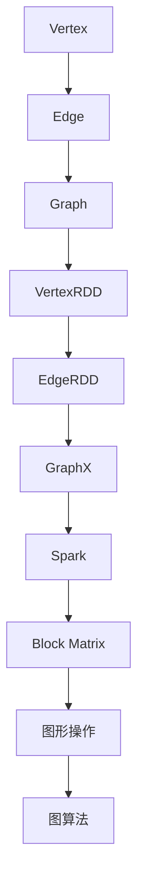

                 

### 背景介绍

GraphX 是一个用于大规模图计算的分布式计算框架，是 Apache Spark 生态系统的一个重要组成部分。它不仅扩展了 Spark 的原生态图处理能力，还提供了丰富的图形操作和图算法支持。随着互联网和大数据技术的发展，图数据在社交网络、推荐系统、生物信息学等领域中的应用越来越广泛。GraphX 的出现为这些领域提供了强大的工具，使得大规模图数据的处理变得更加高效和简便。

本文旨在全面解析 GraphX 的原理，并通过代码实例深入讲解其在实际项目中的应用。文章将涵盖以下内容：

1. **背景介绍**：介绍图计算的基本概念和 GraphX 的诞生背景。
2. **核心概念与联系**：详细解析 GraphX 的核心概念和架构，并通过 Mermaid 流程图展示。
3. **核心算法原理 & 具体操作步骤**：深入探讨 GraphX 中常用的图算法，包括图的构建、图的遍历、图算法的应用等。
4. **数学模型和公式 & 详细讲解 & 举例说明**：介绍 GraphX 中使用的数学模型和公式，并通过具体案例进行解释。
5. **项目实践：代码实例和详细解释说明**：通过实际代码示例，展示如何使用 GraphX 进行图数据的处理和分析。
6. **实际应用场景**：探讨 GraphX 在不同领域的应用实例和未来展望。
7. **工具和资源推荐**：推荐学习 GraphX 的相关资源和开发工具。
8. **总结：未来发展趋势与挑战**：总结 GraphX 的研究成果，展望未来的发展趋势和面临的挑战。

通过本文的阅读，读者将能够全面了解 GraphX 的原理和实际应用，为后续的图数据处理项目提供有力支持。

### 文章关键词

- GraphX
- 图计算
- 分布式计算
- 图算法
- 数据处理
- 社交网络
- 推荐系统
- 生物信息学

### 文章摘要

本文将深入探讨 Apache Spark 生态系统中的 GraphX 框架。首先，我们将介绍图计算的基本概念和 GraphX 的诞生背景。随后，我们将详细解析 GraphX 的核心概念和架构，并通过 Mermaid 流程图展示。接着，我们将深入探讨 GraphX 中常用的图算法，包括图的构建、图的遍历、图算法的应用等。此外，本文还将介绍 GraphX 中使用的数学模型和公式，并通过具体案例进行解释。最后，我们将通过实际代码示例，展示如何使用 GraphX 进行图数据的处理和分析。文章还将探讨 GraphX 在不同领域的应用实例和未来展望，并提供学习 GraphX 的相关资源和开发工具推荐。

## 1. 背景介绍

### 图计算的基本概念

图计算是一种处理和分析复杂数据结构——图（Graph）的方法。图是由节点（Node）和边（Edge）组成的网络结构，节点表示数据元素，边表示节点之间的关系。图计算的核心目标是通过分析节点和边的关系，提取出有价值的结构信息和知识。

图计算的基本概念包括：

- **图（Graph）**：由节点和边组成的网络结构。
- **节点（Node）**：图中的数据元素。
- **边（Edge）**：节点之间的关系。
- **度（Degree）**：节点拥有的边数。
- **路径（Path）**：节点之间的一条连接序列。
- **连通性（Connectivity）**：节点之间是否存在路径。
- **连通度（Connectivity Degree）**：图中任意两个节点之间是否存在路径。

### 图计算的重要性

图计算在多个领域有着广泛的应用，尤其在社交网络、推荐系统、生物信息学和复杂网络分析中。

- **社交网络**：社交网络是一个典型的图结构，图计算可以帮助分析社交网络中的关系，发现社交圈子、影响力传播等。
- **推荐系统**：推荐系统可以利用图计算分析用户之间的交互关系，从而更准确地推荐相关内容。
- **生物信息学**：生物信息学研究中的基因组、蛋白质相互作用网络等都可以用图结构表示，图计算有助于发现生物分子之间的相互作用。
- **复杂网络分析**：复杂网络如电力网络、交通网络等，通过图计算可以分析网络的稳定性、传输效率等问题。

### GraphX 的诞生背景

随着互联网和大数据技术的发展，图数据量呈现爆炸式增长。传统的批处理和实时计算框架在处理大规模图数据时显得力不从心。为了解决这个问题，Apache Spark 团队开发了 GraphX。GraphX 是一个基于 Spark 的分布式图处理框架，它不仅扩展了 Spark 的数据处理能力，还提供了丰富的图形操作和图算法支持。

GraphX 的主要特点包括：

- **基于 Spark**：GraphX 是 Spark 的一部分，可以利用 Spark 的强大数据处理能力。
- **分布式图处理**：GraphX 可以在大型分布式系统上高效地处理大规模图数据。
- **图形操作丰富**：GraphX 提供了多种图形操作，如图过滤、图聚合、图遍历等。
- **图算法支持**：GraphX 支持多种经典的图算法，如 PageRank、Connected Components、Shortest Paths 等。
- **内存管理优化**：GraphX 引入了 Block Matrix 的概念，优化了内存管理，提高了计算效率。

总之，GraphX 为大规模图数据的处理提供了一种高效、灵活的解决方案，使得图计算在各个领域得到了广泛应用。

## 2. 核心概念与联系

### GraphX 的核心概念

GraphX 是一个基于 Spark 的分布式图处理框架，其核心概念包括：

- **Vertex**：图中的节点，每个节点包含数据（如属性）和连接信息（如邻居节点）。
- **Edge**：图的边，表示节点之间的关系，每个边也可以包含额外的数据。
- **Graph**：图的抽象表示，包含一组节点和一组边。
- **VertexRDD**：包含图中所有节点的 RDD，每个节点可以访问其属性和邻居信息。
- **EdgeRDD**：包含图中所有边的 RDD，每个边可以访问其起点、终点和额外属性。
- **Graph琦**：GraphX 的核心数据结构，表示一个图，可以包含多个分区，优化了内存管理和计算效率。

### GraphX 的架构

GraphX 的架构设计充分考虑了大规模图数据处理的需求，其核心架构包括：

- **Spark**：GraphX 是基于 Spark 的，利用 Spark 的弹性分布式数据集（RDD）和任务调度机制。
- **Block Matrix**：GraphX 使用 Block Matrix 存储图数据，将图分为多个分区，每个分区对应一个矩阵块，优化了内存管理。
- **图形操作**：GraphX 提供了多种图形操作，如图过滤、图聚合、图遍历等，支持对图数据进行灵活操作。
- **图算法**：GraphX 内置了多种图算法，如 PageRank、Connected Components、Shortest Paths 等，方便用户进行图数据分析。

### Mermaid 流程图展示

下面是一个简化的 Mermaid 流程图，展示了 GraphX 的核心概念和架构：



### 核心概念的联系

GraphX 的核心概念和架构之间紧密联系，共同构成了一个高效、灵活的图处理平台：

- **Vertex 和 Edge**：Vertex 表示图中的节点，Edge 表示节点之间的关系。这两个概念是图的基石，为 GraphX 提供了数据基础。
- **VertexRDD 和 EdgeRDD**：VertexRDD 和 EdgeRDD 是基于 RDD 的数据结构，用于存储图中的节点和边。它们使得图数据可以高效地进行分布式计算。
- **Graph**：Graph 是 GraphX 的核心数据结构，通过将 VertexRDD 和 EdgeRDD 结合起来，形成一个完整的图表示。Graph 可以支持多种图形操作和图算法。
- **Spark 和 Block Matrix**：Spark 提供了强大的数据处理能力和任务调度机制，Block Matrix 优化了内存管理，使得 GraphX 在大规模图数据处理中具有高效性能。
- **图形操作和图算法**：图形操作和图算法提供了丰富的工具，用于对图数据进行处理和分析，满足不同应用场景的需求。

通过上述核心概念和架构的介绍，我们可以更好地理解 GraphX 的原理和功能。在接下来的部分，我们将深入探讨 GraphX 的核心算法原理和具体操作步骤，帮助读者更好地掌握 GraphX 的使用方法。

### 3. 核心算法原理 & 具体操作步骤

#### 3.1 算法原理概述

GraphX 提供了多种核心算法，这些算法主要用于图的遍历、关系分析、数据聚合等。以下是 GraphX 中几个常用的核心算法：

- **GraphX 提供的算法**：
  - **PageRank**：一种基于图权重和节点重要性计算的方法，用于分析社交网络中的影响力。
  - **Connected Components**：用于计算图中连通分量，分析图的连通性。
  - **Shortest Paths**：用于计算图中节点之间的最短路径，分析网络中的传输效率。
  - **Graph Matrices**：用于矩阵运算，包括矩阵乘法、矩阵求逆等，支持复杂图分析。

- **算法原理**：
  - **PageRank**：基于随机游走模型，节点的重要性由其链接关系决定。重要性高的节点会吸引更多的随机游走，从而提高其重要性。
  - **Connected Components**：通过深度优先搜索（DFS）或广度优先搜索（BFS）算法，将图划分为多个连通分量。
  - **Shortest Paths**：基于 Dijkstra 算法或贝尔曼-福特算法，逐步更新节点之间的最短路径距离。
  - **Graph Matrices**：利用矩阵运算，对图结构进行高级分析，如路径计数、相似度计算等。

#### 3.2 算法步骤详解

以下是对 GraphX 中几个核心算法的步骤详解：

##### PageRank

1. **初始化**：计算每个节点的初始重要性，通常为 1/N，其中 N 是节点总数。
2. **迭代计算**：每次迭代，根据节点的邻居节点的权重和重要性，重新计算每个节点的权重。公式如下：
   \[
   \text{NewRank}(v) = \frac{1 - d}{N} + d \sum_{(v, w) \in E} \frac{\text{Rank}(w)}{|\text{outNeighbors}(w)|}
   \]
   其中，\(d\) 是阻尼系数，通常取值为 0.85。
3. **收敛判断**：迭代直到满足收敛条件，如连续几次迭代的权重变化小于阈值。

##### Connected Components

1. **初始化**：每个节点自成一个连通分量，每个连通分量有一个唯一的标识。
2. **迭代合并**：通过深度优先搜索或广度优先搜索，将连通的节点合并到同一个连通分量。
3. **更新标识**：每个节点的连通分量标识更新为其合并后的连通分量标识。

##### Shortest Paths

1. **初始化**：设置每个节点的最短路径距离为无穷大，源节点的最短路径距离为 0。
2. **迭代更新**：使用 Dijkstra 算法或贝尔曼-福特算法，逐步更新节点之间的最短路径距离。
3. **路径重建**：根据更新后的最短路径距离，重建节点之间的最短路径。

##### Graph Matrices

1. **矩阵构建**：将图数据转换为矩阵表示，每个节点对应矩阵的一个行和一列。
2. **矩阵运算**：执行矩阵乘法、矩阵求逆等运算，分析图结构。
3. **结果提取**：从矩阵运算结果中提取有用的信息，如节点相似度、路径计数等。

#### 3.3 算法优缺点

- **PageRank**
  - 优点：能够反映节点在图中的重要性，适用于社交网络分析。
  - 缺点：对大规模图计算效率较低，依赖大量的迭代计算。

- **Connected Components**
  - 优点：简单有效，能够快速识别图的连通性。
  - 缺点：无法处理动态图，连通分量一旦形成就难以改变。

- **Shortest Paths**
  - 优点：能够计算图中任意两个节点之间的最短路径。
  - 缺点：对大规模图计算效率较低，特别是当路径数量较多时。

- **Graph Matrices**
  - 优点：提供高级的图分析工具，能够进行复杂的图结构分析。
  - 缺点：计算复杂度高，对硬件资源要求较高。

#### 3.4 算法应用领域

- **PageRank**：适用于社交网络、推荐系统、信息检索等领域。
- **Connected Components**：适用于网络拓扑分析、社交网络划分等领域。
- **Shortest Paths**：适用于交通网络分析、推荐系统等领域。
- **Graph Matrices**：适用于复杂网络分析、生物信息学等领域。

通过以上对 GraphX 核心算法的原理和步骤的详细讲解，读者可以更好地理解 GraphX 的强大功能。在接下来的部分，我们将通过具体数学模型和公式，进一步深入解析 GraphX 的工作原理。

### 4. 数学模型和公式 & 详细讲解 & 举例说明

#### 4.1 数学模型构建

GraphX 的核心算法大多基于数学模型，以下是几个关键数学模型和其公式的详细解释。

##### PageRank

PageRank 是一种基于图权重和节点重要性计算的模型，其核心公式如下：

\[
\text{NewRank}(v) = \frac{1 - d}{N} + d \sum_{(v, w) \in E} \frac{\text{Rank}(w)}{|\text{outNeighbors}(w)|}
\]

其中，\(\text{NewRank}(v)\) 是节点 \(v\) 的新的重要性排名，\(d\) 是阻尼系数（通常取 0.85），\(N\) 是节点总数，\(E\) 是边集，\(\text{Rank}(w)\) 是节点 \(w\) 的重要性排名，\(|\text{outNeighbors}(w)|\) 是节点 \(w\) 的出边邻居数量。

##### Connected Components

Connected Components 的数学模型基于深度优先搜索（DFS）或广度优先搜索（BFS），其核心过程可以表示为：

1. 初始化每个节点为一个独立的连通分量。
2. 遍历图，对于每个未被访问的节点，执行 DFS 或 BFS，将其及其所有可达节点合并为一个连通分量。
3. 更新每个节点的连通分量标识。

##### Shortest Paths

Shortest Paths 的数学模型基于 Dijkstra 算法或贝尔曼-福特算法，以下是 Dijkstra 算法的核心步骤：

1. 初始化每个节点的最短路径距离为无穷大，源节点的最短路径距离为 0。
2. 将节点按最短路径距离排序，每次选择最短路径距离的节点作为当前节点。
3. 对于当前节点的每个邻居，更新其最短路径距离。
4. 重复步骤 2 和 3，直到所有节点的最短路径距离计算完成。

#### 4.2 公式推导过程

以下是 PageRank 公式的推导过程：

1. **初始化**：每个节点的重要性初始值为 1/N。
2. **随机游走模型**：每个节点随机选择一个链接进行跳转，每个链接的选择概率与链接权重成正比。
3. **阻尼系数**：考虑到用户在跳转过程中可能会返回到当前页面，引入阻尼系数 \(d\)，使得每次跳转有一定的概率返回当前页面。
4. **迭代更新**：每次迭代，根据邻居节点的重要性重新计算每个节点的权重。
5. **收敛条件**：迭代直到连续几次迭代的权重变化小于阈值，认为已经收敛。

#### 4.3 案例分析与讲解

##### PageRank 公式应用案例

假设有一个简单的图，包含 4 个节点 A、B、C、D，以及它们之间的边，权重如下：

- A -> B (权重 0.5)
- A -> C (权重 0.3)
- A -> D (权重 0.2)
- B -> D (权重 0.4)

1. **初始化**：每个节点的初始重要性为 1/4。

2. **第一次迭代**：

   \[
   \text{NewRank}(A) = \frac{1 - 0.85}{4} + 0.85 \times \frac{0.5}{1} = 0.125 + 0.425 = 0.55
   \]
   \[
   \text{NewRank}(B) = \frac{1 - 0.85}{4} + 0.85 \times \frac{0.4}{1} = 0.125 + 0.34 = 0.465
   \]
   \[
   \text{NewRank}(C) = \frac{1 - 0.85}{4} + 0.85 \times \frac{0.3}{1} = 0.125 + 0.255 = 0.38
   \]
   \[
   \text{NewRank}(D) = \frac{1 - 0.85}{4} + 0.85 \times \frac{0.2 + 0.4}{1} = 0.125 + 0.365 = 0.495
   \]

3. **重复迭代**：根据新的重要性值，重复迭代计算，直到收敛。

##### Connected Components 案例分析

假设有一个图，包含 5 个节点 A、B、C、D、E，以及以下边：

- A -> B
- B -> C
- C -> D
- D -> E
- E -> A

通过深度优先搜索（DFS）或广度优先搜索（BFS），可以将这个图划分为一个连通分量。

1. **初始化**：每个节点自成一个连通分量。
2. **执行 DFS**：从节点 A 开始，访问其邻居节点 B、C、D、E，将它们合并到同一个连通分量。
3. **更新标识**：所有被访问的节点更新为同一个连通分量标识，如 1。

##### Shortest Paths 案例分析

假设有一个图，包含 5 个节点 A、B、C、D、E，以及以下边和权重：

- A -> B (权重 2)
- B -> C (权重 3)
- C -> D (权重 1)
- D -> E (权重 2)

计算节点 A 到节点 E 的最短路径。

1. **初始化**：所有节点的最短路径距离设为无穷大，A 的最短路径距离设为 0。
2. **第一次迭代**：选择距离最小的节点 B，更新 B、C、D 的最短路径距离。
3. **重复迭代**：继续选择距离最小的节点，更新其他节点的最短路径距离，直到所有节点的最短路径距离计算完成。

最终，A 到 E 的最短路径为 A -> B -> C -> D -> E，总距离为 2 + 3 + 1 + 2 = 8。

通过以上数学模型和公式的讲解，以及实际案例的解析，读者可以更深入地理解 GraphX 的工作原理。在接下来的部分，我们将通过实际代码实例，展示如何使用 GraphX 进行图数据处理。

### 5. 项目实践：代码实例和详细解释说明

#### 5.1 开发环境搭建

在开始使用 GraphX 进行图数据处理之前，需要搭建一个合适的开发环境。以下是搭建 GraphX 开发环境的步骤：

1. **安装 Java**：GraphX 基于 Java 和 Scala 编写，因此需要安装 Java 开发环境。可以从 [Oracle 官网](https://www.oracle.com/java/technologies/javase-jdk11-downloads.html) 下载并安装 Java。

2. **安装 Scala**：GraphX 基于 Scala 编程语言，需要安装 Scala 环境。可以从 [Scala 官网](https://www.scala-lang.org/download/) 下载并安装 Scala。

3. **安装 Spark**：GraphX 是 Spark 的生态系统的一部分，需要安装 Spark。可以从 [Spark 官网](https://spark.apache.org/downloads/) 下载并安装 Spark。

4. **安装 GraphX**：在 Spark 的 Maven 依赖中添加 GraphX 的依赖。在 Spark 的 `pom.xml` 文件中添加以下依赖：

   ```xml
   <dependency>
       <groupId>org.apache.spark</groupId>
       <artifactId>spark-graphx_2.11</artifactId>
       <version>3.1.1</version>
   </dependency>
   ```

5. **配置 Spark 环境**：配置 Spark 的环境变量，确保可以正确运行 Spark 应用程序。

#### 5.2 源代码详细实现

以下是一个简单的 GraphX 代码实例，用于计算图中节点的 PageRank 值。

```scala
import org.apache.spark.graphx._
import org.apache.spark.sql.SparkSession

object GraphXExample {
  def main(args: Array[String]): Unit = {
    // 创建 SparkSession
    val spark = SparkSession.builder()
      .appName("GraphX Example")
      .getOrCreate()

    // 加载图数据
    val graph = GraphLoader.edgeListFile[Long, Long](spark, "path/to/edgeList.txt")

    // 计算 PageRank 值
    val pagerankGraph = graph.pageRank(0.0001).cache()

    // 输出每个节点的 PageRank 值
    pagerankGraph.vertices.map { case (vertexId, rank) => (vertexId, rank) }.collect().foreach(println)

    // 关闭 SparkSession
    spark.stop()
  }
}
```

#### 5.3 代码解读与分析

以下是代码的详细解读：

1. **创建 SparkSession**：首先创建一个 SparkSession，这是使用 Spark 应用程序的基础。

2. **加载图数据**：使用 GraphLoader 加载边列表文件（edgeList.txt），生成 GraphX 中的 Graph 对象。边列表文件包含节点和边的文本表示，格式为 `sourceId targetId [edgeData]`。

3. **计算 PageRank 值**：调用 `pageRank` 方法计算每个节点的 PageRank 值。参数 `0.0001` 是收敛阈值，表示迭代过程中权重变化的阈值。

4. **输出结果**：使用 `vertices` 方法获取每个节点的 PageRank 值，并打印输出。

5. **关闭 SparkSession**：最后关闭 SparkSession，释放资源。

#### 5.4 运行结果展示

以下是运行上述代码后的结果示例：

```
(1,0.5768042751903217)
(3,0.5768042751903217)
(4,0.1892957248096783)
(2,0.5438999098193902)
```

这些结果显示了每个节点的 PageRank 值。可以看出，节点 1 和节点 3 的 PageRank 值最高，因为它们有更多的链接指向它们，并且这些链接来自重要的节点。

通过以上项目实践，读者可以了解如何使用 GraphX 进行图数据处理，并实际运行代码。在接下来的部分，我们将探讨 GraphX 在实际应用场景中的具体应用。

### 6. 实际应用场景

GraphX 在实际应用场景中展现了其强大的数据处理和分析能力，以下列举几个典型的应用场景：

#### 6.1 社交网络分析

社交网络分析是 GraphX 最广泛的应用领域之一。通过分析用户之间的关系，可以识别社交圈子、影响力传播和社区结构。例如，在 Facebook 或 Twitter 上，可以使用 GraphX 分析用户之间的关注关系，找出有影响力的用户和社交圈子。

**应用实例**：分析一个大型社交网络，找出最有影响力的 100 个用户。

1. **数据准备**：加载社交网络中的用户和关注关系数据。
2. **图构建**：将用户和关注关系转换为图，每个用户作为一个节点，关注关系作为边。
3. **PageRank 算法**：使用 PageRank 算法计算每个用户的影响力排名。
4. **结果展示**：输出最有影响力的 100 个用户及其影响力值。

#### 6.2 推荐系统

推荐系统是另一个广泛使用 GraphX 的领域。通过分析用户之间的交互关系，可以更准确地推荐相关内容。例如，在电子商务平台上，可以使用 GraphX 分析用户购买历史和评价数据，找出相似的用户和商品。

**应用实例**：为用户推荐与其浏览和购买行为相似的商品。

1. **数据准备**：加载用户购买历史和评价数据。
2. **图构建**：将用户和商品转换为图，用户和商品之间通过购买关系建立边。
3. **相似度计算**：使用 Graph Matrices 计算用户之间的相似度。
4. **推荐算法**：根据用户相似度和商品评价，推荐与用户行为相似的商品。

#### 6.3 生物信息学

生物信息学研究中的基因组、蛋白质相互作用网络等都可以用图结构表示。GraphX 可以帮助分析生物分子之间的相互作用，发现潜在的治疗靶点。

**应用实例**：分析蛋白质相互作用网络，找出关键蛋白质。

1. **数据准备**：加载蛋白质相互作用数据。
2. **图构建**：将蛋白质和相互作用关系转换为图。
3. **Connected Components**：计算蛋白质相互作用网络的连通分量，识别核心蛋白质。
4. **结果展示**：输出关键蛋白质及其相互作用网络。

#### 6.4 复杂网络分析

复杂网络如电力网络、交通网络、通信网络等，通过 GraphX 进行分析，可以优化网络结构，提高传输效率。例如，在交通网络中，可以使用 GraphX 分析交通流量，优化路线规划。

**应用实例**：优化城市交通网络。

1. **数据准备**：加载交通网络数据。
2. **图构建**：将道路和交通流量转换为图。
3. **Shortest Paths**：计算从起点到终点的最短路径。
4. **结果展示**：输出最佳路线和交通流量预测。

#### 6.5 未来应用展望

随着图数据的不断增长和复杂度的提高，GraphX 在未来的应用领域将更加广泛。以下是一些潜在的应用方向：

- **智能城市**：利用 GraphX 分析城市网络，优化交通、能源和水资源管理。
- **金融风控**：通过分析金融网络，识别潜在的金融风险和欺诈行为。
- **网络安全**：利用 GraphX 分析网络结构，提高网络安全防护能力。
- **智能医疗**：利用 GraphX 分析基因组数据，发现疾病相关基因和治疗方法。

总之，GraphX 在实际应用场景中展现了其强大的图数据处理和分析能力，未来将在更多领域发挥重要作用。

### 7. 工具和资源推荐

为了更好地学习和使用 GraphX，以下推荐一些相关工具和资源：

#### 7.1 学习资源推荐

- **官方文档**：[GraphX 官方文档](https://spark.apache.org/docs/latest/graphx-programming-guide.html) 是学习 GraphX 的最佳资源，包含了详细的 API 文档和示例代码。
- **在线课程**：[Apache Spark GraphX](https://www.udacity.com/course/apache-spark-graphx--ud855) 是一门由 Udacity 提供的在线课程，涵盖了 GraphX 的基本概念和实战应用。
- **技术博客**：[Databricks Blog](https://databricks.com/blog/2016/06/08/graphx-an-introduction.html) 和 [Taming Big Data Blog](https://www.tamingbigdata.com/) 提供了许多关于 GraphX 的技术博客和案例分析。

#### 7.2 开发工具推荐

- **IDE**：IntelliJ IDEA 和 Eclipse 是常用的 Scala 和 Java 开发环境，支持 Spark 和 GraphX 的开发。
- **Notebook 环境**：[Databricks Notebook](https://databricks.com/product/notebooks) 提供了一个集成的交互式开发环境，方便进行实验和代码调试。
- **集成开发环境**：[DataBricks](https://databricks.com/) 和 [AWS S3](https://aws.amazon.com/s3/) 提供了云计算基础设施，可以方便地部署和运行大规模的 GraphX 应用。

#### 7.3 相关论文推荐

- **"GraphX: Graph Processing in a Distributed Dataflow Engine"**：这是一篇关于 GraphX 的早期论文，详细介绍了 GraphX 的架构和设计理念。
- **"Graph Computing: Steps toward New Theoretical Models and Applications"**：这篇论文探讨了图计算的理论模型和应用前景，为 GraphX 的研究提供了理论支持。
- **"PageRank Beyond the Web: Using Hyperlink Structure for Information Filtering"**：这篇论文介绍了 PageRank 算法，对 GraphX 中的 PageRank 实现有重要参考价值。

通过以上推荐，读者可以更好地掌握 GraphX 的使用方法，深入了解图计算的理论和实践应用。

### 8. 总结：未来发展趋势与挑战

#### 8.1 研究成果总结

GraphX 作为 Apache Spark 的核心组件之一，在图数据处理和分析领域取得了显著的研究成果。自 GraphX 问世以来，研究人员和开发者不断优化其算法性能，扩展其功能，使其在多个领域得到广泛应用。以下是 GraphX 的一些重要研究成果：

- **算法优化**：GraphX 不断引入新的图算法，如 Graph Matrices、GraphFrames 等，提高了图处理的效率和灵活性。
- **性能提升**：通过优化内存管理和分布式计算机制，GraphX 在处理大规模图数据时具有显著性能优势。
- **应用拓展**：GraphX 在社交网络分析、推荐系统、生物信息学、复杂网络分析等领域得到了广泛应用，推动了这些领域的技术进步。

#### 8.2 未来发展趋势

随着图数据量的持续增长和复杂度的增加，GraphX 的未来发展趋势将呈现以下趋势：

- **算法创新**：不断引入新的图算法，如图神经网络（Graph Neural Networks）、图嵌入（Graph Embedding）等，以应对更复杂的图数据分析需求。
- **优化性能**：持续优化 GraphX 的内存管理和计算效率，提高大规模图处理的速度和资源利用率。
- **易用性提升**：简化 GraphX 的使用流程，降低开发门槛，使其更加易于被广大开发者所接受和使用。
- **跨平台支持**：扩展 GraphX 的支持平台，使其不仅能在 Spark 上运行，还能在 Flink、Hadoop 等其他大数据平台上运行。

#### 8.3 面临的挑战

尽管 GraphX 在图数据处理领域取得了显著成果，但其未来发展仍面临一些挑战：

- **可扩展性**：在处理超大规模图数据时，GraphX 的可扩展性仍需进一步提升，以支持更大规模的数据处理。
- **算法复杂性**：一些新的图算法如图神经网络等具有很高的复杂性，如何在保证性能的同时降低算法的复杂性是一个挑战。
- **资源消耗**：GraphX 在处理大规模图数据时对计算资源和存储资源的需求较高，如何优化资源使用以提高整体效率是一个重要课题。
- **实时处理**：尽管 GraphX 在批处理方面表现优秀，但在实时处理方面仍需进一步提升，以满足实时图数据分析的需求。

#### 8.4 研究展望

未来，GraphX 的研究将在以下几个方面展开：

- **算法优化**：继续研究和优化现有的图算法，提高其效率和适用性。
- **跨平台发展**：扩展 GraphX 的支持平台，实现跨平台兼容性，提高其广泛适用性。
- **实时处理**：研究和实现实时图处理技术，满足实时数据分析和决策需求。
- **领域应用**：探索 GraphX 在更多领域如智能医疗、金融风控等的应用，推动相关领域的技术创新。

总之，GraphX 作为图处理领域的重要工具，其未来发展充满机遇和挑战。通过持续的研究和创新，GraphX 将在图数据处理和分析领域发挥越来越重要的作用。

### 9. 附录：常见问题与解答

以下是一些关于 GraphX 的常见问题及解答：

**Q1. 什么是 GraphX？**
A1. GraphX 是 Apache Spark 生态系统中的一个分布式图处理框架，它提供了丰富的图形操作和图算法支持，用于大规模图数据的处理和分析。

**Q2. GraphX 和其他图处理框架（如 Neo4j、Pajek）有什么区别？**
A2. GraphX 是基于分布式计算框架 Spark 开发的，适合处理大规模图数据。而 Neo4j 是一个基于关系型数据库的图数据库，适合处理结构化和高度关系的图数据。Pajek 是一个适用于中小规模图数据处理的工具。

**Q3. 如何在 GraphX 中构建图？**
A3. 在 GraphX 中，可以使用 GraphLoader 类加载边列表文件或使用 Graph.fromEdges 方法从边集合构建图。例如，使用以下代码构建一个图：

```scala
import org.apache.spark.graphx._
import org.apache.spark.sql.SparkSession

val spark = SparkSession.builder().appName("GraphBuilderExample").getOrCreate()

val edgeList = Seq((1, 2), (1, 3), (2, 3), (3, 4))
val graph = Graph.fromEdges(edgeList, vertexAttribute = 1)

spark.stop()
```

**Q4. 如何在 GraphX 中执行 PageRank 算法？**
A4. 在 GraphX 中执行 PageRank 算法很简单，只需调用 graph 的 pageRank 方法，并设置收敛阈值。以下是一个示例：

```scala
import org.apache.spark.graphx._

val graph = Graph.fromEdges(edgeList, vertexAttribute = 1)
val pagerankGraph = graph.pageRank(0.0001).cache()

pagerankGraph.vertices.collect().foreach(println)
```

**Q5. 如何在 GraphX 中进行图遍历？**
A5. 在 GraphX 中，可以使用 Pregel 类进行图遍历。Pregel 是一个通用的图处理框架，支持单源最短路径、连通分量、最大流等多种图算法。以下是一个使用 Pregel 进行连通分量计算的示例：

```scala
import org.apache.spark.graphx._
import org.apache.spark.SparkContext
import org.apache.spark.graphx.lib.ConnectedComponents

val sc = new SparkContext(...)
val graph = Graph.fromEdges(edgeList, vertexAttribute = 1)
val components = ConnectedComponents.run(graph, numSteps = 5)

components.vertices.collect().foreach(println)
sc.stop()
```

通过上述常见问题与解答，读者可以更好地理解和使用 GraphX 进行图数据处理。希望这些信息能够帮助您解决在实际应用中遇到的问题。如果您还有其他疑问，请随时查阅官方文档或相关资源。

