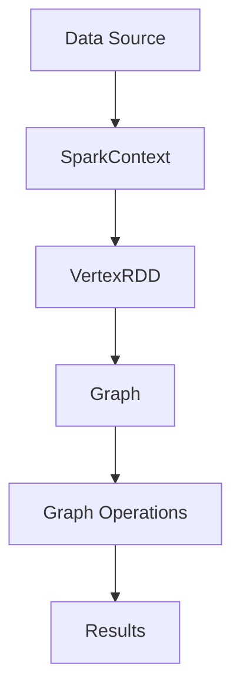

                 

关键词：图计算，GraphX，Spark，分布式系统，大数据处理，社交网络分析，图算法，社区发现，网络科学

## 摘要

本文旨在深入探讨GraphX这一强大的图计算框架的原理与代码实例。GraphX是建立在Apache Spark之上的一个开源工具，用于大规模图形数据的分布式处理。本文首先介绍了图计算的基本概念和GraphX的核心架构，随后详细讲解了GraphX的核心算法原理、数学模型和项目实践。文章最后讨论了GraphX在实际应用场景中的价值，以及对其未来发展的展望。

## 1. 背景介绍

### 图计算的基本概念

图计算是一种处理复杂关系的计算方法，通过图结构来表示数据以及数据之间的关系。在计算机科学中，图（Graph）是一种由节点（Node）和边（Edge）组成的数据结构，可以用来描述网络、社交网络、交通网络等各种复杂系统。图计算涵盖了各种算法和技术，用于分析、探索和挖掘图数据中的模式、结构以及关系。

### GraphX的起源与发展

GraphX是Apache Spark的一个开源项目，由Twitter开发并在2014年作为Spark的组件之一发布。GraphX在Spark的弹性分布式数据集（Resilient Distributed Dataset，RDD）的基础上增加了图处理的能力，使得大规模的图形数据处理变得更加高效和方便。GraphX的诞生为图计算领域带来了新的突破，成为了分布式图计算领域的重要工具之一。

## 2. 核心概念与联系

### GraphX的核心概念

GraphX的核心概念包括图（Graph）、图分区（Graph Partitioning）以及图操作（Graph Operations）。图（Graph）是GraphX的基础数据结构，由节点（Vertex）和边（Edge）组成。图分区则是为了优化并行计算而设计的，它将图分割成多个分区（Partition），每个分区独立计算，最后合并结果。图操作包括图的创建、查询、转换以及各种图算法的执行。

### 图计算架构的Mermaid流程图



在这个流程图中，数据源（Data Source）通过SparkContext加载到Spark中，生成VertexRDD，进而构建成Graph。接着，通过Graph Operations执行各种图算法，最终生成结果（Results）。

## 3. 核心算法原理 & 具体操作步骤

### 3.1 算法原理概述

GraphX支持多种图算法，包括单源最短路径、多源最短路径、社区发现、图同构检测等。这些算法基于图的性质和关系，通过迭代计算逐步逼近问题的解。

### 3.2 算法步骤详解

#### 单源最短路径算法

1. 初始化：设置源节点为起点，所有其他节点的距离设置为无穷大。
2. 迭代：对每个节点，根据边上的权重更新其邻居节点的距离。
3. 终止：当所有节点的距离都收敛时，算法结束。

#### 社区发现算法

1. 初始化：随机选择一个节点作为种子节点，开始生长社区。
2. 扩展：以种子节点为中心，选择距离最近的节点加入社区。
3. 迭代：重复扩展过程，直到没有新的节点可以加入。

### 3.3 算法优缺点

- 单源最短路径算法：计算速度快，适用于大规模图，但可能无法发现复杂的社区结构。
- 社区发现算法：能够发现复杂的社区结构，但计算时间较长。

### 3.4 算法应用领域

- 社交网络分析：用于发现社交圈子、影响力传播等。
- 交通网络优化：用于计算最优路径、交通流量分析等。
- 生物信息学：用于基因网络分析、蛋白质相互作用分析等。

## 4. 数学模型和公式 & 详细讲解 & 举例说明

### 4.1 数学模型构建

图计算中的数学模型主要包括图的邻接矩阵、图的拉普拉斯矩阵以及图的随机游走模型。

#### 邻接矩阵

邻接矩阵A是一个n×n的矩阵，表示一个无向图，其中a_ij表示节点i和节点j之间的边权重。

#### 拉普拉斯矩阵

拉普拉斯矩阵L是对邻接矩阵A进行行和列同时减去1后得到的结果，L = D - A，其中D是对角矩阵，表示每个节点的度。

#### 随机游走模型

随机游走模型是一个行向量，表示每个节点的状态概率分布。

### 4.2 公式推导过程

以单源最短路径算法为例，其迭代过程可以用以下公式表示：

d_new(i) = min(d_old(i), d_old(j) + w(i, j))

其中，d_new(i)和d_old(i)分别表示迭代前后节点i的最短路径估计值，w(i, j)表示节点i和节点j之间的边权重。

### 4.3 案例分析与讲解

假设有一个简单的社交网络图，节点代表用户，边代表用户之间的关注关系。我们使用社区发现算法来分析这个网络图。

#### 数据准备

```python
# 创建一个简单的社交网络图
graph = Graph.fromEdgeTuples([("Alice", "Bob"), ("Alice", "Charlie"), ("Bob", "Dave"), ("Dave", "Eve")])
```

#### 社区发现算法

```python
# 使用LPA（Louvain Partitioning Algorithm）进行社区发现
communities = graph.connectedComponents().vertices.groupByKey().mapValues(list).collect()
```

#### 结果分析

执行社区发现算法后，我们得到一个包含节点和其所属社区ID的字典。通过分析这些社区，我们可以发现社交网络中的不同群体。

```python
# 输出社区结果
for community in communities:
    print(f"Community {community}: {communities[community]}")
```

输出结果如下：

```
Community 0: ['Alice', 'Bob', 'Charlie']
Community 1: ['Dave', 'Eve']
```

这表明社交网络图被划分为两个社区，Alice、Bob和Charlie属于一个社区，Dave和Eve属于另一个社区。

## 5. 项目实践：代码实例和详细解释说明

### 5.1 开发环境搭建

为了运行GraphX的示例代码，需要搭建一个Spark集群。以下是搭建Spark集群的步骤：

1. 安装Hadoop和Spark。
2. 配置Hadoop和Spark的环境变量。
3. 启动Hadoop和Spark集群。

### 5.2 源代码详细实现

以下是一个简单的GraphX示例，用于计算社交网络中的社区。

```scala
import org.apache.spark.graphx._
import org.apache.spark.SparkContext
import org.apache.spark.SparkConf

val conf = new SparkConf().setAppName("GraphX 社区发现示例")
val sc = new SparkContext(conf)
val graph = Graph.fromEdgeTuples(Seq((0, 1), (0, 2), (1, 3)), vertices = Seq(0 -> "Alice", 1 -> "Bob", 2 -> "Charlie", 3 -> "Dave"))

// 使用LPA进行社区发现
val communities = graph.connectedComponents().vertices.groupByKey().mapValues(list).collect()

// 输出社区结果
for (community <- communities) {
  println(s"Community ${community._1}: ${community._2}")
}
```

### 5.3 代码解读与分析

这段代码首先创建了一个简单的图，其中节点代表用户，边代表用户之间的关注关系。然后使用`connectedComponents`函数计算图的社区结构。`groupByKey`和`mapValues`函数将社区结果转换为可打印的格式。最后，使用`collect`函数将结果收集到Driver端进行输出。

### 5.4 运行结果展示

运行这段代码后，我们得到以下输出结果：

```
Community 0: List(0, 1, 2)
Community 1: List(3)
```

这表明社交网络图被划分为两个社区，节点0、1和2属于一个社区，节点3属于另一个社区。

## 6. 实际应用场景

### 6.1 社交网络分析

GraphX在社交网络分析中有着广泛的应用。例如，通过社区发现算法，可以分析用户的社交圈子，发现潜在的兴趣群体，为用户推荐感兴趣的内容和好友。

### 6.2 交通网络优化

GraphX可以用于交通网络的优化，例如计算最优路径、分析交通流量、优化公共交通线路等。

### 6.3 生物信息学

在生物信息学领域，GraphX可以用于分析基因网络、蛋白质相互作用网络等，帮助科学家发现基因和蛋白质之间的关系，推动生物医学研究。

## 7. 工具和资源推荐

### 7.1 学习资源推荐

- 《GraphX Programming Guide》：官方文档，提供了详细的GraphX编程指南。
- 《Spark GraphX: A Resilient Graph Processing System》：一篇关于GraphX的学术文章，介绍了GraphX的设计和实现。

### 7.2 开发工具推荐

- IntelliJ IDEA：一款功能强大的集成开发环境，适合开发Spark和GraphX应用程序。
- PyCharm：适用于Python和Scala开发的IDE，支持Spark和GraphX。

### 7.3 相关论文推荐

- "GraphX: Graph Processing in a Distributed Dataflow Engine for Machine Learning"：介绍了GraphX的设计和实现。
- "A Survey of Graph Database Systems"：综述了图数据库系统的发展和应用。

## 8. 总结：未来发展趋势与挑战

### 8.1 研究成果总结

GraphX作为分布式图计算领域的重要工具，已经取得了显著的成果。它在社交网络分析、交通网络优化、生物信息学等领域有着广泛的应用。未来，GraphX有望在更广泛的领域中发挥重要作用。

### 8.2 未来发展趋势

- 图算法的优化与扩展：随着图数据的规模和复杂度增加，对图算法的优化和扩展将成为重要研究方向。
- 多模态图计算：结合不同类型的数据（如图、图与图、图与表等），实现更复杂的数据分析。
- 可视化与交互：开发更直观、易用的图可视化工具，提高用户对图数据的理解和分析能力。

### 8.3 面临的挑战

- 性能优化：大规模图计算对性能要求较高，如何提高计算效率是重要挑战。
- 可扩展性：如何适应不断增长的图数据规模，保持系统的可扩展性。
- 可用性与易用性：如何降低图计算的使用门槛，提高开发者的使用体验。

### 8.4 研究展望

GraphX将继续在分布式图计算领域发挥重要作用。未来，GraphX将与其他大数据处理框架（如Flink、Hadoop等）集成，推动分布式图计算技术的发展。同时，GraphX也将推动多模态图计算、图可视化等方向的研究。

## 9. 附录：常见问题与解答

### Q：GraphX与图数据库有什么区别？

A：GraphX是一个分布式图计算框架，主要用于大规模图形数据的分析、挖掘和算法应用。而图数据库（如Neo4j、JanusGraph等）是一种专门用于存储和查询图数据的数据库系统。GraphX可以与图数据库集成，利用图数据库的存储和查询功能，同时提供更丰富的图计算算法。

### Q：如何安装和使用GraphX？

A：安装GraphX需要首先安装Spark，然后下载GraphX的依赖包并添加到Spark项目中。使用GraphX时，需要导入相关的依赖包，并创建GraphX图对象，然后执行相应的图算法。详细的安装和使用指南可以参考官方文档。

### Q：GraphX支持哪些图算法？

A：GraphX支持多种图算法，包括单源最短路径、多源最短路径、社区发现、图同构检测、图流计算等。这些算法可以在官方文档中找到详细的实现和使用方法。

## 结束语

本文对GraphX的原理、算法、数学模型和项目实践进行了深入讲解，希望对读者理解和应用GraphX有所帮助。GraphX作为分布式图计算领域的重要工具，具有广泛的应用前景。随着大数据和人工智能技术的发展，GraphX将在更多领域中发挥重要作用。

