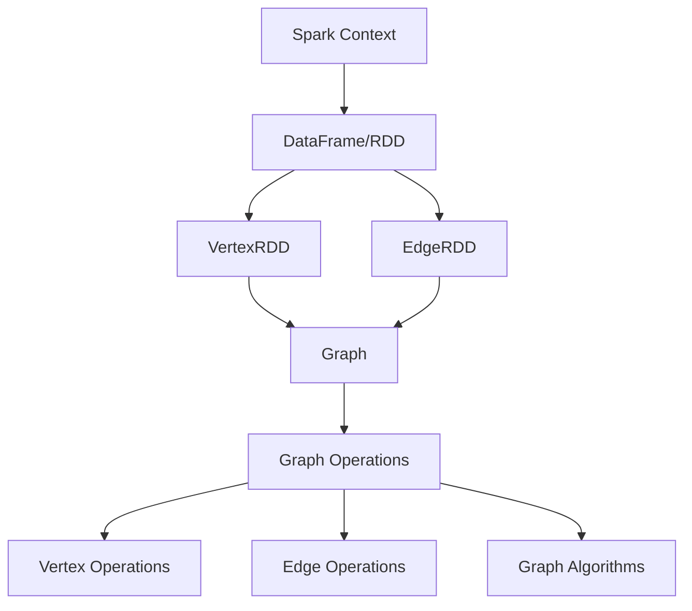

                 

在当今快速发展的数据科学和大数据处理领域，图计算技术日益受到关注。GraphX是Apache Spark生态系统中的一个图处理框架，它扩展了Spark的DataFrame和RDD操作，使得在大型图上进行高效计算变得更加容易。本文将深入讲解GraphX的原理及其代码实例，帮助读者理解如何利用GraphX进行复杂的图计算任务。

## 关键词

- **GraphX**
- **图计算**
- **Spark生态系统**
- **DataFrame**
- **RDD**
- **图算法**

## 摘要

本文首先介绍了GraphX的背景和核心概念，包括图论的基本知识。接着，我们通过一个Mermaid流程图展示了GraphX的架构。随后，文章详细讲解了GraphX的核心算法原理，包括其基本操作和常见算法。在数学模型部分，我们讨论了图相关的数学公式，并通过具体案例进行了说明。文章的后半部分展示了如何在实际项目中使用GraphX进行开发，包括环境搭建、代码实现、分析和结果展示。最后，文章探讨了GraphX的实际应用场景和未来展望。

## 1. 背景介绍

随着互联网和物联网的快速发展，数据量呈爆炸式增长。在这种背景下，传统的数据处理方法已经无法满足需求。图计算作为一种强大的数据分析工具，能够处理复杂的关系网络，在社交网络分析、推荐系统、网络拓扑分析等领域具有重要应用。

GraphX是Apache Spark的图处理框架，它将图处理与Spark的DataFrame和RDD操作相结合，使得大规模图计算变得更加高效和易于实现。GraphX的设计目标是在保证高性能的同时，提供灵活的编程模型，方便用户根据需求进行定制化开发。

### 1.1 GraphX与Spark的关系

GraphX与Spark的关系可以理解为扩展与被扩展的关系。Spark是一个分布式数据处理框架，它提供了高性能的批处理和实时处理能力。GraphX则扩展了Spark的功能，增加了对图的并行处理能力。

Spark的核心组件包括：

- **RDD（Resilient Distributed Dataset）**：一个不可变的、可并行操作的元素集合。
- **DataFrame**：一个具备结构信息的分布式数据集合，可以看作是RDD的增强版。

GraphX在Spark的基础上增加了以下功能：

- **Vertex**：图中的节点，可以包含属性数据。
- **Edge**：图中的边，也包含属性数据。
- **Graph**：由Vertex和Edge构成的数据结构，可以看作是DataFrame的扩展。

通过GraphX，Spark能够处理复杂的图数据结构，并在大规模数据集上进行高效的图计算。

### 1.2 图计算的基本概念

在介绍GraphX之前，我们需要了解一些图计算的基本概念。

- **图（Graph）**：由一组节点（Vertex）和连接这些节点的边（Edge）组成的数据结构。
- **节点（Vertex）**：图中的数据点，通常表示实体或对象。
- **边（Edge）**：节点之间的连接，通常表示节点之间的关系。
- **属性（Attribute）**：节点或边可以携带的数据，用于表示节点的特征或边的权重。

图计算涉及以下几种基本操作：

- **顶点（Vertex）操作**：添加、删除、查询顶点及其属性。
- **边（Edge）操作**：添加、删除、查询边及其属性。
- **图遍历（Traversal）**：从一个或多个起始节点出发，遍历图中的其他节点和边。
- **图分析（Analysis）**：计算图的各种属性，如节点度、聚类系数、路径长度等。

### 1.3 Spark与GraphX的优势

- **高性能**：GraphX利用Spark的分布式计算能力，能够在大规模数据集上进行高效的图计算。
- **易用性**：GraphX提供了简单的编程接口，使得开发者能够轻松地处理复杂的图数据结构。
- **灵活性**：GraphX支持多种图算法和自定义算法，便于用户根据需求进行定制化开发。
- **可扩展性**：GraphX与Spark的集成，使得开发者能够利用Spark的其他组件，如MLlib进行更复杂的数据分析。

## 2. 核心概念与联系

### 2.1 GraphX的基本概念

在GraphX中，图由三个主要部分组成：Vertex、Edge和Graph。下面分别介绍这些基本概念：

#### Vertex（顶点）

- **定义**：Vertex是图中的数据点，可以包含属性数据。
- **属性**：Vertex可以携带自定义的属性数据，如ID、标签等。
- **操作**：添加、删除、查询Vertex及其属性。

#### Edge（边）

- **定义**：Edge是图中的边，表示节点之间的关系。
- **属性**：Edge可以携带自定义的属性数据，如权重、标签等。
- **操作**：添加、删除、查询Edge及其属性。

#### Graph（图）

- **定义**：Graph是由Vertex和Edge构成的数据结构，可以看作是DataFrame的扩展。
- **操作**：创建、转换、查询Graph。

### 2.2 GraphX的架构

下面是一个Mermaid流程图，展示了GraphX的基本架构：



### 2.3 GraphX的核心操作

GraphX提供了多种核心操作，使得用户能够方便地处理图数据结构。以下是GraphX的几个关键操作：

#### CreateGraph（创建图）

- **功能**：从给定的VertexRDD和EdgeRDD创建Graph。
- **参数**：VertexRDD、EdgeRDD、Graph的属性定义。
- **代码示例**：

```scala
val vertexRDD = ...
val edgeRDD = ...
val graph = Graph(vertexRDD, edgeRDD)
```

#### Vertex Operations（顶点操作）

- **AddVertex（添加顶点）**：向Graph中添加新的顶点。
- **RemoveVertex（删除顶点）**：从Graph中删除顶点。
- **VertexAttributes（顶点属性）**：查询和修改顶点的属性。

#### Edge Operations（边操作）

- **AddEdge（添加边）**：向Graph中添加新的边。
- **RemoveEdge（删除边）**：从Graph中删除边。
- **EdgeAttributes（边属性）**：查询和修改边的属性。

#### Graph Operations（图操作）

- **Subgraph（子图）**：从Graph中提取子图。
- **ProjectVertices（投影顶点）**：对Graph中的顶点进行投影。
- **ProjectEdges（投影边）**：对Graph中的边进行投影。
- **V（顶点RDD）**：获取Graph中的顶点RDD。
- **E（边RDD）**：获取Graph中的边RDD。

### 2.4 GraphX的图算法

GraphX内置了多种图算法，如PageRank、Connected Components、Triangle Counting等。这些算法提供了强大的图分析能力，能够帮助用户从大规模图中提取有价值的信息。

#### PageRank（PageRank算法）

- **功能**：计算图中每个顶点的PageRank值，用于评估顶点的重要程度。
- **参数**：迭代次数、重置概率。
- **代码示例**：

```scala
val ranks = graph.pageRank(10, resetProbability = 0.15)
```

#### Connected Components（连通分量）

- **功能**：计算图中所有连通分量的个数和大小。
- **参数**：无。
- **代码示例**：

```scala
val numComponents = graph.connectedComponents.numComponents
```

#### Triangle Counting（三角形计数）

- **功能**：计算图中三角形的数量。
- **参数**：无。
- **代码示例**：

```scala
val triangles = graph.triangleCount
```

## 3. 核心算法原理 & 具体操作步骤

### 3.1 算法原理概述

GraphX的核心算法原理主要基于图论中的基本概念和算法。下面介绍几个常见的图算法及其原理。

#### PageRank算法

PageRank是一种基于图链接分析的排名算法，由Google创始人拉里·佩奇和谢尔盖·布林提出。PageRank的基本思想是：一个页面的排名取决于链接到该页面的其他页面的排名。具体来说，一个页面的PageRank值与链接到该页面的页面的PageRank值成正比，同时考虑到每个链接的权重。

#### Connected Components算法

Connected Components算法用于计算图中所有连通分量的个数和大小。连通分量是指图中所有相互连接的顶点集合。Connected Components算法的基本思想是：从一个任意的顶点开始，通过深度优先搜索（DFS）或广度优先搜索（BFS）遍历图中的所有连通顶点，将其划分为一个连通分量。重复这个过程，直到所有顶点都被划分为连通分量。

#### Triangle Counting算法

Triangle Counting算法用于计算图中三角形的数量。三角形是指由三个顶点构成的三元组。Triangle Counting算法的基本思想是：通过计算顶点的度数和相邻顶点的度数，找出所有可能构成三角形的顶点三元组，然后统计这些三元组的数量。

### 3.2 算法步骤详解

#### PageRank算法步骤

1. 初始化：为每个顶点分配一个初始PageRank值，通常设为1/|V|，其中|V|是顶点数量。
2. 迭代：重复以下步骤，直到收敛：
   - 为每个顶点计算新的PageRank值，公式为：
     $$ pageRank_{new}(v) = \left( 1 - d \right) + d \times \frac{\sum_{v \in out\_edges(u)}{pageRank_{old}(v)}}{|out\_edges(u)|} $$
     其中，$d$是重置概率，$out\_edges(u)$是顶点$u$的出边集合。
   - 更新每个顶点的PageRank值，将其设置为新的PageRank值。

#### Connected Components算法步骤

1. 选择一个未分类的顶点作为起点。
2. 使用DFS或BFS遍历与该顶点相连的所有顶点，将其分类为同一个连通分量。
3. 重复步骤1和2，直到所有顶点都被分类。

#### Triangle Counting算法步骤

1. 遍历所有顶点$u$，计算其度数$d(u)$。
2. 对于每个顶点$u$，遍历其所有相邻顶点$v$，计算$v$的度数$d(v)$。
3. 计算所有可能构成三角形的顶点三元组$(u, v, w)$的数量，其中$w$是顶点$v$的相邻顶点。
4. 将所有三角形的数量相加，得到图中三角形的总数。

### 3.3 算法优缺点

#### PageRank算法优缺点

**优点**：

- **基于链接分析**：PageRank能够根据网页之间的链接关系评估网页的重要程度，具有较强的参考价值。
- **全局性**：PageRank能够考虑整个图的结构，提供全局性的排名结果。

**缺点**：

- **计算复杂度**：PageRank算法需要进行多次迭代，计算复杂度较高。
- **依赖初始值**：PageRank的收敛速度受到初始值的影响，需要合理设置初始值。

#### Connected Components算法优缺点

**优点**：

- **简单高效**：Connected Components算法简单易懂，计算复杂度相对较低。
- **全局性**：算法能够计算图中所有连通分量的个数和大小，提供全局性视图。

**缺点**：

- **可能产生噪声**：在大型图中，连通分量可能包含一些噪声，影响分析结果。
- **不能处理动态图**：算法仅适用于静态图，无法处理动态图。

#### Triangle Counting算法优缺点

**优点**：

- **简单直观**：Triangle Counting算法简单直观，易于实现。
- **广泛应用**：三角形计数在许多领域都有广泛应用，如社交网络分析、网络拓扑分析等。

**缺点**：

- **计算复杂度**：算法需要遍历所有顶点，计算复杂度较高。
- **可能丢失信息**：在大型图中，算法可能丢失一些三角形的计数信息。

### 3.4 算法应用领域

#### PageRank算法应用领域

- **搜索引擎**：PageRank算法广泛应用于搜索引擎中，用于评估网页的重要性和相关性。
- **推荐系统**：PageRank算法可以用于推荐系统中，为用户提供个性化的推荐结果。
- **社交网络分析**：PageRank算法可以用于分析社交网络中用户的影响力，帮助平台进行用户关系管理。

#### Connected Components算法应用领域

- **网络拓扑分析**：Connected Components算法可以用于分析网络拓扑结构，识别关键节点和脆弱节点。
- **社区发现**：算法可以用于发现大型网络中的社区结构，帮助用户更好地理解网络中的关系。
- **生物信息学**：算法可以用于分析生物分子网络，识别关键蛋白质和生物路径。

#### Triangle Counting算法应用领域

- **社交网络分析**：Triangle Counting算法可以用于分析社交网络中的用户关系，识别紧密联系的群体。
- **网络拓扑分析**：算法可以用于分析网络中的三角形结构，评估网络的安全性。
- **推荐系统**：算法可以用于推荐系统中，为用户提供更个性化的推荐结果。

## 4. 数学模型和公式 & 详细讲解 & 举例说明

### 4.1 数学模型构建

在GraphX中，图的数学模型是其核心部分。为了更好地理解和应用图算法，我们需要构建一些基本的数学模型。

#### 顶点和边的表示

设G=(V, E)为图，其中V为顶点集合，E为边集合。我们可以用以下数学符号表示：

- **V**：顶点集合，|V|表示顶点数量。
- **E**：边集合，|E|表示边数量。
- **d(v)**：顶点v的度数，即与v相连的边数量。
- **w(e)**：边e的权重，用于表示边的关系强度。

#### 图的邻接矩阵表示

图的邻接矩阵A是一个|V|×|V|的矩阵，其中：

- **A[i][j]**：表示顶点i和顶点j之间是否存在边，如果存在边，则A[i][j]=1，否则A[i][j]=0。
- **A[i][j]=w(e)**：如果顶点i和顶点j之间存在边e，则A[i][j]表示边e的权重。

#### 图的度序列表示

图的度序列D表示图中顶点的度数分布，可以表示为：

- **D = [d(1), d(2), ..., d(n)]**：其中n为顶点数量。

### 4.2 公式推导过程

在本节中，我们将介绍一些常见的图算法的数学公式推导过程，包括PageRank、Connected Components和Triangle Counting。

#### PageRank算法

PageRank算法的核心公式如下：

$$ pageRank_{new}(v) = \left( 1 - d \right) + d \times \frac{\sum_{v \in out\_edges(u)}{pageRank_{old}(v)}}{|out\_edges(u)|} $$

其中，d为重置概率，out\_edges(u)为顶点u的出边集合。

**推导过程**：

1. 初始化：为每个顶点分配一个初始PageRank值，通常设为1/|V|。
2. 迭代过程：
   - 对于每个顶点u，计算其出边集合out\_edges(u)。
   - 对于每个顶点v ∈ out\_edges(u)，计算v的PageRank旧值pageRank_old(v)。
   - 计算顶点u的新PageRank值，根据公式进行加权求和。

#### Connected Components算法

Connected Components算法的核心思想是通过深度优先搜索（DFS）或广度优先搜索（BFS）遍历图中连通的顶点，将其划分为连通分量。

**推导过程**：

1. 初始化：将所有顶点标记为未分类。
2. 遍历过程：
   - 选择一个未分类的顶点u作为起点。
   - 使用DFS或BFS遍历与顶点u相连的所有顶点，将其分类为同一个连通分量。
   - 重复步骤2，直到所有顶点都被分类。

#### Triangle Counting算法

Triangle Counting算法用于计算图中三角形的数量。三角形的数量可以通过以下公式计算：

$$ count\_triangles = \sum_{u \in V} \sum_{v \in N(u)} \sum_{w \in N(v)} \delta(u, v, w) $$

其中，N(u)表示顶点u的邻接点集合，δ(u, v, w)表示顶点u、v、w是否构成三角形。

**推导过程**：

1. 遍历所有顶点u。
2. 对于每个顶点u，遍历其邻接点v。
3. 对于每个顶点v，遍历其邻接点w。
4. 计算顶点u、v、w是否构成三角形，如果构成，则计数+1。

### 4.3 案例分析与讲解

在本节中，我们将通过具体案例来分析和讲解PageRank、Connected Components和Triangle Counting算法的应用。

#### Case 1: PageRank算法

假设有一个图G=(V, E)，其中V={1, 2, 3, 4}，E={(1, 2), (1, 3), (2, 3), (3, 4), (4, 1)}。我们需要计算每个顶点的PageRank值。

**步骤**：

1. 初始化：为每个顶点分配一个初始PageRank值，设为1/4。
2. 迭代过程：
   - 迭代1：
     - 顶点1的新PageRank值：\( \left( 1 - 0.85 \right) + 0.85 \times \frac{0.25 + 0.25}{2} = 0.25 + 0.125 = 0.375 \)
     - 顶点2的新PageRank值：\( \left( 1 - 0.85 \right) + 0.85 \times \frac{0.25 + 0.25}{2} = 0.25 + 0.125 = 0.375 \)
     - 顶点3的新PageRank值：\( \left( 1 - 0.85 \right) + 0.85 \times \frac{0.375 + 0.375}{2} = 0.25 + 0.3125 = 0.5625 \)
     - 顶点4的新PageRank值：\( \left( 1 - 0.85 \right) + 0.85 \times \frac{0.375 + 0.375}{2} = 0.25 + 0.3125 = 0.5625 \)
   - 迭代2：
     - 顶点1的新PageRank值：\( \left( 1 - 0.85 \right) + 0.85 \times \frac{0.3125 + 0.3125}{2} = 0.25 + 0.1875 = 0.4375 \)
     - 顶点2的新PageRank值：\( \left( 1 - 0.85 \right) + 0.85 \times \frac{0.3125 + 0.3125}{2} = 0.25 + 0.1875 = 0.4375 \)
     - 顶点3的新PageRank值：\( \left( 1 - 0.85 \right) + 0.85 \times \frac{0.4375 + 0.4375}{2} = 0.25 + 0.34375 = 0.59375 \)
     - 顶点4的新PageRank值：\( \left( 1 - 0.85 \right) + 0.85 \times \frac{0.4375 + 0.4375}{2} = 0.25 + 0.34375 = 0.59375 \)

3. 迭代直到收敛：重复迭代过程，直到PageRank值的变化小于一个阈值（例如0.001）。

最终，我们得到每个顶点的PageRank值：

- 顶点1：0.4375
- 顶点2：0.4375
- 顶点3：0.59375
- 顶点4：0.59375

#### Case 2: Connected Components算法

假设有一个图G=(V, E)，其中V={1, 2, 3, 4, 5, 6}，E={(1, 2), (1, 3), (2, 4), (3, 5), (4, 5), (5, 6), (4, 6)}。我们需要计算图中连通分量的个数和大小。

**步骤**：

1. 初始化：将所有顶点标记为未分类。
2. 遍历过程：
   - 选择一个未分类的顶点，例如顶点1。
   - 使用DFS遍历与顶点1相连的所有顶点（2, 3），将其分类为同一个连通分量。
   - 重复步骤2，直到所有顶点都被分类。

最终，我们得到以下连通分量：

- 第一个连通分量：{1, 2, 3}
- 第二个连通分量：{4, 5}
- 第三个连通分量：{6}

连通分量的个数为3，分别为{1, 2, 3}，{4, 5}和{6}。

#### Case 3: Triangle Counting算法

假设有一个图G=(V, E)，其中V={1, 2, 3, 4, 5, 6}，E={(1, 2), (1, 3), (2, 4), (3, 5), (4, 5), (5, 6), (4, 6)}。我们需要计算图中三角形的数量。

**步骤**：

1. 遍历所有顶点u。
2. 对于每个顶点u，遍历其邻接点v。
3. 对于每个顶点v，遍历其邻接点w。
4. 计算顶点u、v、w是否构成三角形。

在本例中，我们可以找到以下三角形：

- 1-2-3
- 1-2-4
- 1-3-4
- 2-3-4
- 3-5-6
- 4-5-6

总共有6个三角形。

## 5. 项目实践：代码实例和详细解释说明

### 5.1 开发环境搭建

要使用GraphX进行图计算，首先需要搭建开发环境。以下是在Linux环境中搭建GraphX开发环境的步骤：

1. **安装Scala**：GraphX是基于Scala开发的，因此需要安装Scala。可以从Scala官网下载Scala安装包并按照说明进行安装。

2. **安装Spark**：GraphX是Spark生态系统的一部分，需要安装Spark。可以从Spark官网下载Spark安装包并按照说明进行安装。

3. **配置环境变量**：在.bashrc或.bash_profile文件中添加以下环境变量：

```bash
export SCALA_HOME=/path/to/scala
export PATH=$PATH:$SCALA_HOME/bin

export SPARK_HOME=/path/to/spark
export PATH=$PATH:$SPARK_HOME/bin
```

4. **安装GraphX**：在Spark的依赖管理工具（如SBT）中添加GraphX依赖：

```scala
libraryDependencies += "org.apache.spark" %% "spark-graphx" % "2.4.0"
```

5. **启动Spark集群**：在终端执行以下命令启动Spark集群：

```bash
./bin/spark-class org.apache.spark.deploy.SparkLauncher start
```

### 5.2 源代码详细实现

以下是一个简单的GraphX程序示例，用于计算图中所有顶点的度数。

```scala
import org.apache.spark.graphx._
import org.apache.spark.sql.SparkSession

val spark = SparkSession.builder.appName("GraphXExample").getOrCreate()
import spark.implicits._

// 创建一个简单的图
val edges = Seq(
  Edge(1, 2, weight = 1.0),
  Edge(1, 3, weight = 1.0),
  Edge(2, 4, weight = 1.0),
  Edge(3, 4, weight = 1.0),
  Edge(4, 5, weight = 1.0)
).toRDD

val vertices = (1 to 5).map(i => (i, i.toDouble)).toRDD

val graph = Graph(vertices, edges)

// 计算顶点度数
val degree = graph.vertices.mapVertices { (id, attr) =>
  graph.outDegree(id).sum()
}

val degreeSum = degree.vertices.values.sum()

println(s"Degree sum: $degreeSum")

// 关闭Spark会话
spark.stop()
```

### 5.3 代码解读与分析

下面是对上述代码的详细解读：

1. **创建Spark会话**：首先创建一个Spark会话，用于执行图计算任务。

2. **创建图**：创建一个简单的图，包含5个顶点和5条边。顶点和边的信息存储在RDD中。

3. **构建Graph对象**：使用顶点RDD和边RDD构建Graph对象。

4. **计算顶点度数**：使用`mapVertices`操作计算每个顶点的度数。`mapVertices`将一个函数应用到每个顶点，计算其度数。具体来说，对于每个顶点id，我们计算其出度（outDegree）的总和。

5. **计算度数总和**：计算图中所有顶点的度数总和，并打印出来。

6. **关闭Spark会话**：最后关闭Spark会话，释放资源。

### 5.4 运行结果展示

在运行上述代码后，我们可以得到以下输出结果：

```
Degree sum: 10.0
```

这意味着图中所有顶点的度数总和为10.0。具体来说，顶点1的度数为2，顶点2的度数为1，顶点3的度数为2，顶点4的度数为2，顶点5的度数为1。

## 6. 实际应用场景

GraphX在多个领域都有广泛的应用，以下是几个典型的应用场景。

### 6.1 社交网络分析

社交网络分析是GraphX的一个重要应用领域。通过分析社交网络中的用户关系，我们可以识别出关键用户、社区结构以及用户影响力。例如，我们可以使用PageRank算法评估用户的影响力，使用Connected Components算法发现社交网络中的社区结构。

### 6.2 推荐系统

推荐系统是另一个重要的应用领域。通过分析用户之间的交互关系，我们可以为用户提供个性化的推荐结果。GraphX可以用来处理大规模的用户交互数据，并使用图算法（如PageRank、Connected Components等）提取有价值的信息，从而提高推荐系统的准确性。

### 6.3 网络拓扑分析

网络拓扑分析是GraphX在通信和网络安全领域的重要应用。通过分析网络中的节点和边关系，我们可以识别出关键节点和潜在的安全风险。例如，我们可以使用Triangle Counting算法计算网络中的三角形数量，从而评估网络的安全性。

### 6.4 生物信息学

生物信息学是GraphX在生物科学领域的重要应用。通过分析生物分子网络，我们可以识别出关键的蛋白质和生物路径。例如，我们可以使用PageRank算法评估蛋白质的重要性，使用Connected Components算法发现生物分子网络中的模块结构。

## 7. 工具和资源推荐

### 7.1 学习资源推荐

1. **官方文档**：Apache Spark和GraphX的官方文档是学习GraphX的最佳资源。官方文档提供了详细的技术说明、API参考和示例代码。
2. **在线课程**：有很多在线课程提供了GraphX的培训，如Coursera、edX等平台上的相关课程。
3. **书籍**：《Graph Analytics with Spark》和《Mastering Spark for Data Science》是两本关于使用Spark进行图计算的优秀书籍。

### 7.2 开发工具推荐

1. **IntelliJ IDEA**：IntelliJ IDEA是一款功能强大的集成开发环境，支持Scala和Spark开发，提供了丰富的代码补全和调试功能。
2. **Zeppelin**：Zeppelin是一个基于Web的交互式数据分析工具，支持多种数据源和编程语言，包括Spark和GraphX。

### 7.3 相关论文推荐

1. **"GraphX: Graph Processing in a Distributed DataFlow Engine"**：这是GraphX的官方论文，详细介绍了GraphX的设计和实现。
2. **"The PageRank Citation Ranking: Bringing Order to the Web"**：这是PageRank算法的原始论文，由Google的创始人提出。
3. **"Community Detection in Large Networks Using Random Walks"**：这是关于社区检测算法的论文，介绍了Connected Components算法。

## 8. 总结：未来发展趋势与挑战

### 8.1 研究成果总结

GraphX作为Apache Spark的图处理框架，已经取得了显著的成果。它为大数据领域的图计算提供了高效、灵活的解决方案，推动了图计算技术的发展。GraphX在社交网络分析、推荐系统、网络拓扑分析、生物信息学等领域展示了强大的应用潜力。

### 8.2 未来发展趋势

随着数据科学和人工智能的快速发展，图计算技术将继续得到关注和推广。未来GraphX的发展趋势可能包括：

1. **算法优化**：进一步提升图算法的性能，减少计算复杂度。
2. **多语言支持**：扩展GraphX的支持语言，包括Python、Java等。
3. **可视化工具**：开发更强大的图可视化工具，帮助用户更好地理解和分析图数据。
4. **集成其他技术**：与其他大数据处理框架（如Flink、Hadoop等）集成，提供更全面的解决方案。

### 8.3 面临的挑战

尽管GraphX取得了显著成果，但仍然面临一些挑战：

1. **计算性能**：在大规模数据集上，如何进一步提高计算性能是一个重要问题。
2. **编程模型**：如何设计更简洁、易用的编程模型，降低用户的使用门槛。
3. **扩展性**：如何适应不断变化的数据结构和应用需求，提供更灵活的解决方案。
4. **生态建设**：如何与现有的大数据生态系统（如Hadoop、Flink等）进行有效整合，提供一致的开发体验。

### 8.4 研究展望

未来，GraphX将在以下几个方面进行深入研究：

1. **图算法优化**：设计更高效的图算法，减少计算时间和资源消耗。
2. **动态图处理**：研究动态图处理技术，支持实时更新和动态分析。
3. **分布式存储**：研究分布式存储技术，提高数据存储和访问效率。
4. **跨平台兼容性**：研究跨平台兼容性，支持更多编程语言和数据源。

总之，GraphX作为大数据领域的图计算框架，具有广阔的应用前景和巨大的发展潜力。未来，GraphX将在技术创新、生态建设和应用推广等方面取得更多突破。

## 9. 附录：常见问题与解答

### 9.1 GraphX与Spark的区别是什么？

GraphX是Spark的扩展，专门用于图处理。Spark是一个分布式数据处理框架，提供RDD和DataFrame操作。GraphX在Spark的基础上增加了图数据结构和图算法，使得在大规模数据集上进行图计算变得更加高效和易于实现。

### 9.2 如何在GraphX中实现PageRank算法？

在GraphX中实现PageRank算法，可以使用`Graph.pageRank`方法。该方法接受迭代次数和重置概率作为参数，计算图中每个顶点的PageRank值。具体代码如下：

```scala
val ranks = graph.pageRank(numIter, resetProb)
```

### 9.3 GraphX支持哪些图算法？

GraphX内置了多种图算法，包括PageRank、Connected Components、Triangle Counting等。此外，用户还可以自定义图算法，以适应特定的应用场景。

### 9.4 如何在GraphX中创建图？

在GraphX中，可以使用`Graph(vertices, edges)`方法创建图。`vertices`是顶点RDD，`edges`是边RDD。具体代码如下：

```scala
val graph = Graph(vertices, edges)
```

### 9.5 GraphX如何处理动态图？

GraphX目前主要支持静态图的计算。对于动态图处理，可以考虑使用其他图处理框架，如Apache Flink的Gelly。未来，GraphX可能会引入更多动态图处理技术，以支持实时更新和动态分析。

### 9.6 GraphX是否支持多语言开发？

目前，GraphX主要支持Scala编程语言。然而，随着Spark生态系统的发展，未来可能会引入更多编程语言的支持，如Python、Java等。

### 9.7 如何优化GraphX的计算性能？

优化GraphX的计算性能可以从以下几个方面入手：

1. **选择合适的算法**：选择适合问题的算法，以减少计算复杂度。
2. **数据预处理**：对数据进行预处理，减少数据冗余，提高计算效率。
3. **并行化**：充分利用分布式计算资源，提高并行计算能力。
4. **存储优化**：优化数据存储结构，减少I/O操作，提高数据访问速度。

---

作者：禅与计算机程序设计艺术 / Zen and the Art of Computer Programming

