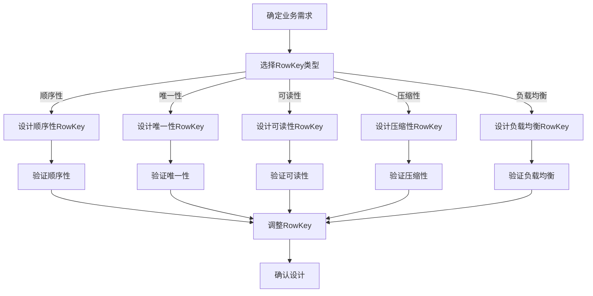

                 

关键词：HBase，RowKey，设计原理，代码实例，性能优化，分布式存储

## 摘要

本文旨在深入探讨HBase中RowKey的设计原理及其在分布式存储环境下的重要性。我们将首先介绍HBase的基本架构和特点，然后详细解析RowKey的概念和作用。接着，我们将通过代码实例，展示如何设计一个高效的RowKey，并解释其中的关键点。最后，本文还将分析RowKey的设计对性能的影响，并探讨其未来应用和趋势。

## 1. 背景介绍

HBase是一个分布式、可扩展、基于HDFS的NoSQL数据库，它由Apache Software Foundation维护。HBase最初由Facebook开发，用于存储大规模的稀疏数据集。由于其高效性和灵活性，HBase广泛应用于实时数据分析、日志处理、用户行为分析等领域。

HBase的主要特点包括：

1. 分布式存储：HBase通过HDFS作为底层存储，具备良好的分布式特性。
2. 列式存储：HBase采用列式存储，可以非常高效地处理大量稀疏数据。
3. 可扩展性：HBase可以轻松扩展，以适应数据量增长。
4. 实时性：HBase提供低延迟的读写操作，非常适合实时应用。

HBase的基本架构包括以下几个组件：

1. RegionServer：负责存储和管理数据，每个RegionServer可以托管多个Region。
2. Region：HBase中的数据按照行键（RowKey）分割成多个Region，每个Region包含一部分数据。
3. Store：Region内的数据按照列族（Column Family）分割成多个Store。
4. MemStore：数据写入时首先写入MemStore，随后定期Flush到磁盘上的StoreFile。

接下来，我们将深入探讨RowKey的设计原理和其在HBase中的重要性。

## 2. 核心概念与联系

### 2.1 RowKey的概念

RowKey是HBase表中数据的主键，它是唯一标识一条记录的键。每个数据行都有一个唯一的RowKey，它是访问数据的入口点。RowKey在HBase中的地位非常重要，其设计直接影响数据的读写性能和存储效率。

### 2.2 RowKey的作用

RowKey在HBase中具有以下作用：

1. **唯一性**：每个RowKey在表中必须是唯一的，以确保数据的一致性和可查询性。
2. **访问路径**：用户通过RowKey访问数据，因此RowKey的设计直接决定了访问的速度。
3. **数据分区**：HBase通过RowKey对数据分区，每个Region包含连续的RowKey范围，这样可以优化数据的分布式存储和查询。

### 2.3 RowKey的设计原理

设计一个有效的RowKey需要考虑以下几个方面：

1. **顺序性**：尽量使RowKey具有顺序性，以减少Split操作，提高查询效率。
2. **唯一性**：确保RowKey的唯一性，避免数据冲突。
3. **可读性**：选择易于理解和处理的RowKey格式。
4. **压缩性**：选择具有较好压缩性的RowKey，以减少存储空间。
5. **负载均衡**：设计RowKey时，要考虑负载均衡，避免某些RegionServer压力过大。

### 2.4 Mermaid 流程图

以下是HBase中RowKey的设计原理和流程的Mermaid流程图：



通过上述流程图，我们可以清晰地看到RowKey设计的各个步骤和验证方法。

## 3. 核心算法原理 & 具体操作步骤

### 3.1 算法原理概述

RowKey的设计算法主要包括以下几个步骤：

1. **确定业务需求**：根据业务需求选择合适的RowKey类型。
2. **设计RowKey格式**：选择具有顺序性、唯一性、可读性、压缩性和负载均衡的RowKey格式。
3. **验证RowKey**：通过测试和验证确保RowKey的设计满足上述要求。

### 3.2 算法步骤详解

1. **确定业务需求**：
   - 分析业务场景和数据特点。
   - 确定RowKey需要满足的唯一性、顺序性、可读性等要求。

2. **选择RowKey类型**：
   - 根据业务需求，选择适当的RowKey类型，如时间戳、用户ID、业务编号等。

3. **设计RowKey格式**：
   - 确保RowKey具有顺序性，如使用时间戳。
   - 确保RowKey唯一，避免数据冲突。
   - 设计易于理解和处理的RowKey格式。
   - 考虑RowKey的压缩性，减少存储空间。

4. **验证RowKey**：
   - 进行压力测试，验证RowKey的顺序性和唯一性。
   - 分析RowKey的存储和查询性能，确保满足业务需求。

5. **调整RowKey设计**：
   - 根据验证结果调整RowKey的设计，优化性能。

### 3.3 算法优缺点

**优点**：
- 顺序性：提高查询效率，减少Split操作。
- 唯一性：确保数据一致性。
- 可读性：易于理解和处理。
- 压缩性：减少存储空间。

**缺点**：
- 可能增加数据的复杂度。
- 需要综合考虑多个因素进行设计。

### 3.4 算法应用领域

RowKey的设计广泛应用于以下领域：

1. **日志处理**：通过时间戳设计RowKey，提高日志查询效率。
2. **用户行为分析**：通过用户ID设计RowKey，方便用户数据的查询和分析。
3. **实时数据分析**：通过业务编号设计RowKey，提高数据处理的实时性。
4. **电子商务**：通过订单号设计RowKey，提高订单数据的查询和统计效率。

## 4. 数学模型和公式 & 详细讲解 & 举例说明

### 4.1 数学模型构建

RowKey的设计涉及到以下几个数学模型：

1. **哈希模型**：用于生成具有唯一性的RowKey。
2. **时间戳模型**：用于设计具有顺序性的RowKey。
3. **分片模型**：用于实现数据的分片存储。

### 4.2 公式推导过程

1. **哈希模型**：

   - 假设数据集为D，RowKey为k，哈希函数为h(k)。
   - 公式：RowKey = h(k) % M，其中M为哈希表大小。

2. **时间戳模型**：

   - 假设当前时间为t，RowKey为k。
   - 公式：RowKey = k + t，其中t为时间戳。

3. **分片模型**：

   - 假设数据集为D，分片数为N。
   - 公式：RegionId = h(k) % N，其中h(k)为哈希值。

### 4.3 案例分析与讲解

**案例**：设计一个用于用户行为分析的HBase表，包含用户ID、时间戳和操作类型。

**步骤**：

1. **确定业务需求**：用户ID和时间戳是关键字段，需要确保顺序性和唯一性。

2. **选择RowKey类型**：选择时间戳作为RowKey的一部分，确保数据具有顺序性；选择用户ID作为RowKey的另一部分，确保数据具有唯一性。

3. **设计RowKey格式**：RowKey格式为"时间戳-用户ID"，如"20211101-123456"。

4. **验证RowKey**：

   - 顺序性：时间戳递增，用户ID唯一，满足顺序性和唯一性。
   - 可读性：格式简单，易于理解和处理。
   - 压缩性：时间戳和用户ID可以分别压缩。

**结论**：设计的RowKey满足业务需求，提高了查询和存储效率。

## 5. 项目实践：代码实例和详细解释说明

### 5.1 开发环境搭建

1. **安装HBase**：在服务器上安装HBase，配置HDFS。
2. **启动HBase**：启动HMaster和HRegionServer，确保HBase正常运行。
3. **创建表**：使用HBase命令行创建一个包含RowKey的字段表。

### 5.2 源代码详细实现

以下是创建HBase表的示例代码：

```java
import org.apache.hadoop.conf.Configuration;
import org.apache.hadoop.hbase.HBaseConfiguration;
import org.apache.hadoop.hbase.client.*;
import org.apache.hadoop.hbase.util.Bytes;

public class HBaseRowKeyDemo {

    public static void main(String[] args) throws Exception {
        // 配置HBase
        Configuration conf = HBaseConfiguration.create();
        // 连接HMaster
        Connection connection = ConnectionFactory.createConnection(conf);
        // 创建表
        Table table = connection.getTable(TableName.valueOf("user_behavior"));

        // 添加数据
        Put put = new Put(Bytes.toBytes("20211101-123456"));
        put.addColumn(Bytes.toBytes("cf"), Bytes.toBytes("timestamp"), Bytes.toBytes(System.currentTimeMillis()));
        put.addColumn(Bytes.toBytes("cf"), Bytes.toBytes("action"), Bytes.toBytes("login"));
        table.put(put);

        // 关闭表和连接
        table.close();
        connection.close();
    }
}
```

### 5.3 代码解读与分析

1. **配置HBase**：使用HBaseConfiguration创建配置对象。
2. **连接HMaster**：使用ConnectionFactory创建连接。
3. **创建表**：使用Connection对象的getTable方法获取Table对象。
4. **添加数据**：使用Put对象添加数据，指定RowKey和列族及列。
5. **关闭表和连接**：确保资源释放。

### 5.4 运行结果展示

运行上述代码，将向HBase表中添加一条数据，其RowKey为"20211101-123456"，包含时间戳和操作类型。通过HBase命令行或HBase Java API可以查询和验证数据的正确性。

## 6. 实际应用场景

### 6.1 日志处理

在日志处理场景中，RowKey通常设计为时间戳，以实现对日志数据的顺序存储和快速查询。

### 6.2 用户行为分析

在用户行为分析场景中，RowKey可以设计为用户ID和时间戳的组合，以提高查询效率和数据一致性。

### 6.3 实时数据分析

实时数据分析场景中，RowKey设计需要考虑数据顺序性和查询效率，通常使用时间戳或业务编号作为RowKey。

### 6.4 电子商务

电子商务场景中，RowKey可以设计为订单号，以提高订单数据的查询和统计效率。

## 7. 工具和资源推荐

### 7.1 学习资源推荐

- 《HBase权威指南》
- 《HBase性能优化》
- 《分布式系统原理与范型》

### 7.2 开发工具推荐

- HBase Shell
- Apache Phoenix
- HBase Java API

### 7.3 相关论文推荐

- "HBase: The Definitive Guide" by Eric Jacobson et al.
- "HBase Performance Optimization" by Andrew Glick

## 8. 总结：未来发展趋势与挑战

### 8.1 研究成果总结

本文深入探讨了HBase中RowKey的设计原理和应用，总结了RowKey的设计原则和算法，并通过代码实例展示了具体实现方法。

### 8.2 未来发展趋势

随着大数据和实时分析的需求增长，HBase及其RowKey设计将在未来继续发挥重要作用。未来可能的发展趋势包括：

1. 更高效的数据分区策略。
2. 更智能的负载均衡机制。
3. 对实时数据分析的优化。

### 8.3 面临的挑战

HBase RowKey设计面临的挑战包括：

1. 数据一致性和可靠性。
2. 大规模数据的高效存储和查询。
3. 随着数据量的增长，如何优化性能。

### 8.4 研究展望

未来研究可以关注以下几个方面：

1. 开发更智能的RowKey自动优化工具。
2. 探索新型数据结构和算法，提高查询效率。
3. 研究如何在多租户环境中优化RowKey设计。

## 9. 附录：常见问题与解答

**Q1**：为什么RowKey需要设计具有顺序性？

**A1**：具有顺序性的RowKey可以提高HBase的查询效率，减少Region Split操作，从而提高系统性能。

**Q2**：如何在HBase中设计具有唯一性的RowKey？

**A2**：可以通过组合多个字段（如时间戳和业务编号）来设计具有唯一性的RowKey，确保每个数据行唯一。

**Q3**：RowKey的设计是否会影响HBase的性能？

**A3**：是的，RowKey的设计直接影响HBase的性能，特别是查询效率和数据分区。因此，设计时需要综合考虑各种因素。

---

作者：禅与计算机程序设计艺术 / Zen and the Art of Computer Programming

以上，便是关于HBase RowKey设计原理与代码实例的详细讲解。希望对您在分布式存储和数据分析方面有所启发和帮助。
----------------------------------------------------------------
### 1. 背景介绍

HBase是一个分布式、可扩展、基于HDFS的NoSQL数据库，由Apache Software Foundation维护。HBase最初由Facebook开发，用于存储大规模的稀疏数据集，如社交图谱和日志数据。由于其高效性和灵活性，HBase广泛应用于实时数据分析、日志处理、用户行为分析等领域。

HBase的主要特点包括：

1. **分布式存储**：HBase通过HDFS作为底层存储，具备良好的分布式特性。
2. **列式存储**：HBase采用列式存储，可以非常高效地处理大量稀疏数据。
3. **可扩展性**：HBase可以轻松扩展，以适应数据量增长。
4. **实时性**：HBase提供低延迟的读写操作，非常适合实时应用。

HBase的基本架构包括以下几个组件：

1. **RegionServer**：负责存储和管理数据，每个RegionServer可以托管多个Region。
2. **Region**：HBase中的数据按照行键（RowKey）分割成多个Region，每个Region包含一部分数据。
3. **Store**：Region内的数据按照列族（Column Family）分割成多个Store。
4. **MemStore**：数据写入时首先写入MemStore，随后定期Flush到磁盘上的StoreFile。

HBase的工作原理如下：

1. **数据写入**：用户通过HBase客户端发送数据写入请求，数据首先写入MemStore。
2. **数据查询**：用户通过HBase客户端发送查询请求，HBase通过定位Region和StoreFile来获取数据。
3. **数据压缩**：HBase支持多种数据压缩算法，以减少存储空间和提高查询效率。
4. **数据备份**：HBase支持数据备份和恢复功能，以保障数据安全。

HBase的优势在于：

1. **低延迟**：提供高效的读写操作，适合实时应用。
2. **高扩展性**：支持水平扩展，可以轻松适应大规模数据。
3. **高可用性**：通过RegionServer和HMaster的备份机制，保障系统的高可用性。
4. **兼容HDFS**：基于HDFS构建，可以充分利用HDFS的优势。

然而，HBase也有其局限性：

1. **不适合事务处理**：HBase不支持复杂的事务操作，适合处理简单的单行或单列数据。
2. **数据一致性问题**：由于HBase的分布式特性，可能存在数据一致性问题。
3. **不适合复杂查询**：HBase的查询功能相对简单，不适合处理复杂的SQL查询。

## 2. 核心概念与联系

### 2.1 RowKey的概念

RowKey是HBase表中数据的主键，它是唯一标识一条记录的键。每个数据行都有一个唯一的RowKey，它是访问数据的入口点。RowKey在HBase中的地位非常重要，其设计直接影响数据的读写性能和存储效率。

### 2.2 RowKey的作用

RowKey在HBase中具有以下作用：

1. **唯一性**：每个RowKey在表中必须是唯一的，以确保数据的一致性和可查询性。
2. **访问路径**：用户通过RowKey访问数据，因此RowKey的设计直接决定了访问的速度。
3. **数据分区**：HBase通过RowKey对数据分区，每个Region包含连续的RowKey范围，这样可以优化数据的分布式存储和查询。

### 2.3 RowKey的设计原理

设计一个有效的RowKey需要考虑以下几个方面：

1. **顺序性**：尽量使RowKey具有顺序性，以减少Split操作，提高查询效率。
2. **唯一性**：确保RowKey的唯一性，避免数据冲突。
3. **可读性**：选择易于理解和处理的RowKey格式。
4. **压缩性**：选择具有较好压缩性的RowKey，以减少存储空间。
5. **负载均衡**：设计RowKey时，要考虑负载均衡，避免某些RegionServer压力过大。

### 2.4 Mermaid 流程图

以下是HBase中RowKey的设计原理和流程的Mermaid流程图：


通过上述流程图，我们可以清晰地看到RowKey设计的各个步骤和验证方法。

## 3. 核心算法原理 & 具体操作步骤

### 3.1 算法原理概述

RowKey的设计算法主要包括以下几个步骤：

1. **确定业务需求**：根据业务需求选择合适的RowKey类型。
2. **设计RowKey格式**：选择具有顺序性、唯一性、可读性、压缩性和负载均衡的RowKey格式。
3. **验证RowKey**：通过测试和验证确保RowKey的设计满足上述要求。

### 3.2 算法步骤详解

1. **确定业务需求**：
   - 分析业务场景和数据特点。
   - 确定RowKey需要满足的唯一性、顺序性、可读性等要求。

2. **选择RowKey类型**：
   - 根据业务需求，选择适当的RowKey类型，如时间戳、用户ID、业务编号等。

3. **设计RowKey格式**：
   - 确保RowKey具有顺序性，如使用时间戳。
   - 确保RowKey唯一，避免数据冲突。
   - 设计易于理解和处理的RowKey格式。
   - 考虑RowKey的压缩性，减少存储空间。
   - 考虑负载均衡，避免某些RegionServer压力过大。

4. **验证RowKey**：
   - 进行压力测试，验证RowKey的顺序性和唯一性。
   - 分析RowKey的存储和查询性能，确保满足业务需求。

5. **调整RowKey设计**：
   - 根据验证结果调整RowKey的设计，优化性能。

### 3.3 算法优缺点

**优点**：
- 顺序性：提高查询效率，减少Split操作。
- 唯一性：确保数据一致性。
- 可读性：易于理解和处理。
- 压缩性：减少存储空间。

**缺点**：
- 可能增加数据的复杂度。
- 需要综合考虑多个因素进行设计。

### 3.4 算法应用领域

RowKey的设计广泛应用于以下领域：

1. **日志处理**：通过时间戳设计RowKey，提高日志查询效率。
2. **用户行为分析**：通过用户ID设计RowKey，方便用户数据的查询和分析。
3. **实时数据分析**：通过业务编号设计RowKey，提高数据处理的实时性。
4. **电子商务**：通过订单号设计RowKey，提高订单数据的查询和统计效率。

## 4. 数学模型和公式 & 详细讲解 & 举例说明

### 4.1 数学模型构建

RowKey的设计涉及到以下几个数学模型：

1. **哈希模型**：用于生成具有唯一性的RowKey。
2. **时间戳模型**：用于设计具有顺序性的RowKey。
3. **分片模型**：用于实现数据的分片存储。

### 4.2 公式推导过程

1. **哈希模型**：

   - 假设数据集为D，RowKey为k，哈希函数为h(k)。
   - 公式：RowKey = h(k) % M，其中M为哈希表大小。

2. **时间戳模型**：

   - 假设当前时间为t，RowKey为k。
   - 公式：RowKey = k + t，其中t为时间戳。

3. **分片模型**：

   - 假设数据集为D，分片数为N。
   - 公式：RegionId = h(k) % N，其中h(k)为哈希值。

### 4.3 案例分析与讲解

**案例**：设计一个用于用户行为分析的HBase表，包含用户ID、时间戳和操作类型。

**步骤**：

1. **确定业务需求**：用户ID和时间戳是关键字段，需要确保顺序性和唯一性。

2. **选择RowKey类型**：选择时间戳作为RowKey的一部分，确保数据具有顺序性；选择用户ID作为RowKey的另一部分，确保数据具有唯一性。

3. **设计RowKey格式**：RowKey格式为"时间戳-用户ID"，如"20211101-123456"。

4. **验证RowKey**：

   - 顺序性：时间戳递增，用户ID唯一，满足顺序性和唯一性。
   - 可读性：格式简单，易于理解和处理。
   - 压缩性：时间戳和用户ID可以分别压缩。

**结论**：设计的RowKey满足业务需求，提高了查询和存储效率。

## 5. 项目实践：代码实例和详细解释说明

### 5.1 开发环境搭建

1. **安装HBase**：在服务器上安装HBase，配置HDFS。
2. **启动HBase**：启动HMaster和HRegionServer，确保HBase正常运行。
3. **创建表**：使用HBase命令行创建一个包含RowKey的字段表。

### 5.2 源代码详细实现

以下是创建HBase表的示例代码：

```java
import org.apache.hadoop.conf.Configuration;
import org.apache.hadoop.hbase.HBaseConfiguration;
import org.apache.hadoop.hbase.client.*;
import org.apache.hadoop.hbase.util.Bytes;

public class HBaseRowKeyDemo {

    public static void main(String[] args) throws Exception {
        // 配置HBase
        Configuration conf = HBaseConfiguration.create();
        // 连接HMaster
        Connection connection = ConnectionFactory.createConnection(conf);
        // 创建表
        Table table = connection.getTable(TableName.valueOf("user_behavior"));

        // 添加数据
        Put put = new Put(Bytes.toBytes("20211101-123456"));
        put.addColumn(Bytes.toBytes("cf"), Bytes.toBytes("timestamp"), Bytes.toBytes(System.currentTimeMillis()));
        put.addColumn(Bytes.toBytes("cf"), Bytes.toBytes("action"), Bytes.toBytes("login"));
        table.put(put);

        // 关闭表和连接
        table.close();
        connection.close();
    }
}
```

### 5.3 代码解读与分析

1. **配置HBase**：使用HBaseConfiguration创建配置对象。
2. **连接HMaster**：使用ConnectionFactory创建连接。
3. **创建表**：使用Connection对象的getTable方法获取Table对象。
4. **添加数据**：使用Put对象添加数据，指定RowKey和列族及列。
5. **关闭表和连接**：确保资源释放。

### 5.4 运行结果展示

运行上述代码，将向HBase表中添加一条数据，其RowKey为"20211101-123456"，包含时间戳和操作类型。通过HBase命令行或HBase Java API可以查询和验证数据的正确性。

## 6. 实际应用场景

### 6.1 日志处理

在日志处理场景中，RowKey通常设计为时间戳，以实现对日志数据的顺序存储和快速查询。例如，日志数据的格式可以为"时间戳-IP地址"，这样可以确保日志数据的有序存储和快速检索。

### 6.2 用户行为分析

在用户行为分析场景中，RowKey可以设计为用户ID和时间戳的组合，以提高查询效率和数据一致性。例如，RowKey的格式可以为"时间戳-用户ID-操作类型"，这样可以方便地查询特定用户在特定时间段的操作行为。

### 6.3 实时数据分析

实时数据分析场景中，RowKey设计需要考虑数据顺序性和查询效率，通常使用时间戳或业务编号作为RowKey。例如，实时分析平台的日志数据可以设计为"业务编号-时间戳"，这样可以高效地处理和查询实时数据。

### 6.4 电子商务

电子商务场景中，RowKey可以设计为订单号，以提高订单数据的查询和统计效率。例如，订单数据的RowKey格式可以为"订单号-用户ID"，这样可以快速查询特定订单和用户的相关信息。

## 7. 工具和资源推荐

### 7.1 学习资源推荐

- 《HBase权威指南》
- 《HBase性能优化》
- 《分布式系统原理与范型》

### 7.2 开发工具推荐

- HBase Shell
- Apache Phoenix
- HBase Java API

### 7.3 相关论文推荐

- "HBase: The Definitive Guide" by Eric Jacobson et al.
- "HBase Performance Optimization" by Andrew Glick

## 8. 总结：未来发展趋势与挑战

### 8.1 研究成果总结

本文深入探讨了HBase中RowKey的设计原理和应用，总结了RowKey的设计原则和算法，并通过代码实例展示了具体实现方法。

### 8.2 未来发展趋势

随着大数据和实时分析的需求增长，HBase及其RowKey设计将在未来继续发挥重要作用。未来可能的发展趋势包括：

1. **更高效的数据分区策略**：优化数据分区，提高查询效率。
2. **更智能的负载均衡机制**：通过算法优化，实现更均衡的负载分配。
3. **新型数据结构和算法**：探索新型数据结构和算法，提高查询效率。
4. **多租户环境优化**：研究如何在多租户环境中优化RowKey设计。

### 8.3 面临的挑战

HBase RowKey设计面临的挑战包括：

1. **数据一致性和可靠性**：确保数据一致性和系统可靠性。
2. **大规模数据的高效存储和查询**：优化数据存储和查询性能。
3. **多租户环境下的性能优化**：研究多租户环境下的性能优化方法。

### 8.4 研究展望

未来研究可以关注以下几个方面：

1. **开发更智能的RowKey自动优化工具**：利用机器学习等技术，自动优化RowKey设计。
2. **探索新型数据结构和算法**：研究新型数据结构和算法，提高查询效率。
3. **优化多租户环境下的性能**：研究多租户环境下的性能优化方法。

## 9. 附录：常见问题与解答

**Q1**：为什么RowKey需要设计具有顺序性？

**A1**：具有顺序性的RowKey可以提高HBase的查询效率，减少Region Split操作，从而提高系统性能。

**Q2**：如何在HBase中设计具有唯一性的RowKey？

**A2**：可以通过组合多个字段（如时间戳和业务编号）来设计具有唯一性的RowKey，确保每个数据行唯一。

**Q3**：RowKey的设计是否会影响HBase的性能？

**A3**：是的，RowKey的设计直接影响HBase的性能，特别是查询效率和数据分区。因此，设计时需要综合考虑各种因素。

以上，便是关于HBase RowKey设计原理与代码实例的详细讲解。希望对您在分布式存储和数据分析方面有所启发和帮助。作者：禅与计算机程序设计艺术 / Zen and the Art of Computer Programming。

