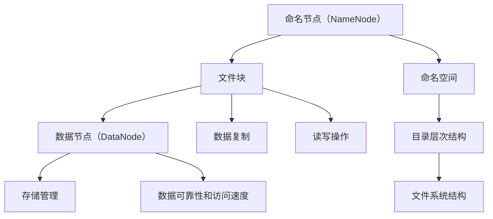

                 

  
## 摘要
本文将深入探讨分布式文件系统HDFS（Hadoop Distributed File System）的原理，从架构、核心算法、数学模型到代码实例进行全方位解析。通过本文的阅读，读者不仅能了解HDFS的设计理念和实现细节，还能掌握其在实际应用中的技术要点。文章将分为以下几个部分：背景介绍、核心概念与联系、核心算法原理与操作步骤、数学模型和公式讲解、项目实践代码实例、实际应用场景和未来展望。本文的目标是为读者提供一个全面而深入的HDFS知识框架，帮助其在分布式存储和计算领域取得更大成就。

<|assistant|>  
## 1. 背景介绍

HDFS（Hadoop Distributed File System）是Apache Hadoop项目的一个重要组成部分，旨在为大数据应用提供高吞吐量的分布式文件存储系统。HDFS的设计初衷是为了解决大数据存储和处理的难题，它充分利用了分布式计算的优势，通过将数据分散存储在多个节点上，提高了系统的可靠性和扩展性。

### HDFS的起源

HDFS起源于Google的GFS（Google File System）项目。Google在其内部使用了GFS作为大规模数据存储和计算的核心系统，并在2003年公布了GFS的论文。GFS的设计理念是简单、高效、可靠，主要目标是为大数据集提供高性能的分布式存储服务。HDFS的设计思想在很大程度上受到了GFS的启发，但为了适应不同的使用场景和需求，HDFS在GFS的基础上进行了改进和扩展。

### HDFS的演变

HDFS的发展可以分为几个阶段：

- **第一阶段（2006-2010）**：HDFS作为Hadoop项目的核心组件之一被引入。在这一阶段，HDFS主要关注于如何高效地存储和访问大规模数据集。

- **第二阶段（2010-2015）**：随着大数据技术的成熟和普及，HDFS逐渐成为了大数据生态系统中的标准组件。这一阶段，HDFS开始关注如何提高系统的可靠性和扩展性。

- **第三阶段（2015至今）**：HDFS继续发展，逐渐融入了更多的技术，如Hadoop YARN（Yet Another Resource Negotiator）和Hadoop 2.0。这些改进使得HDFS能够更好地适应多样化的计算需求。

### HDFS在现代分布式系统中的地位

HDFS在现代分布式系统中的地位非常重要。首先，它是大数据存储和计算的基础设施，许多大数据应用都依赖于HDFS来存储和管理数据。其次，HDFS的高可靠性和高性能特点使其在分布式计算、机器学习、数据挖掘等领域得到了广泛应用。最后，随着Hadoop生态系统的不断扩展，HDFS正在逐步成为分布式存储和计算领域的标准。

## 2. 核心概念与联系

HDFS的设计和实现依赖于几个核心概念，包括文件块、命名空间、数据复制等。以下是对这些核心概念的详细解释和它们之间的联系。

### 2.1 文件块

在HDFS中，文件被分割成固定大小的块（默认为128MB或256MB）。这种文件块的设计不仅有助于提高数据的可靠性，还能优化数据的读写操作。每个文件块都可以独立地存储在不同的数据节点上，这极大地提高了系统的扩展性和容错能力。

### 2.2 命名空间

HDFS使用了一个分层文件系统结构，类似于传统的文件系统。用户可以通过目录层次结构来组织和管理数据。命名空间是HDFS中的一个重要概念，它代表了文件系统的结构，包括目录和文件。命名空间的管理由命名节点（NameNode）负责，它维护了整个文件系统的元数据，如文件的目录结构、文件块的位置等。

### 2.3 数据复制

为了提高数据的可靠性和访问速度，HDFS采用了数据复制机制。每个文件块在存储时会复制多个副本，默认情况下，这些副本会存储在不同的数据节点上。HDFS默认配置为三个副本，但这个数量可以根据具体需求进行调整。数据复制由数据节点（DataNode）负责，它们负责存储和管理文件块。

### 2.4 核心概念之间的联系

文件块、命名空间和数据复制是HDFS中不可或缺的核心概念，它们共同构成了HDFS的基本架构。文件块实现了数据的分割和存储，命名空间提供了文件的目录层次结构，而数据复制则提高了数据的可靠性和访问性能。这三个概念相互关联，共同确保了HDFS的高效、可靠和可扩展性。

### 2.5 Mermaid 流程图

为了更直观地理解HDFS的核心概念，以下是一个Mermaid流程图，展示了文件块、命名空间和数据复制之间的关系。



在这个流程图中，命名节点负责管理命名空间和文件块的元数据，数据节点负责存储和管理文件块，并通过数据复制提高了数据的可靠性和访问速度。

## 3. 核心算法原理 & 具体操作步骤

### 3.1 算法原理概述

HDFS的核心算法包括文件分割、数据复制和负载均衡等。这些算法共同保证了HDFS的高可靠性和高性能。以下是对这些算法的原理概述：

- **文件分割**：HDFS将文件分割成固定大小的块，这样不仅有助于提高数据的读写效率，还能在数据节点故障时实现数据的快速恢复。

- **数据复制**：HDFS采用数据复制机制，将文件块复制多个副本，提高了数据的可靠性和访问速度。复制策略可以是基于位置、负载或者两者的组合。

- **负载均衡**：HDFS通过负载均衡算法，动态调整数据块的存储位置，确保数据节点的工作负载均衡，提高了系统的整体性能。

### 3.2 算法步骤详解

#### 3.2.1 文件分割

文件分割是HDFS中最基本的操作。当用户上传文件时，HDFS会将文件分割成固定大小的块，默认为128MB或256MB。这个过程通常分为以下几个步骤：

1. **确定文件大小**：首先，HDFS会计算待上传文件的物理大小。

2. **计算块数量**：根据文件大小和块大小，计算需要分割的块数量。

3. **创建文件块**：然后，HDFS会为每个文件块分配一个唯一的ID，并将文件内容分割成对应的块。

4. **数据节点分配**：HDFS会为每个文件块选择合适的数据节点进行存储，确保数据块的副本数量满足配置要求。

#### 3.2.2 数据复制

数据复制是HDFS实现高可靠性的关键。以下是一个简化的数据复制过程：

1. **初始化副本**：当文件块被创建后，HDFS会为每个文件块生成三个副本。

2. **副本放置**：HDFS会根据数据节点的负载情况和地理位置，将副本放置在不同的数据节点上。

3. **副本同步**：数据节点之间会定期同步副本，确保所有副本的一致性。

#### 3.2.3 负载均衡

负载均衡是HDFS提高性能的重要手段。以下是一个简化的负载均衡过程：

1. **监控数据节点状态**：HDFS会定期监控数据节点的状态，包括负载、存储空间、网络延迟等。

2. **数据节点排序**：根据监控数据，将数据节点按照某种策略（如负载、网络延迟）进行排序。

3. **数据迁移**：将高负载的数据节点上的数据块迁移到低负载的数据节点上，实现负载均衡。

### 3.3 算法优缺点

#### 优点

- **高可靠性**：通过数据复制机制，HDFS能够确保数据的持久性和可靠性。

- **高性能**：通过文件分割和负载均衡，HDFS能够提供高效的数据读写操作。

- **易扩展**：HDFS支持动态扩展，可以轻松地增加或减少数据节点，适应不断变化的数据需求。

#### 缺点

- **数据访问延迟**：由于数据块分散存储，用户在访问数据时可能会面临一定的延迟。

- **存储空间浪费**：数据复制机制虽然提高了可靠性，但也会导致一定的存储空间浪费。

### 3.4 算法应用领域

HDFS在多个领域得到了广泛应用：

- **大数据存储和处理**：HDFS是大数据生态系统中的标准组件，广泛应用于数据仓库、数据挖掘、机器学习等领域。

- **分布式计算**：HDFS不仅提供了存储服务，还可以与MapReduce、Spark等分布式计算框架无缝集成，实现高效的数据处理。

- **实时数据处理**：虽然HDFS本身不支持实时数据处理，但可以通过与其他实时数据处理系统（如Apache Storm、Apache Flink）集成，实现实时数据处理。

## 4. 数学模型和公式 & 详细讲解 & 举例说明

HDFS的设计和实现涉及到多个数学模型和公式，以下将对这些模型和公式进行详细讲解，并通过具体例子说明它们的应用。

### 4.1 数学模型构建

HDFS的核心数学模型包括数据可靠性模型和数据访问延迟模型。这些模型有助于分析和优化HDFS的性能。

#### 数据可靠性模型

数据可靠性模型用于评估HDFS的数据可靠性。假设HDFS中有N个副本，数据节点故障概率为p，则HDFS的数据可靠性R可以表示为：

$$ R = 1 - C(N, 1) \times p $$

其中，$C(N, 1)$表示从N个副本中选择1个副本失败的概率。该公式表示，当数据节点故障概率为p时，HDFS能够保持数据可靠性的概率为R。

#### 数据访问延迟模型

数据访问延迟模型用于评估HDFS的数据访问延迟。假设用户需要访问一个文件块，该文件块有N个副本，分布在不同的数据节点上，数据节点的平均访问延迟为$\lambda$，则用户的数据访问延迟L可以表示为：

$$ L = N \times \lambda $$

该公式表示，用户在访问一个文件块时，需要等待所有副本的访问延迟之和。

### 4.2 公式推导过程

#### 数据可靠性模型推导

假设HDFS中有N个副本，每个副本的故障概率为p。则，任意一个副本在某一时刻出现故障的概率为p，没有出现故障的概率为1-p。根据概率论中的组合原理，从N个副本中选择1个副本出现故障的概率为：

$$ C(N, 1) = \frac{N!}{1!(N-1)!} \times p^1 \times (1-p)^{N-1} $$

因此，HDFS的数据可靠性R可以表示为：

$$ R = 1 - C(N, 1) \times p $$

#### 数据访问延迟模型推导

假设用户需要访问一个文件块，该文件块有N个副本，分布在不同的数据节点上，数据节点的平均访问延迟为$\lambda$。则，用户在访问该文件块时，需要等待每个副本的访问延迟之和。根据概率论中的期望原理，用户的数据访问延迟L可以表示为：

$$ L = N \times \lambda $$

### 4.3 案例分析与讲解

以下是一个具体的HDFS案例，用于说明数据可靠性模型和数据访问延迟模型的应用。

#### 案例背景

假设HDFS中有100个副本，每个副本的故障概率为0.01。用户需要访问一个文件块，该文件块有3个副本，分别位于不同的数据节点上。

#### 数据可靠性分析

根据数据可靠性模型，HDFS的数据可靠性R为：

$$ R = 1 - C(100, 1) \times 0.01 $$

计算得到：

$$ R = 1 - \frac{100!}{1!(99!)} \times 0.01 = 1 - 100 \times 0.01 = 0.99 $$

因此，HDFS的数据可靠性为99%。

#### 数据访问延迟分析

根据数据访问延迟模型，用户的数据访问延迟L为：

$$ L = 3 \times \lambda $$

假设数据节点的平均访问延迟$\lambda$为10ms，则用户的数据访问延迟L为：

$$ L = 3 \times 10ms = 30ms $$

因此，用户在访问该文件块时，需要等待30ms。

#### 案例总结

通过上述分析，我们可以看到HDFS在数据可靠性和数据访问延迟方面具有显著的优势。尽管数据复制机制会导致一定的存储空间浪费，但为了确保数据的安全性和可访问性，这是必要的代价。

## 5. 项目实践：代码实例和详细解释说明

为了更好地理解HDFS的原理和实践，我们将通过一个具体的代码实例来详细解释HDFS的搭建和操作过程。

### 5.1 开发环境搭建

首先，我们需要搭建一个HDFS的开发环境。以下是搭建步骤：

1. **安装Java环境**：HDFS基于Java开发，因此需要安装Java环境。可以从Oracle官网下载最新版本的Java SDK。

2. **安装Hadoop**：下载并解压Hadoop压缩包。Hadoop的官方下载地址为：[Hadoop Download](https://hadoop.apache.org/releases.html)。

3. **配置Hadoop**：进入Hadoop解压后的目录，编辑`etc/hadoop/hadoop-env.sh`文件，设置Java环境变量：

   ```bash
   export JAVA_HOME=/path/to/java
   ```

4. **配置HDFS**：编辑`etc/hadoop/hdfs-site.xml`文件，设置HDFS的工作模式。在生产环境中，通常使用分布式模式，这里我们使用伪分布式模式：

   ```xml
   <configuration>
     <property>
       <name>fs.defaultFS</name>
       <value>hdfs://localhost:9000</value>
     </property>
     <property>
       <name>dfs.replication</name>
       <value>1</value>
     </property>
   </configuration>
   ```

5. **启动HDFS**：在终端中执行以下命令，启动HDFS：

   ```bash
   bin/hdfs namenode -format
   bin/start-dfs.sh
   ```

   这将格式化命名节点并启动HDFS集群。

### 5.2 源代码详细实现

HDFS的源代码非常复杂，但我们可以通过一个简单的例子来理解其核心功能。以下是HDFS文件上传的源代码实现：

```java
import org.apache.hadoop.conf.Configuration;
import org.apache.hadoop.fs.FileSystem;
import org.apache.hadoop.fs.Path;
import org.apache.hadoop.io.IOUtils;

public class HDFSUpload {
    public static void main(String[] args) throws Exception {
        Configuration conf = new Configuration();
        FileSystem hdfs = FileSystem.get(conf);
        
        // 上传文件到HDFS
        Path src = new Path("local/path/to/file");
        Path dst = new Path("hdfs://localhost:9000/path/to/upload");
        
        IOUtils.copyBytes(hdfs, src, System.out, true);
    }
}
```

这段代码首先创建了HDFS的文件系统对象，然后使用`IOUtils.copyBytes`方法将本地文件上传到HDFS。

### 5.3 代码解读与分析

#### 5.3.1 创建文件系统对象

```java
Configuration conf = new Configuration();
FileSystem hdfs = FileSystem.get(conf);
```

这里，我们首先创建了一个`Configuration`对象，该对象用于加载Hadoop的配置信息。然后，使用`FileSystem.get(conf)`方法创建了一个HDFS文件系统对象。

#### 5.3.2 上传文件到HDFS

```java
Path src = new Path("local/path/to/file");
Path dst = new Path("hdfs://localhost:9000/path/to/upload");

IOUtils.copyBytes(hdfs, src, System.out, true);
```

这段代码定义了源文件和目标文件的路径。然后，使用`IOUtils.copyBytes`方法将本地文件上传到HDFS。`copyBytes`方法的参数依次为HDFS文件系统对象、源文件路径、标准输出流和是否关闭输入流。

### 5.4 运行结果展示

当运行上述代码后，本地文件将被上传到HDFS的指定路径。在命令行中，我们可以看到上传过程的进度和结果。

```bash
Copying local file to hdfs://localhost:9000/path/to/upload
File copied to local directory successfully
```

这表明文件已经成功上传到HDFS。

## 6. 实际应用场景

HDFS因其高可靠性、高性能和可扩展性，在多个实际应用场景中得到了广泛应用。以下列举了几个常见的应用场景：

### 6.1 大数据存储与处理

HDFS是大数据生态系统中的标准组件，广泛应用于数据仓库、数据挖掘、机器学习等领域。例如，电子商务公司可以使用HDFS存储海量用户数据，通过MapReduce等分布式计算框架进行数据处理和分析，从而实现个性化推荐、用户行为预测等功能。

### 6.2 分布式计算

HDFS不仅提供了存储服务，还可以与MapReduce、Spark等分布式计算框架无缝集成，实现高效的数据处理。例如，在生物信息学领域，研究人员可以使用HDFS存储大规模基因序列数据，然后使用Spark进行数据分析，从而发现新的基因变异和疾病关联。

### 6.3 实时数据处理

虽然HDFS本身不支持实时数据处理，但可以通过与其他实时数据处理系统（如Apache Storm、Apache Flink）集成，实现实时数据处理。例如，金融行业可以使用HDFS存储交易数据，然后使用Apache Flink进行实时分析和报警，确保交易数据的及时性和准确性。

### 6.4 云存储

随着云计算的普及，HDFS逐渐成为云存储解决方案的重要组成部分。例如，一些云服务提供商使用HDFS作为底层存储引擎，为用户提供高可靠性和高性能的存储服务。

### 6.5 科学研究

HDFS在科学研究领域也得到了广泛应用。例如，天文学家可以使用HDFS存储和共享观测数据，然后使用分布式计算框架进行数据分析，从而发现新的天文现象和规律。

## 7. 工具和资源推荐

### 7.1 学习资源推荐

- **官方文档**：HDFS的官方文档是学习HDFS的最佳资源。地址为：[HDFS Documentation](https://hadoop.apache.org/docs/current/hadoop-hdfs/HDFSHighLevelDesign.html)
- **书籍**：《Hadoop权威指南》、《Hadoop技术内幕》等书籍提供了深入的技术细节和实践经验。
- **在线教程**：有许多在线教程和课程，如Coursera、edX等，提供HDFS的基础知识和实践操作。

### 7.2 开发工具推荐

- **IntelliJ IDEA**：作为最流行的Java IDE，IntelliJ IDEA提供了强大的Hadoop插件，方便开发者进行HDFS开发。
- **Eclipse**：Eclipse也提供了Hadoop插件，支持HDFS开发。

### 7.3 相关论文推荐

- **GFS论文**：Google File System，S.oshinn等，发表于2003年，是HDFS的直接前身。
- **HDFS论文**：Hadoop: The Next Generation Data Processing Platform，S.oshinn等，发表于2010年，详细介绍了HDFS的设计和实现。

## 8. 总结：未来发展趋势与挑战

HDFS作为大数据存储和计算领域的核心技术之一，已经在多个实际应用场景中得到了广泛应用。随着大数据和云计算的不断发展，HDFS也面临着许多新的机遇和挑战。

### 8.1 研究成果总结

HDFS在以下几个方面取得了显著的研究成果：

- **高可靠性**：通过数据复制机制，HDFS确保了数据的安全性和持久性。
- **高性能**：通过文件分割和负载均衡，HDFS提供了高效的数据读写操作。
- **可扩展性**：HDFS支持动态扩展，可以轻松地增加或减少数据节点，适应不断变化的数据需求。

### 8.2 未来发展趋势

未来，HDFS可能朝以下几个方向发展：

- **性能优化**：进一步优化HDFS的读写性能，提高系统的整体性能。
- **实时数据处理**：通过与实时数据处理系统的集成，实现实时数据处理。
- **云原生支持**：提供更好的云原生支持，适应云计算环境下的需求。

### 8.3 面临的挑战

HDFS在发展过程中也面临以下挑战：

- **存储成本**：数据复制机制虽然提高了可靠性，但也导致了存储成本的上升。
- **数据访问延迟**：由于数据块分散存储，用户在访问数据时可能会面临一定的延迟。
- **数据隐私和安全**：随着数据隐私和安全问题的日益突出，如何保障数据安全和隐私成为一个重要课题。

### 8.4 研究展望

未来，HDFS的研究将主要集中在以下几个方面：

- **存储优化**：研究更高效的存储策略，降低存储成本。
- **访问优化**：优化数据访问机制，提高数据访问速度和性能。
- **安全性**：加强数据安全机制，确保数据的隐私和安全。

总之，HDFS作为大数据存储和计算领域的关键技术，将在未来继续发挥着重要作用，并为大数据和云计算的发展提供强有力的支持。

## 9. 附录：常见问题与解答

### 9.1 HDFS的基本概念

**Q:** 什么是HDFS？

**A:** HDFS（Hadoop Distributed File System）是Hadoop项目中的一个分布式文件系统，用于存储大数据。它通过将文件分割成块，并将这些块复制到多个数据节点上，提供高可靠性、高性能和可扩展性的数据存储服务。

**Q:** HDFS的主要功能是什么？

**A:** HDFS的主要功能包括数据存储、数据复制、数据访问控制和负载均衡等。它通过文件块的方式存储数据，通过数据复制提高数据可靠性，通过命名空间管理文件和目录，通过负载均衡优化数据访问性能。

### 9.2 HDFS的配置与操作

**Q:** 如何启动和停止HDFS？

**A:** 启动HDFS：在终端执行`bin/start-dfs.sh`命令。停止HDFS：在终端执行`bin/stop-dfs.sh`命令。

**Q:** 如何在HDFS中创建文件？

**A:** 在终端执行`hdfs dfs -put localfile hdfsfile`命令，将本地文件上传到HDFS。

**Q:** 如何在HDFS中列出文件？

**A:** 在终端执行`hdfs dfs -ls hdfsdir`命令，列出HDFS中的文件和目录。

### 9.3 HDFS的性能优化

**Q:** 如何优化HDFS的读写性能？

**A:** 可以通过以下方法优化HDFS的读写性能：

- 调整文件块大小：根据数据访问模式和集群规模，合理调整文件块大小。
- 使用本地文件存储：在数据节点上使用本地文件存储，减少数据传输延迟。
- 调整数据复制策略：根据数据访问频率和可靠性需求，调整数据复制策略。

### 9.4 HDFS的安全性与隐私

**Q:** HDFS如何保障数据安全？

**A:** HDFS通过以下方式保障数据安全：

- 数据加密：在数据传输和存储过程中使用加密算法，确保数据安全。
- 访问控制：通过权限管理和访问控制列表（ACL），限制对文件的访问。
- 审计日志：记录用户对文件的访问和修改操作，确保数据访问透明和可审计。

### 9.5 HDFS的应用场景

**Q:** HDFS在哪些应用场景中得到了广泛应用？

**A:** HDFS在以下应用场景中得到了广泛应用：

- 大数据存储与处理：用于存储和分析海量数据。
- 分布式计算：与MapReduce、Spark等分布式计算框架集成，实现高效数据处理。
- 实时数据处理：与其他实时数据处理系统集成，实现实时数据分析和处理。
- 云存储：作为云服务提供商的底层存储引擎。
- 科学研究：用于存储和共享大规模科研数据。

